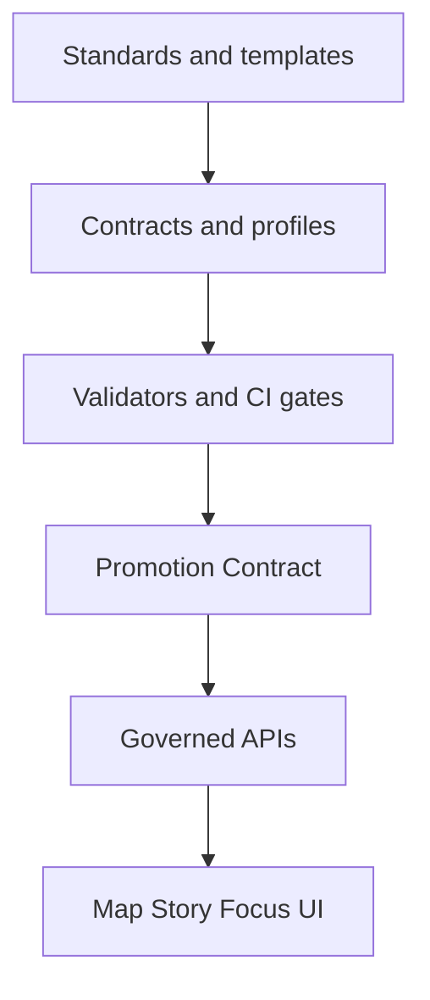

# KFM Standards
Canonical, governed standards for documentation, metadata profiles, and repository conventions used across KFM.

**Status:** draft  
**Owners:** Docs team (see CODEOWNERS)  
`scope: docs` `scope: metadata` `enforcement: CI` `policy: governed` `principle: contract-first` `principle: evidence-first`

- [Purpose](#purpose)
- [What lives here](#what-lives-here)
- [How standards are enforced](#how-standards-are-enforced)
- [Required metadata for standards docs](#required-metadata-for-standards-docs)
- [Non-negotiables these standards support](#non-negotiables-these-standards-support)
- [Change workflow](#change-workflow)
- [Pull request checklist](#pull-request-checklist)
- [References](#references)

---

## Purpose

`docs/standards/` is the canonical home for **project-wide** standards that other parts of the system depend on:
- doc authoring conventions
- repo structure conventions
- STAC / DCAT / PROV profiles and their required fields
- (optionally) other cross-cutting contracts and naming rules

Standards are “production docs”: changes can affect what gets published, what is discoverable, and what the UI/API may legally and ethically serve.

([back to top](#kfm-standards))

---

## What lives here

Expected contents (based on the repo doc map):

```text
docs/
└── standards/
    ├── README.md
    ├── KFM_MARKDOWN_WORK_PROTOCOL.md
    ├── KFM_REPO_STRUCTURE_STANDARD.md
    ├── KFM_STAC_PROFILE.md
    ├── KFM_DCAT_PROFILE.md
    └── KFM_PROV_PROFILE.md

docs/
└── templates/
    ├── TEMPLATE__KFM_UNIVERSAL_DOC.md
    ├── TEMPLATE__STORY_NODE_V3.md
    └── TEMPLATE__API_CONTRACT_EXTENSION.md
```

### Standards registry

| Standard | File | What it governs | Used by |
|---|---|---|---|
| Markdown work protocol | `docs/standards/KFM_MARKDOWN_WORK_PROTOCOL.md` | How we write docs (structure, citations, diagrams, review gates) | All docs, Story Nodes |
| Repo structure standard | `docs/standards/KFM_REPO_STRUCTURE_STANDARD.md` | Canonical folder homes; “one source of truth per subsystem” | Maintainers, CI checks |
| STAC profile | `docs/standards/KFM_STAC_PROFILE.md` | Asset-level spatial/temporal metadata expectations | Catalog generation + validation |
| DCAT profile | `docs/standards/KFM_DCAT_PROFILE.md` | Dataset discovery + distribution expectations | Catalog generation + validation |
| PROV profile | `docs/standards/KFM_PROV_PROFILE.md` | Lineage expectations (activities, agents, entities) | Provenance generation + validation |

If you add a new standard, update:
1) this README registry table  
2) any validators / schemas that enforce it  
3) the Master Guide references (if required)

([back to top](#kfm-standards))

---

## How standards are enforced

Standards are not “style preferences.” They are enforced through **automated CI gates**:
- Contributions that violate invariants (e.g., missing required provenance artifacts, broken links, or sensitive info leaks) should fail CI.  
- Publishing/promotion is intended to be **fail-closed** unless required artifacts exist and validate.

If you can’t express a standard as:
- a schema (JSON Schema, OpenAPI, etc.),
- a validator, and/or
- a CI check,

…then treat it as “guidance,” not “policy,” and label it accordingly.

([back to top](#kfm-standards))

---

## Required metadata for standards docs

KFM uses **MetaBlock v2** for structured doc metadata **without YAML frontmatter**.

### MetaBlock v2

Every standards document in this folder should begin with a `[KFM_META_BLOCK_V2]` block.

Minimal example:

```text
[KFM_META_BLOCK_V2]
doc_id: kfm://doc/<uuid>
title: <Title>
type: standard
version: v1
status: draft|review|published
owners: <team or names>
created: YYYY-MM-DD
updated: YYYY-MM-DD
policy_label: public|restricted|...
related:
  - <repo-relative path or kfm:// identifiers>
tags:
  - kfm
notes:
  - <short notes>
[/KFM_META_BLOCK_V2]
```

Guidelines (do not skip):
- `doc_id` must be stable; **do not regenerate on edits**
- `updated` should change on meaningful edits
- `policy_label` should reflect intended visibility if docs are served through governed APIs

([back to top](#kfm-standards))

---

## Non-negotiables these standards support

This folder exists to make these system rules implementable and reviewable:

### Trust membrane and architecture boundaries
- **Frontend must not** fetch data directly from object storage or databases (“trust membrane” rule).  
- Domain logic should not talk directly to infrastructure; it must go through interface contracts.

### Promotion and publishing are fail-closed
- Promotion/publishing should be blocked unless artifacts exist and validate (catalogs, lineage, policy label assignment, etc.).

### Focus Mode and Story Nodes must be evidence-led
- Focus Mode should only display **provenance-linked** content; no unsourced narrative.
- AI assistance in Focus Mode should be opt-in, labeled, and constrained by evidence.
- Sensitive locations should not be exposed via narrative + map as a side-channel.

These constraints are implemented by:
- profiles (STAC/DCAT/PROV)
- policy labeling standards
- doc templates and review gates
- CI validation and link integrity checks

([back to top](#kfm-standards))

---

## Change workflow

### When you should edit a standards file
Edit a standards file when you are changing project-wide expectations (not a single dataset’s implementation), such as:
- required catalog fields
- new policy labels and obligations
- new provenance minimums
- directory placement conventions
- doc template requirements

### Proposed minimum workflow for standards changes
> This section is a **proposed** workflow; tighten it once CI gates exist.

1. Update the relevant `docs/standards/*.md` file.
2. If it changes a machine contract, update the matching schema(s) in `schemas/`.
3. Add/adjust validator tests and fixtures so CI enforces the rule.
4. Add a short “Migration notes” section to the standard if it is breaking.
5. Ensure link checks pass and any examples are runnable or explicitly marked as illustrative.

([back to top](#kfm-standards))

---

## Pull request checklist

Use this checklist for any PR that edits a standards document:

- [ ] MetaBlock v2 present and updated (`doc_id` stable; `updated` bumped)
- [ ] “What changed” section added (1–5 bullets)
- [ ] “Why” section added (brief rationale + tradeoffs)
- [ ] Validation steps listed and repeatable
- [ ] Any new requirements are backed by:
  - [ ] a schema update, and/or
  - [ ] a validator / CI gate, and/or
  - [ ] a clearly labeled “guidance only” note
- [ ] Governance / FAIR+CARE / sovereignty impacts stated (even if “none”)
- [ ] No sensitive location leakage introduced (examples, screenshots, coords)
- [ ] Links verified; no broken references

([back to top](#kfm-standards))

---

## References

Primary in-repo references (expected):
- `docs/MASTER_GUIDE_v13.md`
- `docs/governance/ROOT_GOVERNANCE.md`
- `docs/governance/ETHICS.md`
- `docs/governance/SOVEREIGNTY.md`
- `docs/governance/REVIEW_GATES.md`

Templates (expected):
- `docs/templates/TEMPLATE__KFM_UNIVERSAL_DOC.md`
- `docs/templates/TEMPLATE__STORY_NODE_V3.md`
- `docs/templates/TEMPLATE__API_CONTRACT_EXTENSION.md`

---

<details>
<summary>Appendix: How standards relate to the pipeline</summary>



</details>
