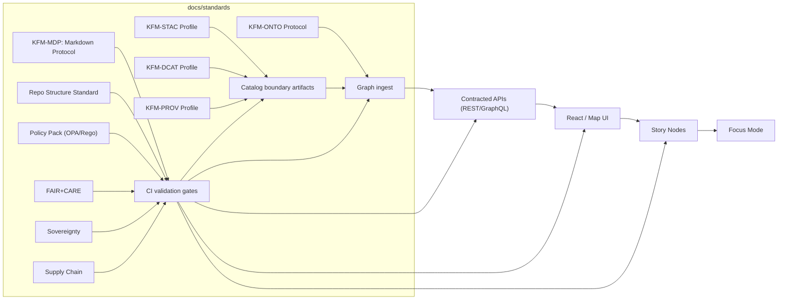

# 🧱 `docs/standards/` — KFM governed standards


This directory is the canonical home for **KFM standards, protocols, and profiles** that keep the platform consistent across the full pipeline:

**ETL → STAC/DCAT/PROV catalogs → Neo4j graph → APIs → UI → Story Nodes → Focus Mode.**

> [!IMPORTANT]
> Some legacy module footers link to `docs/standards/INDEX.md`.  
> Going forward, **prefer linking to `docs/standards/README.md`**. If `INDEX.md` exists, treat it as an alias/redirect stub.

<details>
<summary>🧭 Quick nav</summary>

- [📘 Overview](#overview)
- [🚦 Normative vs advisory](#normative-vs-advisory)
- [🧬 Canonical invariants](#canonical-invariants)
- [🧷 Versioning & integrity](#versioning-and-integrity)
- [📚 Standards catalog](#standards-catalog)
- [📦 Data & metadata](#data-and-metadata)
- [🌐 STAC, DCAT & PROV alignment](#stac-dcat-prov-alignment)
- [🧱 Architecture & subsystem contracts](#architecture-and-subsystem-contracts)
- [⚖ FAIR+CARE & sovereignty](#fair-care-and-sovereignty)
- [📦 Key artifacts](#key-artifacts)
- [🗂️ Directory layout](#directory-layout)
- [🔐 Governance & policy-as-code](#governance-and-policy-as-code)
- [🧪 Validation & CI/CD](#validation-and-cicd)
- [🧠 Story Nodes & Focus Mode](#story-nodes-and-focus-mode)
- [🗺️ Diagrams](#diagrams)
- [🕰️ Version history](#version-history)
- [Appendix: Reference libraries](#appendix-reference-libraries)

</details>

---

<a id="overview"></a>

## 📘 Overview

### Purpose 🎯

- Provide a **single, governed index** for the standards that shape KFM artifacts (data, catalogs, graph, APIs, UI, narratives).
- Make it explicit what is **normative** (must follow) vs. **advisory** (recommended).
- Enable “contract-first” development: what must be **versioned**, **validated**, and **reviewed** before merge.

### Scope 🧭

| ✅ In scope | ❌ Out of scope |
|---|---|
| Documentation protocol (KFM-MDP), templates, link hygiene | Domain narrative content (belongs under `docs/data/<domain>/` or `docs/reports/`) |
| Repository structure & placement rules | Subsystem implementation details (belongs under `src/` + subsystem docs) |
| Catalog profiles (STAC/DCAT/PROV) + schema registry | Raw datasets themselves (belongs under `data/raw/`) |
| Graph ontology governance (labels/edges, ingest invariants) | UI copy decks & marketing assets |
| FAIR+CARE + sovereignty rules as they affect publication | Private ops runbooks/secrets (never in repo) |

### Audience 👥

- **Primary:** maintainers, reviewers, and contributors touching governed artifacts (data, catalogs, graph, API, UI, story nodes).
- **Secondary:** downstream consumers who need to understand how KFM guarantees provenance, ethics, and reproducibility.

### Definitions 📚

- **Standard:** governed rules for *shape, naming, storage, review*.
- **Protocol:** a *normative* process/format expected to be enforced (CI/tooling/review).
- **Profile:** KFM alignment to an external standard (e.g., STAC 1.0, DCAT 3, W3C PROV-O).
- **Contract:** machine-validatable schema/spec producers & consumers agree on (often under `schemas/`).
- **Boundary artifact:** the minimal output that allows the next pipeline stage to consume safely (e.g., STAC/DCAT/PROV records).

> [!NOTE]
> Glossary location varies by subsystem. Preferred: `docs/glossary.md` (or a `docs/glossary/` folder).  
> If missing, create it using KFM-MDP and link it here.

---

<a id="normative-vs-advisory"></a>

## 🚦 Normative vs advisory

### Normative (MUST) ✅

**Normative** standards are enforceable by **CI**, **policy-as-code**, or **review gates**.  
Breaking them must fail the build (or require an approved waiver).

Examples:
- “No mystery layers”: data cannot be published without a contract + provenance.
- API boundary: UI does not query databases directly.
- Story nodes must include citations for factual claims.

### Advisory (SHOULD) 👍

**Advisory** guidance describes preferred patterns and ergonomics.  
It can evolve without breaking builds, but should still be followed unless there’s a reason.

Examples:
- Recommended story pacing patterns.
- Suggested visualization defaults.
- Preferred authoring workflows.

---

<a id="canonical-invariants"></a>

## 🧬 Canonical invariants

These are the **non-negotiables** that standards protect.

> [!IMPORTANT]
> If you change anything below, you are changing KFM’s *trust model* — treat it as a governed change and expect review.

### Pipeline order is canonical 🧷

1. **ETL & normalization**
2. **Catalog boundary artifacts:** STAC / DCAT / PROV
3. **Graph ingest:** Neo4j references back to catalogs (graph is *not* the provenance source-of-truth)
4. **API layer:** contracts + redaction + authZ
5. **UI layer:** React + MapLibre (optional Cesium)
6. **Story Nodes:** governed narratives
7. **Focus Mode:** provenance-linked context bundle

### “No mystery layers” 🔍

- Every dataset must ship with a **data contract** (metadata JSON) that includes **source, license, spatial/temporal extent, and processing steps**.
- Data is not “official” until its **catalog boundary artifacts** exist (STAC/DCAT/PROV).
- Anything without provenance is *not publishable*.

### Detect → Validate → Promote ✅➡️🧪➡️🚀

- KFM favors a **“Detect → Validate → Promote”** flow:
  - *Detect* and ingest raw data,
  - *Validate* contracts + policies + schemas,
  - *Promote* only when boundary artifacts exist and rules pass.
- “Promote” is a governed operation — no side-door publishing.

### API boundary 🧱

- The UI **must never** query Neo4j/PostGIS directly.
- If the UI needs new graph data, the correct change is: **extend the API contract** (then implement + test).

### Provenance-first narratives ⛓️

- Focus Mode answers **always cite sources** and refuse when sources are missing.
- Story Nodes may be narrative, but they are still **governed artifacts** with citations, provenance links, and sensitivity controls.

### Context-aware explainability (Focus Mode) 🧭🔎

- Focus Mode is allowed to use **user UI context** (active layers, viewport, time slider, selected feature), *but*:
  - it must cite data sources,
  - it must surface any governance flags (sensitivity, licensing),
  - and it must refuse if the answer would require inference beyond approved data.

### Streaming & simulations still follow the rules 🌊🧪

- Streaming data is “many small datasets over time” → it still needs **stub provenance** before UI display.
- Simulation runs (e.g., `kfm-sim-run-*`) must be treated as **evidence artifacts** with full lineage, not ad-hoc outputs.

---

<a id="versioning-and-integrity"></a>

## 🧷 Versioning & integrity

### Versioning expectations (SemVer) 🧮

- **Docs & standards:** SemVer (`vMAJOR.MINOR.PATCH`)
  - **MAJOR**: breaking rule change / contract change
  - **MINOR**: additive rules/sections (backward-compatible)
  - **PATCH**: clarifications & typos
- **Profiles (STAC/DCAT/PROV):** version pinning is required in doc front matter.
- **Standards that impact public outputs** must be treated as governed changes (reviewed, versioned).

### Compatibility pins 🔩

| Layer | Current pin | Notes |
|---|---:|---|
| Markdown protocol | `KFM-MDP v11.2.6` | governs all Markdown under `docs/` |
| Ontology protocol | `KFM-ONTO v4.1.0` | governs graph labels/edges + mapping invariants |
| Pipeline contract | `KFM-PPC v11.0.0` | defines stage ordering + boundary artifacts |
| STAC profile | `KFM-STAC v11.0.0` | governs `data/stac/**` |
| DCAT profile | `KFM-DCAT v11.0.0` | governs `data/catalog/dcat/**` |
| PROV profile | `KFM-PROV v11.0.0` | governs `data/prov/**` |

### Document integrity checksum 🧾

- `doc_integrity_checksum` is computed as **SHA-256 over this file with the checksum value blanked** (i.e., treat the value as empty after `sha256:`).
- This avoids the self-referential “hash includes itself” problem while still detecting any change to the document body.

---

<a id="standards-catalog"></a>

## 📚 Standards catalog

> [!TIP]
> This is an index, not a dumping ground. Keep details in the referenced standard docs; keep *discovery + links* here.

### Legend 🗝️

- **Enforced by:** 🧪 CI • 🛡️ Policy • 👀 Review • 🧾 Runtime logging
- **Status:** ✅ present • 🧩 stub/placeholder • 🧭 planned • 🧊 deprecated

### Core governance & trust 🔐

| Standard / Guide | Kind | Governs | Enforced by | Status |
|---|---|---|---|---|
| `docs/governance/ROOT_GOVERNANCE.md` | Governance | Authority, roles, review powers | 👀 | ✅ |
| `docs/governance/ETHICS.md` | Governance | Ethical constraints, AI usage boundaries | 👀🛡️ | ✅ |
| `docs/governance/SOVEREIGNTY.md` | Governance | CARE + sovereignty + sensitive location handling | 👀🛡️🧾 | ✅ |
| `api/scripts/policy/README.md` | Policy Pack | OPA/Rego rules (fail closed) + waivers | 🛡️🧪 | ✅ |

### Documentation standards 📝

| Standard / Guide | Kind | Governs | Enforced by | Status |
|---|---|---|---|---|
| `docs/standards/KFM_MARKDOWN_WORK_PROTOCOL.md` | Protocol (work) | Governed Markdown (front matter, sections, link rules) | 🧪👀 | ✅ |
| `docs/standards/kfm_markdown_protocol_v11.2.6.md` | Protocol (spec) | Version-pinned KFM-MDP validator spec | 🧪 | 🧩 |
| `docs/templates/TEMPLATE__KFM_UNIVERSAL_DOC.md` | Template | Default governed doc scaffold | 👀🧪 | ✅ |
| `docs/templates/TEMPLATE__STORY_NODE_V3.md` | Template | Story Node scaffold + citation expectations | 👀🧪 | ✅ |
| `docs/templates/TEMPLATE__API_CONTRACT_EXTENSION.md` | Template | Contract-first endpoint/schema changes | 👀🧪 | ✅ |
| `MARKDOWN_GUIDE_v13.md.gdoc` | Guide | Repo-wide doc conventions + diagrams | 👀 | ✅ |

### Repository & lifecycle placement 🗂️

| Standard / Guide | Kind | Governs | Enforced by | Status |
|---|---|---|---|---|
| `docs/standards/KFM_REPO_STRUCTURE_STANDARD.md` | Standard | Canonical roots + placement rules | 🧪👀 | 🧩 |
| `docs/MASTER_GUIDE_v13.md` | Guide (canonical) | End-to-end pipeline map + invariants | 👀 | ✅ |
| `schemas/README.md` | Registry | Schema & contract index | 🧪👀 | ✅ |
| `data/sources/` manifests | Standard (pattern) | Source manifests + immutability expectations | 🧪 | ✅ |

### Catalog profiles (boundary artifacts) 📦

| Standard / Guide | Kind | Governs | Enforced by | Status |
|---|---|---|---|---|
| `docs/standards/KFM_STAC_PROFILE.md` | Profile | STAC alignment + KFM extensions | 🧪🛡️ | 🧩 |
| `docs/standards/KFM_DCAT_PROFILE.md` | Profile | DCAT alignment + discovery mapping | 🧪🛡️ | 🧩 |
| `docs/standards/KFM_PROV_PROFILE.md` | Profile | PROV-O alignment + lineage bundles | 🧪🛡️ | 🧩 |

### Graph & ontology 🕸️

| Standard / Guide | Kind | Governs | Enforced by | Status |
|---|---|---|---|---|
| `docs/standards/KFM_ONTOLOGY_PROTOCOL.md` | Protocol | Ontology bindings + label/edge invariants | 🧪👀 | 🧩 |
| `src/graph/` constraints/migrations | Contract | Hard constraints on graph integrity | 🧪 | ✅ |

### API & contracts 🔌

| Standard / Guide | Kind | Governs | Enforced by | Status |
|---|---|---|---|---|
| `src/server/contracts/` (OpenAPI/GraphQL) | Contract | API boundary + response shapes + redaction | 🧪🛡️ | ✅ |
| `docs/standards/KFM_API_VERSIONING_STANDARD.md` | Standard | Back-compat rules & version bumps | 👀🧪 | 🧭 |

### UI transparency & accessibility 🧭✨

| Standard / Guide | Kind | Governs | Enforced by | Status |
|---|---|---|---|---|
| `web/` layer registry schema | Contract | Layer IDs, legends, required metadata fields | 🧪 | ✅ |
| `docs/standards/KFM_UI_PROVENANCE_SURFACING_STANDARD.md` | Standard | “Layer Info”, provenance panel, export attributions | 👀🧪 | 🧭 |
| `docs/standards/KFM_ACCESSIBILITY_STANDARD.md` | Standard | Keyboard nav, ARIA, high-contrast, alt text | 🧪👀 | 🧭 |

### Story Nodes & narrative artifacts 📖

| Standard / Guide | Kind | Governs | Enforced by | Status |
|---|---|---|---|---|
| `docs/standards/KFM_STORY_NODE_STANDARD.md` | Standard | Story markdown + step JSON + citations + layer refs | 🧪👀 | 🧭 |
| `docs/reports/story_nodes/` | Content root | Where governed narratives live | 🧪👀 | ✅ |

### AI / Focus Mode governance 🤖🧭

| Standard / Guide | Kind | Governs | Enforced by | Status |
|---|---|---|---|---|
| `docs/standards/KFM_FOCUS_MODE_PROTOCOL.md` | Protocol | RAG/citation rules, refusal behavior, audit panel | 🛡️🧪🧾 | 🧭 |
| `docs/standards/KFM_GOVERNANCE_LEDGER_STANDARD.md` | Standard | Append-only, signed log of AI outputs & approvals | 🧾🛡️ | 🧭 |
| `docs/standards/KFM_MODEL_QA_STANDARD.md` | Standard | Bias checks, drift monitoring, eval harness | 🧪👀 | 🧭 |

### Packaging & performance (geospatial) ⚡🗺️

| Standard / Guide | Kind | Governs | Enforced by | Status |
|---|---|---|---|---|
| `docs/standards/KFM_DATA_PACKAGING_STANDARD.md` | Standard | Deterministic packaging (GeoParquet + PMTiles + hashes) | 🧪🛡️ | 🧭 |
| `docs/standards/KFM_OFFLINE_PACK_STANDARD.md` | Standard | Offline packs (PMTiles/MBTiles + story subset + licenses) | 👀🧪 | 🧭 |

### Security & supply chain 🛡️

| Standard / Guide | Kind | Governs | Enforced by | Status |
|---|---|---|---|---|
| `.github/SECURITY.md` | Policy | Vulnerability reporting | 👀 | ✅ |
| `docs/standards/KFM_SUPPLY_CHAIN_STANDARD.md` | Standard | SBOM, attestations, SLSA posture | 🧪👀 | 🧭 |

---

<a id="data-and-metadata"></a>

## 📦 Data & metadata

### What standards govern ✅

- **Where artifacts live** (lifecycle roots, catalogs, graph artifacts, contracts, docs)
- **How artifacts are documented** (front matter, required sections, versioning)
- **How artifacts are interoperable** (STAC/DCAT/PROV alignment)
- **How artifacts are consumed safely** (API boundary, sovereignty rules, provenance requirements)

### Data lifecycle (default) 🔁

```text
data/raw/  →  data/work/  →  data/processed/  →  data/stac/
                          ↘  data/catalog/dcat/
                          ↘  data/prov/
```

### Source manifests 🧾

- External sources should have **manifests** under `data/sources/` so we can cite origin + licensing without requiring huge raw files in Git.
- Manifests become part of provenance bundles and attributions.

### Evidence artifacts 🧠➡️📦

- If the system produces derived outputs (analytics, ML extracts, summaries, simulations), those are first-class **evidence artifacts**.
- Evidence artifacts must:
  - live under `data/processed/`,
  - have STAC/DCAT/PROV records,
  - and be discoverable in the UI with source attribution.

---

<a id="stac-dcat-prov-alignment"></a>

## 🌐 STAC, DCAT & PROV alignment

### Minimum alignment expectation ✅

Every dataset/evidence product intended for downstream use should have:

- A **STAC Collection + STAC Item(s)** (spatiotemporal access + assets)
- A **DCAT mapping** for discovery (title/description/license/keywords minimum)
- A **PROV bundle** recording how outputs were produced (activities, agents, derivations)

### Version lineage rules 🧬

- New versions link predecessor/successor.
- Graph mirrors version lineage (do not create orphaned/untraceable entities).
- Catalogs are the provenance truth; graph references them.

---

<a id="architecture-and-subsystem-contracts"></a>

## 🧱 Architecture & subsystem contracts

KFM is intentionally **contract-first** and **boundary-driven** so every subsystem can evolve without breaking trust.

| Subsystem | Contract artifacts | “Do not break” rule |
|---|---|---|
| ETL | configs + run logs + validation reports | deterministic, replayable |
| Catalogs | STAC/DCAT/PROV profiles + schemas + validators | machine-validated boundary artifacts |
| Graph | ontology + migrations + constraints | stable labels/edges; references catalogs |
| APIs | OpenAPI/GraphQL contracts + tests | backward compat or version bump |
| UI | layer registry + a11y + audit affordances | no hidden data leakage |
| Story Nodes | markdown + step JSON + citations | no unsourced claims |
| Focus Mode | provenance-linked context bundle + audit logs | no hallucinated sources |

---

<a id="fair-care-and-sovereignty"></a>

## ⚖ FAIR+CARE & sovereignty

### Governance review triggers 🚨

- New sensitive layers or restricted locations
- New AI narrative behaviors or summarization outputs
- New external data sources
- New public-facing endpoints

### Sovereignty safety 🛡️

- Document redaction/generalization rules for any restricted locations.
- Do not “unmask” generalized locations in public-facing views.
- Classification and sensitivity must propagate into:
  - API redaction rules,
  - UI metadata panels,
  - exports (offline packs, story bundles).

---

<a id="key-artifacts"></a>

## 📦 Key artifacts

### If you are new here… start with these 🧑‍🚀

1. **Master Guide**: `docs/MASTER_GUIDE_v13.md`
2. **Schema registry**: `schemas/README.md`
3. **Markdown work protocol**: `docs/standards/KFM_MARKDOWN_WORK_PROTOCOL.md`
4. **Policy pack**: `api/scripts/policy/README.md`
5. **Templates**: `docs/templates/`

### “Boundary artifacts” checklist ✅

To publish a dataset/evidence product, you must produce:

- **Data product files** in `data/processed/<domain>/...`
- **STAC Collection + Items** in `data/stac/collections/` and `data/stac/items/`
- **DCAT dataset** in `data/catalog/dcat/`
- **PROV bundle** in `data/prov/`
- **Schema/contract compliance** recorded in CI

> [!NOTE]
> Streaming/real-time data is treated as “many small datasets over time” — it still needs **at least stub provenance** before UI display.

---

<a id="directory-layout"></a>

## 🗂️ Directory layout

### Where this document lives 📍

- `docs/standards/README.md`

### Related repository paths 🔗

| Artifact / Area | Path |
|---|---|
| Master Guide + documentation map | `docs/MASTER_GUIDE_v13.md` |
| Governed templates | `docs/templates/` |
| Data lifecycle roots | `data/raw/`, `data/work/`, `data/processed/` |
| Catalog outputs | `data/stac/`, `data/catalog/dcat/`, `data/prov/` |
| Source manifests | `data/sources/` |
| Graph build + ontology | `src/graph/` |
| Pipelines | `src/pipelines/` |
| API boundary + contracts | `src/server/` + `src/server/contracts/` |
| UI boundary | `web/` |
| Story Nodes | `docs/reports/story_nodes/` *(or `web/story_nodes/` if UI-hosted)* |
| MCP experiments & SOPs | `mcp/` |
| Security + policies | `.github/SECURITY.md`, `docs/security/` *(if present)* |

### Expected file tree (standards area) 🌳

```text
📁 docs/
└── 📁 standards/
    ├── 📄 README.md                                   ← you are here
    ├── 📄 KFM_MARKDOWN_WORK_PROTOCOL.md                ✅
    ├── 📄 kfm_markdown_protocol_v11.2.6.md             🧩 (validator spec pin)
    ├── 📄 KFM_REPO_STRUCTURE_STANDARD.md               🧩
    ├── 📄 KFM_ONTOLOGY_PROTOCOL.md                     🧩
    ├── 📄 KFM_STAC_PROFILE.md                          🧩
    ├── 📄 KFM_DCAT_PROFILE.md                          🧩
    ├── 📄 KFM_PROV_PROFILE.md                          🧩
    ├── 📄 KFM_DATA_PACKAGING_STANDARD.md               🧭
    ├── 📄 KFM_FOCUS_MODE_PROTOCOL.md                   🧭
    ├── 📄 KFM_SUPPLY_CHAIN_STANDARD.md                 🧭
    ├── 📁 faircare/
    │   └── 📄 FAIRCARE-GUIDE.md                        🧭/✅
    ├── 📁 sovereignty/
    │   └── 📄 INDIGENOUS-DATA-PROTECTION.md            🧭/✅
    └── 📁 integration/
        └── 📄 README.md                                🧭
```

---

<a id="governance-and-policy-as-code"></a>

## 🔐 Governance & policy-as-code

KFM governance isn’t just “docs” — it is **enforced policy**.

### Policy pack expectations 🛡️

- **Fail closed**: if required provenance/metadata is missing, the pipeline stops.
- **Rule IDs are stable** and referenced in CI output (so fixes are trackable).
- **Waivers are time-bound** and require reviewer approval.

#### Example: waiver stub (YAML)

```yaml
# docs/governance/waivers.yml
- id: waiver-2026-001
  rule_id: KFM-PROV-001
  scope: data/processed/hydrology/usgs_nwis/*
  reason: "Backfill run: waiting on upstream PROV bundle generation"
  expires: "2026-02-15"
  approved_by: "@maintainer-handle"
```

> [!IMPORTANT]
> Waivers should be rare. If a waiver repeats, it’s a signal the standard or tooling needs improvement.

---

<a id="validation-and-cicd"></a>

## 🧪 Validation & CI/CD

### Minimum CI gates for governed work ✅

| Gate | What it checks | Applies to |
|---|---|---|
| Markdown protocol validation | front matter + required sections + safe fencing | `docs/**` |
| Link integrity | no broken internal paths | `docs/**` |
| Schema validation | STAC/DCAT/PROV + data contract schemas | `data/**`, `schemas/**` |
| Policy pack scan | OPA rules (provenance, sovereignty, licensing) | `data/**`, `src/**`, `web/**` |
| Graph integrity tests | constraints + migrations + invariants | `src/graph/**` |
| API contract tests | OpenAPI/GraphQL shape + redaction | `src/server/**` |
| UI registry checks | layer IDs + required metadata + a11y | `web/**` |
| Supply chain checks | SBOM + dependency/license scanning | repo-wide |

### Practical contributor guidance 🧰

- Standards changes should include:
  - version bump (SemVer),
  - changelog entry,
  - validator updates (schemas/policy),
  - and (when relevant) migration notes.

---

<a id="story-nodes-and-focus-mode"></a>

## 🧠 Story Nodes & Focus Mode

### Story Nodes (machine-ingestible storytelling) 📖

- Authored as **Markdown + JSON config** (steps, map state, layer toggles).
- Must reference valid **layer IDs** (layer IDs in story config must match catalog IDs).
- Markdown is rendered in-app → keep it **sanitized & safe** (no HTML injection).
- Must include **citations** for factual claims and allow users to inspect sources.

### Focus Mode (AI assistant) 🤖🧭

- Must **always cite sources** (datasets, documents, graph entities).
- If it can’t derive the answer from available sources, it **refuses or marks uncertainty**.
- The UI may expose an **audit panel** showing:
  - which sources were used,
  - which constraints applied,
  - and any sensitivity flags.

### Governance ledger (append-only) 🧾

- Key AI outputs and approvals are logged with compliance metadata.
- Enables review, drift monitoring, and post-incident audits.

---

<a id="diagrams"></a>

## 🗺️ Diagrams

### Standards-to-pipeline influence map



---

<a id="version-history"></a>

## 🕰️ Version history

| Version | Date | Summary | Author |
|---|---|---|---|
| v1.1.0 | 2026-01-19 | Expanded catalog, added versioning/integrity rules, added data/cat/graph/API/UI/AI sections, aligned paths to Master Guide v13 | TBD |
| v1.0.0 | 2025-12-27 | Initial `docs/standards/` README (index + structure scaffold) | TBD |

---

<a id="appendix-reference-libraries"></a>

## Appendix: Reference libraries

These are **project-wide reference docs** used to inform standards and implementation patterns. They are not themselves normative, but they shape KFM’s direction.

### Primary KFM design docs (directly informing standards)

- 📄 **Kansas Frontier Matrix (KFM) – Comprehensive Technical Documentation**  
  ↳ contract-first, “no mystery layers”, automated attribution/citations
- 📄 **Kansas Frontier Matrix (KFM) – Comprehensive Architecture, Features, and Design**  
  ↳ future-facing standards: federation, AI-assisted ingestion, provenance-first AI behaviors
- 📄 **📚 KFM Data Intake – Technical & Design Guide**  
  ↳ the most concrete pipeline details (ETL → STAC/DCAT/PROV → Graph → API → UI)
- 📄 **Kansas Frontier Matrix – Comprehensive UI System Overview**  
  ↳ provenance surfacing (“Layer Info”, provenance panels), accessibility, Story Node authoring patterns
- 📄 **Kansas Frontier Matrix (KFM) – AI System Overview 🧭🤖**  
  ↳ Focus Mode rules: citations/refusal, auditability, governance ledger, bias/drift monitoring
- 📄 **🌟 Kansas Frontier Matrix – Latest Ideas & Future Proposals**  
  ↳ packaging standards: GeoParquet + PMTiles + hashes; offline packs; 3D/AR; live sensor layers
- 📄 **Innovative Concepts to Evolve the Kansas Frontier Matrix (KFM)**  
  ↳ governance and extensibility ideas (policy packs, sovereignty tooling, federation)
- 📄 **Kansas-Frontier-Matrix: Open-Source Geospatial Historical Mapping Hub Design**  
  ↳ early architecture patterns + repository structure ideas

### Large reference bundles (PDF portfolios)

> [!NOTE]
> These are “portfolios” (PDF containers) with many embedded resources. Keep a curated index under `docs/library/` as you extract/triage them.

- 🧠 `AI Concepts & more.pdf`  
  ↳ RAG, model governance, evaluation patterns
- 🗺️ `Maps-GoogleMaps-VirtualWorlds-Archaeological-Computer Graphics-Geospatial-webgl.pdf`  
  ↳ mapping engines, 3D/WebGL visualization concepts
- 🧰 `Various programming langurages & resources 1.pdf`  
  ↳ polyglot engineering references (Rust/Go/TS/Python/etc.)
- 📊 `Data Managment-Theories-Architures-Data Science-Baysian Methods-Some Programming Ideas.pdf`  
  ↳ data architecture and statistical foundations (useful for analytics standards)

### Additional engineering rigor

- 🧪 **Scientific Method / Research / Master Coder Protocol Documentation**  
  ↳ process rigor, reproducibility, coding & review discipline

---

Footer refs:
- Governance: `docs/governance/ROOT_GOVERNANCE.md`
- Ethics: `docs/governance/ETHICS.md`
- Sovereignty: `docs/governance/SOVEREIGNTY.md`