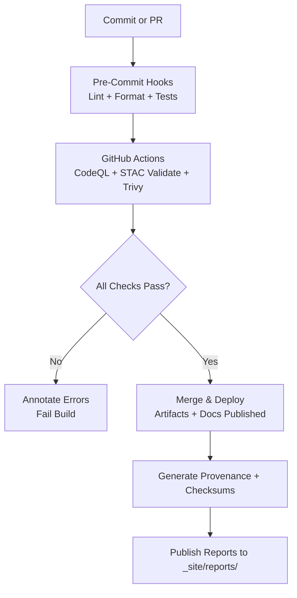

<div align="center">

# 📐 Kansas Frontier Matrix — **Standards & Governance**

`/docs/standards/`

**Mission:** Establish and enforce **project-wide technical, scientific, and documentation standards**
for the **Kansas Frontier Matrix (KFM)** — ensuring **clarity**, **reproducibility**, **interoperability**, and
**long-term scientific integrity** across all components: data, models, pipelines, and UI.

[](../)
[](https://www.go-fair.org/fair-principles/)
[](../../.github/workflows/stac-validate.yml)
[](../../.github/workflows/codeql.yml)
[](../../.github/workflows/trivy.yml)
[](../../.github/workflows/pre-commit.yml)

</div>

---

## 🎯 Purpose

The `/docs/standards/` directory serves as the **definitive reference** for how the Kansas Frontier Matrix is built, tested, and maintained.
It codifies the **technical, semantic, and operational standards** that guarantee each element of the system — from datasets to the web UI —
is **auditable, reproducible, and semantically interoperable** under the **Master Coder Protocol (MCP)** and **FAIR Data Principles**.

This directory ensures that:

* Every dataset follows the same structure, schema, and provenance model.
* Every workflow is deterministic, logged, and validated in CI/CD.
* Every contributor adheres to common code and documentation practices.
* Every artifact (map, dataset, model, or doc) is **traceable from source to publication**.

---

## 📚 Contents & Structure

```bash
docs/standards/
├── README.md               # Index (this file)
├── coding.md               # Code style & language standards
├── data-formats.md         # Data model, encoding, and file format standards
├── metadata.md             # Metadata models (STAC, DCAT, schema.org)
├── ontologies.md           # Semantic layer: CIDOC CRM, OWL-Time, PeriodO
├── testing.md              # Unit, integration, and validation test standards
├── security.md             # Security, compliance, and license scanning
└── documentation.md        # README, ADR, and MCP documentation conventions
```

---

## 🧱 Core Standard Categories

### 🧮 Coding Standards

* **Python:** Follows PEP8, formatted with **Black**, linted with **Ruff**, tested with **pytest**.
* **JavaScript/TypeScript:** ES6+, **Prettier** + **ESLint**, modular import/export, React 18+ components.
* **CSS:** Follows **BEM** naming conventions, reusable design tokens (`:root` variables).
* **Documentation in Code:**

  * Python → docstrings (Google or reST style).
  * JS → JSDoc format.
  * YAML → inline comments for pipeline configuration.

📄 **Reference:** `docs/standards/coding.md`

---

### 🌍 Data & File Formats

| Type          | Format                          | Specification        | Notes                                 |
| :------------ | :------------------------------ | :------------------- | :------------------------------------ |
| **Vector**    | `GeoJSON`                       | RFC 7946             | UTF-8, WGS84 (EPSG:4326)              |
| **Raster**    | `COG` (Cloud-Optimized GeoTIFF) | GDAL ≥3.8            | Internal overviews, tiled, compressed |
| **Tabular**   | `CSV` + `schema.json`           | RFC 4180 / CSVW      | Includes units and datatypes          |
| **Metadata**  | `JSON` / `YAML`                 | JSON Schema Draft-07 | Validated automatically in CI         |
| **Checksums** | `.sha256`                       | NIST SHA-256         | Created for each artifact             |
| **Archive**   | `.zip` / `.tar.gz`              | Reproducible build   | For packaging reproducible releases   |

> **See:** `docs/standards/data-formats.md`

---

### 🗂️ Metadata & Ontologies

* **STAC 1.0.0** — Spatial-temporal asset catalogs for all geospatial layers.
* **DCAT 3.0** — Dataset-level metadata for broader discoverability.
* **Schema.org** — Used for public data discovery and web indexing.
* **CIDOC CRM** — Cultural heritage ontology for historical events, people, and objects.
* **OWL-Time** — For precise temporal reasoning and event chronology.
* **PeriodO** — Provides historical period mappings (“Bleeding Kansas”, “Dust Bowl”, etc.).

📘 **Reference:** `docs/standards/metadata.md`, `docs/standards/ontologies.md`

---

### 🧪 Testing & CI/CD Standards

All pipelines, data, and code must pass **predefined validation checks** before merge or release:

| Stage               | Validation               | Tool / Workflow          |
| :------------------ | :----------------------- | :----------------------- |
| **Code Quality**    | Linting & security       | `pre-commit.yml`, CodeQL |
| **Data Validation** | Schema + STAC compliance | `stac-validate.yml`      |
| **Security Scans**  | Vulnerabilities          | Trivy, Dependabot        |
| **Checksums**       | File integrity           | `checksums.yml`          |
| **Documentation**   | Consistency              | `docs-validator.yml`     |

📗 **Reference:** `docs/standards/testing.md`

---

### 🔒 Security & Governance

* All code dependencies are scanned with **Trivy** and **CodeQL**.
* Docker images include **SBOM (Software Bill of Materials)** for provenance tracking.
* **License scans** ensure all included libraries are open-source and compatible.
* GitHub secrets and environment variables follow **principle of least privilege**.
* Each workflow is signed (optional: **Sigstore/SLSA**) for chain-of-custody traceability.

📕 **Reference:** `docs/standards/security.md`

---

### 🧭 Documentation & Governance Rules

Every directory must contain a **README.md** detailing:

1. **Purpose and context**
2. **Usage instructions**
3. **Dependencies and relationships**
4. **Badges and version tracking**

Additional Documentation Standards:

* **Templates:** MCP-compliant docs → experiment, model card, SOP, provenance.
* **Design Decisions:** Record using ADRs (Architecture Decision Records) in `/docs/adr/`.
* **Glossaries:** Maintain terminology consistency in `/docs/glossary.md`.
* **Licensing:** Code = MIT, Data = CC-BY 4.0, Documentation = CC-BY 4.0.

📙 **Reference:** `docs/standards/documentation.md`

---

### 🧩 Governance & Quality Gates

All merges to `main` must pass:

* ✅ **STAC schema validation** (metadata)
* ✅ **Checksum verification** (data integrity)
* ✅ **Code linting & tests** (via pre-commit hooks)
* ✅ **Security scanning** (Trivy, CodeQL)
* ✅ **Documentation completeness** (auto-checked via CI)

> **Governance Review:** Each major release is signed off by the **Data Governance Committee**, verifying MCP compliance across datasets, models, and docs.

---

## 🧠 Usage Guidelines

1. **Before coding** — Review `coding.md` for syntax, style, and docstring conventions.
2. **Before adding data** — Confirm format + metadata compliance in `data-formats.md` and `metadata.md`.
3. **Before merging** — Run all schema, checksum, and STAC validation checks.
4. **Before publishing** — Update provenance + experiment records (`docs/templates/`).
5. **For new contributors** — Follow `documentation.md` to align formatting and structure.

---

## 🧩 Semantic & Temporal Standards

| Category               | Standard          | Purpose                                          |
| :--------------------- | :---------------- | :----------------------------------------------- |
| **Cultural**           | CIDOC CRM         | Describes events, actors, and artifacts          |
| **Temporal**           | OWL-Time          | Aligns timespans and intervals                   |
| **Historical Periods** | PeriodO           | Standardized time periods                        |
| **Spatial Reference**  | EPSG:4326 (WGS84) | Global geospatial interoperability               |
| **Provenance**         | W3C PROV-O        | Machine-readable lineage of data transformations |

---

## 📊 CI/CD Workflow Summary



---

## 🔗 Related Documentation

* `docs/architecture/` — System and data architecture definitions.
* `docs/integration/` — ETL and data source integration guides.
* `docs/design/` — UI/UX and visualization design standards.
* `docs/glossary.md` — Canonical KFM terminology index.

---

<div align="center">

> 📜 **“Standards are the architecture of reproducibility.”**
> Every commit, dataset, and model must conform to these standards — ensuring KFM remains
> transparent, verifiable, and interoperable for decades to come.

**Kansas Frontier Matrix** — *“Every Line Tested. Every Dataset Traceable.”*
📍 [`docs/standards/README.md`](.) · Master repository for KFM-wide standards and governance.

</div>
