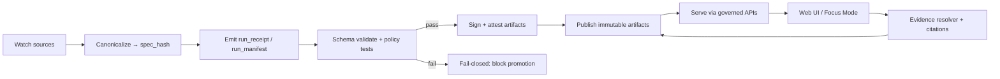

# KFM Standards

This directory holds **contract-grade standards** for Kansas Frontier Matrix (KFM).

These documents are treated like code:

- **Contract-first:** schemas and API contracts are first-class artifacts; changes require strict versioning + compatibility checks.
- **Deterministic pipeline:** transformations are idempotent, config-driven, and fully logged so outputs are reproducible.
- **Fail-closed governance:** if evidence, signatures, or policies fail → nothing ships.

> **Non-negotiable:** Standards changes MUST be paired with enforcement (schemas, policy, CI gates). If you can’t enforce it, it’s a guideline, not a standard.

---

## What lives here

| Standard | Path | What it governs | Enforced by | Notes |
|---|---|---|---|---|
| Markdown work protocol | `docs/standards/KFM_MARKDOWN_WORK_PROTOCOL.md` | Front-matter, section structure, accessibility, citations | Markdown lint + schema checks in CI | Treat doc failures like failing unit tests |
| Repo structure standard | `docs/standards/KFM_REPO_STRUCTURE_STANDARD.md` | Directory layout + “where things go” | Reviews + CI structure checks (where implemented) | Keeps the repo navigable |
| KFM STAC profile | `docs/standards/KFM_STAC_PROFILE.md` | KFM-required fields/extensions for STAC items/collections | STAC JSON Schema validation in CI | May begin as a placeholder |
| KFM DCAT profile | `docs/standards/KFM_DCAT_PROFILE.md` | KFM-required fields for DCAT (datasets + distributions) | DCAT validation in CI | Referenced as present in repo docs |
| KFM PROV profile | `docs/standards/KFM_PROV_PROFILE.md` | KFM-required PROV-O JSON-LD bundle shape | PROV JSON-LD validation in CI | May begin as a placeholder |

> **Tip:** If you’re adding a new standard, also add its companion validator(s) under `schemas/` and a CI job that fails closed.

---

## Related directories

```text
repo-root/
├── docs/
│   ├── standards/
│   │   ├── README.md
│   │   ├── KFM_MARKDOWN_WORK_PROTOCOL.md
│   │   ├── KFM_REPO_STRUCTURE_STANDARD.md
│   │   ├── KFM_STAC_PROFILE.md
│   │   ├── KFM_DCAT_PROFILE.md
│   │   └── KFM_PROV_PROFILE.md
│   ├── templates/
│   │   ├── TEMPLATE__KFM_UNIVERSAL_DOC.md
│   │   ├── TEMPLATE__STORY_NODE_V3.md
│   │   └── TEMPLATE__API_CONTRACT_EXTENSION.md
│   └── governance/
│       ├── ROOT_GOVERNANCE.md
│       ├── ETHICS.md
│       ├── SOVEREIGNTY.md
│       └── REVIEW_GATES.md
├── schemas/
│   ├── stac/
│   ├── dcat/
│   ├── prov/
│   ├── storynodes/
│   ├── ui/
│   └── telemetry/
└── .github/workflows/
```

---

## Non-negotiables

### 1) Evidence-first & cite-or-abstain

- Every user-visible claim must resolve to **dataset version + exact records** (or document/page span).
- If evidence cannot be resolved, the system must **abstain** rather than speculate.

### 2) Trust membrane

Clients (including the Web UI) must never touch storage directly.

- All access routes through governed APIs.
- Policy-as-code runs at the boundary and mediates RBAC, sensitivity classes, and citation rules.

### 3) Fail-closed promotion (no “manual publish”)

Promotion to any “served” or “public” state is blocked unless required metadata, provenance, and policies validate.

### 4) Deterministic identity & receipts

- Deterministic identity is required (e.g., `spec_hash` computed from canonicalized inputs).
- Every pipeline run emits typed receipts/manifests (e.g., `run_receipt`, `run_manifest`) as first-class artifacts.

---

## Enforcement model (schemas + policy + CI)

KFM standards are enforced at two main choke points:

1) **CI gates** (PR-time, fail closed)
2) **Trust membrane policy** (runtime, deny by default)

### Minimum CI hardening set (baseline)

- Validate Story Nodes and governed Markdown structure
- Validate STAC/DCAT/PROV artifacts for any new/updated dataset
- Run OPA policy tests (unit tests for allow/deny)
- Generate SBOM (SPDX) + build provenance attestation (SLSA/in-toto)
- Publish a versioned container image **only** if all checks pass

> **Policy design guideline:** keep denials explainable—errors should point to the missing field, violated constraint, and remediation.

### Governance-by-construction loop



---

## Versioning, compatibility, and migrations

Because docs embed version identifiers (template/protocol versions, doc UUIDs, profile versions), KFM is structurally prepared for compatibility governance **if** those versions are enforced in CI and runtime endpoints.

Standards changes MUST include one of:

- **Non-breaking** update (additive fields, optional constraints), or
- **Breaking change** with explicit version bump + migration guide + rollout/rollback plan.

### Required versioning behaviors

- **API versioning:** freeze `/api/v1/*` semantics; introduce `/api/v2/*` only for breaking changes.
- **Schema/profile versioning:** keep STAC/DCAT/PROV profile versions (e.g., `KFM-STAC vN`) and publish migration scripts for each bump.
- **Story Node template versioning:** enforce Story Node v3; provide a transformer script; block merge if template mismatch.
- **Deprecation policy:** document timelines inside the API contract extension template.

---

## Sensitivity, sovereignty, and licensing

Standards must make sensitive handling *automatic*:

- If documentation or data includes sensitive locations or personal data, apply CARE defaults (redact or generalize). Use front-matter fields like `care_label` to trigger stricter review.
- Licenses and reuse constraints are operational requirements: ingestion and APIs must distinguish “metadata + pointer” ingest vs “content mirroring,” and encode rights controls in pipeline + API output.

---

## How to change a standard (PR checklist)

### 1) Make the change traceable

- [ ] Update the relevant `docs/standards/*.md` document.
- [ ] Update matching schemas under `schemas/`.
- [ ] Update policy packs under `policy/opa/` (if applicable).
- [ ] Add/adjust CI checks under `.github/workflows/`.

### 2) Make it safe

- [ ] If breaking: bump version + add migration guide.
- [ ] Add/update tests (schema validation tests, contract tests, policy tests).
- [ ] Add a rollback plan (or explicit statement why rollback is unnecessary).

### 3) Make it governed

- [ ] Confirm CARE/sensitivity implications.
- [ ] Ensure denial messages are explainable.
- [ ] Ensure docs are link-check clean and pass markdown lint.

---

## Glossary

<details>
<summary>Click to expand</summary>

| Term | Meaning in KFM |
|---|---|
| **STAC** | SpatioTemporal Asset Catalog: JSON catalogs describing geospatial assets |
| **DCAT** | Data Catalog Vocabulary: describes datasets and distributions |
| **PROV-O** | W3C provenance ontology (entities, activities, agents) |
| **OPA/Rego** | Policy-as-code used for CI gates and runtime checks |
| **SBOM** | Software Bill of Materials (e.g., SPDX/CycloneDX) |
| **SLSA** | Supply-chain Levels for Software Artifacts: provenance model/levels |
| **Trust membrane** | The governed boundary: clients never access storage directly |
| **Fail-closed** | Default to deny/block; ship only when all checks pass |
| **spec_hash** | Deterministic hash of canonicalized inputs used for identity/integrity |

</details>

---

## Definition of Done (this document)

- [ ] Front-matter complete + valid
- [ ] All claims link to datasets, schemas, or source references (as applicable)
- [ ] Validation steps are listed and repeatable (for any process described)
- [ ] Governance, FAIR/CARE, and sovereignty considerations are explicitly stated
