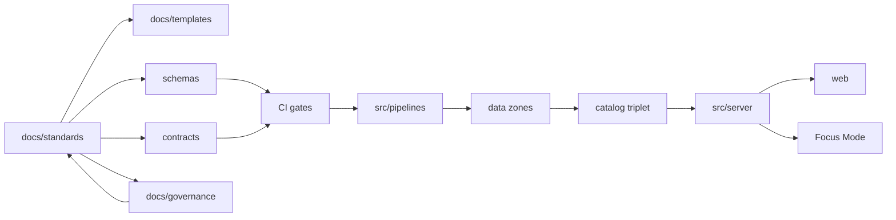
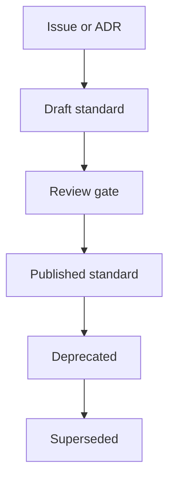

<!-- [KFM_META_BLOCK_V2]
doc_id: kfm://doc/5bb62de2-4e6f-4723-9cc2-2fee8419b5b3
title: docs/standards README
type: standard
version: v1
status: draft
owners: Standards WG (TBD)
created: 2026-02-24
updated: 2026-03-01
policy_label: public
related:
  - ../MASTER_GUIDE_v13.md
  - ../governance/REVIEW_GATES.md
  - ./KFM_REPO_STRUCTURE_STANDARD.md
tags: [kfm, standards]
notes:
  - Entry point for governed standards and profiles.
  - Expanded directory layout to include identity, vocab, and conformance primitives.
  - Upgrade pass: tighten normative language, lifecycle, and change control.
  - Update owners/links when repo governance roles are finalized.
[/KFM_META_BLOCK_V2] -->

# docs/standards
Governed standards, profiles, and protocols that constrain **how KFM artifacts are authored, validated, and promoted** — and therefore what KFM can safely publish.


<!-- TODO: Replace badges with repo-specific CI/status badges once paths are known -->

**Owners:** Standards WG (TBD)  
**Applies to:** docs, templates, schemas, dataset specs, controlled vocabularies, run receipts, Story Nodes, governed APIs, UI trust surfaces

---

## Quick navigation
- [Purpose](#purpose)
- [Authority order](#authority-order)
- [Normative language and status model](#normative-language-and-status-model)
- [How this fits in the repo](#how-this-fits-in-the-repo)
- [Standards registry](#standards-registry)
- [Directory layout](#directory-layout)
- [How to use these standards](#how-to-use-these-standards)
- [Change control](#change-control)
- [Adding or updating a standard](#adding-or-updating-a-standard)
- [Governance and review](#governance-and-review)
- [Appendix](#appendix)

---

> [!WARNING]
> Standards are **normative**. Changes here can break CI gates, schemas/contracts, and governed outputs.  
> Follow the repo’s review gates before merging changes.

---

## Purpose
This directory exists to:

- Define **canonical formats** and **profiles** used across KFM (e.g., STAC/DCAT/PROV).
- Make governance **machine-checkable** (contracts, controlled vocabularies, conformance rules).
- Reduce “repo drift” by giving every subsystem a single, governed source of truth.
- Keep the system **fail-closed**: if a required invariant is unclear, the standard should default-deny until explicitly relaxed.


KFM’s governing posture is captured in three system-wide principles:

- **Contract-first & deterministic**: prefer explicit schemas/contracts and reproducible pipelines.
- **Evidence-first UI**: every user-facing claim is traceable to resolvable evidence.
- **Cite-or-abstain**: if citations cannot be verified, narrow scope or abstain.

> [!NOTE]
> If a document in this directory conflicts with a template, ADR, or “how-to”, **the standard wins** (or the conflict must be resolved before promotion).

---

## Authority order
When two artifacts disagree, resolve the conflict in this order:

1. **Published standards** in `docs/standards/`
2. **Machine contracts** (`schemas/`, `contracts/`) that implement the standards
3. **Templates** (`docs/templates/`) used to author compliant artifacts
4. **Guides / how-tos** (`docs/…`) and one-off design docs (non-normative)

> [!TIP]
> If a contract/schema differs from a published standard, treat it as a **bug**: either update the contract to match the standard, or version/deprecate the standard and publish the successor.

---

## Normative language and status model

### Normative keywords
Standards use the following keywords consistently:

- **MUST** / **MUST NOT**: required for compliance; CI **SHOULD** enforce where feasible.
- **SHOULD** / **SHOULD NOT**: strongly recommended; deviations require documented rationale.
- **MAY**: optional behavior.

> [!TIP]
> If a requirement cannot be validated automatically yet, keep it **MUST**, but add:
> 1) a `TODO(ci)` describing the intended automated check, and  
> 2) a “manual verification” step.

### Claim tagging for governed documents
When a standard (or related doc) makes an implementation claim, tag it:

- **CONFIRMED**: backed by artifacts in-repo (schemas, receipts, contracts, CI checks).
- **PROPOSED**: a recommended future state (include rationale + tradeoffs).
- **UNKNOWN**: cannot be verified yet (include minimum verification steps).

> [!NOTE]
> This is not “extra process”: it prevents accidental overreach and makes review faster.

### Document status meanings
| Status | Meaning | Expectations |
|---|---|---|
| `draft` | Proposed, still changing | Not relied on for promotion unless explicitly required by gates |
| `review` | Under formal review | High scrutiny; reviewers focus on blast radius + migration |
| `published` | Stable, normative | No silent breaking edits; changes require versioning/deprecation |
| `deprecated` | Still supported, discouraged | Replacement exists; deprecation window + migration guidance |
| `superseded` | Replaced by a newer standard | Link to successor and migration guidance |

---

## How this fits in the repo
Standards are part of the **trust membrane**: they define what’s allowed/required; everything downstream implements + validates them.



**Rule of thumb:**
- Use **standards** to define **what is allowed/required** across the system.
- Use **templates** to define **how to author** repeatable artifacts.
- Use **schemas/contracts** when requirements must be **machine-validated** and consumed by code.

---

## Standards registry
> [!NOTE]
> The machine-readable registry is the **authoritative inventory**. The README table is a convenience view and may be generated.

| Standard | What it governs | Primary consumers | Status | CI enforcement |
|---|---|---|---|---|
| [`KFM_MARKDOWN_WORK_PROTOCOL.md`](./KFM_MARKDOWN_WORK_PROTOCOL.md) | Markdown authoring conventions for governed docs | doc authors, reviewers, tooling | `draft` | markdownlint, linkcheck *(TBD)* |
| [`KFM_REPO_STRUCTURE_STANDARD.md`](./KFM_REPO_STRUCTURE_STANDARD.md) | Canonical repo layout + invariants | all contributors, CI, tooling | `draft` | tree validation *(TBD)* |
| [`KFM_STAC_PROFILE.md`](./KFM_STAC_PROFILE.md) | KFM metadata profile for STAC | catalog + pipelines + validators | `draft` | stac validator *(TBD)* |
| [`KFM_DCAT_PROFILE.md`](./KFM_DCAT_PROFILE.md) | KFM metadata profile for DCAT | publishing layer + policy boundary | `draft` | dcat validator *(TBD)* |
| [`KFM_PROV_PROFILE.md`](./KFM_PROV_PROFILE.md) | KFM provenance profile for PROV | pipelines, audit, evidence resolver | `draft` | prov validator *(TBD)* |

---

## Directory layout

### Canonical layout
The directory layout below is the **target standard layout** for `docs/standards/`.

- Items that don’t exist yet are allowed while this README is `draft`, but they MUST be tracked (issue/ADR) and created before publishing the relevant standards.
- Every folder **MUST** contain a `README.md` describing its scope + exclusions.

```text
docs/standards/                                         # Standards that constrain authoring, validation, and promotion
├─ README.md                                            # This file (entrypoint; high bar)
│
│  # Root entrypoints (keep stable for discoverability + links)
├─ KFM_MARKDOWN_WORK_PROTOCOL.md                        # Markdown authoring protocol (formatting, lint, doc hygiene)
├─ KFM_REPO_STRUCTURE_STANDARD.md                       # Canonical repo layout + invariants (what must exist, where)
├─ KFM_STAC_PROFILE.md                                  # STAC profile constraints (required fields, linking, assets rules)
├─ KFM_DCAT_PROFILE.md                                  # DCAT profile constraints (distributions, licensing, vocab)
├─ KFM_PROV_PROFILE.md                                  # PROV profile constraints (lineage, run linkage, IDs)
│
│  # Machine-readable registries (CI can validate structure; README mirrors these)
├─ registry/
│  ├─ README.md                                         # Registry intent + update process
│  ├─ standards.registry.yaml                           # Canonical inventory: id/title/path/status/owners/consumers
│  ├─ deprecations.yaml                                 # Deprecated/superseded items + replacements + timelines
│  ├─ checks.registry.yaml                              # Catalog of CI checks and what they enforce (optional but recommended)
│  └─ vocab/                                            # Controlled vocabularies referenced by standards
│     ├─ README.md
│     ├─ policy_label.yaml                              # public, public_generalized, restricted, etc.
│     ├─ artifact.zone.yaml                             # raw, work, processed, catalog, published
│     ├─ citation.kind.yaml                             # dcat, stac, prov, doc, graph, url (discouraged)
│     └─ media_types.yaml                               # media type conventions used in catalogs/manifests (when standardized)
│
│  # Authoring standards beyond “Markdown protocol”
├─ authoring/
│  ├─ README.md                                         # Scope + exclusions for authoring standards
│  ├─ KFM_META_BLOCK_V2_STANDARD.md                     # MetaBlock v2 rules + required keys + examples
│  ├─ KFM_NORMATIVE_LANGUAGE_STANDARD.md                # MUST/SHOULD/MAY + CONFIRMED/PROPOSED/UNKNOWN tagging rules
│  ├─ KFM_CITATION_PROTOCOL.md                          # Evidence citation format + link hygiene + cite-or-abstain rules
│  ├─ KFM_DIAGRAM_MERMAID_STANDARD.md                   # Mermaid constraints (naming, layout, allowed constructs)
│  ├─ KFM_LINKING_STANDARD.md                           # Relative links, anchors, reference hygiene, no rot
│  └─ examples/
│     ├─ good/                                          # Golden fixtures used by linters/tests
│     └─ bad/                                           # Intentional violations (tests should fail)
│
│  # Identity + determinism (hashes, IDs, canonicalization)
├─ identity/
│  ├─ README.md
│  ├─ KFM_SPEC_HASH_STANDARD.md                         # spec_hash inputs + canonicalization rules
│  ├─ KFM_IDENTIFIER_FAMILIES_STANDARD.md               # kfm:// identifiers and stability rules
│  ├─ KFM_DATASET_VERSION_ID_STANDARD.md                # dataset_version_id structure and derivation constraints
│  └─ examples/
│
│  # Conformance: how standards become checks that fail closed
├─ conformance/
│  ├─ README.md                                         # What “conformance” means in KFM
│  ├─ KFM_CONFORMANCE_MATRIX.md                         # Standard ↔ check mapping; where enforced
│  ├─ KFM_FIXTURE_CONVENTIONS.md                        # How golden fixtures are structured/named
│  └─ fixtures/
│     ├─ minimal/                                       # Smallest passing artifacts (fast CI)
│     ├─ regression/                                    # Past bugs locked in as tests
│     └─ adversarial/                                   # Policy bypass attempts; citation rot; malformed catalogs
│
│  # Repo mechanics standards (layout is entrypoint; this holds “how we change the repo safely”)
├─ repo/
│  ├─ README.md                                         # Scope + exclusions for repo standards
│  ├─ KFM_BRANCHING_RELEASE_STANDARD.md                 # Branching, release tagging, doc promotion cadence
│  ├─ KFM_VERSIONING_DEPRECATION_STANDARD.md            # Breaking change policy, deprecation windows, migrations
│  └─ examples/
│     └─ repo_trees/                                    # Sample trees used by validation tooling/docs
│
│  # Catalog + triplet standards (STAC/DCAT/PROV are entrypoints; this is the “system glue”)
├─ catalog/
│  ├─ README.md                                         # Relationship to schemas/ + validators
│  ├─ triplet/
│  │  ├─ KFM_TRIPLET_LINKING_STANDARD.md                # DCAT↔STAC↔PROV cross-links + receipts linkage invariants
│  │  └─ examples/
│  │     ├─ minimal_triplet/                            # Minimal passing set (good for tests)
│  │     └─ complex_triplet/                            # Multi-collection / multi-distribution examples
│  ├─ stac/
│  │  ├─ README.md                                      # STAC addenda: mapping notes, local conventions
│  │  ├─ CONFORMANCE.md                                 # What checks exist, what fail-closed means, where they run
│  │  └─ examples/
│  ├─ dcat/
│  │  ├─ README.md                                      # DCAT addenda: mapping notes, local conventions
│  │  ├─ CONFORMANCE.md
│  │  └─ examples/
│  └─ prov/
│     ├─ README.md                                      # PROV addenda: receipts, lineage, transform tracing rules
│     ├─ CONFORMANCE.md
│     └─ examples/
│
│  # Policy-facing standards that must remain stable across APIs/UI/Focus Mode
├─ policy/
│  ├─ README.md                                         # Policy labels + obligations interface (not Rego itself)
│  ├─ KFM_POLICY_LABEL_STANDARD.md                      # policy_label taxonomy + propagation rules
│  ├─ KFM_REDACTION_OBLIGATIONS_STANDARD.md             # obligation types + UI/API enforcement requirements
│  ├─ KFM_POLICY_SAFE_ERRORS_STANDARD.md                # 403/404 behavior + “no existence leak” constraints
│  └─ examples/
│     ├─ public/                                        # public-safe examples
│     └─ restricted/                                    # obligation examples (no sensitive specifics)
│
│  # Evidence standards (ties provenance + citations + “show your work” UX)
├─ evidence/
│  ├─ README.md                                         # EvidenceRef/EvidenceBundle rules
│  ├─ KFM_EVIDENCE_REF_STANDARD.md                      # EvidenceRef shape, required fields, resolvable targets
│  ├─ KFM_EVIDENCE_BUNDLE_STANDARD.md                   # Bundle assembly, redaction rules, citation binding
│  ├─ KFM_RUN_RECEIPT_STANDARD.md                       # Run receipt minimum fields + linkage to triplet/catalog
│  ├─ KFM_PROMOTION_MANIFEST_STANDARD.md                # Promotion manifest minimum fields + approvals linkage
│  └─ examples/
│
│  # Governed API contract conventions (how contracts express policy + evidence)
├─ api/
│  ├─ README.md                                         # How to author API-facing standards (links to contracts/)
│  ├─ KFM_API_CONTRACT_EXTENSION.md                     # Common fields: policy/evidence/timestamps/error envelope
│  ├─ KFM_ERROR_MODEL_STANDARD.md                       # Error codes, policy-safe messaging, trace IDs
│  ├─ KFM_PAGINATION_FILTERING_STANDARD.md              # Paging + filtering semantics (time-aware + map queries)
│  ├─ KFM_EXPORT_DOWNLOAD_STANDARD.md                   # Export/download obligations: attribution, watermarking, deny rules
│  └─ examples/
│
│  # UI-facing standards (normative UX constraints; not design proposals)
├─ ui/
│  ├─ README.md                                         # Evidence-first UX requirements + exclusions
│  ├─ KFM_STORY_NODE_STANDARD.md                        # Story Node schema rules (where it lives + validation)
│  ├─ KFM_EVIDENCE_FIRST_UX_STANDARD.md                 # UX requirements for traceability + “why” panes
│  ├─ KFM_EVIDENCE_DRAWER_STANDARD.md                   # Evidence drawer requirements (license/version/a11y)
│  ├─ accessibility/
│  │  └─ KFM_A11Y_MINIMUM_STANDARD.md                   # Minimum a11y constraints for governed UI
│  └─ examples/
│
│  # External interoperability notes (non-normative mappings to external standards)
├─ interop/
│  ├─ README.md                                         # What belongs here (interop notes, not local requirements)
│  ├─ EXTERNAL_STANDARDS_INDEX.md                       # STAC/DCAT/PROV/OGC/etc. reference index
│  └─ examples/
│
└─ _archive/                                            # Deprecated/old versions (never referenced by CI)
   ├─ README.md                                         # How/when to archive; linking rules
   └─ 2026-02-xx/                                       # Date- or version-bucketed snapshots
```

### Acceptable inputs
This directory is the canonical home for:

- **Profiles** (STAC/DCAT/PROV) and conformance rules
- **Authoring protocols** (Markdown, MetaBlock, diagrams, linking)
- **Repo structure standards**
- **Controlled vocabularies** referenced across standards
- **Change-control rules** for standards themselves (versioning/deprecation)

### Exclusions
Do **not** put these here:

- One-off design proposals (use ADRs / `docs/architecture/`)
- Story content (use `docs/reports/story_nodes/`)
- Source code (use `src/`)
- Schemas themselves (use `schemas/`), unless a standard explicitly *is* the schema

---

## How to use these standards
1. **Start from the governing standard**
   - Example: authoring a dataset spec or profile? Start with the relevant profile in this directory.
2. **Use templates for authoring**
   - If there’s a template in `docs/templates/`, author via the template and validate against standards here.
3. **Validate early**
   - Prefer CI checks that fail closed over manual policing.
4. **Prefer additive change**
   - Add a new version or extension before breaking existing contracts.
5. **When you must deviate**
   - Capture rationale, scope, and expiration (when the deviation ends), and link it to governance.

---

## Change control
Standards changes are governed because they can alter what becomes publishable and how policy is enforced.

### Change types
- **Clarification-only:** wording/formatting that does not change requirements.
- **Additive:** new optional capability, new examples, new checks.
- **Breaking:** changes to requirements, schemas, contracts, or promotion behavior.

> [!WARNING]
> If you can’t confidently classify the change as “clarification-only” or “additive”, treat it as **breaking**.

### Lifecycle sketch


### Versioning rules
- **Published standards are stable:** avoid silent breaking edits.
- For breaking changes, prefer **new versions** or **successor documents**, and include migration guidance.
- Keep explicit **deprecation windows** when consumers exist (timeboxed when possible).

---

## Adding or updating a standard

### Minimum checklist
- [ ] Document includes a MetaBlock v2 header (see appendix) with correct `policy_label`
- [ ] Standard clearly states its **scope** and **non-goals**
- [ ] Standard includes **requirements** using MUST/SHOULD/MAY
- [ ] Standard includes **examples** (good + bad) where practical
- [ ] Change includes **migration guidance** if it breaks consumers
- [ ] CI/tooling hooks are updated (or a TODO is filed with an owner)
- [ ] Registry updated: `registry/standards.registry.yaml` (+ `deprecations.yaml` if relevant)
- [ ] Links updated: any affected templates/schemas/contracts

### Suggested PR structure
- **What changed:** short summary
- **Why:** rationale + tradeoffs
- **Blast radius:** what systems need to be retested
- **Verification:** commands or steps to confirm compliance
- **Governance:** policy implications, sensitivity/sovereignty impact (if any)

---

## Governance and review
Standards should be reviewed with extra rigor because they:

- influence validation and promotion gates,
- affect how policy is enforced,
- may change what becomes publishable.

**When in doubt:** default-deny (tighten constraints), then explicitly loosen with rationale.

---

## Appendix

### MetaBlock v2 reminder
KFM docs use **MetaBlock v2** for structured metadata (instead of YAML frontmatter). Copy/paste and fill:

```text
<!-- [KFM_META_BLOCK_V2]
doc_id: kfm://doc/<uuid>
title: <Title>
type: <guide|standard|story|dataset_spec|adr|run_receipt>
version: v1
status: draft|review|published
owners: <team or names>
created: YYYY-MM-DD
updated: YYYY-MM-DD
policy_label: public|restricted|...
related:
  - <paths or kfm:// ids>
tags:
  - kfm
notes:
  - <short notes>
[/KFM_META_BLOCK_V2] -->
```

Guidelines:
- `doc_id` MUST be stable (do not regenerate on edits).
- `updated` SHOULD change on meaningful edits.
- `policy_label` MUST reflect the most restrictive content in the document.

---

<p align="right"><a href="#docsstandards">Back to top</a></p>