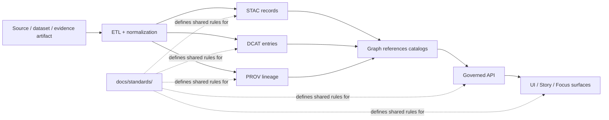

<!-- [KFM_META_BLOCK_V2]
doc_id: kfm://doc/<TODO-uuid>
title: Standards
type: standard
version: v1
status: draft
owners: <TODO: standards owners>
created: <TODO: YYYY-MM-DD>
updated: <TODO: YYYY-MM-DD>
policy_label: public
related: [../README.md, ../../README.md, ./KFM_STAC_PROFILE.md, ./KFM_DCAT_PROFILE.md, ./KFM_PROV_PROFILE.md, ./KFM_MARKDOWN_WORK_PROTOCOL.md, ./governance/ROOT_GOVERNANCE.md, ./faircare/FAIRCARE-GUIDE.md, ./sovereignty/INDIGENOUS-DATA-PROTECTION.md]
tags: [kfm, standards, metadata, provenance, governance]
notes: [Source-bounded draft; exact owners, dates, UUID, and full repo inventory need verification against the live repository.]
[/KFM_META_BLOCK_V2] -->

# Standards

_Governed standards, profiles, and cross-cutting rules for KFM metadata, provenance, publication, documentation, and review._

**Status:** `draft`  
**Owners:** `NEEDS VERIFICATION`  


**Quick jump:** [Scope](#scope) · [Repo fit](#repo-fit) · [Accepted inputs](#accepted-inputs) · [Directory tree](#directory-tree) · [Quickstart](#quickstart) · [Standards map](#standards-map) · [Definition of done](#definition-of-done) · [FAQ](#faq) · [Appendix](#appendix)

> [!IMPORTANT]
> This index is intentionally **source-bounded**. It is aligned to the mounted KFM corpus and corpus-referenced paths, but the current session did **not** expose a directly browsable repository checkout for line-by-line verification of every file under `docs/standards/`.  
> Treat entries marked **NEEDS VERIFICATION** as merge-time checks against the live repo tree.

## Scope

`docs/standards/` is the governed home for **cross-cutting standards and profiles** used across KFM domains, catalogs, APIs, UI surfaces, Story Nodes, Focus Mode, and release workflows.

This directory exists to keep shared rules in one place: metadata profiles, provenance expectations, documentation protocols, governance references, FAIR+CARE obligations, sovereignty protections, and related interoperability guidance.

## Repo fit

| Item | Value |
|---|---|
| Path | `docs/standards/README.md` |
| Role | Human-readable index for governed standards and profile surfaces |
| Upstream | `../README.md` · `../../README.md` *(NEEDS VERIFICATION: exact docs-index placement in live repo)* |
| Downstream | `./KFM_STAC_PROFILE.md` · `./KFM_DCAT_PROFILE.md` · `./KFM_PROV_PROFILE.md` · `./KFM_MARKDOWN_WORK_PROTOCOL.md` · `./governance/ROOT_GOVERNANCE.md` · `./faircare/FAIRCARE-GUIDE.md` · `./sovereignty/INDIGENOUS-DATA-PROTECTION.md` |
| Adjacent governed areas | `../../contracts/` · `../../policy/` · `../data/` · `../research/` |

### Why this directory matters

KFM’s documented pipeline is dependency-ordered: evidence and catalogs come before graph use, API serving, UI display, Story Nodes, and Focus Mode. Standards live here because they are part of that dependency spine, not post-hoc commentary.

[Back to top](#standards)

## Accepted inputs

Place a document here when it defines a reusable rule that multiple KFM subsystems must share.

| Accepted input | Why it belongs here |
|---|---|
| Metadata profiles | Shared rules for STAC, DCAT, PROV, and related outward publication surfaces |
| Documentation protocols | Rules for front matter, structure, validation, and governed doc authorship |
| Governance references | Cross-domain rules for review, ethics, sensitivity, and sovereignty |
| Interoperability notes | Standards-aligned guidance that sharpens how KFM implements shared profiles |
| Validation expectations | Normative requirements that CI/review should enforce across domains |
| Cross-cutting controlled vocabularies | Terms, labels, or registries that govern interpretation beyond one domain |

## Exclusions

This directory should not become a catch-all.

| Does **not** belong here | Put it here instead |
|---|---|
| Domain ETL instructions or source-specific runbooks | `../data/<domain>/` or domain-specific docs |
| Exploratory notes, spikes, literature summaries | `../research/` |
| API endpoint schemas and machine contracts | `../../contracts/` |
| Enforceable policy code | `../../policy/` |
| Story Nodes, narrative content, or Focus outputs | governed story/report areas |
| Operational deployment runbooks | architecture / platform / infra docs |

> [!NOTE]
> A good rule of thumb: if the file is primarily **normative across multiple domains**, it likely belongs here. If it is primarily **implementation-, domain-, or experiment-specific**, it probably does not.

## Directory tree

The following tree reflects **corpus-referenced** standards surfaces. Exact file presence and casing in the live repo still need direct verification.

```text
docs/standards/
├── README.md
├── KFM_STAC_PROFILE.md                  # referenced profile
├── KFM_DCAT_PROFILE.md                  # referenced profile
├── KFM_PROV_PROFILE.md                  # referenced profile
├── KFM_MARKDOWN_WORK_PROTOCOL.md        # referenced authoring / validation protocol
├── governance/
│   └── ROOT_GOVERNANCE.md               # referenced governance charter
├── faircare/
│   └── FAIRCARE-GUIDE.md                # referenced FAIR+CARE guide
├── sovereignty/
│   └── INDIGENOUS-DATA-PROTECTION.md    # referenced sovereignty / protection guidance
└── stac/
    └── OGC_STAC_COMMUNITY_STANDARD_AND_CDSE_DEPLOYMENTS.md
                                           # referenced STAC implementation guidance
```

## Quickstart

### Add a new standard

1. Confirm the document is **normative**, not exploratory.
2. State the scope clearly: what artifacts, routes, datasets, or surfaces it governs.
3. Link the standard to its governing neighbors:
   - metadata profile refs, when applicable;
   - governance / FAIR+CARE / sovereignty refs, when applicable;
   - related contracts or schemas, when applicable.
4. Add this index entry and update any adjacent README that should point to it.
5. Verify lint, links, and any profile/schema checks before merge.

### Minimal authoring skeleton

```md
# <Standard title>

_One-line purpose._

## Scope

## When to use this

## Requirements

## Validation

## Related standards

## Change log
```

### Merge-time review prompts

- Does this file define a cross-cutting rule, or is it really a domain note?
- Does it duplicate a rule already owned elsewhere?
- Does it point to the schemas/contracts it expects?
- Does it create a new review trigger for sensitive, public, or AI-mediated outputs?
- Does it stay aligned with KFM’s evidence-first and fail-closed posture?

## Usage

### For maintainers

Use this directory to keep shared rules centralized and reviewable. A standard should be linkable from multiple domains without being rewritten in each one.

### For domain stewards

Reference standards from your domain docs; do not copy them into domain READMEs unless the local adaptation itself must be governed and reviewed.

### For contributors

Start here when you need to answer:

- Which metadata profile applies?
- What publication metadata is mandatory?
- Which governance references must a new artifact cite?
- Which documentation protocol should a new governed doc follow?

## Diagram


```mermaid
flowchart LR
    A[Source / dataset / evidence artifact] --> B[ETL + normalization]
    B --> C[STAC records]
    B --> D[DCAT entries]
    B --> E[PROV lineage]
    C --> F[Graph references catalogs]
    D --> F
    E --> F
    F --> G[Governed API]
    G --> H[UI / Story / Focus surfaces]
    I[docs/standards/] -.defines shared rules for.-> C
    I -.defines shared rules for.-> D
    I -.defines shared rules for.-> E
    I -.defines shared rules for.-> G
    I -.defines shared rules for.-> H
```

## Standards map

| Standard surface | Primary role | Typical downstreams | Evidence posture |
|---|---|---|---|
| `KFM_STAC_PROFILE.md` | Asset- and item-level geospatial metadata profile | catalogs, ingest, remote sensing, map layers | **Referenced** |
| `KFM_DCAT_PROFILE.md` | Dataset/distribution discovery profile | dataset catalog, outward discovery, APIs | **Referenced** |
| `KFM_PROV_PROFILE.md` | Provenance / lineage expectations | ingest, processing, AI/evidence artifacts, audit trails | **Referenced** |
| `KFM_MARKDOWN_WORK_PROTOCOL.md` | Governed Markdown authoring / validation rules | docs, standards, Story Nodes, narrative artifacts | **Referenced** |
| `governance/ROOT_GOVERNANCE.md` | Cross-cutting review and governance baseline | all public or policy-significant artifacts | **Referenced** |
| `faircare/FAIRCARE-GUIDE.md` | FAIR+CARE framing and review obligations | data onboarding, publication, sensitive outputs | **Referenced** |
| `sovereignty/INDIGENOUS-DATA-PROTECTION.md` | Sovereignty and protected-knowledge handling | archaeology, cultural data, redaction paths, public APIs | **Referenced** |
| `stac/*.md` and similar standards notes | Implementation-facing guidance layered below profiles | standards maintainers, catalog implementers, integrators | **Referenced / NEEDS VERIFICATION** |

## Put-it-here test

| Candidate change | Belongs in `docs/standards/`? | Reason |
|---|---|---|
| New STAC profile rule | Yes | Cross-cutting metadata constraint |
| New DCAT/PROV linkage rule | Yes | Shared publication requirement |
| API endpoint request/response schema | No | Put in `../../contracts/` |
| Rego policy implementation | No | Put in `../../policy/` |
| Domain ingest runbook | No | Put in domain docs |
| Research summary of an external source | No | Put in `../research/` |
| Documentation protocol for governed docs | Yes | Shared authoring / validation rule |

## Definition of done

A standards doc is ready to merge when all of the following are true:

- [ ] Path and title align with the document’s actual role.
- [ ] Scope is explicit and excludes material that belongs elsewhere.
- [ ] Relative links resolve to the governing or downstream files it names.
- [ ] Relevant profile, governance, FAIR+CARE, and sovereignty refs are present.
- [ ] Validation expectations are written clearly enough to be repeated.
- [ ] The doc does not silently override a stronger governing standard.
- [ ] Any draft or provisional status is visible.
- [ ] If the standard affects sensitive or public outputs, review triggers are explicit.
- [ ] This index is updated if the new doc changes the standards surface.

## Review checklist for this index

- [ ] Every referenced file in the tree exists in the live repo.
- [ ] File casing matches the repo exactly.
- [ ] Owners are confirmed from repo evidence or CODEOWNERS.
- [ ] This README reflects the current standards surface rather than an aspirational one.
- [ ] Placeholder metadata in the KFM meta block has been replaced or intentionally retained.

## FAQ

### Is this directory only for metadata standards?

No. Metadata profiles are central here, but the directory also covers governance, documentation protocol, sovereignty handling, and other shared normative rules that multiple KFM lanes depend on.

### Do standards replace contracts and schemas?

No. Standards explain the rule set. Contracts and schemas are the machine-facing artifacts that implement or validate those rules in `contracts/`, `schemas/`, CI, or release tooling.

### Can a domain define its own local rule instead of using a shared standard?

Only when the local rule is truly domain-specific or when it is an explicit extension. Local convenience copies of cross-cutting rules are a drift risk and should be avoided.

### What should happen if a proposed standard conflicts with a stronger KFM doctrine doc?

The stronger governing doctrine wins. Update the proposal, or document the conflict and route it for review instead of letting drift land quietly.

[Back to top](#standards)

## Appendix

<details>
<summary><strong>Known verification items</strong></summary>

### Repo-state items still needing direct verification

- Exact current contents of `docs/standards/`
- Exact owners / CODEOWNERS coverage for the standards area
- Whether `docs/standards/README.md` already exists and, if so, what should be preserved verbatim
- Exact docs-index path (`../README.md`) and whether the standards README is linked there today
- Exact profile filenames and casing in the live repository
- Exact CI workflows or commands that enforce standards-related validation

### Authoring notes for future maintainers

- Keep this file as an **index and routing surface**, not a second copy of every standard.
- Prefer short descriptions with strong links over long duplicate summaries.
- When in doubt, add a verification note instead of overstating repo reality.
- If a standard graduates from draft to enforced, update both its local status and this index.

</details>

[Back to top](#standards)