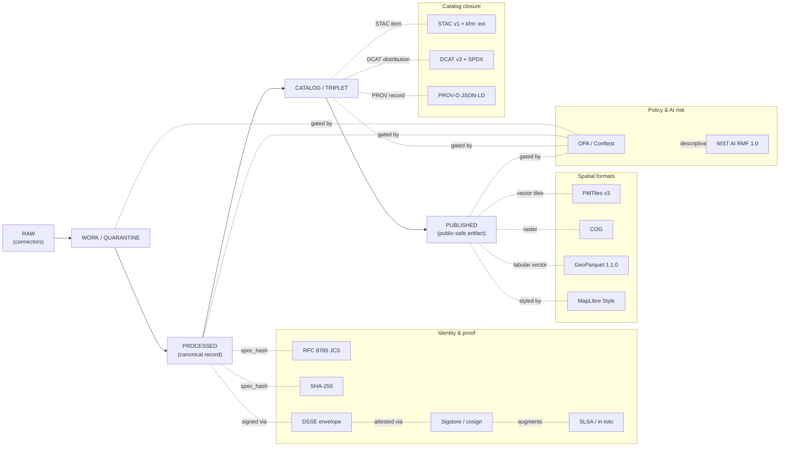

<!-- [KFM_META_BLOCK_V2]
doc_id: kfm://doc/docs-standards-readme
title: docs/standards/ — External Standards KFM Conforms To
type: standard
version: v1
status: draft
owners: TBD — Docs steward + Standards reviewer (placeholder)
created: 2026-05-09
updated: 2026-05-09
policy_label: public
related:
  - docs/doctrine/directory-rules.md
  - docs/doctrine/authority-ladder.md
  - docs/doctrine/truth-posture.md
  - docs/doctrine/trust-membrane.md
  - docs/architecture/contract-schema-policy-split.md
  - docs/sources/README.md
  - docs/adr/README.md
  - contracts/README.md
  - schemas/README.md
  - policy/README.md
tags: [kfm, standards, stac, dcat, prov, dsse, sigstore, slsa, opa, nist-ai-rmf]
notes:
  - "PROPOSED: subdirectory organization shown below has not been verified against a mounted repo."
  - "Several specific files referenced here (TRUST_CLASSES, PROOF_FORMAT, AI_RMF_ALIGNMENT, etc.) are corpus-named suggested future work, not yet authored."
[/KFM_META_BLOCK_V2] -->

# `docs/standards/` — External Standards KFM Conforms To

> Anchor index for the external, third-party standards Kansas Frontier Matrix conforms to, extends, or borrows from — and the rules by which KFM stays a faithful, traceable downstream consumer of them.

<!-- BADGES — placeholders. Replace `<owner>/<repo>` and `<branch>` once repo coordinates are confirmed. -->
[](#0-status--authority)
[](#0-status--authority)
[](../doctrine/truth-posture.md)
[](../doctrine/lifecycle-law.md)
[](#11-validation)
[](#11-validation)

> [!IMPORTANT]
> **Standards are anchors, not authority.** STAC, DCAT, PROV, DSSE, SLSA, NIST AI RMF and similar specifications give KFM a shared vocabulary with the outside world. They do **not** by themselves prove KFM promotion state, license admissibility, sensitivity clearance, or release readiness. Those are decided by `contracts/`, `schemas/`, `policy/`, `tests/`, `release/`, and stewards — not by an external spec.

**Quick jump:**
[Status & Authority](#0-status--authority) ·
[Repo Fit](#1-repo-fit) ·
[What Belongs Here](#2-what-belongs-here) ·
[What Does Not Belong Here](#3-what-does-not-belong-here) ·
[Layout](#4-layout-proposed) ·
[Standards Inventory](#5-standards-inventory) ·
[How Standards Anchor KFM](#6-how-standards-anchor-kfm) ·
[KFM Extensions](#7-kfm-extensions-to-external-standards) ·
[Conformance Discipline](#8-conformance-discipline) ·
[Inputs](#9-inputs) ·
[Outputs](#10-outputs) ·
[Validation](#11-validation) ·
[Review Burden](#12-review-burden) ·
[Related Folders](#13-related-folders) ·
[ADRs](#14-adrs) ·
[Open Questions](#15-open-questions--needs-verification) ·
[Last Reviewed](#16-last-reviewed)

---

## 0. Status & Authority

| Field | Value |
|---|---|
| **Document type** | README for `docs/standards/` (directory landing page) |
| **Authority class** | Canonical sub-folder of canonical `docs/` (per Directory Rules §6.1) |
| **What this folder is** | Human-facing reference index of **external standards** KFM conforms to or extends |
| **What this folder is not** | A schema home, a policy home, a contract home, a release home, a fixture home, or a source-descriptor home |
| **Status** | **PROPOSED** — folder layout below is doctrine-grounded; specific sibling files are not yet verified to exist in a mounted repo |
| **Owner (placeholder)** | Docs steward + Standards reviewer (TBD) |
| **Reviewers required for change** | Docs steward + at least one subsystem owner whose lane the changed standard touches |
| **Supersedes** | — |
| **Related doctrine** | [`docs/doctrine/directory-rules.md`](../doctrine/directory-rules.md), [`docs/doctrine/authority-ladder.md`](../doctrine/authority-ladder.md), [`docs/doctrine/truth-posture.md`](../doctrine/truth-posture.md), [`docs/doctrine/trust-membrane.md`](../doctrine/trust-membrane.md) |
| **Repo evidence** | UNKNOWN — no mounted repository was inspected for this README. Path and sibling claims are **PROPOSED** until verified. |

---

## 1. Repo Fit

`docs/standards/` is a sub-folder of canonical `docs/` and follows the rule that **`docs/` explains; `control_plane/` indexes; `contracts/` defines meaning; `schemas/` defines shape; `policy/` decides admissibility** (Directory Rules §6.1). This folder is the **explanation layer** for KFM's conformance to external specifications.

**Upstream of this folder** *(producers / inputs):*

- External standards bodies: OGC, W3C, IETF, CNCF/Sigstore, OpenSSF/SLSA, NIST.
- KFM doctrine in [`docs/doctrine/`](../doctrine/) and architecture in [`docs/architecture/`](../architecture/).
- ADRs in [`docs/adr/`](../adr/) that pin specific versions or extension namespaces.
- Source-descriptor work in [`docs/sources/`](../sources/) — which uses, but does not own, the catalog vocabularies described here.

**Downstream of this folder** *(consumers):*

- Schema definitions under `schemas/contracts/v1/...` (PROPOSED — per ADR-0001).
- Object-meaning docs in `contracts/`.
- Policy bundles in `policy/`, including license / access-rights / sensitivity gates that enumerate values from these standards.
- Validators and generators in `tools/validators/` and `tools/generators/`.
- The catalog emitters (STAC / DCAT / PROV / `CatalogMatrix`) inside `pipelines/catalog/` and `tools/catalog_builders/`.
- Release decisions in `release/manifests/` (which embed proof references that point at DSSE envelopes).

> [!NOTE]
> Standards documents in this folder are **prose anchors** for the schemas, contracts, policies, and validators that actually enforce conformance. If a standards note here disagrees with the executable artifact downstream, the executable artifact wins until reconciled by ADR.

---

## 2. What Belongs Here

A file belongs in `docs/standards/` if **all** of the following are true:

1. It documents an **external, third-party standard, specification, or framework** (or a KFM extension to one).
2. Its primary job is to **explain** — not to define machine shape, encode meaning, or decide allow/deny.
3. It names which **version, profile, or subset** of the standard KFM conforms to, and where conformance is enforced.
4. It is **stable enough** that a reader can rely on it across releases (drafts and exploratory notes belong in [`docs/intake/`](../intake/) or [`docs/archive/exploratory/`](../archive/exploratory/) until promoted).

Accepted file types and object families:

| Object family | Example | Typical filename |
|---|---|---|
| Standards conformance note | KFM's STAC profile and required extension fields | `catalog/stac.md` |
| Vocabulary alignment note | DCAT distribution shape; controlled license/access-rights vocabulary | `catalog/dcat.md` |
| Provenance vocabulary note | PROV-O classes, relations, and KFM usage | `catalog/prov.md` |
| Cross-vocabulary linkage note | STAC ↔ DCAT ↔ PROV closure rules | `catalog/catalog-closure.md` |
| Identity / canonicalization note | JCS vs URDNA2015 decision matrix | `identity/CANONICALIZATION.md` |
| Proof-format note | DSSE payload types, signing algorithms | `proof/PROOF_FORMAT.md` |
| Signing note | cosign keyless + key-rotation policy | `proof/SIGNING.md` |
| Supply-chain provenance note | SLSA / in-toto predicate fields | `proof/PROVENANCE.md` |
| Trust-classes doctrine note | Receipt ≠ Proof ≠ Catalog ≠ Publication | `trust/TRUST_CLASSES.md` |
| AI risk-management alignment | NIST AI RMF 1.0 subcategory mapping; GenAI Profile | `ai/AI_RMF_ALIGNMENT.md` |
| KFM extension registration | The `kfm:` STAC extension namespace | `catalog/kfm-stac-extension.md` |
| Tile-stack / format note | PMTiles v3, COG, GeoParquet, MapLibre Style | `tile-stack/*.md` |
| Policy-as-code framework note | OPA / Conftest / Rego usage patterns | `policy-as-code/opa-conftest.md` |
| Offline-development note | Local DSSE signing without network | `offline/OFFLINE_DEVELOPMENT.md` |

---

## 3. What Does Not Belong Here

> [!WARNING]
> The most common drift in `docs/standards/` is to let it become a parallel home for things the project already has canonical homes for. Keep it boring.

| Do **not** put here | Put it here instead | Why |
|---|---|---|
| JSON Schema files (`*.schema.json`) | `schemas/contracts/v1/...` | Schemas are machine shape, not human prose (ADR-0001). |
| KFM contract Markdown (object meaning) | `contracts/` | Contracts own KFM-specific object meaning, not external-standard prose. |
| Policy bundles / Rego rules | `policy/` | `policy/` decides allow/deny/restrict/abstain. |
| Policy fixtures or schema fixtures | `policy/fixtures/`, `tests/fixtures/`, or `fixtures/` | Fixtures live with their tests. |
| Source descriptors (per-source families) | `docs/sources/` and `data/registry/sources/` | Source identity, not standards conformance. |
| KFM doctrine (lifecycle, trust membrane, etc.) | `docs/doctrine/` | Doctrine is internal first principles, not external standards. |
| ADRs that adopt a standard or pin a version | `docs/adr/` | ADRs are decisions; this folder is reference. |
| Architecture diagrams that span subsystems | `docs/architecture/` | Architecture explains how KFM is built; standards explain what KFM aligns to. |
| Domain dossiers (hydrology, fauna, etc.) | `docs/domains/<domain>/` | Domain knowledge, not standards. |
| Generated catalog records (STAC items, DCAT distributions) | `data/catalog/` | These are emitted, lifecycle data — not human-authored standards docs. |
| Release manifests, evidence bundles, receipts | `release/manifests/`, `data/proofs/`, `data/receipts/` | Trust content has its own canonical homes. |
| Marketing or external-export copy | `docs/brand/` or out-of-tree | Standards docs are reference, not promotional material. |

If a file's primary responsibility is more than one of the above, **split it** before placing.

---

## 4. Layout (PROPOSED)

> [!CAUTION]
> The subdirectory layout below is a **PROPOSED** organization grounded in standards groupings repeatedly named across the KFM corpus. It has **not** been verified against a mounted repository. Specific filenames marked *(planned)* appear in the corpus as "suggested future work" and are not yet authored. Treat every path here as **PROPOSED / NEEDS VERIFICATION** until inspected against actual repo state.

```text
docs/standards/
├── README.md                                  # this file
├── catalog/                                   # spatiotemporal & dataset catalog vocabularies
│   ├── stac.md                                # STAC v1 profile + required KFM extension fields  (planned)
│   ├── dcat.md                                # DCAT v3 distribution shape; license/accessRights (planned)
│   ├── prov.md                                # PROV-O classes & relations; KFM usage           (planned)
│   ├── catalog-closure.md                     # STAC ↔ DCAT ↔ PROV linkage rules                (planned)
│   └── kfm-stac-extension.md                  # the `kfm:` STAC extension namespace             (planned)
├── identity/
│   └── CANONICALIZATION.md                    # JCS (default) vs URDNA2015; spec_hash policy    (planned)
├── proof/
│   ├── PROOF_FORMAT.md                        # DSSE payload types & signing algorithms         (planned)
│   ├── SIGNING.md                             # cosign keyless + offline / KMS fallback         (planned)
│   └── PROVENANCE.md                          # SLSA / in-toto predicate fields                 (planned)
├── trust/
│   └── TRUST_CLASSES.md                       # Receipt ≠ Proof ≠ Catalog ≠ Publication         (planned)
├── ai/
│   └── AI_RMF_ALIGNMENT.md                    # NIST AI RMF 1.0 + GenAI Profile mapping         (planned)
├── tile-stack/
│   ├── pmtiles.md                             # PMTiles v3 + KFM metadata block                 (planned)
│   ├── cog.md                                 # COG with internal tiling 256/512                (planned)
│   ├── geoparquet.md                          # GeoParquet 1.1.0 usage in KFM                   (planned)
│   └── maplibre-style.md                      # MapLibre Style Spec + plugin allowlist          (planned)
├── policy-as-code/
│   └── opa-conftest.md                        # OPA / Conftest / Rego usage patterns            (planned)
└── offline/
    └── OFFLINE_DEVELOPMENT.md                 # Local DSSE signing without network              (planned)
```

The grouping reflects the four functions standards play in KFM:

- **Catalog closure** — how published artifacts are described to the outside world.
- **Identity & proof** — how artifacts are hashed, signed, and attested.
- **Trust posture & AI** — how KFM's invariants map to industry frameworks.
- **Implementation surface** — tile/format/policy frameworks the platform leans on.

[Back to top ↑](#docsstandards--external-standards-kfm-conforms-to)

---

## 5. Standards Inventory

The set below is **CONFIRMED** as the catalog of external specifications KFM conforms to or borrows from, drawn from KFM's own architecture corpus. Each row's **Spec note** column points at the planned standards file for KFM-specific guidance. Names in the **Source** column are the publishing organizations.

> Compatibility status legend: **CONFIRMED** = adopted by KFM doctrine; **PROPOSED** = corpus commits but adoption details are still settling; **TRACKING** = identified as forward-looking, not yet adopted.

### 5.1 Catalog vocabularies

| Standard | Source | Version / profile | KFM status | Spec note (planned) |
|---|---|---|---|---|
| **STAC** (SpatioTemporal Asset Catalog) | OGC | v1 + KFM extension | CONFIRMED | [`catalog/stac.md`](./catalog/stac.md) |
| **DCAT** (Data Catalog Vocabulary) | W3C | v3 | CONFIRMED | [`catalog/dcat.md`](./catalog/dcat.md) |
| **PROV-O** (Provenance Ontology) | W3C | PROV-O Recommendation | CONFIRMED | [`catalog/prov.md`](./catalog/prov.md) |
| **JSON-LD** | W3C | 1.1 | CONFIRMED (PROV-JSON-LD recommended) | covered in `catalog/prov.md` |
| **kfm:** STAC extension | KFM | v1 (planned registration) | PROPOSED | [`catalog/kfm-stac-extension.md`](./catalog/kfm-stac-extension.md) |
| **SPDX** license vocabulary | Linux Foundation / SPDX | DCAT-aligned subset | CONFIRMED (with Kansas-specific gaps noted) | covered in `catalog/dcat.md` |

### 5.2 Identity, canonicalization, and proof

| Standard | Source | Version / profile | KFM status | Spec note (planned) |
|---|---|---|---|---|
| **JCS** (JSON Canonicalization Scheme) | IETF | RFC 8785 | CONFIRMED (default for `spec_hash`) | [`identity/CANONICALIZATION.md`](./identity/CANONICALIZATION.md) |
| **URDNA2015** | W3C | RDF Dataset Canonicalization | CONFIRMED (RDF-only fallback) | covered in `identity/CANONICALIZATION.md` |
| **SHA-256** | NIST FIPS 180-4 | — | CONFIRMED (default content hash) | covered in `identity/CANONICALIZATION.md` |
| **DSSE** (Dead Simple Signing Envelope) | in-toto / SLSA | current | CONFIRMED (canonical proof format) | [`proof/PROOF_FORMAT.md`](./proof/PROOF_FORMAT.md) |
| **Sigstore / cosign** (Fulcio + Rekor) | OpenSSF / Sigstore | current | CONFIRMED (keyless OIDC default; offline KMS fallback) | [`proof/SIGNING.md`](./proof/SIGNING.md) |
| **SLSA / in-toto provenance** | OpenSSF / in-toto | SLSA 1.x | CONFIRMED (target level: open question) | [`proof/PROVENANCE.md`](./proof/PROVENANCE.md) |

### 5.3 Spatial formats and rendering

| Standard | Source | Version / profile | KFM status | Spec note (planned) |
|---|---|---|---|---|
| **PMTiles** | Protomaps | v3 (Hilbert-curve tile IDs) | CONFIRMED (canonical vector tile format) | [`tile-stack/pmtiles.md`](./tile-stack/pmtiles.md) |
| **COG** (Cloud-Optimized GeoTIFF) | OGC / community | with internal tiling 256 / 512 | CONFIRMED (canonical raster format) | [`tile-stack/cog.md`](./tile-stack/cog.md) |
| **GeoParquet** | community spec | 1.1.0 | CONFIRMED (vector tabular delivery) | [`tile-stack/geoparquet.md`](./tile-stack/geoparquet.md) |
| **MapLibre Style Specification** | MapLibre | current | CONFIRMED (canonical 2D client) | [`tile-stack/maplibre-style.md`](./tile-stack/maplibre-style.md) |
| **MLT** (MapLibre Tile) | community | pre-1.0 | TRACKING (forward-looking only) | covered in `tile-stack/pmtiles.md` |

### 5.4 Policy, AI risk, and operational frameworks

| Standard | Source | Version / profile | KFM status | Spec note (planned) |
|---|---|---|---|---|
| **OPA** (Open Policy Agent) + **Conftest** | OpenSSF / community | current | CONFIRMED (policy-as-code engine) | [`policy-as-code/opa-conftest.md`](./policy-as-code/opa-conftest.md) |
| **NIST AI RMF 1.0** | NIST | 1.0 (Govern / Map / Measure / Manage) | CONFIRMED (descriptive alignment) | [`ai/AI_RMF_ALIGNMENT.md`](./ai/AI_RMF_ALIGNMENT.md) |
| **NIST AI 600-1 GenAI Profile** | NIST | current | CONFIRMED (GenAI-specific overlay) | covered in `ai/AI_RMF_ALIGNMENT.md` |
| **JSON Schema** | IETF / community | draft 2020-12 (presumed) | NEEDS VERIFICATION | covered in `schemas/README.md` |

### 5.5 KFM-internal "standards" notes (not external, but co-located here)

| Note | Purpose | KFM status |
|---|---|---|
| `trust/TRUST_CLASSES.md` *(planned)* | The four-class doctrine: *receipt ≠ proof ≠ catalog ≠ publication* | CONFIRMED in doctrine; document not yet authored |
| `offline/OFFLINE_DEVELOPMENT.md` *(planned)* | End-to-end offline signing, local DSSE flow | PROPOSED |

These are KFM-authored notes that interpret external standards rather than introduce new external dependencies. They live here because they describe **how KFM applies a standards-grade discipline** — not because they are themselves external.

[Back to top ↑](#docsstandards--external-standards-kfm-conforms-to)

---

## 6. How Standards Anchor KFM

Standards do not replace KFM governance; they give every KFM artifact a vocabulary the outside world can read. The diagram below shows where each family of standards attaches to the KFM lifecycle. **Promotion is still a governed state transition**, not a file move (Directory Rules §9.1, lifecycle invariant).


```mermaid
flowchart LR
    RAW["RAW<br/>(connectors)"] --> WORK["WORK / QUARANTINE"]
    WORK --> PROCESSED["PROCESSED<br/>(canonical record)"]
    PROCESSED --> CATALOG["CATALOG / TRIPLET"]
    CATALOG --> PUBLISHED["PUBLISHED<br/>(public-safe artifact)"]

    subgraph IDENTITY["Identity & proof"]
        JCS["RFC 8785 JCS"]
        SHA["SHA-256"]
        DSSE["DSSE envelope"]
        COSIGN["Sigstore / cosign"]
        SLSA["SLSA / in-toto"]
    end

    subgraph CATALOG_CLOSURE["Catalog closure"]
        STAC["STAC v1 + kfm: ext"]
        DCAT["DCAT v3 + SPDX"]
        PROV["PROV-O JSON-LD"]
    end

    subgraph FORMATS["Spatial formats"]
        PMT["PMTiles v3"]
        COG["COG"]
        GPQ["GeoParquet 1.1.0"]
        MLS["MapLibre Style"]
    end

    subgraph GOVERNANCE["Policy & AI risk"]
        OPA["OPA / Conftest"]
        AIRMF["NIST AI RMF 1.0"]
    end

    PROCESSED -.spec_hash.- JCS
    PROCESSED -.spec_hash.- SHA
    PROCESSED -.signed via.- DSSE
    DSSE -.attested via.- COSIGN
    COSIGN -.augments.- SLSA

    CATALOG -.STAC item.- STAC
    CATALOG -.DCAT distribution.- DCAT
    CATALOG -.PROV record.- PROV

    PUBLISHED -.vector tiles.- PMT
    PUBLISHED -.raster.- COG
    PUBLISHED -.tabular vector.- GPQ
    PUBLISHED -.styled by.- MLS

    WORK -.gated by.- OPA
    PROCESSED -.gated by.- OPA
    CATALOG -.gated by.- OPA
    PUBLISHED -.gated by.- OPA

    GOVERNANCE -.descriptive alignment.- AIRMF
```

A few rules of inference flow from the diagram:

- A **`spec_hash`** is a SHA-256 over the JCS-canonicalized JSON of the canonical artifact. URDNA2015 is invoked **only** when RDF-semantic equivalence is the relevant invariant.
- A **published artifact** without a DSSE proof and without a closed catalog triple (STAC ↔ DCAT ↔ PROV) is, by the four-class trust rule, *not* a publication — it is at most a candidate.
- An **AI-assisted run** that cannot quote an envelope-anchored receipt is treated as a draft, not a measurement, regardless of how well it reads. (See `ai/AI_RMF_ALIGNMENT.md` once authored.)

---

## 7. KFM Extensions to External Standards

KFM extends a small number of external vocabularies with a **named, namespaced** set of additional fields. The extensions are conservative: they exist where the external spec leaves a gap KFM cannot fill with its own internal-only fields.

| Extension | Anchored in | Required fields (CONFIRMED) | Optional / proposed fields |
|---|---|---|---|
| `kfm:` STAC extension | STAC v1 | `kfm:spec_hash`, `kfm:run_receipt_url`, `processing:software`, `processing:version`, `processing:datetime` | `kfm:dcat_dataset`, `kfm:proof_ref`, `kfm:trust_class`, `kfm:source_role`, `kfm:domain`, `kfm:publication_class`, `kfm:sensitivity_summary`, `kfm:source_ids`, `kfm:rights_status`, `kfm:policy_labels`, `kfm:evidence_bundle_ref` |
| DCAT distribution carry-over | DCAT v3 | `dct:license` (SPDX-aligned controlled vocabulary), `dct:accessRights` (controlled enumeration: `public` \| `public-derived` \| `restricted-aggregate` \| `restricted-precise` \| `internal` \| `embargoed`), `prov:wasGeneratedBy` | back-reference to STAC item; `kfm:source_role`; `kfm:trust_class` |
| PROV-O usage | PROV-O | PROV-O classes used: `prov:Entity`, `prov:Activity`, `prov:Agent`. Required relations: `prov:used`, `prov:wasGeneratedBy`, `prov:wasDerivedFrom`, `prov:wasAttributedTo` | upstream sources referenced by canonical identifier (not URL alone); attestation links via STAC `assets.attestation` or `rel:attestation` |
| DSSE payload types | DSSE | `payloadType: application/vnd.kfm.run_receipt+json` (CONFIRMED); per-artifact-class payload types (PROPOSED) | OCI annotations: `org.kfm.spec_hash`, `org.kfm.decision_id`, `org.kfm.target_zone` |

> [!NOTE]
> **Registration posture.** Whether the `kfm:` STAC extension is published as a stand-alone extension on `stac-extensions.github.io` or remains an internal KFM convention is an **OPEN** question; the corpus is silent. See `catalog/kfm-stac-extension.md` (planned) for the resolution.

---

## 8. Conformance Discipline

Because standards are anchors, not authority, KFM enforces conformance with the same discipline it applies to its own contracts.

1. **Pin the version.** Every standards note in this folder MUST name the exact version, profile, or subset KFM conforms to. "STAC" alone is not a version; "STAC v1 + `kfm:` extension v1" is.
2. **Name the enforcement point.** Every note MUST link to where conformance is *executed* — the JSON Schema in `schemas/contracts/v1/...`, the OPA bundle in `policy/`, the validator in `tools/validators/`, the test in `tests/`. A standard that nobody enforces is decoration.
3. **Distinguish prose from contract.** Standards prose lives here. Object meaning lives in `contracts/`. Machine shape lives in `schemas/`. Admissibility lives in `policy/`. These four layers MUST NOT collapse.
4. **Mark KFM extensions explicitly.** Anywhere KFM adds fields to an external vocabulary, the addition MUST appear in §7 of this README and in the relevant note, with a status label (CONFIRMED / PROPOSED / TRACKING).
5. **Track version changes via ADR.** Bumping a major version of a standard KFM relies on (e.g., DCAT v3 → v4) is an ADR-class decision. Recorded in `docs/adr/`.
6. **Do not re-author the standard.** This folder cites and applies external specs; it does not paraphrase them at length. Link to the authoritative source.

---

## 9. Inputs

Files in `docs/standards/` are produced by:

- Human authors — the docs steward and standards reviewer, working from the original specifications (OGC, W3C, IETF, NIST, OpenSSF, etc.).
- KFM doctrine documents in `docs/doctrine/` and architecture documents in `docs/architecture/`, which establish the rules these notes operationalize.
- ADRs in `docs/adr/` — when a standard or version is adopted, the ADR may motivate or supersede a note here.
- Generated cross-references: a future docs linter MAY auto-insert links from these notes to schema/policy/validator locations.

This folder is **not** a destination for pipeline output, generated catalogs, signed proofs, or release manifests.

---

## 10. Outputs

This folder emits no runtime artifacts. It supports:

- Authors of `schemas/contracts/v1/...` who need to know the controlled vocabulary or required fields.
- Authors of `policy/` bundles enumerating license codes, access-rights values, sensitivity classes.
- Authors of `tools/validators/` enforcing STAC / DCAT / PROV / DSSE / SLSA conformance.
- External consumers (granting agencies, partner pipelines, federation peers) who need a stable reference to KFM's standards posture.

---

## 11. Validation

The validation surface for `docs/standards/` is **PROPOSED** in this README and remains **NEEDS VERIFICATION** against an actual mounted repo. The corpus calls for:

- A **documentation linter** that checks the meta block, badge family, section structure, and link integrity (`KFM-IDX-DOC-004`). Names of validators are referenced as planned, not as currently wired.
- A **STAC linter** to verify required `kfm:` extension fields and asset-roles convention.
- A **DCAT validator** to verify `dct:license` is in the controlled SPDX-aligned vocabulary and `dct:accessRights` is in the controlled enumeration.
- A **PROV-O validator** to verify class usage and required relations.
- A **catalog-integrity validator** (`catalog_integrity_validate.py` in the corpus) to verify STAC ↔ DCAT ↔ PROV closure.
- A **link checker** in CI to keep external URLs and internal cross-references alive.

> [!IMPORTANT]
> Until a mounted-repo inspection confirms otherwise, every validator named here is **PROPOSED** and the absence of a passing CI job for it is **expected**, not a bug. Track real status in `docs/registers/VERIFICATION_BACKLOG.md`.

---

## 12. Review Burden

| Change type | Reviewers required |
|---|---|
| Typo, link fix, clarification | Docs steward (single reviewer). |
| New standards note, or major rewrite of an existing note | Docs steward + at least one subsystem owner whose lane the standard touches (e.g., catalog → catalog/release owner; AI RMF → AI / governance owner; signing → security owner). |
| Adoption of a new external standard | ADR required in `docs/adr/`. Reviewers per ADR template. |
| Version bump of an adopted standard (major) | ADR required. Schema / policy / validator co-changes flagged. |
| Change to a `kfm:` extension namespace | ADR required. Drift register entry until downstream consumers migrate. |
| Removal / deprecation of a standards note | ADR required. Move file to `docs/archive/deprecated/` with a forward-link. |

CODEOWNERS reference: TBD — placeholder until verified against `.github/CODEOWNERS` or root `CODEOWNERS`.

---

## 13. Related Folders

| Folder | Relationship |
|---|---|
| [`docs/doctrine/`](../doctrine/) | First-principles doctrine — `truth-posture.md`, `trust-membrane.md`, `lifecycle-law.md`, `directory-rules.md`. Standards conform to doctrine, not the other way around. |
| [`docs/architecture/`](../architecture/) | Where the standards land in concrete architecture (`governed-api.md`, `map-shell.md`, `contract-schema-policy-split.md`). |
| [`docs/adr/`](../adr/) | Decisions to adopt, version, or extend a standard live here. |
| [`docs/sources/`](../sources/) | Source-descriptor standards (per-source families). Distinct from external interoperability standards. |
| [`docs/domains/`](../domains/) | Domain-specific application of these standards (e.g., fauna catalog plan in PROV terms). |
| `contracts/` | Object meaning. The KFM-side of every standards conformance note. |
| `schemas/` | Machine shape. Where standards conformance is structurally enforced (per ADR-0001 the home is `schemas/contracts/v1/...`). |
| `policy/` | Admissibility. Where controlled vocabularies become allow/deny rules. |
| `tools/validators/` | Where standards conformance is checked at build / promotion time. |
| `data/catalog/` | Where STAC / DCAT / PROV records actually live as artifacts. (NB: the records are **emitted**, not human-authored.) |
| `release/` | Release decisions reference DSSE proofs and SLSA attestations described here. |

---

## 14. ADRs

ADRs that govern this folder will be listed here once authored. None confirmed in this session.

| ADR | Title | Status | Affects |
|---|---|---|---|
| `ADR-0001` | Schema home (`schemas/contracts/v1/...` is canonical) | accepted (per Directory Rules §6.4) | Indirectly: every standards note that points at a schema location. |
| `ADR-TBD` | `kfm:` STAC extension registration posture | PROPOSED | `catalog/kfm-stac-extension.md` |
| `ADR-TBD` | DSSE payload-type registry | PROPOSED | `proof/PROOF_FORMAT.md` |
| `ADR-TBD` | SLSA target level for KFM data runs | PROPOSED | `proof/PROVENANCE.md` |
| `ADR-TBD` | Cosign keyless OIDC issuer allowlist | PROPOSED | `proof/SIGNING.md` |
| `ADR-TBD` | JCS vs URDNA2015 default for graph documents | PROPOSED | `identity/CANONICALIZATION.md` |

---

## 15. Open Questions / NEEDS VERIFICATION

These are tracked in the spirit of [`docs/registers/VERIFICATION_BACKLOG.md`](../registers/VERIFICATION_BACKLOG.md). Each is healthy — the kind of question an ADR resolves.

<details>
<summary>Click to expand the full open-questions list</summary>

- **NEEDS VERIFICATION:** Whether the `docs/standards/` folder, this README, and any of the planned sibling files exist in the current mounted repo. All paths in §4 are PROPOSED.
- **NEEDS VERIFICATION:** Whether `docs/standards/` already contains files this README has not enumerated. A mounted-repo `ls` is required before this README can claim coverage.
- **OPEN:** Should the `kfm:` STAC extension be published as a stand-alone extension at `stac-extensions.github.io`, or kept as an internal KFM convention? (Corpus is silent.)
- **OPEN:** Which SLSA level is the target for KFM data runs (1, 2, or 3)? Level 3 is meaningfully more expensive.
- **OPEN:** Which OIDC issuers should appear on the cosign verifier's allowlist for production signing (GitHub Actions OIDC, an in-house issuer, both)?
- **OPEN:** Which DCAT-v3 controlled-vocabulary terms cover Kansas-specific licenses (state-agency licenses, tribal data agreements) that SPDX does not enumerate? Placeholder vocabulary or extension required.
- **OPEN:** Whether the docs linter for this folder enforces "no marketing language" rules in addition to structural checks.
- **OPEN:** Whether `restricted-precise` distributions should appear in public DCAT at all, or only as metadata-only placeholder distributions (corpus suggests the latter, policy not finalized).
- **OPEN:** Whether the catalog-integrity validator (`catalog_integrity_validate.py`) is wired to CI as a hard gate or as a non-blocking report (corpus suggests both, deploy as the hard gate).
- **OPEN:** Whether MLT (MapLibre Tile) is tracked as a future replacement for the MVT payload inside PMTiles, and on what timeline.
- **OPEN:** Whether the runtime envelope carries a `trust_class` field that names which of the four trust classes the response was based on (`TRUST_CLASSES.md` will resolve).
- **OPEN:** Pinned tool versions — JCS, URDNA2015, cosign, OPA, Conftest, GDAL — must be captured in `infra/tool-versions.yaml`. UNKNOWN whether that file currently exists.

</details>

---

## 16. Last Reviewed

`2026-05-09` — initial draft (this file). Older than 6 months from this date → flag for review.

[Back to top ↑](#docsstandards--external-standards-kfm-conforms-to)
