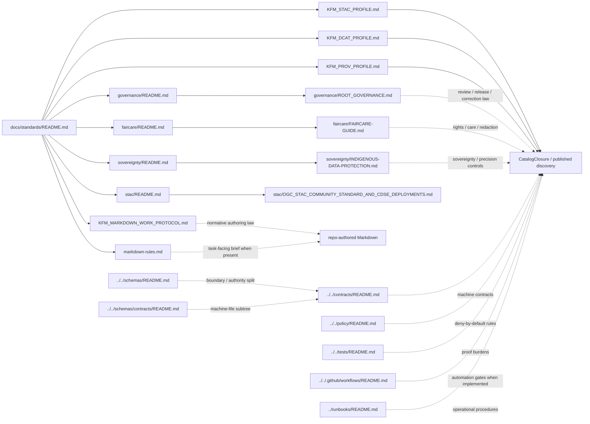

<!-- [KFM_META_BLOCK_V2]
doc_id: kfm://doc/REVIEW_REQUIRED_UUID
title: Standards
type: standard
version: v1
status: draft
owners: @bartytime4life
created: REVIEW_REQUIRED_DATE
updated: REVIEW_REQUIRED_DATE
policy_label: public
related: [../README.md, ../../README.md, ./KFM_STAC_PROFILE.md, ./KFM_DCAT_PROFILE.md, ./KFM_PROV_PROFILE.md, ./KFM_MARKDOWN_WORK_PROTOCOL.md, ./markdown-rules.md, ./governance/README.md, ./governance/ROOT_GOVERNANCE.md, ./faircare/README.md, ./faircare/FAIRCARE-GUIDE.md, ./sovereignty/README.md, ./sovereignty/INDIGENOUS-DATA-PROTECTION.md, ./stac/README.md, ./stac/OGC_STAC_COMMUNITY_STANDARD_AND_CDSE_DEPLOYMENTS.md, ../runbooks/README.md, ../../contracts/README.md, ../../schemas/README.md, ../../schemas/contracts/README.md, ../../schemas/contracts/v1/README.md, ../../policy/README.md, ../../tests/README.md, ../../.github/workflows/README.md]
tags: [kfm, standards, metadata, provenance, governance]
notes: [UUID and commit-level dates still need direct verification; current public main shows substantive FAIR+CARE guidance, lane-local README files under governance/faircare/sovereignty/stac, and a visible markdown-rules.md task brief that should remain distinct from the normative Markdown protocol.]
[/KFM_META_BLOCK_V2] -->

# Standards

_Governed standards index for KFM metadata, provenance, publication, documentation, and review._

**Status:** `experimental`  
**Doc status:** `draft`  
**Owners:** `@bartytime4life` *(current `/docs/` CODEOWNERS owner; no narrower `/docs/standards/` rule is directly visible on public `main`)*


**Quick jump:** [Scope](#scope) · [Repo fit](#repo-fit) · [Current public standards surface](#current-public-standards-surface) · [Lane-local directories](#lane-local-directories) · [Accepted inputs](#accepted-inputs) · [Exclusions](#exclusions) · [Directory tree](#directory-tree) · [Quickstart](#quickstart) · [Usage](#usage) · [Diagram](#diagram) · [Standards map](#standards-map) · [Definition of done](#definition-of-done) · [FAQ](#faq) · [Appendix](#appendix)

**Repo fit:** [`docs/standards/README.md`](./README.md) · upstream [`../README.md`](../README.md) / [`../../README.md`](../../README.md) · root files [`KFM_STAC_PROFILE.md`](./KFM_STAC_PROFILE.md), [`KFM_DCAT_PROFILE.md`](./KFM_DCAT_PROFILE.md), [`KFM_PROV_PROFILE.md`](./KFM_PROV_PROFILE.md), [`KFM_MARKDOWN_WORK_PROTOCOL.md`](./KFM_MARKDOWN_WORK_PROTOCOL.md), [`markdown-rules.md`](./markdown-rules.md) · lane-local dirs [`governance/README.md`](./governance/README.md), [`faircare/README.md`](./faircare/README.md), [`sovereignty/README.md`](./sovereignty/README.md), [`stac/README.md`](./stac/README.md)

> [!IMPORTANT]
> This index is grounded in two evidence layers: the March–April 2026 KFM doctrine corpus and direct public-`main` inspection of `docs/standards/`, its lane-local subdirectories, `docs/README.md`, `.github/CODEOWNERS`, `contracts/README.md`, `schemas/README.md`, `schemas/contracts/README.md`, `schemas/contracts/v1/README.md`, `policy/README.md`, `tests/README.md`, `docs/runbooks/README.md`, and `.github/workflows/README.md`.

> [!TIP]
> In this README, **substantive draft** means a file already carries real normative content on public `main`. It does **not** mean the standard is final, machine-enforced, or fully wired into CI.

> [!NOTE]
> [`markdown-rules.md`](./markdown-rules.md) is a visible repo surface on current public `main`, but it is **not** the same thing as [`KFM_MARKDOWN_WORK_PROTOCOL.md`](./KFM_MARKDOWN_WORK_PROTOCOL.md). Treat the latter as the normative Markdown standards file unless the branch under review explicitly changes that authority split.

## Scope

`docs/standards/` is the governed home for **cross-cutting standards and profiles** used across KFM domains, catalog closure, governed APIs, UI surfaces, Story Nodes, Focus Mode, and review/release flows.

Inside `docs/`, this lane is the answer to the question **“what must be true?”** It should keep shared rules legible without quietly replacing contracts, policy bundles, tests, workflow gates, or truth-path artifacts with prose.

This README is an **index and routing surface**, not a second copy of every standard. Its job is to keep the standards lane readable, correctly classified, and synchronized with the real branch.

## Repo fit

| Item | Value |
|---|---|
| Path | [`docs/standards/README.md`](./README.md) |
| Path status | **CONFIRMED** on public `main`; mounted-checkout parity still **NEEDS VERIFICATION** |
| Role | Directory index and routing surface for cross-cutting standards, profiles, lane-local README boundaries, and adjacent authoring guidance |
| Within `docs/` | The lane for “what must be true?” |
| Upstream | [`../README.md`](../README.md) · [`../../README.md`](../../README.md) |
| Root standard files | [`./KFM_STAC_PROFILE.md`](./KFM_STAC_PROFILE.md) · [`./KFM_DCAT_PROFILE.md`](./KFM_DCAT_PROFILE.md) · [`./KFM_PROV_PROFILE.md`](./KFM_PROV_PROFILE.md) · [`./KFM_MARKDOWN_WORK_PROTOCOL.md`](./KFM_MARKDOWN_WORK_PROTOCOL.md) · [`./markdown-rules.md`](./markdown-rules.md) |
| Lane-local directories | [`./governance/README.md`](./governance/README.md) · [`./faircare/README.md`](./faircare/README.md) · [`./sovereignty/README.md`](./sovereignty/README.md) · [`./stac/README.md`](./stac/README.md) |
| Primary downstream standards and notes | [`./governance/ROOT_GOVERNANCE.md`](./governance/ROOT_GOVERNANCE.md) · [`./faircare/FAIRCARE-GUIDE.md`](./faircare/FAIRCARE-GUIDE.md) · [`./sovereignty/INDIGENOUS-DATA-PROTECTION.md`](./sovereignty/INDIGENOUS-DATA-PROTECTION.md) · [`./stac/OGC_STAC_COMMUNITY_STANDARD_AND_CDSE_DEPLOYMENTS.md`](./stac/OGC_STAC_COMMUNITY_STANDARD_AND_CDSE_DEPLOYMENTS.md) |
| Adjacent governed areas | [`../runbooks/README.md`](../runbooks/README.md) · [`../../contracts/README.md`](../../contracts/README.md) · [`../../schemas/README.md`](../../schemas/README.md) · [`../../schemas/contracts/README.md`](../../schemas/contracts/README.md) · [`../../schemas/contracts/v1/README.md`](../../schemas/contracts/v1/README.md) · [`../../policy/README.md`](../../policy/README.md) · [`../../tests/README.md`](../../tests/README.md) · [`../../.github/workflows/README.md`](../../.github/workflows/README.md) |
| Ownership signal | `/docs/` currently routes to `@bartytime4life` in `.github/CODEOWNERS`; no narrower `/docs/standards/` rule is directly visible on public `main` |

## Current public standards surface

The standards lane is no longer just this index plus a few profile files. Public `main` now shows a mixed surface: root-level standards, a visible task-facing Markdown brief, and lane-local README boundaries beneath multiple subdirectories.

### Root-level standards and protocol files

| Surface | Current public `main` state | Why it matters |
|---|---|---|
| [`README.md`](./README.md) | Present, substantive directory index | This file should be revised in place, not replaced by a parallel index. |
| [`KFM_STAC_PROFILE.md`](./KFM_STAC_PROFILE.md) | Present, substantive draft standard | STAC rules already have a dedicated home. This index should route to it rather than re-explaining it. |
| [`KFM_DCAT_PROFILE.md`](./KFM_DCAT_PROFILE.md) | Present, substantive draft standard | DCAT dataset/distribution rules already have their own surface. |
| [`KFM_PROV_PROFILE.md`](./KFM_PROV_PROFILE.md) | Present, substantive draft standard | Outward lineage/profile work is already materially started here. |
| [`KFM_MARKDOWN_WORK_PROTOCOL.md`](./KFM_MARKDOWN_WORK_PROTOCOL.md) | Present, substantive draft protocol | Repo-native Markdown authoring and review rules already have a normative home. |
| [`markdown-rules.md`](./markdown-rules.md) | Present, visible task-facing authoring brief / repo-local instruction surface | Contributors should not confuse this file with the normative Markdown protocol or let the two drift silently apart. |

### Lane-local directories

| Lane | Current public `main` state | Routing consequence |
|---|---|---|
| [`governance/`](./governance/README.md) | `README.md` + [`ROOT_GOVERNANCE.md`](./governance/ROOT_GOVERNANCE.md) are both visible | Route directory-boundary and lane-index edits to [`governance/README.md`](./governance/README.md); route cross-domain governance law to [`ROOT_GOVERNANCE.md`](./governance/ROOT_GOVERNANCE.md). |
| [`faircare/`](./faircare/README.md) | `README.md` + [`FAIRCARE-GUIDE.md`](./faircare/FAIRCARE-GUIDE.md) are both visible | Do **not** keep calling this lane scaffold-only; the guide is now a substantive public-main standards surface. |
| [`sovereignty/`](./sovereignty/README.md) | `README.md` + [`INDIGENOUS-DATA-PROTECTION.md`](./sovereignty/INDIGENOUS-DATA-PROTECTION.md) are both visible | Route lane-boundary edits to the README and substantive sovereignty rules to the downstream standard. |
| [`stac/`](./stac/README.md) | `README.md` + [`OGC_STAC_COMMUNITY_STANDARD_AND_CDSE_DEPLOYMENTS.md`](./stac/OGC_STAC_COMMUNITY_STANDARD_AND_CDSE_DEPLOYMENTS.md) are both visible | Treat this as the STAC-specific support lane beneath the repo-wide STAC profile, not as a duplicate authority root. |

### Adjacent repo signals

| Surface | Current public `main` state | Why it matters here |
|---|---|---|
| [`../README.md`](../README.md) | Present, substantive | The repo root frames KFM as governed, evidence-first, map-first, and time-aware. |
| [`../runbooks/README.md`](../runbooks/README.md) | Present, substantive | Procedures, rollback, correction, and operator behavior now have a visible sibling surface and should not be absorbed into standards prose. |
| [`../../contracts/README.md`](../../contracts/README.md) | Present, substantive | Root human-readable machine-contract guidance still lives here. |
| [`../../schemas/README.md`](../../schemas/README.md) | Present, substantive | `schemas/` now has a live nested subtree, but schema-home authority remains explicitly unresolved. |
| [`../../schemas/contracts/README.md`](../../schemas/contracts/README.md) | Present, substantive | Current public `main` now shows a real machine-file-bearing subtree under `schemas/contracts/`. |
| [`../../schemas/contracts/v1/README.md`](../../schemas/contracts/v1/README.md) | Present, substantive | The versioned contract lane is already visible and should be routed honestly when standards talk about machine-facing companions. |
| [`../../policy/README.md`](../../policy/README.md) | Present, substantive | Keeps deny-by-default, reasons/obligations, and publication-as-governance visible. |
| [`../../tests/README.md`](../../tests/README.md) | Present, substantive | Frames verification as governed proof, not generic QA. |
| [`../../.github/workflows/README.md`](../../.github/workflows/README.md) | Present, README-only lane | Public `main` still documents workflow intent more strongly than checked-in workflow YAML inventory. |

[Back to top](#standards)

## Accepted inputs

Place a document in `docs/standards/` when it defines a reusable rule that multiple KFM subsystems must share.

| Accepted input | Why it belongs here |
|---|---|
| Metadata profiles | Shared outward rules for STAC, DCAT, PROV, and related release-safe discovery surfaces |
| Governance and review-trigger standards | Cross-domain rules for trust-state transitions, review burden, publication, correction, and runtime boundaries |
| FAIR+CARE / sovereignty / rights / sensitivity standards | Cross-cutting protection rules that multiple domains and outward surfaces must inherit |
| Documentation protocols | Rules for governed Markdown authoring, structure, truth posture, and review |
| Lane-local directory READMEs | Routing, scope, exclusions, and local ownership boundaries for a standards sub-lane |
| Interoperability and deployment notes | Standards-aligned guidance that sharpens how KFM implements shared profiles |
| Cross-cutting vocabularies and validation expectations | Reason codes, obligations, labels, or review expectations that govern interpretation above one domain |

## Exclusions

This directory should not become a catch-all, and this README should not duplicate rules already owned elsewhere.

| Does **not** belong in this index | Put it here instead |
|---|---|
| Field-by-field STAC rules | [`./KFM_STAC_PROFILE.md`](./KFM_STAC_PROFILE.md) |
| DCAT dataset/distribution detail | [`./KFM_DCAT_PROFILE.md`](./KFM_DCAT_PROFILE.md) |
| PROV entity/activity/agent detail | [`./KFM_PROV_PROFILE.md`](./KFM_PROV_PROFILE.md) |
| Normative Markdown authoring and review rules | [`./KFM_MARKDOWN_WORK_PROTOCOL.md`](./KFM_MARKDOWN_WORK_PROTOCOL.md) |
| One-off or branch-local writing prompts that are **not** an intentionally maintained repo surface | task / planning / review surface, not `docs/standards/` |
| Lane-local routing/index prose | the relevant subdirectory `README.md` |
| Core governance law and review outcomes | [`./governance/ROOT_GOVERNANCE.md`](./governance/ROOT_GOVERNANCE.md) |
| FAIR+CARE-specific norm text | [`./faircare/FAIRCARE-GUIDE.md`](./faircare/FAIRCARE-GUIDE.md) |
| Sovereignty-sensitive publication rules | [`./sovereignty/INDIGENOUS-DATA-PROTECTION.md`](./sovereignty/INDIGENOUS-DATA-PROTECTION.md) |
| STAC-specific deployment comparison guidance | [`./stac/OGC_STAC_COMMUNITY_STANDARD_AND_CDSE_DEPLOYMENTS.md`](./stac/OGC_STAC_COMMUNITY_STANDARD_AND_CDSE_DEPLOYMENTS.md) |
| Operational procedures, rollback playbooks, or correction runbooks | [`../runbooks/README.md`](../runbooks/README.md) and the owning runbook |
| API endpoint schemas and machine contracts | [`../../contracts/`](../../contracts/) and [`../../schemas/contracts/`](../../schemas/contracts/) |
| Executable policy bundles or Rego decision logic | [`../../policy/`](../../policy/) |
| Fixtures, drills, negative-path cases, or proof packs | [`../../tests/`](../../tests/) |
| Domain ETL instructions or source-specific runbooks | domain docs / runbooks / owning code surface |
| Exploratory notes, research digests, or idea packets | research / idea / planning surfaces |

> [!NOTE]
> A good rule of thumb: if the file is primarily **normative across multiple domains**, it likely belongs here. If it is primarily **machine-facing**, **operational**, **domain-specific**, or already owned by a dedicated downstream file, it probably does not belong in this index.

## Directory tree

The tree below reflects the files directly verified on current public `main` for this revision.

```text
docs/standards/
├── README.md
├── KFM_DCAT_PROFILE.md
├── KFM_MARKDOWN_WORK_PROTOCOL.md
├── KFM_PROV_PROFILE.md
├── KFM_STAC_PROFILE.md
├── markdown-rules.md
├── faircare/
│   ├── FAIRCARE-GUIDE.md
│   └── README.md
├── governance/
│   ├── README.md
│   └── ROOT_GOVERNANCE.md
├── sovereignty/
│   ├── INDIGENOUS-DATA-PROTECTION.md
│   └── README.md
└── stac/
    ├── OGC_STAC_COMMUNITY_STANDARD_AND_CDSE_DEPLOYMENTS.md
    └── README.md
```

> [!CAUTION]
> The tree above is a **public-main snapshot**, not a guarantee about the branch under review. Re-open the working checkout before merge and update this index if the lane changed again.

## Quickstart

### 1) Find the owning surface first

Use this index as a router, then move to the owning file:

1. For outward item/asset discovery rules, go to [`KFM_STAC_PROFILE.md`](./KFM_STAC_PROFILE.md).
2. For outward dataset/distribution discovery rules, go to [`KFM_DCAT_PROFILE.md`](./KFM_DCAT_PROFILE.md).
3. For publication lineage rules, go to [`KFM_PROV_PROFILE.md`](./KFM_PROV_PROFILE.md).
4. For normative Markdown authoring and review rules, go to [`KFM_MARKDOWN_WORK_PROTOCOL.md`](./KFM_MARKDOWN_WORK_PROTOCOL.md).
5. For a visible repo-local Markdown task brief that may affect how AI-assisted editing is framed, check [`markdown-rules.md`](./markdown-rules.md) — but do not let it silently outrank the normative protocol.
6. For governance lane routing, start with [`governance/README.md`](./governance/README.md); for cross-domain governance law, go to [`governance/ROOT_GOVERNANCE.md`](./governance/ROOT_GOVERNANCE.md).
7. For FAIR+CARE lane routing, start with [`faircare/README.md`](./faircare/README.md); for substantive FAIR+CARE guidance, go to [`faircare/FAIRCARE-GUIDE.md`](./faircare/FAIRCARE-GUIDE.md).
8. For sovereignty lane routing, start with [`sovereignty/README.md`](./sovereignty/README.md); for substantive sovereignty rules, go to [`sovereignty/INDIGENOUS-DATA-PROTECTION.md`](./sovereignty/INDIGENOUS-DATA-PROTECTION.md).
9. For STAC-specific support notes beneath the main profile, start with [`stac/README.md`](./stac/README.md) and then use [`stac/OGC_STAC_COMMUNITY_STANDARD_AND_CDSE_DEPLOYMENTS.md`](./stac/OGC_STAC_COMMUNITY_STANDARD_AND_CDSE_DEPLOYMENTS.md).

### 2) Add or revise a standard

1. Confirm the document is **normative**, not exploratory.
2. Check whether an existing root file, lane README, or downstream standard already owns the rule.
3. If the right file already exists, **revise it in place** instead of creating a second file with overlapping authority.
4. If a lane-local README and a downstream standard both exist, decide explicitly which one owns:
   - routing and exclusions; or
   - substantive rule text.
5. Re-check neighboring machine-facing and operational surfaces:
   - [`../../contracts/README.md`](../../contracts/README.md)
   - [`../../schemas/README.md`](../../schemas/README.md)
   - [`../../schemas/contracts/README.md`](../../schemas/contracts/README.md)
   - [`../../schemas/contracts/v1/README.md`](../../schemas/contracts/v1/README.md)
   - [`../../policy/README.md`](../../policy/README.md)
   - [`../../tests/README.md`](../../tests/README.md)
   - [`../../.github/workflows/README.md`](../../.github/workflows/README.md)
   - [`../runbooks/README.md`](../runbooks/README.md)
6. Update this index whenever the standards surface, routing split, or maturity snapshot changes.

### 3) Minimal authoring skeleton

```md
<!-- [KFM_META_BLOCK_V2]
doc_id: kfm://doc/REVIEW_REQUIRED_UUID
title: <Standard title>
type: standard
version: v1
status: draft
owners: REVIEW_REQUIRED_OWNER
created: REVIEW_REQUIRED_DATE
updated: REVIEW_REQUIRED_DATE
policy_label: REVIEW_REQUIRED_POLICY_LABEL
related: [<relative paths or kfm:// ids>]
tags: [kfm, standards]
notes: [<reviewable notes>]
[/KFM_META_BLOCK_V2] -->

# <Standard title>

_One-line purpose._

> [!IMPORTANT]
> State the truth boundary up front. Do not silently upgrade unknown repo state into implementation fact.

## Scope

## Repo fit

## Requirements

## Validation

## Related standards

## Open verification
```

### 4) Merge-time review prompts

- Does this change define a cross-cutting rule, or is it really a lane-local note?
- Does an existing root file, lane README, or downstream standard already own the rule?
- Did the change keep `markdown-rules.md` and `KFM_MARKDOWN_WORK_PROTOCOL.md` aligned where both still apply?
- Did the change point to the contracts, schema, policy, tests, workflows, or runbooks it expects?
- Did it preserve KFM’s evidence-first, fail-closed, and correction-visible posture?

## Usage

### For maintainers

Use this directory to keep shared rules centralized and reviewable. The strongest current public-main shape is now **three-layered**:

1. the root standards index (`README.md`);
2. root-level standard/protocol files;
3. lane-local directory READMEs plus their downstream standards or notes.

Keep those layers synchronized without letting any one of them become a second silent authority source.

### For domain stewards

Reference standards from your domain docs. Do not copy them into domain READMEs unless the local adaptation itself must be governed, reviewed, and versioned as a distinct rule.

When a local question is really about procedure rather than norm text, route it to [`../runbooks/README.md`](../runbooks/README.md) instead of stretching standards prose to cover operational steps.

### For contributors

Start here when you need to answer questions like these:

- Which metadata profile applies to this published artifact?
- Where do publication lineage rules live?
- Is this change a lane-local README edit or a downstream standard edit?
- Which Markdown protocol should a governed README or standard follow?
- Is `markdown-rules.md` the brief I should read for this task, or do I need the normative protocol file?
- Which current files are real standards, which are lane-local routing surfaces, and which are still README-only support lanes?

[Back to top](#standards)

## Diagram


```mermaid
flowchart LR
    IDX[docs/standards/README.md]

    IDX --> STACP[KFM_STAC_PROFILE.md]
    IDX --> DCATP[KFM_DCAT_PROFILE.md]
    IDX --> PROVP[KFM_PROV_PROFILE.md]
    IDX --> MDP[KFM_MARKDOWN_WORK_PROTOCOL.md]
    IDX --> MR[markdown-rules.md]

    IDX --> GOVR[governance/README.md]
    GOVR --> GOVSTD[governance/ROOT_GOVERNANCE.md]

    IDX --> FAIRR[faircare/README.md]
    FAIRR --> FAIRG[faircare/FAIRCARE-GUIDE.md]

    IDX --> SOVR[sovereignty/README.md]
    SOVR --> SOVSTD[sovereignty/INDIGENOUS-DATA-PROTECTION.md]

    IDX --> STACR[stac/README.md]
    STACR --> STACNOTE[stac/OGC_STAC_COMMUNITY_STANDARD_AND_CDSE_DEPLOYMENTS.md]

    STACP --> CLOSURE[CatalogClosure / published discovery]
    DCATP --> CLOSURE
    PROVP --> CLOSURE

    GOVSTD -.review / release / correction law.-> CLOSURE
    FAIRG -.rights / care / redaction.-> CLOSURE
    SOVSTD -.sovereignty / precision controls.-> CLOSURE

    MDP -.normative authoring law.-> DOCS[repo-authored Markdown]
    MR -.task-facing brief when present.-> DOCS

    CONTRACTS[../../contracts/README.md] -.machine contracts.-> CLOSURE
    SCHEMAS[../../schemas/README.md] -.boundary / authority split.-> CONTRACTS
    SCON[../../schemas/contracts/README.md] -.machine-file subtree.-> CONTRACTS
    POLICY[../../policy/README.md] -.deny-by-default rules.-> CLOSURE
    TESTS[../../tests/README.md] -.proof burdens.-> CLOSURE
    WF[../../.github/workflows/README.md] -.automation gates when implemented.-> CLOSURE
    RUNBOOKS[../runbooks/README.md] -.operational procedures.-> CLOSURE
```

## Standards map

This section separates **root-level standard files** from **lane-local routing surfaces** so the index stays truthful as the tree matures.

### Root-level standards and protocol files

| Surface | Primary role | Current public `main` state | Routing consequence |
|---|---|---|---|
| [`README.md`](./README.md) | Root standards index and routing surface | Present; substantive directory index | Revise in place when the visible standards tree changes |
| [`KFM_STAC_PROFILE.md`](./KFM_STAC_PROFILE.md) | Outward STAC profile for items, collections, assets, and catalog discovery | Present; substantive draft standard | Route STAC profile work here |
| [`KFM_DCAT_PROFILE.md`](./KFM_DCAT_PROFILE.md) | Outward dataset/distribution discovery profile | Present; substantive draft standard | Route DCAT mapping and discovery obligations here |
| [`KFM_PROV_PROFILE.md`](./KFM_PROV_PROFILE.md) | Outward provenance / lineage profile | Present; substantive draft standard | Route lineage and release-traceability work here |
| [`KFM_MARKDOWN_WORK_PROTOCOL.md`](./KFM_MARKDOWN_WORK_PROTOCOL.md) | Governed Markdown authoring / revision / review protocol | Present; substantive draft protocol | Route normative Markdown rules here |
| [`markdown-rules.md`](./markdown-rules.md) | Repo-local task-facing authoring brief / instruction mirror | Present; visible current-tree file | Keep it aligned to the protocol or consolidate explicitly; do not let it silently become second authority |

### Lane-local directory surfaces

| Lane | Primary role | Current public `main` state | Routing consequence |
|---|---|---|---|
| [`governance/README.md`](./governance/README.md) | Governance lane index and scope boundary | Present | Use for lane routing, exclusions, and index-level edits |
| [`governance/ROOT_GOVERNANCE.md`](./governance/ROOT_GOVERNANCE.md) | Standards-layer governance baseline | Present; substantive draft standard | Use for cross-domain governance rules |
| [`faircare/README.md`](./faircare/README.md) | FAIR+CARE lane index and scope boundary | Present | Use for lane routing and README-level scope control |
| [`faircare/FAIRCARE-GUIDE.md`](./faircare/FAIRCARE-GUIDE.md) | FAIR+CARE norm text | Present; substantive guide | Use for publication, redaction, stewardship, and reuse rules |
| [`sovereignty/README.md`](./sovereignty/README.md) | Sovereignty lane index and scope boundary | Present | Use for lane routing and exclusions |
| [`sovereignty/INDIGENOUS-DATA-PROTECTION.md`](./sovereignty/INDIGENOUS-DATA-PROTECTION.md) | Sovereignty / protected-knowledge standard | Present; substantive draft standard | Use for Indigenous/community-sensitive handling rules |
| [`stac/README.md`](./stac/README.md) | STAC-specific support lane index | Present | Use for STAC support-lane routing |
| [`stac/OGC_STAC_COMMUNITY_STANDARD_AND_CDSE_DEPLOYMENTS.md`](./stac/OGC_STAC_COMMUNITY_STANDARD_AND_CDSE_DEPLOYMENTS.md) | STAC deployment/alignment note | Present; substantive guidance note | Use for STAC-specific interoperability and deployment comparison work |

## Put-it-here test

| Candidate change | Belongs in `docs/standards/`? | Best home |
|---|---|---|
| New STAC field rule for outward Items | Yes | [`./KFM_STAC_PROFILE.md`](./KFM_STAC_PROFILE.md) |
| STAC deployment or interoperability comparison note | Yes | [`./stac/OGC_STAC_COMMUNITY_STANDARD_AND_CDSE_DEPLOYMENTS.md`](./stac/OGC_STAC_COMMUNITY_STANDARD_AND_CDSE_DEPLOYMENTS.md) |
| New DCAT distribution-linkage rule | Yes | [`./KFM_DCAT_PROFILE.md`](./KFM_DCAT_PROFILE.md) |
| New PROV entity/activity constraint | Yes | [`./KFM_PROV_PROFILE.md`](./KFM_PROV_PROFILE.md) |
| New README metadata or Markdown review rule | Yes | [`./KFM_MARKDOWN_WORK_PROTOCOL.md`](./KFM_MARKDOWN_WORK_PROTOCOL.md) |
| Repo-local task-facing markdown brief already intentionally maintained in-tree | Maybe | [`./markdown-rules.md`](./markdown-rules.md) — but keep it aligned to the normative protocol |
| Governance lane routing or exclusions update | Yes | [`./governance/README.md`](./governance/README.md) |
| New cross-domain governance rule | Yes | [`./governance/ROOT_GOVERNANCE.md`](./governance/ROOT_GOVERNANCE.md) |
| FAIR+CARE lane routing update | Yes | [`./faircare/README.md`](./faircare/README.md) |
| FAIR+CARE standards build-out | Yes | [`./faircare/FAIRCARE-GUIDE.md`](./faircare/FAIRCARE-GUIDE.md) |
| Sovereignty lane routing update | Yes | [`./sovereignty/README.md`](./sovereignty/README.md) |
| Indigenous/community-sensitive release rule | Yes | [`./sovereignty/INDIGENOUS-DATA-PROTECTION.md`](./sovereignty/INDIGENOUS-DATA-PROTECTION.md) |
| API request/response schema | No | [`../../contracts/`](../../contracts/) or [`../../schemas/contracts/`](../../schemas/contracts/) |
| Rego policy bundle or decision grammar | No | [`../../policy/`](../../policy/) |
| Test fixtures, golden files, or failure drills | No | [`../../tests/`](../../tests/) |
| Publication / rollback / correction procedure | No | [`../runbooks/README.md`](../runbooks/README.md) and the owning runbook |
| Domain ingest runbook | No | domain / runbook / owning code surface |
| Exploratory note or literature digest | No | research / idea / planning surface |

## Definition of done

A standards doc is ready to merge when all of the following are true:

- [ ] Path and title align with the document’s actual role.
- [ ] Scope is explicit and excludes material that belongs elsewhere.
- [ ] Relative links resolve to the governing or downstream files it names.
- [ ] The change lands in the owning root file, lane README, or downstream standard if one already exists.
- [ ] Contracts, schemas, policy, tests, workflow, and runbook touchpoints are referenced where relevant.
- [ ] Draft / experimental / unknown state is visible.
- [ ] The file does not silently create second authority beside a stronger neighboring surface.
- [ ] If the standard affects sensitive or public outputs, review triggers are explicit.
- [ ] This index is updated if the standards surface, lane routing, or maturity snapshot changed.

## Review checklist for this index

- [ ] The `Current public standards surface` section still matches the target branch.
- [ ] `markdown-rules.md` is still present, or this file has been updated to reflect its removal or relocation.
- [ ] Lane-local README files under `governance/`, `faircare/`, `sovereignty/`, and `stac/` are still accurately represented.
- [ ] [`faircare/FAIRCARE-GUIDE.md`](./faircare/FAIRCARE-GUIDE.md) is still described accurately and is **not** silently downgraded back to scaffold-only.
- [ ] `.github/CODEOWNERS` still supports the owner line used here.
- [ ] `.github/workflows/README.md` is still README-only on the target branch, or this file has been updated to reflect checked-in workflow YAML.
- [ ] `schemas/README.md` and `schemas/contracts/README.md` still reflect the current authority split and subtree reality, or this file has been updated to match.
- [ ] Meta-block placeholders have been replaced or intentionally retained.

## FAQ

### Is this directory only for metadata standards?

No. Metadata profiles are central here, but the directory also covers governance, Markdown protocol, FAIR+CARE, sovereignty handling, and other shared normative rules that multiple KFM lanes depend on.

### Do standards replace contracts, schemas, or policy?

No. Standards explain the rule set. Contracts and schemas are the machine-facing artifacts that implement or validate those rules, and policy is the executable decision layer that enforces them.

### Is `FAIRCARE-GUIDE.md` still scaffold-only?

No—not on the current public-main snapshot used for this revision. The FAIR+CARE lane now has both a lane-local `README.md` and a substantive [`FAIRCARE-GUIDE.md`](./faircare/FAIRCARE-GUIDE.md).

### What is `markdown-rules.md` relative to `KFM_MARKDOWN_WORK_PROTOCOL.md`?

`markdown-rules.md` is a visible repo-local authoring brief. [`KFM_MARKDOWN_WORK_PROTOCOL.md`](./KFM_MARKDOWN_WORK_PROTOCOL.md) remains the normative standards-layer Markdown protocol unless the active branch explicitly changes that relationship.

### Should lane-local READMEs repeat their child standards?

No. Lane-local READMEs should define lane scope, routing, exclusions, and ownership boundaries. The downstream standard or note should carry the substantive rule text.

### What should happen if a proposed standard conflicts with a stronger KFM doctrine doc?

The stronger governing doctrine wins. Update the proposal, or document the conflict and route it for review instead of letting drift land quietly.

[Back to top](#standards)

## Appendix

<details>
<summary><strong>Known verification items</strong></summary>

### Repo-state items still needing direct verification

- final UUID and commit-time `created` / `updated` dates for this document
- whether a narrower `/docs/standards/` CODEOWNERS rule should replace the current `/docs/` fallback owner
- whether `.github/workflows/` remains README-only on the target merge branch
- which tests or CI commands actually enforce standards-related validation, if any
- whether `markdown-rules.md` is a deliberate long-term repo surface or a transitional task brief that should be folded elsewhere
- whether any lane-local README should be collapsed into its downstream standard or kept as a distinct routing surface
- whether any standards doc here is using a documented exception to KFM Meta Block v2

### Authoring notes for future maintainers

- Keep this file as a **root index and routing surface**, not a second copy of downstream rule text.
- When a root file, lane README, or downstream standard changes maturity or role, update this README in the same change stream.
- Do not call a substantive guide a scaffold, and do not call a task brief a normative standard without explicitly resolving the authority split.
- Sync this file with [`../README.md`](../README.md), [`../runbooks/README.md`](../runbooks/README.md), [`../../contracts/README.md`](../../contracts/README.md), [`../../schemas/README.md`](../../schemas/README.md), [`../../policy/README.md`](../../policy/README.md), [`../../tests/README.md`](../../tests/README.md), and [`../../.github/workflows/README.md`](../../.github/workflows/README.md) when boundaries move.
- Use reviewable placeholders when metadata is not confirmed; do not silently guess.
- Prefer one owning surface per rule family over overlapping duplicates.

</details>

[Back to top](#standards)
