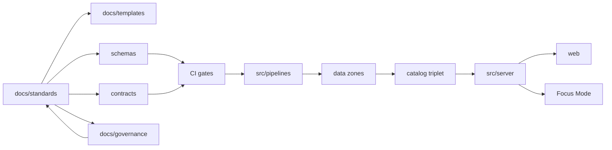
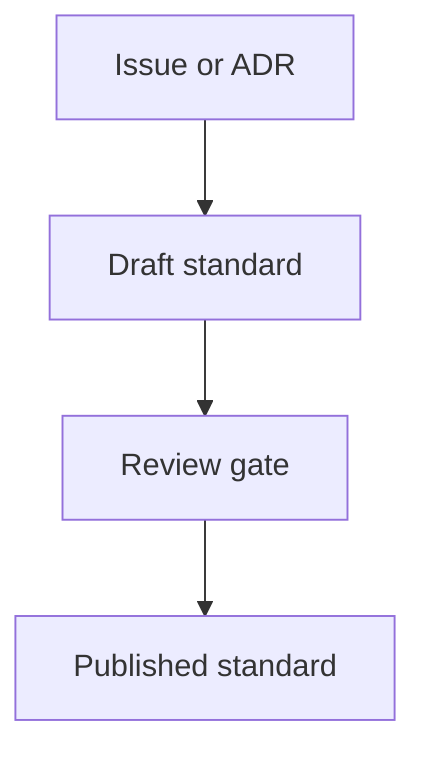

<!-- [KFM_META_BLOCK_V2]
doc_id: kfm://doc/5bb62de2-4e6f-4723-9cc2-2fee8419b5b3
title: docs/standards README
type: standard
version: v1
status: draft
owners: Standards WG (TBD)
created: 2026-02-24
updated: 2026-03-05
policy_label: public
related:
  - ../MASTER_GUIDE_v13.md
  - ../governance/REVIEW_GATES.md
  - ./KFM_REPO_STRUCTURE_STANDARD.md
tags: [kfm, standards]
notes:
  - Entry point for governed standards and profiles.
  - This README defines the target layout and operating rules for standards; it must not imply that listed files already exist.
  - Upgrade pass: tighten normative language, maturity model, and anti-hallucination guardrails.
  - Update owners/links when repo governance roles are finalized and linkcheck passes.
[/KFM_META_BLOCK_V2] -->

# docs/standards
Governed standards, profiles, and protocols that constrain **how KFM artifacts are authored, validated, and promoted** — and therefore what KFM can safely publish.


<!-- TODO: Replace badges with repo-specific CI/status badges once paths are known -->

**Owners:** Standards WG (TBD)  
**Applies to:** docs, templates, schemas, dataset specs, controlled vocabularies, run receipts, Story Nodes, governed APIs, UI trust surfaces

> **Anti-hallucination guardrail:** This README defines a **target** structure and rules.  
> It MUST NOT be read as evidence that any referenced paths/files already exist.  
> CI linkcheck + tree validation MUST be the mechanism that upgrades `UNKNOWN` → `CONFIRMED`.

---

## Quick navigation
- [Purpose](#purpose)
- [Where this fits in the repo](#where-this-fits-in-the-repo)
- [Authority and conflicts](#authority-and-conflicts)
- [Normative language and maturity model](#normative-language-and-maturity-model)
- [Acceptable inputs](#acceptable-inputs)
- [Exclusions](#exclusions)
- [Directory layout](#directory-layout)
- [Standards registry](#standards-registry)
- [Quickstart](#quickstart)
- [How to use these standards](#how-to-use-these-standards)
- [Change control](#change-control)
- [Governance and review](#governance-and-review)
- [FAQ](#faq)
- [Appendix](#appendix)

---

> [!WARNING]
> Standards are **normative**. Changes here can break schema/contracts, CI gates, and governed outputs.  
> Follow the repo’s review gates before merging changes.

---

## Purpose
This directory exists to:

- Define **canonical formats** and **profiles** used across KFM (e.g., STAC/DCAT/PROV profiles and their KFM constraints).
- Make governance **machine-checkable** (contracts, controlled vocabularies, conformance rules).
- Reduce drift by giving every subsystem a single, governed source of truth.
- Keep the system **fail-closed**: if a required invariant is unclear, standards and checks MUST default-deny until explicitly relaxed.

System-wide posture this directory MUST encode:

- **Contract-first & deterministic:** prefer explicit schemas/contracts and reproducible pipelines.
- **Evidence-first UI:** every user-facing claim MUST be traceable to resolvable evidence.
- **Cite-or-abstain:** if citations cannot be verified, narrow scope or abstain.

> [!NOTE]
> If any standard here conflicts with a template, guide, or implementation, the conflict MUST be resolved (not “worked around”) before promotion.

---

## Where this fits in the repo
Standards are part of the **trust membrane**: they define what’s allowed/required; everything downstream implements and validates them.

> [!IMPORTANT]
> The diagram below is a **conceptual** wiring map. Node names are not proof that those directories already exist.


```mermaid
flowchart LR
  Standards[docs/standards] --> Templates[docs/templates]
  Standards --> Schemas[schemas]
  Standards --> Contracts[contracts]
  Standards --> Governance[docs/governance]

  Schemas --> CI[CI gates]
  Contracts --> CI
  CI --> Pipelines[src/pipelines]
  Pipelines --> Zones[data zones]
  Zones --> Catalogs[catalog triplet]
  Catalogs --> APIs[src/server]
  APIs --> UI[web]
  APIs --> Focus[Focus Mode]

  Governance --> Standards
```

Rule of thumb:
- Use **standards** to define **what is allowed/required** across the system.
- Use **templates** to define **how to author** repeatable artifacts.
- Use **schemas/contracts** when requirements must be **machine-validated** and consumed by code.

---

## Authority and conflicts
When two artifacts disagree, treat the conflict as a **blocking issue** for promotion and resolve it in this default order:

1. **Repo governance** (charters, review gates, security and policy rules)
2. **Published standards** in `docs/standards/`
3. **Machine contracts** (`schemas/`, `contracts/`) that implement the standards
4. **Templates** (`docs/templates/`) used to author compliant artifacts
5. **ADRs and guides** (`docs/...`) and one-off design docs (non-normative unless promoted into a standard)

Escalation rule:
- If #2 and #3 disagree, treat it as a **bug**: either update the contract to match the standard, or version/deprecate the standard and publish the successor.
- If #1 conflicts with #2, treat it as a **governance decision**: open an issue/ADR and resolve before merge.

---

## Normative language and maturity model

### Normative keywords
Standards use the following keywords consistently:

- **MUST / MUST NOT:** required for compliance.
- **SHOULD / SHOULD NOT:** strongly recommended; deviations require documented rationale.
- **MAY:** optional behavior.

Automation rule:
- If a requirement is **MUST** and is machine-checkable, CI **MUST** enforce it.
- If a requirement is **MUST** but not yet machine-checkable, the standard MUST include:
  1) a `TODO(ci)` naming the intended automated check, and  
  2) an explicit “manual verification” step.

### Claim tagging to prevent hallucinations
When this directory makes **implementation or repo-state claims**, tag them:

- **CONFIRMED:** verifiable from in-repo artifacts and/or enforced checks.
- **PROPOSED:** intended future state (include rationale + tradeoffs).
- **UNKNOWN:** cannot be verified yet (include the smallest verification steps).

> [!TIP]
> Prefer writing requirements as requirements (MUST/SHOULD) instead of describing the current repo (“we have X”), unless you can mark it **CONFIRMED**.

### Maturity model
This README distinguishes two concepts:

1) **Document maturity** (MetaBlock `status`):  
   - `draft` → `review` → `published`

2) **Lifecycle state** (tracked in the standards registry, not in MetaBlock):  
   - `active` → `deprecated` → `superseded`

> [!NOTE]
> Keep MetaBlock `status` limited to `draft|review|published` unless/until `KFM_META_BLOCK_V2_STANDARD.md` explicitly expands it.

---

## Acceptable inputs
This directory is the canonical home for:

- **Profiles** (STAC/DCAT/PROV) and conformance rules
- **Authoring protocols** (Markdown, MetaBlock, diagrams, linking)
- **Repo structure standards**
- **Controlled vocabularies** referenced across standards
- **Change-control rules** for standards themselves (versioning/deprecation, migrations)

---

## Exclusions
Do **not** put these here:

- One-off design proposals (use ADRs / `docs/architecture/`)
- Story content (use the Story Nodes area, e.g. `docs/reports/story_nodes/`)
- Source code (use `src/`)
- Schemas themselves (use `schemas/`), unless a standard explicitly *is* the schema (rare; prefer linking to schemas)

---

## Directory layout

> [!NOTE]
> This is the **target standard layout** for `docs/standards/` (PROPOSED until enforced by CI).

<details>
<summary><strong>Show target directory tree</strong></summary>

```text
docs/standards/                                         # Standards that constrain authoring, validation, and promotion
├─ README.md                                            # This file (entrypoint; high bar)
│
│  # Root entrypoints (keep stable for discoverability + links)
├─ KFM_MARKDOWN_WORK_PROTOCOL.md                        # Markdown authoring protocol (formatting, lint, doc hygiene)
├─ KFM_REPO_STRUCTURE_STANDARD.md                       # Canonical repo layout + invariants (what must exist, where)
├─ KFM_STAC_PROFILE.md                                  # STAC profile constraints (required fields, linking, assets rules)
├─ KFM_DCAT_PROFILE.md                                  # DCAT profile constraints (distributions, licensing, vocab)
├─ KFM_PROV_PROFILE.md                                  # PROV profile constraints (lineage, run linkage, IDs)
│
│  # Machine-readable registries (CI can validate structure; README mirrors these)
├─ registry/
│  ├─ README.md                                         # Registry intent + update process
│  ├─ standards.registry.yaml                           # Canonical inventory: id/title/path/status/owners/consumers
│  ├─ deprecations.yaml                                 # Deprecated/superseded items + replacements + timelines
│  ├─ checks.registry.yaml                              # Catalog of CI checks and what they enforce (optional but recommended)
│  └─ vocab/                                            # Controlled vocabularies referenced by standards
│     ├─ README.md
│     ├─ policy_label.yaml                              # public, public_generalized, restricted, etc.
│     ├─ artifact.zone.yaml                             # raw, work, processed, catalog, published
│     ├─ citation.kind.yaml                             # dcat, stac, prov, doc, graph, url (discouraged)
│     └─ media_types.yaml                               # media type conventions used in catalogs/manifests
│
│  # Authoring standards beyond “Markdown protocol”
├─ authoring/
│  ├─ README.md
│  ├─ KFM_META_BLOCK_V2_STANDARD.md
│  ├─ KFM_NORMATIVE_LANGUAGE_STANDARD.md
│  ├─ KFM_CITATION_PROTOCOL.md
│  ├─ KFM_DIAGRAM_MERMAID_STANDARD.md
│  ├─ KFM_LINKING_STANDARD.md
│  └─ examples/
│     ├─ good/                                          # Golden fixtures used by linters/tests
│     └─ bad/                                           # Intentional violations (tests should fail)
│
│  # Identity + determinism (hashes, IDs, canonicalization)
├─ identity/
│  ├─ README.md
│  ├─ KFM_SPEC_HASH_STANDARD.md
│  ├─ KFM_IDENTIFIER_FAMILIES_STANDARD.md
│  ├─ KFM_DATASET_VERSION_ID_STANDARD.md
│  └─ examples/
│
│  # Conformance: how standards become checks that fail closed
├─ conformance/
│  ├─ README.md
│  ├─ KFM_CONFORMANCE_MATRIX.md
│  ├─ KFM_FIXTURE_CONVENTIONS.md
│  └─ fixtures/
│     ├─ minimal/
│     ├─ regression/
│     └─ adversarial/
│
│  # Repo mechanics standards
├─ repo/
│  ├─ README.md
│  ├─ KFM_BRANCHING_RELEASE_STANDARD.md
│  ├─ KFM_VERSIONING_DEPRECATION_STANDARD.md
│  └─ examples/
│     └─ repo_trees/
│
│  # Catalog + triplet standards
├─ catalog/
│  ├─ README.md
│  ├─ triplet/
│  │  ├─ KFM_TRIPLET_LINKING_STANDARD.md
│  │  └─ examples/
│  │     ├─ minimal_triplet/
│  │     └─ complex_triplet/
│  ├─ stac/
│  │  ├─ README.md
│  │  ├─ CONFORMANCE.md
│  │  └─ examples/
│  ├─ dcat/
│  │  ├─ README.md
│  │  ├─ CONFORMANCE.md
│  │  └─ examples/
│  └─ prov/
│     ├─ README.md
│     ├─ CONFORMANCE.md
│     └─ examples/
│
│  # Policy-facing standards
├─ policy/
│  ├─ README.md
│  ├─ KFM_POLICY_LABEL_STANDARD.md
│  ├─ KFM_REDACTION_OBLIGATIONS_STANDARD.md
│  ├─ KFM_POLICY_SAFE_ERRORS_STANDARD.md
│  └─ examples/
│     ├─ public/
│     └─ restricted/
│
│  # Evidence standards
├─ evidence/
│  ├─ README.md
│  ├─ KFM_EVIDENCE_REF_STANDARD.md
│  ├─ KFM_EVIDENCE_BUNDLE_STANDARD.md
│  ├─ KFM_RUN_RECEIPT_STANDARD.md
│  ├─ KFM_PROMOTION_MANIFEST_STANDARD.md
│  └─ examples/
│
│  # Governed API contract conventions
├─ api/
│  ├─ README.md
│  ├─ KFM_API_CONTRACT_EXTENSION.md
│  ├─ KFM_ERROR_MODEL_STANDARD.md
│  ├─ KFM_PAGINATION_FILTERING_STANDARD.md
│  ├─ KFM_EXPORT_DOWNLOAD_STANDARD.md
│  └─ examples/
│
│  # UI-facing standards (normative UX constraints; not design proposals)
├─ ui/
│  ├─ README.md
│  ├─ KFM_STORY_NODE_STANDARD.md
│  ├─ KFM_EVIDENCE_FIRST_UX_STANDARD.md
│  ├─ KFM_EVIDENCE_DRAWER_STANDARD.md
│  ├─ accessibility/
│  │  └─ KFM_A11Y_MINIMUM_STANDARD.md
│  └─ examples/
│
│  # External interoperability notes (non-normative mappings to external standards)
├─ interop/
│  ├─ README.md
│  ├─ EXTERNAL_STANDARDS_INDEX.md
│  └─ examples/
│
└─ _archive/                                            # Deprecated/old versions (never referenced by CI)
   ├─ README.md
   └─ 2026-02-xx/
```

</details>

---

## Standards registry
> [!IMPORTANT]
> The machine-readable registry SHOULD be the authoritative inventory.  
> The README table below is a convenience view; it MUST NOT be treated as “proof of existence.”

If `registry/standards.registry.yaml` does not exist yet, it MUST be created before this directory can be promoted to `published`.

### Convenience view (verify before marking CONFIRMED)
| Standard | What it governs | Primary consumers | MetaBlock `status` | Reality |
|---|---|---|---|---|
| `README.md` | Entry point + operating rules for standards | all contributors | `draft` | **CONFIRMED** |
| `KFM_MARKDOWN_WORK_PROTOCOL.md` | Markdown authoring conventions for governed docs | doc authors, reviewers, tooling | `draft` | **UNKNOWN** *(verify file exists + linkcheck)* |
| `KFM_REPO_STRUCTURE_STANDARD.md` | Canonical repo layout + invariants | all contributors, CI, tooling | `draft` | **UNKNOWN** *(verify file exists + linkcheck)* |
| `KFM_STAC_PROFILE.md` | KFM metadata profile for STAC | catalog, pipelines, validators | `draft` | **UNKNOWN** *(verify file exists + linkcheck)* |
| `KFM_DCAT_PROFILE.md` | KFM metadata profile for DCAT | publishing layer + policy boundary | `draft` | **UNKNOWN** *(verify file exists + linkcheck)* |
| `KFM_PROV_PROFILE.md` | KFM provenance profile for PROV | pipelines, audit, evidence resolver | `draft` | **UNKNOWN** *(verify file exists + linkcheck)* |

---

## Quickstart
These commands are intentionally **pseudocode** until the repo defines exact tooling. Replace with repo-approved commands once available.

```bash
# PSEUDOCODE: validate links and headings in docs/standards
make docs-standards-linkcheck

# PSEUDOCODE: lint markdown standards and examples
make docs-standards-lint

# PSEUDOCODE: validate standards registry structure and required fields
make docs-standards-registry-validate
```

---

## How to use these standards
1. **Start from the governing standard**
   - Example: authoring a dataset spec or profile? Start with the relevant profile in this directory.
2. **Use templates for authoring**
   - If there’s a template in `docs/templates/`, author via the template and validate against standards here.
3. **Validate early**
   - Prefer checks that fail closed over manual policing.
4. **Prefer additive change**
   - Add a new version or extension before breaking existing contracts.
5. **When you must deviate**
   - Capture rationale, scope, and an expiration date; link it to governance.

---

## Change control
Standards changes are governed because they can alter what becomes publishable and how policy is enforced.

### Change types
- **Clarification-only:** wording/formatting that does not change requirements.
- **Additive:** new optional capability, new examples, new checks.
- **Breaking:** changes to requirements, schemas/contracts, or promotion behavior.

> [!WARNING]
> If you can’t confidently classify a change as “clarification-only” or “additive”, treat it as **breaking**.

### Lifecycle sketch (maturity)

```mermaid
flowchart TD
  Idea[Issue or ADR] --> Draft[Draft standard]
  Draft --> Review[Review gate]
  Review --> Published[Published standard]
```

### Versioning rules
- Published standards are stable: avoid silent breaking edits.
- For breaking changes, prefer **new versions** or **successor documents**, and include migration guidance.
- Track deprecation windows and replacements in `registry/deprecations.yaml` (or equivalent registry mechanism).

---

## Governance and review
Standards should be reviewed with extra rigor because they:

- influence validation and promotion gates,
- affect how policy is enforced,
- may change what becomes publishable.

Default posture:
- **Fail-closed** (tighten constraints) by default.
- Loosen explicitly with rationale, blast radius, and migration steps.

---

## FAQ

**How do we prevent “README drift” vs the real standards inventory?**  
Make the registry machine-readable and CI-validated. Treat README tables as a view, not the source of truth.

**Can I add a standard without CI checks?**  
Yes while `draft`, but you MUST include `TODO(ci)` plus manual verification steps, and you MUST add CI enforcement before publishing the standard.

**What if implementation needs to violate a standard temporarily?**  
Document the deviation with scope + expiration + rationale and route it through governance. Do not silently bypass standards.

---

## Appendix

<details>
<summary><strong>MetaBlock v2 reminder</strong></summary>

KFM docs use **MetaBlock v2** for structured metadata (instead of YAML frontmatter). Copy/paste and fill:

```text
<!-- [KFM_META_BLOCK_V2]
doc_id: kfm://doc/<uuid>
title: <Title>
type: <guide|standard|story|dataset_spec|adr|run_receipt>
version: v1
status: draft|review|published
owners: <team or names>
created: YYYY-MM-DD
updated: YYYY-MM-DD
policy_label: public|restricted|...
related:
  - <paths or kfm:// ids>
tags:
  - kfm
notes:
  - <short notes>
[/KFM_META_BLOCK_V2] -->
```

Guidelines:
- `doc_id` MUST be stable (do not regenerate on edits).
- `updated` SHOULD change on meaningful edits.
- `policy_label` MUST reflect the most restrictive content in the document.

</details>

---

<p align="right"><a href="#docsstandards">Back to top</a></p>
