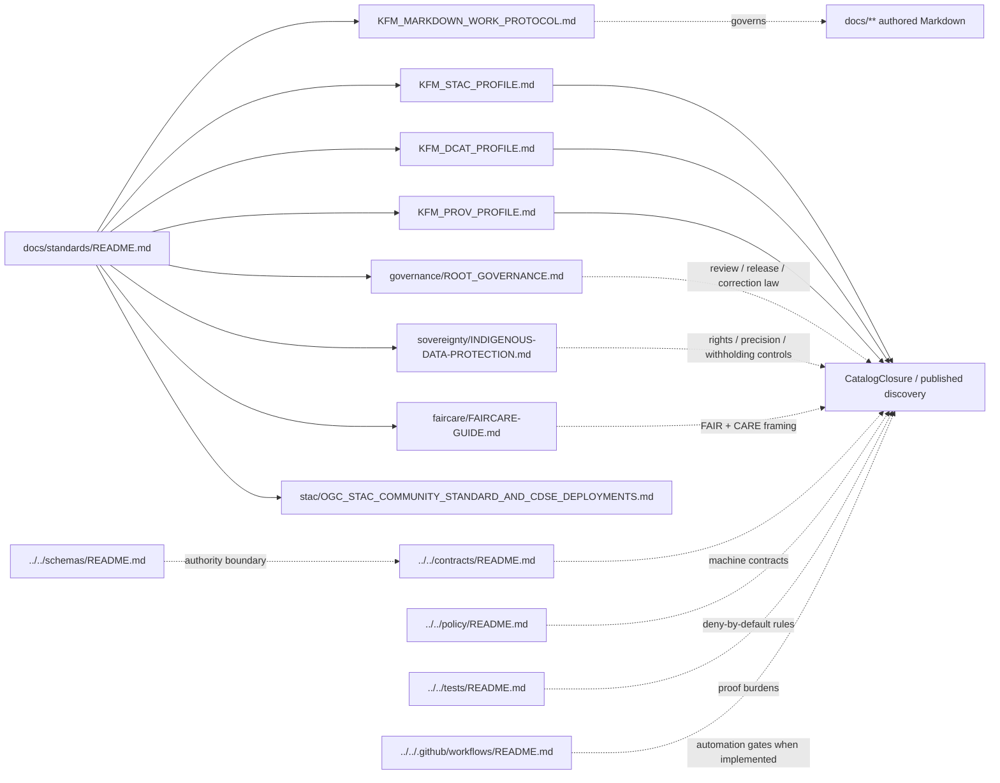

<!-- [KFM_META_BLOCK_V2]
doc_id: kfm://doc/REVIEW_REQUIRED_UUID
title: Standards
type: standard
version: v1
status: draft
owners: @bartytime4life
created: REVIEW_REQUIRED_DATE
updated: REVIEW_REQUIRED_DATE
policy_label: public
related: [../README.md, ../../README.md, ./KFM_STAC_PROFILE.md, ./KFM_DCAT_PROFILE.md, ./KFM_PROV_PROFILE.md, ./KFM_MARKDOWN_WORK_PROTOCOL.md, ./governance/ROOT_GOVERNANCE.md, ./faircare/FAIRCARE-GUIDE.md, ./sovereignty/INDIGENOUS-DATA-PROTECTION.md, ./stac/OGC_STAC_COMMUNITY_STANDARD_AND_CDSE_DEPLOYMENTS.md, ../../contracts/README.md, ../../schemas/README.md, ../../policy/README.md, ../../tests/README.md, ../../.github/workflows/README.md]
tags: [kfm, standards, metadata, provenance, governance]
notes: [UUID and commit-level dates still need direct verification; current public main shows substantive draft standards in STAC/DCAT/PROV/Markdown/governance/sovereignty/STAC-note lanes, while FAIRCARE remains scaffold-only.]
[/KFM_META_BLOCK_V2] -->

# Standards

_Governed standards index for KFM metadata, provenance, publication, documentation, and review._

**Status:** `experimental`  
**Doc status:** `draft`  
**Owners:** `@bartytime4life` *(current `/docs/` CODEOWNERS owner; no narrower `/docs/standards/` rule is visible on public `main`)*


**Quick jump:** [Scope](#scope) · [Repo fit](#repo-fit) · [Current public standards surface](#current-public-standards-surface) · [Accepted inputs](#accepted-inputs) · [Exclusions](#exclusions) · [Directory tree](#directory-tree) · [Quickstart](#quickstart) · [Usage](#usage) · [Diagram](#diagram) · [Standards map](#standards-map) · [Definition of done](#definition-of-done) · [FAQ](#faq) · [Appendix](#appendix)

**Repo fit:** [`docs/standards/README.md`](./README.md) · upstream [`../README.md`](../README.md) / [`../../README.md`](../../README.md) · downstream [`KFM_STAC_PROFILE.md`](./KFM_STAC_PROFILE.md), [`KFM_DCAT_PROFILE.md`](./KFM_DCAT_PROFILE.md), [`KFM_PROV_PROFILE.md`](./KFM_PROV_PROFILE.md), [`KFM_MARKDOWN_WORK_PROTOCOL.md`](./KFM_MARKDOWN_WORK_PROTOCOL.md), [`governance/ROOT_GOVERNANCE.md`](./governance/ROOT_GOVERNANCE.md), [`faircare/FAIRCARE-GUIDE.md`](./faircare/FAIRCARE-GUIDE.md), [`sovereignty/INDIGENOUS-DATA-PROTECTION.md`](./sovereignty/INDIGENOUS-DATA-PROTECTION.md), [`stac/OGC_STAC_COMMUNITY_STANDARD_AND_CDSE_DEPLOYMENTS.md`](./stac/OGC_STAC_COMMUNITY_STANDARD_AND_CDSE_DEPLOYMENTS.md)

> [!IMPORTANT]
> This index is grounded in two evidence layers: the March 2026 KFM doctrine corpus and direct public-`main` inspection of `docs/standards/`, `docs/README.md`, `.github/CODEOWNERS`, `contracts/README.md`, `schemas/README.md`, `policy/README.md`, `tests/README.md`, and `.github/workflows/README.md`.

> [!TIP]
> In this README, **substantive draft** means a file has a real body of standards content on public `main`. It does **not** mean the standard is final, machine-enforced, or fully wired into CI.

> [!NOTE]
> Public `main` still shows `.github/workflows/README.md` only inside `.github/workflows/`. Standards enforcement depth beyond documented intent therefore remains **NEEDS VERIFICATION**.

## Scope

`docs/standards/` is the governed home for **cross-cutting standards and profiles** used across KFM domains, catalog closure, governed APIs, UI surfaces, Story Nodes, Focus Mode, and review/release flows.

Inside `docs/`, this lane is the answer to the question **“what must be true?”** It should keep shared rules legible without quietly replacing contracts, policy bundles, tests, or truth-path artifacts with prose.

This README is an **index and routing surface**, not a second copy of every standard. Its job is to keep the standards lane readable, correctly classified, and synchronized with the real branch.

## Repo fit

| Item | Value |
|---|---|
| Path | [`docs/standards/README.md`](./README.md) |
| Path status | **CONFIRMED** on public `main`; mounted-checkout parity still **NEEDS VERIFICATION** |
| Role | Directory index and routing surface for cross-cutting standards, profiles, and protocol docs |
| Within `docs/` | The lane for “what must be true?” |
| Upstream | [`../README.md`](../README.md) · [`../../README.md`](../../README.md) |
| Primary downstream | [`./KFM_STAC_PROFILE.md`](./KFM_STAC_PROFILE.md) · [`./KFM_DCAT_PROFILE.md`](./KFM_DCAT_PROFILE.md) · [`./KFM_PROV_PROFILE.md`](./KFM_PROV_PROFILE.md) · [`./KFM_MARKDOWN_WORK_PROTOCOL.md`](./KFM_MARKDOWN_WORK_PROTOCOL.md) · [`./governance/ROOT_GOVERNANCE.md`](./governance/ROOT_GOVERNANCE.md) · [`./faircare/FAIRCARE-GUIDE.md`](./faircare/FAIRCARE-GUIDE.md) · [`./sovereignty/INDIGENOUS-DATA-PROTECTION.md`](./sovereignty/INDIGENOUS-DATA-PROTECTION.md) · [`./stac/OGC_STAC_COMMUNITY_STANDARD_AND_CDSE_DEPLOYMENTS.md`](./stac/OGC_STAC_COMMUNITY_STANDARD_AND_CDSE_DEPLOYMENTS.md) |
| Adjacent governed areas | [`../../contracts/README.md`](../../contracts/README.md) · [`../../schemas/README.md`](../../schemas/README.md) · [`../../policy/README.md`](../../policy/README.md) · [`../../tests/README.md`](../../tests/README.md) · [`../../.github/workflows/README.md`](../../.github/workflows/README.md) |
| Ownership signal | `/docs/` currently routes to `@bartytime4life` in `.github/CODEOWNERS`; no narrower `/docs/standards/` rule is visible on public `main` |

## Current public standards surface

The standards lane is no longer just this index plus placeholders. Public `main` now shows a mixed surface: several **substantive draft** standards, one clearly visible scaffold, and neighboring machine-check / policy / workflow README boundaries that this directory must keep routing to accurately.

| Surface | Current public `main` state | Why it matters |
|---|---|---|
| [`README.md`](./README.md) | Present, substantive directory index | This file should be revised in place, not replaced by a parallel index. |
| [`KFM_STAC_PROFILE.md`](./KFM_STAC_PROFILE.md) | Present, substantive draft standard | STAC rules already have a dedicated home. This index should route to it rather than describing it as a placeholder. |
| [`KFM_DCAT_PROFILE.md`](./KFM_DCAT_PROFILE.md) | Present, substantive draft standard | DCAT dataset/distribution rules already have their own surface. |
| [`KFM_PROV_PROFILE.md`](./KFM_PROV_PROFILE.md) | Present, substantive draft standard | Outward lineage/profile work is already materially started here. |
| [`KFM_MARKDOWN_WORK_PROTOCOL.md`](./KFM_MARKDOWN_WORK_PROTOCOL.md) | Present, substantive draft protocol | Repo-native Markdown authoring and review rules now live here. |
| [`governance/ROOT_GOVERNANCE.md`](./governance/ROOT_GOVERNANCE.md) | Present, substantive draft standard | Governance routing under `docs/standards/` is now real, not merely structural. |
| [`faircare/FAIRCARE-GUIDE.md`](./faircare/FAIRCARE-GUIDE.md) | Present, scaffold-only | FAIR+CARE is still a visible gap and should stay explicitly marked as such. |
| [`sovereignty/INDIGENOUS-DATA-PROTECTION.md`](./sovereignty/INDIGENOUS-DATA-PROTECTION.md) | Present, substantive draft standard | Sovereignty and protected-knowledge handling already have a substantial standards surface. |
| [`stac/OGC_STAC_COMMUNITY_STANDARD_AND_CDSE_DEPLOYMENTS.md`](./stac/OGC_STAC_COMMUNITY_STANDARD_AND_CDSE_DEPLOYMENTS.md) | Present, substantive draft guidance note | The STAC sub-lane already carries real alignment guidance. |

### Adjacent repo signals

| Surface | Current public `main` state | Why it matters here |
|---|---|---|
| [`../README.md`](../README.md) | Present, substantive | `docs/` frames `docs/standards/` as the lane for shared doctrine/standards and keeps prose downstream of enforcement. |
| [`../../contracts/README.md`](../../contracts/README.md) | Present, substantive | Current machine-contract reference surface. |
| [`../../schemas/README.md`](../../schemas/README.md) | Present, README-only lane | Explicitly guards against parallel schema authority and routes machine contracts toward `contracts/`. |
| [`../../policy/README.md`](../../policy/README.md) | Present, substantive | Keeps deny-by-default, reasons/obligations, and publication-as-governance visible. |
| [`../../tests/README.md`](../../tests/README.md) | Present, substantive | Frames verification as governed proof, not generic QA. |
| [`../../.github/workflows/README.md`](../../.github/workflows/README.md) | Present, README-only lane | Public `main` exposes documentation for workflow intent, but not checked-in workflow YAML. |

[Back to top](#standards)

## Accepted inputs

Place a document in `docs/standards/` when it defines a reusable rule that multiple KFM subsystems must share.

| Accepted input | Why it belongs here |
|---|---|
| Metadata profiles | Shared outward rules for STAC, DCAT, PROV, and related release-safe discovery surfaces |
| Documentation protocols | Rules for governed Markdown authoring, structure, truth posture, and review |
| Governance references | Cross-domain rules for trust-state transitions, review triggers, release boundaries, and correction |
| Sovereignty / rights / sensitivity standards | Cross-cutting protection rules that multiple domains and surfaces must inherit |
| Interoperability notes | Standards-aligned guidance that sharpens how KFM implements shared profiles |
| Validation expectations | Normative requirements that review, tests, or CI should eventually enforce across lanes |
| Cross-cutting vocabularies | Reason codes, obligations, labels, or controlled registries that govern interpretation beyond one domain |

## Exclusions

This directory should not become a catch-all, and this README should not duplicate rules already owned by other files.

| Does **not** belong in this index | Put it here instead |
|---|---|
| Field-by-field STAC rules | [`./KFM_STAC_PROFILE.md`](./KFM_STAC_PROFILE.md) |
| DCAT dataset/distribution detail | [`./KFM_DCAT_PROFILE.md`](./KFM_DCAT_PROFILE.md) |
| PROV entity/activity/agent detail | [`./KFM_PROV_PROFILE.md`](./KFM_PROV_PROFILE.md) |
| Markdown authoring and review protocol detail | [`./KFM_MARKDOWN_WORK_PROTOCOL.md`](./KFM_MARKDOWN_WORK_PROTOCOL.md) |
| Governance trigger rules and root review law | [`./governance/ROOT_GOVERNANCE.md`](./governance/ROOT_GOVERNANCE.md) |
| Sovereignty-sensitive publication rules | [`./sovereignty/INDIGENOUS-DATA-PROTECTION.md`](./sovereignty/INDIGENOUS-DATA-PROTECTION.md) |
| FAIR+CARE-specific guidance once substantive | [`./faircare/FAIRCARE-GUIDE.md`](./faircare/FAIRCARE-GUIDE.md) |
| API endpoint schemas and machine contracts | [`../../contracts/`](../../contracts/) and the eventual authoritative schema home |
| Enforceable policy code or runtime policy bundles | [`../../policy/`](../../policy/) |
| Fixtures, negative-path cases, or proof drills | [`../../tests/`](../../tests/) |
| Domain ETL instructions or source-specific runbooks | domain docs / runbooks / owning code surface |
| Exploratory notes, spikes, or literature summaries | research / idea / planning surfaces |

> [!NOTE]
> A good rule of thumb: if the file is primarily **normative across multiple domains**, it likely belongs here. If it is primarily **implementation-specific**, **domain-specific**, or already owned by a dedicated downstream standard file, it probably does not belong in this index.

## Directory tree

The tree below reflects the files directly verified on public `main` for this revision.

```text
docs/standards/
├── README.md
├── KFM_STAC_PROFILE.md
├── KFM_DCAT_PROFILE.md
├── KFM_PROV_PROFILE.md
├── KFM_MARKDOWN_WORK_PROTOCOL.md
├── governance/
│   └── ROOT_GOVERNANCE.md
├── faircare/
│   └── FAIRCARE-GUIDE.md
├── sovereignty/
│   └── INDIGENOUS-DATA-PROTECTION.md
└── stac/
    └── OGC_STAC_COMMUNITY_STANDARD_AND_CDSE_DEPLOYMENTS.md
```

> [!CAUTION]
> Only the files above were directly opened for this revision. Additional descendants under `docs/standards/` still remain **NEEDS VERIFICATION** until branch-inspected.

## Quickstart

### 1) Find the owning standard first

Use this index as a router, then move to the owning file:

1. For outward asset/item discovery rules, go to [`KFM_STAC_PROFILE.md`](./KFM_STAC_PROFILE.md).
2. For outward dataset/distribution discovery rules, go to [`KFM_DCAT_PROFILE.md`](./KFM_DCAT_PROFILE.md).
3. For provenance / release-lineage rules, go to [`KFM_PROV_PROFILE.md`](./KFM_PROV_PROFILE.md).
4. For Markdown authoring and review rules, go to [`KFM_MARKDOWN_WORK_PROTOCOL.md`](./KFM_MARKDOWN_WORK_PROTOCOL.md).
5. For review triggers, allowed outcomes, and trust-state transitions, go to [`governance/ROOT_GOVERNANCE.md`](./governance/ROOT_GOVERNANCE.md).
6. For Indigenous- or community-sensitive publication controls, go to [`sovereignty/INDIGENOUS-DATA-PROTECTION.md`](./sovereignty/INDIGENOUS-DATA-PROTECTION.md).
7. For FAIR+CARE-specific guidance, check [`faircare/FAIRCARE-GUIDE.md`](./faircare/FAIRCARE-GUIDE.md) — but keep its current scaffold-only state visible until it is expanded.

### 2) Add or revise a standard

1. Confirm the document is **normative**, not exploratory.
2. Check whether an existing standards file already owns the rule.
3. If the right file already exists, **revise it in place** instead of creating a second file with overlapping authority.
4. If no file owns the rule yet, create the smallest useful new document and link it from this index.
5. Re-check neighboring machine-facing surfaces:
   - [`../../contracts/README.md`](../../contracts/README.md)
   - [`../../schemas/README.md`](../../schemas/README.md)
   - [`../../policy/README.md`](../../policy/README.md)
   - [`../../tests/README.md`](../../tests/README.md)
   - [`../../.github/workflows/README.md`](../../.github/workflows/README.md)
6. Update this index whenever the standards surface, ownership signal, or maturity snapshot changes.

### 3) Minimal authoring skeleton

```md
<!-- [KFM_META_BLOCK_V2]
doc_id: kfm://doc/REVIEW_REQUIRED_UUID
title: <Standard title>
type: standard
version: v1
status: draft
owners: REVIEW_REQUIRED_OWNER
created: REVIEW_REQUIRED_DATE
updated: REVIEW_REQUIRED_DATE
policy_label: REVIEW_REQUIRED_POLICY_LABEL
related: [<relative paths or kfm:// ids>]
tags: [kfm, standards]
notes: [<reviewable notes>]
[/KFM_META_BLOCK_V2] -->

# <Standard title>

_One-line purpose._

> [!IMPORTANT]
> State the truth boundary up front. Do not silently upgrade unknown repo state into implementation fact.

## Scope

## Repo fit

## Requirements

## Validation

## Related standards

## Open verification
```

### 4) Merge-time review prompts

- Does this file define a cross-cutting rule, or is it really a domain note?
- Does an existing standards file already own the rule?
- Does it point to the contracts, policy, tests, or workflow surfaces it expects?
- Does it create new review pressure for sensitive, public, or AI-mediated outputs?
- Does it preserve KFM’s evidence-first, fail-closed, and correction-visible posture?

## Usage

### For maintainers

Use this directory to keep shared rules centralized and reviewable. A standard should be linkable from multiple domains without being rewritten in each one, and this index should distinguish **substantive draft standards**, **scaffold-only placeholders**, and **README-only adjacent lanes** instead of flattening them together.

### For domain stewards

Reference standards from your domain docs. Do not copy them into domain READMEs unless the local adaptation itself must be governed, reviewed, and versioned as a distinct rule.

### For contributors

Start here when you need to answer questions like these:

- Which metadata profile applies to this published artifact?
- Where do publication lineage rules live?
- Which review or governance surface should this change reference?
- Which Markdown protocol should a governed README or standard follow?
- Which current files are real standards versus still-placeholder surfaces?

[Back to top](#standards)

## Diagram


```mermaid
flowchart LR
    IDX[docs/standards/README.md] --> STAC[KFM_STAC_PROFILE.md]
    IDX --> DCAT[KFM_DCAT_PROFILE.md]
    IDX --> PROV[KFM_PROV_PROFILE.md]
    IDX --> MD[KFM_MARKDOWN_WORK_PROTOCOL.md]
    IDX --> GOV[governance/ROOT_GOVERNANCE.md]
    IDX --> FAIR[faircare/FAIRCARE-GUIDE.md]
    IDX --> SOV[sovereignty/INDIGENOUS-DATA-PROTECTION.md]
    IDX --> NOTE[stac/OGC_STAC_COMMUNITY_STANDARD_AND_CDSE_DEPLOYMENTS.md]

    STAC --> CLOSURE[CatalogClosure / published discovery]
    DCAT --> CLOSURE
    PROV --> CLOSURE

    MD -.governs.-> DOCS[docs/** authored Markdown]
    GOV -.review / release / correction law.-> CLOSURE
    SOV -.rights / precision / withholding controls.-> CLOSURE
    FAIR -.FAIR + CARE framing.-> CLOSURE

    CONTRACTS[../../contracts/README.md] -.machine contracts.-> CLOSURE
    SCHEMAS[../../schemas/README.md] -.authority boundary.-> CONTRACTS
    POLICY[../../policy/README.md] -.deny-by-default rules.-> CLOSURE
    TESTS[../../tests/README.md] -.proof burdens.-> CLOSURE
    WF[../../.github/workflows/README.md] -.automation gates when implemented.-> CLOSURE
```

## Standards map

This table separates **role** from **current public-branch state** so the index stays truthful as the lane matures.

| Standard surface | Primary role | Current public `main` state | Routing consequence |
|---|---|---|---|
| [`KFM_STAC_PROFILE.md`](./KFM_STAC_PROFILE.md) | Outward STAC profile for items, collections, assets, and catalog discovery | Present; **substantive draft standard** | Route STAC profile work here, not into this index |
| [`KFM_DCAT_PROFILE.md`](./KFM_DCAT_PROFILE.md) | Outward dataset/distribution discovery profile | Present; **substantive draft standard** | Route DCAT mapping and discovery obligations here |
| [`KFM_PROV_PROFILE.md`](./KFM_PROV_PROFILE.md) | Outward provenance / lineage profile | Present; **substantive draft standard** | Route lineage and release-traceability work here |
| [`KFM_MARKDOWN_WORK_PROTOCOL.md`](./KFM_MARKDOWN_WORK_PROTOCOL.md) | Governed Markdown authoring / revision / review protocol | Present; **substantive draft protocol** | Route README and standards authoring rules here |
| [`governance/ROOT_GOVERNANCE.md`](./governance/ROOT_GOVERNANCE.md) | Core governance law and review-trigger standard | Present; **substantive draft standard** | Route trust-state and review-law questions here |
| [`faircare/FAIRCARE-GUIDE.md`](./faircare/FAIRCARE-GUIDE.md) | FAIR+CARE guidance lane | Present; **scaffold-only** | Keep the gap explicit; do not imply completed guidance |
| [`sovereignty/INDIGENOUS-DATA-PROTECTION.md`](./sovereignty/INDIGENOUS-DATA-PROTECTION.md) | Sovereignty and sensitive-data protection standard | Present; **substantive draft standard** | Route Indigenous/community-sensitive handling here |
| [`stac/OGC_STAC_COMMUNITY_STANDARD_AND_CDSE_DEPLOYMENTS.md`](./stac/OGC_STAC_COMMUNITY_STANDARD_AND_CDSE_DEPLOYMENTS.md) | STAC alignment note against OGC baseline and real deployment behavior | Present; **substantive draft guidance note** | Route STAC implementation-alignment questions here |

## Put-it-here test

| Candidate change | Belongs in `docs/standards/`? | Best home |
|---|---|---|
| New STAC field rule for outward Items | Yes | [`./KFM_STAC_PROFILE.md`](./KFM_STAC_PROFILE.md) |
| New DCAT distribution-linkage rule | Yes | [`./KFM_DCAT_PROFILE.md`](./KFM_DCAT_PROFILE.md) |
| New PROV entity/activity constraint | Yes | [`./KFM_PROV_PROFILE.md`](./KFM_PROV_PROFILE.md) |
| New README metadata / placeholder rule | Yes | [`./KFM_MARKDOWN_WORK_PROTOCOL.md`](./KFM_MARKDOWN_WORK_PROTOCOL.md) |
| New trust-state review trigger | Yes | [`./governance/ROOT_GOVERNANCE.md`](./governance/ROOT_GOVERNANCE.md) |
| New Indigenous-location generalization rule | Yes | [`./sovereignty/INDIGENOUS-DATA-PROTECTION.md`](./sovereignty/INDIGENOUS-DATA-PROTECTION.md) |
| FAIR+CARE guidance build-out | Yes | [`./faircare/FAIRCARE-GUIDE.md`](./faircare/FAIRCARE-GUIDE.md) |
| API request/response schema | No | [`../../contracts/`](../../contracts/) |
| Rego policy bundle or decision grammar | No | [`../../policy/`](../../policy/) |
| Test fixtures, golden files, or failure drills | No | [`../../tests/`](../../tests/) |
| Domain ingest runbook | No | domain / runbook / owning code surface |
| Exploratory note or literature digest | No | research / idea / planning surface |

## Definition of done

A standards doc is ready to merge when all of the following are true:

- [ ] Path and title align with the document’s actual role.
- [ ] Scope is explicit and excludes material that belongs elsewhere.
- [ ] Relative links resolve to the governing or downstream files it names.
- [ ] The change lands in the owning downstream standard if one already exists.
- [ ] Contracts, policy, tests, and workflow touchpoints are referenced where relevant.
- [ ] Draft / experimental / unknown state is visible.
- [ ] If the standard affects sensitive or public outputs, review triggers are explicit.
- [ ] The doc does not silently override a stronger governing standard.
- [ ] This index is updated if the standards surface or maturity state changed.

## Review checklist for this index

- [ ] The `Current public standards surface` table still matches the target branch.
- [ ] Downstream files are accurately labeled as **substantive draft**, **scaffold-only**, or **NEEDS VERIFICATION**.
- [ ] `faircare/FAIRCARE-GUIDE.md` is still explicitly marked as scaffold-only unless the file itself has been expanded.
- [ ] `.github/CODEOWNERS` still supports the owner line used here.
- [ ] `.github/workflows/README.md` is still README-only, or this file has been updated to reflect checked-in workflow YAML.
- [ ] `schemas/README.md` still routes machine-contract authority toward `contracts/`, or this file has been updated to reflect an explicit authority decision.
- [ ] Meta-block placeholders have been replaced or intentionally retained.

## FAQ

### Is this directory only for metadata standards?

No. Metadata profiles are central here, but the directory also covers governance, Markdown protocol, sovereignty handling, and other shared normative rules that multiple KFM lanes depend on.

### Do standards replace contracts and schemas?

No. Standards explain the rule set. Contracts and schemas are the machine-facing artifacts that implement or validate those rules in `contracts/`, `schemas/`, CI, or release tooling.

### Why does this README focus on routing instead of repeating every rule?

Because the lane now has multiple substantive downstream docs. Repeating their content here would create drift faster than it creates clarity.

### Which linked file is still only a scaffold on public `main`?

As of the current public snapshot used for this revision, [`faircare/FAIRCARE-GUIDE.md`](./faircare/FAIRCARE-GUIDE.md) is the one directly opened downstream file that remains scaffold-only.

### What should happen if a proposed standard conflicts with a stronger KFM doctrine doc?

The stronger governing doctrine wins. Update the proposal, or document the conflict and route it for review instead of letting drift land quietly.

[Back to top](#standards)

## Appendix

<details>
<summary><strong>Known verification items</strong></summary>

### Repo-state items still needing direct verification

- final UUID and commit-time created / updated dates for this document
- whether `docs/standards/` has additional descendants beyond the files directly opened for this revision
- whether a narrower `/docs/standards/` CODEOWNERS rule should replace the current `/docs/` fallback owner
- whether `.github/workflows/` remains README-only on the target merge branch
- which tests or CI commands actually enforce standards-related validation, if any
- whether `faircare/FAIRCARE-GUIDE.md` has a planned follow-up issue / ADR or remains intentionally skeletal
- whether any standards doc here is using a documented exception to KFM Meta Block v2

### Authoring notes for future maintainers

- Keep this file as an **index and routing surface**, not a second copy of STAC/DCAT/PROV/governance rules.
- When a downstream file changes maturity, update this README at the same time.
- Do not call a substantive draft a scaffold, and do not call a scaffold “basically done.”
- Sync this file with [`../README.md`](../README.md) and the adjacent README surfaces when boundaries move.
- Use reviewable placeholders when metadata is not confirmed; do not silently guess.
- Prefer one owning standards file per rule family over parallel, overlapping docs.

</details>

[Back to top](#standards)
