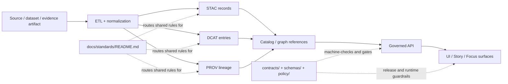

<!-- [KFM_META_BLOCK_V2]
doc_id: kfm://doc/<TODO-uuid>
title: Standards
type: standard
version: v1
status: draft
owners: @bartytime4life
created: <TODO: YYYY-MM-DD>
updated: 2026-03-23
policy_label: public
related: [../README.md, ../../README.md, ./KFM_STAC_PROFILE.md, ./KFM_DCAT_PROFILE.md, ./KFM_PROV_PROFILE.md, ./KFM_MARKDOWN_WORK_PROTOCOL.md, ./governance/ROOT_GOVERNANCE.md, ./faircare/FAIRCARE-GUIDE.md, ./sovereignty/INDIGENOUS-DATA-PROTECTION.md]
tags: [kfm, standards, metadata, provenance, governance]
notes: [Public main raw tree inspected for this directory; created date and UUID still need verification; current sibling standards files are scaffold-only.]
[/KFM_META_BLOCK_V2] -->

# Standards

_Governed standards, profiles, and cross-cutting rules for KFM metadata, provenance, publication, documentation, and review._

**Status:** `experimental`  
**Doc status:** `draft`  
**Owners:** `@bartytime4life` *(current `/docs/` CODEOWNERS owner; no narrower standards owner was directly verified)*  


**Quick jump:** [Scope](#scope) · [Repo fit](#repo-fit) · [Current verified snapshot](#current-verified-snapshot) · [Accepted inputs](#accepted-inputs) · [Directory tree](#directory-tree) · [Quickstart](#quickstart) · [Standards map](#standards-map) · [Definition of done](#definition-of-done) · [FAQ](#faq) · [Appendix](#appendix)

> [!IMPORTANT]
> This index is grounded in two evidence layers: the March 2026 KFM doctrine corpus and direct inspection of the public `main` tree for `docs/standards/README.md`, its sibling standards files, `.github/CODEOWNERS`, and adjacent contract / policy / workflow README surfaces.
>
> The current session still did **not** inspect a mounted checkout, GitHub settings, or workflow execution, so enforcement depth, branch-local drift, and any un-opened descendants remain **NEEDS VERIFICATION**.

> [!NOTE]
> On the public `main` tree opened for this revision, the sibling profile, protocol, governance, FAIR+CARE, sovereignty, and STAC-note files directly inspected under `docs/standards/` are all **scaffold-only**. This README is currently the most substantive standards surface in that directory.

## Scope

`docs/standards/` is the governed home for **cross-cutting standards and profiles** used across KFM domains, catalogs, APIs, UI surfaces, Story Nodes, Focus Mode, and release workflows.

This directory exists to keep shared rules in one place: metadata profiles, provenance expectations, documentation protocols, governance references, FAIR+CARE obligations, sovereignty protections, and related interoperability guidance.

## Repo fit

| Item | Value |
|---|---|
| Path | [`docs/standards/README.md`](./README.md) |
| Path status | **CONFIRMED** on public `main`; mounted-checkout parity still **NEEDS VERIFICATION** |
| Role | Human-readable index for governed standards, profiles, and cross-cutting rule surfaces |
| Upstream | [docs index](../README.md) · [repo root](../../README.md) |
| Downstream | [KFM_STAC_PROFILE.md](./KFM_STAC_PROFILE.md) · [KFM_DCAT_PROFILE.md](./KFM_DCAT_PROFILE.md) · [KFM_PROV_PROFILE.md](./KFM_PROV_PROFILE.md) · [KFM_MARKDOWN_WORK_PROTOCOL.md](./KFM_MARKDOWN_WORK_PROTOCOL.md) · [governance/ROOT_GOVERNANCE.md](./governance/ROOT_GOVERNANCE.md) · [faircare/FAIRCARE-GUIDE.md](./faircare/FAIRCARE-GUIDE.md) · [sovereignty/INDIGENOUS-DATA-PROTECTION.md](./sovereignty/INDIGENOUS-DATA-PROTECTION.md) |
| Adjacent governed areas | [../../contracts/README.md](../../contracts/README.md) · [../../schemas/README.md](../../schemas/README.md) · [../../policy/README.md](../../policy/README.md) · [../../tests/README.md](../../tests/README.md) · [../../.github/workflows/README.md](../../.github/workflows/README.md) |

### Current verified snapshot

| Surface | Current public `main` state | Why it matters |
|---|---|---|
| [`README.md`](./README.md) | Present, substantive | This index already exists and should be revised in place, not replaced with a parallel doc. |
| [`KFM_STAC_PROFILE.md`](./KFM_STAC_PROFILE.md) | Present, scaffold-only | The STAC profile name is real in the repo, but the profile content still needs substantive build-out. |
| [`KFM_DCAT_PROFILE.md`](./KFM_DCAT_PROFILE.md) | Present, scaffold-only | The DCAT profile surface exists, but it is not yet a full standard. |
| [`KFM_PROV_PROFILE.md`](./KFM_PROV_PROFILE.md) | Present, scaffold-only | Provenance is routed here, but the actual profile content still needs authoring. |
| [`KFM_MARKDOWN_WORK_PROTOCOL.md`](./KFM_MARKDOWN_WORK_PROTOCOL.md) | Present, scaffold-only | The Markdown protocol lane exists, but the working rules are not yet captured here on public `main`. |
| [`governance/ROOT_GOVERNANCE.md`](./governance/ROOT_GOVERNANCE.md) | Present, scaffold-only | Governance routing is real, but the downstream file still needs content. |
| [`faircare/FAIRCARE-GUIDE.md`](./faircare/FAIRCARE-GUIDE.md) | Present, scaffold-only | FAIR+CARE is part of the standards surface, but not yet substantive here. |
| [`sovereignty/INDIGENOUS-DATA-PROTECTION.md`](./sovereignty/INDIGENOUS-DATA-PROTECTION.md) | Present, scaffold-only | Sovereignty routing exists and should remain explicit, even while the file is still minimal. |
| [`stac/OGC_STAC_COMMUNITY_STANDARD_AND_CDSE_DEPLOYMENTS.md`](./stac/OGC_STAC_COMMUNITY_STANDARD_AND_CDSE_DEPLOYMENTS.md) | Present, scaffold-only | The standards sub-lane for STAC implementation notes exists, but content maturity is still pending. |
| [`../../schemas/README.md`](../../schemas/README.md) | Present | `schemas/README.md` explicitly routes standards readers back here while keeping schema-home authority unresolved. |
| [`../../.github/CODEOWNERS`](../../.github/CODEOWNERS) | Present | `/docs/` currently routes to `@bartytime4life`, which is the strongest owner signal directly verified in this revision. |
| [`../../.github/workflows/README.md`](../../.github/workflows/README.md) | Present, README-only | Public `main` did not expose checked-in workflow YAML during this revision, so standards-enforcement claims stay cautious. |

### Why this directory matters

KFM’s documented pipeline is dependency-ordered: evidence and catalogs come before graph use, API serving, UI display, Story Nodes, and Focus Mode.

Standards live here because they are part of that dependency spine, not post-hoc commentary.

[Back to top](#standards)

## Accepted inputs

Place a document here when it defines a reusable rule that multiple KFM subsystems must share.

| Accepted input | Why it belongs here |
|---|---|
| Metadata profiles | Shared rules for STAC, DCAT, PROV, and related outward publication surfaces |
| Documentation protocols | Rules for front matter, structure, validation, and governed doc authorship |
| Governance references | Cross-domain rules for review, ethics, sensitivity, and sovereignty |
| Interoperability notes | Standards-aligned guidance that sharpens how KFM implements shared profiles |
| Validation expectations | Normative requirements that CI/review should enforce across domains |
| Cross-cutting controlled vocabularies | Terms, labels, or registries that govern interpretation beyond one domain |

## Exclusions

This directory should not become a catch-all.

| Does **not** belong here | Put it here instead |
|---|---|
| Domain ETL instructions or source-specific runbooks | `../data/<domain>/` or domain-specific docs |
| Exploratory notes, spikes, literature summaries | `../research/` |
| API endpoint schemas and machine contracts | `../../contracts/` and the eventual authoritative schema home |
| Enforceable policy code | `../../policy/` |
| Story Nodes, narrative content, or Focus outputs | governed story/report areas |
| Operational deployment runbooks | architecture / platform / infra docs |

> [!NOTE]
> A good rule of thumb: if the file is primarily **normative across multiple domains**, it likely belongs here. If it is primarily **implementation-, domain-, or experiment-specific**, it probably does not.

## Directory tree

The tree below reflects the files directly verified in this revision plus the standards substructure this README already routes to.

```text
docs/standards/
├── README.md
├── KFM_STAC_PROFILE.md
├── KFM_DCAT_PROFILE.md
├── KFM_PROV_PROFILE.md
├── KFM_MARKDOWN_WORK_PROTOCOL.md
├── governance/
│   └── ROOT_GOVERNANCE.md
├── faircare/
│   └── FAIRCARE-GUIDE.md
├── sovereignty/
│   └── INDIGENOUS-DATA-PROTECTION.md
└── stac/
    └── OGC_STAC_COMMUNITY_STANDARD_AND_CDSE_DEPLOYMENTS.md
```

> [!CAUTION]
> In the public `main` files directly opened for this revision, every downstream file above except `README.md` is currently a **scaffold**. Additional descendants, if any, still need checkout-level verification.

## Quickstart

### Add a new standard

1. Confirm the document is **normative**, not exploratory.
2. State the scope clearly: what artifacts, routes, datasets, or surfaces it governs.
3. Link the standard to its governing neighbors:
   - metadata profile refs, when applicable;
   - governance / FAIR+CARE / sovereignty refs, when applicable;
   - related contracts or schemas, when applicable.
4. If the right downstream file already exists as a scaffold, **expand that scaffold in place** instead of creating a parallel file with overlapping authority.
5. Add this index entry and update any adjacent README that should point to it.
6. Verify lint, links, and any profile/schema checks before merge.

### Minimal authoring skeleton

```md
<!-- [KFM_META_BLOCK_V2]
doc_id: kfm://doc/<uuid>
title: <Standard title>
type: standard
version: v1
status: draft
owners: <team or names>
created: YYYY-MM-DD
updated: YYYY-MM-DD
policy_label: public|restricted|...
related: [<relative paths or kfm:// ids>]
tags: [kfm, standards]
notes: [<reviewable notes>]
[/KFM_META_BLOCK_V2] -->

# <Standard title>

_One-line purpose._

## Scope

## When to use this

## Requirements

## Validation

## Related standards

## Change log
```

### Merge-time review prompts

- Does this file define a cross-cutting rule, or is it really a domain note?
- Does it duplicate a rule already owned elsewhere?
- Does it point to the schemas/contracts it expects?
- Does it create a new review trigger for sensitive, public, or AI-mediated outputs?
- Does it stay aligned with KFM’s evidence-first and fail-closed posture?

## Usage

### For maintainers

Use this directory to keep shared rules centralized and reviewable. A standard should be linkable from multiple domains without being rewritten in each one, and this index should distinguish **substantive standards** from **scaffold placeholders** rather than flattening them together.

### For domain stewards

Reference standards from your domain docs; do not copy them into domain READMEs unless the local adaptation itself must be governed and reviewed.

### For contributors

Start here when you need to answer:

- Which metadata profile applies?
- What publication metadata is mandatory?
- Which governance references must a new artifact cite?
- Which documentation protocol should a new governed doc follow?

## Diagram


```mermaid
flowchart LR
    A[Source / dataset / evidence artifact] --> B[ETL + normalization]
    B --> C[STAC records]
    B --> D[DCAT entries]
    B --> E[PROV lineage]
    C --> F[Catalog / graph references]
    D --> F
    E --> F
    F --> G[Governed API]
    G --> H[UI / Story / Focus surfaces]

    I[docs/standards/README.md] -.routes shared rules for.-> C
    I -.routes shared rules for.-> D
    I -.routes shared rules for.-> E

    J[contracts/ + schemas/ + policy/] -.machine-checks and gates.-> G
    J -.release and runtime guardrails.-> H
```

## Standards map

This table separates **intended role** from **current public-branch reality** so the README does not overstate what downstream files already contain.

| Standard surface | Intended role | Current public `main` state |
|---|---|---|
| [`KFM_STAC_PROFILE.md`](./KFM_STAC_PROFILE.md) | STAC-aligned asset/item metadata profile | Present; scaffold-only |
| [`KFM_DCAT_PROFILE.md`](./KFM_DCAT_PROFILE.md) | Dataset/distribution discovery profile | Present; scaffold-only |
| [`KFM_PROV_PROFILE.md`](./KFM_PROV_PROFILE.md) | Provenance / lineage expectations | Present; scaffold-only |
| [`KFM_MARKDOWN_WORK_PROTOCOL.md`](./KFM_MARKDOWN_WORK_PROTOCOL.md) | Governed Markdown authoring / validation rules | Present; scaffold-only |
| [`governance/ROOT_GOVERNANCE.md`](./governance/ROOT_GOVERNANCE.md) | Cross-cutting review and governance baseline | Present; scaffold-only |
| [`faircare/FAIRCARE-GUIDE.md`](./faircare/FAIRCARE-GUIDE.md) | FAIR+CARE framing and review obligations | Present; scaffold-only |
| [`sovereignty/INDIGENOUS-DATA-PROTECTION.md`](./sovereignty/INDIGENOUS-DATA-PROTECTION.md) | Sovereignty and protected-knowledge handling | Present; scaffold-only |
| [`stac/OGC_STAC_COMMUNITY_STANDARD_AND_CDSE_DEPLOYMENTS.md`](./stac/OGC_STAC_COMMUNITY_STANDARD_AND_CDSE_DEPLOYMENTS.md) | Implementation-facing STAC alignment note | Present; scaffold-only |

## Put-it-here test

| Candidate change | Belongs in `docs/standards/`? | Reason |
|---|---|---|
| New STAC profile rule | Yes | Cross-cutting metadata constraint |
| New DCAT/PROV linkage rule | Yes | Shared publication requirement |
| API endpoint request/response schema | No | Put in `../../contracts/` |
| Rego policy implementation | No | Put in `../../policy/` |
| Domain ingest runbook | No | Put in domain docs |
| Research summary of an external source | No | Put in `../research/` |
| Documentation protocol for governed docs | Yes | Shared authoring / validation rule |

## Definition of done

A standards doc is ready to merge when all of the following are true:

- [ ] Path and title align with the document’s actual role.
- [ ] Scope is explicit and excludes material that belongs elsewhere.
- [ ] Relative links resolve to the governing or downstream files it names.
- [ ] Relevant profile, governance, FAIR+CARE, and sovereignty refs are present.
- [ ] Validation expectations are written clearly enough to be repeated.
- [ ] The doc does not silently override a stronger governing standard.
- [ ] Any draft or provisional status is visible.
- [ ] If the standard affects sensitive or public outputs, review triggers are explicit.
- [ ] If the README names a downstream file that is still scaffold-only, that state is called out instead of implied away.
- [ ] This index is updated if the new doc changes the standards surface.

## Review checklist for this index

- [ ] Every referenced file in this README is still present on the target branch.
- [ ] Owners reflect `.github/CODEOWNERS` or a more specific verified override.
- [ ] The `Current verified snapshot` table still matches the real branch.
- [ ] Downstream files are accurately labeled as substantive, scaffold-only, or **NEEDS VERIFICATION**.
- [ ] This README reflects the current standards surface rather than an aspirational one.
- [ ] Placeholder metadata in the KFM meta block has been replaced or intentionally retained.

## FAQ

### Is this directory only for metadata standards?

No. Metadata profiles are central here, but the directory also covers governance, documentation protocol, sovereignty handling, and other shared normative rules that multiple KFM lanes depend on.

### Do standards replace contracts and schemas?

No. Standards explain the rule set. Contracts and schemas are the machine-facing artifacts that implement or validate those rules in `contracts/`, `schemas/`, CI, or release tooling.

### Can a domain define its own local rule instead of using a shared standard?

Only when the local rule is truly domain-specific or when it is an explicit extension. Local convenience copies of cross-cutting rules are a drift risk and should be avoided.

### What if a linked standards file exists but is still a scaffold?

Keep this README accurate about that state. Expand the scaffold in place if it is the right home, or track the gap explicitly before adding parallel docs. The goal is to reduce drift, not hide it.

### What should happen if a proposed standard conflicts with a stronger KFM doctrine doc?

The stronger governing doctrine wins. Update the proposal, or document the conflict and route it for review instead of letting drift land quietly.

[Back to top](#standards)

## Appendix

<details>
<summary><strong>Known verification items</strong></summary>

### Repo-state items still needing direct verification

- Exact creation date and final UUID for this document
- Whether `docs/standards/` has additional descendants beyond the files directly opened for this revision
- Whether a narrower standards-specific CODEOWNERS rule should replace the current `/docs/` fallback owner
- Whether public `main` is the branch this document should track for merge-time reality
- Exact CI workflows or commands that enforce standards-related validation once checked-in workflow YAML exists
- Whether governance / FAIR+CARE / sovereignty surfaces remain nested under `docs/standards/` only or are also normalized elsewhere in `docs/`

### Authoring notes for future maintainers

- Keep this file as an **index and routing surface**, not a second copy of every standard.
- Prefer short descriptions with strong links over long duplicate summaries.
- Keep the distinction between **present** and **substantive** visible; a scaffold is real repo state, but it is not finished doctrine.
- If a standard graduates from scaffold or draft to enforced substance, update both its local file and this index together.
- When in doubt, add a verification note instead of overstating repo reality.

</details>

[Back to top](#standards)
