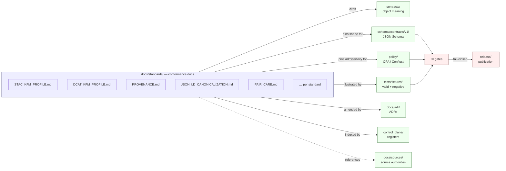

<!-- [KFM_META_BLOCK_V2]
doc_id: kfm://doc/docs-standards-readme
title: docs/standards — External Standards KFM Conforms To
type: standard
version: v1
status: draft
owners: TODO — Standards steward (placeholder); see CODEOWNERS
created: 2026-05-14
updated: 2026-05-14
policy_label: public
related:
  - docs/doctrine/directory-rules.md
  - docs/adr/ADR-0001-schema-home.md
  - contracts/README.md
  - schemas/README.md
  - policy/README.md
  - docs/sources/README.md
tags: [kfm, standards, conformance, governance, docs]
notes:
  - Folder path is CONFIRMED per Directory Rules §6.1.
  - All child-file path references are PROPOSED until verified against mounted-repo state.
[/KFM_META_BLOCK_V2] -->

# docs/standards

> External standards KFM conforms to — and the conformance posture, profiles, version pins, and gates that make that conformance auditable.

[](../doctrine/directory-rules.md)
[](#status)
[](../doctrine/directory-rules.md)
[](../adr/ADR-0001-schema-home.md)
[](#last-reviewed)
[](#)

**Status:** active · **Authority level:** canonical (docs subfolder) · **Owners:** Standards steward _(TODO)_ · **Last reviewed:** 2026-05-14

> [!IMPORTANT]
> This folder **documents conformance**; it does not host machine schemas, policy bundles, or contracts. Machine validation lives in `schemas/`, admissibility lives in `policy/`, semantic meaning lives in `contracts/`. Documents here explain how each external standard is profiled, scoped, version-pinned, gated, and rolled back — and they pin KFM's interpretation of ambiguous spec choices so that downstream stewards, validators, and partners read the same answer.

---

## Quick jump

- [Purpose](#purpose)
- [Authority level](#authority-level)
- [Status](#status)
- [Standards registry](#standards-registry)
- [What belongs here](#what-belongs-here)
- [What does NOT belong here](#what-does-not-belong-here)
- [Repo fit](#repo-fit)
- [Inputs](#inputs)
- [Outputs](#outputs)
- [Proposed directory layout](#proposed-directory-layout)
- [Validation](#validation)
- [Review burden](#review-burden)
- [Related folders](#related-folders)
- [ADRs](#adrs)
- [Open questions & NEEDS VERIFICATION](#open-questions--needs-verification)
- [Anti-patterns](#anti-patterns)
- [Appendix](#appendix)
- [Last reviewed](#last-reviewed)

---

## Purpose

`docs/standards/` is the human-readable home for **how KFM conforms to external standards** — STAC, DCAT, PROV-O, Darwin Core, CIDOC-CRM, Schema.org, JSON-LD canonicalization, OpenLineage, SLSA, FAIR + CARE, and others. Each standard receives a profile or posture document that pins KFM's interpretation, names the namespaced extensions, lists required and optional fields, links to the machine schemas that enforce them, and records the gates that fail-closed when conformance breaks.

The folder exists because external standards do not, by themselves, decide what KFM publishes. They define **interoperable shapes**; KFM still requires its own evidence, source authority, sensitivity, review-state, and release-state posture *on top of* those shapes before any artifact crosses the trust membrane. This folder documents that pairing in language partners can cite.

> [!NOTE]
> **`docs/` explains; `control_plane/` indexes; `contracts/` defines meaning; `schemas/` defines shape.** A standards profile here is documentation, not enforcement. The corresponding JSON Schema or policy bundle is what actually fails the gate.

---

## Authority level

**Canonical (docs subfolder)** under `docs/`, per Directory Rules §6.1. Documents here:

- Are **doctrine-bearing for KFM's interpretation** of each external standard.
- Are **not the standards themselves** — they reference the upstream specification by version and scope KFM's deviations.
- May be cited by ADRs, READMEs, runbooks, validators, and policy bundles as the canonical KFM profile for a given standard.
- **Do not enforce** anything on their own. Enforcement lives in `schemas/`, `policy/`, `tools/validators/`, and `tests/`.

> [!WARNING]
> A standards profile that drifts from its matching schema, policy bundle, or validator is a **drift candidate** under Directory Rules §13. Open an entry in `docs/registers/DRIFT_REGISTER.md` rather than silently letting one source diverge.

---

## Status

**PROPOSED** for the folder's internal structure and file list. **CONFIRMED** for the doctrine (which standards apply, in what role, to what artifact families).

| Item | Status | Source of truth |
|---|---|---|
| Folder location (`docs/standards/`) | **CONFIRMED** as the canonical home | Directory Rules §6.1 |
| Standards list and roles | **CONFIRMED** (doctrine) | KFM corpus — Pass 10 §C4, §C8, §C15; MapLibre v1.8–1.9; Pass 18 |
| Individual profile files (e.g. `STAC_KFM_PROFILE.md`, `PROVENANCE.md`) | **PROPOSED** | Not yet verified in mounted repo |
| `kfm:` vs `ks-kfm:` STAC namespace | **OPEN QUESTION** | Pass 10 §C4-01 |
| STAC ↔ DCAT canonical split for spatiotemporal data | **OPEN QUESTION** | Pass 10 §C4-05 |
| FGDC CSDGM / ISO 19115 mandatory-field disposition | **NEEDS VERIFICATION** | Pass 18 SRC-P18-010 |

---

## Standards registry

The tables below catalogue the external standards KFM commits to and the role each plays in the trust spine. Each row points to a **PROPOSED** profile file under this folder; *a row's existence here does not mean the profile file exists yet.*

[⬆ Back to top](#docsstandards)

### Encoding & catalog standards

| Standard | KFM role | Status | Profile (PROPOSED) |
|---|---|---|---|
| **STAC** 1.0 (Catalog, Collection, Item) | Spatiotemporal asset catalog with `kfm:provenance` namespace block | CONFIRMED doctrine | `STAC_KFM_PROFILE.md` |
| **STAC extensions** (Processing, Projection, Raster, Datacube, EO, File, Checksum) | Carry CRS, raster metadata, file integrity, derivation lineage | CONFIRMED doctrine | inside `STAC_KFM_PROFILE.md` |
| **DCAT** | Dataset / Distribution metadata for non-spatiotemporal data | CONFIRMED doctrine | `DCAT_KFM_PROFILE.md` |
| **GeoJSON** (RFC 7946) | Runtime feature transport; never proof | CONFIRMED doctrine | `GEOJSON_USAGE.md` |
| **JSON Schema** (Draft 2020-12) | Machine-checkable shape; default home `schemas/contracts/v1/` per ADR-0001 | CONFIRMED doctrine | `JSON_SCHEMA_USAGE.md` |
| **JSON-LD** + JCS (RFC 8785) / URDNA2015 | Canonicalization for content-addressed evidence bundles | CONFIRMED doctrine | `JSON_LD_CANONICALIZATION.md` |
| **GeoParquet / COG / PMTiles** | Spatial artifact formats with STAC asset roles | CONFIRMED doctrine | inside `STAC_KFM_PROFILE.md` |
| **OGC WMS / WMTS** | External map services; governed by SourceDescriptor and `tileProtocol` enum | CONFIRMED doctrine | `OGC_SERVICES.md` |

### Provenance, lineage & supply-chain

| Standard | KFM role | Status | Profile (PROPOSED) |
|---|---|---|---|
| **W3C PROV-O + PAV** | Claim-level provenance; `prov:wasGeneratedBy` required for every graph claim | CONFIRMED doctrine | `PROVENANCE.md` |
| **OpenLineage** | Operational event layer (START / COMPLETE facets); translated to PROV-O for permanence | CONFIRMED doctrine | `OPENLINEAGE.md` |
| **SLSA** | Build / run attestations; target level pending ADR | CONFIRMED doctrine (level OPEN) | inside `PROVENANCE.md` |
| **DSSE / Cosign** | Signing run receipts, release manifests, and content-addressed artifacts | CONFIRMED doctrine | inside `PROVENANCE.md` |

### Vocabulary & semantic standards

| Standard | KFM role | Status | Profile (PROPOSED) |
|---|---|---|---|
| **CIDOC-CRM** (ISO 21127) | Cultural-heritage graph backbone (E5, E7, E21, E53, E55, E74) | CONFIRMED doctrine | `CIDOC_CRM.md` |
| **Schema.org** | Web-discoverable surface projection; version pinned via policy | CONFIRMED doctrine | `SCHEMA_ORG.md` |
| **Darwin Core (DwC)** | Biodiversity terms inside STAC `properties.taxon` (hybrid pattern) | CONFIRMED doctrine | `DARWIN_CORE.md` |

### Domain-specific exchange formats

| Standard | KFM role | Status | Profile (PROPOSED) |
|---|---|---|---|
| **GTFS / GTFS-Realtime** | Transit static and real-time feeds; staleness gates required | CONFIRMED doctrine | `GTFS.md` |
| **WZDx** | Work-zone data exchange GeoJSON | CONFIRMED doctrine | `WZDX.md` |
| **GEDCOM 5.5 / GEDCOM-X** | Genealogical interchange | CONFIRMED doctrine | `GEDCOM.md` |
| **GA4GH AAI / Passports / DUO** | Consent and access tokens for sensitive (genomic / DTC) data | CONFIRMED doctrine | `GA4GH.md` |

### Metadata-completeness & publication ethics

| Standard | KFM role | Status | Profile (PROPOSED) |
|---|---|---|---|
| **FGDC CSDGM / ISO 19115** | Catalog-record completeness reporting per artifact family | NEEDS VERIFICATION | `METADATA_STANDARDS.md` |
| **FAIR + CARE** | Operational publication ethics; CARE labels in MetaBlock v2 (`public` / `generalized` / `restricted`) | CONFIRMED doctrine | `FAIR_CARE.md` |

### Identifier authorities — *documented elsewhere*

External identifier authorities (Wikidata QID, LCNAF, VIAF, ISNI, ITIS TSN, GBIF Backbone, USGS GNIS, Getty ULAN/TGN, SNAC/EAC-CPF, KSHS, KHRI, KU NHM, KBS NHI, KDWP SINC) are documented in `docs/sources/` under the source-authority register, **not here**. This folder profiles encoding and vocabulary standards; `docs/sources/` profiles upstream data authorities.

[⬆ Back to top](#docsstandards)

---

## What belongs here

- **Profile documents** — KFM-specific conformance posture for an external standard (e.g. `STAC_KFM_PROFILE.md`).
- **Posture documents** — non-profile narrative about how a standard is *used*, *bounded*, or *gated* in KFM (e.g. `OPENLINEAGE.md`, `FAIR_CARE.md`).
- **Crosswalks** — mappings between standards (e.g. `STAC_X_DCAT.md`, `OPENLINEAGE_TO_PROV_O.md`, `DWC_X_STAC.md`).
- **Illustrative examples** — short JSON / JSON-LD fragments demonstrating the profile. Long examples and golden fixtures live under `tests/fixtures/`.
- **Conformance checklists** — prose "definition of done" per standard. The machine version lives in `tools/validators/` and `policy/`.
- **Version pin notes** — which spec version of each standard KFM is committed to (e.g. STAC 1.0; Schema.org version pin via ADR).
- **Extension governance** — when KFM ships a vendor extension under the `kfm:*` namespace, its design rationale and field reference.

## What does NOT belong here

- **JSON Schemas** → `schemas/contracts/v1/...` (default per ADR-0001). A profile may *link* to schemas but MUST NOT host them.
- **Policy bundles or Rego / OPA rules** → `policy/bundles/`. A profile may *describe* gate behavior but MUST NOT host the bundle.
- **Validator source code** → `tools/validators/`. A profile may *name* the validator but MUST NOT contain executable logic.
- **Fixtures** → `tests/fixtures/` (or `schemas/tests/valid|invalid/` for schema test vectors). Inline illustrative snippets only here.
- **Source-authority registers** → `docs/sources/` and `control_plane/source_authority_register.yaml`. STAC is not a data source; Wikidata is not a JSON encoding.
- **Object meaning** → `contracts/`. Profiles here describe *the external standard's* shape; KFM object semantics live in `contracts/`.
- **Release decisions** → `release/`. Conformance is an *input* to a release decision, not the decision itself.
- **Generated reports** → `docs/reports/` (read-only) or `data/receipts/` / `data/proofs/` (machine output).

> [!CAUTION]
> A profile document that starts to look like a schema, a Rego rule, or a fixture set has crossed the boundary. Move the runnable parts to their canonical homes and keep this folder explanatory.

[⬆ Back to top](#docsstandards)

---

## Repo fit


```mermaid
flowchart LR
  subgraph Doc["docs/standards/ — conformance docs"]
    P1["STAC_KFM_PROFILE.md"]
    P2["DCAT_KFM_PROFILE.md"]
    P3["PROVENANCE.md"]
    P4["JSON_LD_CANONICALIZATION.md"]
    P5["FAIR_CARE.md"]
    P6["… per standard"]
  end

  Doc -->|cites| Contracts["contracts/<br/>object meaning"]
  Doc -->|pins shape for| Schemas["schemas/contracts/v1/<br/>JSON Schema"]
  Doc -->|pins admissibility for| Policy["policy/<br/>OPA / Conftest"]
  Doc -->|illustrated by| Tests["tests/fixtures/<br/>valid + negative"]
  Doc -->|amended by| ADR["docs/adr/<br/>ADRs"]
  Doc -->|indexed by| CP["control_plane/<br/>registers"]
  Doc -. references .-> Sources["docs/sources/<br/>source authorities"]

  Schemas --> CI["CI gates"]
  Policy --> CI
  Tests --> CI
  CI -->|fail-closed| Release["release/<br/>publication"]

  classDef doc fill:#eef,stroke:#558
  classDef canon fill:#efe,stroke:#585
  classDef gate fill:#fee,stroke:#855
  class Doc doc
  class Contracts,Schemas,Policy,Tests,ADR,CP,Sources canon
  class CI,Release gate
```

> [!NOTE]
> Diagram is **NEEDS VERIFICATION** against current repo topology. Arrows reflect doctrine per Directory Rules §6 and Pass 10 §C4 / §C8; precise wiring is **PROPOSED** until mounted-repo inspection confirms which adjacent files exist.

[⬆ Back to top](#docsstandards)

---

## Inputs

Documents here are authored from:

- **The upstream specification** for each standard (STAC, DCAT, PROV-O, etc.), referenced by version and URL.
- **KFM doctrine** — particularly Pass 10 §C4 (catalogs), §C8 (graph vocabulary), §C15 (FAIR + CARE), Pass 18 metadata-completeness, and the MapLibre Master report (v1.8 / v1.9 catalog-binding rules).
- **ADRs** pinning a specific interpretation (e.g. ADR-0001 schema home; future ADRs for namespace choice, version pins, profile versioning, SLSA level).
- **Drift reports** from `docs/registers/DRIFT_REGISTER.md` when a profile, schema, and policy bundle disagree.
- **Verification backlog** items from `docs/registers/VERIFICATION_BACKLOG.md` that demand profile clarification.

## Outputs

Documents here are consumed by:

- **`contracts/`** — semantic-meaning docs cite the profile when an object family is shaped by an external standard.
- **`schemas/contracts/v1/`** — JSON Schemas reference the profile in `$comment` or accompanying READMEs.
- **`policy/bundles/`** — Rego rules reference the profile for the conformance condition they enforce.
- **`tools/validators/`** — validator READMEs cite the profile for required and optional fields.
- **`tests/fixtures/`** — fixture READMEs cite the profile for what valid and negative samples demonstrate.
- **`apps/governed-api/`** — release surfaces reference the profile in their public conformance statement.
- **External catalogs and partners** — when KFM publishes into open-data catalogs (e.g. data.gov, regional clearinghouses), the profile is the citable conformance statement.

[⬆ Back to top](#docsstandards)

---

## Proposed directory layout

```text
docs/standards/
├── README.md                              # this file
├── STAC_KFM_PROFILE.md                    # PROPOSED — STAC 1.0 + kfm: namespace
├── DCAT_KFM_PROFILE.md                    # PROPOSED — DCAT Dataset/Distribution
├── DARWIN_CORE.md                         # PROPOSED — STAC × DwC hybrid
├── GEOJSON_USAGE.md                       # PROPOSED — RFC 7946 + identity rules
├── JSON_SCHEMA_USAGE.md                   # PROPOSED — Draft 2020-12 + $id conventions
├── JSON_LD_CANONICALIZATION.md            # PROPOSED — JCS vs URDNA2015
├── PROVENANCE.md                          # PROPOSED — PROV-O + PAV + SLSA + DSSE
├── OPENLINEAGE.md                         # PROPOSED — facet vocabulary + receipt linkage
├── CIDOC_CRM.md                           # PROPOSED — graph-backbone application profile
├── SCHEMA_ORG.md                          # PROPOSED — web surface + version pin
├── METADATA_STANDARDS.md                  # PROPOSED — FGDC / ISO 19115 conformance
├── FAIR_CARE.md                           # PROPOSED — FAIR + CARE reconciliation
├── OGC_SERVICES.md                        # PROPOSED — WMS / WMTS / tileProtocol enum
├── GTFS.md                                # PROPOSED — transit feeds
├── WZDX.md                                # PROPOSED — work-zone exchange
├── GEDCOM.md                              # PROPOSED — genealogy interchange
├── GA4GH.md                               # PROPOSED — passports, DUO, consent tokens
└── crosswalks/                            # PROPOSED — standard-to-standard mappings
    ├── STAC_X_DCAT.md                     # PROPOSED
    ├── OPENLINEAGE_TO_PROV_O.md           # PROPOSED
    └── DWC_X_STAC.md                      # PROPOSED
```

> [!NOTE]
> Every path above is **PROPOSED** per Directory Rules §0. No mounted-repo inspection has confirmed any of these files exist. File naming uses `UPPER_SNAKE.md` for profile / posture documents to match the `SOURCE_DESCRIPTOR_STANDARD.md` convention referenced under `docs/sources/` in Directory Rules §6.1; this convention is itself **NEEDS VERIFICATION** until repo evidence confirms it.

[⬆ Back to top](#docsstandards)

---

## Validation

A document in this folder is "valid" when:

1. It names the **upstream spec version** it conforms to and links to the official spec.
2. It pins the **KFM-specific deviations** (extension namespaces, required-vs-optional disposition, default values) and cites the ADR or doctrine that justifies each.
3. It links to the **machine artifact(s)** that enforce conformance: `schemas/contracts/v1/<...>.schema.json`, `policy/bundles/<...>.rego`, and `tools/validators/<...>`.
4. It links to **fixtures** under `tests/fixtures/<...>` for at least one valid example and at least one negative example.
5. It declares its **status** (CONFIRMED / PROPOSED / NEEDS VERIFICATION) and a `Last reviewed` ISO date.
6. It surfaces **open questions** rather than smoothing over unsettled choices.

### Proposed conformance gates

| Gate | What it checks | Outcome on failure | Status |
|---|---|---|---|
| STAC schema validation | Item / Collection validates against STAC 1.0 + listed `stac_extensions` | DENY | PROPOSED |
| `kfm-stac-profile-v*` validation | KFM namespace fields present and consistent | DENY | PROPOSED |
| DCAT distribution conformance | `conformsTo` URI present; `mediaType` valid | DENY | PROPOSED |
| PROV-O coverage | Every published claim has `prov:wasGeneratedBy` → run receipt | DENY | PROPOSED |
| OpenLineage event presence | START + COMPLETE events emitted with required facets | ABSTAIN | PROPOSED |
| JSON-LD canonicalization | JCS (default) or URDNA2015 (for RDF-semantic equivalence) applied | ERROR | PROPOSED |
| Metadata-standard completeness | FGDC / ISO 19115 mandatory fields populated | ABSTAIN with missing-field report | PROPOSED |
| CARE label parity | CARE label consistent across STAC asset, DCAT distribution, and PROV activity | DENY | PROPOSED |
| Mutable-tag identity | OCI release identity does NOT rely on mutable tags | DENY | PROPOSED |

> [!IMPORTANT]
> **Negative-state coverage is required.** Per KFM unified architecture doctrine, validators MUST exercise DENY, ABSTAIN, ERROR, quarantine, stale, restricted, and review-needed paths — not only successful publication. A profile that lists only the happy path is incomplete.

[⬆ Back to top](#docsstandards)

---

## Review burden

Changes to documents in this folder require review from:

- **Standards steward** — owns this folder's coherence and the upstream-spec pinning.
- **Contracts / schemas steward** — verifies the profile matches the JSON Schema under `schemas/contracts/v1/`.
- **Policy steward** — verifies the profile matches the policy bundle under `policy/`.
- **Subsystem owner** for any domain the profile touches (e.g. biodiversity owner for Darwin Core changes; archives owner for CIDOC-CRM changes).
- **Docs steward** — verifies adherence to Directory Rules §15 and this README contract.

A `CODEOWNERS` entry SHOULD route changes to the appropriate stewards. **CODEOWNERS placement and content are PROPOSED** — no `CODEOWNERS` file has been verified in the mounted repo.

---

## Related folders

| Folder | Relationship |
|---|---|
| [`../doctrine/`](../doctrine/) | Authority ladder, truth posture, trust membrane, lifecycle law, directory rules. |
| [`../adr/`](../adr/) | ADRs pinning standards decisions (schema home, namespace choice, version pins, SLSA level). |
| [`../sources/`](../sources/) | Upstream data-source authorities (Wikidata, ITIS, GBIF, etc.) — distinct from encoding standards. |
| [`../../contracts/`](../../contracts/) | Object meaning. Cites profiles here when an object family is shaped by an external standard. |
| [`../../schemas/`](../../schemas/) | Machine shape. Default home `schemas/contracts/v1/...` per ADR-0001. |
| [`../../policy/`](../../policy/) | Admissibility bundles that fail-closed when conformance breaks. |
| [`../../tests/`](../../tests/) | Valid and negative fixtures proving each gate. |
| [`../../tools/`](../../tools/) | Validator implementations. |
| [`../../control_plane/`](../../control_plane/) | Machine-readable registers (object families, source authorities, policy gates, deprecations). |
| [`../registers/`](../registers/) | Drift register, verification backlog, canonical lineage / exploratory ledger. |

> [!NOTE]
> Relative paths above assume the canonical tree in Directory Rules §6.1. Links are **PROPOSED** until mounted-repo inspection confirms target files exist.

[⬆ Back to top](#docsstandards)

---

## ADRs

| ADR | Title | Status | Relevance to this folder |
|---|---|---|---|
| **ADR-0001** | Schema home (`schemas/contracts/v1/`) | CONFIRMED (per Directory Rules §0) | Every profile here links to schemas under this default path. |
| ADR-TBD | KFM provenance namespace (`kfm:` vs `ks-kfm:`) | **OPEN** | Pass 10 §C4-01 leaves the choice unresolved; profile language is portable until pinned. |
| ADR-TBD | Schema.org version pin | **PROPOSED** | Pass 10 §C8-02 recommends rotating a pinned version via policy. |
| ADR-TBD | JSON-LD canonicalization default (JCS vs URDNA2015) | **PROPOSED** | Pass 10 §C8-05 names JCS as JSON-layer default, URDNA2015 for RDF-semantic equivalence. |
| ADR-TBD | SLSA target level for KFM data runs | **OPEN** | Pass 10 §C1-04 leaves level 1 / 2 / 3 unresolved. |
| ADR-TBD | STAC ↔ DCAT canonical split for spatiotemporal data | **OPEN** | Pass 10 §C4-05 flags the overlap; a dual-registration bridge is suggested but unspecified. |
| ADR-TBD | OpenLineage backend tier (Marquez vs DataHub vs custom) | **OPEN** | Pass 10 §8.5 names this as a corpus gap. |

---

## Open questions & NEEDS VERIFICATION

<details>
<summary><strong>Click to expand the verification backlog for this folder</strong></summary>

- **NEEDS VERIFICATION:** Whether any of the PROPOSED profile files (`STAC_KFM_PROFILE.md`, `PROVENANCE.md`, etc.) already exist in the mounted repo. The corpus references several by name (Pass 10 §C1-04: "document the predicate fields in `docs/standards/PROVENANCE.md`"; Pass 10 §C4-01: "Author `docs/standards/STAC_KFM_PROFILE.md`") but file presence is unconfirmed.
- **NEEDS VERIFICATION:** Whether Pass 18 idea SRC-P18-010 (catalog metadata-standard conformance reporting) has produced a `catalog_metadata_conformance_report` schema or validator.
- **OPEN:** `kfm:` versus `ks-kfm:` STAC namespace (Pass 10 §C4-01). Working default: `kfm:`. Pin via ADR before any external publication.
- **OPEN:** STAC ↔ DCAT canonical disposition for spatiotemporal data (Pass 10 §C4-05). Working default: STAC canonical for spatiotemporal; DCAT mirror for cross-catalog discovery.
- **OPEN:** Schema.org version pin (Pass 10 §C8-02). Pin in the policy bundle; rotate via ADR.
- **OPEN:** SLSA target level (Pass 10 §C1-04). Suggested baseline: Level 1 universally; Level 2 pilot on the most sensitive datasets.
- **OPEN:** OpenLineage backend tier (Marquez, DataHub, custom) — Pass 10 §8.5 names this as a corpus gap.
- **OPEN:** PROV-O vs CIDOC-CRM E13 dividing line for scholarly attribution (Pass 10 §8.7). Preference: PROV-O for claim provenance, E13 for scholarly attribution; the dividing line is not codified.
- **OPEN:** DwC-Archive round-trip — whether KFM round-trips biodiversity occurrences through DwC-A or treats the STAC × DwC hybrid as canonical (Pass 10 §C4-03).
- **OPEN:** Whether `crosswalks/` is a subfolder of `docs/standards/` or a peer under `docs/`. Default: subfolder, as shown above.

Mirror unresolved items into `docs/registers/VERIFICATION_BACKLOG.md` per Directory Rules §18.

</details>

[⬆ Back to top](#docsstandards)

---

## Anti-patterns

> [!WARNING]
> The patterns below frequently corrupt standards conformance posture. They are **forbidden by default** unless an ADR explicitly justifies an exception.

- **Inventing free-form top-level STAC properties** without an extension. Clients drop them and validators flag them. Use `stac_extensions[]` and namespaced fields.
- **Treating a passing STAC validator as proof of publication readiness.** STAC validation is necessary, not sufficient. Rights, sensitivity, CARE labels, EvidenceBundle resolution, review state, and release state must all also pass.
- **Maintaining a profile here and its matching schema in `schemas/` independently.** A drift candidate: the schema MUST be the executable mirror of the profile. Profile, schema, and policy must agree, or the gate fails closed.
- **Hosting JSON Schema files under `docs/standards/`.** Schemas live in `schemas/contracts/v1/`. Profiles link to schemas; they do not host them.
- **Letting Schema.org evolve without a pinned version.** Schema.org has historically introduced breaking changes; pin a version per ADR and rotate deliberately.
- **Treating OpenLineage events as permanent provenance.** OpenLineage is the operational event layer; translate to PROV-O (per MapLibre ML-061-081) for the permanent semantic record.
- **Using mutable OCI tags as artifact identity in release manifests.** Tags can move; release identity MUST reference immutable digests (per MapLibre ML-063-030).
- **Treating FAIR / CARE badges as release authority** without an underlying `EvidenceBundle`, `PolicyDecision`, and `PromotionDecision`.
- **Renaming W3C PROV predicates.** `prov:used`, `prov:wasGeneratedBy`, `prov:wasDerivedFrom`, `prov:wasAssociatedWith`, and `prov:wasAttributedTo` retain their semantic meaning by name (per MapLibre ML-061-083).

[⬆ Back to top](#docsstandards)

---

## Appendix

<details>
<summary><strong>A. Minimal KFM-flavored STAC Item sketch (illustrative)</strong></summary>

The fragment below is **illustrative**, not a normative example. The normative profile lives in `STAC_KFM_PROFILE.md` (PROPOSED) and the executable schema lives at `schemas/contracts/v1/catalog/stac_item.schema.json` (PROPOSED).

```json
{
  "type": "Feature",
  "stac_version": "1.0.0",
  "stac_extensions": [
    "https://stac-extensions.github.io/projection/v1.0.0/schema.json",
    "https://stac-extensions.github.io/checksum/v1.0.0/schema.json",
    "https://stac-extensions.github.io/processing/v1.1.0/schema.json"
  ],
  "id": "kfm-<dataset>-<datetime>-<id>",
  "geometry": { "type": "Polygon", "coordinates": [[]] },
  "bbox": [],
  "properties": {
    "datetime": "YYYY-MM-DDTHH:MM:SSZ",
    "kfm:evidence_ref": "kfm://evidence/<hash>",
    "kfm:evidence_bundle": "kfm://bundle/<hash>",
    "kfm:run_receipt": "kfm://run/<id>",
    "kfm:spec_hash": "<sha256>",
    "kfm:source_role": "observation|derived|interpretive",
    "kfm:rights_status": "public|controlled|restricted",
    "kfm:sensitivity": "0|1|2|3|4|5",
    "kfm:review_state": "draft|in_review|approved|rejected",
    "kfm:release_state": "unreleased|candidate|released|withdrawn"
  },
  "assets": {},
  "links": [
    { "rel": "collection", "href": "../collection.json" },
    { "rel": "derived_from", "href": "kfm://run/<id>", "type": "application/json" },
    { "rel": "prov", "href": "kfm://bundle/<hash>", "type": "application/json" }
  ]
}
```

Namespace `kfm:` shown as the working default per Pass 10 §C4-01; final choice pending ADR.

</details>

<details>
<summary><strong>B. Conformance "definition of done" checklist (per artifact family)</strong></summary>

- [ ] Item / Collection / Distribution validates against the upstream spec at the pinned version.
- [ ] Validates against the KFM profile (`kfm-stac-profile-v*`, DCAT profile URI, etc.).
- [ ] Each asset has integrity (`checksum:` or `file:checksum`) and a resolvable canonical URI.
- [ ] `EvidenceRef` / `EvidenceBundle` is present and resolvable.
- [ ] `run_receipt` and (where required) SLSA attestation are linked and signed (DSSE / Cosign).
- [ ] Rights, sensitivity, CARE, review state, and release state are populated.
- [ ] PROV-O coverage: every claim resolves to a `prov:wasGeneratedBy` activity.
- [ ] Temporal coverage is correct at the item and asset levels.
- [ ] Negative fixtures exist for each DENY / ABSTAIN / ERROR condition the profile names.
- [ ] CI gate fails closed on any missing or forbidden field.

</details>

<details>
<summary><strong>C. Why "conform" and not "comply"</strong></summary>

KFM uses **conform** deliberately. Compliance language implies an external authority that audits KFM. Conformance language reflects KFM's posture: the upstream specification defines the shape, KFM commits to that shape, and KFM additionally requires its own evidence and trust posture *on top of* the shape. A document that says "STAC compliant" promises something narrower than what KFM actually publishes; a document that says "STAC-conforming with KFM provenance profile" tells partners exactly what they are getting and exactly what KFM has added.

</details>

<details>
<summary><strong>D. Doctrine anchor — the one-sentence golden rule</strong></summary>

> **STAC is the interoperable discovery envelope. EvidenceBundle is the reconstructable truth object. Policy decides publication admissibility. Release state governs exposure. Corrections never erase lineage.**

This sentence is recorded as a doctrinal anchor for any profile written under this folder. PROPOSED for promotion to ADR-worthy doctrine.

</details>

[⬆ Back to top](#docsstandards)

---

## Last reviewed

**2026-05-14** — initial scaffold. Owners: Standards steward _(TODO)_. Flag for review after **2026-11-14** (six-month freshness window per Directory Rules §15).

---

### Related docs

- [`../doctrine/directory-rules.md`](../doctrine/directory-rules.md) — Directory Rules §6.1, §15
- [`../adr/ADR-0001-schema-home.md`](../adr/ADR-0001-schema-home.md) — Schema home decision _(PROPOSED link)_
- [`../sources/`](../sources/) — Source descriptors and source authorities
- [`../../contracts/README.md`](../../contracts/README.md) — Object meaning _(PROPOSED link)_
- [`../../schemas/README.md`](../../schemas/README.md) — Machine shape _(PROPOSED link)_
- [`../../policy/README.md`](../../policy/README.md) — Admissibility _(PROPOSED link)_
- [`../registers/VERIFICATION_BACKLOG.md`](../registers/VERIFICATION_BACKLOG.md) — Verification backlog _(PROPOSED link)_
- [`../registers/DRIFT_REGISTER.md`](../registers/DRIFT_REGISTER.md) — Drift register _(PROPOSED link)_

[⬆ Back to top](#docsstandards)
