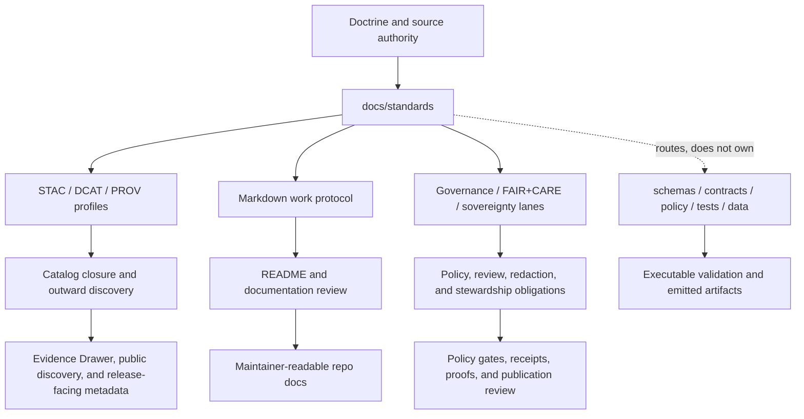

<!-- [KFM_META_BLOCK_V2]
doc_id: kfm://doc/NEEDS_VERIFICATION__docs_standards_readme
title: Standards
type: standard
version: v1
status: draft
owners: @bartytime4life
created: NEEDS_VERIFICATION__YYYY-MM-DD
updated: 2026-04-23
policy_label: NEEDS_VERIFICATION__public_or_restricted
related: [README.md, docs/README.md, docs/standards/KFM_STAC_PROFILE.md, docs/standards/KFM_DCAT_PROFILE.md, docs/standards/KFM_PROV_PROFILE.md, docs/standards/KFM_MARKDOWN_WORK_PROTOCOL.md, docs/standards/markdown-rules.md, docs/standards/governance/README.md, docs/standards/faircare/README.md, docs/standards/sovereignty/README.md, docs/standards/stac/README.md, contracts/README.md, schemas/README.md, policy/README.md, tests/README.md, .github/workflows/README.md]
tags: [kfm, standards, documentation, metadata, provenance, governance, publication]
notes: [doc_id, created date, policy label, and mounted-checkout parity still need verification; owners are preserved from surfaced public-main README evidence but should be rechecked against CODEOWNERS before publish; this README is a routing and standards-index surface, not proof that validators, workflow gates, emitted proof objects, or runtime enforcement are active.]
[/KFM_META_BLOCK_V2] -->

<a id="top"></a>

# Standards

Governed standards index for KFM metadata, provenance, publication, documentation, review, and trust-visible repo conventions.

> [!IMPORTANT]
> **Status:** `experimental`  
> **Doc status:** `draft`  
> **Owners:** `@bartytime4life` *(NEEDS VERIFICATION in the mounted checkout; surfaced evidence points to this owner through the broader docs ownership pattern)*  
> **Path:** `docs/standards/README.md`  
> **Repo fit:** standards landing under [`../README.md`](../README.md), connected upward to [`../../README.md`](../../README.md), and downstream into profile docs, governance lanes, schema/contract policy alignment, catalog closure, and Markdown review rules.  
> **Quick jumps:** [Scope](#scope) · [Repo fit](#repo-fit) · [Current standards surface](#current-standards-surface) · [Accepted inputs](#accepted-inputs) · [Exclusions](#exclusions) · [Directory tree](#directory-tree) · [Quickstart](#quickstart) · [Usage](#usage) · [Diagram](#diagram) · [Definition of done](#definition-of-done) · [FAQ](#faq) · [Appendix](#appendix)


> [!NOTE]
> This README is an **index and routing standard**. It helps maintainers decide where standards prose belongs, which adjacent repo surfaces must be updated, and what must be verified before a standards change is treated as enforceable.

---

## Scope

`docs/standards/` owns cross-cutting **human-readable standards prose** for the Kansas Frontier Matrix (KFM) documentation and publication system.

It is the right home for standards that explain how KFM should describe, cite, publish, govern, review, and document evidence-bearing artifacts. It is not the right home for raw data, executable policy, source registries, runtime code, emitted proof objects, or machine schemas unless this README explicitly routes to their owning surfaces.

**In one sentence:** standards explain the rules; contracts, schemas, policies, tests, catalogs, receipts, proofs, and release artifacts prove whether the rules are being followed.

[Back to top](#top)

---

## Repo fit

| Relationship | Path | Role |
|---|---|---|
| This surface | [`./README.md`](./README.md) | Standards index, routing map, and directory boundary |
| Parent docs lane | [`../README.md`](../README.md) | Broader documentation landing and doctrine/navigation layer |
| Repo root | [`../../README.md`](../../README.md) | Project identity, top-level orientation, and repo-wide entry point |
| Contract lane | [`../../contracts/README.md`](../../contracts/README.md) | Human-readable contract boundaries and object-family routing |
| Schema lane | [`../../schemas/README.md`](../../schemas/README.md) | Machine-readable schema inventory and schema-home ambiguity notes |
| Policy lane | [`../../policy/README.md`](../../policy/README.md) | Executable or reviewable allow/deny/review/obligation logic |
| Test lane | [`../../tests/README.md`](../../tests/README.md) | Verification, fixtures, contract tests, and fail-closed examples |
| Workflow lane | [`../../.github/workflows/README.md`](../../.github/workflows/README.md) | Workflow intent; enforcement depth still requires direct YAML and platform verification |
| Runbooks | [`../runbooks/README.md`](../runbooks/README.md) | Operational procedures, rollback, promotion, and verification steps |

> [!WARNING]
> Presence of a standards document does **not** prove enforcement. A standard becomes operational only when its related schema, validator, fixture, policy, catalog, receipt/proof, workflow, or review gate is verified.

[Back to top](#top)

---

## Current standards surface

The inventory below preserves the surfaced standards routing pattern while marking checkout parity as a verification item.

### Root-level standards and protocol files

| Surface | Primary role | Evidence posture | Routing consequence |
|---|---|---:|---|
| [`README.md`](./README.md) | Root standards index and routing surface | CONFIRMED from surfaced Markdown; NEEDS VERIFICATION in mounted checkout | Revise in place when the visible standards tree changes |
| [`KFM_STAC_PROFILE.md`](./KFM_STAC_PROFILE.md) | Outward STAC profile for items, collections, assets, and catalog discovery | CONFIRMED from surfaced Markdown; enforcement UNKNOWN | Route STAC profile work here |
| [`KFM_DCAT_PROFILE.md`](./KFM_DCAT_PROFILE.md) | Outward dataset/distribution discovery profile | CONFIRMED from surfaced Markdown; enforcement UNKNOWN | Route DCAT mapping and discovery obligations here |
| [`KFM_PROV_PROFILE.md`](./KFM_PROV_PROFILE.md) | Outward provenance, lineage, and production-traceability profile | CONFIRMED from surfaced Markdown; enforcement UNKNOWN | Route lineage and release-traceability work here |
| [`KFM_MARKDOWN_WORK_PROTOCOL.md`](./KFM_MARKDOWN_WORK_PROTOCOL.md) | Governed Markdown authoring, revision, and review protocol | CONFIRMED from surfaced Markdown; implementation depth UNKNOWN | Route normative Markdown rules here |
| [`markdown-rules.md`](./markdown-rules.md) | Repo-local task-facing authoring brief or instruction mirror | CONFIRMED from surfaced Markdown; authority relationship NEEDS VERIFICATION | Keep aligned to the protocol; do not let it silently become a second authority |

### Lane-local directory surfaces

| Lane | Primary role | Evidence posture | Routing consequence |
|---|---|---:|---|
| [`governance/README.md`](./governance/README.md) | Governance lane index and scope boundary | CONFIRMED from surfaced Markdown | Use for lane routing, exclusions, and index-level edits |
| [`governance/ROOT_GOVERNANCE.md`](./governance/ROOT_GOVERNANCE.md) | Standards-layer governance baseline | CONFIRMED from surfaced Markdown; enforcement UNKNOWN | Use for cross-domain governance rules |
| [`faircare/README.md`](./faircare/README.md) | FAIR+CARE lane index and scope boundary | CONFIRMED from surfaced Markdown | Use for lane routing and README-level scope control |
| [`faircare/FAIRCARE-GUIDE.md`](./faircare/FAIRCARE-GUIDE.md) | FAIR+CARE norm text | CONFIRMED from surfaced Markdown | Use for publication, redaction, stewardship, and reuse rules |
| [`sovereignty/README.md`](./sovereignty/README.md) | Sovereignty lane index and scope boundary | CONFIRMED from surfaced Markdown | Use for lane routing and exclusions |
| [`sovereignty/INDIGENOUS-DATA-PROTECTION.md`](./sovereignty/INDIGENOUS-DATA-PROTECTION.md) | Sovereignty and protected-knowledge handling standard | CONFIRMED from surfaced Markdown | Use for Indigenous/community-sensitive handling rules |
| [`stac/README.md`](./stac/README.md) | STAC-specific support lane index | CONFIRMED from surfaced Markdown | Use for STAC support-lane routing |
| [`stac/OGC_STAC_COMMUNITY_STANDARD_AND_CDSE_DEPLOYMENTS.md`](./stac/OGC_STAC_COMMUNITY_STANDARD_AND_CDSE_DEPLOYMENTS.md) | STAC deployment/alignment note | CONFIRMED from surfaced Markdown; version-sensitive content NEEDS VERIFICATION | Use for STAC-specific interoperability and deployment comparison work |

[Back to top](#top)

---

## Accepted inputs

Use this directory for standards prose that is cross-cutting, reviewable, and meant to guide more than one domain lane.

| Input type | Belongs here when… | Typical companion surfaces |
|---|---|---|
| Metadata profile rules | The rule defines outward catalog/discovery obligations such as STAC, DCAT, or PROV alignment | `data/catalog/**`, `schemas/**`, `tests/contracts/**` |
| Documentation rules | The rule governs README structure, meta blocks, truth labels, or Markdown review posture | `tools/docs/**`, `.github/PULL_REQUEST_TEMPLATE.md`, `docs/reports/**` |
| Governance standards | The rule defines cross-domain review, stewardship, sensitivity, sovereignty, or FAIR+CARE posture | `policy/**`, `docs/runbooks/**`, `data/receipts/**` |
| Publication standards | The rule controls what must be present before public or semi-public release | `data/proofs/**`, `data/releases/**`, `release/**`, `tests/**` |
| Standards support notes | The note clarifies how an external standard is used inside KFM without overriding KFM doctrine | `docs/reference/**` or the most specific standards lane |
| Routing and boundary decisions | The doc explains where a standards change belongs and what else must update | `docs/adr/**`, `contracts/OBJECT_MAP.md`, parent READMEs |

> [!TIP]
> A standards update should name its downstream proof burden. If the doc introduces a new requirement, reviewers should be able to see which schema, validator, policy, fixture, catalog record, receipt/proof, or runbook will prove it.

[Back to top](#top)

---

## Exclusions

Do not place implementation artifacts here just because they feel “standard-like.”

| Do not put this in `docs/standards/` | Put it here instead | Reason |
|---|---|---|
| Machine-readable JSON Schemas | [`../../schemas/README.md`](../../schemas/README.md) or the repo-confirmed schema home | Standards prose is not executable validation |
| Human-readable object contracts | [`../../contracts/README.md`](../../contracts/README.md) | Contracts own object boundaries and field semantics |
| Rego or other executable policy | [`../../policy/README.md`](../../policy/README.md) | Policy code and policy tests must live with policy owners |
| Valid/invalid examples | [`../../tests/README.md`](../../tests/README.md) or the repo-confirmed fixture home | Fixtures should support automated validation |
| Source descriptors and source registries | `data/registry/**` | Source authority belongs in registry/source-control surfaces |
| Raw, work, quarantine, processed, or published data | `data/**` lifecycle lanes | Data lifecycle state must not be hidden in docs |
| Runtime code, adapters, components, or APIs | app/package lanes confirmed by the mounted repo | Standards describe expectations; code implements them |
| Operational runbooks | [`../runbooks/README.md`](../runbooks/README.md) | Runbooks own step-by-step operational procedure |
| Exploratory “New Ideas” packets | `docs/intake/**` or `docs/archive/exploratory/**` once present | Exploratory material must not become accidental law |
| Old manuals or superseded syntheses | `docs/archive/lineage/**` once present | Lineage should remain accessible without competing as current authority |

[Back to top](#top)

---

## Directory tree

This tree reflects the surfaced standards structure. Re-run the quickstart inspection before merge and update this section if the mounted checkout differs.

```text
docs/standards/
├── README.md
├── KFM_STAC_PROFILE.md
├── KFM_DCAT_PROFILE.md
├── KFM_PROV_PROFILE.md
├── KFM_MARKDOWN_WORK_PROTOCOL.md
├── markdown-rules.md
├── governance/
│   ├── README.md
│   └── ROOT_GOVERNANCE.md
├── faircare/
│   ├── README.md
│   └── FAIRCARE-GUIDE.md
├── sovereignty/
│   ├── README.md
│   └── INDIGENOUS-DATA-PROTECTION.md
└── stac/
    ├── README.md
    └── OGC_STAC_COMMUNITY_STANDARD_AND_CDSE_DEPLOYMENTS.md
```

> [!IMPORTANT]
> **NEEDS VERIFICATION:** this README was prepared from surfaced public-main Markdown evidence and attached KFM doctrine, not from a mounted live checkout. Treat the tree as a review target until direct branch inspection confirms it.

[Back to top](#top)

---

## Quickstart

Use this inspection path before revising standards docs.

```bash
# Run from the repository root.

git status --short
find docs/standards -maxdepth 2 -type f | sort
find docs/standards -maxdepth 2 -type d | sort

# Verify standard docs carry the KFM metadata block and one H1.
grep -RIn "KFM_META_BLOCK_V2\|^# " docs/standards | sed -n '1,160p'

# Check obvious relative-link targets used by this README.
test -f docs/standards/KFM_STAC_PROFILE.md
test -f docs/standards/KFM_DCAT_PROFILE.md
test -f docs/standards/KFM_PROV_PROFILE.md
test -f docs/standards/KFM_MARKDOWN_WORK_PROTOCOL.md
test -f docs/standards/governance/README.md
```

If a path is missing, do not “repair” it by inventing a new home. Update the routing table, mark the gap `NEEDS VERIFICATION`, and open or link the smallest ADR or backlog item that resolves the mismatch.

[Back to top](#top)

---

## Usage

### Put-it-here test

| Candidate change | Belongs in `docs/standards/`? | Best home |
|---|---:|---|
| New STAC field rule for outward Items | Yes | [`./KFM_STAC_PROFILE.md`](./KFM_STAC_PROFILE.md) |
| New DCAT distribution mapping rule | Yes | [`./KFM_DCAT_PROFILE.md`](./KFM_DCAT_PROFILE.md) |
| New PROV activity/agent/entity convention | Yes | [`./KFM_PROV_PROFILE.md`](./KFM_PROV_PROFILE.md) |
| Markdown heading, meta block, or README-like doc rule | Yes | [`./KFM_MARKDOWN_WORK_PROTOCOL.md`](./KFM_MARKDOWN_WORK_PROTOCOL.md) |
| Standards-layer governance principle | Yes | [`./governance/ROOT_GOVERNANCE.md`](./governance/ROOT_GOVERNANCE.md) or [`./governance/README.md`](./governance/README.md) |
| FAIR+CARE reuse or stewardship requirement | Yes | [`./faircare/FAIRCARE-GUIDE.md`](./faircare/FAIRCARE-GUIDE.md) |
| Indigenous data protection or sovereignty handling rule | Yes | [`./sovereignty/INDIGENOUS-DATA-PROTECTION.md`](./sovereignty/INDIGENOUS-DATA-PROTECTION.md) |
| STAC implementation comparison note | Sometimes | [`./stac/OGC_STAC_COMMUNITY_STANDARD_AND_CDSE_DEPLOYMENTS.md`](./stac/OGC_STAC_COMMUNITY_STANDARD_AND_CDSE_DEPLOYMENTS.md) |
| JSON Schema body or `$defs` change | No | `schemas/**` after schema-home verification |
| Rego allow/deny/review logic | No | `policy/**` |
| Source registry row | No | `data/registry/**` |
| Valid/invalid fixture | No | `tests/**` or repo-confirmed fixture home |
| Generated catalog, receipt, proof, or release manifest | No | `data/catalog/**`, `data/receipts/**`, `data/proofs/**`, `release/**`, or repo-confirmed emitted-artifact lane |
| Runtime API route or UI component | No | app/package lane confirmed by direct repo inspection |

### Change checklist

Before opening a standards PR, identify:

1. Which standard owns the rule.
2. Which adjacent surface must change with it.
3. Whether the rule is doctrine, profile guidance, executable policy, schema semantics, or operational procedure.
4. Which truth label applies: `CONFIRMED`, `INFERRED`, `PROPOSED`, `UNKNOWN`, or `NEEDS VERIFICATION`.
5. Whether release, rights, sensitivity, sovereignty, review, or public-location exposure is affected.

[Back to top](#top)

---

## Diagram


```mermaid
flowchart TD
    A[Doctrine and source authority] --> B[docs/standards]
    B --> C[STAC / DCAT / PROV profiles]
    B --> D[Markdown work protocol]
    B --> E[Governance / FAIR+CARE / sovereignty lanes]

    C --> F[Catalog closure and outward discovery]
    D --> G[README and documentation review]
    E --> H[Policy, review, redaction, and stewardship obligations]

    F --> I[Evidence Drawer, public discovery, and release-facing metadata]
    G --> J[Maintainer-readable repo docs]
    H --> K[Policy gates, receipts, proofs, and publication review]

    B -. routes, does not own .-> L[schemas / contracts / policy / tests / data]
    L --> M[Executable validation and emitted artifacts]
```

The standards lane is a **translation layer**: it turns doctrine into reviewable rules and points to the executable or emitted surfaces that must prove those rules later.

[Back to top](#top)

---

## Definition of done

A change to `docs/standards/` is done enough for review when all applicable items are true.

- [ ] The changed Markdown file has a valid `KFM_META_BLOCK_V2`.
- [ ] The file has one H1, a clear purpose, and a truth posture where confidence matters.
- [ ] Owner, status, policy label, created/updated date, and related links are either verified or explicitly marked `NEEDS VERIFICATION`.
- [ ] The change updates this README when it adds, removes, renames, or reroutes a standards surface.
- [ ] Related contract, schema, policy, fixture, catalog, receipt/proof, runbook, workflow, or release surfaces are listed in the PR.
- [ ] No runtime, CI, enforcement, release, or emitted-proof claim is upgraded without direct evidence.
- [ ] External standards are treated as compatibility/reference inputs, not as replacements for KFM doctrine.
- [ ] Rights, sensitivity, sovereignty, cultural, living-person, public-location, and publication impacts are called out where relevant.
- [ ] Relative links have been checked from `docs/standards/`.
- [ ] Any unresolved ambiguity is captured as `NEEDS VERIFICATION`, an ADR candidate, or a backlog item.

[Back to top](#top)

---

## FAQ

### Is `docs/standards/` canonical?

Within its scope, yes: it is the standards prose and routing lane. It is not the canonical home for machine schemas, executable policy, fixtures, source descriptors, runtime code, or emitted proof objects.

### Can an external standard override KFM doctrine?

No. External standards can sharpen interoperability, vocabulary, and current technical accuracy. They do not override KFM’s truth path, trust membrane, evidence posture, review requirements, sensitivity controls, or publication gates unless a reviewed KFM ADR explicitly changes doctrine.

### Does a standards profile prove validation exists?

No. A profile describes the rule. Validation requires verified schema, fixture, validator, test, workflow, or review-gate evidence.

### What is the relationship between `KFM_MARKDOWN_WORK_PROTOCOL.md` and `markdown-rules.md`?

The surfaced evidence treats `KFM_MARKDOWN_WORK_PROTOCOL.md` as the normative Markdown protocol and `markdown-rules.md` as a task-facing brief or instruction mirror. Keep them aligned until a maintainer explicitly consolidates or reassigns authority.

### Should new domain-lane standards go here?

Only if the rule is cross-cutting. Domain-specific rules should live in the domain’s README, architecture doc, runbook, policy, schema, or source registry unless they define a standard used across multiple lanes.

[Back to top](#top)

---

## Appendix

<details>
<summary><strong>Evidence posture used by this README</strong></summary>

| Label | Meaning in this README |
|---|---|
| CONFIRMED | Verified from surfaced project Markdown, attached doctrine, or direct workspace scan |
| INFERRED | Strongly suggested by adjacent evidence, but not directly proven as implementation |
| PROPOSED | Recommended structure or routing rule not verified as current implementation |
| UNKNOWN | Not enough evidence to state safely |
| NEEDS VERIFICATION | Concrete check required before publish or before upgrading the claim |

This README intentionally separates standards routing from implementation maturity. It can document where rules belong, but it must not claim those rules are enforced until the corresponding repo files, tests, workflows, platform settings, emitted artifacts, or review records are inspected.

</details>

<details>
<summary><strong>Maintenance triggers</strong></summary>

Update this README when any of the following changes:

- a standards profile file is added, renamed, moved, or removed;
- a lane-local directory under `docs/standards/` changes role;
- `KFM_MARKDOWN_WORK_PROTOCOL.md` and `markdown-rules.md` diverge;
- STAC/DCAT/PROV profile scope changes;
- governance, FAIR+CARE, or sovereignty standards change;
- a schema-home, policy-home, fixture-home, or source-registry ADR affects standards routing;
- a workflow begins enforcing a standards rule that was previously prose-only;
- a standards rule is superseded, deprecated, or moved into lineage/archive.

</details>

<details>
<summary><strong>Pre-publish review questions</strong></summary>

- Does the change preserve the KFM truth path?
- Does it keep standards prose separate from executable policy and machine schemas?
- Does it cite or route to the evidence-bearing surface that will prove the rule?
- Does it avoid treating exploratory packets, generated reports, or prior scaffold plans as mounted implementation proof?
- Does it mark unresolved dates, owners, policy labels, workflow enforcement, and runtime claims as `NEEDS VERIFICATION`?
- Does it preserve correction lineage and avoid silent deletion?

</details>

[Back to top](#top)
