<div align="center">

# 📐 Kansas Frontier Matrix — **Standards & Governance**  
`docs/standards/README.md`

**Purpose:** Establish and enforce **project-wide technical, scientific, and documentation standards** for  
the **Kansas Frontier Matrix (KFM)** — ensuring **clarity**, **reproducibility**, **interoperability**, and  
**long-term scientific integrity** across all components: data, models, pipelines, and UI.

[](../)
[](https://www.go-fair.org/fair-principles/)
[](../../.github/workflows/stac-validate.yml)
[](../../.github/workflows/codeql.yml)
[](../../.github/workflows/trivy.yml)
[](../../.github/workflows/pre-commit.yml)

</div>

---

## 🎯 Purpose

The `/docs/standards/` directory is the **definitive reference** for how KFM is **built, validated, and maintained**.  
It codifies the **technical, semantic, and operational standards** that ensure every element of the system — from  
datasets to the web UI — is **auditable, reproducible, and semantically interoperable** under the  
**Master Coder Protocol (MCP)** and **FAIR Data Principles**.

This directory ensures that:

- Every dataset follows the same structure, schema, and provenance model.  
- Every workflow is deterministic, logged, and validated in CI/CD.  
- Every contributor adheres to common code and documentation practices.  
- Every artifact — code, model, dataset, or document — is **traceable from source to publication**.

---

## 📚 Directory Layout

```bash
docs/standards/
├── README.md            # Index (this file)
├── coding.md            # Code style & language standards
├── data-formats.md      # Data model, encoding, and file-format standards
├── metadata.md          # Metadata models (STAC, DCAT, schema.org)
├── ontologies.md        # Semantic layer: CIDOC CRM, OWL-Time, PeriodO
├── testing.md           # Unit, integration, and validation test standards
├── security.md          # Security, compliance, and license scanning
└── documentation.md     # README, ADR, and MCP documentation conventions
```

---

## 🧱 Core Standard Categories

### 🧮 Coding Standards

- **Python:** PEP 8 compliant, formatted with **Black**, linted with **Ruff**, tested with **pytest**.  
- **JavaScript/TypeScript:** ES 6+, formatted with **Prettier**, linted with **ESLint**, React 18+ components.  
- **CSS:** Follows **BEM** naming conventions and reusable design tokens (`:root` variables).  
- **Inline Documentation:**  
  - Python → Google or reST docstrings  
  - JS → JSDoc format  
  - YAML → inline comments for pipeline configuration  

📄 See [`docs/standards/coding.md`](coding.md)

---

### 🌍 Data & File Formats

| Type | Format | Specification | Notes |
| :-- | :-- | :-- | :-- |
| **Vector** | GeoJSON | RFC 7946 | UTF-8 / WGS-84 (EPSG:4326) |
| **Raster** | COG (Cloud-Optimized GeoTIFF) | GDAL ≥ 3.8 | Internal overviews · tiled · compressed |
| **Tabular** | CSV + schema.json | RFC 4180 / CSVW | Units + datatypes declared |
| **Metadata** | JSON / YAML | JSON Schema Draft-07 | Auto-validated in CI |
| **Checksums** | .sha256 | NIST SHA-256 | File integrity verification |
| **Archive** | .zip / .tar.gz | Reproducible build | Versioned bundles for release |

📘 See [`docs/standards/data-formats.md`](data-formats.md)

---

### 🗂️ Metadata & Ontologies

- **STAC 1.0** — spatiotemporal catalogs for all geospatial layers.  
- **DCAT 3.0** — dataset-level metadata for discoverability.  
- **Schema.org** — semantic markup for public search and indexing.  
- **CIDOC CRM** — cultural-heritage ontology for events, actors, and objects.  
- **OWL-Time** — temporal reasoning and event chronology.  
- **PeriodO** — standardized historical period definitions (“Bleeding Kansas”, “Dust Bowl”).  

📗 See [`metadata.md`](metadata.md) and [`ontologies.md`](ontologies.md)

---

### 🧪 Testing & CI/CD Standards

All code and data pipelines must pass mandatory validation prior to merge or release.

| Stage | Validation | Tool / Workflow |
| :-- | :-- | :-- |
| **Code Quality** | Lint + Security | `pre-commit.yml`, CodeQL |
| **Data Validation** | Schema + STAC compliance | `stac-validate.yml` |
| **Security Scans** | Vulnerabilities | Trivy · Dependabot |
| **Checksums** | File Integrity | `checksums.yml` |
| **Documentation** | Consistency Check | `docs-validator.yml` |

📕 See [`testing.md`](testing.md)

---

### 🔒 Security & Compliance

- All dependencies scanned with **Trivy** and **CodeQL**.  
- Container images include **SBOMs** (Software Bill of Materials).  
- Automated license scans verify open-source compatibility.  
- Secrets use the **principle of least privilege**.  
- Workflows optionally signed via **Sigstore/SLSA** for chain-of-custody traceability.  

📙 See [`security.md`](security.md)

---

### 🧭 Documentation & Governance Rules

Each directory must contain a `README.md` covering:  

1. Purpose and context  
2. Usage instructions  
3. Dependencies and relationships  
4. Badges / version tracking  

**Additional rules**

- **Templates:** MCP-compliant (`experiment`, `model_card`, `SOP`, `provenance`).  
- **Design Decisions:** Record as ADRs in `/docs/adr/`.  
- **Glossary:** Maintain canonical terminology in `/docs/glossary.md`.  
- **Licensing:** Code = MIT · Data = CC-BY 4.0 · Docs = CC-BY 4.0.  

📒 See [`documentation.md`](documentation.md)

---

### 🧩 Governance & Quality Gates

All pull requests to `main` must pass these checks in CI:  

✅ STAC schema validation  
✅ Checksum verification  
✅ Code lint + tests  
✅ Security scan (CodeQL · Trivy)  
✅ Docs completeness  

> **Governance Review:** Each major release is approved by the Data Governance Committee, verifying MCP and FAIR compliance.

---

## 🧠 Usage Guidelines

1. **Before coding** → review `coding.md`.  
2. **Before adding data** → validate formats in `data-formats.md` & `metadata.md`.  
3. **Before merging** → run all schema + checksum + STAC checks.  
4. **Before publishing** → update provenance / experiment records (`docs/templates/`).  
5. **New contributors** → follow `documentation.md` for structure and style.

---

## 🧩 Semantic & Temporal Standards

| Domain | Standard | Purpose |
| :-- | :-- | :-- |
| **Cultural** | CIDOC CRM | Defines events, actors, artifacts |
| **Temporal** | OWL-Time | Formal temporal interval logic |
| **Historical Periods** | PeriodO | Standard period definitions |
| **Spatial Ref.** | EPSG:4326 (WGS-84) | Global geospatial interoperability |
| **Provenance** | W3C PROV-O | Machine-readable lineage records |

---

## 📊 CI/CD Workflow Overview

```mermaid
flowchart TD
  A["Commit or PR"] --> B["Pre-Commit Hooks<br/>Lint · Format · Tests"]
  B --> C["GitHub Actions<br/>CodeQL · STAC Validate · Trivy"]
  C --> D{"All Checks Pass?"}
  D -- ❌ No --> E["Annotate Errors / Fail Build"]
  D -- ✅ Yes --> F["Merge & Deploy<br/>Artifacts + Docs Published"]
  F --> G["Generate Provenance + Checksums"]
  G --> H["Publish Reports → _site/reports/"]
```


<!-- END OF MERMAID -->

---

## 🔗 Related Documentation

- [`docs/architecture/`](../architecture) — System & data architecture blueprints  
- [`docs/integration/`](../integration) — ETL and data source integration guides  
- [`docs/design/`](../design) — UI/UX and visual design standards  
- [`docs/glossary.md`](../glossary.md) — Canonical terminology index  

---

<div align="center">

> 📜 **“Standards are the architecture of reproducibility.”**  
> Each commit, dataset, and model must conform to these standards so that KFM remains  
> **transparent, verifiable, and interoperable for decades to come.**

**Kansas Frontier Matrix** — *Every Line Tested. Every Dataset Traceable.*  
📍 [`docs/standards/README.md`](.) · Master repository for KFM-wide standards and governance  

</div>
