<div align="center">

# 📐 **Kansas Frontier Matrix — Standards & Governance**  
`docs/standards/README.md`

**Master Coder Protocol (MCP-DL v6.3+) · Governance · Provenance · Validation · Security**

[](../../.github/workflows/site.yml)
[](../../.github/workflows/docs-validate.yml)
[](../../.github/workflows/policy-check.yml)
[](../../.github/workflows/stac-validate.yml)
[](../../.github/workflows/codeql.yml)
[](../../.github/workflows/trivy.yml)
[](../../.github/workflows/gitleaks.yml)
[](../standards/security.md)
[](../../.github/workflows/sbom.yml)
[](../../docs/)
[](../../LICENSE)

</div>

---

```yaml
---
title: "Kansas Frontier Matrix — Standards & Governance"
version: "v6.3.1"
last_updated: "2025-10-18"
owners: ["@kfm-architecture","@kfm-security","@kfm-docs","@kfm-data","@kfm-ai"]
tags: ["standards","governance","validation","mcp","docs","stac","security","slsa","policy","provenance","fair"]
status: "Stable"
scope: "Monorepo-Wide"
license: "MIT (code) · CC-BY 4.0 (docs)"
semver_policy: "MAJOR.MINOR.PATCH"
audit_framework: "MCP-DL v6.3"
ci_required_checks:
  - docs-validate
  - policy-check
  - stac-validate
  - checksums
  - codeql
  - trivy
  - gitleaks
semantic_alignment:
  - STAC 1.0
  - DCAT 2.0
  - CIDOC CRM
  - OWL-Time
  - JSON Schema
  - ISO 8601 / EPSG
  - GeoSPARQL
  - SLSA Level 3
  - FAIR Principles
---
```

---

## 📊 Overview

This **Standards & Governance** document codifies the **authoritative rules, processes, and templates**
governing the **Kansas Frontier Matrix (KFM)** under **MCP-DL v6.3**.
It establishes the framework that ensures **reproducibility, provenance, and open-science compliance** across
all repositories, workflows, and datasets — guaranteeing a unified and auditable development ecosystem.

* ✅ **Reproducibility** — deterministic pipelines, pinned workflows, reproducible builds  
* ✅ **Provenance** — STAC lineage, PROV-O, checksum logging, signed artifacts  
* ✅ **Security** — CodeQL + Trivy + Gitleaks, SBOMs, SLSA Level 3 readiness  
* ✅ **Auditability** — CI validation logs, change tracking, dataset metadata integrity  
* ✅ **Policy-as-Code** — OPA/Conftest blocks non-compliant changes before merge  

---

## 🧭 Repository Scope & Architecture

```mermaid
flowchart TD
    A["docs/standards/"] --> B["Markdown Governance<br/>Rules · Guide"]
    A --> C["Templates<br/>SOP · Experiment · Model Card · ADR · Dataset · Provenance"]
    A --> D["CI/CD Workflows<br/>.github/workflows/"]
    A --> E["Security & Supply Chain<br/>SLSA · SBOM · OIDC"]
    D --> F["Validation<br/>docs-validate · policy-check · stac-validate · codeql · trivy · gitleaks"]
    F --> G["Audit Reports<br/>docs/audit/repository_compliance.md"]
%% END OF MERMAID
```



---

## 🧩 Governance Framework

| **Domain**     | **Standard**             | **Policy Enforcement**        | **Validation**            |
| :------------- | :----------------------- | :---------------------------- | :------------------------ |
| **Docs**       | Markdown + MCP-DL v6.3   | Pre-commit + OPA/Conftest     | ✅ `docs-validate.yml`     |
| **Data**       | STAC 1.0 · DCAT 2.0      | JSON Schema + policy gates     | ✅ `stac-validate.yml`     |
| **Security**   | SLSA-3 · Sigstore        | Trivy + Gitleaks + Cosign (plan)| ⚠️ `slsa.yml` (attestation)|
| **Code**       | Black · ESLint           | Pre-commit · CodeQL            | ✅ `codeql.yml`            |
| **Provenance** | PROV-O · CIDOC · OWL-Time| Metadata + SHA-256 + SBOM      | ✅ `checksums.yml` · `sbom.yml` |
| **Release**    | SemVer + OIDC            | Auto tag + changelog + sign    | ✅ `release.yml` + `slsa.yml` |

> **Non-negotiables:** pin all actions (tag/SHA), least-privilege tokens, no plaintext secrets in logs.

---

## 🧱 MCP-DL Governance Pillars

1. **Documentation-First:** Every modification accompanies an updated doc/metadata entry.  
2. **Reproducibility:** All code, datasets, and docs regenerate using committed workflows.  
3. **Open Standards:** Prefer open formats (GeoJSON, STAC, DCAT, JSON Schema, ISO 8601, EPSG).  
4. **Provenance:** Every artifact includes checksums, STAC lineage, and PROV-O relations.  
5. **Security by Design:** SBOMs, SLSA attestations, pinned actions, OIDC auth, and policy gates.  
6. **Auditability:** Each change traceable via CI logs and metadata hashes; artifacts retained by policy.

---

## 🧮 Governance Compliance Dashboard

| **Category**             | **Status** | **Coverage** | **Next Action**                 |
| :----------------------- | :--------- | :----------- | :------------------------------ |
| Documentation Validation | ✅          | 100%         | Maintain MCP-DL v6.3 compliance |
| STAC Provenance          | ✅          | 96%          | Add dataset-level lineage       |
| Security Automation      | ⚠️         | 90%          | Integrate Cosign signing        |
| CI/CD Workflows          | ✅          | 100%         | Attach SLSA badge per release   |
| Data FAIR Compliance     | ✅          | 98%          | Strengthen DCAT crosswalks      |
| Governance Reports       | ✅          | 95%          | Quarterly audit updates         |

---

## 🧠 Compliance & Security Framework

| **Control Area**     | **Tool / Workflow**   | **Status** | **Evidence**                   |
| :------------------- | :-------------------- | :--------- | :----------------------------- |
| Dependency Scanning  | Trivy + Dependabot    | ✅          | `.github/workflows/trivy.yml`  |
| Static Analysis      | CodeQL                | ✅          | `.github/workflows/codeql.yml` |
| Secrets Scanning     | Gitleaks              | ✅          | `.github/workflows/gitleaks.yml`|
| Artifact Integrity   | SHA-256 Checksums     | ✅          | `data/checksums/**.sha256`     |
| SBOM Reporting       | Syft → SPDX JSON      | ✅          | `sbom.yml` artifact            |
| Release Signing      | Cosign/Sigstore       | ⚠️         | Planned `provenance.yml`       |
| Identity/Auth        | OIDC Federation       | ✅          | GitHub OIDC workflows          |
| Compliance Framework | SLSA Level 3 (target) | ⚠️         | SLSA attestation on releases   |

---

## 🧩 Interlink with Audit & Governance Reports

| **Report**                  | **Path**                              | **Purpose**                                                    |
| :-------------------------- | :------------------------------------ | :------------------------------------------------------------- |
| Repository Compliance Audit | `docs/audit/repository_compliance.md` | Tracks repository maturity (RMI/DCI), CI status, and sign-offs |
| Security & SLSA Standards   | `docs/standards/security.md`          | Defines Trivy, CodeQL, SBOM, and SLSA policies                 |
| Provenance Templates        | `docs/templates/provenance.md`        | Standardizes lineage and integrity records                     |
| Governance Action Plan      | `docs/audit/governance_plan.md`       | Quarterly objectives and program tracking                      |

---

## 🧷 Required Templates & Contracts

- `docs/templates/adr.md` — **Architecture Decision Record**  
- `docs/templates/sop.md` — **Operational SOP**  
- `docs/templates/experiment.md` — **Reproducible Experiment**  
- `docs/templates/model_card.md` — **Transparent Model Reporting**  
- `docs/templates/dataset.md` — **Dataset Descriptor (STAC/DCAT)**  
- `docs/templates/provenance.md` — **Provenance Record (PROV-O)**

> All templates require YAML front-matter and pass **docs-validate** + **policy-check**.

---

## 🧪 Docs-as-Code Validation

| Workflow             | Function                                       | Trigger          |
| :------------------- | :--------------------------------------------- | :--------------- |
| `docs-validate.yml`  | Lint Markdown, check links & metadata           | PR / Push        |
| `policy-check.yml`   | Enforce required front matter / fields          | PR               |
| `stac-validate.yml`  | Validate STAC schemas and links                 | PR / Commit      |
| `pre-commit.yml`     | Local lint/style checks                         | Each PR          |
| `site.yml`           | Build and publish documentation site            | Merge to `main`  |

---

## 🔐 Data Ethics & Cultural Safeguards

- **`data_ethics` tagging:** use STAC `properties.data_ethics` (`open`, `restricted-derivatives`, `no-public-artifacts`) where applicable.  
- **Public artifact scrubbing:** exclude restricted layers from public Pages builds; retain by policy.  
- **Co-stewardship:** follow community guidelines when handling Indigenous or sensitive sources.

---

## 🗓 Quarterly Governance Plan (Q4 2025)

| **Action**                       | **Owner**        | **Deadline** | **Goal**                            |
| :------------------------------- | :--------------- | :----------- | :---------------------------------- |
| Sign artifacts via Cosign        | @kfm-security    | 2025-11-15   | Signed provenance chain             |
| Add docs validation workflow     | @kfm-docs        | 2025-11-01   | Automated markdown compliance       |
| Complete STAC index revalidation | @kfm-data        | 2025-12-01   | 100% provenance verification        |
| Full SLSA-3 compliance milestone | @kfm-maintainers | 2025-12-31   | Verified, signed, reproducible repo |

---

## 🧾 Metadata & Provenance (This Document)

| Field                  | Description                                                         |
| :--------------------- | :------------------------------------------------------------------ |
| **Document ID**        | `STD-2025-001-GOVERNANCE`                                           |
| **Version**            | v6.3.1                                                              |
| **Audit Framework**    | MCP-DL v6.3                                                         |
| **License**            | MIT (code) · CC-BY 4.0 (docs)                                       |
| **Semantic Alignment** | STAC 1.0 · DCAT 2.0 · CIDOC CRM · OWL-Time · JSON Schema · ISO 8601 |
| **Status**             | Stable                                                              |
| **Maintainers**        | `@kfm-architecture`, `@kfm-data`, `@kfm-security`, `@kfm-docs`      |
| **Next Review**        | Q1 2026                                                             |

---

## 🧾 Version History

| **Version** | **Date**   | **Changes**                                                                          | **Author**        |
| :---------- | :--------- | :----------------------------------------------------------------------------------- | :---------------- |
| v6.3.1      | 2025-10-18 | Added docs-validate & policy gates, SBOM/SLSA badges, secrets scan, ethics guidance  | @kfm-architecture |
| v6.3.0      | 2025-10-17 | MCP-DL v6.3 alignment; audit interlinks; YAML metadata; SLSA references             | @kfm-architecture |
| v6.2.2      | 2025-10-12 | Updated diagrams, badges, and compliance schema                                      | @kfm-data         |
| v6.2.0      | 2025-09-10 | Migrated governance to MCP-DL 6.2 standard                                           | @kfm-security     |
| v6.1.0      | 2025-08-01 | Introduced CI/CD validation workflows                                                | Core Team         |

---

<div align="center">

**Kansas Frontier Matrix © 2025**  
🧭 *Governance through Provenance · Automation with Integrity · Compliance through Documentation*  
`docs/standards/README.md` — The living charter of reproducibility and open governance for KFM.

</div>