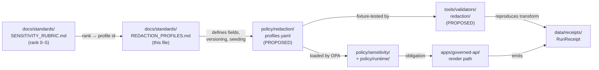
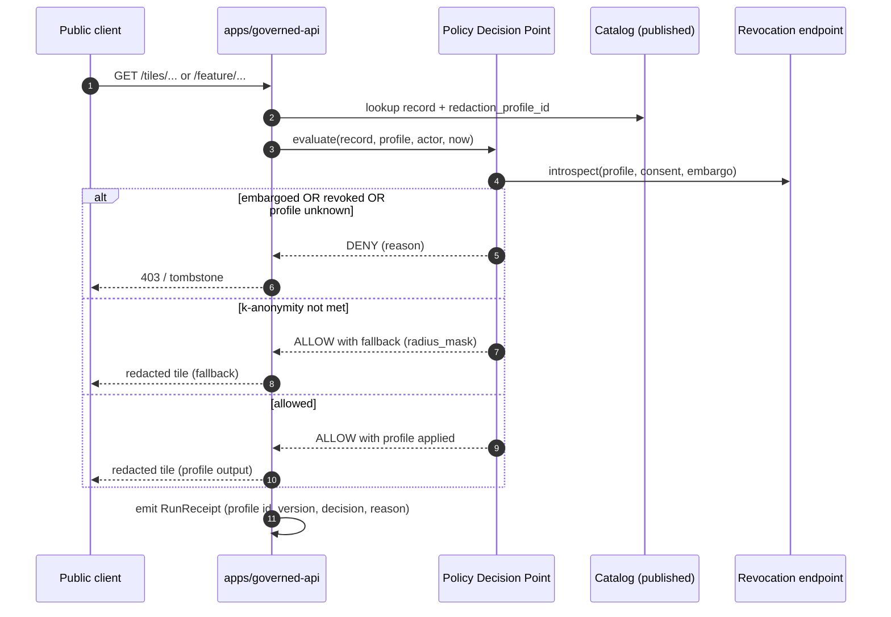
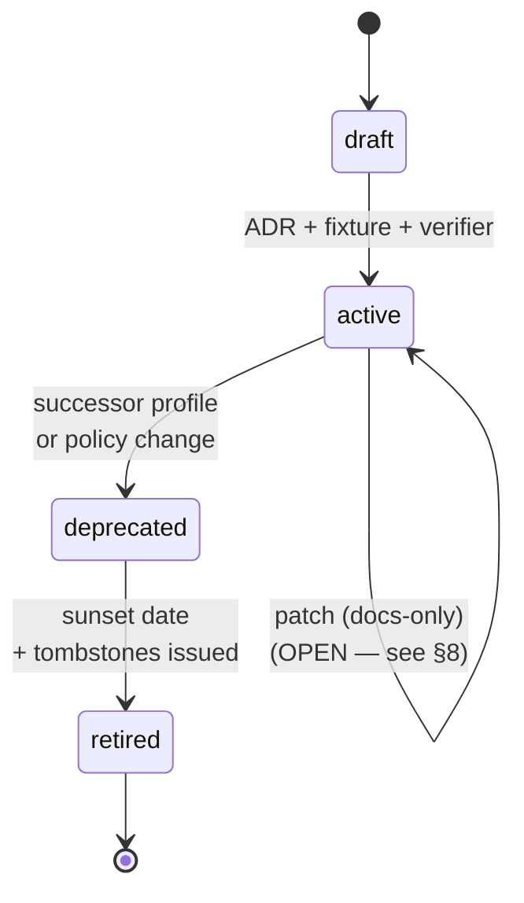

<!-- [KFM_META_BLOCK_V2]
doc_id: kfm://doc/standards/redaction-profiles
title: KFM Redaction Profiles — Standard
type: standard
version: v1
status: draft
owners: TBD   # PLACEHOLDER — confirm via CODEOWNERS (sensitivity-and-redaction stewards)
created: 2026-05-14
updated: 2026-05-14
policy_label: public
related:
  - docs/standards/SENSITIVITY_RUBRIC.md
  - docs/standards/REDACTION_DETERMINISM.md
  - docs/standards/DP_BUDGETS.md
  - docs/standards/CONSENT_TOKENS.md
  - docs/runbooks/revocation.md
  - policy/sensitivity/README.md
  - policy/redaction/profiles.yaml
  - schemas/contracts/v1/policy/
tags: [kfm, sensitivity, redaction, geoprivacy, policy, standards]
notes:
  - Profile catalog file path policy/redaction/profiles.yaml is PROPOSED (Idea C6-02).
  - Rubric, profile names, and determinism rules drawn from Pass-10 Idea Index §6.6.
[/KFM_META_BLOCK_V2] -->

# Redaction Profiles — KFM Standard

> Named, versioned, deterministic transforms that turn sensitive geometry, attributes, and timestamps into safely publishable representations. The profile is the contract; the rendered output is its consequence.


**Status:** draft &nbsp;·&nbsp; **Authority:** standard (governs `policy/redaction/`) &nbsp;·&nbsp; **Owners:** _TBD — sensitivity-and-redaction stewards (confirm via CODEOWNERS)_ &nbsp;·&nbsp; **Last updated:** 2026-05-14

---

## Quick jump

- [1. Purpose and scope](#1-purpose-and-scope)
- [2. Where this standard fits](#2-where-this-standard-fits)
- [3. Core invariants](#3-core-invariants)
- [4. The sensitivity rubric → profile mapping](#4-the-sensitivity-rubric--profile-mapping)
- [5. Profile shape (required fields)](#5-profile-shape-required-fields)
- [6. Canonical profile catalog](#6-canonical-profile-catalog)
- [7. Determinism and seeding](#7-determinism-and-seeding)
- [8. Versioning and breaking-change rules](#8-versioning-and-breaking-change-rules)
- [9. Verifier and fixture obligations](#9-verifier-and-fixture-obligations)
- [10. Render-time enforcement](#10-render-time-enforcement)
- [11. Receipts and audit trail](#11-receipts-and-audit-trail)
- [12. External framework alignment](#12-external-framework-alignment)
- [13. Anti-patterns](#13-anti-patterns)
- [14. Open questions and NEEDS VERIFICATION](#14-open-questions-and-needs-verification)
- [15. Related docs](#15-related-docs)
- [Appendix A — Worked profile examples (illustrative)](#appendix-a--worked-profile-examples-illustrative)
- [Appendix B — Profile lifecycle states](#appendix-b--profile-lifecycle-states)

---

## 1. Purpose and scope

This standard defines what a **redaction profile** is in the Kansas Frontier Matrix (KFM), how profiles are structured, named, versioned, and verified, and how they connect to the sensitivity rubric, promotion gates, and render-time enforcement.

A redaction profile is a **named, versioned, deterministic transform** that takes a sensitive record (geometry, attributes, timestamps, identifiers) and produces a publishable representation alongside a receipt-able description of what was changed and why. **[CONFIRMED doctrine — see Pass-10 Idea Index §6.6, ideas C6-02, C6-03, C6-04, C6-05, C6-06]**

This document covers:

- The required shape of every profile (fields, parameters, seeding rule).
- The canonical profile catalog and the rubric-to-profile mapping.
- Determinism, versioning, verifier, and receipt obligations.
- The render-time decision flow and revocation behaviour.

It does **not** cover:

- The full sensitivity rubric scale and its domain calibrations — those live in [`docs/standards/SENSITIVITY_RUBRIC.md`](./SENSITIVITY_RUBRIC.md) *(PROPOSED path)*.
- Differential-privacy budget management — see [`docs/standards/DP_BUDGETS.md`](./DP_BUDGETS.md) *(PROPOSED path)*.
- Consent tokens and revocation endpoints — see [`docs/standards/CONSENT_TOKENS.md`](./CONSENT_TOKENS.md) and [`docs/runbooks/revocation.md`](../runbooks/revocation.md) *(PROPOSED paths)*.
- The seeding algorithm in implementation detail — see [`docs/standards/REDACTION_DETERMINISM.md`](./REDACTION_DETERMINISM.md) *(PROPOSED path; referenced in §7)*.

> [!IMPORTANT]
> Redaction is not a stylistic choice. Profiles are **policy artifacts** — they must be authored, versioned, reviewed, fixture-backed, and verifier-checked before they can be referenced by a published record.

[↑ Back to top](#redaction-profiles--kfm-standard)

---

## 2. Where this standard fits



> [!NOTE]
> The diagram reflects **doctrinal responsibility boundaries**, not verified file presence. Paths marked PROPOSED have not been inspected against a mounted repository in this session.

KFM doctrine separates four governance layers; this standard sits at the **`docs/`** layer and **governs** the `policy/redaction/` lane:

| Layer | Role | Where this standard lives or governs |
|---|---|---|
| `docs/` | Explains meaning, doctrine, external alignment | **This file** — explanatory standard |
| `contracts/` | Object meaning (e.g., RedactionProfile, RunReceipt) | Referenced from §5 |
| `schemas/` | Machine-checkable shape (JSON Schema) | Schema home at `schemas/contracts/v1/policy/` *(PROPOSED per ADR-0001)* |
| `policy/` | Admissibility and obligation (Rego/OPA) | `policy/redaction/profiles.yaml` and `policy/sensitivity/*.rego` *(PROPOSED)* |
| `tools/` | Verifiers and validators | `tools/validators/redaction/` *(PROPOSED)* |
| `tests/fixtures/` | Proof the rules are enforceable | `tests/fixtures/redaction/` *(PROPOSED)* |

[↑ Back to top](#redaction-profiles--kfm-standard)

---

## 3. Core invariants

> [!IMPORTANT]
> The following invariants are **non-negotiable** for any profile that crosses the publication boundary. Bending one requires an ADR, a fixture, and a documented tradeoff.

- **Named, not inline.** Policy references redaction by stable profile identifier (e.g. `profile:sinc-obscure-10km`), never by inline parameters. **[CONFIRMED — C6-02]**
- **Versioned.** Every profile id carries a version suffix (e.g. `…@v1`). Profile changes are breaking changes for any record produced under the old profile. **[CONFIRMED — C6-02]**
- **Deterministic.** Given the same input record and the same profile version, the transform produces the same output. Random-each-render behaviour is forbidden. **[CONFIRMED — C6-03]**
- **Seeded.** Where stochastic operations exist (e.g. jitter), the PRNG is seeded by a documented concatenation rule (default: `spec_hash` + `occurrence_id` or equivalent stable identity). **[CONFIRMED — C6-03]**
- **Receipt-bearing.** Every applied redaction is recorded in the `RunReceipt` with profile id, profile version, parameters, and seed concatenation rule, sufficient to reproduce the transform from the receipt alone. **[CONFIRMED — C6-02, C6-03, C6-08]**
- **Fail-closed on missing profile.** A record whose required profile is unknown, unresolved, or revoked cannot be published. The promotion gate denies; the render gate denies. **[CONFIRMED — ML-Q-017 in MapLibre master; aligns with C5 promotion gates]**
- **Cite-or-abstain at render.** Public surfaces never present a redacted record without the receipt resolving to an `EvidenceBundle` and a profile id; if either is missing, the render abstains.

[↑ Back to top](#redaction-profiles--kfm-standard)

---

## 4. The sensitivity rubric → profile mapping

KFM uses a six-rank sensitivity rubric (0–5). Each rank maps to a **default profile** — the profile applied when no domain-specific override is in force. **[CONFIRMED — C6-01]**

| Rank | Label | Default disposition | Default profile *(see §6 for details)* | Notes |
|:--:|---|---|---|---|
| **0** | public / open | publish as-is | `kfm:redact:none` | Open by default. |
| **1** | common, non-sensitive | publish as-is | `kfm:redact:none` | No mandatory generalization. |
| **2** | watchlist | generalize | `point_3km_jitter_v1` *(PROPOSED default)* | Watchlist policy may upgrade to grid. |
| **3** | SINC / locally sensitive | generalize | `profile:sinc-obscure-10km` (≈ `point_10km_hex_seeded_v1`) | **[CONFIRMED — C6-01]** Default for KDWP SINC species. |
| **4** | threatened / rare | strict mask or embargo | `centroid_1km_v1` *or* embargo profile | **[CONFIRMED — C6-01]** Specific profile name PROPOSED. |
| **5** | sacred / critical | fail-closed | no profile; **deny** | **[CONFIRMED — C6-01]** No map or timeline exposure. |

> [!CAUTION]
> The rubric was developed with biodiversity in mind. Mapping it to people, archaeology, and infrastructure may require additional ranks, layered domain rules, or k-anonymity overlays (see §6.6). Domain extensions are documented in [`docs/standards/SENSITIVITY_RUBRIC.md`](./SENSITIVITY_RUBRIC.md) *(PROPOSED path)*. **[CONFIRMED tension — C6-01 "Tensions, Contradictions, or Limitations"]**

### 4.1 How the mapping is enforced

1. Every record carries a `sensitivity_rank` field (0–5). **[CONFIRMED — C6-01]**
2. An OPA rule maps `sensitivity_rank → required_profile_id`. **[CONFIRMED dependency — C6-01]**
3. The promotion gate denies if the record's applied `redaction_profile_id` does not satisfy the required profile for its rank.
4. The render gate re-checks at every read and denies if the profile id is unknown or revoked.

[↑ Back to top](#redaction-profiles--kfm-standard)

---

## 5. Profile shape (required fields)

Every redaction profile MUST declare the following fields. The list is mandatory for inclusion in the catalog; fields not listed are optional but recommended.

| Field | Purpose | Example |
|---|---|---|
| `id` | Stable identifier with version suffix | `point_10km_hex_seeded_v1` |
| `version` | Major version of the profile (see §8) | `v1` |
| `status` | `draft` \| `active` \| `deprecated` \| `retired` | `active` |
| `strategy` | One of: `none`, `radius_mask`, `grid`, `jitter`, `centroid`, `dp_aggregate`, `embargo`, `density_k_anonymity` | `grid` |
| `parameters` | Strategy-specific knobs (radius, cell size, epsilon, etc.) | `{ "grid": "h3", "cell_m": 10000 }` |
| `seed_rule` | Concatenation rule for the PRNG seed; `null` if non-stochastic | `"sha256(spec_hash + ':' + occurrence_id)"` |
| `satisfies_ranks` | List of rubric ranks this profile is approved to satisfy | `[3]` |
| `obligations` | Additional obligations triggered when applied (e.g. embargo until) | `[]` |
| `method_doc` | Link to the prose description of the method | `docs/standards/REDACTION_PROFILES.md#6` |
| `verifier_ref` | Pointer to the verifier that reproduces the transform | `tools/validators/redaction/grid_h3.py` *(PROPOSED)* |
| `fixture_ref` | Pointer to the Rego fixture that asserts which ranks the profile satisfies | `tests/fixtures/redaction/point_10km_hex_seeded_v1/` *(PROPOSED)* |

> [!NOTE]
> The field list above is the **required minimum**. The canonical schema home for the machine-checkable shape is `schemas/contracts/v1/policy/redaction_profile.schema.json` per ADR-0001 (PROPOSED — not yet verified against the live repo).

### 5.1 What ships with every profile

Per Idea C6-02, each profile in the catalog **MUST** ship three artifacts: **[CONFIRMED — C6-02]**

1. **Method documentation** — what the transform does, in words, with a worked example.
2. **A Rego fixture** — declares which sensitivity ranks the profile is approved to satisfy.
3. **A verifier** — re-runs the transform from a receipt's parameters and checks determinism.

A profile entry that is missing any of these three is **incomplete** and MUST NOT be referenced by a published record.

[↑ Back to top](#redaction-profiles--kfm-standard)

---

## 6. Canonical profile catalog

The catalog below lists the profiles the KFM corpus identifies as canonical. Their machine-readable home is `policy/redaction/profiles.yaml` *(PROPOSED path — Idea C6-02 "Dependencies / Prerequisites")*.

> [!WARNING]
> Specific parameter values (radii, cell sizes, k thresholds, epsilon budgets) shown below are **CONFIRMED defaults from the corpus where labeled**, and **PROPOSED** elsewhere. Tuning per-domain values requires an ADR and a fixture before the catalog can be updated.

### 6.1 `kfm:redact:none` — pass-through baseline

- **Strategy:** `none`
- **Satisfies ranks:** `[0, 1]`
- **Parameters:** none
- **Seed rule:** n/a
- **Purpose:** explicit "do-nothing" identifier so a record that does not require redaction still carries a profile reference. **[CONFIRMED — C6-02]**

### 6.2 `point_10km_hex_seeded_v1` — H3 hex grid generalization

- **Strategy:** `grid`
- **Satisfies ranks:** `[3]` *(PROPOSED — see §4)*
- **Parameters:** `{ "grid": "h3", "cell_m": 10000 }`
- **Seed rule:** n/a (deterministic snap-to-cell)
- **Method:** snap precise point to the containing H3 cell at the configured resolution; publish the cell, not the exact point. **[CONFIRMED — C6-04]**
- **Notes:** H3 is the recommended hex-grid library because it has stable, reproducible indexing. PostGIS's `ST_SnapToGrid` is the recommended square-grid alternative when an H3 dependency cannot be carried. **[CONFIRMED — C6-04]**

### 6.3 `point_3km_jitter_v1` — seeded uniform jitter

- **Strategy:** `jitter`
- **Satisfies ranks:** `[2]` *(PROPOSED — see §4)*
- **Parameters:** `{ "max_radius_m": 3000, "distribution": "uniform" }`
- **Seed rule:** `sha256(spec_hash + ":" + occurrence_id)` *(PROPOSED concatenation; canonical rule documented in [`REDACTION_DETERMINISM.md`](./REDACTION_DETERMINISM.md))*
- **Method:** offset the point by a PRNG-drawn vector inside the radius; same record, same offset, every render. **[CONFIRMED — C6-03]**

### 6.4 `centroid_1km_v1` — coarse centroid

- **Strategy:** `centroid`
- **Satisfies ranks:** `[4]` *(PROPOSED — see §4)*
- **Parameters:** `{ "centroid_radius_m": 1000 }`
- **Seed rule:** n/a
- **Method:** publish the centroid of the containing administrative or grid unit instead of the point. Suitable when the rare-species or sensitive-site rank requires strict masking without an outright embargo. **[CONFIRMED — C6-02 lists this as one of three canonical profiles]**

### 6.5 `profile:sinc-obscure-10km` — KDWP SINC default

- **Status:** named in the rubric as the **default** profile for rank 3 (SINC / locally sensitive). **[CONFIRMED — C6-01]**
- **Relationship to other profiles:** the corpus does not state whether `profile:sinc-obscure-10km` is an alias of `point_10km_hex_seeded_v1` or a distinct profile with different parameters. **NEEDS VERIFICATION.**
- **Action:** until an ADR or live catalog file resolves this, treat the name as a logical default that resolves to a CONFIRMED grid-strategy profile at ~10 km cell size.

### 6.6 `density_k_anonymity_grid` — living-people overlay

- **Strategy:** `density_k_anonymity` *(composite — grid + k check + fallback mask)*
- **Satisfies ranks:** living-person rubric extension (rank to be defined in domain calibration)
- **Parameters:** `{ "k": 10, "cell_m": 500, "fallback": { "strategy": "radius_mask", "radius_m": 250 } }` **[CONFIRMED defaults — C6-06]**
- **Method:** render the cell only when at least `k` individuals fall inside it; otherwise apply the fallback radius mask. The decision is made server-side by the PDP and recorded in the audit trail. **[CONFIRMED — C6-06]**

> [!CAUTION]
> k-anonymity does not protect against linkage attacks across multiple datasets. It must be combined with consent tokens (C6-07) and access controls. **[CONFIRMED tension — C6-06]**

### 6.7 Embargo profile (placeholder)

- **Strategy:** `embargo`
- **Satisfies ranks:** `[4]` (some cases), `[5]` (always)
- **Parameters:** `{ "embargo_until": "<ISO-8601 timestamp>" }`
- **Method:** date-based denial. If `now < embargo_until`, the gate denies regardless of other approvals. **[CONFIRMED — C6-08]**
- **Notes:** not a "redaction" in the geometric sense; included in the catalog because it is the disposition rather than a transform, and policy code treats it uniformly with other profiles. **NEEDS VERIFICATION** that the catalog encodes embargo here vs. in a parallel `policy/embargo/` lane.

<details>
<summary><b>Summary table of the catalog</b></summary>

| Profile id | Strategy | Default ranks | Determinism | Composite |
|---|---|---|---|---|
| `kfm:redact:none` | none | 0, 1 | n/a | no |
| `point_10km_hex_seeded_v1` | grid (H3) | 3 *(PROPOSED)* | snap-to-cell | no |
| `point_3km_jitter_v1` | jitter | 2 *(PROPOSED)* | seeded PRNG | no |
| `centroid_1km_v1` | centroid | 4 *(PROPOSED)* | deterministic | no |
| `profile:sinc-obscure-10km` | grid (alias?) | 3 | snap-to-cell | NEEDS VERIFICATION |
| `density_k_anonymity_grid` | grid + k + fallback | living-people | composite | yes |
| `<embargo profile>` | embargo | 4–5 contexts | date compare | no |

</details>

[↑ Back to top](#redaction-profiles--kfm-standard)

---

## 7. Determinism and seeding

> [!IMPORTANT]
> **Determinism is the difference between a reviewable redaction and a triangulable one.** Random-each-render jitter over multiple snapshots reveals the true location. Seeded jitter does not.

Rules:

1. The PRNG algorithm is **stable and pinned** by the profile version. Switching algorithms requires a new profile id (or version). **[CONFIRMED — C6-03 Dependencies]**
2. The default seed concatenation rule is `seed = H(spec_hash || occurrence_id)`, where `H` is the algorithm pinned by the profile and `||` denotes the canonical separator. **[CONFIRMED — C6-03 Normalized Statement; canonical concatenation rule lives in `docs/standards/REDACTION_DETERMINISM.md` (PROPOSED)]**
3. Whether the seed should be **salted with a server-side secret** to prevent third-party reproduction of jittered points is an **OPEN QUESTION**. **[CONFIRMED open question — C6-03]** Until resolved, profiles MUST NOT assume the salt is present.
4. Determinism is verified by the per-profile **verifier**: given the receipt parameters, re-run the transform and confirm bit-for-bit equality. **[CONFIRMED — C6-02]**

> [!WARNING]
> Jitter is **display obfuscation, not differential privacy.** Laplace-distributed jitter feels DP-like but provides no formal DP guarantee. Use `dp_aggregate` only on aggregate outputs; use jitter only for display. **[CONFIRMED — C6-03 Detailed Explanation; C6-05]**

[↑ Back to top](#redaction-profiles--kfm-standard)

---

## 8. Versioning and breaking-change rules

Profile changes are **breaking changes** for any record previously produced under the old version. Versioning is therefore strict. **[CONFIRMED — C6-02]**

| Change | Required action |
|---|---|
| Algorithm change (PRNG, grid library) | New major version (`@v1` → `@v2`) and migration plan |
| Parameter change (radius, cell size, k) | New major version |
| Method-doc clarification with no behavioural impact | Same version; PR + steward sign-off |
| Adding ranks to `satisfies_ranks` | New major version + new fixture |
| Deprecation | Status flip to `deprecated`; sunset date in `control_plane/deprecation_register.yaml` |
| Retirement | Status flip to `retired`; tombstones issued for records that referenced it |

> [!NOTE]
> Whether profile versions should be **major-only** (breaking) or include patch versions (for documentation-only fixes) is an **OPEN QUESTION**. **[CONFIRMED open question — C6-02]** This standard currently uses major-only versions; patch versions MAY be added via ADR.

Migration discipline for a version bump follows Directory Rules §14 (migration manifests, compatibility maps, correction notices for affected released artifacts).

[↑ Back to top](#redaction-profiles--kfm-standard)

---

## 9. Verifier and fixture obligations

Each profile in the catalog MUST be backed by both a **verifier** and a **fixture set**. **[CONFIRMED — C6-02]**

### 9.1 Verifier

The verifier is a small program (typically under `tools/validators/redaction/` — *PROPOSED*) that:

1. Reads a `RunReceipt` containing the profile id, version, parameters, and (where applicable) seed inputs.
2. Re-runs the transform.
3. Confirms the redacted output in the published catalog is **bit-for-bit equal** to the verifier's recomputed output.
4. Exits non-zero (`DENY` or `ERROR`, per the validator exit-code contract in `tools/README.md` — PROPOSED) on any mismatch.

### 9.2 Fixture set

The fixture set is a directory of Rego inputs and expected decisions that exercises:

- **ALLOW path:** a record at each rank the profile claims to satisfy, with the profile applied correctly.
- **DENY path:** the same records with no profile applied, with a wrong profile applied, or with a profile from a deprecated version.
- **ABSTAIN path:** records with `sensitivity_rank = "unknown"` (must fall through to a deny-by-default outcome).
- **ERROR path:** malformed receipts, missing seed inputs, profile id resolving to nothing.

The negative-state rule from `tools/README.md` *(PROPOSED)* applies: validators MUST exercise DENY / ABSTAIN / ERROR paths, not only ALLOW.

[↑ Back to top](#redaction-profiles--kfm-standard)

---

## 10. Render-time enforcement

Profiles are **not** applied only at promotion. The Policy Decision Point (PDP) re-evaluates on every render. **[CONFIRMED — C6-06, C6-07, C6-08]**



Key behaviours:

- **Introspection failure is fail-closed.** If the revocation endpoint cannot be reached, the render denies. **[CONFIRMED — C6-07, C6-08]**
- **Cache invalidation is mandatory** on revocation. Stale PMTiles, tile-server caches, and CDN entries MUST be invalidated. Untested invalidation hooks make revocation incomplete. **[CONFIRMED — C6-08]**
- **k-anonymity is evaluated server-side** at render for living-people overlays; the fallback radius mask is applied when k is not met. **[CONFIRMED — C6-06]**

[↑ Back to top](#redaction-profiles--kfm-standard)

---

## 11. Receipts and audit trail

Every applied redaction MUST be recorded in a `RunReceipt`. Required fields *(see `contracts/runtime/run_receipt.md` — PROPOSED)*:

- `profile_id` (e.g. `point_10km_hex_seeded_v1`)
- `profile_version` (e.g. `v1`)
- `applied_parameters` (the exact parameter object used)
- `seed_rule` and `seed_inputs` *(where stochastic; never the raw seed value if it would leak identity)*
- `decision` (`ALLOW`, `DENY`, `ABSTAIN`, `ERROR`)
- `reason_code` (machine-readable)
- `spec_hash` (catalog-level identity)
- `evidence_refs` (resolve to `EvidenceBundle`)

The receipt is the **only** acceptable proof that a profile was applied. A redacted output without a corresponding receipt is treated as un-attested and MUST NOT be promoted.

> [!TIP]
> Receipts are also the input to verifiers (§9.1) and to the rollback/correction path. A well-formed receipt makes both reversible and audit-able in one step.

[↑ Back to top](#redaction-profiles--kfm-standard)

---

## 12. External framework alignment

KFM redaction profiles align with two external frameworks. The alignment is doctrinal — parameter choices remain KFM's responsibility, but the procedure and rationale anchor to documented external practice.

| Framework | Scope | KFM use |
|---|---|---|
| **NIST SP 800-226** | Differential-privacy guidance | Procedural anchor for the `dp_aggregate` strategy. Epsilon budgets and rationale recorded per release; see [`docs/standards/DP_BUDGETS.md`](./DP_BUDGETS.md) *(PROPOSED)*. **[CONFIRMED — C9-05]** |
| **EDPB Guidelines 01/2025** | Pseudonymisation guidance | Procedural anchor for any pseudonymisation step in a profile. Re-identification key handling is recorded per release. **[CONFIRMED — C9-05]** |
| **GA4GH AAI / Passports** | Consent and access tokens | Profiles that interact with consent (e.g., living-people overlays) reference consent-token validity at render. See [`docs/standards/CONSENT_TOKENS.md`](./CONSENT_TOKENS.md) *(PROPOSED)*. **[CONFIRMED — C6-07, C9-04]** |
| **CARE Principles** | Indigenous data sovereignty | Rank-5 fail-closed posture is the doctrinal pre-commitment; specific Tribal data policies layer on top. **[INFERRED from C6 framing and Pass-10 §6.6.0]** |

> [!NOTE]
> Differential privacy is applied **only to aggregates** (counts, heatmaps). Raw points are never DP-noised. **[CONFIRMED — C6-05]** The corpus does not commit to specific epsilon defaults; that decision is deferred to `DP_BUDGETS.md` (PROPOSED).

[↑ Back to top](#redaction-profiles--kfm-standard)

---

## 13. Anti-patterns

> [!WARNING]
> The following patterns violate this standard. They are listed so reviewers can recognise them quickly in PRs.

| Anti-pattern | Why it fails | Correction |
|---|---|---|
| **Inline parameters in policy** (e.g. `radius_m: 10000` baked into a Rego rule) | Not reviewable as a unit, not versionable, not fixture-tested | Reference a named profile id |
| **Random-each-render jitter** | Triangulable over snapshots | Use a seeded PRNG with the canonical seed rule |
| **Jitter sold as DP** | Provides no formal privacy guarantee | Use `dp_aggregate` for aggregates; jitter is display obfuscation only |
| **Silent profile change** | Breaks every previously-produced record | Bump major version + migration manifest |
| **Profile id with no version suffix** | Catalog lookup is ambiguous | Always `@vN` |
| **Profile referenced but not present in catalog** | Fail-closed deny at render | Add profile + verifier + fixture before referencing |
| **Embargo enforced by app code, not policy** | Bypasses the audit trail | Embargo is a profile-level disposition; PDP enforces |
| **Tombstone without cache invalidation** | Stale tiles leak retracted content | Invalidation hooks are mandatory; test them |
| **DP applied to raw points** | Noise can be undone or misleads users | DP only on aggregates **[CONFIRMED — C6-05]** |

[↑ Back to top](#redaction-profiles--kfm-standard)

---

## 14. Open questions and NEEDS VERIFICATION

These items are explicitly **not resolved** by this document. They are tracked in `docs/registers/VERIFICATION_BACKLOG.md` *(PROPOSED)* and SHOULD be addressed via ADR or per-domain calibration.

- **NEEDS VERIFICATION:** Whether `profile:sinc-obscure-10km` is an alias of `point_10km_hex_seeded_v1` or a distinct profile.
- **NEEDS VERIFICATION:** Whether `policy/redaction/profiles.yaml` exists in the live repo, and whether the profile catalog has been authored or scaffolded.
- **NEEDS VERIFICATION:** Whether `tools/validators/redaction/` exists and which profiles already have verifiers.
- **OPEN:** Should seeds be salted with a server-side secret? **[C6-03]**
- **OPEN:** Should profile versions be major-only or include patch versions? **[C6-02]**
- **OPEN:** What is the right cell size for KDWP SINC species — does it vary by county density? **[C6-04]**
- **OPEN:** Is k=10 the right default for KFM living-people overlays, or should k scale with population density? **[C6-06]**
- **OPEN:** Are there DP budgets that span datasets (cumulative leakage across heatmap views)? **[C6-05]**
- **OPEN:** Where is the boundary between tombstone and erasure for personal data (GDPR right-to-be-forgotten)? **[C6-08, C9-05]**
- **PROPOSED ADR:** Profile-catalog home — `policy/redaction/profiles.yaml` vs `policy/sensitivity/profiles.yaml` vs split.

[↑ Back to top](#redaction-profiles--kfm-standard)

---

## 15. Related docs

- [`docs/standards/SENSITIVITY_RUBRIC.md`](./SENSITIVITY_RUBRIC.md) — the 0–5 rubric and domain calibrations *(PROPOSED path)*
- [`docs/standards/REDACTION_DETERMINISM.md`](./REDACTION_DETERMINISM.md) — canonical seed-concatenation rule and PRNG pinning *(PROPOSED path)*
- [`docs/standards/DP_BUDGETS.md`](./DP_BUDGETS.md) — differential-privacy epsilons and budget tracking *(PROPOSED path)*
- [`docs/standards/CONSENT_TOKENS.md`](./CONSENT_TOKENS.md) — JWT/GA4GH visa shape and revocation introspection *(PROPOSED path)*
- [`docs/runbooks/revocation.md`](../runbooks/revocation.md) — tombstones, embargo, cache invalidation *(PROPOSED path)*
- [`docs/doctrine/directory-rules.md`](../doctrine/directory-rules.md) — directory authority and §15 README contract
- [`docs/doctrine/lifecycle-law.md`](../doctrine/lifecycle-law.md) — RAW → WORK/QUARANTINE → PROCESSED → CATALOG/TRIPLET → PUBLISHED *(PROPOSED path)*
- [`policy/sensitivity/README.md`](../../policy/sensitivity/README.md) — admissibility rules that consume this standard *(PROPOSED path)*
- [`policy/redaction/profiles.yaml`](../../policy/redaction/profiles.yaml) — machine-readable profile catalog *(PROPOSED path)*

[↑ Back to top](#redaction-profiles--kfm-standard)

---

## Appendix A — Worked profile examples (illustrative)

> [!NOTE]
> The examples below are **illustrative**, not authoritative. They show the expected shape of `policy/redaction/profiles.yaml` entries; the live catalog and final field set are PROPOSED until verified against a mounted repo.

<details>
<summary><b>Example: <code>kfm:redact:none</code></b></summary>

```yaml
# policy/redaction/profiles.yaml (PROPOSED path — illustrative entry)
- id: "kfm:redact:none"
  version: "v1"
  status: "active"
  strategy: "none"
  parameters: {}
  seed_rule: null
  satisfies_ranks: [0, 1]
  obligations: []
  method_doc: "docs/standards/REDACTION_PROFILES.md#61-kfmredactnone--pass-through-baseline"
  verifier_ref: "tools/validators/redaction/none.py"  # PROPOSED
  fixture_ref: "tests/fixtures/redaction/none/"       # PROPOSED
```

</details>

<details>
<summary><b>Example: <code>point_10km_hex_seeded_v1</code></b></summary>

```yaml
- id: "point_10km_hex_seeded_v1"
  version: "v1"
  status: "active"
  strategy: "grid"
  parameters:
    grid: "h3"
    cell_m: 10000
  seed_rule: null   # snap-to-cell is deterministic without a PRNG
  satisfies_ranks: [3]   # PROPOSED default mapping
  obligations: []
  method_doc: "docs/standards/REDACTION_PROFILES.md#62-point_10km_hex_seeded_v1--h3-hex-grid-generalization"
  verifier_ref: "tools/validators/redaction/grid_h3.py"           # PROPOSED
  fixture_ref: "tests/fixtures/redaction/point_10km_hex_seeded_v1/"  # PROPOSED
```

</details>

<details>
<summary><b>Example: <code>density_k_anonymity_grid</code></b></summary>

```yaml
- id: "density_k_anonymity_grid"
  version: "v1"
  status: "active"
  strategy: "density_k_anonymity"
  parameters:
    k: 10
    cell_m: 500
    fallback:
      strategy: "radius_mask"
      radius_m: 250
  seed_rule: null
  satisfies_ranks: []   # living-people rubric extension — PROPOSED rank to be defined
  obligations:
    - type: "consent_token_required"
    - type: "embargo_check_required"
  method_doc: "docs/standards/REDACTION_PROFILES.md#66-density_k_anonymity_grid--living-people-overlay"
  verifier_ref: "tools/validators/redaction/k_anonymity.py"            # PROPOSED
  fixture_ref: "tests/fixtures/redaction/density_k_anonymity_grid/"    # PROPOSED
```

</details>

<details>
<summary><b>Example: redaction obligation in Rego (sketch)</b></summary>

```rego
# policy/sensitivity/redaction.rego (PROPOSED — illustrative)
package kfm.sensitivity.redaction

import data.kfm.profiles  # loaded from policy/redaction/profiles.yaml

# required profile for a given rank
required_profile[rank] := pid {
  rank := input.resource.sensitivity_rank
  pid := profiles.default_for_rank[rank]
}

# DENY if no profile applied or applied profile does not satisfy required rank
deny[msg] {
  required := required_profile[_]
  applied  := input.resource.redaction_profile_id
  applied != required
  msg := sprintf("rank %d requires profile %s, got %s",
                 [input.resource.sensitivity_rank, required, applied])
}
```

</details>

[↑ Back to top](#redaction-profiles--kfm-standard)

---

## Appendix B — Profile lifecycle states



| State | Meaning | Allowed references |
|---|---|---|
| `draft` | Authored but not yet approved | Test fixtures only |
| `active` | Approved for new records | New records, existing records |
| `deprecated` | New records MUST use the successor | Existing records (read-only) |
| `retired` | No record may reference it | Tombstones only |

[↑ Back to top](#redaction-profiles--kfm-standard)

---

### Related docs

- [`SENSITIVITY_RUBRIC.md`](./SENSITIVITY_RUBRIC.md) *(PROPOSED)* · [`REDACTION_DETERMINISM.md`](./REDACTION_DETERMINISM.md) *(PROPOSED)* · [`DP_BUDGETS.md`](./DP_BUDGETS.md) *(PROPOSED)* · [`CONSENT_TOKENS.md`](./CONSENT_TOKENS.md) *(PROPOSED)*
- [`docs/runbooks/revocation.md`](../runbooks/revocation.md) *(PROPOSED)* · [`docs/doctrine/directory-rules.md`](../doctrine/directory-rules.md)

**Last reviewed:** 2026-05-14 &nbsp;·&nbsp; **Version:** v1 (draft) &nbsp;·&nbsp; [↑ Back to top](#redaction-profiles--kfm-standard)
