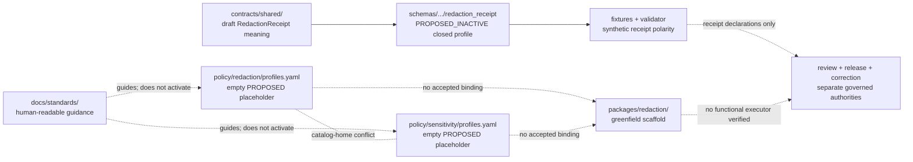
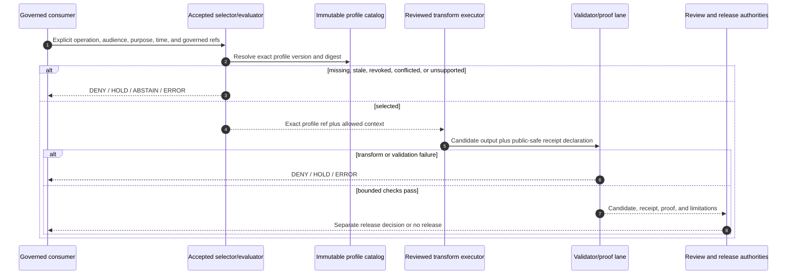

<!-- [KFM_META_BLOCK_V2]
doc_id: kfm://doc/standards/redaction-profiles
title: Redaction Profiles — Repository Boundary and Graduation Standard
type: standard; standards-guidance; redaction-profile-boundary; graduation-standard
version: v2.0-draft
status: "draft; repository-grounded; catalog-home-conflicted; proposed-inactive; fixture-only-receipt-proof; no-active-profile; no-transform-runtime; no-release; no-publication"
owners:
  - "@bartytime4life — verified GitHub review route through CODEOWNERS"
  - "NEEDS VERIFICATION — accountable redaction, sensitivity/privacy, policy, security, domain, implementation, validation, release, and independent-review stewards"
created: 2026-05-14
updated: 2026-08-19
policy_label: "repository-facing; standards-guidance; redaction; sensitivity; geoprivacy; default-hold; release-gated"
owning_root: docs/
current_path: docs/standards/REDACTION_PROFILES.md
responsibility: >
  Explain the current repository boundary for named protective-transform
  profiles, disclose the catalog-home conflict and fixture-only receipt proof,
  and define the evidence required before KFM may claim an accepted profile,
  operational transform, governed consumer, release, or publication.
truth_posture: >
  CONFIRMED same-path standards placement, default CODEOWNERS route, two empty
  proposed catalog placeholders, a proposed-inactive closed RedactionReceipt
  schema with deterministic fixture validator and positive/negative cases, a
  greenfield redaction package, and no verified active profile, selector,
  executor, governed consumer, release, or publication / PROPOSED profile
  authoring and graduation envelope / CONFLICTED catalog home, profile
  vocabulary, sensitivity-rank versus exposure-tier mapping, and receipt
  semantic convergence / UNKNOWN accepted profile parameters, operational
  protection strength, runtime enforcement, correction propagation, and
  accountable independent review.
evidence_snapshot:
  repository: bartytime4life/Kansas-Frontier-Matrix
  base_ref: main
  base_commit: cc52dba82d3b1c62e0a0d97fc49a6d205cf1c5ba
  target_prior_blob: 402abcf3e231db1c2ede5ed09d0d373d574e5053
  standards_readme_blob: a8cbe5d183448d5f0de37f8a4eacd6fcaca0d71b
  codeowners_blob: dd2a84aa514d8ecd9208bc347f90f9a2ed37dd61
  policy_redaction_readme_blob: 6333418d8b8cee359345ee01ae78e38a2e172555
  policy_redaction_placeholder_blob: e928e91ccf278fe42ac0cd83f571ba323787573d
  policy_sensitivity_placeholder_blob: 967f058a82919eab69c40cdc12df2eea27a83b18
  package_redaction_readme_blob: c100eb332db3aba02395c1423b108005cb9bd5ed
  shared_redaction_receipt_contract_blob: c686cdf5c79a8b99ac66d4b01cd30d2f450f645f
  redaction_receipt_schema_blob: 7806abb702accd70dd17e947858c5768cc3eddae
  redaction_receipt_validator_blob: b6d22549a8b043d89ee9c1af658f1662ada70ee5
  redaction_receipt_fixtures_blob: a13adcae4e2fbcb3fa8a42dae8aba510a6ea31e3
  redaction_determinism_blob: 9b3f54f23fc835d4c589c0edbeada72f88766f4d
  sensitivity_rubric_blob: 8e7ac3fe71b2cd0de4389bee5a1477897786208b
external_currentness_review:
  access_date: 2026-08-19
  nist_sp_800_226: "final publication dated 2025-03-06; differential-privacy evaluation guidance"
  edpb_guidelines_01_2025: "official page is closed for feedback; not treated here as an adopted KFM rule"
  ga4gh_passports_and_aai: "identity and data-access authorization standards; not redaction profiles"
  care_principles: "Indigenous data-governance principles; not a transform algorithm"
related:
  - ./README.md
  - ./SENSITIVITY_RUBRIC.md
  - ./REDACTION_DETERMINISM.md
  - ./DP_BUDGETS.md
  - ./CONSENT_TOKENS.md
  - ../doctrine/directory-rules.md
  - ../architecture/sensitive-domain-fail-closed.md
  - ../domains/habitat/CANONICAL_PATHS.md
  - ../runbooks/revocation.md
  - ../../policy/redaction/README.md
  - ../../policy/redaction/profiles.yaml
  - ../../policy/sensitivity/profiles.yaml
  - ../../contracts/shared/redaction_receipt.md
  - ../../schemas/contracts/v1/receipts/redaction_receipt.schema.json
  - ../../fixtures/contracts/v1/receipts/redaction_receipt/cases.json
  - ../../tools/validators/receipts/validate_redaction_receipt.py
  - ../../packages/redaction/README.md
  - ../../release/README.md
tags: [kfm, standards, redaction, protective-transform, sensitivity, geoprivacy, policy, receipts, correction, rollback]
notes:
  - "Same-path documentation modernization only; no profile catalog, policy, contract, schema, validator, fixture, package, runtime, release, deployment, or publication changes."
  - "The document ID, created date, legacy H1 anchor, numbered-section anchors, appendix anchors, and fail-closed trust boundary are retained."
  - "No operational profile identifier, radius, grid, threshold, seed, salt, secret, or implementation is approved by this page."
[/KFM_META_BLOCK_V2] -->

<a id="top"></a>
<a id="redaction-profiles--kfm-standard"></a>

# Redaction Profiles — KFM Repository Boundary and Graduation Standard

> **Operating rule.** A redaction profile can constrain a protective transform only after its identity, scope, parameters, implementation, validation, review, correction, and release bindings are accepted. A standards page, placeholder YAML file, receipt fixture, or rendered output cannot activate a profile or make an output safe.

> [!IMPORTANT]
> **Human-readable guidance only.** Contracts own object meaning, schemas own machine-valid shape, policy owns selection and finite decisions, implementation owns transform behavior, validators prove only bounded checks, accountable review assesses residual risk, and governed release records authorize release. This page owns none of those transitions.

> [!CAUTION]
> **No active KFM redaction-profile catalog was verified.** `policy/redaction/profiles.yaml` and `policy/sensitivity/profiles.yaml` are parallel five-line `PROPOSED` placeholders with no profile entries. Their relationship remains on explicit convergence HOLD.

> [!WARNING]
> **Do not publish operational protection details by example.** Exact radii, cells, thresholds, seeds, salts, reversal material, or parameter combinations can weaken protection. Public documentation may describe obligations and public-safe method classes; operational values require classification, threat review, controlled storage, and accepted references.

| Field | Current bounded result |
|---|---|
| **Evidence snapshot** | `main@cc52dba82d3b1c62e0a0d97fc49a6d205cf1c5ba` |
| **Directory result** | **PLACE** at existing `docs/standards/REDACTION_PROFILES.md`; `docs/standards/` owns human-readable standards guidance |
| **Review route** | `@bartytime4life` through current CODEOWNERS; accountable specialist stewardship and independent approval remain **NEEDS VERIFICATION** |
| **Catalog state** | **CONFLICTED / HOLD**; two empty proposed placeholders and no accepted single-writer resolution |
| **Accepted profile entries** | None verified |
| **Executable proof** | Closed, deterministic, no-network, fixture-only `RedactionReceipt` schema/validator/cases |
| **Transform implementation** | `packages/redaction/` remains a `0.0.0` greenfield scaffold with no supported API or functional executor |
| **Runtime enforcement** | No accepted selector, evaluator, executor, governed consumer, receipt writer, or public enforcement route verified |
| **Release/public effect** | None |

## Quick jump

- [1. Purpose and scope](#1-purpose-and-scope)
- [2. Where this standard fits](#2-where-this-standard-fits)
- [3. Core invariants](#3-core-invariants)
- [4. The sensitivity rubric → profile mapping](#4-the-sensitivity-rubric--profile-mapping)
- [5. Profile shape (required fields)](#5-profile-shape-required-fields)
- [6. Canonical profile catalog](#6-canonical-profile-catalog)
- [7. Determinism and seeding](#7-determinism-and-seeding)
- [8. Versioning and breaking-change rules](#8-versioning-and-breaking-change-rules)
- [9. Verifier and fixture obligations](#9-verifier-and-fixture-obligations)
- [10. Render-time enforcement](#10-render-time-enforcement)
- [11. Receipts and audit trail](#11-receipts-and-audit-trail)
- [12. External framework alignment](#12-external-framework-alignment)
- [13. Anti-patterns](#13-anti-patterns)
- [14. Open questions and NEEDS VERIFICATION](#14-open-questions-and-needs-verification)
- [15. Related docs](#15-related-docs)
- [Appendix A — Worked profile examples (illustrative)](#appendix-a--worked-profile-examples-illustrative)
- [Appendix B — Profile lifecycle states](#appendix-b--profile-lifecycle-states)

---

## 1. Purpose and scope

This document explains the repository boundary for a future **named, versioned protective-transform profile**. A mature profile would bind an exact policy-selected identity to a reviewed transform class, scope, parameter-handling posture, implementation, verification evidence, and correction path.

This page:

1. records the current catalog, receipt, validator, fixture, package, and runtime evidence;
2. separates a profile declaration from sensitivity classification, policy selection, transform execution, receipt recording, review, release, and publication;
3. defines a public-safe authoring envelope without approving operational parameters;
4. preserves the catalog-home and vocabulary conflicts instead of inventing a winner;
5. describes the proof required to graduate from placeholder to accepted inactive profile, then to operational use; and
6. keeps fail-closed, correction, withdrawal, cache, and rollback obligations visible.

This page does **not**:

- adopt or activate a redaction profile;
- choose between `policy/redaction/profiles.yaml` and `policy/sensitivity/profiles.yaml`;
- define a profile contract or schema;
- approve a sensitivity rank, exposure tier, or rank-to-profile mapping;
- approve a radius, cell, threshold, seed, salt, PRNG, differential-privacy parameter, or hidden implementation detail;
- execute policy, authenticate review, open restricted input, transform data, or write a receipt;
- certify that a derivative is safe;
- approve release, promotion, deployment, or publication; or
- replace domain-specific sensitivity, consent, sovereignty, rights, or source-role rules.

Repository presence proves tracked bytes at the pinned revision. It does not prove adoption, operational use, production data, runtime behavior, protection strength, release, or publication.

[Back to top](#top)

---

## 2. Where this standard fits

### Authority by question

| Question | Owning authority | Role of this page |
|---|---|---|
| Where human-readable profile guidance belongs | Accepted Directory Rules and [`docs/standards/README.md`](./README.md) | Explain the boundary and evidence state |
| What a redaction profile means | An accepted semantic contract under `contracts/` | Describe the graduation burden; do not create meaning |
| What fields and values are machine-valid | An accepted closed schema under `schemas/` | Cite current machine evidence; do not duplicate shape |
| Which profile applies | Accepted source policy and an exact evaluator under `policy/` | Explain prerequisites; do not select |
| How the transform runs | Reviewed executable implementation, currently proposed under [`packages/redaction/`](../../packages/redaction/README.md) or another accepted home | State current absence and required proof |
| What one transform execution recorded | `RedactionReceipt` contract, schema, writer, and validation evidence | Explain the fixture-only proof and non-effects |
| Whether protection is sufficient | Threat analysis, domain/privacy/security review, validation, and residual-risk evidence | Require review; do not certify |
| Whether a derivative may be released | Evidence, policy, review, validation, receipts/proofs, and governed release records | Explain closure; never approve |
| Whether a public client may consume it | Released public-safe references and governed delivery configuration | No authority |
| Correction, withdrawal, and rollback | Owning correction/release mechanisms and affected-consumer evidence | Define required handoffs; do not mutate lifecycle |

### Object and state separation

| Surface | Question answered | Must not be collapsed into |
|---|---|---|
| Sensitivity assessment | What requires protection, for which context and audience? | Profile, transform, or release |
| Policy decision | Is the requested operation selected, denied, held, restricted, abstained, or errored? | Transform execution |
| Redaction profile | Which immutable transform obligations apply? | Executable code or sensitive parameters |
| Transform implementation | How are explicit inputs changed? | Policy authority |
| Transform result | Which derivative bytes or withholding result were produced? | Canonical exact truth |
| `RedactionReceipt` | What transform was declared and bound to support references? | Proof of sufficiency or release approval |
| Validation/proof | Which bounded checks passed? | Rights, consent, review, or publication |
| Review record | What an authorized reviewer decided about a bounded subject | Profile identity or release manifest |
| Release record | Which exact derivative is approved for which audience and correction path? | Documentation or CI status |
| Published carrier | What governed public-safe bytes were actually delivered? | Restricted source or preview |

A later state may depend on an earlier one, but no state automatically creates the next.

### Current repository flow


```mermaid
flowchart LR
  Docs["docs/standards/<br/>human-readable guidance"]
  CatalogA["policy/redaction/profiles.yaml<br/>empty PROPOSED placeholder"]
  CatalogB["policy/sensitivity/profiles.yaml<br/>empty PROPOSED placeholder"]
  Contract["contracts/shared/<br/>draft RedactionReceipt meaning"]
  Schema["schemas/.../redaction_receipt<br/>PROPOSED_INACTIVE closed profile"]
  Fixtures["fixtures + validator<br/>synthetic receipt polarity"]
  Package["packages/redaction/<br/>greenfield scaffold"]
  Release["review + release + correction<br/>separate governed authorities"]

  Docs -. "guides; does not activate" .-> CatalogA
  Docs -. "guides; does not activate" .-> CatalogB
  CatalogA -. "catalog-home conflict" .- CatalogB
  Contract --> Schema
  Schema --> Fixtures
  CatalogA -. "no accepted binding" .-> Package
  CatalogB -. "no accepted binding" .-> Package
  Fixtures -. "receipt declarations only" .-> Release
  Package -. "no functional executor verified" .-> Release
```

[Back to top](#top)

---

## 3. Core invariants

The following are **graduation requirements**, not claims that current runtime behavior exists.

1. **One accepted catalog authority.** A profile must resolve through one accepted single-writer catalog or an explicitly governed split. Parallel writable catalogs and implicit merges are prohibited.
2. **Immutable identity.** Selection, execution, receipts, validation, review, release, and correction must bind a profile version and digest, not only a mutable alias or filename.
3. **Complete governed context.** Selection must receive explicit operation, purpose, audience, scope, time, sensitivity, rights, consent, sovereignty, source-role, evidence, review, and correction context as required by the accepted contract. Missing context does not select a weaker profile.
4. **Separated policy and mechanics.** A profile constrains a transform; it does not execute code, classify a record, authenticate an actor, or approve release.
5. **Parameter protection.** Every parameter family must be classified as public, internal, restricted, or secret. Public documentation, reasons, logs, receipts, fixtures, and artifacts must omit material that enables reversal, inference, or protection weakening.
6. **Deterministic claims require proof.** A profile that claims deterministic replay must pin canonical inputs, algorithm and implementation identity, version, resource limits, and parity vectors. A receipt hash alone does not prove transform replay.
7. **Finite fail-closed outcomes.** The accepted selector, executor, and validator contracts must preserve named selected/pass, deny, hold/abstain, and error outcomes. Errors never fall back to pass-through.
8. **No automatic declassification.** Redaction may produce a candidate derivative, but it does not downgrade sensitivity or establish public fitness by itself.
9. **Server-side protection before delivery.** Browser filters, map styling, client clipping, hidden fields, AI wording, or UI labels are not the protective boundary.
10. **Review and release remain separate.** Receipt validity, schema validity, fixture success, code review, merge, or deployment cannot replace accountable privacy/security/domain review and governed release.
11. **Correction is first-class.** A profile version must have affected-output discovery, supersession, re-evaluation, reprocessing, withdrawal, notice, cache invalidation, and rollback obligations appropriate to its consequences.
12. **Public clients never need restricted inputs.** Governed delivery uses released public-safe derivatives and public-safe notices, not exact protected values or reconstructive material.

> [!IMPORTANT]
> An explicit pass-through profile, if ever accepted, carries the same identity, context, policy, review, receipt, release, and correction burdens as a transforming profile. “No transform” is not “no governance.”

[Back to top](#top)

---

## 4. The sensitivity rubric → profile mapping

### Current conclusion: mapping is on HOLD

The repository contains multiple draft vocabularies but no accepted executable bridge among them.

| Surface | Current evidence | Safe interpretation |
|---|---|---|
| [`SENSITIVITY_RUBRIC.md`](./SENSITIVITY_RUBRIC.md) | Draft human-readable `0–5` rubric and named-profile design | Not an active selector or policy bundle |
| `RedactionReceipt` schema | Fixture-only `T0`–`T4` input/output exposure fields | Receipt test vocabulary, not accepted profile selection |
| Catalog placeholders | No entries in either candidate catalog | No default profile can be resolved |
| Policy evaluator | No accepted selector or exact consumer binding verified | Rank/tier does not currently activate a profile |
| Named profile strings in docs | Examples such as `kfm:redact:none` and `profile:sinc-obscure-10km` occur in draft guidance | Documentation references, not accepted entries |
| Synthetic fixture profile | `kfm:redaction-profile:public-grid-v1` appears in safe fixture data | Test identity only; no operational parameters or profile authority |

Before a rank or tier can select a profile, an accepted change must define:

- the authoritative sensitivity vocabulary and version;
- its relationship to domain-specific assessments and release tiers;
- exact normalized selector inputs;
- one catalog resolution algorithm;
- finite selector outcomes and public-safe reason codes;
- profile applicability by operation, purpose, audience, geography, time, and output form;
- handling for unknown, stale, revoked, superseded, or conflicting assessments;
- policy, fixture, evaluator, consumer, receipt, review, correction, and release bindings; and
- migration and replay behavior for previously produced derivatives.

> [!CAUTION]
> Do not copy the old table of rank-specific default radii, grids, jitter, centroid, `k`, or embargo values into policy. Those values were design examples, not accepted operational parameters, and some may be unsafe to disclose.

[Back to top](#top)

---

## 5. Profile shape (required fields)

No accepted KFM redaction-profile contract or machine schema was verified. The field families below are a **candidate authoring envelope** that must be reconciled into owning contracts and schemas before use.

| Field family | Graduation burden | Safety boundary |
|---|---|---|
| **Identity** | Stable profile ID, semantic version, digest, lifecycle state, effective time, prior version, and supersession links | Never infer identity from filename or mutable alias alone |
| **Scope** | Operations, domains, sensitivity classes, purposes, audiences, geographies, time ranges, input forms, and output forms | Unsupported or ambiguous scope must hold or deny |
| **Transform declaration** | Ordered public-safe transform classes and immutable method/implementation references | A declaration is not executable code or proof of equivalent implementations |
| **Required inputs** | Exact sensitivity, rights, consent, sovereignty, source-role, evidence, review, precision, and risk context | Missing, stale, revoked, or mismatched inputs cannot fall back |
| **Output constraints** | Maximum exposure/precision, field and geometry restrictions, aggregation/suppression obligations, and residual-risk posture | A profile cannot promise zero risk or automatic declassification |
| **Parameter handling** | Classification, source of truth, access rule, projection rule, receipt/log rule, and rotation/supersession behavior | Never expose reversal-enabling or protection-weakening material |
| **Determinism and replay** | Canonical input bytes, algorithm, implementation, version, allowed nondeterminism, resource bounds, and parity vectors | Replay must not require public disclosure of restricted material |
| **Verification** | Verifier identity/version, synthetic vectors, negative cases, leak checks, parity, residual-risk checks, and expected finite outcomes | A green fixture proves only its declared case set |
| **Decision and receipt binding** | Selector/evaluator identity, reason and obligation vocabulary, receipt family, hidden-parameter posture, and exact digest bindings | Receipt validity is not policy sufficiency or release approval |
| **Review and acceptance** | Accountable steward roles, independent privacy/security/domain review, accepted subject/version, effective date, and limitations | CODEOWNERS and PR approval are routing evidence, not profile acceptance |
| **Correction and rollback** | Affected-output discovery, re-evaluation, reprocessing, withdrawal, notice, cache invalidation, supersession, and rollback target | Never overwrite history or reuse identity for changed semantics |

The current `RedactionReceipt` schema contains a `transform.profile_ref`, but that reference is exercised only by synthetic fixtures. It does not define the profile object itself.

### Minimum companion evidence

An operational profile should not graduate without all directly required companions:

- accepted semantic contract and closed schema;
- accepted catalog home and one-writer rule;
- positive and negative selector-policy fixtures;
- transform implementation and exact dependency/supply-chain review;
- deterministic or explicitly bounded nondeterministic vectors;
- leak, residual-risk, and public-safe projection checks;
- receipt writer and schema compatibility;
- one governed consumer and failure-path integration tests;
- accountable and independent review;
- release, correction, withdrawal, cache, and rollback integration; and
- required hosted checks and ownership rules.

[Back to top](#top)

---

## 6. Canonical profile catalog

### No canonical active catalog is established

| Candidate surface | Current state | What it does not establish |
|---|---|---|
| [`policy/redaction/profiles.yaml`](../../policy/redaction/profiles.yaml) | Five-line `PROPOSED` placeholder; no profile entries | Canonical home, schema, profiles, selector, or runtime |
| [`policy/sensitivity/profiles.yaml`](../../policy/sensitivity/profiles.yaml) | Parallel five-line `PROPOSED` placeholder; no profile entries | An accepted split, mirror, or fallback |
| `policy/domains/agriculture/redaction_profiles.yaml` | Domain placeholder derived from planning inventory | Domain adoption or permission to create a third authority |
| Named IDs in draft standards and source docs | Documentation references | Catalog membership, parameters, review, or implementation |
| Fixture `profile_ref` | Synthetic identity used to validate receipt behavior | A resolvable profile, transform, or public-safe release |

The current convergence HOLD is:

- do not call either placeholder canonical, active, accepted, or production-ready;
- do not populate both or build a consumer that silently merges them;
- do not create a third catalog or hand-maintained mirror;
- do not infer profile parameters from names such as “grid,” “jitter,” “centroid,” “mask,” or “embargo”;
- do not treat a domain-local placeholder as an override until an accepted resolution rule defines precedence and compatibility;
- do not build selector or executor dependencies on an unresolved path;
- preserve Git history and inbound references during any migration; and
- require an accepted ADR or equivalent authority to name the writer, read path, compatibility period, consumer cutover, correction plan, and rollback.

### Transform classes are not profile entries

The current fixture-only receipt schema recognizes the classes `REMOVE`, `MASK`, `FUZZ`, `GENERALIZE`, `AGGREGATE`, `SUPPRESS`, `DELAY`, `CLIP`, `SIMPLIFY`, and `WITHHOLD`. These are receipt-side transform-class values. They do not establish approved profiles, algorithms, parameters, or safe applicability.

### Public-safe examples only

This page intentionally omits operational radii, grids, `k` thresholds, differential-privacy budgets, seed material, salts, exact source classes, and sensitive-location examples. Such values belong only after classification and review in the accepted source of truth.

[Back to top](#top)

---

## 7. Determinism and seeding

[`REDACTION_DETERMINISM.md`](./REDACTION_DETERMINISM.md) contains detailed draft design for seed construction, PRNG choice, geometry operations, and cross-language parity. Current repository evidence does not establish those choices as accepted or implemented.

### What current executable proof establishes

The fixture-only receipt validator deterministically:

- parses bounded JSON and rejects duplicate keys, non-finite numbers, invalid roots, unsafe symlinks, and oversized input;
- validates against the closed proposed-inactive schema;
- recomputes canonical `spec_hash` and `receipt_id`;
- checks result-state consistency;
- checks withholding and public-candidate constraints; and
- emits finite `PASS`, `DENY`, `ABSTAIN`, or `ERROR` outcomes.

It does **not**:

- load a profile catalog;
- open restricted source geometry or attributes;
- derive a seed;
- execute a geometry, attribute, time, aggregation, or suppression transform;
- compare output bytes with a real executor;
- prove cross-language parity;
- verify protection strength;
- execute policy or authenticate review; or
- authorize lifecycle, release, or publication.

### Determinism graduation burden

A profile claiming deterministic replay needs:

1. canonical input identity and byte normalization;
2. immutable profile, algorithm, implementation, and dependency versions;
3. exact coordinate/reference-system and numeric behavior where geometry is involved;
4. explicit handling of hidden or secret material without exposing it in public artifacts;
5. deterministic resource limits and failure behavior;
6. multi-implementation vectors when more than one implementation is supported;
7. proof that retries, caches, clocks, locale, host entropy, network, and concurrency do not change output;
8. parity between executor, verifier, receipt, and released bytes; and
9. correction behavior when an algorithm, library, or parameter is found unsafe.

> [!WARNING]
> Seeded jitter is obfuscation, not a differential-privacy guarantee. Differential privacy applies to a precisely defined privacy unit, neighboring relation, mechanism, accounting model, and release process; it cannot be inferred from a noise distribution or profile name.

Whether any seed or salt may be public, internal, restricted, or secret remains a threat-model and policy decision. Public reproducibility must not be purchased by exposing material that enables reversal or inference.

[Back to top](#top)

---

## 8. Versioning and breaking-change rules

No accepted profile lifecycle enum or versioning scheme was verified. The following rules define the minimum safe posture for a future accepted scheme.

| Change | Required posture |
|---|---|
| Transform semantics or algorithm | New immutable profile identity/version; compatibility and migration review |
| Parameter or protection-strength change | New immutable identity/version; threat and affected-output review |
| Parameter classification or storage change | Security/privacy review, projection changes, and leak-regression tests |
| Applicability or audience expansion | New review; never broaden by analogy |
| Selector/evaluator behavior change | Versioned policy/evaluator identity and replay tests |
| Implementation or dependency change | Parity, supply-chain, output-diff, and rollback evidence |
| Documentation-only clarification | May retain profile identity only when reviewers prove no semantic or operational effect |
| Deprecation | Named successor, cutoff/effective time, consumer inventory, and warnings |
| Revocation or unsafe discovery | Hold selection/release, identify affected outputs, withdraw or correct, invalidate caches, and preserve history |
| Retirement | No new selection; retained lineage and explicit handling for historical receipts/releases |

A mutable alias, if allowed, must resolve to one immutable version at evaluation time and must never be the sole identity in a receipt, validation report, review, release, correction, or rollback record.

### Correction sequence

For a material correction:

1. stop new selection and release when safety impact is unresolved;
2. identify affected catalog digests, profile versions, implementations, inputs, outputs, receipts, validations, reviews, releases, caches, indexes, and downstream consumers;
3. preserve the prior profile and evidence;
4. issue a corrected or superseding immutable version with explicit compatibility and effective time;
5. re-evaluate and, where authorized, re-run transforms and validators;
6. route released artifacts through correction, withdrawal, notice, replacement, and cache invalidation; and
7. verify downstream convergence before closure.

Rollback is permitted only when the prior state remains safe and applicable. Otherwise use hold, withdrawal, or a forward correction.

[Back to top](#top)

---

## 9. Verifier and fixture obligations

### Current fixture-only receipt proof

| Surface | Current proof | Non-effects |
|---|---|---|
| [`redaction_receipt.schema.json`](../../schemas/contracts/v1/receipts/redaction_receipt.schema.json) | Closed Draft 2020-12 shape; `PROPOSED_INACTIVE`; authority `NONE` | No profile schema, policy execution, transform, review, release, or publication |
| [`validate_redaction_receipt.py`](../../tools/validators/receipts/validate_redaction_receipt.py) | Deterministic parsing, schema, identity, state, public-candidate, withholding, and support-reference checks | No restricted input, catalog resolution, transform replay, or safety certification |
| [`cases.json`](../../fixtures/contracts/v1/receipts/redaction_receipt/cases.json) | Synthetic `PASS`, `DENY`, `ABSTAIN`, and `ERROR` cases, including leak and authority-overreach negatives | No production data, approved profile, real reviewer, or released output |
| `.github/workflows/redaction-receipt.yml` | Path-scoped read-only fixture validation when triggered | A green or untriggered workflow is not profile activation or release evidence |

Repository-native fixture command:

```bash
python tools/validators/receipts/validate_redaction_receipt.py --fixtures
```

Passing this command proves only the current fixture manifest agrees with the current fixture-only validator and schema.

### Required future profile validation

A complete profile family should add, as applicable:

- catalog schema and duplicate/alias/cycle checks;
- selector-policy allow, deny, hold/abstain, and error fixtures;
- missing, unknown, stale, revoked, superseded, digest-mismatched, and wrong-scope profile cases;
- deterministic canonicalization and cross-implementation vectors;
- hidden-parameter and diagnostic leak tests;
- transform-specific invariants and output precision limits;
- residual-risk and linkage/join-risk review;
- resource, timeout, memory, and malformed-input bounds;
- executor/verifier parity against exact output bytes;
- receipt, review, release, correction, and rollback binding tests;
- one governed consumer with server-side negative-path integration;
- affected-output discovery and cache-invalidation drills; and
- no-network synthetic coverage for routine CI.

Sensitive or production data is not required to prove control behavior. Fixtures must remain synthetic, minimal, deterministic, and rights-safe.

[Back to top](#top)

---

## 10. Render-time enforcement

### Current status

No accepted per-request selector, policy decision point, profile resolver, transform executor, revocation service, receipt writer, governed API binding, tile/export integration, cache key, or public enforcement route was verified. The prior sequence diagram described intended behavior as though it existed.

### Graduation model


```mermaid
sequenceDiagram
  autonumber
  participant C as Governed consumer
  participant S as Accepted selector/evaluator
  participant P as Immutable profile catalog
  participant X as Reviewed transform executor
  participant V as Validator/proof lane
  participant R as Review and release authorities

  C->>S: Explicit operation, audience, purpose, time, and governed refs
  S->>P: Resolve exact profile version and digest
  alt missing, stale, revoked, conflicted, or unsupported
    S-->>C: DENY / HOLD / ABSTAIN / ERROR
  else selected
    S-->>X: Exact profile ref plus allowed context
    X->>V: Candidate output plus public-safe receipt declaration
    alt transform or validation failure
      V-->>C: DENY / HOLD / ERROR
    else bounded checks pass
      V-->>R: Candidate, receipt, proof, and limitations
      R-->>C: Separate release decision or no release
    end
  end
```

This diagram is a graduation model, not current runtime evidence.

An operational consumer must:

- enforce protection before public bytes leave the governed boundary;
- avoid hidden fetches and fail closed when required context is unavailable;
- bind cache keys to profile/evaluator/implementation versions, input identity, decision context, and correction state;
- return only public-safe reasons and notices;
- prevent logs and telemetry from exposing protected input or hidden parameters;
- preserve finite negative states rather than converting them to empty success;
- invalidate or withdraw affected material after revocation or correction; and
- prove that browser, map renderer, search index, export, AI, and downstream cache paths cannot bypass the released derivative.

The current [`revocation.md`](../runbooks/revocation.md) is a scaffold. It is not proof of a live status service, propagation mechanism, or cache invalidation.

[Back to top](#top)

---

## 11. Receipts and audit trail

### Current `RedactionReceipt` profile

The current fixture-only schema records:

- immutable receipt identity and issuance time;
- target and input/output digests;
- one or more transform classes and a `profile_ref`;
- a public-safe transform summary with hidden parameters withheld;
- policy, review, validation, evidence, and source-descriptor references;
- input/output exposure tiers and public-candidate posture;
- release-candidate, correction, and rollback references;
- finite recorded, withheld, hold, or error results; and
- governance constants proving that the fixture did not execute policy, authenticate review, open restricted input, mutate lifecycle, authorize release, or authorize publication.

The validator recomputes identity and result consistency. This is useful machine evidence for receipt declaration behavior, not transform execution.

### Receipt boundaries

| Receipt or adjacent object | Role | Does not establish |
|---|---|---|
| `RedactionReceipt` | Records a declared protective transform or withholding result | Profile acceptance, sufficient protection, truth, rights, review, release |
| `PolicyDecision` | Records an accepted policy evaluation where implemented | Transform bytes or release |
| `EvidenceBundle` / evidence refs | Supports consequential claims | Redaction sufficiency or policy |
| Validation report/proof | Records bounded checks | Rights, consent, human approval, or publication |
| Review record | Records accountable review | Transform execution or immutable release |
| Release manifest/decision | Binds exact approved derivative and rollback/correction support | Canonical restricted truth |
| `RunReceipt` | Records a run under its own contract | A substitute for `RedactionReceipt` or profile policy |

A receipt is not the “only acceptable proof.” Release closure is a dependency-closed packet of independent evidence, policy, validation, review, receipt/proof, identity, correction, and rollback authorities.

### Current semantic drift

The shared [`redaction_receipt.md`](../../contracts/shared/redaction_receipt.md) still describes an earlier permissive/no-fields schema posture, while the current machine schema is closed and fixture-only. The schema points back to the shared contract, but this documentation revision does not silently declare semantic convergence. Contract/schema/fixture/validator alignment remains required before adoption.

Public-safe receipts must not contain exact protected values, reversal material, secret seeds or salts, hidden thresholds, sensitive intermediate states, or diagnostics that enable inference.

[Back to top](#top)

---

## 12. External framework alignment

External references inform review; they do not create KFM profiles, policy, implementation, or legal conclusions.

| External reference | Current official status checked | Proper KFM use |
|---|---|---|
| [NIST SP 800-226](https://csrc.nist.gov/pubs/sp/800/226/final) | Final publication dated 2025-03-06 | Evaluate claims about a precisely specified differential-privacy deployment; not a geometry-redaction algorithm or default budget |
| [EDPB Guidelines 01/2025 on Pseudonymisation](https://www.edpb.europa.eu/public-consultations/guidelines-012025-on-pseudonymisation_en) | Official page is closed for feedback and identifies the consultation reference | Security/privacy review input where applicable; not treated here as final KFM policy or legal advice |
| [GA4GH Passports](https://www.ga4gh.org/product/ga4gh-passports/) and [AAI](https://www.ga4gh.org/product/aai/) | Maintained identity and data-access authorization standards | Authenticate identity and communicate access permissions; not profile selection or redaction |
| [CARE Principles](https://www.gida-global.org/careprinciples) | Indigenous data-governance principles emphasizing people, purpose, rights, and self-determination | Governance and review obligations; not a transform recipe or automatic permission |

Differential privacy, pseudonymisation, authentication/authorization, consent, Indigenous data governance, source rights, and geometric/attribute redaction are related but non-substitutable controls. An operational profile must state exactly which claim it makes and which controls remain independent.

[Back to top](#top)

---

## 13. Anti-patterns

| Anti-pattern | Why it fails | Required correction |
|---|---|---|
| Treating this page as policy or catalog authority | `docs/standards/` is guidance only | Route meaning, shape, policy, code, and release to owning roots |
| Populating both placeholder catalogs | Creates parallel writable authority | Resolve catalog home and migrate through one-writer governance |
| Creating a third domain catalog without precedence law | Multiplies ambiguity and bypass paths | Define accepted domain extension and resolution rules |
| Copying draft radii, grids, thresholds, seeds, salts, or algorithms into production | Values are unaccepted and may weaken protection | Classify, threat-review, version, and store through accepted authority |
| Mutable profile alias as receipt identity | Replay and correction become ambiguous | Bind immutable version and digest |
| Inline parameters in ad hoc policy or application code | Evades profile review, versioning, and affected-output discovery | Use accepted immutable profile references |
| Receipt or fixture presented as transform proof | Current proof validates declarations only | Add executor/verifier parity against exact output bytes |
| Client-side hiding as redaction | Restricted bytes have already crossed the boundary | Transform before governed delivery |
| Random-each-request output | Prevents replay and can enable triangulation | Use an accepted deterministic or explicitly bounded method |
| Jitter or generic noise called differential privacy | No formal DP deployment is defined | Use a reviewed DP profile for aggregate claims only |
| Redaction treated as declassification | Residual sensitivity, rights, and review remain | Preserve restrictive handling until governed release |
| Exposing reversal material in logs, receipts, examples, or errors | Defeats the control | Use public-safe identifiers, digests, reasons, and controlled references |
| Silent profile mutation or ID reuse | Breaks historical receipts and released derivatives | Create immutable successor and correction lineage |
| Green CI, merge, deployment, or badge called activation | Those states do not accept policy or authorize release | Record separate acceptance, implementation, review, and release evidence |
| Revocation without affected-output discovery and cache invalidation | Stale derivatives remain exposed | Withdraw, invalidate, propagate, and verify convergence |

[Back to top](#top)

---

## 14. Open questions and NEEDS VERIFICATION

| ID | Open item | Closure evidence | Safe posture |
|---|---|---|---|
| `RP-001` | Which path is the accepted catalog home, or what exact split is permitted? | Accepted ADR or equivalent, one-writer rule, migration, consumer cutover, correction, rollback | **HOLD**; do not populate parallel catalogs |
| `RP-002` | Who owns profile semantics, privacy/security/domain review, acceptance, and independent approval? | Accepted role and authority assignments bound to subject and scope | Do not infer from CODEOWNERS |
| `RP-003` | What contract and schema define a profile and lifecycle? | Accepted semantic contract, closed schema, fixtures, validator, compatibility rules | Treat YAML paths as placeholders |
| `RP-004` | What identity, version, digest, alias, and supersession rules apply? | Accepted identity contract and replay/migration tests | No mutable-alias-only reliance |
| `RP-005` | How do the draft `0–5` rubric, `T0`–`T4` exposure tiers, domain assessments, and release tiers relate? | Accepted mapping and conflict-resolution policy with fixtures | No automatic rank-to-profile mapping |
| `RP-006` | Which parameters are public, internal, restricted, or secret? | Threat model, classification, storage, projection, logging, and rotation rules | Withhold unresolved operational values |
| `RP-007` | What selector inputs and finite outcomes are authoritative? | Accepted input/output contract, evaluator, policy fixtures, public-safe reasons | Fail closed; no boolean shortcut |
| `RP-008` | Which implementation and first governed consumer are accepted? | Supported API, dependency review, integration tests, auth, restricted-input controls | No runtime claim |
| `RP-009` | Which transform verifiers and parity vectors are required? | Exact executor/verifier vectors, negative/leak/resource tests, cross-version results | Receipt validation only |
| `RP-010` | How do shared and domain-specific receipt contracts converge with the current fixture schema? | Contract/schema alignment, extension rules, migration, fixtures, validators | Do not claim one family resolves all |
| `RP-011` | How are prior derivatives, releases, caches, indexes, and downstream copies discovered and corrected? | Dependency index, drills, withdrawal/correction records, cache and propagation evidence | Hold affected output when impact is unknown |
| `RP-012` | Which checks and reviews are required before acceptance and activation? | Workflow triggers, required checks, branch/ruleset evidence, acceptance record | Report local and hosted checks separately |
| `RP-013` | What residual-risk and legal/regulatory review applies by domain and jurisdiction? | Qualified review tied to exact profile, data, purpose, audience, and time | No universal compliance claim |
| `RP-014` | What public-safe receipt and diagnostic projection is allowed? | Projection contract, leak tests, consumer review, incident response | Minimize and withhold by default |

Until these items close, the strongest supportable claim is:

> KFM has human-readable profile design, conflicted empty catalog placeholders, and a deterministic fixture-only `RedactionReceipt` validation profile. It does not have a verified accepted profile catalog, operational redaction engine, governed profile consumer, release integration, or public enforcement path.

[Back to top](#top)

---

## 15. Related docs

### Repository authorities and boundaries

- [`docs/standards/README.md`](./README.md) — human-readable standards-guidance lane
- [`policy/redaction/README.md`](../../policy/redaction/README.md) — current catalog conflict, inactive posture, and contributor HOLD
- [`policy/redaction/profiles.yaml`](../../policy/redaction/profiles.yaml) — empty proposed placeholder
- [`policy/sensitivity/profiles.yaml`](../../policy/sensitivity/profiles.yaml) — parallel empty proposed placeholder
- [`contracts/shared/redaction_receipt.md`](../../contracts/shared/redaction_receipt.md) — draft shared receipt meaning
- [`redaction_receipt.schema.json`](../../schemas/contracts/v1/receipts/redaction_receipt.schema.json) — closed proposed-inactive fixture profile
- [`validate_redaction_receipt.py`](../../tools/validators/receipts/validate_redaction_receipt.py) — fixture-only validator
- [`redaction_receipt/cases.json`](../../fixtures/contracts/v1/receipts/redaction_receipt/cases.json) — synthetic finite-outcome cases
- [`packages/redaction/README.md`](../../packages/redaction/README.md) — greenfield package boundary
- [`release/README.md`](../../release/README.md) — release, correction, withdrawal, and rollback authority

### Adjacent guidance

- [`SENSITIVITY_RUBRIC.md`](./SENSITIVITY_RUBRIC.md) — draft sensitivity-rank design
- [`REDACTION_DETERMINISM.md`](./REDACTION_DETERMINISM.md) — draft seed, algorithm, and replay design
- [`DP_BUDGETS.md`](./DP_BUDGETS.md) — aggregate differential-privacy graduation guidance
- [`CONSENT_TOKENS.md`](./CONSENT_TOKENS.md) — consent credential and policy boundary
- [`sensitive-domain-fail-closed.md`](../architecture/sensitive-domain-fail-closed.md) — sensitive-domain architecture boundary
- [`CANONICAL_PATHS.md`](../domains/habitat/CANONICAL_PATHS.md) — catalog-home conflict evidence
- [`revocation.md`](../runbooks/revocation.md) — current revocation scaffold
- [`directory-rules.md`](../doctrine/directory-rules.md) — placement and responsibility-root rules

[Back to top](#top)

---

## Appendix A — Worked profile examples (illustrative)

> [!NOTE]
> This example is deliberately non-operational. It demonstrates separation and binding concepts, not an accepted schema, profile, algorithm, parameter set, or catalog entry.

```yaml
example_only: true
profile_id: kfm:redaction-profile:example-generalize:v1
profile_digest: sha256:aaaaaaaaaaaaaaaaaaaaaaaaaaaaaaaaaaaaaaaaaaaaaaaaaaaaaaaaaaaaaaaa
lifecycle_state: PROPOSED_EXAMPLE

scope:
  operation: example-public-projection
  audience: example-public
  purpose: example-orientation
  unsupported_context_outcome: HOLD

transform:
  class: GENERALIZE
  method_ref: kfm:redaction-method:example-generalize:v1
  implementation_ref: kfm:implementation:example-redactor:v1
  parameter_handling:
    public_fields:
      - output_precision_class
    restricted_reference: kfm:restricted-parameters:example-generalize:v1
    secrets_in_profile: false

verification:
  verifier_ref: kfm:validator:example-generalize:v1
  synthetic_vector_set_ref: kfm:fixtures:example-generalize:v1
  required_outcomes:
    - PASS
    - DENY
    - ABSTAIN
    - ERROR

bindings:
  selector_ref: kfm:policy-selector:example-redaction:v1
  receipt_profile_ref: kfm:redaction-receipt-profile:example:v1
  review_requirement_ref: kfm:review-requirement:example-sensitive-output:v1
  release_requirement_ref: kfm:release-requirement:example-public-safe:v1

correction:
  affected_output_index_ref: kfm:dependency-index:example-redaction:v1
  rollback_ref: kfm:rollback:example-redaction:v1
```

The example intentionally contains no real radius, grid, threshold, seed, salt, source, location, person, species, infrastructure asset, consent record, or release authorization.

[Back to top](#top)

---

## Appendix B — Profile lifecycle states

No accepted lifecycle enum was verified. A future lifecycle must distinguish at least these independent states:

| State axis | Meaning | Evidence required |
|---|---|---|
| **Documented** | Guidance describes a candidate | Current reviewed prose |
| **Cataloged** | One accepted catalog contains an immutable entry | Catalog authority, schema, version, digest |
| **Schema-valid** | Entry satisfies the accepted machine profile | Closed schema and fixtures |
| **Policy-selectable** | An accepted selector can resolve it for exact context | Policy/evaluator identity and negative tests |
| **Implemented** | A supported executor produces bounded outputs | Code, dependencies, vectors, supply-chain review |
| **Verified** | An independent verifier checks exact declared behavior | Parity, leak, resource, and failure tests |
| **Accepted inactive** | Accountable review accepts the profile but no consumer is authorized | Acceptance record and limitations |
| **Consumer-bound** | One governed component uses the exact profile safely | Integration, auth, telemetry, and rollback tests |
| **Release-eligible** | Required evidence, policy, review, receipt, proof, correction, and rollback close for one candidate | Governed release packet |
| **Released** | An authorized decision binds exact derivative bytes | Immutable release record |
| **Published** | Governed delivery exposes public-safe bytes | Delivery and correction evidence |
| **Deprecated / superseded / withdrawn** | New use stops or prior use is corrected | Successor or withdrawal, affected-output discovery, propagation |

These states are not interchangeable and need not form one automatic linear progression. Activation and release are explicit governed transitions, never side effects of editing a YAML file, passing CI, merging a PR, or deploying code.

[Back to top](#top)

---

**Last evidence review:** 2026-08-19 · **Document version:** `v2.0-draft` · **Operational profile state:** `HOLD` · [Back to top](#top)
