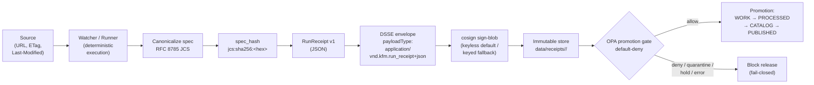

<!-- [KFM_META_BLOCK_V2]
doc_id: kfm://doc/docs-standards-run-receipt
title: RunReceipt — KFM Standard
type: standard
version: v1
status: draft
owners: <docs-steward + governance-steward — PROPOSED, needs CODEOWNERS verification>
created: 2026-05-14
updated: 2026-05-14
policy_label: public
related:
  - docs/standards/CANONICALIZATION.md
  - docs/doctrine/directory-rules.md
  - docs/doctrine/truth-posture.md
  - docs/doctrine/lifecycle-law.md
  - docs/architecture/contract-schema-policy-split.md
  - docs/adr/ADR-S-03-receipt-schema-layout.md
  - schemas/contracts/v1/receipts/run_receipt.v1.schema.json
  - policy/opa/promotion/
  - data/receipts/
tags: [kfm, governance, provenance, attestation, dsse, cosign, receipts, spec_hash]
notes:
  - Repo paths are PROPOSED until verified against mounted-repo evidence.
  - Field-name drift (fetch_time vs fetched_at; http_validators vs source_validators) is an OPEN question — see §11.
[/KFM_META_BLOCK_V2] -->

<a id="top"></a>

# RunReceipt — KFM Standard

> The single, small, tamper-evident JSON object that pins every governed run in KFM to its inputs, identity, policy decision, evidence, and signature. **Without a verifiable RunReceipt, the operation did not happen in the governed sense.**

<p align="center">
  
  
  
  
  
  
  
  
</p>

| Status | Owners | Last reviewed |
|---|---|---|
| **Draft v1** — doctrine CONFIRMED; canonical JSON Schema PROPOSED pending **ADR-S-03** (`receipt schema layout`). | `<docs-steward + governance-steward>` *(CODEOWNERS PROPOSED)* | 2026-05-14 |

> [!IMPORTANT]
> In KFM, **publication is a governed state transition — not a file move.** The RunReceipt is the universal currency of that transition. A published artifact MUST be reconstructible to its source state, policy decision, evidence lineage, integrity hashes, review posture, signing identity, and release intent. The RunReceipt preserves this chain.

---

## Quick links

- [1. Purpose & scope](#1-purpose--scope)
- [2. Normative status & authority](#2-normative-status--authority)
- [3. Doctrine — what a RunReceipt is](#3-doctrine--what-a-runreceipt-is)
- [4. End-to-end flow](#4-end-to-end-flow)
- [5. Required fields (canonical shape)](#5-required-fields-canonical-shape)
- [6. `spec_hash` — deterministic identity](#6-spec_hash--deterministic-identity)
- [7. DSSE envelope and signing](#7-dsse-envelope-and-signing)
- [8. Verification (fail-closed)](#8-verification-fail-closed)
- [9. Storage, placement, and lifecycle](#9-storage-placement-and-lifecycle)
- [10. Policy gates and finite outcomes](#10-policy-gates-and-finite-outcomes)
- [11. Open questions & `NEEDS VERIFICATION`](#11-open-questions--needs-verification)
- [12. Related docs](#12-related-docs)
- [Appendix A — Field-name drift across the corpus](#appendix-a--field-name-drift-across-the-corpus)
- [Appendix B — Worked example](#appendix-b--worked-example)
- [Appendix C — Negative fixture catalog](#appendix-c--negative-fixture-catalog)

---

## 1. Purpose & scope

This standard pins **one** canonical specification of the KFM **RunReceipt**: the small, machine-parseable JSON object emitted by every governed run — ingest, validation, transform, redaction, model materialization, schema migration, release, rollback, or correction.

It defines:

1. The **doctrinal role** of the RunReceipt in the KFM trust chain.
2. The **canonical field set** (`v1`) and the source of canonical authority.
3. The **deterministic identity** rule (`spec_hash` via RFC 8785 JCS + SHA-256).
4. The **DSSE envelope and signing** rules (cosign keyless default; keyed fallback).
5. The **fail-closed verification** sequence required before any promotion.
6. The **storage placement** that conforms to Directory Rules (canonical home: `data/receipts/`).
7. The **policy gates** (default-deny) that consume RunReceipts.

This standard does **not** define the meaning of individual object families (that lives in `contracts/`), the shape of any specific receipt subclass beyond RunReceipt (those live alongside their family), or the wire format of routes that serve RunReceipts to clients (that lives in `apps/governed-api/`).

> [!NOTE]
> Receipt **subclasses** — `TransformReceipt`, `RedactionReceipt`, `AggregationReceipt`, `AIReceipt`, `ModelRunReceipt`, `ReviewRecord`, `ValidationReport`, `PolicyDecision`, `ReleaseManifest`, `CorrectionNotice`, `RollbackCard`, `MatrixCellReceipt`, `StorySnapshot`, `RealityBoundaryNote` — are catalogued in the KFM Encyclopedia (§24.2 Master Receipt Catalog) and inherit the **envelope discipline** described here. Their family-specific fields are governed by their own contracts and schemas.

---

## 2. Normative status & authority

| Layer | Status | Source |
|---|---|---|
| **Doctrine** — RunReceipt is required for every consequential governed operation | **CONFIRMED** | KFM Encyclopedia §24.2; Pass 10 Dossier C1-01 |
| **`spec_hash`** — RFC 8785 JCS + SHA-256, recorded as `jcs:sha256:<hex>` | **CONFIRMED** | Pass 10 Dossier C1-02 |
| **Signing** — cosign (keyless default; keyed fallback); DSSE envelope | **CONFIRMED** | Pass 10 Dossier C1-03; *New Ideas 5-8-26* §"Run Receipt & Attestation Pipeline" |
| **Storage home** — `data/receipts/` (NOT `artifacts/`) | **CONFIRMED** | Directory Rules §8.2, §9.1, §13.2 |
| **Schema authority** — `schemas/contracts/v1/receipts/run_receipt.v1.schema.json` | **PROPOSED** | Default per ADR-0001; final layout pending **ADR-S-03** |
| **Canonical field set** — see §5 | **PROPOSED** | Synthesized across corpus sources that *diverge in detail* (Pass 10 C1-01 explicitly flags this) |
| **DSSE `payloadType`** — `application/vnd.kfm.run_receipt+json` | **PROPOSED** | *New Ideas 5-8-26* §"DSSE envelope" — pending namespace registration |
| **Conformance words** | RFC 2119-style: **MUST / MUST NOT / SHOULD / SHOULD NOT / MAY** | Directory Rules §2.2 |

> [!WARNING]
> The corpus is explicit that *"there is no single canonical KFM run-receipt JSON Schema referenced consistently; multiple sections show schemas that diverge in detail"* (Pass 10 C1-01, Tensions). This document **proposes** a `v1` shape and surfaces the divergence in **Appendix A** rather than smoothing it over. The final canonical field set is the work product of **ADR-S-03**.

---

## 3. Doctrine — what a RunReceipt is

### 3.1 What a signed RunReceipt proves

A valid, signed RunReceipt proves that a specific governed execution:

- observed a **particular source state** (URL + HTTP validators or equivalent commit pin),
- produced a **deterministic `spec_hash`** over its canonical inputs,
- ran under a **specific runner identity** (`runner_id` / `actor`),
- passed through **explicit policy evaluation** (`decision_log`),
- **resolved its evidence references** (`evidence_refs[]`),
- **declared its rights posture** (`license.spdx_id`),
- and **named its promotion intent** (`target_zone`).

### 3.2 What a RunReceipt does *not* prove

A signed RunReceipt does **not** prove factual correctness, legal admissibility, historical truth, scientific certainty, or public-safety suitability. Those remain governed review concerns. **A valid signature does not override** missing evidence, unclear rights, unresolved provenance, sensitivity restrictions, or cultural review requirements.

> [!CAUTION]
> **AI output is never sovereign truth.** The authoritative chain is `source → evidence → receipt → policy decision → attestation → publication`. Generated language never outranks `EvidenceBundle`. (KFM Encyclopedia §I; Whole-UI Governed AI Expansion Report.)

### 3.3 Why the receipt has to be small and canonical

The RunReceipt is intentionally a **single small JSON object** so it can be:

- diff-ed in pull requests,
- indexed in a column store,
- stored next to the artifacts it describes,
- and re-canonicalized and re-hashed by any verifier in any language.

[Back to top](#top)

---

## 4. End-to-end flow

The diagram below shows the canonical lifecycle of a RunReceipt from source observation through to a fail-closed promotion gate. The lifecycle phase labels are CONFIRMED doctrine (Directory Rules §9.1).



> [!NOTE]
> The diagram reflects KFM **doctrine**; the *implementation* of each box (tool names, exact paths, CI workflow file names) is **PROPOSED** until verified against mounted-repo evidence.

[Back to top](#top)

---

## 5. Required fields (canonical shape)

### 5.1 `v1` field set

The canonical `v1` shape consolidates the fields that recur most consistently across the KFM corpus (Pass 10 Dossier C1-01, the *New Ideas 5-8-26* schema skeletons, the MapLibre source-refresher receipt pattern ML-063-054, and the Encyclopedia §24.2 envelope discipline).

| Field | Type | Required | Purpose |
|---|---|---|---|
| `object_type` | const `"RunReceipt"` | **MUST** | Discriminator for receipt routing. |
| `schema_version` | const `"v1"` | **MUST** | Pins the field set this document defines. |
| `receipt_id` | string (UUID or content digest) | **MUST** | Stable identifier for cross-reference. |
| `created` | string, RFC 3339 / ISO 8601 UTC | **MUST** | Wall-clock execution time. |
| `actor` / `runner_id` | string | **MUST** | Builder identity (CI run ID, workflow node, steward ID). |
| `spec_hash` | string, `jcs:sha256:<hex>` | **MUST** | Deterministic identity over canonical spec. See §6. |
| `source_url` | string (URI) | **MUST** *(when source-bound)* | Origin URL or provider URI for ingest receipts. |
| `source_head` | object: `{etag, last_modified, content_length, source_commit}` | **SHOULD** *(when source-bound)* | Captures exact observed source state. |
| `dataset_id` | string | **SHOULD** | Family identifier tying the receipt to its catalog row. |
| `dataset_version` | string | **SHOULD** | Version pinning within the family. |
| `git_commit` / `transform_git_sha` | string (40-hex) | **MUST** | Commit of the code that produced the artifact. |
| `workflow` | string | **SHOULD** | Workflow / pipeline name (CI). |
| `orchestrator` | string | **SHOULD** | Orchestrator identity (e.g. `github-actions`). |
| `artifacts` | array of `{path, sha256}` (or `{path, digest}`) | **MUST** *(when outputs exist)* | The bytes this receipt vouches for. |
| `decision_log` | object: `{decision_id, policy_id, decision, obligations[]}` | **MUST** *(at gates)* | Policy outcome (`allow` / `deny` / `quarantine` / `escalate` / `hold`). |
| `license` | object: `{spdx_id, license_text_ref}` | **MUST** | SPDX rights posture; `UNKNOWN` is a **fail-closed** value. |
| `evidence_refs` | array of `{type, uri}` | **MUST** | Cite-or-abstain substrate. References resolve to `EvidenceBundle`. |
| `attestations` | array of `{type:"cosign", bundle_digest:"sha256:..."}` | **SHOULD** | Self-pointer to the receipt's own signature bundle. |
| `target_zone` | enum: `RAW \| WORK \| QUARANTINE \| PROCESSED \| CATALOG \| TRIPLET \| PUBLISHED` | **MUST** | Promotion intent for this receipt. |
| `kfm_spec_version` | string | **SHOULD** | KFM contract-set version this run was built against. |

> [!NOTE]
> Field names marked with `/` show **acknowledged corpus drift**. See [Appendix A](#appendix-a--field-name-drift-across-the-corpus) for the historical alias map. The canonical names are the first ones listed; aliases are accepted on read for backward compatibility until **ADR-S-03** closes.

### 5.2 Schema skeleton (PROPOSED)

Canonical schema home (per Directory Rules §7.4 default and ADR-0001 default):

```text
schemas/contracts/v1/receipts/run_receipt.v1.schema.json   # PROPOSED — pending ADR-S-03
```

Skeleton (synthesized from the *New Ideas 5-8-26* drop-in plus the §5.1 consolidated field set):

```json
{
  "$schema": "https://json-schema.org/draft/2020-12/schema",
  "$id": "kfm://schema/v1/receipts/RunReceipt.schema.json",
  "title": "RunReceipt",
  "type": "object",
  "required": [
    "object_type",
    "schema_version",
    "receipt_id",
    "created",
    "actor",
    "spec_hash",
    "license",
    "evidence_refs",
    "target_zone"
  ],
  "properties": {
    "object_type":     { "const": "RunReceipt" },
    "schema_version":  { "const": "v1" },
    "receipt_id":      { "type": "string" },
    "created":         { "type": "string", "format": "date-time" },
    "actor":           { "type": "string" },
    "spec_hash":       { "type": "string", "pattern": "^jcs:sha256:[0-9a-f]{64}$" },
    "git_commit":      { "type": "string", "pattern": "^[0-9a-f]{40}$" },
    "workflow":        { "type": "string" },
    "orchestrator":    { "type": "string" },
    "source_url":      { "type": "string", "format": "uri" },
    "source_head": {
      "type": "object",
      "properties": {
        "etag":           { "type": "string" },
        "last_modified":  { "type": "string" },
        "content_length": { "type": "integer", "minimum": 0 },
        "source_commit":  { "type": "string" }
      }
    },
    "artifacts": {
      "type": "array",
      "items": {
        "type": "object",
        "required": ["path", "sha256"],
        "properties": {
          "path":   { "type": "string" },
          "sha256": { "type": "string", "pattern": "^[0-9a-f]{64}$" }
        }
      }
    },
    "decision_log": {
      "type": "object",
      "required": ["decision_id", "policy_id", "decision"],
      "properties": {
        "decision_id": { "type": "string" },
        "policy_id":   { "type": "string" },
        "decision":    { "enum": ["allow", "deny", "quarantine", "escalate", "hold"] },
        "obligations": { "type": "array", "items": { "type": "string" } }
      }
    },
    "license": {
      "type": "object",
      "required": ["spdx_id"],
      "properties": {
        "spdx_id":          { "type": "string" },
        "license_text_ref": { "type": "string", "format": "uri" }
      }
    },
    "evidence_refs": {
      "type": "array",
      "minItems": 1,
      "items": {
        "type": "object",
        "required": ["type", "uri"],
        "properties": {
          "type": { "type": "string" },
          "uri":  { "type": "string", "format": "uri" }
        }
      }
    },
    "attestations": {
      "type": "array",
      "items": {
        "type": "object",
        "required": ["type", "bundle_digest"],
        "properties": {
          "type":          { "enum": ["cosign", "in-toto", "slsa"] },
          "bundle_digest": { "type": "string", "pattern": "^sha256:[0-9a-f]{64}$" }
        }
      }
    },
    "target_zone": {
      "enum": ["RAW", "WORK", "QUARANTINE", "PROCESSED", "CATALOG", "TRIPLET", "PUBLISHED"]
    },
    "kfm_spec_version": { "type": "string" }
  }
}
```

> [!CAUTION]
> The skeleton above is **PROPOSED**. Field set, required-flags, and the `$id` URI all close as part of **ADR-S-03** (`receipt schema layout`). Implementations SHOULD treat this skeleton as a starting point, not as a frozen contract.

[Back to top](#top)

---

## 6. `spec_hash` — deterministic identity

### 6.1 The rule

`spec_hash` is computed by canonicalizing the JSON input under **RFC 8785 JSON Canonicalization Scheme (JCS)** and taking **SHA-256** over the canonical bytes. It is recorded as the literal string `jcs:sha256:<64-hex>`.

```python
import hashlib
import jcs  # RFC 8785 implementation; pin per language

def spec_hash(record: dict) -> str:
    canonical = jcs.canonicalize(record)            # deterministic UTF-8 bytes
    digest    = hashlib.sha256(canonical).hexdigest()
    return f"jcs:sha256:{digest}"
```

### 6.2 Why JCS, not "just `sort_keys=True`"

Hashing developer-formatted JSON is **not acceptable**. Trivial whitespace, number-formatting, or key-order differences would rotate the hash and break re-runs, audits, and idempotent promotion. JCS imposes a **single canonical byte form** for any logical JSON document — that is what makes `spec_hash` portable across languages, machines, and CI runners.

> [!TIP]
> For **JSON-LD graph documents** (e.g. `EvidenceBundle`), URDNA2015 RDF dataset canonicalization followed by SHA-256 is the documented alternative (Pass 10 C1-02). Record the choice (`jcs` vs `urdna2015`) inside the receipt — never silently mix them. The JCS-vs-URDNA2015 decision matrix lives in [`docs/standards/CANONICALIZATION.md`](./CANONICALIZATION.md) *(PROPOSED)*.

### 6.3 Required determinism tests

Per *New Ideas 5-8-26* §"Tests (Determinism & Gates)", the following tests **MUST** pass with no network access:

| ID | Test | Expected |
|---|---|---|
| **T1** | Round-trip determinism across `{TS, Python, Go}` | Identical hex for the same canonical spec |
| **T2** | Whitespace / key-order irrelevance | Variants normalize to the same `spec_hash` |
| **T3** | Semantic change rotates hash | Any meaning-bearing field change produces a different `spec_hash` |
| **T4** | Resolution happy path | `EvidenceRef.spec_hash` → catalog → `EvidenceBundle.spec_hash` match → `ANSWER` |
| **T5** | Missing bundle | Lookup miss → `ABSTAIN` (validator) / `DENY` (policy); emit `ResolutionError.missing_bundle` |
| **T6** | Mismatch | Forced mismatch → `DENY` with `ResolutionError.hash_mismatch` |
| **T7** | Cross-run stability | Identical hash across machines / containers |
| **T8** | Algo-tag enforcement | Non-SHA-256 inputs → `DENY` with `HashAlgoUnsupported` |

[Back to top](#top)

---

## 7. DSSE envelope and signing

### 7.1 Envelope structure

Every RunReceipt that crosses a trust boundary (promotion, publication, public exposure, immutable archive) **MUST** be wrapped in a **DSSE envelope** before signing:

```json
{
  "payloadType": "application/vnd.kfm.run_receipt+json",
  "payload": "<base64url of canonical run_receipt.json bytes>",
  "signatures": [
    { "keyid": "<kid>", "sig": "<base64 signature>" }
  ]
}
```

| Field | Rule |
|---|---|
| `payloadType` | **MUST** be the literal `application/vnd.kfm.run_receipt+json`. *(PROPOSED namespace, pending registration.)* |
| `payload` | **MUST** be base64url of the **canonicalized** `run_receipt.json` bytes (see §6). |
| `signatures` | **MUST** contain at least one signature. Each entry carries `keyid` and `sig`. |

### 7.2 Signing modes

| Mode | Status | When to use |
|---|---|---|
| **cosign keyless** (Sigstore OIDC + Fulcio + Rekor) | **CONFIRMED — preferred** | Default CI path; ephemeral certs against OIDC identity. |
| **cosign keyed** (managed key / HSM) | **CONFIRMED — fallback** | Air-gapped or sovereignty-required environments. |
| Offline signing | **PROPOSED — `NEEDS VERIFICATION`** | Disaster scenarios; rules not yet pinned. |

**Keyed example:**

```bash
cosign sign-blob \
  --key "${COSIGN_KEY}" \
  --output-signature run_receipt.sig \
  envelope.json
```

**Keyless example:**

```bash
cosign sign-blob \
  --output-signature run_receipt.sig \
  envelope.json
# When keyless: persist the Rekor entry index alongside the signature.
```

### 7.3 Rekor expectations

When **keyless** signing is used:

- transparency-log inclusion **SHOULD** be enabled;
- the **Rekor index SHOULD be persisted** next to the signature;
- the **inclusion proof SHOULD be archived** for offline verification.

The receipt **SHOULD** carry an `attestations[]` entry with `{type: "cosign", bundle_digest: "sha256:..."}` pointing at its own bundle so a verifier can resolve the signature from the receipt alone.

[Back to top](#top)

---

## 8. Verification (fail-closed)

> [!CAUTION]
> **Verification MUST fail closed.** Any unverifiable element — signature, hash, evidence, license, policy decision — **MUST** quarantine the receipt and block promotion. There is no "best effort" path.

The verification sequence is fixed:

1. **Recompute `spec_hash`** over the canonical receipt bytes. Mismatch → `QUARANTINE`.
2. **Verify the cosign signature** against the published key (keyed) or against Fulcio + Rekor (keyless).
```bash
   # keyed
   cosign verify-blob --key cosign.pub \
     --signature run_receipt.sig envelope.json

   # keyless
   cosign verify-blob --bundle run_receipt.sig \
     --cert cert.pem envelope.json
```
3. **Verify DSSE integrity** — `payload` exists, `payloadType` matches the registered value, `signatures[]` is non-empty.
4. **Verify the policy outcome** — `decision_log.decision == "allow"`. Anything in `{deny, quarantine, escalate, hold, unknown}` blocks promotion.
5. **Verify the license posture** — `license.spdx_id` is in the SPDX allowlist. `UNKNOWN` is a fail-closed value.
6. **Resolve every `evidence_refs[].uri`** — unresolved evidence is a hard fail.
7. **Verify Rekor inclusion** (keyless only) — stored Rekor index matches the signature's Rekor entry.

If any step fails, set `target_zone = QUARANTINE`, block publication, and open a review ticket. The `decision_id` is the join key across `decision_log`, `run_receipt`, `attestation_ref`, and any downstream `ReleaseManifest`.

[Back to top](#top)

---

## 9. Storage, placement, and lifecycle

### 9.1 Canonical home

Per Directory Rules §8.2, §9.1, and §13.2, the canonical home for emitted RunReceipts is the receipts lane in `data/`:

```text
data/
└── receipts/
    ├── ingest/       # watcher + connector run receipts
    ├── validation/   # ValidationReport + validator run receipts
    ├── pipeline/     # transform / pipeline-step run receipts
    ├── ai/           # AIReceipt + ModelRunReceipt
    └── release/      # release-time run receipts (paired with release/manifests/)
```

> [!WARNING]
> **`artifacts/` is NOT a valid home for receipts.** Directory Rules §8.2 and §13.2 explicitly forbid trust-bearing receipts, proofs, evidence bundles, release manifests, promotion decisions, rollback cards, correction notices, catalog records, or published layers from living in `artifacts/`. A receipt placed there is a drift entry by definition.

### 9.2 Immutability options

Three immutability backings are documented in the corpus (*New Ideas 5-8-26* §"Storage options"). Pick **one** per deployment; record the choice in `data/receipts/README.md`.

| Option | Notes | Status |
|---|---|---|
| **OCI registry via ORAS + cosign attestation** | Preferred when artifacts already live in OCI; reference by digest. | **PROPOSED** |
| **Versioned S3 with Object Lock + KMS** | WORM semantics; retain envelope, signature, optional Rekor index. | **PROPOSED** |
| **Rekor transparency** (keyless) | Persist inclusion proof for audit; pairs with either of the above. | **PROPOSED** |

### 9.3 Receipt × lifecycle phase mapping

Reproduced from KFM Encyclopedia §24.2.2 (a dot means the receipt is normally emitted, amended, or referenced at that phase; receipts created earlier are referenced via `EvidenceRef` rather than duplicated):

| Receipt | RAW | WORK / QUARANTINE | PROCESSED | CATALOG / TRIPLET | PUBLISHED |
|---|:---:|:---:|:---:|:---:|:---:|
| SourceDescriptor       | • | • | • | • | • |
| TransformReceipt       |   | • | • | • |   |
| RedactionReceipt       |   | • | • | • | • |
| AggregationReceipt     |   |   | • | • | • |
| ModelRunReceipt        |   | • | • | • |   |
| RepresentationReceipt  |   |   | • | • |   |
| AIReceipt              |   |   |   | • | • *(Focus Mode only)* |
| ReviewRecord           |   | • | • | • |   |
| PolicyDecision         | • | • | • | • | • |
| ValidationReport       |   | • | • | • |   |
| ReleaseManifest        |   |   |   |   | • |
| CorrectionNotice       |   |   |   |   | • |
| RollbackCard           |   |   |   |   | • |
| RealityBoundaryNote    |   |   | • | • | • |
| MatrixCellReceipt      |   |   | • | • | • |
| StorySnapshot          |   |   |   |   | • |

[Back to top](#top)

---

## 10. Policy gates and finite outcomes

### 10.1 Default-deny promotion

Promotion is **denied unless**: `spec_hash` is present and matches recomputation; the receipt is cosign-signed and verifiable; SPDX rights are in the allowlist; at least one attestation bundle is published; and every dataset-quality check has status `pass` (Pass 10 Dossier C5-02).

```rego
package kfm.promotion

default allow = false

deny[msg] {
  not input.spec_hash
  msg := "missing spec_hash"
}

deny[msg] {
  not input.validation_report
  msg := "missing validation_report"
}

deny[msg] {
  input.validation_report.outcome != "ANSWER"
  msg := sprintf("validator outcome not ANSWER: %v",
                 [input.validation_report.outcome])
}

deny[msg] {
  not input.rights_status
  msg := "missing rights_status"
}

deny[msg] {
  input.rights_status == "unknown"
  msg := "unknown rights_status"
}

deny[msg] {
  input.sensitivity == "restricted"
  msg := "restricted sensitivity requires steward review"
}

allow {
  count(deny) == 0
}
```

> [!TIP]
> Policy parity (Pass 10 C5-03): the **same OPA bundle** gates both CI merges and runtime admission. Drift between CI policy and runtime policy is itself a drift-register entry.

### 10.2 Finite outcomes consumed by gates

Every governed surface returns a finite outcome from the KFM set (Encyclopedia §24.3):

| Outcome | When | Public-surface effect |
|---|---|---|
| **ANSWER** | Evidence sufficient; policy permits; release state allows. | Substantive answer with evidence drawer + citation. |
| **ABSTAIN** | Evidence insufficient or stale; AI surface cannot cite. | Non-substantive note with reason; **never invents**. |
| **DENY** | Policy, rights, sensitivity, or release state forbids. | Denial reason; alternative non-restricted surface where possible. |
| **ERROR** | Cannot evaluate — missing schema, malformed query, contract violation. | Finite, actionable error; **no silent fall-through**. |
| **HOLD** | Promotion / release paused pending review. | Surface remains in prior state. |
| **PASS / FAIL** | Validator-class outcomes. | Internal-only; gates consume them. |

[Back to top](#top)

---

## 11. Open questions & `NEEDS VERIFICATION`

These are explicit, tracked items. They are not blockers for adopting the `v1` shape; they are the work product of **ADR-S-03** and adjacent ADRs.

- **NEEDS VERIFICATION** — Whether `schemas/contracts/v1/receipts/run_receipt.v1.schema.json` exists in the current mounted repo. Path is **PROPOSED** per ADR-0001 default; final layout pending **ADR-S-03** (receipts at `schemas/contracts/v1/receipts/` vs. `schemas/contracts/v1/<domain>/receipts/`).
- **NEEDS VERIFICATION** — Whether the `application/vnd.kfm.run_receipt+json` media type is registered, internal-only, or pending registration with IANA / a KFM vendor-tree.
- **OPEN** — Field-name drift: `fetch_time` vs. `fetched_at`; `http_validators` vs. `source_validators`; `transform_git_sha` vs. `git_commit`; `runner_id` vs. `actor`. The `v1` shape names the *recurring* form first and accepts aliases on read until ADR-S-03 closes. See [Appendix A](#appendix-a--field-name-drift-across-the-corpus).
- **OPEN** — Should `run_id` be carried directly or by reference to an OpenLineage event (Pass 10 C1-01 Open Question).
- **OPEN** — Receipt location: object store keyed by digest, immutable bucket, OCI artifact, or in-repo under `data/AUDIT/`? §9.2 records the three documented options; choice is per-deployment until an ADR pins one.
- **OPEN** — Canonical SPDX allowlist contents. `CC0-1.0` and `CC-BY-4.0` are CONFIRMED present; `ODC-By`, `PDDL`, `US-PD` are candidates (Pass 10 C5-02 Open Question).
- **OPEN** — JCS-vs-URDNA2015 default for graph documents. See [`docs/standards/CANONICALIZATION.md`](./CANONICALIZATION.md) *(PROPOSED)*.
- **NEEDS VERIFICATION** — Whether `policy/opa/promotion/` exists as a directory in the mounted repo. Path is **PROPOSED** per *New Ideas 5-8-26* §"deny-by-default OPA policy"; canonical home is `policy/` per Directory Rules §5.

[Back to top](#top)

---

## 12. Related docs

- [`docs/doctrine/directory-rules.md`](../doctrine/directory-rules.md) — placement law for receipts, proofs, manifests.
- [`docs/doctrine/lifecycle-law.md`](../doctrine/lifecycle-law.md) — RAW → WORK / QUARANTINE → PROCESSED → CATALOG / TRIPLET → PUBLISHED.
- [`docs/doctrine/truth-posture.md`](../doctrine/truth-posture.md) — cite-or-abstain; AI is interpretive, not sovereign.
- [`docs/standards/CANONICALIZATION.md`](./CANONICALIZATION.md) — JCS vs. URDNA2015 decision matrix. *(PROPOSED)*
- [`docs/standards/STAC_KFM_PROFILE.md`](./STAC_KFM_PROFILE.md) — STAC `kfm:provenance` namespace; references RunReceipt. *(PROPOSED)*
- [`docs/architecture/contract-schema-policy-split.md`](../architecture/contract-schema-policy-split.md) — contracts vs. schemas vs. policy authority boundaries.
- [`docs/adr/ADR-0001-schema-home.md`](../adr/ADR-0001-schema-home.md) — `schemas/contracts/v1/...` default.
- `docs/adr/ADR-S-03-receipt-schema-layout.md` — **PROPOSED** ADR that closes §5 and §11.
- `data/receipts/README.md` — per-root README declaring lane scope, validators, and immutability backing. *(PROPOSED)*
- `policy/opa/promotion/` — default-deny promotion bundle. *(PROPOSED)*

[Back to top](#top)

---

## Appendix A — Field-name drift across the corpus

<details>
<summary>Click to expand the alias map and corpus-source reconciliation</summary>

Pass 10 Dossier C1-01 is explicit that *"the corpus uses slightly different field names in different recipes"* and *"there is no single canonical KFM run-receipt JSON Schema referenced consistently."* The table below maps the canonical `v1` names (this document) to the aliases observed in the corpus, with the source that originated each alias.

| Canonical `v1` | Observed aliases | Source(s) |
|---|---|---|
| `created` | `timestamp`, `fetch_time`, `fetched_at` | Pass 10 C1-01; *New Ideas 5-8-26* §"Receipt Schema"; MapLibre ML-063-054 |
| `source_head.etag` + `source_head.last_modified` | `http_validators`, `source_validators` | Pass 10 C1-01 (flagged as historical drift) |
| `actor` | `runner_id`, `orchestrator` *(when CI is also the actor)* | *New Ideas 5-8-26* canonical payload; Pass 10 C1-01 |
| `git_commit` | `transform_git_sha`, `source_commit` *(when distinct from runner commit)* | Pass 10 C1-01; *New Ideas 5-8-26* |
| `artifacts[].sha256` | `artifacts[].digest` | Pass 10 C1-01; MapLibre ML-063-054 |
| `attestations[].bundle_digest` | `attestation_ref` *(when stored as a single URI)* | Pass 10 C1-03; *New Ideas 5-8-26* RunReceipt |
| `decision_log.decision_id` | `envelope_id` *(at the DecisionEnvelope layer, not the receipt)* | *New Ideas 5-8-26* §"DSSE envelope example" |
| `target_zone` | (no observed alias; canonical from first use) | *New Ideas 5-8-26* canonical payload |
| `kfm_spec_version` | (no observed alias) | *New Ideas 5-8-26* canonical payload |

**Reconciliation rule for `v1`:** writers **MUST** emit canonical names. Readers **SHOULD** accept the aliases above on read for backward compatibility and **SHOULD** log a deprecation warning. Aliases are removed when **ADR-S-03** closes.

</details>

[Back to top](#top)

---

## Appendix B — Worked example

<details>
<summary>Click to expand a minimal, fully-populated RunReceipt and its DSSE envelope</summary>

**Canonical `run_receipt.json`** (pre-envelope):

```json
{
  "object_type": "RunReceipt",
  "schema_version": "v1",
  "receipt_id": "rcpt-2026-05-14-ks-hydro-001",
  "created": "2026-05-14T17:23:11Z",
  "actor": "github-actions",
  "spec_hash": "jcs:sha256:7c3a9f4e2b6d8a1c5e9f0b2d4a6c8e1f3b5d7a9c1e3f5b7d9a1c3e5f7b9d1a3c",
  "git_commit": "a1b2c3d4e5f60718293a4b5c6d7e8f9012345678",
  "workflow": "promote-hydrology",
  "orchestrator": "github-actions",
  "source_url": "https://example.org/ks/hydro/huc12.geojson",
  "source_head": {
    "etag": "W/\"3b3e-9a8b7c6d\"",
    "last_modified": "2026-05-13T08:00:00Z",
    "content_length": 4823104,
    "source_commit": "ks-hydro-2026-05-13"
  },
  "artifacts": [
    { "path": "data/processed/hydrology/huc12/v3/huc12.parquet",
      "sha256": "f3e2d1c0b9a8978665544332211001ff1234567890abcdef1234567890abcdef" }
  ],
  "decision_log": {
    "decision_id": "d-9b2f-4a31-8c55",
    "policy_id":   "kfm.promotion.hydrology.v1",
    "decision":    "allow",
    "obligations": []
  },
  "license": {
    "spdx_id": "CC-BY-4.0",
    "license_text_ref": "https://creativecommons.org/licenses/by/4.0/legalcode"
  },
  "evidence_refs": [
    { "type": "evidenceBundle",
      "uri":  "kfm://entity-bundle/sha256/7c3a9f4e2b6d8a1c5e9f0b2d4a6c8e1f" }
  ],
  "attestations": [
    { "type": "cosign",
      "bundle_digest": "sha256:0123456789abcdef0123456789abcdef0123456789abcdef0123456789abcdef" }
  ],
  "target_zone": "CATALOG",
  "kfm_spec_version": "vNext"
}
```

**DSSE envelope**:

```json
{
  "payloadType": "application/vnd.kfm.run_receipt+json",
  "payload": "<base64url of canonical run_receipt.json bytes>",
  "signatures": [
    { "keyid": "cosign://fulcio/github-actions",
      "sig":   "<base64 signature>" }
  ]
}
```

**Storage location** (PROPOSED):

```text
data/receipts/pipeline/hydrology/rcpt-2026-05-14-ks-hydro-001.envelope.json
data/receipts/pipeline/hydrology/rcpt-2026-05-14-ks-hydro-001.sig
data/receipts/pipeline/hydrology/rcpt-2026-05-14-ks-hydro-001.rekor.json   # if keyless
```

</details>

[Back to top](#top)

---

## Appendix C — Negative fixture catalog

<details>
<summary>Click to expand the negative-path fixture set every verifier MUST exercise</summary>

Per Directory Rules-style validator discipline, every RunReceipt verifier **MUST** exercise DENY / ABSTAIN / ERROR paths, not just the happy path. The minimum negative set (from *New Ideas 5-8-26* §"Required Negative Fixtures"):

| Fixture | Expected | Reason code |
|---|---|---|
| `missing_signature.json`      | fail       | `dsse.signature.absent` |
| `invalid_spec_hash.json`      | fail       | `hash.mismatch` |
| `unresolved_evidence.json`    | fail       | `evidence.unresolved` |
| `unknown_spdx.json`           | quarantine | `rights.unknown` |
| `invalid_dsse.json`           | fail       | `dsse.envelope.malformed` |
| `stale_source_head.json`      | fail       | `source.head.stale` |
| `policy_deny.json`            | fail       | `policy.decision.deny` |
| `wrong_payload_type.json`     | fail       | `dsse.payload_type.mismatch` |
| `algo_tag_unsupported.json`   | fail       | `hash.algo.unsupported` |
| `missing_evidence_refs.json`  | fail       | `evidence.refs.empty` |
| `target_zone_unknown.json`    | fail       | `lifecycle.target_zone.invalid` |
| `restricted_sensitivity.json` | hold       | `sensitivity.restricted.review_required` |

Fixtures live next to the validator they exercise — proposed home: `tests/fixtures/receipts/run_receipt/` (PROPOSED; Directory Rules §10 fixture discipline applies).

</details>

[Back to top](#top)

---

---

**Related docs:** [Directory Rules](../doctrine/directory-rules.md) · [Lifecycle Law](../doctrine/lifecycle-law.md) · [Truth Posture](../doctrine/truth-posture.md) · [CANONICALIZATION](./CANONICALIZATION.md) *(PROPOSED)* · [ADR-0001 Schema Home](../adr/ADR-0001-schema-home.md) · `ADR-S-03 Receipt Schema Layout` *(PROPOSED)*
**Last reviewed:** 2026-05-14
[Back to top](#top)
