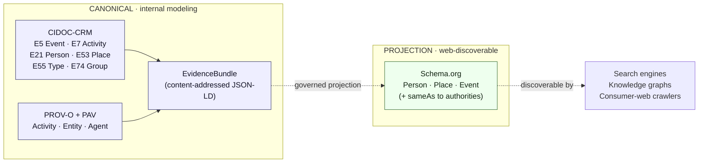
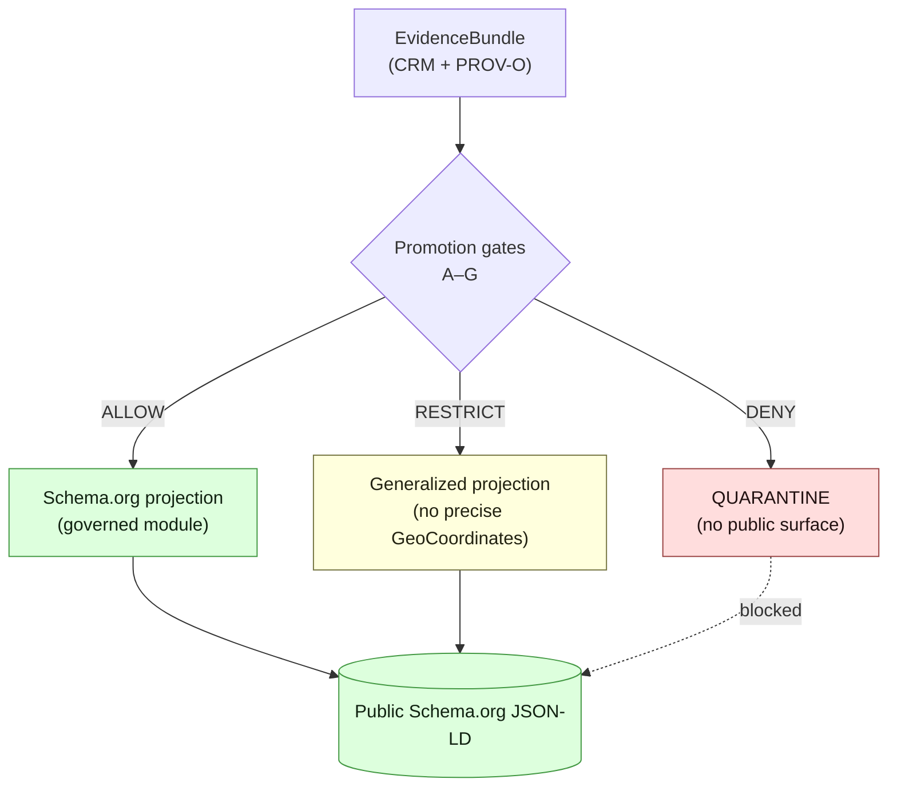

# Schema.org — KFM Conformance Profile

> **Schema.org is KFM's web-discoverable surface for Person, Place, and Event resources — a governed projection of the CIDOC-CRM canonical graph, never a sovereign truth source.**

<!-- [KFM_META_BLOCK_V2]
doc_id: kfm://doc/standards/schema-org
title: Schema.org — KFM Conformance Profile
type: standard
version: v1
status: draft
owners: Docs steward, Knowledge-graph subsystem owner (PLACEHOLDER — verify in CODEOWNERS)
created: 2026-05-14
updated: 2026-05-14
policy_label: public
related:
  - docs/standards/STAC_KFM_PROFILE.md
  - docs/standards/STAC_DWC_PROFILE.md
  - docs/standards/PROV-O.md
  - docs/standards/CIDOC-CRM.md
  - docs/doctrine/truth-posture.md
  - docs/doctrine/trust-membrane.md
  - docs/architecture/contract-schema-policy-split.md
tags: [kfm, standards, schema-org, jsonld, web-surface, projection]
notes:
  - All adjacent path references are PROPOSED until verified against mounted-repo state.
  - Schema.org version pin is a PROPOSED policy decision; see §8.
[/KFM_META_BLOCK_V2] -->

      

| Field | Value |
|---|---|
| **Status** | Draft |
| **Owners** | Docs steward · Knowledge-graph subsystem owner (PLACEHOLDER — verify) |
| **Authority level** | Compatibility projection (CONFIRMED). Canonical truth lives in CIDOC-CRM evidence bundles. |
| **Last updated** | 2026-05-14 |
| **Truth label of doctrine here** | **CONFIRMED** unless otherwise marked |
| **Truth label of any path quoted** | **PROPOSED** until verified against mounted-repo state |

---

## Quick jump

- [1. Scope](#1-scope)
- [2. Doctrine: dual-vocabulary projection](#2-doctrine-dual-vocabulary-projection)
- [3. In-scope Schema.org types](#3-in-scope-schemaorg-types)
- [4. CRM → Schema.org projection mapping](#4-crm--schemaorg-projection-mapping)
- [5. Identity, sameAs, and authority anchoring](#5-identity-sameas-and-authority-anchoring)
- [6. Provenance and evidence binding](#6-provenance-and-evidence-binding)
- [7. Catalog surfaces (STAC, DCAT)](#7-catalog-surfaces-stac-dcat)
- [8. Version pinning and policy](#8-version-pinning-and-policy)
- [9. Rights, sensitivity, and CARE](#9-rights-sensitivity-and-care)
- [10. Publication and trust membrane](#10-publication-and-trust-membrane)
- [11. Validation](#11-validation)
- [12. Open questions and tensions](#12-open-questions-and-tensions)
- [13. Related docs and ADRs](#13-related-docs-and-adrs)
- [Appendix A. Illustrative Person projection](#appendix-a-illustrative-person-projection)
- [Appendix B. Illustrative Place projection](#appendix-b-illustrative-place-projection)
- [Appendix C. Illustrative Event projection](#appendix-c-illustrative-event-projection)

---

## 1. Scope

This document defines **how Kansas Frontier Matrix (KFM) conforms to Schema.org** for the public web surface of Person, Place, and Event resources, and **how that surface relates to the canonical CIDOC-CRM graph and the rest of the KFM evidence machinery.**

It is a **standards conformance profile**, not an architecture decision or a schema. It records:

- which Schema.org types KFM emits,
- how those types are derived from the canonical CRM form,
- how identity, provenance, rights, and sensitivity travel with the projection,
- and where the projection sits in the `RAW → WORK / QUARANTINE → PROCESSED → CATALOG / TRIPLET → PUBLISHED` lifecycle.

It does **not** define:

- the CIDOC-CRM application profile itself (see `docs/standards/CIDOC-CRM.md`, PROPOSED),
- graph-layer provenance vocabulary (see `docs/standards/PROV-O.md`, PROPOSED),
- machine schemas (those live under `schemas/contracts/v1/...` per **ADR-0001**),
- admissibility or release policy (those live under `policy/`),
- or the JSON-LD canonicalization choice between RFC 8785 JCS and W3C URDNA2015 (covered in the evidence-bundle profile).

> [!NOTE]
> Every path quoted in this document is **PROPOSED** until verified against mounted-repo state. Schema-home authority defaults to `schemas/contracts/v1/<…>` per **ADR-0001** (Directory Rules §0, §7.4).

---

## 2. Doctrine: dual-vocabulary projection

KFM maintains **two parallel vocabularies** for person-place-event information, by design:



The doctrinal position, captured directly from KFM source materials (C8-02 in the Idea Index): **Schema.org is necessary but insufficient.** Necessary because it is the only vocabulary that consumer-web search engines and knowledge graphs reliably understand; insufficient because its temporal modeling and evidence attribution are weaker than CRM.

The KFM convention is therefore:

- **CIDOC-CRM** for internal modeling, scholarly attribution, and time-aware structure. (CONFIRMED, C8-01.)
- **Schema.org** for the public, web-discoverable surface only. (CONFIRMED, C8-02.)
- **PROV-O + PAV** for graph-layer claim provenance, attached to the bundle, not to the Schema.org form. (CONFIRMED, C8-03.)
- **A stable projection between CRM and Schema.org**, documented here and implemented as a governed module. (PROPOSED implementation; doctrine CONFIRMED.)

> [!IMPORTANT]
> The Schema.org projection is a **derived view**, not a sovereign truth source. EvidenceBundle outranks any Schema.org JSON-LD KFM emits. A Schema.org document is admissible on the public web only because the CRM bundle behind it cleared promotion gates; the Schema.org form itself carries no independent authority.

---

## 3. In-scope Schema.org types

The KFM Schema.org projection is intentionally narrow. The corpus identifies **Person, Place, and Event** as the load-bearing public surface (C8-02). Adjacent types are admitted only where they are necessary to make the load-bearing types resolvable.

| Schema.org type | KFM use | Source | Status |
|---|---|---|---|
| `Person` | Public-web projection of CRM `E21 Person`. | C8-02 | CONFIRMED |
| `Place` | Public-web projection of CRM `E53 Place`. | C8-02 | CONFIRMED |
| `Event` | Public-web projection of CRM `E5 Event` / `E7 Activity`. | C8-02 | CONFIRMED |
| `Organization` | Projection of CRM `E74 Group` where the group is a corporate body. | C8-01, C8-02 | INFERRED |
| `PostalAddress` | Sub-element of `Place` when a postal anchor exists. | C8-02 | INFERRED |
| `GeoCoordinates` / `GeoShape` | Spatial anchor on `Place`, **subject to sensitivity policy** (§9). | C6, C8-02 | INFERRED |
| `Dataset` | Public-web mirror of the DCAT/STAC catalog entry, where appropriate. | C4-05, C8-02 | PROPOSED |
| `CreativeWork` | Projection of items whose canonical CRM form is `E73 Information Object`. | C8-01 | PROPOSED |

> [!NOTE]
> Adding a Schema.org type beyond this table SHOULD be raised as a doc-change PR against this file and SHOULD reference the CRM class it projects from. New types that do not have a clean CRM origin SHOULD be deferred; KFM does not emit Schema.org content that has no canonical CRM source.

---

## 4. CRM → Schema.org projection mapping

The projection is a **lossy, deterministic, governed transformation** from the CRM bundle to the Schema.org JSON-LD form. Lossy because Schema.org cannot carry all CRM nuance; deterministic because a given CRM bundle MUST produce the same Schema.org output every time; governed because the transformation is gated by the same release machinery as the bundle itself.

| CRM source | Schema.org target | Projection note |
|---|---|---|
| `E21 Person` | `Person` | Name selection: choose one `E82 Actor Appellation` as `name`, surface other appellations as `alternateName`. |
| `E53 Place` | `Place` | `geo` populated **only** if sensitivity policy permits (§9). |
| `E5 Event` / `E7 Activity` | `Event` | `startDate` / `endDate` derived from CRM `E52 Time-Span`. Activities surface as `Event` with a `eventAttendanceMode` of `OfflineEventAttendanceMode` unless otherwise scoped. |
| `E74 Group` (corporate body) | `Organization` | Only where the group has a corporate identity; informal groups SHOULD NOT project. |
| `E55 Type` | `additionalType` (URI) | Schema.org has no first-class typology mechanism; CRM `E55 Type` URIs surface here. |
| `E13 Attribute Assignment` | **Not projected** | Scholarly attribution stays in the CRM bundle; the public surface points at the bundle via `subjectOf` or a `sameAs` to the evidence reference. |
| `E52 Time-Span` | `startDate` / `endDate` / `temporalCoverage` | ISO 8601 strings, lossy: CRM time-span has begin/end-of-begin/end-of-end nuance Schema.org cannot carry. |

> [!CAUTION]
> The projection is **one-way**: CRM → Schema.org. Round-tripping Schema.org back into CRM is not supported and SHOULD NOT be attempted; downstream consumers that ingest the Schema.org form get a derived view, not the canonical record. To recover the canonical record, consumers MUST resolve the `EvidenceRef` to its `EvidenceBundle`.

The projection module itself is **PROPOSED** as implementation work (C8-02 "Suggested Future Work: Build a Schema.org-projection module and a smoke test that walks the catalog and verifies every record has a valid Schema.org form").

---

## 5. Identity, sameAs, and authority anchoring

Every KFM `Person`, `Place`, and `Event` projection MUST carry at least one stable `@id` and SHOULD carry `sameAs` links to upstream authorities.

**Default anchoring policy (CONFIRMED doctrine; specific selections PROPOSED until ADR):**

| Schema.org type | Primary `sameAs` target | Secondary `sameAs` target | Source |
|---|---|---|---|
| `Person` | Wikidata QID | LCNAF IRI (when present) | C7-01, C7-02, C8-02 |
| `Organization` | Wikidata QID | LCNAF / VIAF / ISNI as available | C7-01–C7-04 |
| `Place` | Wikidata QID | USGS GNIS feature IRI (U.S.) / Getty TGN | C7-01, C7-09 |
| `Taxon` (out of scope for Person/Place/Event but noted) | Wikidata QID | ITIS TSN / GBIF Backbone DOI | C7-07, C7-08 |

The KFM convention (C7-01) is that **Wikidata QIDs are the routing anchor, not the truth source.** Where an upstream authority exists (LCNAF for U.S. published names, GNIS for U.S. places, ITIS for U.S. taxa), the upstream authority IRI is the truth-carrying `sameAs`; the Wikidata QID is the connective tissue.

> [!NOTE]
> **Open question (C8-02):** whether `sameAs` should point to Wikidata QIDs, to LCNAF, or to both. The KFM default is **both, with Wikidata first** — but this is **PROPOSED** policy until an ADR pins it.

**Tie-breaker policy** when Wikidata and an upstream authority disagree about a sameAs link: trust the upstream authority and flag the Wikidata claim for steward review (C7-01, PROPOSED).

---

## 6. Provenance and evidence binding

Schema.org has no first-class provenance vocabulary. KFM does **not** attempt to project PROV-O statements into Schema.org structure; instead, each Schema.org resource carries pointers back to the canonical evidence:

- `subjectOf` → the `EvidenceBundle` (content-addressed JSON-LD) that backs the claim.
- `kfm:evidence_ref` → mirrored in STAC properties (C4-01) and on the published Schema.org node for downstream consumers that recognise the namespace.
- `dateModified` → the bundle's promotion timestamp.
- `license` → the rights posture declared on the source descriptor and resolved at promotion.

The graph-layer provenance — `prov:wasGeneratedBy`, `prov:used`, the link back to `RunReceipt` (C1-01) and `spec_hash` (C1-02) — lives **inside** the `EvidenceBundle`, not in the Schema.org document. Consumers who want the full PROV chain fetch the bundle.

> [!IMPORTANT]
> A KFM Schema.org node without a resolvable `subjectOf` or `kfm:evidence_ref` is **not a KFM publication.** The trust-membrane rule applies: the public surface points back through the membrane to the evidence; it does not stand alone as authority.

---

## 7. Catalog surfaces (STAC, DCAT)

The Schema.org projection coexists with — and is referenced from — the catalog vocabularies KFM publishes through.

| Surface | Role of Schema.org | Source |
|---|---|---|
| **STAC Item / Collection** | STAC carries the spatiotemporal envelope and `kfm:provenance` block; a `Person`/`Place`/`Event` involved in the dataset MAY appear as Schema.org JSON-LD in an asset or sidecar reference. | C4-01, C4-02 |
| **DCAT Dataset / Distribution** | Non-spatial datasets carry their Schema.org `Dataset` mirror as a DCAT `Distribution` with `mediaType: application/ld+json` and `conformsTo` pointing at the KFM Schema.org profile. | C4-05 |
| **`kfm:provenance` namespace** | Threads `evidence_bundle_ref`, `run_record_ref`, `audit_ref`, `policy_digest` into STAC properties so Schema.org consumers can follow the chain. | C4-01 |
| **`kfm:care` namespace** | Surfaces MetaBlock v2 CARE fields (`steward_org`, `authority_to_control`, `consent`, `obligations`, `benefit_commitments`) into DCAT / STAC and, by extension, into the Schema.org publication step. | C15-02 |

> [!NOTE]
> The choice between `kfm:` (KFM-global) and `ks-kfm:` (Kansas-scoped) as the provenance namespace is an **open question** (C4-01) and is not settled in this document. The Schema.org profile MUST follow whatever the STAC profile pins; the two surfaces share the namespace.

---

## 8. Version pinning and policy

Schema.org evolves through pull-request governance and **occasionally introduces breaking changes** (C8-02). KFM treats Schema.org as a versioned external standard and pins a compatibility level in the policy bundle.

| Policy element | Status | Note |
|---|---|---|
| **Schema.org version pin** | PROPOSED | The corpus (C8-02) suggests pinning a specific Schema.org release (illustrative example: "Schema.org 26.0"). The actual pin is a steward decision. |
| **Policy-bundle location of the pin** | PROPOSED | Default home: `policy/runtime/` or `policy/release/` per Directory Rules §6.5; final placement requires ADR or per-root README. |
| **Rotation cadence** | PROPOSED | Recommended: review on each Schema.org major release; rotate via ADR or steward review with a `CorrectionNotice` for any affected published claims. |
| **JSON-LD context URL** | PROPOSED | The standard Schema.org JSON-LD context is referenced from `https://schema.org/`; KFM SHOULD pin the context to the version above and MAY mirror it for build-time determinism. |

> [!WARNING]
> Schema.org breaking changes (renamed properties, type splits, removed enums) can silently invalidate published KFM JSON-LD. The version pin and a fixture-based smoke test (§11) are **not optional** if Schema.org output is to remain trustworthy across upstream releases.

---

## 9. Rights, sensitivity, and CARE

The Schema.org surface is a **public surface**. Everything that publishes through it is subject to the full KFM publication discipline:



**Mandatory checks before any record reaches the Schema.org surface (CONFIRMED doctrine):**

- **Rights status** resolved (no `unknown`); `license` populated on the Schema.org node.
- **Sensitivity rank** (C6-01, 0–5) reviewed; sensitivity rank 5 (sacred/critical) **MUST NOT** appear on the public Schema.org surface.
- **CARE block** (C15-01) reviewed where `authority_to_control` is non-empty; default-deny under OPA (C15-03) until consent is present, valid, and unrevoked.
- **Geometry generalization** applied where required (e.g., sensitive archaeology, rare species, living-person locations, critical infrastructure). Where the corpus mandates `≥ 5 km` generalization or `H3 r7`-or-coarser only (e.g., ML-059-068, ML-061-159), the Schema.org `GeoCoordinates` MUST reflect the generalized geometry, not the canonical CRM geometry.
- **Living-person policy**: living-person `Person` projections default to **DENY** unless legal basis, consent, and review are recorded.

> [!CAUTION]
> A correctly-shaped Schema.org JSON-LD document that exposes precise coordinates of a sensitive site is still a publication violation. The Schema.org schema validator alone is **not** a sufficient gate; sensitivity policy MUST run first and fail closed.

---

## 10. Publication and trust membrane

Schema.org JSON-LD is **emitted only from PUBLISHED records**. Per the lifecycle invariant:

```text
RAW → WORK / QUARANTINE → PROCESSED → CATALOG / TRIPLET → PUBLISHED
                                                            │
                                                            └─► Schema.org projection
```

Routing:

- Public clients and search-engine crawlers fetch Schema.org through the **Governed API** (PROPOSED: `apps/governed-api/`), never directly from canonical CRM stores, the triple store, raw bundles, or `data/published/` paths.
- The projection module reads from CATALOG / TRIPLET, runs the deterministic transform, and emits Schema.org JSON-LD that is either embedded in a public page or served from a content-addressed URL.
- A `PromotionDecision` MUST exist for any record reaching the Schema.org surface; a `RollbackCard` MUST identify the previous Schema.org artifact for reversal.

> [!IMPORTANT]
> If a Schema.org document is reachable on the public web but the underlying `EvidenceBundle` has been corrected, superseded, or withdrawn, a `CorrectionNotice` MUST be visible at the public surface — typically as a `subjectOf` or `dateModified` change with a pointer to the notice. Schema.org has no native correction vocabulary; KFM uses the bundle pointer.

---

## 11. Validation

The Schema.org surface needs three independent validators. None of these exists at canonical maturity yet; all are **PROPOSED** as implementation work.

| Validator | What it checks | Default home | Status |
|---|---|---|---|
| **`schema-org-shape-validate`** | The emitted JSON-LD parses against the pinned Schema.org context and uses only declared types and properties. | PROPOSED: `tools/validators/` mirrored by `schemas/contracts/v1/projection/schema-org/...` per ADR-0001 | PROPOSED |
| **`schema-org-projection-smoke`** | Walks the catalog and verifies every Person / Place / Event record has a valid Schema.org form derivable from its CRM bundle (C8-02 Suggested Future Work). | PROPOSED: CI job under `.github/workflows/` | PROPOSED |
| **Negative-path policy tests** | Sensitivity, rights, CARE, and stale-state cases produce **DENY** or **ABSTAIN** at the projection step, not at the renderer. | PROPOSED: `policy/tests/` + `tests/fixtures/projection/schema-org/` | PROPOSED |

> [!NOTE]
> The smoke test is the operational equivalent of the doctrine in §2: it proves the projection is **derived**, not invented. If the smoke test cannot regenerate the Schema.org output from the CRM bundle, the Schema.org output is treated as drift and SHOULD be retracted.

---

## 12. Open questions and tensions

Captured here so reviewers, ADR authors, and the `docs/registers/VERIFICATION_BACKLOG.md` can find them.

| # | Question | Source | Disposition |
|---|---|---|---|
| 1 | `sameAs`: Wikidata QID, LCNAF IRI, or both? Default both with Wikidata first. | C8-02 | **OPEN** — needs ADR. |
| 2 | Schema.org version pin (e.g., "Schema.org 26.0") and rotation cadence. | C8-02 | **PROPOSED** — needs policy-bundle entry. |
| 3 | Provenance-namespace choice: `kfm:` vs `ks-kfm:`. Affects the Schema.org publication too. | C4-01 | **OPEN** — STAC profile is the deciding doc; Schema.org follows. |
| 4 | PROV-O vs CRM `E13` demarcation: where does scholarly attribution end and graph-claim provenance begin? Affects what surfaces via `subjectOf`. | C8-03 | **OPEN** — needs written guide. |
| 5 | Should `kfm:care` (C15-02) be proposed upstream to the STAC-extensions registry, or kept KFM-local? Affects whether external Schema.org consumers see CARE fields. | C15-02 | **OPEN**. |
| 6 | Wikidata mirroring: cache window for build determinism (hours, days, weeks)? Affects Schema.org `sameAs` stability. | C7-01 | **OPEN**. |
| 7 | Round-tripping: round-trip Schema.org back into CRM? Doctrine says **no**, but the explicit prohibition is not yet ADR-ratified. | §4, this doc | **PROPOSED** — needs ADR or per-root README note. |

---

## 13. Related docs and ADRs

| Doc | Role | Status |
|---|---|---|
| [`docs/standards/CIDOC-CRM.md`](./CIDOC-CRM.md) | Canonical graph vocabulary; this profile's upstream. | PROPOSED |
| [`docs/standards/PROV-O.md`](./PROV-O.md) | Graph-layer provenance vocabulary. | PROPOSED |
| [`docs/standards/STAC_KFM_PROFILE.md`](./STAC_KFM_PROFILE.md) | STAC profile with `kfm:provenance` namespace. | PROPOSED |
| [`docs/standards/STAC_DWC_PROFILE.md`](./STAC_DWC_PROFILE.md) | STAC × Darwin Core hybrid (biodiversity). | PROPOSED |
| [`docs/standards/DCAT.md`](./DCAT.md) | DCAT 3 conformance for non-spatial datasets. | PROPOSED |
| [`docs/doctrine/truth-posture.md`](../doctrine/truth-posture.md) | Cite-or-abstain doctrine; constrains this profile. | PROPOSED |
| [`docs/doctrine/trust-membrane.md`](../doctrine/trust-membrane.md) | Public/private boundary; constrains §10. | PROPOSED |
| [`docs/architecture/contract-schema-policy-split.md`](../architecture/contract-schema-policy-split.md) | Contracts/schemas/policy/tests responsibilities. | PROPOSED |
| `docs/adr/ADR-0001-schema-home.md` | Default machine-schema home (`schemas/contracts/v1/<…>`). | CONFIRMED rule; ADR document PROPOSED until verified |
| `docs/adr/ADR-schema-org-projection.md` *(to be authored)* | Projection module boundary, version pin, sameAs default. | TODO |

[Back to top](#schemaorg--kfm-conformance-profile)

---

## Appendix A. Illustrative Person projection

<details>
<summary>Show illustrative JSON-LD (CRM <code>E21 Person</code> → Schema.org <code>Person</code>)</summary>

> [!NOTE]
> This example is **illustrative**, not sourced from a published KFM record. Property names that begin with `kfm:` are placeholders for the KFM provenance namespace whose final form (`kfm:` vs `ks-kfm:`) is an open question (§12, item 3). Identifiers shown (Wikidata QID, LCNAF, content-addressed bundle) are fictional.

```json
{
  "@context": [
    "https://schema.org/",
    {
      "kfm": "https://example.invalid/kfm/ns#"
    }
  ],
  "@type": "Person",
  "@id": "https://example.invalid/kfm/person/PLACEHOLDER",
  "name": "Placeholder, A.",
  "alternateName": ["A. Placeholder", "Placeholder, Alfred"],
  "birthDate": "1849",
  "deathDate": "1921",
  "sameAs": [
    "https://www.wikidata.org/wiki/QXXXXXXX",
    "https://id.loc.gov/authorities/names/nXXXXXXXX"
  ],
  "subjectOf": {
    "@type": "CreativeWork",
    "@id": "kfm://entity-bundle/sha256-PLACEHOLDER",
    "encodingFormat": "application/ld+json"
  },
  "kfm:evidence_ref": "kfm://entity-bundle/sha256-PLACEHOLDER",
  "kfm:sensitivity_rank": 0,
  "license": "https://example.invalid/kfm/rights/public-domain",
  "dateModified": "YYYY-MM-DDThh:mm:ssZ"
}
```

</details>

## Appendix B. Illustrative Place projection

<details>
<summary>Show illustrative JSON-LD (CRM <code>E53 Place</code> → Schema.org <code>Place</code>)</summary>

> [!NOTE]
> Illustrative only. `geo` is shown at coarse precision to make the sensitivity-policy point from §9 concrete; the actual coordinate granularity for a real KFM `Place` would be set by the applicable redaction profile.

```json
{
  "@context": [
    "https://schema.org/",
    { "kfm": "https://example.invalid/kfm/ns#" }
  ],
  "@type": "Place",
  "@id": "https://example.invalid/kfm/place/PLACEHOLDER",
  "name": "Placeholder Crossing",
  "alternateName": ["Old Placeholder Ford"],
  "sameAs": [
    "https://www.wikidata.org/wiki/QXXXXXXX",
    "https://geonames.usgs.gov/apex/f?p=GNIS:PLACEHOLDER"
  ],
  "geo": {
    "@type": "GeoCoordinates",
    "latitude": 38.7,
    "longitude": -98.2,
    "kfm:generalization_method": "centroid-rounded-0.1deg"
  },
  "temporalCoverage": "1854/1879",
  "subjectOf": {
    "@type": "CreativeWork",
    "@id": "kfm://entity-bundle/sha256-PLACEHOLDER"
  },
  "kfm:evidence_ref": "kfm://entity-bundle/sha256-PLACEHOLDER",
  "kfm:sensitivity_rank": 1,
  "license": "https://example.invalid/kfm/rights/cc-by-4.0",
  "dateModified": "YYYY-MM-DDThh:mm:ssZ"
}
```

</details>

## Appendix C. Illustrative Event projection

<details>
<summary>Show illustrative JSON-LD (CRM <code>E5 Event</code> → Schema.org <code>Event</code>)</summary>

> [!NOTE]
> Illustrative only. `startDate`/`endDate` are projected from CRM `E52 Time-Span`; the begin-of-begin / end-of-end nuance CRM carries is lossy under Schema.org and is preserved only in the underlying bundle.

```json
{
  "@context": [
    "https://schema.org/",
    { "kfm": "https://example.invalid/kfm/ns#" }
  ],
  "@type": "Event",
  "@id": "https://example.invalid/kfm/event/PLACEHOLDER",
  "name": "Placeholder Flood",
  "startDate": "1903-05-29",
  "endDate": "1903-06-04",
  "location": { "@id": "https://example.invalid/kfm/place/PLACEHOLDER" },
  "subjectOf": {
    "@type": "CreativeWork",
    "@id": "kfm://entity-bundle/sha256-PLACEHOLDER"
  },
  "kfm:evidence_ref": "kfm://entity-bundle/sha256-PLACEHOLDER",
  "kfm:sensitivity_rank": 0,
  "license": "https://example.invalid/kfm/rights/public-domain",
  "dateModified": "YYYY-MM-DDThh:mm:ssZ"
}
```

</details>

[Back to top](#schemaorg--kfm-conformance-profile)

---

### Related docs

- [`docs/standards/CIDOC-CRM.md`](./CIDOC-CRM.md) *(PROPOSED)*
- [`docs/standards/PROV-O.md`](./PROV-O.md) *(PROPOSED)*
- [`docs/standards/STAC_KFM_PROFILE.md`](./STAC_KFM_PROFILE.md) *(PROPOSED)*
- [`docs/doctrine/truth-posture.md`](../doctrine/truth-posture.md) *(PROPOSED)*
- [`docs/doctrine/trust-membrane.md`](../doctrine/trust-membrane.md) *(PROPOSED)*

**Last updated:** 2026-05-14 · **Owners:** Docs steward · Knowledge-graph subsystem owner *(PLACEHOLDER — verify in CODEOWNERS)* · [Back to top](#schemaorg--kfm-conformance-profile)
