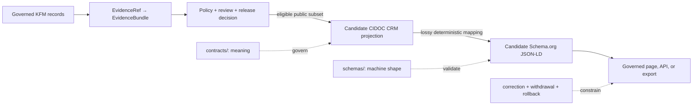
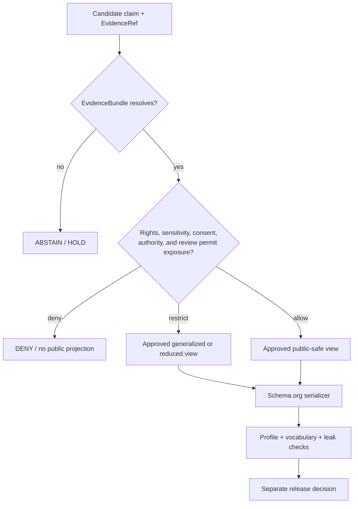

<!-- [KFM_META_BLOCK_V2]
doc_id: kfm://doc/standards/schema-org
title: Schema.org — KFM Projection Boundary and Conformance Plan
type: standard; vocabulary-guidance; public-projection-boundary
version: v2.0-draft
status: "draft; repository-grounded; upstream-currentness-refreshed; no-adoption; no-implementation-proof; no-release; no-publication"
owners:
  - "@bartytime4life — verified GitHub review route through CODEOWNERS"
  - "NEEDS VERIFICATION — knowledge-graph, cultural-heritage, identity, rights/sensitivity, schema/validation, public-web, and release stewards"
created: 2026-05-14
updated: 2026-08-19
policy_label: repository-facing
owning_root: docs/
current_path: docs/standards/SCHEMA-ORG.md
responsibility: >
  Explain the current Schema.org baseline, the bounded KFM projection candidates,
  the repository's implementation limits, and the gates required before KFM may
  claim profile adoption, machine conformance, release, or public interoperability.
truth_posture: >
  CONFIRMED current path, accepted standards-lane placement, CODEOWNERS route,
  current EvidenceBundle shape, sibling-document presence, and official Schema.org
  30.0 currentness / PROPOSED KFM profile, CRM mapping, identity policy, public
  evidence link, version pin, generator, validator, fixtures, consumers, and
  graduation sequence / UNKNOWN adopted KFM Schema.org profile, executable
  projection, released JSON-LD artifact, deployed public consumer, external
  interoperability, and accountable specialist stewardship.
evidence_snapshot:
  repository: bartytime4life/Kansas-Frontier-Matrix
  base_ref: main
  base_commit: 67cf9bcd8d4044beb2f7ec4ec17e1bf162ca30aa
  target_prior_blob: 30d9982721e77aa78c408486b9a4b8668ca85353
  standards_readme_blob: a8cbe5d183448d5f0de37f8a4eacd6fcaca0d71b
  directory_rules_blob: fd49a0b83e55cef52c1124281f093e263526898d
  adr_0029_blob: a4de0d7a96b78da59cfc499d1025e1508afd8dd9
  codeowners_blob: dd2a84aa514d8ecd9208bc347f90f9a2ed37dd61
  cidoc_crm_blob: f9e6af609917bee57bd3e8fccb601b1768a4198f
  evidence_bundle_contract_blob: 731c348832add23cddd14e796aa56ce2b9268259
  evidence_bundle_schema_blob: cf5256831b63dca46a5f68b168441adcf68b8751
external_currentness_review:
  access_date: 2026-08-19
  stable_release: "Schema.org 30.0, published 2026-03-19"
  live_release_summary: https://schema.org/version/latest/
related:
  - ./README.md
  - ./CIDOC-CRM.md
  - ./PROV-O.md
  - ./EVIDENCE_BUNDLE.md
  - ./STAC_KFM_PROFILE.md
  - ./DCAT.md
  - ../doctrine/directory-rules.md
  - ../doctrine/truth-posture.md
  - ../doctrine/trust-membrane.md
  - ../architecture/contract-schema-policy-split.md
  - ../adr/ADR-0001-schema-home--schemas-contracts-v1-is-canonical.md
  - ../adr/ADR-0029-adopt-directory-governance-standard-v2.md
  - ../../contracts/evidence/evidence_bundle.md
  - ../../schemas/contracts/v1/evidence/evidence_bundle.schema.json
  - ../../.github/CODEOWNERS
tags: [kfm, standards, schema-org, json-ld, public-projection, identity, evidence, conformance]
notes:
  - "Same-path documentation modernization only; no contract, schema, policy, implementation, fixture, validator, workflow, source, lifecycle object, release, deployment, or public artifact changes."
  - "The prior CRM mapping used obsolete E82 Actor Appellation; the candidate mapping now follows the repository-grounded CIDOC CRM 7.1.3 guidance and uses E41 Appellation with P1."
  - "The current EvidenceBundle schema is closed and does not admit a Schema.org or CRM JSON-LD graph; a public projection requires a separately governed artifact or a versioned contract/schema change."
  - "Explicit compatibility anchors preserve prior section and appendix links."
[/KFM_META_BLOCK_V2] -->

<a id="top"></a>
<a id="schemaorg--kfm-conformance-profile"></a>

# Schema.org — KFM Projection Boundary and Conformance Plan

> **Purpose.** Explain how Schema.org could provide a public, web-discoverable view of KFM people, places, and events without turning that view into canonical evidence, policy, release authority, or proof of conformance.

> [!IMPORTANT]
> **A standards page is not conformance proof.** This document does not adopt a KFM Schema.org profile, authorize a source, define a machine shape, implement a projection, approve a release, or prove that any public consumer can resolve KFM JSON-LD.

> [!CAUTION]
> **No executable Schema.org projection was established at the pinned repository revision.** Bounded review found this guidance and related narrative references, but no dedicated contract, schema, fixture family, validator, generator, producer, released artifact, or deployed consumer. Treat every KFM-specific mapping below as `PROPOSED` until those surfaces exist and agree.

> [!WARNING]
> **The prior `E82 Actor Appellation` mapping is obsolete for the repository's CIDOC CRM 7.1.3 reference baseline.** Candidate name projection now starts from `E41 Appellation` linked through `P1 is identified by`. Do not preserve an outdated CRM term merely because it appeared in an older example.

| Field | Current bounded result |
|---|---|
| **Directory result** | `PLACE` at the existing `docs/standards/SCHEMA-ORG.md` path under the accepted standards-guidance lane |
| **Official upstream snapshot** | Schema.org **30.0**, published 2026-03-19; checked 2026-08-19 |
| **KFM adoption state** | **UNKNOWN / NEEDS VERIFICATION**; no accepted KFM Schema.org profile was established in this review |
| **Machine implementation state** | No dedicated Schema.org contract, schema, context mirror, fixture family, validator, generator, or producer was established |
| **Evidence integration state** | EvidenceBundle meaning and closed machine shape exist; neither currently carries a Schema.org or CRM JSON-LD graph |
| **Public delivery state** | No released Schema.org artifact, governed endpoint, deployed page markup, or observed consumer was established |
| **Release/publication effect** | None |

**Quick navigation:** [Scope](#1-scope) · [Projection boundary](#2-doctrine-dual-vocabulary-projection) · [Types](#3-in-scope-schemaorg-types) · [CRM mapping](#4-crm--schemaorg-projection-mapping) · [Identity](#5-identity-sameas-and-authority-anchoring) · [Evidence](#6-provenance-and-evidence-binding) · [Catalogs](#7-catalog-surfaces-stac-dcat) · [Versioning](#8-version-pinning-and-policy) · [Safety](#9-rights-sensitivity-and-care) · [Publication](#10-publication-and-trust-membrane) · [Validation](#11-validation) · [Questions](#12-open-questions-and-tensions) · [Evidence ledger](#13-related-docs-and-adrs) · [Person example](#appendix-a-illustrative-person-projection) · [Place example](#appendix-b-illustrative-place-projection) · [Event example](#appendix-c-illustrative-event-projection)

---

<a id="1-scope"></a>

## 1. Scope

### 1.1 What this page owns

This page owns human-readable guidance for:

- the official Schema.org release snapshot used during review;
- a bounded **candidate** public projection for KFM people, places, and events;
- the lossy boundary between a future CIDOC CRM representation and Schema.org;
- safe use of Schema.org identity, evidence, date, rights, and location properties;
- the difference between upstream vocabulary validity and KFM profile adoption; and
- the evidence required before KFM claims generation, validation, interoperability, release, or publication.

### 1.2 What this page does not own

| Question | Owning authority |
|---|---|
| Where this guidance belongs | Accepted [`ADR-0029`](../adr/ADR-0029-adopt-directory-governance-standard-v2.md), [`directory-rules.md`](../doctrine/directory-rules.md), and [`docs/standards/README.md`](./README.md) |
| What a KFM person, place, event, claim, or evidence object means | `contracts/` and accepted domain contracts |
| What machine shape is valid | `schemas/`, using the adopted Directory Rules route |
| What is allowed, denied, redacted, generalized, held, or abstained | `policy/` plus governed review |
| Whether an identity link is accepted | Identity-resolution evidence, source authority, review, and the applicable domain contract |
| Whether code implements the profile | Exact-revision code, configuration, fixtures, validators, tests, and observed producers and consumers |
| Whether evidence supports a public claim | `EvidenceRef` resolution to `EvidenceBundle` and the applicable evidence authorities |
| Whether an artifact may release or publish | Review, policy, proof, release, correction, withdrawal, and rollback authorities |
| What Schema.org terms normatively mean | The official Schema.org release and term pages |

### 1.3 Non-effects

This same-path revision does **not**:

- accept a KFM Schema.org profile or version pin;
- make CIDOC CRM KFM's canonical graph vocabulary;
- add JSON-LD to the EvidenceBundle contract or schema;
- create a `kfm:` or `ks-kfm:` RDF namespace;
- choose a generator, validator, public base URL, API route, or page template;
- authorize Wikidata, LCNAF, VIAF, GNIS, Getty TGN, or another identity source;
- activate a source, move a lifecycle object, or change a policy outcome; or
- release, deploy, publish, withdraw, or correct a public artifact.

[Back to top](#top)

---

<a id="2-doctrine-dual-vocabulary-projection"></a>

## 2. Projection boundary: dual-vocabulary proposal

The repository contains a **candidate** two-surface model:

- CIDOC CRM for a future, higher-fidelity event-centered semantic representation; and
- Schema.org for a smaller public discovery projection.

That relationship is useful guidance, not current implementation proof. The repository-grounded [`CIDOC-CRM.md`](./CIDOC-CRM.md) records that KFM adoption, an executable CRM context, machine profile, runtime graph, and released CRM artifact remain unestablished. A Schema.org projection cannot be more mature than the source model and release evidence from which it is derived.


```mermaid
flowchart LR
    RECORDS["Governed KFM records"] --> EVID["EvidenceRef → EvidenceBundle"]
    EVID --> POLICY["Policy + review + release decision"]
    POLICY -->|eligible public subset| CRM["Candidate CIDOC CRM projection"]
    CRM -->|lossy deterministic mapping| SCHEMA["Candidate Schema.org JSON-LD"]
    SCHEMA --> DELIVERY["Governed page, API, or export"]

    CONTRACTS["contracts/: meaning"] -. govern .-> CRM
    SHAPES["schemas/: machine shape"] -. validate .-> SCHEMA
    CORRECTION["correction + withdrawal + rollback"] -. constrain .-> DELIVERY
```

### 2.1 Boundary rules

1. A Schema.org node is a **derived compatibility view**, not a sovereign record.
2. Projection may only use fields eligible for the intended public audience.
3. The same approved inputs, profile version, and canonicalization rules must produce the same output.
4. Information that Schema.org cannot express without distortion stays in the source artifact or a public evidence summary.
5. A consumer must not reconstruct authoritative CRM or KFM state by round-tripping the public projection.
6. A commit, pull request, badge, valid JSON-LD document, or passing vocabulary check does not prove release or publication authority.

[Back to top](#top)

---

<a id="3-in-scope-schemaorg-types"></a>

## 3. In-scope Schema.org types

The official release contains all types below. Their **upstream existence** is confirmed; their **KFM use** remains proposed.

| Schema.org type | Candidate KFM use | Current KFM state |
|---|---|---|
| [`Person`](https://schema.org/Person) | Public-safe view of a candidate CRM `E21 Person` representation | PROPOSED; privacy- and identity-significant |
| [`Place`](https://schema.org/Place) | Public-safe view of a candidate CRM `E53 Place` representation | PROPOSED; sensitivity- and precision-significant |
| [`Event`](https://schema.org/Event) | Lossy public view of a candidate CRM `E5 Event` or, when justified, `E7 Activity` | PROPOSED; event subtype and status rules undecided |
| [`Organization`](https://schema.org/Organization) | Public view of a corporate or institutional `E74 Group` when the semantic profile supports that interpretation | PROPOSED; not every group is an organization |
| [`PostalAddress`](https://schema.org/PostalAddress) | Structured public address nested under an eligible `Place`, `Person`, or `Organization` | PROPOSED; omit private or restricted addresses |
| [`GeoCoordinates`](https://schema.org/GeoCoordinates) / [`GeoShape`](https://schema.org/GeoShape) | Public-safe geometry for an eligible `Place` | PROPOSED; never copy restricted precision by default |
| [`CreativeWork`](https://schema.org/CreativeWork) / [`WebPage`](https://schema.org/WebPage) | Public evidence-summary or page wrapper that can carry rights, modification, and profile-version information | PROPOSED |
| [`Dataset`](https://schema.org/Dataset) | Dataset discovery metadata where a separately governed dataset profile requires it | PROPOSED; outside the core person/place/event mapping |

Adding a type requires all of the following:

- a documented source meaning and mapping;
- a public-safety and rights disposition;
- a versioned machine profile;
- positive, negative, and migration fixtures;
- generator and validator coverage; and
- at least one reviewed producer and consumer path.

[Back to top](#top)

---

<a id="4-crm--schemaorg-projection-mapping"></a>

## 4. CRM → Schema.org projection mapping

The table is a candidate crosswalk, not an adopted transform. CRM rows follow the repository's CIDOC CRM 7.1.3 guidance.

| Candidate CRM source | Schema.org target | Loss or guardrail |
|---|---|---|
| `E21 Person` | `Person` | Emit only identity- and policy-approved public attributes. A CRM class assertion does not establish that two records identify the same person. |
| `E53 Place` | `Place` | Geometry, address, scale, and precision require a separate public-safety decision. |
| `E5 Event` | `Event` | Schema.org dates cannot preserve all CRM time-span bounds, uncertainty, or claim attribution. |
| `E7 Activity` | `Event` or a more specific Schema.org event subtype | Map only after the profile defines which intentional activities are public events; do not assign `eventAttendanceMode` automatically. |
| `E74 Group` | `Organization` | Map only when the source meaning is genuinely organizational; do not collapse nations, communities, families, or informal collectives into corporations. |
| `E41 Appellation` through `P1 is identified by` | `name` / `alternateName` | Selection, language, script, time, source, and preferred-name policy remain outside Schema.org's flat strings. |
| `E55 Type` through `P2 has type` | [`additionalType`](https://schema.org/additionalType) | Use an approved class IRI when it adds externally meaningful type information; do not emit uncontrolled internal labels. |
| `E52 Time-Span` through `P4 has time-span` | `startDate` / `endDate` or an artifact-appropriate coverage field | Record the exact loss policy for uncertain and open intervals; do not invent precision. |
| `E13 Attribute Assignment` | Usually not flattened into the entity | Keep claim attribution in governed evidence; expose a public evidence summary only when policy and release allow it. |

### 4.1 Required transform properties

A future transform must be:

- **versioned** — record the KFM profile and upstream Schema.org release;
- **deterministic** — stable output for the same eligible inputs and profile;
- **loss-explicit** — every omitted or flattened CRM pattern has a documented disposition;
- **policy-aware** — projection consumes an already governed public-safe view rather than deciding policy itself;
- **evidence-linked** — public claims resolve through an approved evidence-summary boundary; and
- **reversible operationally** — release records identify which projection to withdraw or replace without pretending the lossy JSON-LD can regenerate the source model.

> [!CAUTION]
> Projection is one-way for authority: source model → public compatibility view. A syntactically valid Schema.org document is not a safe or complete source for rebuilding KFM evidence, policy, identity, or CRM state.

[Back to top](#top)

---

<a id="5-identity-sameas-and-authority-anchoring"></a>

## 5. Identity, `sameAs`, and authority anchoring

Schema.org separates an entity's own identifier from references to another page that unambiguously indicates the same identity. Multiple `sameAs` values form an unordered set in ordinary JSON-LD; array position must not encode authority rank or preference.

| Surface | Candidate use | Guardrail |
|---|---|---|
| JSON-LD `@id` | Stable public IRI for the projected node | The public base-IRI and persistence contract are not yet adopted. Do not expose an internal-only or non-dereferenceable identifier as though it were a public URL. |
| [`identifier`](https://schema.org/identifier) | A governed textual, URL, or `PropertyValue` identifier | Preserve scheme and issuer; a matching string is not identity proof. |
| [`sameAs`](https://schema.org/sameAs) | URL of a page that unambiguously identifies the same thing | Use only after entity-level reconciliation. Similar topic, related place, possible person match, or source citation is not `sameAs`. |
| [`url`](https://schema.org/url) | Page or resource URL for the projected item | Do not use it as a substitute for identity adjudication. |
| [`additionalType`](https://schema.org/additionalType) | External class IRI that further types the item | A type relation is not an identity relation. |

No KFM ordering or preference among Wikidata, LCNAF, VIAF, ISNI, GNIS, Getty TGN, or other authorities was established in this review. A future identity profile must define:

1. which sources may assert identity for each object family;
2. evidence and confidence requirements;
3. conflict, ambiguity, and no-match outcomes;
4. review, correction, split, and merge procedures;
5. cache and upstream-change handling; and
6. how a withdrawn link disappears from later projections without erasing lineage.

> [!IMPORTANT]
> An authority URL may be useful and still be ineligible for `sameAs`. When identity is uncertain, omit the property and preserve the candidate relationship in a governed review surface.

[Back to top](#top)

---

<a id="6-provenance-and-evidence-binding"></a>

## 6. Provenance and evidence binding

### 6.1 Current repository boundary

The current [`EvidenceBundle` contract](../../contracts/evidence/evidence_bundle.md) describes claim-scope evidence closure. Its paired [`evidence_bundle.schema.json`](../../schemas/contracts/v1/evidence/evidence_bundle.schema.json) is closed with `additionalProperties: false` and does not declare `@context`, `@graph`, a Schema.org projection, or a CRM graph member.

Therefore this document does not claim that Schema.org JSON-LD is stored inside EvidenceBundle. A future design must choose and govern one of these patterns:

1. a separate versioned public-projection artifact linked to an EvidenceRef;
2. a public evidence-summary resource that resolves only approved evidence and rights information; or
3. a versioned contract/schema expansion with compatibility, migration, fixtures, validators, consumers, and rollback.

### 6.2 Candidate Schema.org binding

| Schema.org surface | Candidate role | Limitation |
|---|---|---|
| [`subjectOf`](https://schema.org/subjectOf) | Link a projected entity to a public `CreativeWork` or `Event` about it | The target must be intentionally public; do not point crawlers at internal bundle storage. |
| [`mainEntity`](https://schema.org/mainEntity) / [`mainEntityOfPage`](https://schema.org/mainEntityOfPage) | Connect a public page wrapper and the entity it describes | Page/entity relationship is not evidence sufficiency. |
| [`isBasedOn`](https://schema.org/isBasedOn) | On a public `CreativeWork`, identify an approved source work or evidence summary | Do not leak private source URLs, signed URLs, or restricted citations. |
| [`dateModified`](https://schema.org/dateModified) | Modification date on the public `CreativeWork` wrapper | It is not automatically the source observation, promotion, or correction time. |
| [`license`](https://schema.org/license) | Rights statement on the public `CreativeWork` or other supported type | A source license does not automatically license the projection or every underlying item. |

The prior custom `kfm:evidence_ref` and `kfm:sensitivity_rank` fields are removed from the examples. No public KFM RDF namespace or extension context was established. Reintroduce custom terms only through a versioned namespace, machine profile, documentation, fixtures, and consumer evidence.

[Back to top](#top)

---

<a id="7-catalog-surfaces-stac-dcat"></a>

## 7. Catalog surfaces (STAC, DCAT)

Schema.org, STAC, and DCAT can describe overlapping resources, but they do not have interchangeable authority or proof semantics.

| Surface | Candidate role | Current bounded state |
|---|---|---|
| Schema.org | Public web discovery for selected entities, pages, and datasets | Guidance exists; executable KFM profile not established |
| STAC | Geospatial asset and collection discovery | KFM guidance files exist; this review did not prove Schema.org sidecars or crosswalk execution |
| DCAT | Dataset and distribution catalog description | KFM guidance exists; this review did not prove a Schema.org `Dataset` mirror or distribution mapping |
| EvidenceBundle | Claim-scope evidence closure | Contract and closed schema exist; not a catalog vocabulary or JSON-LD graph container |
| Release and correction objects | Govern exposure, withdrawal, and replacement | Not created or changed by this page |

A future crosswalk must name the described resource, source field, target term, cardinality, loss behavior, identity rule, rights effect, validator, and correction path. It must not assume that a Schema.org `Dataset`, STAC Item, DCAT Dataset, EvidenceBundle, and released carrier are the same object.

[Back to top](#top)

---

<a id="8-version-pinning-and-policy"></a>

## 8. Version pinning and policy

### 8.1 External currentness snapshot

| Surface | Verified 2026-08-19 result | Use in this document |
|---|---|---|
| [Schema.org releases](https://schema.org/docs/releases.html) | Release **30.0** is the latest named stable release, published 2026-03-19 | External review baseline only |
| [30.0 release summary](https://schema.org/version/30.0/) | Stable generated summary with downloadable vocabulary formats | Exact reference for term review |
| [`/version/latest/`](https://schema.org/version/latest/) | Resolves to the current release summary | Review aid; not a reproducible KFM pin by itself |
| [Schema.org live site](https://schema.org/) | Official site may include early-access fixes between named releases | Do not treat an undated live response as a frozen build input |
| [Schema.org staging site](https://staging.schema.org/) | Work in progress and potentially unsettled | Never use as a release baseline without an explicit experimental profile |
| [JSON-LD developer guidance](https://schema.org/docs/developers.html) | Documents Schema.org JSON-LD and its context | Network location is not a pinned local dependency |

### 8.2 KFM state and graduation rule

No KFM Schema.org release pin, mirrored context, digest, or rotation policy was established. Before executable projection, KFM must decide:

- the exact named Schema.org release;
- whether the live context is fetched, vendored, or generated;
- how context bytes and vocabulary artifacts are integrity-pinned;
- how offline validation resolves the pinned context without hidden network access and handles the official HTTP/HTTPS vocabulary-IRI conventions;
- whether pending or early-access terms are prohibited;
- how upstream additions, supersessions, and corrections are reviewed;
- which profile changes are additive or breaking; and
- how affected projections are regenerated, compared, corrected, and withdrawn.

If a public `CreativeWork` wrapper declares [`schemaVersion`](https://schema.org/schemaVersion), it should use the exact reviewed release URL. That field records vocabulary intent; it does not prove that the artifact passed the KFM profile or release gates.

[Back to top](#top)

---

<a id="9-rights-sensitivity-and-care"></a>

## 9. Rights, sensitivity, and CARE

Schema.org markup is often intended for broad indexing. The eligible projection must therefore be selected **before** serialization, not cleaned up after a renderer has exposed it.


```mermaid
flowchart TD
    CLAIM["Candidate claim + EvidenceRef"] --> RESOLVE{"EvidenceBundle resolves?"}
    RESOLVE -->|no| ABSTAIN["ABSTAIN / HOLD"]
    RESOLVE -->|yes| POLICY{"Rights, sensitivity, consent,<br/>authority, and review permit exposure?"}
    POLICY -->|deny| DENY["DENY / no public projection"]
    POLICY -->|restrict| SAFE["Approved generalized or reduced view"]
    POLICY -->|allow| FULL["Approved public-safe view"]
    SAFE --> SERIALIZE["Schema.org serializer"]
    FULL --> SERIALIZE
    SERIALIZE --> VALIDATE["Profile + vocabulary + leak checks"]
    VALIDATE --> RELEASE["Separate release decision"]
```

### 9.1 Minimum safety posture

- Resolve evidence and source identity before emitting consequential claims.
- Apply the governing rights, sensitivity, consent, sovereignty, cultural, living-person, geoprivacy, and public-access rules.
- Minimize names, dates, family relations, addresses, contact details, images, identifiers, and coordinates to the approved public need.
- Use generalized geometry only when a named policy and review authorize that output; otherwise omit it.
- Preserve `DENY`, `HOLD`, `ABSTAIN`, and error outcomes rather than manufacturing a partial success.
- Scan the prepared public artifact for internal paths, private URLs, signed URLs, secrets, restricted citations, and harmful precision.
- Record the transform and correction target outside Schema.org when the vocabulary cannot carry the required governance detail.

This page does not define sensitivity ranks, distance thresholds, grid levels, consent rules, or living-person outcomes. Those are policy decisions and must be cited from their adopted authority when implemented.

> [!CAUTION]
> Vocabulary-valid JSON-LD can still be unsafe, unsupported, misleading, or unauthorized. Shape validation is necessary for an adopted profile and insufficient for publication.

[Back to top](#top)

---

<a id="10-publication-and-trust-membrane"></a>

## 10. Publication and trust membrane

### 10.1 Current state

At the pinned revision, this review did not establish a Schema.org producer, governed endpoint, embedded page payload, released artifact, public consumer, or correction workflow. The diagram below is a **graduation plan**, not a current runtime topology.

```text
RAW → WORK / QUARANTINE → PROCESSED → CATALOG / TRIPLETS → PUBLISHED
                                                              │
                                                              └─ candidate public Schema.org projection
```

### 10.2 Required release boundary

A future public projection must be traceable to:

1. the exact eligible source record and EvidenceRef;
2. the resolved EvidenceBundle and public evidence-summary disposition;
3. the KFM profile version and Schema.org release;
4. the deterministic generator and input digest;
5. validation and public-data leak checks;
6. policy, review, and release decisions;
7. the immutable or content-addressed delivered artifact; and
8. correction, withdrawal, cache-invalidation, and rollback targets.

Public clients should receive the approved projection through a governed page, API, or export boundary. They must not be directed to canonical stores, private bundle locations, raw lifecycle paths, or internal-only identifiers as their normal access route.

### 10.3 Correction behavior

When a source claim, identity link, rights posture, sensitivity decision, or public projection changes:

- issue the applicable correction, supersession, or withdrawal record;
- regenerate from corrected governed inputs;
- replace or withdraw the public artifact through the release boundary;
- invalidate caches and indexes where required;
- retain lineage between old and new artifact identities; and
- do not treat a Git revert as sufficient correction for already indexed public data.

[Back to top](#top)

---

<a id="11-validation"></a>

## 11. Validation

### 11.1 Current documentation slice

This revision changes documentation only. Required checks cover:

- one H1, valid heading order, unique explicit anchors, balanced fences, and supported GitHub alerts;
- valid JSON in all illustrative JSON-LD blocks;
- local Markdown targets, case-sensitive paths, and fragments;
- external links limited to official vocabulary, specification, and authority references;
- preservation of the prior section and appendix anchors;
- consistency between status, metadata, repository evidence, and examples; and
- absence of unrelated path changes, secrets, personal data, restricted source material, or harmful precision.

### 11.2 Future executable profile

| Validation layer | Required proof before a conformance claim |
|---|---|
| JSON / JSON-LD | Parse JSON and expand deterministically with the approved digest-pinned context and an offline document loader; fail unresolved or unapproved remote contexts |
| Upstream vocabulary | Check types, properties, expected value types, superseded terms, and exact Schema.org release |
| KFM application profile | Enforce allowed types/properties, required and unique stable identifiers, declared or allowlisted extension terms, wrapper/evidence pattern, cardinality, and loss rules |
| CRM crosswalk | Reproduce expected outputs from versioned candidate CRM fixtures and detect obsolete or unmapped terms |
| Identity | Exercise confirmed match, ambiguous match, conflict, no-match, split, merge, and withdrawal paths |
| Rights and sensitivity | Exercise allow, generalized/reduced, deny, hold, abstain, correction, and leak-detection paths |
| Determinism | Generate byte-identical canonical output for identical eligible inputs and profile version |
| Consumer checks | Prove at least one KFM producer and intended consumer against exact revisions; optional third-party validators remain observational |
| Release and correction | Tie artifacts to release, supersession, withdrawal, cache invalidation, and rollback records |

### 11.3 What passing does not prove

- JSON parsing does not prove vocabulary validity.
- Vocabulary validity does not prove KFM profile conformance.
- Profile conformance does not prove evidence sufficiency or correct identity.
- Policy evaluation does not prove review or release approval.
- A third-party rich-results test does not prove general Schema.org validity or KFM interoperability.
- A green workflow does not prove deployment, indexing, publication, or successful correction.

No dedicated Schema.org validator or CI job is named here because none was established at the pinned revision. Add a command only after the repository owns and tests it.

[Back to top](#top)

---

<a id="12-open-questions-and-tensions"></a>

## 12. Open questions and tensions

| # | Decision needed | Why it matters |
|---|---|---|
| 1 | What KFM authority adopts the profile, and who provides specialist review? | Documentation and CODEOWNERS routing do not establish semantic or release authority. |
| 2 | Is Schema.org generated directly from governed domain records or from a versioned CRM artifact? | Determines source semantics, loss accounting, and dependency order. |
| 3 | Does the projection live as an embedded page graph, API representation, sidecar artifact, or more than one synchronized output? | Determines identity, content negotiation, caching, and rollback. |
| 4 | What is the public base IRI and persistence contract? | `@id`, evidence links, correction, and consumer stability depend on it. |
| 5 | Which Schema.org release and context bytes are pinned? | Live and staging vocabularies can change independently of KFM. |
| 6 | Which identity authorities may populate `sameAs`, with what evidence and conflict outcomes? | Incorrect `sameAs` links can collapse distinct people, places, or organizations. |
| 7 | Which CRM classes, properties, uncertainties, and temporal bounds map or deliberately do not map? | Projection loss must be testable and reviewable. |
| 8 | Is a public evidence-summary artifact required, and what may it reveal? | Internal EvidenceBundle storage is not automatically a public resource. |
| 9 | Are custom KFM JSON-LD terms needed? | A namespace requires versioning, documentation, validation, and consumer support. |
| 10 | Which policy output is the serializer allowed to consume? | Serialization must not become a second policy engine. |
| 11 | Which validators and consumer tests are required for draft, release, and correction? | Different checks prove different boundaries. |
| 12 | How are previously indexed projections withdrawn or corrected? | Repository rollback alone does not repair public reliance. |

[Back to top](#top)

---

<a id="13-related-docs-and-adrs"></a>

## 13. Related docs and ADRs

### 13.1 Repository evidence

| Surface | Role in this revision | Limitation |
|---|---|---|
| [`docs/standards/README.md`](./README.md) | Accepted-lane boundary, inventory, and mixed-maturity disclosure | Does not adopt this profile |
| [`CIDOC-CRM.md`](./CIDOC-CRM.md) | Current CRM baseline, corrected E41/P1 naming pattern, and graph-artifact boundary | KFM CRM adoption and executable projection remain unestablished |
| [`PROV-O.md`](./PROV-O.md) | Existing provenance guidance | Requires independent parity and implementation review |
| [`EVIDENCE_BUNDLE.md`](./EVIDENCE_BUNDLE.md) | Human-readable evidence-bundle guidance | Does not make EvidenceBundle a public Schema.org resource |
| [`contracts/evidence/evidence_bundle.md`](../../contracts/evidence/evidence_bundle.md) | EvidenceBundle semantic meaning | Draft/PROPOSED and not a Schema.org profile |
| [`evidence_bundle.schema.json`](../../schemas/contracts/v1/evidence/evidence_bundle.schema.json) | Current closed EvidenceBundle machine shape | Contains no Schema.org or CRM graph member |
| [`STAC_KFM_PROFILE.md`](./STAC_KFM_PROFILE.md) and [`DCAT.md`](./DCAT.md) | Adjacent catalog guidance | Do not prove an implemented crosswalk |
| [`directory-rules.md`](../doctrine/directory-rules.md) and accepted [`ADR-0029`](../adr/ADR-0029-adopt-directory-governance-standard-v2.md) | Placement authority | Do not decide profile semantics |
| [`ADR-0001`](../adr/ADR-0001-schema-home--schemas-contracts-v1-is-canonical.md) | Proposed dedicated schema-routing record layered on adopted Directory Rules | Remains proposed; does not create a Schema.org schema |
| [`.github/CODEOWNERS`](../../.github/CODEOWNERS) | Verified GitHub review route | Not specialist stewardship, review completion, or release authority |

### 13.2 Official external evidence

- [Schema.org release history](https://schema.org/docs/releases.html)
- [Schema.org 30.0 release summary](https://schema.org/version/30.0/)
- [Schema.org development and JSON-LD guidance](https://schema.org/docs/developers.html)
- [Schema.org change process, live site, staging, and pending terms](https://schema.org/docs/howwework.html)
- Official type pages: [`Person`](https://schema.org/Person), [`Place`](https://schema.org/Place), and [`Event`](https://schema.org/Event)
- Official property pages: [`sameAs`](https://schema.org/sameAs), [`subjectOf`](https://schema.org/subjectOf), [`additionalType`](https://schema.org/additionalType), [`license`](https://schema.org/license), [`dateModified`](https://schema.org/dateModified), and [`schemaVersion`](https://schema.org/schemaVersion)

Official publication establishes upstream vocabulary meaning and currentness. It does not establish KFM adoption, implementation, conformance, identity, rights clearance, release, indexing, or publication.

[Back to top](#top)

---

<a id="appendix-a-illustrative-person-projection"></a>

## Appendix A. Illustrative Person projection

<details>
<summary><strong>Expand candidate JSON-LD</strong></summary>

> [!NOTE]
> Illustrative only. Every KFM and authority URL uses the reserved `example.invalid` domain. The graph demonstrates separation between a projected entity and a public evidence summary; it is not an adopted profile, published record, or claim that the evidence page exists.

```json
{
  "@context": "https://schema.org",
  "@graph": [
    {
      "@id": "https://example.invalid/kfm/people/example-person",
      "@type": "Person",
      "name": "Example Person",
      "alternateName": "A. Example",
      "additionalType": "http://www.cidoc-crm.org/cidoc-crm/E21_Person",
      "sameAs": "https://example.invalid/authority/people/example-person",
      "subjectOf": {
        "@id": "https://example.invalid/kfm/evidence/example-person"
      }
    },
    {
      "@id": "https://example.invalid/kfm/evidence/example-person",
      "@type": "CreativeWork",
      "name": "Public evidence summary for Example Person",
      "dateModified": "2026-08-19",
      "license": "https://example.invalid/rights/example-license",
      "schemaVersion": "https://schema.org/version/30.0/"
    }
  ]
}
```

The `sameAs` value is included only to demonstrate shape. A real projection must omit it unless identity reconciliation establishes an unambiguous match.

</details>

[Back to top](#top)

---

<a id="appendix-b-illustrative-place-projection"></a>

## Appendix B. Illustrative Place projection

<details>
<summary><strong>Expand candidate JSON-LD</strong></summary>

> [!NOTE]
> Illustrative only. The place is fictional and the area is deliberately coarse. A real projection must use the exact output approved by the governing sensitivity and public-release decision, or omit `geo`.

```json
{
  "@context": "https://schema.org",
  "@graph": [
    {
      "@id": "https://example.invalid/kfm/places/example-crossing",
      "@type": "Place",
      "name": "Example Crossing",
      "additionalType": "http://www.cidoc-crm.org/cidoc-crm/E53_Place",
      "geo": {
        "@type": "GeoShape",
        "box": "38.6 -98.3 38.8 -98.1"
      },
      "subjectOf": {
        "@id": "https://example.invalid/kfm/evidence/example-crossing"
      }
    },
    {
      "@id": "https://example.invalid/kfm/evidence/example-crossing",
      "@type": "CreativeWork",
      "name": "Public evidence summary for Example Crossing",
      "dateModified": "2026-08-19",
      "license": "https://example.invalid/rights/example-license",
      "schemaVersion": "https://schema.org/version/30.0/"
    }
  ]
}
```

</details>

[Back to top](#top)

---

<a id="appendix-c-illustrative-event-projection"></a>

## Appendix C. Illustrative Event projection

<details>
<summary><strong>Expand candidate JSON-LD</strong></summary>

> [!NOTE]
> Illustrative only. The interval is exact in this example. A real transform must not collapse uncertain CRM time-span bounds into falsely precise Schema.org dates.

```json
{
  "@context": "https://schema.org",
  "@graph": [
    {
      "@id": "https://example.invalid/kfm/events/example-event",
      "@type": "Event",
      "name": "Example Historical Event",
      "additionalType": "http://www.cidoc-crm.org/cidoc-crm/E5_Event",
      "startDate": "1903-05-29",
      "endDate": "1903-06-04",
      "location": {
        "@id": "https://example.invalid/kfm/places/example-crossing"
      },
      "subjectOf": {
        "@id": "https://example.invalid/kfm/evidence/example-event"
      }
    },
    {
      "@id": "https://example.invalid/kfm/evidence/example-event",
      "@type": "CreativeWork",
      "name": "Public evidence summary for Example Historical Event",
      "dateModified": "2026-08-19",
      "license": "https://example.invalid/rights/example-license",
      "schemaVersion": "https://schema.org/version/30.0/"
    }
  ]
}
```

</details>

[Back to top](#top)

---

## Change protocol and rollback

A future material update should:

1. recheck the official named Schema.org release and term pages;
2. inspect current KFM contracts, schemas, contexts, policy, fixtures, validators, producers, consumers, releases, and public artifacts;
3. separate upstream currentness from KFM adoption and implementation;
4. update this page and directly affected navigation only;
5. run documentation, JSON-LD, vocabulary, profile, policy, identity, leak, consumer, and correction checks appropriate to the delta; and
6. record compatibility, migration, supersession, withdrawal, cache invalidation, and rollback when a profile or namespace changes.

**Rollback for this revision:** revert the documentation commit or restore target blob `30d9982721e77aa78c408486b9a4b8668ca85353`. No runtime, lifecycle, release, deployment, or publication state depends on this page update.

---

<sub>**KFM standards guidance** · doc-id: `kfm://doc/standards/schema-org` · version: `v2.0-draft` · status: **draft / no adoption / no implementation proof / no publication** · updated: 2026-08-19 · [Back to top](#top)</sub>
