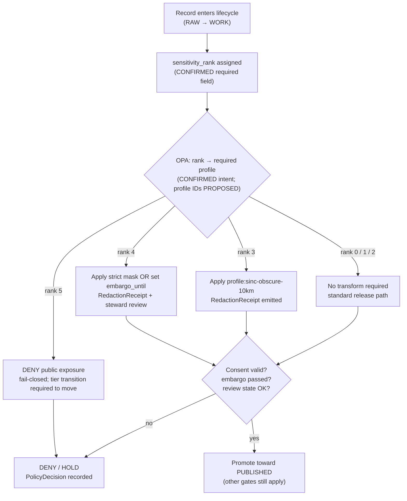
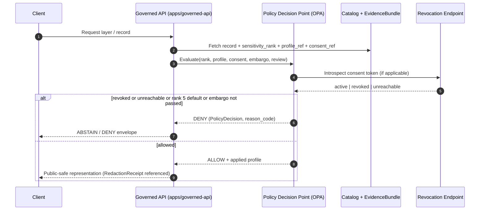

<!-- [KFM_META_BLOCK_V2]
doc_id: kfm://doc/sensitivity-rubric
title: KFM Sensitivity Rubric (0–5)
type: standard
version: v1
status: draft
owners: <TODO: privacy steward + sensitive-lane subsystem owners>
created: 2026-05-14
updated: 2026-05-14
policy_label: public
related:
  - docs/doctrine/directory-rules.md
  - docs/doctrine/truth-posture.md
  - docs/doctrine/lifecycle-law.md
  - docs/standards/REDACTION_DETERMINISM.md      # PROPOSED, not yet authored
  - docs/standards/DP_BUDGETS.md                  # PROPOSED, not yet authored
  - docs/standards/CONSENT_TOKENS.md              # PROPOSED, not yet authored
  - docs/policy/living_persons_geoprivacy.md      # PROPOSED, not yet authored
  - docs/runbooks/revocation.md                   # PROPOSED, not yet authored
  - policy/redaction/profiles.yaml                # PROPOSED placement
  - schemas/contracts/v1/                         # canonical schema home (ADR-0001)
tags: [kfm, sensitivity, redaction, geoprivacy, policy, c6]
notes:
  - Rubric levels 0–5 are CONFIRMED doctrine (Pass 10 §6.6, C6-01).
  - T0–T4 release-tier scheme is PROPOSED (Atlas v1.1 §24.5.1).
  - Profile catalog path and specific profile IDs are PROPOSED until verified.
[/KFM_META_BLOCK_V2] -->

# KFM Sensitivity Rubric (0–5)

The canonical six-level scale (`sensitivity_rank` 0–5) that every record carries, the redaction obligations each rank implies, and the gates that enforce them.

<!-- Badges: replace TODO targets once CI, policy bundle, and version registry are confirmed. -->


> **Status:** draft  ·  **Owners:** _TODO — privacy steward + sensitive-lane subsystem owners_  ·  **Last reviewed:** 2026-05-14
>
> The **rubric levels themselves** (0–5, level meanings, fail-closed at rank 5) are **CONFIRMED** doctrine drawn from the Pass 10 dossier (C6-01). The **release-tier scheme T0–T4** that this rubric maps onto is **PROPOSED** per Atlas v1.1 §24.5.1. Specific **paths**, **profile IDs**, **k thresholds**, **cell sizes**, and **validator names** below are **PROPOSED** or **NEEDS VERIFICATION** until checked against the live repository.

---

## Contents

1. [Purpose](#1-purpose)
2. [Authority and scope](#2-authority-and-scope)
3. [The rubric in one table](#3-the-rubric-in-one-table)
4. [How a rank becomes a publication outcome](#4-how-a-rank-becomes-a-publication-outcome)
5. [Rank-by-rank reference](#5-rank-by-rank-reference)
6. [Named redaction profiles (C6-02)](#6-named-redaction-profiles-c6-02)
7. [Determinism, geoprivacy, and DP scope](#7-determinism-geoprivacy-and-dp-scope)
8. [k-anonymity for living-people overlays (C6-06)](#8-k-anonymity-for-living-people-overlays-c6-06)
9. [Consent, embargo, and revocation (C6-07, C6-08)](#9-consent-embargo-and-revocation-c6-07-c6-08)
10. [Cross-domain extension](#10-cross-domain-extension)
11. [Relationship to the T0–T4 release-tier scheme](#11-relationship-to-the-t0t4-release-tier-scheme)
12. [Where the rank lives in the data model](#12-where-the-rank-lives-in-the-data-model)
13. [Enforcement, validators, and gates](#13-enforcement-validators-and-gates)
14. [Open questions and verification backlog](#14-open-questions-and-verification-backlog)
15. [Glossary](#15-glossary)
16. [Related documents](#16-related-documents)

---

## 1. Purpose

KFM publishes only the safest representation that still answers the steward's and the public's reasonable needs. The **Sensitivity Rubric** is the fixed, six-level scale that turns "this record might be sensitive" from an ad-hoc judgement into a reviewable, machine-checkable obligation. Every record carries a `sensitivity_rank` in `0..5`. Every rank maps to a default redaction posture. Every gate enforces that mapping.

Without a fixed rubric, redaction decisions drift; with it, every record has an unambiguous obligation that policy gates can enforce and that receipts can prove was honored. *(CONFIRMED — Pass 10 dossier §6.6, C6-01.)*

> [!IMPORTANT]
> The rubric is **necessary but not sufficient**. A rank of `0` does not authorize public release on its own — rights status, review state, evidence resolution, and release closure are independent gates. The rubric controls *sensitivity*, not the rest of the trust membrane.

---

## 2. Authority and scope

| Aspect | Authority |
|---|---|
| Rubric existence and level meanings | **CONFIRMED** — Pass 10 §6.6 (C6-01); reiterated across the Deny-by-Default Register (`kfm_encyclopedia.pdf` §13) and Atlas v1.1 §24.5 |
| `sensitivity_rank` as a required field on every node | **CONFIRMED** — C6-01 normalized statement |
| Default redaction profile at rank 3 | **CONFIRMED** name (`profile:sinc-obscure-10km`); **PROPOSED** parameters and versioning |
| Fail-closed default at rank 5 | **CONFIRMED** — C6-01 |
| Mapping rank → named profile via OPA | **CONFIRMED** intent — C6-01 dependencies |
| Cross-domain extension (people, archaeology, infrastructure) | **PROPOSED** — C6-01 Open Question |
| Profile catalog path `policy/redaction/profiles.yaml` | **PROPOSED** — C6-02 dependencies; **NEEDS VERIFICATION** against mounted repo |
| Schema home for sensitivity-bearing receipts | `schemas/contracts/v1/...` per ADR-0001 (**CONFIRMED** rule; **PROPOSED** specific path) |
| Tier scheme T0–T4 used downstream | **PROPOSED** — Atlas v1.1 §24.5.1 |

> [!NOTE]
> This document is a **standard** under `docs/standards/`, not a router or registry. It defines *what the levels mean* and *what redaction posture each implies*. The machine-readable profile catalog, the OPA bundle, and the validators that enforce this rubric live elsewhere (see §13).

---

## 3. The rubric in one table

| `sensitivity_rank` | Level name | Default posture | Default profile | Public map / timeline exposure |
|:--:|---|---|---|---|
| **0** | Public / open | Allow with standard release | `kfm:redact:none` *(PROPOSED id)* | Permitted at exact precision |
| **1** | Common, non-sensitive | Allow with standard release | `kfm:redact:none` *(PROPOSED id)* | Permitted at exact precision |
| **2** | Watchlist | Allow with reviewer notice; no redaction by default | `kfm:redact:none` + review flag *(PROPOSED)* | Permitted; flagged for periodic re-review |
| **3** | SINC / locally sensitive | Generalize before public release | `profile:sinc-obscure-10km` *(CONFIRMED name; PROPOSED params)* | Permitted **only after** receipted generalization |
| **4** | Threatened / rare | Strict mask **or** embargo | Strict mask profile *(PROPOSED — e.g., `point_10km_hex_seeded_v1` or stricter)* | Permitted only via strict mask + steward review; embargo if review pending |
| **5** | Sacred / critical | **Fail-closed** | None — no transform releases this to public surface | **Not permitted** under any default profile |

> [!WARNING]
> **Rank 5 is fail-closed by default.** No public map layer, no public timeline, no governed-AI surface may expose a rank-5 record. Movement off rank 5 requires an explicit, authorized policy decision and review record, recorded as a tier transition (see §11). Treat "rank 5 with no review" as a hard DENY.

*(Rank meanings: CONFIRMED — Pass 10 §6.6 C6-01. Profile IDs and parameters: PROPOSED — C6-02; NEEDS VERIFICATION against `policy/redaction/profiles.yaml`.)*

---

## 4. How a rank becomes a publication outcome

The rank is a *property of the record*. The publication outcome is *decided by a gate* that looks at the rank, the configured profile, the consent posture, the embargo state, and the review state.



*(Diagram: CONFIRMED rubric logic. The exact gate names map to the Gate Matrix A–G in C5-01 — see §13.)*

---

## 5. Rank-by-rank reference

### 5.1 Rank 0 — Public / open

- **Meaning.** No sensitivity obligation. Examples include public-domain geographies, regulatory boundaries, climate normals, and other reference data already in the public record.
- **Default profile.** None (`kfm:redact:none`, PROPOSED identifier).
- **Public map / timeline.** Permitted at exact precision.
- **Required receipts.** `PolicyDecision` recording the rank assignment; no `RedactionReceipt` required.
- **Misuse pattern.** Treating "no redaction needed" as "no governance needed." Rank 0 still passes through every other gate — identity, evidence resolution, rights, release closure.

### 5.2 Rank 1 — Common, non-sensitive

- **Meaning.** Common species, common cultural references, common settlement features. No mask required, but the record is *labeled* so future re-classification is mechanical.
- **Default profile.** `kfm:redact:none` *(PROPOSED id)*.
- **Public map / timeline.** Permitted at exact precision.
- **Drift watch.** Periodic re-scan against authority lists (e.g., KDWP SINC for taxa) so demotions from rank 1 to a higher rank trigger automatically.

### 5.3 Rank 2 — Watchlist

- **Meaning.** Not currently sensitive but under steward observation. The record is published but flagged in registers for review.
- **Default profile.** `kfm:redact:none` plus a reviewer flag.
- **Required receipts.** `ReviewRecord` with review cadence note.
- **Why this rank exists.** It catches species, sites, or person classes that are *trending toward* sensitivity but have not crossed it — and avoids the all-or-nothing trap of jumping straight from 1 to 3.

### 5.4 Rank 3 — SINC / locally sensitive

- **Meaning.** Species **In Need of Conservation**, locally-sensitive cultural materials, infrastructure assets whose exact location adds harm risk without adding meaningful public value. The bulk of the rubric's day-to-day work happens here.
- **Default profile.** `profile:sinc-obscure-10km` — **CONFIRMED** as the named default; specific parameters and current `@v1` are **PROPOSED**.
- **Public map / timeline.** Permitted *only after* the named profile is applied and a `RedactionReceipt` is emitted.
- **Required receipts.** `RedactionReceipt` + `PolicyDecision` + (for sensitive lanes) `ReviewRecord`.
- **Failure mode.** A rank-3 record published without a `RedactionReceipt` is a hard policy violation; the release gate must fail closed.

### 5.5 Rank 4 — Threatened / rare

- **Meaning.** Federally or state-listed threatened/endangered species; rare-plant locations; archaeology with active looting risk; sensitive nests/dens/roosts/hibernacula/spawning sites; living-person fields with elevated re-identification risk.
- **Default posture.** Strict mask **or** embargo. The two are not equivalent — strict mask publishes a generalized form; embargo withholds entirely until `embargo_until` passes.
- **Default profile.** Strict mask — **PROPOSED** id (e.g., `point_10km_hex_seeded_v1` or a profile with a larger cell/radius and an explicit `embargo_until` window).
- **Required receipts.** `RedactionReceipt` + `ReviewRecord` + `PolicyDecision`. If embargoed, `embargo_until` is part of the receipt; the gate denies regardless of other approvals while `now < embargo_until`.
- **Public AI surface.** Governed-AI answers may cite rank-4 records *only via* released EvidenceBundle representations — never via raw rank-4 content.

### 5.6 Rank 5 — Sacred / critical

- **Meaning.** Sacred sites; human remains; raw DNA segment data; critical-infrastructure detail whose exposure creates harm; any record where steward and rights-holder review establishes that no public representation is appropriate by default.
- **Default posture.** **Fail-closed.** No map exposure. No timeline exposure. No governed-AI answer that synthesizes from rank-5 content.
- **Default profile.** *None applies* — there is no public-safe transform of a rank-5 record without an explicit, authorized tier transition (see §11).
- **Movement off rank 5.** Requires `PolicyDecision` + `ReviewRecord` + (where applicable) sovereignty review + named authorization. The transition is **reversible**: revocation of the agreement returns the object to rank 5 (T4) via `CorrectionNotice`.
- **Existence disclosure.** Even acknowledging that a rank-5 record *exists* is itself a steward decision, not a default.

> [!CAUTION]
> The default behavior at rank 5 is **DENY at every public surface, every time.** Any code path that would expose rank-5 content without an explicit, receipted, reviewed transition is a defect — and should be detected by negative-state fixtures in the validator suite, not just by code review.

---

## 6. Named redaction profiles (C6-02)

Profiles let policy reference a redaction by **stable identifier**, not by inline parameters. A profile pins the strategy, the parameters, the seeding rule, and any embargo. Changes to a profile are breaking changes for any record produced under the old profile, so **profile versioning is strict**. *(CONFIRMED — C6-02.)*

### 6.1 Canonical profile families

| Family | Strategy | Typical use | Determinism source |
|---|---|---|---|
| `kfm:redact:none` | No transform | Rank 0 / 1 | n/a |
| Radius mask | Replace point with N-meter mask centered on a generalized origin | Strict suppression at rank 4 | Seeded by `spec_hash + occurrence_id` |
| Grid generalization | Snap to square (`ST_SnapToGrid`) or H3 hex cell | SINC species; broad biodiversity occurrences | Stable H3 indexing |
| Seeded jitter | Offset within radius using PRNG seeded by record id | Display-only obfuscation | `spec_hash + occurrence_id` PRNG seed |
| Centroid | Replace geometry with class centroid (e.g., 1 km cell centroid) | Coarse public layer | Cell math |
| DP aggregate | epsilon-delta noise on counts/heatmaps only | Public aggregate layers | Library-determined noise; epsilon recorded |
| Time-bucket | Round timestamps to coarser bucket | Combined with spatial generalization for additional protection | Bucket math |

*(Strategies and family list: CONFIRMED — C6-02 through C6-05. Family names above are descriptive; canonical IDs live in the profile catalog.)*

### 6.2 Illustrative profile catalog entry

The catalog lives under `policy/redaction/profiles.yaml` (**PROPOSED** path per C6-02 dependencies; **NEEDS VERIFICATION** against mounted repo). The following is **illustrative**, not a live snippet:

```yaml
# Illustrative only — names and parameters PROPOSED per C6-02.
- id: profile:sinc-obscure-10km@v1
  strategy: grid_hex
  parameters:
    indexer: h3
    resolution: 5            # ~8.5 km edge, ~250 sq km cell — PROPOSED
  seeding: none              # grids are deterministic without a seed
  satisfies_ranks: [3]
  embargo: none
  verifier: tools/validators/redaction/verify_profile_sinc.py   # PROPOSED path

- id: point_3km_jitter_v1
  strategy: seeded_jitter
  parameters:
    radius_m: 3000
    distribution: uniform
  seeding: "sha256(spec_hash + ':' + occurrence_id)"
  satisfies_ranks: [3]
  embargo: none

- id: point_10km_hex_seeded_v1
  strategy: grid_hex_plus_seeded_offset
  parameters:
    indexer: h3
    resolution: 4            # coarser cell — PROPOSED
    inner_jitter_m: 0
  seeding: "sha256(spec_hash + ':' + occurrence_id)"
  satisfies_ranks: [3, 4]
  embargo: optional

- id: centroid_1km_v1
  strategy: centroid
  parameters:
    cell_m: 1000
  seeding: none
  satisfies_ranks: [3, 4]
  embargo: optional

- id: kfm:redact:none
  strategy: none
  satisfies_ranks: [0, 1, 2]
```

> [!TIP]
> **Why profiles, not inline parameters.** A named profile is a single thing that appears in policy, in the catalog record, and in the receipt. When a profile changes, every record that referenced the prior version is visible in `git diff`. Inline parameters scatter; profiles localize.

### 6.3 Rank → required profile (default mapping)

This is the **default** mapping that the OPA bundle should encode. Domains may override via per-domain rules layered on top (see §10).

| Rank | Allowed profiles (default) | DENY on missing profile? |
|:--:|---|:--:|
| 0 | `kfm:redact:none` | n/a |
| 1 | `kfm:redact:none` | n/a |
| 2 | `kfm:redact:none` + review flag | n/a |
| 3 | `profile:sinc-obscure-10km@v1` (default); `point_3km_jitter_v1`; grid profiles satisfying `satisfies_ranks: [3]` | **Yes** |
| 4 | Strict mask family: `point_10km_hex_seeded_v1`, `centroid_1km_v1`, or stricter; or `embargo_until` | **Yes** |
| 5 | *None apply by default — requires explicit tier transition (§11)* | **Yes — fail-closed** |

*(Mapping intent: CONFIRMED — C6-01 dependencies "OPA rules that map rank to required profile." Specific profile names: PROPOSED — C6-02.)*

---

## 7. Determinism, geoprivacy, and DP scope

Two principles bound how redaction is implemented across the rubric:

1. **Determinism is mandatory.** A reviewer must be able to reproduce the published geometry from the receipt's parameters. This rules out random-each-render jitter, which would also enable temporal triangulation across snapshots.
2. **Differential privacy is for aggregates only.** Raw points are *never* DP-noised. DP applies to counts and heatmaps where the math holds. *(CONFIRMED — C6-05; per NIST SP 800-226 framing cited in the dossier.)*

### 7.1 Deterministic seeded jitter (C6-03)

| Aspect | Rule |
|---|---|
| PRNG seed | `sha256(spec_hash + ':' + occurrence_id)` *(PROPOSED concatenation rule; documented in `docs/standards/REDACTION_DETERMINISM.md` — not yet authored)* |
| Distribution | Uniform within radius (default); Laplace permitted but does **not** confer DP guarantees |
| Reproducibility | Same record → same offset across renders, machines, and runs |
| Leak risk | If `occurrence_id` is leaked, the seed is guessable; jitter alone never substitutes for actual obfuscation |
| Open question | Should the seed be salted with a server-side secret to prevent third-party reproduction? *(C6-03 open question)* |

### 7.2 Grid generalization (C6-04)

- **Square grids** via PostGIS `ST_SnapToGrid`.
- **Hex grids** via H3 — **recommended default** for hex because H3 has stable, reproducible indexing.
- **Tension** *(CONFIRMED — C6-04)*: cells reveal density; in low-density regions, even a coarse cell may narrow location significantly. The fallback is a larger cell or a centroid.
- **Open question** *(C6-04)*: what is the right cell size for KDWP SINC species, and does it vary by county density?

### 7.3 Differential privacy (C6-05)

- DP applies to **aggregate outputs only** — counts, heatmaps, county-year roll-ups.
- DP parameters (`epsilon`, `delta`) are **recorded in receipts**.
- A separate document defines budgets: `docs/standards/DP_BUDGETS.md` *(PROPOSED — not yet authored, per C6-05)*.

> [!NOTE]
> DP applied to raw points produces noise that can be undone or that misleads users. DP applied to counts produces formally bounded leakage. The rubric uses each tool in the regime where its math is honest.

---

## 8. k-anonymity for living-people overlays (C6-06)

Living-people overlays render at a cell **only when at least `k` individuals** fall in that cell. If `k` is not met, a server-side fallback radius mask is applied. The decision is made by the PDP and recorded in audit. *(CONFIRMED — C6-06.)*

| Knob | Default *(PROPOSED — C6-06)* | Notes |
|---|---|---|
| Profile id | `density_k_anonymity_grid` | PROPOSED canonical name |
| `k` | `10` | Open question: should `k` scale with population density? |
| `cell_m` | `500` | Tune per density tier |
| Fallback | `radius_mask` at `250 m` | Server-side; never client-side |
| Render-time check | OPA gate: valid JWT, embargo passed, consent unrevoked, scopes match, **and** (k met OR fallback applied) | Fail-closed on any failure |

> [!IMPORTANT]
> **k-anonymity does not protect against linkage attacks** across multiple datasets. It must be combined with consent enforcement (§9), access controls, and reviewer-tier release (T2 / T3) for higher-risk slices. *(CONFIRMED limitation — C6-06.)*

The canonical write-up for living-people geoprivacy is `docs/policy/living_persons_geoprivacy.md` *(PROPOSED — not yet authored, per C6-06)*.

---

## 9. Consent, embargo, and revocation (C6-07, C6-08)

The rubric assumes three time-bound controls layered on top of rank:

1. **Consent tokens** *(C6-07)* — compact signed tokens (JWT or GA4GH visa) carrying scopes, audience, expiry, `revocation_endpoint`, `consent_history_hash`, and a `redaction_profile` reference. The PDP introspects the token's revocation endpoint on every render and **fails closed** when introspection cannot be completed. Canonical write-up: `docs/standards/CONSENT_TOKENS.md` *(PROPOSED)*.
2. **Embargo** *(C6-08)* — `embargo_until` field on the record/release. While `now < embargo_until`, the gate denies regardless of other approvals.
3. **Revocation + cache invalidation** *(C6-08)* — revocation issues a signed **tombstone**, appends a new `spec_hash` and `RunReceipt`, and triggers invalidation hooks (PMTiles index bump, tile-server purge). Without invalidation, previously rendered tiles can leak retracted content. The runbook lives at `docs/runbooks/revocation.md` *(PROPOSED — not yet authored, per C6-08)*.



*(Sequence: CONFIRMED at the level of "PDP introspects revocation on every render and fails closed" — C6-07, C6-08. Exact route names and DTOs are PROPOSED — NEEDS VERIFICATION against the live `apps/governed-api/` surface.)*

> [!WARNING]
> **If the revocation endpoint is unreachable** for an extended window, rendering must fail closed even if it inconveniences users. This is a CONFIRMED limitation/principle from C6-08.

---

## 10. Cross-domain extension

The rubric was developed with **biodiversity** in mind (KDWP SINC species classification drove the original C6-01 design). Extending it to **people**, **archaeology**, and **infrastructure** is an open architectural question. *(CONFIRMED tension — C6-01.)*

Two patterns are on the table; the dossier suggests adopting the second.

| Pattern | Description | Status |
|---|---|---|
| Domain-specific rubrics | Separate 0–5 rubrics per domain (biodiversity, people, archaeology, infrastructure) | **Rejected by default** — increases drift surface, complicates joins |
| **One rubric + domain rules** | Single 0–5 rubric, with per-domain rules layered on the **rank → profile mapping** | **Suggested future work** *(C6-01)*; **PROPOSED** here |

### 10.1 Domain mapping examples

The following examples are **PROPOSED** and align with the Deny-by-Default Register in `kfm_encyclopedia.pdf` §13 and Atlas v1.1 §24.5.2:

| Domain / object class | Suggested default rank | Suggested default profile | Notes |
|---|:--:|---|---|
| Fauna — sensitive occurrence (KDWP SINC) | **3** | `profile:sinc-obscure-10km` | Canonical case |
| Fauna — threatened / rare (federal or state listed) | **4** | strict mask or embargo | `RedactionReceipt` + `ReviewRecord` |
| Fauna — common species | **1** | none | |
| Fauna — range polygon (aggregate) | **1** | aggregate generalization | `AggregationReceipt` |
| Flora — rare / culturally sensitive plant location | **4** | generalized geometry + steward review | |
| Archaeology — site coordinate | **4** | generalized geometry (coarse cell) + cultural review | |
| Archaeology — human remains / sacred site | **5** | none (fail-closed) | Movement only via T4 → T3 with named authorization |
| People — living-person field | **4** | aggregation by tract/county + k-anonymity | Never published as exact identifying output by default |
| People — raw DNA segment | **5** | none (fail-closed) | T3 only under explicit research agreement |
| People — historical person assertion (deceased, public-record) | **1** | none | Standard genealogical practice |
| Infrastructure — critical asset detail | **4** / **5** | generalized footprint or denied | Condition / vulnerability stays restricted |
| Hydrology, soil, climate normals, regulatory zones | **0** | none | Reference data |

> [!NOTE]
> These mappings are starting points, not freezes. Each domain SHOULD adopt a domain-specific rule set under `policy/sensitivity/<domain>/` *(PROPOSED path)* and the choices SHOULD be cited in the relevant domain dossier under `docs/domains/<domain>/`.

---

## 11. Relationship to the T0–T4 release-tier scheme

The rubric describes a **property of the record**: how sensitive is this thing? Atlas v1.1 §24.5.1 introduces a complementary **release-tier scheme T0–T4** that describes how the record may be **published**. The two are distinct and intentionally so.

| Concept | What it describes | Scope | Status |
|---|---|---|---|
| `sensitivity_rank` 0–5 (this document) | Intrinsic sensitivity of the record | Every node in the catalog and evidence graph | **CONFIRMED** (rubric) |
| Tier T0–T4 | The publication state of a derivative for a given audience | Per published derivative / per audience | **PROPOSED** (Atlas v1.1 §24.5.1) |

### 11.1 Default rank → default tier (illustrative)

The rubric does not dictate tier on its own; review state, rights, and policy decision do. The table below shows the **typical** default a derivative settles into when the only signal is the rank:

| Rank | Typical default tier *(PROPOSED, Atlas v1.1 §24.5.2)* | Comment |
|:--:|:--:|---|
| 0, 1 | **T0** | Open public release |
| 2 | **T0** with reviewer flag | Watchlist; periodic re-review |
| 3 | **T1** after redaction (Generalized) | `RedactionReceipt` required |
| 4 | **T4** by default; **T1** only after generalization + review | Strict mask or embargo |
| 5 | **T4** by default; **T3** only under named authorization | Movement requires `PolicyDecision` + `ReviewRecord` + (where applicable) sovereignty review |

### 11.2 Tier transition semantics

Tier transitions follow Atlas v1.1 §24.5.3. The rubric **anchors** these transitions:

- **Upgrades** (toward more public) always require *both* a transform receipt **and** a review record.
- **Downgrades** (toward less public) require only a `CorrectionNotice` + `ReviewRecord` — correction alone is sufficient to remove or restrict.
- **All transitions are reversible.** Revocation of the underlying agreement returns the object to its default tier with a `CorrectionNotice`.

*(Tier scheme PROPOSED — Atlas v1.1 §24.5; ADR-S-05 is the proposed ADR that would adopt or revise T0–T4 as canonical.)*

---

## 12. Where the rank lives in the data model

`sensitivity_rank` is required on every node and is persisted in **catalog records** and **EvidenceBundles**. *(CONFIRMED — C6-01.)*

| Carrier | Field | Required? | Source authority |
|---|---|:--:|---|
| `SourceDescriptor` | `sensitivity` (rank + optional profile hint) | **Yes** | Set at source admission *(CONFIRMED — Atlas v1.0 §20.5, Pass 10 §13)* |
| Catalog record | `sensitivity_rank`, `redaction_profile_ref`, `embargo_until?` | **Yes** | Set during normalization; updated by promotion |
| `EvidenceBundle` | `sensitivity_rank` (mirrors the record); applied-profile reference if redacted | **Yes** | Persisted by the resolver |
| `RedactionReceipt` | `policy_ref`, `redaction_method`, `kept_fields`, `removed_fields`, `geometry_transform`, `reviewer` | **Yes when applied** | Atlas v1.1 §24.x Receipt table *(CONFIRMED structure; PROPOSED exact fields)* |
| `PolicyDecision` | `policy_id`, `target_object`, `decision`, `reason_code`, `evidence_refs[]` | **Always** | Atlas v1.1 receipt reference |
| `ReviewRecord` | `reviewer`, `role`, `decision`, `evidence_refs[]`, `policy_ref` | **When required by rank ≥ 3** | Atlas v1.1 receipt reference |

The **schema home** for these receipts is `schemas/contracts/v1/...` per **ADR-0001** (CONFIRMED rule; specific paths PROPOSED until verified). Receipt-class layout (single home vs. per-domain) is the subject of **ADR-S-03** *(Atlas v1.1 §24.12, open backlog)*.

---

## 13. Enforcement, validators, and gates

The rubric is enforced by **policy-as-code** with **CI / runtime parity** (C5-03), via the Gate Matrix A–G *(C5-01, CONFIRMED)*.

### 13.1 Where in the gate matrix

| Gate (C5-01) | Touches the rubric? | How |
|:--:|:--:|---|
| A — Identity | indirectly | `sensitivity_rank` is part of the persisted identity surface |
| B — Anchors | no | |
| C — Integrity | indirectly | `spec_hash` includes rank; rank drift rotates hash |
| **D — Sensitivity** | **yes** | The gate that maps `sensitivity_rank` → required profile, fails closed at rank 5 by default, checks `RedactionReceipt` presence and `embargo_until` |
| E — Lineage | indirectly | `RedactionReceipt` lineage must trace to source |
| F — Signing | no | |
| G — Release | indirectly | Release closure checks that gate D has been satisfied |

*(Gate matrix labels are CONFIRMED; the exact role of "D" in the matrix is INFERRED here from Pass 10 §6.5 — NEEDS VERIFICATION against the OPA bundle in the live `policy/` tree.)*

### 13.2 Required negative-state fixtures

Per the directory-rules.md "validator must exercise DENY/ABSTAIN/ERROR paths" convention, the sensitivity rubric needs at least one fixture for each of the following negative states *(PROPOSED set)*:

- Rank 3 record published without a `RedactionReceipt` → **DENY**
- Rank 4 record published with `embargo_until` in the future → **DENY**
- Rank 5 record reaching a public surface → **DENY** (fail-closed; treat as defect, not as a runtime question)
- Rank 4/5 record promoted with consent token whose revocation endpoint is unreachable → **DENY**
- Living-people overlay rendered at a cell where `k < k_threshold` and fallback not applied → **DENY**
- Profile change without ADR/version bump → **DENY** at CI

### 13.3 Suggested validators *(PROPOSED placement)*

- `tools/validators/sensitivity/validate_rank_field.py` — every catalog record carries `sensitivity_rank ∈ {0..5}`.
- `tools/validators/redaction/verify_profile_<id>.py` — re-run the profile transform from the receipt and check determinism.
- `tools/validators/policy/sensitivity_gate.py` — enforce the rank → required profile mapping against fixtures.
- `tools/validators/release/sensitivity_release_closure.py` — assert gate D satisfied before any tier ≥ T1 transition.

*(All paths PROPOSED; NEEDS VERIFICATION against the mounted repo.)*

> [!IMPORTANT]
> CI and runtime MUST use the **same OPA bundle** (CONFIRMED — C5-03). The rubric's promise of "every published record has its profile actually applied" rests on this parity. A separate validator suite for CI vs. runtime is a doctrine violation.

---

## 14. Open questions and verification backlog

Tracked items that this document does **not** resolve and that belong in `docs/registers/VERIFICATION_BACKLOG.md`:

<details>
<summary><b>Click to expand: open questions and pending verifications</b></summary>

| # | Open question / verification | Source | Status |
|---|---|---|---|
| Q1 | Should there be domain-specific 0–5 rubrics, or one rubric with domain rules layered on top? | C6-01 | **OPEN** — this document recommends one rubric + domain rules |
| Q2 | Mapping the rubric to people, archaeology, infrastructure beyond the §10 starting points | C6-01 | **OPEN** |
| Q3 | Should profile versions be major-only (breaking) or also include patch (documentation fixes)? | C6-02 | **OPEN** |
| Q4 | What is the right cell size for KDWP SINC species, and does it vary by county density? | C6-04 | **OPEN** |
| Q5 | Should jitter seeds be salted with a server-side secret to prevent third-party reproduction of jittered points? | C6-03 | **OPEN** |
| Q6 | Are there DP budgets that must span datasets (cumulative leakage across heatmap views)? | C6-05 | **OPEN** |
| Q7 | Is `k=10` the right default, or should it scale with population density? | C6-06 | **OPEN** |
| Q8 | Cache TTL for revocation introspection results | C6-07 | **OPEN** |
| Q9 | Where is the boundary between tombstone and erasure for personal data (right-to-be-forgotten interaction)? | C5-09 / C6-08 | **OPEN** — align with GDPR and applicable Tribal data policies |
| V1 | Confirm `policy/redaction/profiles.yaml` exists and matches the catalog convention in §6.2 | C6-02 dependencies | **NEEDS VERIFICATION** |
| V2 | Confirm the specific profile IDs (`profile:sinc-obscure-10km@v1`, `point_10km_hex_seeded_v1`, `point_3km_jitter_v1`, `centroid_1km_v1`) are present and unchanged | C6-02 | **NEEDS VERIFICATION** |
| V3 | Confirm the OPA bundle implements gate D as described in §13.1 | C5-01, C6-01 | **NEEDS VERIFICATION** |
| V4 | Confirm the receipt schemas at `schemas/contracts/v1/receipts/` carry the fields in §12 | Atlas v1.1 §24.x | **NEEDS VERIFICATION** (also ADR-S-03) |
| V5 | Confirm ADR-S-05 (adopt or revise T0–T4 as canonical) is opened | Atlas v1.1 §24.12 | **NEEDS VERIFICATION** |
| V6 | Confirm presence of accompanying `docs/standards/REDACTION_DETERMINISM.md`, `docs/standards/DP_BUDGETS.md`, `docs/standards/CONSENT_TOKENS.md`, `docs/policy/living_persons_geoprivacy.md`, `docs/runbooks/revocation.md` | C6-03..C6-08 | **NEEDS VERIFICATION** (all PROPOSED — not yet authored per the dossier) |

</details>

---

## 15. Glossary

| Term | Definition relevant to this document |
|---|---|
| **sensitivity_rank** | Integer 0–5 stamped on every node; the **intrinsic** sensitivity property |
| **Redaction profile** | Named, versioned transform (strategy + parameters + seeding + embargo) referenced by stable id |
| **Profile catalog** | `policy/redaction/profiles.yaml` *(PROPOSED)* — the single home for profile definitions |
| **`profile:sinc-obscure-10km`** | Default profile for rank 3 (CONFIRMED name; PROPOSED parameters) |
| **SINC** | Species In Need of Conservation (KDWP) — the regulatory category that motivates rank 3 |
| **Strict mask** | Radius-mask or coarse-cell profile applied at rank 4 |
| **Fail-closed** | Default DENY in absence of an explicit allow rule; the runtime posture at rank 5 |
| **Embargo** | `embargo_until` timestamp; while `now < embargo_until`, gates deny regardless of other approvals |
| **Tombstone** | Signed marker replacing revoked content; appends new `spec_hash` and `RunReceipt`; triggers cache invalidation |
| **k-anonymity** | Rendering rule: living-people cell renders only if ≥ k individuals fall in it; fallback radius mask otherwise |
| **DP** | Differential privacy; applies to aggregates only, never to raw points |
| **Tier (T0–T4)** | PROPOSED release-tier scheme for the **publication state** of a derivative; distinct from `sensitivity_rank` |
| **Gate D** | INFERRED label for the sensitivity gate in the C5-01 Gate Matrix A–G |
| **RedactionReceipt / PolicyDecision / ReviewRecord** | Receipts emitted when a sensitive record is generalized, decided on, or reviewed — see Atlas v1.1 §24.x and `schemas/contracts/v1/...` |

---

## 16. Related documents

- `docs/doctrine/directory-rules.md` — placement law for sensitivity-related files
- `docs/doctrine/truth-posture.md` — cite-or-abstain default
- `docs/doctrine/lifecycle-law.md` — RAW → WORK/QUARANTINE → PROCESSED → CATALOG/TRIPLET → PUBLISHED
- `docs/standards/REDACTION_DETERMINISM.md` *(PROPOSED — not yet authored, per C6-03)*
- `docs/standards/DP_BUDGETS.md` *(PROPOSED — not yet authored, per C6-05)*
- `docs/standards/CONSENT_TOKENS.md` *(PROPOSED — not yet authored, per C6-07)*
- `docs/policy/living_persons_geoprivacy.md` *(PROPOSED — not yet authored, per C6-06)*
- `docs/runbooks/revocation.md` *(PROPOSED — not yet authored, per C6-08)*
- `policy/redaction/profiles.yaml` *(PROPOSED path — NEEDS VERIFICATION)*
- `schemas/contracts/v1/...` — receipt schema home (ADR-0001)
- Pass 10 Idea Index, §6.6 (C6-01 through C6-08) — primary doctrinal source
- Atlas v1.1 §24.5 — release-tier scheme T0–T4 (PROPOSED)
- `kfm_encyclopedia.pdf` §13 — Sensitive / Deny-by-Default Register

---

*Last updated: 2026-05-14*

[⬆ Back to top](#kfm-sensitivity-rubric-05)
