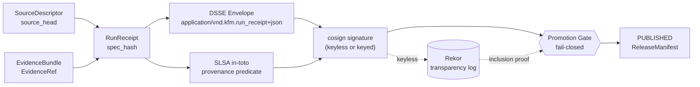

<!-- [KFM_META_BLOCK_V2]
doc_id: kfm://doc/standards/SIGNING
title: KFM Signing Standard — Receipts, Envelopes, Attestations
type: standard
version: v1
status: draft
owners: ["Docs steward", "Security/Signing steward (NEEDS VERIFICATION)"]
created: 2026-05-14
updated: 2026-05-14
policy_label: public
related: [
  "docs/standards/PROVENANCE.md",
  "docs/standards/CANONICALIZATION.md",
  "docs/doctrine/trust-membrane.md",
  "docs/doctrine/lifecycle-law.md",
  "docs/doctrine/directory-rules.md",
  "docs/architecture/contract-schema-policy-split.md",
  "docs/adr/ADR-0001-schema-home.md",
  "contracts/runtime/run_receipt.md",
  "schemas/contracts/v1/runtime/run_receipt.schema.json",
  "policy/promotion/",
  "tools/attest/",
  "tools/validators/attest/",
  "runbooks/key-rotation.md",
  ".github/workflows/promote.yml"
]
tags: ["kfm", "signing", "attestation", "dsse", "cosign", "sigstore", "slsa", "in-toto", "provenance", "fail-closed"]
notes: [
  "All path claims under tools/, schemas/, policy/, contracts/, .github/, and runbooks/ are PROPOSED until verified against mounted-repo evidence.",
  "Standard ratifies project doctrine accumulated in Pass 10 (C1-03, C1-04) and the Run Receipt & Attestation Pipeline notes."
]
[/KFM_META_BLOCK_V2] -->

<a id="top"></a>

# KFM Signing Standard

> Governed, fail-closed signing of receipts, envelopes, and provenance attestations across the KFM lifecycle. Cite-or-abstain. Verification fails closed. AI output is never sovereign truth.

<p align="center">
  
  
  
  
  
  
  
  
</p>

| Field | Value |
|---|---|
| **Status** | `draft` |
| **Owners** | Docs steward · Security/Signing steward _(NEEDS VERIFICATION)_ |
| **Last reviewed** | 2026-05-14 |
| **Authority class** | Standard — codifies how KFM applies external signing standards |
| **Supersedes** | Ad-hoc signing notes in Pass 10 (C1-03), Run Receipt & Attestation Pipeline draft |

---

## Quick Links

- [Purpose & Scope](#purpose--scope)
- [Trust Model Recap](#trust-model-recap)
- [What Gets Signed](#what-gets-signed)
- [Canonicalization](#canonicalization)
- [DSSE Envelope](#dsse-envelope)
- [Signing Modes](#signing-modes)
- [SLSA · in-toto Provenance](#slsa--in-toto-provenance)
- [Verification](#verification)
- [Promotion Gates](#promotion-gates)
- [Storage & Immutability](#storage--immutability)
- [CI Integration](#ci-integration)
- [Identity, Keys & Rotation](#identity-keys--rotation)
- [Negative Path Coverage](#negative-path-coverage)
- [Anti-Patterns](#anti-patterns)
- [Open Questions](#open-questions)
- [Related KFM Concepts](#related-kfm-concepts)
- [Related Docs](#related-docs)

---

> [!IMPORTANT]
> In KFM, **publication is a governed state transition, not a file move.** A published artifact MUST be reconstructable to its source state, policy decision, evidence lineage, integrity hashes, review posture, signing identity, and release intent. Signing exists to bind that chain; it does not replace it.

---

## Purpose & Scope

This standard defines how KFM **applies external signing standards** (DSSE, in-toto/SLSA, Sigstore/cosign, Rekor) to its trust-bearing objects — primarily `RunReceipt`, `PromotionDecision`, `ReleaseManifest`, and the SLSA-style provenance predicate.

It covers:

- which objects MUST be signed and in what envelope form;
- the canonicalization rules that make signatures meaningful;
- supported signing modes (keyless default, keyed fallback, offline) and their tradeoffs;
- verification steps that MUST be enforced at every promotion gate;
- storage, transparency-log, and immutability expectations;
- the failure modes that trigger `QUARANTINE` or `DENY`.

It does **not** cover:

- semantic meaning of the receipt fields → see `contracts/runtime/run_receipt.md` _(PROPOSED)_
- field-level shape → see `schemas/contracts/v1/runtime/run_receipt.schema.json` _(PROPOSED, ADR-0001)_
- admissibility / promotion policy → see `policy/promotion/` _(PROPOSED)_
- canonicalization algorithm choice → see `docs/standards/CANONICALIZATION.md` _(PROPOSED)_
- provenance predicate fields → see `docs/standards/PROVENANCE.md` _(PROPOSED)_
- rights & sensitivity gating → governed elsewhere in `policy/rights/` and `policy/sensitivity/`

> [!NOTE]
> Conformance language follows RFC 2119 (MUST / SHOULD / MAY) as established by `directory-rules.md` §2.2.

[⬆ Back to top](#top)

---

## Trust Model Recap

A signature in KFM does **not** assert that a claim is true. It asserts that a specific governed execution produced a specific bytes-level artifact under a specific identity, against a specific policy outcome.

### What a signed `RunReceipt` proves

- a particular source state was observed (`source_head`)
- a deterministic `spec_hash` was produced
- a specific runner identity executed the run (`runner_id`)
- policy evaluation occurred and produced an outcome (`decision_log`)
- evidence references were declared (`evidence_refs`)
- a rights posture was recorded (`license`)
- a promotion target was declared (`target_zone`)

### What a signed receipt does **NOT** prove

| Claim | Why a signature can't cover it |
|---|---|
| Factual correctness | A signature binds bytes to an identity, not bytes to reality. |
| Legal admissibility | Governed by rights, license, and jurisdictional review — not crypto. |
| Historical truth | Source authority and review state outrank generated language. |
| Scientific certainty | `EvidenceBundle` outranks any single attestation. |
| Public-safety suitability | Sensitivity, CARE, and steward review govern exposure. |

> [!CAUTION]
> A valid signature does **not** override missing evidence, unclear rights, unresolved provenance, sensitivity restrictions, or required cultural review. **`EvidenceBundle` outranks generated language.**

[⬆ Back to top](#top)

---

## What Gets Signed

KFM signs the **canonical envelope** of a trust-bearing object, never the convenience representation. Three families are in scope.

| Family | Object | Envelope | Required mode |
|---|---|---|---|
| Run evidence | `RunReceipt` | DSSE | cosign |
| Promotion | `PromotionDecision` | DSSE | cosign |
| Release | `ReleaseManifest` | DSSE | cosign |
| Supply-chain | SLSA in-toto predicate (`provenance.intoto.jsonl`) | in-toto Statement | `cosign attest --type slsaprovenance` |
| Correction | `CorrectionNotice` | DSSE | cosign _(PROPOSED)_ |
| Rollback | `RollbackCard` | DSSE | cosign _(PROPOSED)_ |

> [!NOTE]
> `EvidenceBundle` and `EvidenceRef` are **referenced by** signed objects (via `evidence_refs[]`), not themselves signed in this standard's scope. Their integrity is established through `spec_hash` parity, schema validation, and store-side immutability.

### Trust chain



> [!NOTE]
> The diagram reflects the doctrinal flow recorded in Pass 10 (C1-03, C1-04). The **NEEDS VERIFICATION** lines pertain to whether each emitter (e.g., `kfm_provgen`) actually exists in the mounted repo and to which workflow file invokes them.

[⬆ Back to top](#top)

---

## Canonicalization

A signature over non-canonical bytes is operationally useless: two semantically identical receipts MUST hash and verify identically. Canonicalization is therefore a hard precondition of signing.

### Rules (MUST)

- UTF-8 encoding, no BOM.
- Stable key ordering (lexicographic).
- No trailing whitespace.
- Compact separators.
- No floating-point ambiguity in numeric fields.
- Deterministic serialization.

### Reference

Recommended baseline serialization for JSON inputs to signing:

```python
json.dumps(obj, sort_keys=True, separators=(",", ":")).encode("utf-8")
```

> [!IMPORTANT]
> The canonical algorithm choice (RFC 8785 JCS vs URDNA2015 for graph documents) is **deferred to** [`docs/standards/CANONICALIZATION.md`](./CANONICALIZATION.md) _(PROPOSED)_. The `kfm-hash` CLI _(PROPOSED)_ is the authoritative `spec_hash` computer once published; ad-hoc hash recipes MUST NOT be used to gate promotion.

[⬆ Back to top](#top)

---

## DSSE Envelope

KFM wraps signed payloads in a [DSSE](https://github.com/secure-systems-lab/dsse) envelope (Dead Simple Signing Envelope). The receipt JSON is base64url-encoded as `payload`; the envelope carries the canonical `payloadType` and one or more signatures.

### Envelope shape

```json
{
  "payloadType": "application/vnd.kfm.run_receipt+json",
  "payload":     "<base64url of canonical run_receipt.json bytes>",
  "signatures": [
    {
      "keyid": "<key id, OIDC subject, or cert fingerprint>",
      "sig":   "<base64 signature>"
    }
  ]
}
```

### Reserved payload types

| Object | Payload type |
|---|---|
| `RunReceipt` | `application/vnd.kfm.run_receipt+json` |
| `PromotionDecision` | `application/vnd.kfm.promotion_decision+json` _(PROPOSED)_ |
| `ReleaseManifest` | `application/vnd.kfm.release_manifest+json` _(PROPOSED)_ |
| `CorrectionNotice` | `application/vnd.kfm.correction_notice+json` _(PROPOSED)_ |

> [!NOTE]
> Only `application/vnd.kfm.run_receipt+json` is grounded in current project doctrine (Pass 10, Run Receipt & Attestation Pipeline). Other media types are PROPOSED extensions and SHOULD be ratified before use.

[⬆ Back to top](#top)

---

## Signing Modes

KFM operates a **dual-mode policy**: keyless by default, keyed fallback when air-gapped or sovereignty-constrained.

| Mode | Status | Identity binding | Network req. at sign time | Use case |
|---|---|---|---|---|
| `cosign keyless` (Sigstore: OIDC + Fulcio + Rekor) | **preferred** | Workflow OIDC identity → Fulcio cert | YES (Fulcio + Rekor) | Standard CI runs on connected runners |
| `cosign keyed` (CI secret or HSM/KMS-backed key) | **supported** | Long-lived public key or KMS key handle | NO (signing); pubkey distribution required | Air-gapped, sovereignty, or pre-Sigstore environments |
| `offline signing` | **PROPOSED · NEEDS VERIFICATION** | Pinned key, no transparency log | NO | Disaster fallback; requires runbook + steward review |

### Keyless (preferred)

```bash
# Workflow OIDC identity issues a short-lived Fulcio cert; signature is logged to Rekor.
cosign sign-blob \
  --output-signature run_receipt.sig \
  --bundle run_receipt.bundle \
  envelope.json
```

Persist the **Rekor inclusion proof** and the cosign bundle next to `envelope.json`. The bundle digest (`sha256`) SHOULD be written back into the receipt's `attestations[]` entry:

```json
{ "type": "cosign", "bundle_digest": "sha256:..." }
```

### Keyed (fallback)

```bash
cosign sign-blob \
  --key "${COSIGN_KEY}" \
  --output-signature run_receipt.sig \
  envelope.json
```

Pubkey distribution is governed: verifiers MUST pin `cosign.pub` to a known, repo-tracked fingerprint. Out-of-band key delivery is not acceptable for promotion gates.

### Offline (proposed)

Reserved for true disaster fallback (e.g., Sigstore outage with no KMS reachable). Requires:

- a runbook entry in `runbooks/key-rotation.md` _(PROPOSED)_ covering offline activation;
- a steward sign-off persisted as a `decision_log` entry on the affected runs;
- mandatory re-signing or Rekor backfill once connectivity returns.

> [!WARNING]
> Offline mode is a **last resort**. It weakens auditability (no transparency log) and SHOULD NOT be the normal path for any public-tier release.

[⬆ Back to top](#top)

---

## SLSA · in-toto Provenance

A bare signature on a receipt binds bytes to an identity. A **SLSA-style in-toto predicate** additionally binds the artifact subject to its build platform, invocation, materials, and builder identity — answering the questions a bare signature cannot.

### Predicate emission

- Predicate format: SLSA Provenance v0.2+ (specific version pinned by emitter)
- File: `provenance.intoto.jsonl`
- Attestation: `cosign attest --predicate <file> --type slsaprovenance <subject>`

### Required predicate fields _(grounded in Pass 10 C1-04)_

| Field | Purpose |
|---|---|
| `builder.id` | Build platform identity (e.g., `github-actions://kfm/data-pipeline`) |
| `invocation.configSource.uri` | Repo URI |
| `invocation.configSource.digest.sha1` | Commit SHA at run time |
| `materials[]` | Inputs (receipt, source data references) |
| `subject[].digest.sha256` | Artifact digest |

### Emitter

> [!NOTE]
> The corpus references `kfm_provgen` as a **placeholder** emitter. A concrete choice (e.g., `slsa-github-generator` pinned by version in `infra/tool-versions.yaml`) is **OPEN** and SHOULD be resolved by ADR before SLSA gating goes live.

### SLSA level target

> [!IMPORTANT]
> **OPEN QUESTION:** Target SLSA level for KFM data runs (Level 1, 2, or 3) is not yet committed. Level 1 is feasible as a universal baseline; Level 3 requires hardened build platforms and meaningfully more expense. Track in `docs/registers/VERIFICATION_BACKLOG.md`.

[⬆ Back to top](#top)

---

## Verification

> [!CAUTION]
> **Verification MUST fail closed.** Any failure, ambiguity, or unresolved reference → `target_zone = QUARANTINE` and promotion is blocked. There is no "looks fine" path.

### Required verification steps

1. **Recompute `spec_hash`** from canonical inputs and confirm parity with the signed payload's `spec_hash`. Mismatch → `QUARANTINE`.
2. **Verify cosign signature** against the envelope.
```bash
   # keyless
   cosign verify-blob \
     --bundle run_receipt.bundle \
     --certificate-identity "<expected OIDC subject>" \
     --certificate-oidc-issuer "<expected OIDC issuer>" \
     --signature run_receipt.sig \
     envelope.json

   # keyed
   cosign verify-blob \
     --key cosign.pub \
     --signature run_receipt.sig \
     envelope.json
```
3. **Verify DSSE integrity.** The validator MUST confirm:
   - `payload` exists and decodes,
   - `payloadType` matches an allowlisted KFM type,
   - `signatures[]` is non-empty,
   - every signature carries a `keyid` resolvable against the trust root.
4. **Verify Rekor inclusion proof** (keyless mode only). The persisted proof MUST match the entry returned by the signature's Rekor index.
5. **Verify policy outcome.** `decision_log.decision` MUST be in the allowlist (typically `allow`). Values like `deny`, `quarantine`, `escalate`, `unknown` → fail closed.
6. **Verify `evidence_refs[]` resolve.** Every `uri` MUST be reachable and integrity-checkable. Unresolved evidence → fail closed.
7. **Verify license posture.** `license.spdx_id` MUST be in the rights allowlist. `UNKNOWN` → `QUARANTINE`.
8. **Verify SLSA attestation** (for any artifact promoted past `WORK`). A `cosign verify-attestation --type slsaprovenance` step MUST succeed against the trust root.

> [!IMPORTANT]
> **Blob signature and DSSE attestation are distinct checks.** A blob signature verifies exact bytes and signer identity; a DSSE / in-toto attestation records the process that created the artifact. Both checks MUST pass; one does not substitute for the other.

[⬆ Back to top](#top)

---

## Promotion Gates

Before any transition into `CATALOG`, `TRIPLET`, or `PUBLISHED`, **all** of the following MUST pass.

| Precondition | Failure → |
|---|---|
| Receipt schema validation | `QUARANTINE` |
| DSSE structural validation | `QUARANTINE` |
| cosign signature verification | `QUARANTINE` |
| Rekor inclusion proof (keyless) | `QUARANTINE` |
| `spec_hash` parity (recomputed vs signed) | `QUARANTINE` |
| `decision_log.decision == "allow"` | `DENY` |
| `evidence_refs[]` resolve | `FAIL CLOSED` |
| `license.spdx_id` in allowlist (no `UNKNOWN`) | `QUARANTINE` |
| SLSA attestation present (past `WORK`) | `DENY` |
| Promotion authorization (separation of duties) | `DENY` |

> [!WARNING]
> **No manual "looks fine" override.** Promotion of unverified tiles, COGs, PMTiles, manifests, or receipts is an anti-pattern. Failure modes are enumerated in [Anti-Patterns](#anti-patterns).

[⬆ Back to top](#top)

---

## Storage & Immutability

Signed envelopes, signatures, and (when present) Rekor inclusion proofs MUST land in immutable storage before promotion is permitted.

| Target | Status | Notes |
|---|---|---|
| OCI registry via ORAS + cosign attestation | **preferred** | When artifacts already live in OCI; reference by digest |
| Versioned S3 with Object Lock + SSE-KMS | **supported** | WORM semantics; retain `envelope.json`, `run_receipt.sig`, `run_receipt.bundle`, `rekor_index.json` |
| Rekor transparency log | **recommended** | Required de facto for keyless mode |
| Append-only audit ledger | **PROPOSED** | C1-06; backend choice OPEN |

### S3 requirements (when used)

- Versioning: **REQUIRED**
- SSE-KMS: **REQUIRED**
- Object Lock: **RECOMMENDED**
- Lifecycle retention: documented per source family in `policy/release/` _(PROPOSED)_

### OCI annotations

Recommended annotations on pushed attestation manifests:

```text
org.kfm.spec_hash       = <sha256>
org.kfm.decision_id     = <uuid>
org.kfm.target_zone     = <CATALOG|TRIPLET|PUBLISHED>
org.kfm.payload_type    = application/vnd.kfm.run_receipt+json
```

[⬆ Back to top](#top)

---

## CI Integration

The following is an **illustrative** outline of how a CI workflow assembles, signs, and verifies a run receipt. The actual workflow path (e.g., `.github/workflows/promote.yml`) and tool-script paths are **PROPOSED** until verified against the mounted repo.

<details>
<summary><b>Illustrative GitHub Actions outline (PROPOSED)</b></summary>

```yaml
- name: emit run_receipt
  run: |
    python tools/attest/scripts/make_run_receipt.py \
      --spec spec.json \
      --decision decision_event.json \
      --out run_receipt.json

- name: build DSSE envelope
  run: |
    PAYLOAD=$(base64 -w 0 run_receipt.json)
    jq -n \
      --arg pt 'application/vnd.kfm.run_receipt+json' \
      --arg p  "$PAYLOAD" \
      '{payloadType:$pt, payload:$p, signatures:[]}' > envelope.json

- name: cosign sign envelope (keyless preferred)
  env:
    COSIGN_EXPERIMENTAL: "1"
  run: |
    cosign sign-blob \
      --output-signature run_receipt.sig \
      --bundle run_receipt.bundle \
      --yes \
      envelope.json

- name: cosign verify (pre-promotion gate)
  run: |
    cosign verify-blob \
      --bundle run_receipt.bundle \
      --certificate-identity "${EXPECTED_OIDC_SUBJECT}" \
      --certificate-oidc-issuer "${EXPECTED_OIDC_ISSUER}" \
      --signature run_receipt.sig \
      envelope.json

- name: attest SLSA provenance
  run: |
    cosign attest \
      --predicate provenance.intoto.jsonl \
      --type slsaprovenance \
      --yes \
      "${ARTIFACT_OCI_REF}"

- name: upload to immutable store
  run: |
    aws s3 cp envelope.json        "s3://kfm-audit/run_receipts/${SPEC_HASH}.envelope.json" --sse aws:kms
    aws s3 cp run_receipt.sig      "s3://kfm-audit/run_receipts/${SPEC_HASH}.sig"
    aws s3 cp run_receipt.bundle   "s3://kfm-audit/run_receipts/${SPEC_HASH}.bundle"
```

</details>

> [!NOTE]
> The `cosign verify` step is the **gate**, not a courtesy check. Workflows MUST `set -e` (or equivalent) so verification failure halts promotion.

[⬆ Back to top](#top)

---

## Identity, Keys & Rotation

Trust roots resolve signing identities and key material. Mis-configuration here breaks verification fail-closed in either direction (false-allow or false-deny), so the trust root is itself governance-bearing.

### Keyless identity (OIDC)

- Expected OIDC issuer(s) and subject patterns MUST be pinned in the verifier configuration.
- **OPEN QUESTION:** Which OIDC issuers belong on KFM's verifier allowlist — GitHub Actions OIDC, an in-house issuer, or both? Track in `docs/registers/VERIFICATION_BACKLOG.md`.
- Subject patterns SHOULD bind to a specific workflow path, not a wildcard repo identity.

### Keyed material

- Long-lived signing keys SHOULD be KMS/HSM-backed; raw private keys in CI secrets are tolerated only as a transitional state.
- Public keys (`cosign.pub`) MUST be repo-tracked with their fingerprint, and verifiers MUST pin against that fingerprint.

### Rotation

> [!IMPORTANT]
> Key/identity rotation is **runbook-governed**, not improvisational. See [`runbooks/key-rotation.md`](../../runbooks/key-rotation.md) _(PROPOSED)_. Rotation MUST cover: superseding the old key in the trust root, re-issuing affected receipts (or recording a `CorrectionNotice` per affected `spec_hash`), and persisting the rotation as a `decision_log` entry in an append-only ledger.

### Compromise response

| Event | Default outcome _(per BLD-GREEN §26)_ |
|---|---|
| Signing key exposure | **DENY** promotion · rotate key · re-sign affected receipts |
| cosign / OPA version drift | **ERROR** · pin and rebuild |
| OIDC issuer misconfiguration | **DENY** verification until trust root corrected |
| Rekor unavailability at sign time | Fall back to keyed mode per runbook; **never** silently skip transparency log |

[⬆ Back to top](#top)

---

## Negative Path Coverage

> [!IMPORTANT]
> KFM validators MUST exercise the **DENY / ABSTAIN / ERROR** paths, not only the happy path. A validator that has never failed has never been tested.

### Required negative fixtures _(PROPOSED home: `tools/attest/fixtures/invalid/`)_

| Fixture | Expected outcome |
|---|---|
| `missing_signature.json` | fail |
| `invalid_dsse.json` | fail |
| `invalid_spec_hash.json` | fail / `QUARANTINE` |
| `unresolved_evidence.json` | fail closed |
| `unknown_spdx.json` | `QUARANTINE` |
| `stale_source_head.json` | fail |
| `policy_deny.json` | fail |
| `rekor_proof_missing.json` _(keyless)_ | fail |
| `oidc_issuer_mismatch.json` _(keyless)_ | fail |
| `slsa_predicate_absent.json` _(past WORK)_ | fail |

### Recommended validator lane _(PROPOSED: `tools/validators/attest/`)_

| Validator | Purpose |
|---|---|
| `validate_run_receipt.py` | Schema integrity |
| `validate_dsse.py` | DSSE structural integrity |
| `validate_signature.py` | Cryptographic verification (keyed + keyless) |
| `validate_rekor_proof.py` | Transparency-log inclusion |
| `validate_evidence_refs.py` | Evidence resolution |
| `validate_license_posture.py` | SPDX governance |
| `validate_slsa_attestation.py` | SLSA predicate verification |
| `validate_promotion_gate.py` | Composite fail-closed gate |

[⬆ Back to top](#top)

---

## Anti-Patterns

> [!WARNING]
> Each of the following is a known failure mode. Reviewers SHOULD reject PRs that introduce them; the validator suite SHOULD have regression fixtures that prove they fail closed.

- **Signed but uncited.** A valid signature stands in for missing `evidence_refs[]`. Signature ≠ evidence.
- **Hash drift.** A `spec_hash` recomputed from non-canonical inputs differs from the signed value; the run is silently re-signed instead of failing closed.
- **Single-step generation-and-approval.** One workflow step both generates and approves; the trust membrane collapses.
- **Manual override of failed verification.** Maintainer marks an unverified artifact as `allow`; promotes anyway. **DENY** outcome.
- **Long-lived key in CI secret.** No rotation runbook, no fingerprint pin. Auditability degrades silently.
- **Keyless without transparency log persistence.** Sigstore signed it; nobody saved the Rekor proof. Forensic review later cannot reconstruct.
- **Blob signature without DSSE/in-toto attestation.** Bytes are verified; process is not.
- **Public exposure of WORK/QUARANTINE receipts.** Internal signing metadata, unpublished receipts, and raw source credentials MUST NOT reach public clients.
- **AI-authored content treated as signed because the wrapper is signed.** The `AIReceipt` wrapper being signed does not validate the AI content within; `EvidenceBundle` still outranks generated language.

[⬆ Back to top](#top)

---

## Open Questions

The following items are explicitly **not resolved** by this standard and SHOULD be tracked in `docs/registers/VERIFICATION_BACKLOG.md`:

- **OIDC issuer allowlist.** GitHub Actions OIDC only, in-house issuer, both? (Pass 10, C1-03 Open Questions)
- **SLSA level target.** Level 1 universal baseline vs Level 2/3 pilot on sensitive datasets? (Pass 10, C1-04 Open Questions)
- **Provenance emitter.** Adopt `slsa-github-generator` (pinned version) vs write `kfm_provgen`? (Pass 10, C1-04)
- **Append-only audit ledger backend.** Object store vs database? (Pass 10, C1-06 — PROPOSED)
- **Canonical media types** for `PromotionDecision`, `ReleaseManifest`, `CorrectionNotice`, `RollbackCard` — formal registration in this standard pending.
- **Offline signing mode** — concrete runbook activation criteria, re-signing window, ledger backfill protocol.
- **Verification of `tools/attest/` path** in the live repo (currently UNKNOWN / NEEDS VERIFICATION — repo not mounted in this session).

[⬆ Back to top](#top)

---

## Related KFM Concepts

| Concept | Relationship to signing |
|---|---|
| `EvidenceBundle` | Substrate signed objects cite; never replaced by a signature |
| `EvidenceRef` | Resolved during verification; unresolved → fail closed |
| `SourceDescriptor` / `source_head` | Captured inside the receipt; identity of observed source state |
| `RunReceipt` | Primary signed object |
| `PromotionDecision` | DSSE-wrapped, cosign-signed; gate-emitted |
| `ReleaseManifest` | DSSE-wrapped; references signed receipts by `spec_hash` |
| `RollbackCard` | Identifies prior signed receipts as rollback targets |
| `CorrectionNotice` | Records lineage corrections, including re-signing after rotation |
| `spec_hash` | Deterministic identity; signature binds this hash to a signer |
| Finite outcomes (`allow` / `deny` / `quarantine` / `escalate` / `abstain`) | Encoded in `decision_log.decision`; verifier MUST treat anything outside the allowlist as fail-closed |

[⬆ Back to top](#top)

---

## Related Docs

- [`docs/standards/CANONICALIZATION.md`](./CANONICALIZATION.md) _(PROPOSED)_ — JCS/URDNA2015 algorithm choice; `kfm-hash` CLI
- [`docs/standards/PROVENANCE.md`](./PROVENANCE.md) _(PROPOSED)_ — SLSA / in-toto predicate field reference
- [`docs/doctrine/trust-membrane.md`](../doctrine/trust-membrane.md) _(PROPOSED)_ — public-path discipline
- [`docs/doctrine/lifecycle-law.md`](../doctrine/lifecycle-law.md) _(PROPOSED)_ — RAW → WORK/QUARANTINE → PROCESSED → CATALOG/TRIPLET → PUBLISHED
- [`docs/doctrine/directory-rules.md`](../doctrine/directory-rules.md) _(canonical placement rules)_
- [`docs/architecture/contract-schema-policy-split.md`](../architecture/contract-schema-policy-split.md) _(PROPOSED)_
- [`docs/adr/ADR-0001-schema-home.md`](../adr/ADR-0001-schema-home.md) _(schema-home rule)_
- `contracts/runtime/run_receipt.md` _(PROPOSED — semantic meaning)_
- `schemas/contracts/v1/runtime/run_receipt.schema.json` _(PROPOSED — machine shape)_
- `policy/promotion/` _(PROPOSED — admissibility)_
- `runbooks/key-rotation.md` _(PROPOSED — operational procedure)_

---

## Appendix A — Canonical `RunReceipt` Reference

<details>
<summary><b>Canonical <code>RunReceipt</code> payload (illustrative — authoritative shape lives in <code>schemas/contracts/v1/runtime/run_receipt.schema.json</code>)</b></summary>

```json
{
  "spec_hash": "<sha256>",
  "source_head": {
    "etag": "<ETag>",
    "last_modified": "<ISO8601>",
    "content_length": 0,
    "source_commit": "<sha>"
  },
  "source_url": "<uri>",
  "model": {
    "model_version": "v1",
    "model_score": 0.92
  },
  "decision_log": {
    "decision_id": "<uuid>",
    "policy_id": "<policy>",
    "decision": "allow",
    "obligations": []
  },
  "license": {
    "spdx_id": "CC-BY-4.0",
    "license_text_ref": "<uri>"
  },
  "evidence_refs": [
    { "type": "evidenceBundle", "uri": "s3://bucket/evidence.json" }
  ],
  "attestations": [
    { "type": "cosign", "bundle_digest": "sha256:<…>" }
  ],
  "runner_id": "github-actions",
  "timestamp": "2026-05-08T00:00:00Z",
  "kfm_spec_version": "vNext",
  "target_zone": "CATALOG"
}
```

Required invariant fields:

| Field | Purpose |
|---|---|
| `spec_hash` | Deterministic artifact identity |
| `source_head` | Captures exact source state |
| `decision_log` | Policy accountability |
| `license` | Rights posture |
| `evidence_refs` | Citation traceability |
| `timestamp` | Audit reconstruction |
| `target_zone` | Promotion intent |
| `runner_id` | Builder identity |
| `attestations` | Pointer to cosign bundle / Rekor entry |

</details>

[⬆ Back to top](#top)

---

## Appendix B — External Standards Referenced

This standard does not redefine the external specifications it conforms to; it pins **how KFM applies them**. Refer to the upstream sources for normative spec text.

| Standard | Role in KFM |
|---|---|
| DSSE (Dead Simple Signing Envelope) | Envelope shape for signed receipts/decisions/manifests |
| in-toto Statement / Predicate | Container for SLSA provenance attestation |
| SLSA (Supply-chain Levels for Software Artifacts) | Provenance predicate vocabulary; level commitment (OPEN) |
| Sigstore (cosign · Fulcio · Rekor) | Keyless signing, certificate issuance, transparency log |
| RFC 8785 JSON Canonicalization Scheme (JCS) | Default canonical serialization for `spec_hash` _(deferred to `CANONICALIZATION.md`)_ |
| W3C PROV | Provenance graph integration via `prov:wasAttributedTo` / `prov:qualifiedGeneration` (cosign attestation surfaces) |

> [!NOTE]
> External upstream documents are **not** vendored into this standard. Where this document and an upstream specification appear to conflict, surface the conflict explicitly (e.g., in `docs/registers/CONTRADICTION_REGISTER.md`); do not silently pick a side.

[⬆ Back to top](#top)

---

<sub>**Last reviewed:** 2026-05-14 · **Status:** draft · **Version:** v1 · **Authority:** Standard</sub>

[⬆ Back to top](#top)
