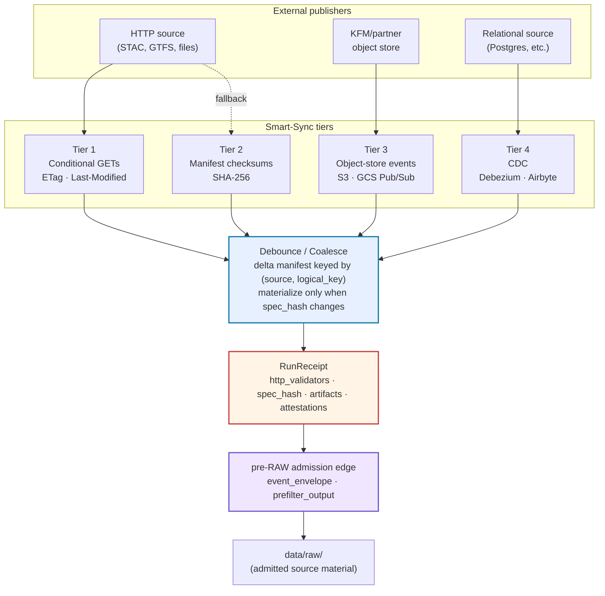
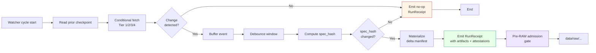

<!-- [KFM_META_BLOCK_V2]
doc_id: kfm://doc/standards/smart-sync
title: Smart Sync — Layered Ingest Doctrine for Event-Driven, Conditional, Fail-Closed Source Refresh
type: standard
version: v0.1
status: draft
owners: NEEDS VERIFICATION
created: 2026-05-14
updated: 2026-05-14
policy_label: public
related:
  - docs/standards/RUN_RECEIPT.md
  - docs/standards/DEBOUNCE_WINDOWS.md
  - docs/standards/AGENT_CONTRACT.md
  - docs/standards/SENSITIVITY_RUBRIC.md
  - docs/runbooks/event-driven-ingest.md
  - docs/doctrine/lifecycle-law.md
  - docs/doctrine/directory-rules.md
  - tools/ingest/watchers/
  - tools/validators/
  - schemas/contracts/v1/runtime/run_receipt.schema.json
tags: [kfm, ingestion, smart-sync, watchers, http-validators, etag, manifest-checksum, debounce, cdc, run-receipt]
notes:
  - All path claims are PROPOSED until repo evidence is mounted.
  - Doctrine grounded in Pass 10 §6.3 (Category C3) and converging evidence in Pass 18, Master MapLibre v1.7/v1.8, and New Ideas 5-8-26.
[/KFM_META_BLOCK_V2] -->

<a id="top"></a>

# Smart Sync

> **Layered, conditional, event-driven, fail-closed ingest doctrine for KFM source refresh.**
> How RAW gets filled without redundancy, surprise, or lost provenance.


| Field | Value |
|---|---|
| **Status** | `draft` · v0.1 |
| **Authority level** | doctrine / standard |
| **Owners** | `NEEDS VERIFICATION` (CODEOWNERS not inspected) |
| **Last reviewed** | 2026-05-14 |
| **Companion docs** | [`RUN_RECEIPT.md`](./RUN_RECEIPT.md) · [`DEBOUNCE_WINDOWS.md`](./DEBOUNCE_WINDOWS.md) · [`AGENT_CONTRACT.md`](./AGENT_CONTRACT.md) |
| **Implementation home (PROPOSED)** | `tools/ingest/watchers/` · `tools/validators/` · `schemas/contracts/v1/runtime/` |

> [!IMPORTANT]
> This document defines **doctrine**, not implementation status. Every path, validator name, schema home, and CI workflow named below is **PROPOSED** until verified against a mounted repository. The four-tier doctrine itself is **CONFIRMED** by convergent evidence across the KFM corpus.

---

## Quick Jump

- [§ 1. Purpose & Scope](#1-purpose--scope)
- [§ 2. Doctrinal Position](#2-doctrinal-position)
- [§ 3. The Four-Tier Layered Approach](#3-the-four-tier-layered-approach)
- [§ 4. Tier 1 — Conditional HTTP (ETag · Last-Modified)](#4-tier-1--conditional-http-etag--last-modified)
- [§ 5. Tier 2 — Manifest Checksums (SHA-256)](#5-tier-2--manifest-checksums-sha-256)
- [§ 6. Tier 3 — Object-Store Event Subscriptions](#6-tier-3--object-store-event-subscriptions)
- [§ 7. Tier 4 — Change-Data-Capture (CDC)](#7-tier-4--change-data-capture-cdc)
- [§ 8. The Debounce/Coalesce Layer](#8-the-debouncecoalesce-layer)
- [§ 9. Watcher Contract](#9-watcher-contract)
- [§ 10. RunReceipt Integration](#10-runreceipt-integration)
- [§ 11. Promotion Gate Integration](#11-promotion-gate-integration)
- [§ 12. Failure Modes & Fail-Closed Rules](#12-failure-modes--fail-closed-rules)
- [§ 13. Anti-Patterns](#13-anti-patterns)
- [§ 14. Validation & Test Plan](#14-validation--test-plan)
- [§ 15. Open Questions](#15-open-questions)
- [§ 16. Related Docs & Standards](#16-related-docs--standards)
- [Appendix A. Reference Recipes](#appendix-a-reference-recipes)
- [Appendix B. Source Evidence Ledger](#appendix-b-source-evidence-ledger)

---

## 1. Purpose & Scope

Smart Sync names KFM's **read-side** of the truth path: how raw data gets from external publishers into the `RAW` zone — and then through the debounce/coalesce layer into delta manifests — without redundancy, without surprise, and without losing context that downstream gates depend on.

It exists because the alternative — naive polling, every-poll re-downloads, fire-and-forget events, schema-less ingest — produces two failure modes KFM cannot tolerate: **provenance loss** (downstream gates can't replay the fetch decision) and **promotion drift** (artifacts get materialized when nothing actually changed). Smart Sync is the contract that prevents both.

**In scope:**

- The four-tier ingest layering for external sources (HTTP, object stores, databases).
- The debounce/coalesce layer that batches volatile events into delta manifests keyed by `spec_hash`.
- The watcher contract that emits `RunReceipt` objects every cycle, including no-op cycles.
- The pre-RAW admission boundary and the fields a watcher must record before bytes are accepted into RAW.

**Out of scope** (delegated to companion docs):

- The full `RunReceipt` envelope — see [`RUN_RECEIPT.md`](./RUN_RECEIPT.md) (PROPOSED).
- Per-source debounce window numbers — see [`DEBOUNCE_WINDOWS.md`](./DEBOUNCE_WINDOWS.md) (PROPOSED).
- The watcher's lease/expiry semantics — see [`AGENT_CONTRACT.md`](./AGENT_CONTRACT.md) (PROPOSED).
- Sensitivity classification of fetched bytes — see [`SENSITIVITY_RUBRIC.md`](./SENSITIVITY_RUBRIC.md) (PROPOSED).
- Release/promotion policy — see `policy/promotion/` (PROPOSED).

> [!NOTE]
> Smart Sync sits **before** the lifecycle invariant. Bytes touched by a watcher are **not yet RAW** until admission succeeds; they are pre-RAW transient material with an `event_envelope` and `event_run_receipt`. The invariant `RAW → WORK/QUARANTINE → PROCESSED → CATALOG/TRIPLET → PUBLISHED` begins at successful admission. The pre-RAW edge is **PROPOSED** per the Unified Implementation Architecture Build Manual and is not a fifth lifecycle phase.

[↑ Back to top](#top)

---

## 2. Doctrinal Position

Smart Sync is **Category C3** in the KFM idea index. Its status is **central** — it is referenced from essentially every domain ingest flow, every release gate that wants to know "did the upstream actually change," and every audit that needs to replay a fetch decision.

| Anchor | Statement | Truth label |
|---|---|---|
| **Layering is doctrine** | HTTP validators → manifest checksums → object-store events → CDC, with debounce/coalesce on top. | CONFIRMED |
| **Conditional GETs are the default** | All HTTP polling against external publishers is conditional; on `304 Not Modified`, the download is skipped. | CONFIRMED |
| **Receipts on every cycle** | Every watcher cycle emits a `RunReceipt`, including no-op cycles where `spec_hash` did not change. | CONFIRMED |
| **`spec_hash` gates materialization** | Within the debounce/coalesce layer, materialization happens only when `spec_hash` changes; otherwise a no-op receipt is emitted. | CONFIRMED |
| **Fail closed on validator/manifest mismatch** | Validator divergence, missing manifests, or `sha256sum -c` mismatch refuse promotion. | CONFIRMED |
| **Watchers do not publish** | Watcher outputs land in `data/raw/` or `data/quarantine/` only. Publication is downstream and governed. | CONFIRMED (Directory Rules §6, Anti-Patterns §13) |
| **Canonical watcher path** | `tools/ingest/watchers/<source>_watcher.py` is the default ingest entry point. | PROPOSED (path placement; implementation not verified) |

[↑ Back to top](#top)

---

## 3. The Four-Tier Layered Approach

Smart Sync layers four ingest mechanisms by preference. Each tier degrades to the next when the prior tier is unavailable for a given source. The debounce/coalesce layer sits **above** all four, normalizing every change signal into the same delta-manifest shape before any artifact is materialized.



> [!NOTE]
> The diagram is a **doctrinal** representation, not a wiring diagram for any specific deployment. Specific runtime placement (Lambda vs. self-hosted consumer, Kafka vs. Redis Streams) is **PROPOSED** and selected per-source.

[↑ Back to top](#top)

---

## 4. Tier 1 — Conditional HTTP (ETag · Last-Modified)

**Idea reference:** `C3-01` · Status: **CONFIRMED**

### 4.1 Normalized rule

All HTTP polling against external publishers is **conditional**. Store the `ETag` alongside the local artifact. On each poll send `If-None-Match`. On `304 Not Modified` the download is skipped. Where `ETag` is missing or weak, fall back to `Last-Modified` with `If-Modified-Since`.

### 4.2 Validator hierarchy

| Validator | Preference | Behavior |
|---|---|---|
| **Strong `ETag`** (no `W/` prefix) | Preferred | Treated as a content-identity check. |
| **Weak `ETag`** (`W/"..."` prefix) | Accepted, advisory | Combined with `Last-Modified` where possible; do not treat as sole content identity. |
| **`Last-Modified` only** | Fallback | Used with `If-Modified-Since`; falls back to Tier 2 (manifest checksum) for integrity. |
| **No validator** | Last resort | Tier 2 manifest checksum is required; if no manifest exists, the source's evidence quality is degraded — see Open Questions §15. |

### 4.3 Reference cycle shape

The corpus's HTTP-validator playbook is pragmatic and consistent across every recipe:

1. **HEAD first** to compare validators against the previously recorded ones.
2. **GET only on change** (or on a 200 response to `If-None-Match`).
3. **Store the new validators** and the local artifact digest.
4. **Write the `RunReceipt`** (see §10).
5. **Exit.**

> [!TIP]
> Even on `304 Not Modified`, a no-op `RunReceipt` is still emitted so auditors can prove the system polled and saw no change. A silent skip is indistinguishable from a watcher outage.

### 4.4 Checkpoint storage

Validators must be persisted somewhere durable per-source. The corpus names three viable homes:

- **Sidecar file** alongside the local artifact (simple; per-runner).
- **SQLite checkpoint table** (recommended for multi-source runners).
- **The receipt ledger itself** (validator lives in the prior `RunReceipt`; the next cycle reads it back).

> [!CAUTION]
> Where checkpoints live for **multi-region runners** is an Open Question (§15). Per-runner SQLite risks divergence; a shared table couples runners. This is unresolved in the corpus.

### 4.5 Known tension

Some publishers strip or rotate validators on non-content rebuilds. This produces **false positives** — the validator changed, but the bytes did not. The required mitigation is to **also** verify SHA-256 against a manifest (Tier 2) before promoting any artifact whose validator changed without a matching manifest update.

[↑ Back to top](#top)

---

## 5. Tier 2 — Manifest Checksums (SHA-256)

**Idea reference:** `C3-02` · Status: **CONFIRMED**

### 5.1 Normalized rule

When a publisher exposes a checksums file, fetch it once per release, run `sha256sum -c` (or equivalent) against local files, and **fail closed on any mismatch**.

### 5.2 The two-step pattern

The canonical pattern combines Tier 1 and Tier 2:

1. **Poll the manifest with conditional HTTP** (Tier 1 against the manifest URL itself).
2. **Re-download artifacts only when the manifest itself changes.**

This composition is the heart of smart sync: validators tell you whether the manifest changed; the manifest tells you which artifacts to fetch; and `sha256sum -c` proves what arrived matches what the publisher claimed.

### 5.3 Why it is required

Manifest verification eliminates the residual risk of **silent corruption** between the publisher and the local copy. It is the canonical way to refuse promotion when bytes do not match what the publisher claimed — and it is the mitigation for the Tier 1 false-positive case (§4.5).

### 5.4 Source registry implication

The corpus recommends a **per-source `has_manifest` flag** in the source registry, surfaced in the catalog and reviewable in periodic check-in reports. Whether a missing manifest should **block** promotion or only **downgrade** the evidence quality label is an Open Question (§15).

| Publisher class | Typical manifest availability | Smart-sync impact |
|---|---|---|
| USDA-NRCS SSURGO | Provides per-release checksums | Both tiers available |
| Many federal/state open-data publishers | Provides checksums | Both tiers available |
| Ad-hoc HTTP file shares | Often no manifest | Tier 1 only; rely on artifact's own published checksum if any |
| Streaming feeds (GTFS-rt, sensors) | No manifest concept | Tiers 3 or 4 apply instead |

[↑ Back to top](#top)

---

## 6. Tier 3 — Object-Store Event Subscriptions

**Idea reference:** `C3-03` · Status: **CONFIRMED**

### 6.1 Normalized rule

When the source is an object store KFM controls, subscribe to `s3:ObjectCreated:*` on S3 or GCS Pub/Sub notifications and trigger fetch handlers **from the event**, not from a poll loop.

### 6.2 Handler shape

The handler:

1. Receives the event.
2. Extracts the object's `eTag` (or `md5Hash` / `crc32c` on GCS).
3. Compares to the recorded validator from the prior cycle.
4. Performs an optional defensive `HEAD` before downloading.
5. Verifies SHA-256.
6. Emits the event into the durable buffer that feeds the debounce/coalesce layer (§8).

### 6.3 Why push beats poll here

Push beats poll on **cost**, **latency**, and **accuracy**. It also removes ambiguity around polling cadence: the system reacts when bytes change rather than at a guessed interval.

### 6.4 Applicability boundary

> [!WARNING]
> External publishers' object stores are usually **not** KFM-controlled. Tier 3 applies mostly to:
> - KFM-internal staging buckets (RAW staging).
> - Partner-granted subscription access.
>
> Treating external public buckets as Tier 3 sources without an explicit subscription grant is a mis-design. Use Tier 1 against the publisher's HTTP surface instead.

### 6.5 Idempotency key

The right idempotency key for the handler — `eTag + key`, or `eTag + key + generation/version` — is an **Open Question** (§15). Recommend pinning a project-wide default in the watcher runbook.

[↑ Back to top](#top)

---

## 7. Tier 4 — Change-Data-Capture (CDC)

**Idea reference:** `C3-05` (Debezium + Kafka) · `C3-06` (Airbyte) · Status: **CONFIRMED**
**Idea reference:** `C3-07` (Apache NiFi) · Status: **PROPOSED**

### 7.1 Normalized rule

For relational sources, prefer **Debezium plus Kafka Connect** for low-latency change feeds, or **Airbyte** for plug-and-play snapshots when low-latency is not required.

### 7.2 Pattern shape

| Mechanism | Best for | Operational cost |
|---|---|---|
| **Debezium + Kafka Connect** | Sources that need low-latency change feeds (e.g., a partner-shared OLTP database). Debezium reads the Postgres WAL via `pgoutput`; Kafka Connect S3 sinks land change events into S3/MinIO partitioned by table and time. | High — Kafka, Connect, and Debezium must all be available. |
| **Airbyte** | Small or batchable sources. Maintained Postgres source + S3/MinIO destinations for rapid snapshot or streaming with generation/version tags. | Low — declarative source contracts. |
| **Apache NiFi** | Complex routing/transformation flows that don't fit Airbyte's declarative model. **PROPOSED** — justification needed before adoption over alternatives. | High — visual-flow orchestrator complexity. |

### 7.3 Downstream consumer

The downstream consumer is the **same windowed compactor** that handles object-store events (§8). It coalesces events by primary key into a delta row-set and emits a GeoParquet (or CSV) artifact plus a `RunReceipt` recording counts, key set, and upstream cursor.

> [!NOTE]
> CDC turns relational sources into the same kind of event-driven inputs as object stores, which lets the same debounce-and-coalesce contract apply **uniformly** across Tiers 3 and 4.

### 7.4 Open inventory question

Which Kansas authoritative database — if any — is amenable to CDC, given that most state and federal sources expose REST or file artifacts? This is unresolved in the corpus and is an **Open Question** (§15).

[↑ Back to top](#top)

---

## 8. The Debounce/Coalesce Layer

**Idea reference:** `C3-04` · Status: **CONFIRMED**

### 8.1 Normalized rule

Volatile sources flow into a **durable buffer** (Kafka or Redis Streams) and are aggregated by short-lived workers into **delta manifests** over a per-source debounce window (5–300 s). Materialization happens **only when `spec_hash` changes**; otherwise a **no-op receipt** is emitted.

### 8.2 Window keying

Within each window, events are aggregated by the tuple `(source, logical_key)`. The aggregator emits a delta manifest that records:

| Field | Purpose |
|---|---|
| `event_list` | The set of upstream events seen in the window. |
| `watermark` | Window close time. |
| `upstream_cursor` | Kafka offset, S3 generation, or last HTTP validators (depending on tier). |
| `spec_hash` | Deterministic JCS+SHA-256 over the spec portion of the manifest. |
| `decision` | `materialize` or `no_op`. |

### 8.3 Suggested window sizes

| Source class | Suggested window |
|---|---|
| High-churn sensors | 5–30 s |
| Moderate feeds | 30–120 s |
| Heavy batch sources | 120–300 s |

> [!IMPORTANT]
> Window selection is a **tuning problem**. Too short produces churn; too long produces stale views. The numbers above are **CONFIRMED starting points** from the corpus, not per-source operational values. Per-source values belong in [`DEBOUNCE_WINDOWS.md`](./DEBOUNCE_WINDOWS.md) (PROPOSED) and are revised against materialization-rate metrics.

### 8.4 No-op receipts

A no-op receipt is **still emitted** when `spec_hash` is unchanged, so auditors can see that the system saw events but elected not to act. Whether the no-op receipt is written every cycle, every N cycles, or only on transitions from change → no-change is an **Open Question** (§15). The conservative default is **every cycle**.

### 8.5 Why this layer exists

Two competing requirements meet here:

- **Audit completeness.** Every upstream event is preserved in the buffer.
- **Materialization economy.** Not every event triggers a downstream materialize cycle.

The debounce/coalesce layer reconciles them. It is the layer that lets KFM say "we saw it" without also saying "we re-materialized everything downstream because of it."

[↑ Back to top](#top)

---

## 9. Watcher Contract

### 9.1 Watcher placement

| Concern | PROPOSED path | Authority |
|---|---|---|
| Watcher implementations | `tools/ingest/watchers/<source>_watcher.py` | Per C3-01 expansion direction |
| Shared watcher utilities | `tools/ingest/watchers/common.py` | Per New Ideas reference layout |
| Watcher schemas | `schemas/contracts/v1/runtime/watcher_descriptor.schema.json` | Per Directory Rules ADR-0001 default |
| Watcher receipts (output) | `data/receipts/ingest/` | Per Directory Rules §6/§9 |
| Pre-RAW transient events | `data/events/` (PROPOSED, deny public) | Per BLD-GREEN v1.1 |
| Admitted bytes (Tier 1/2 output) | `data/raw/<domain>/<source_id>/<run_id>/` | Per Directory Rules §9 |
| Validator | `tools/validators/watcher/validate_watcher_descriptor.py` | PROPOSED |

> [!NOTE]
> All paths in this section are **PROPOSED**. ADR-0001 fixes the default machine-schema home at `schemas/contracts/v1/...`; whether `contracts/<domain>/<x>.schema.json` is the live convention in the current repo is **NEEDS VERIFICATION**.

### 9.2 Watcher schema — type enum

A `WatcherDescriptor` classifies its source with a typed enum. The values are **fixed vocabulary**:

| Type | Meaning |
|---|---|
| `stac` | STAC HTTP catalog/collection/item endpoints. |
| `gtfs` | GTFS or GTFS-rt transit feeds. |
| `tile` | Tile or COG endpoints (vector tiles, PMTiles, MBTiles, COG). |
| `file` | Generic HTTP file or archive endpoints. |
| `api` | Arbitrary REST/HTTP API endpoints. |

> [!TIP]
> Tile-specific watchers should be classified under `tile` rather than `file`, so promotion gates can apply tile-specific provider-allowlist and digest checks.

### 9.3 Watcher signing

Watcher descriptors carry a `signature_ref` pointing at an OCI signature artifact. The registry **MUST refuse to activate** an unsigned watcher descriptor; signature verification is part of the source-activation gate, not a downstream check.

### 9.4 Watcher dry-run

Watchers MUST support a **no-network dry-run** mode that emits structurally valid receipts without live network side effects. This is what enables CI to validate watcher behavior deterministically and is the recommended first implementation milestone.



[↑ Back to top](#top)

---

## 10. RunReceipt Integration

### 10.1 The `http_validators` field

Every smart-sync cycle's `RunReceipt` MUST carry the validators observed at fetch. This is what lets downstream gates and audits **replay the conditional request** and confirm the no-change decision.

| Receipt field | Source | Required when |
|---|---|---|
| `http_validators.etag` | HTTP `ETag` header (strong or weak) | Tier 1, when available |
| `http_validators.last_modified` | HTTP `Last-Modified` header | Tier 1, when available |
| `http_validators.content_length` | HTTP `Content-Length` header | Tier 1, when available |
| `source_url` | The original URL or provider URI | All tiers |
| `spec_hash` | Canonical `jcs:sha256:<hex>` over the spec portion | All tiers |
| `artifacts[].digest` | SHA-256 of each emitted artifact | When materialization occurs |
| `attestations[]` | Cosign / DSSE bundle digests | When materialization occurs |
| `rights_spdx` | SPDX identifier (`CC0-1.0`, `CC-BY-4.0`, etc.) | All tiers |
| `decision` | `materialize` \| `no_op` | All tiers |

> [!IMPORTANT]
> The canonical receipt schema lives at (PROPOSED) `schemas/contracts/v1/runtime/run_receipt.schema.json`. The receipt narrative — full envelope, naming conventions, attestation contract — belongs in [`RUN_RECEIPT.md`](./RUN_RECEIPT.md), not here. Smart Sync owns *what the receipt must record about the fetch*; `RUN_RECEIPT.md` owns *the receipt itself*.

### 10.2 Field-name drift note

The corpus shows some historical drift on field naming (`fetch_time` vs. `fetched_at`, `http_validators` vs. `source_validators`). This document uses **`http_validators`** and **`fetch_time`** as the canonical forms — these are the names that recur most often across the corpus. Migration of any pre-existing receipts under different names is a `NEEDS VERIFICATION` task.

[↑ Back to top](#top)

---

## 11. Promotion Gate Integration

Smart Sync runs **before** RAW admission, but its outputs are consumed by every downstream gate. The relevant invariants:

| Gate | Reads from Smart Sync | Fail-closed condition |
|---|---|---|
| **Admission** (pre-RAW → RAW) | `http_validators`, `spec_hash`, source identity | Missing receipt; unsigned watcher descriptor; unresolved source rights. |
| **Validation** (WORK → PROCESSED) | `artifacts[].digest`, `rights_spdx` | Digest mismatch against Tier 2 manifest. |
| **Catalog closure** (PROCESSED → CATALOG/TRIPLET) | `EvidenceRef` resolves to `EvidenceBundle` carrying the receipt | Unresolved `EvidenceRef`. |
| **Release** (CATALOG/TRIPLET → PUBLISHED) | Provider in allowlist; `spec_hash` present; signature verifies | Unapproved provider; missing `spec_hash`; missing rollback target. |

> [!CAUTION]
> A valid cosign signature on the watcher's `RunReceipt` does **not** override missing evidence, unclear rights, unresolved provenance, or sensitivity restrictions. Signatures attest *origin and integrity*. They do not attest *admissibility*.

[↑ Back to top](#top)

---

## 12. Failure Modes & Fail-Closed Rules

| Failure | Outcome | Receipt action |
|---|---|---|
| `If-None-Match` returns 200, but SHA-256 matches prior artifact | Treat as no-op; record validator drift in receipt | Emit no-op receipt with `validator_drift: true` |
| Manifest checksum (`sha256sum -c`) mismatch | **DENY** — refuse promotion | Emit receipt with `decision: deny`, `reason: checksum_mismatch` |
| Manifest absent for a source where the registry expects one | **ABSTAIN** at validation; **DENY** at promotion if Open Question §15 is resolved that way | Emit receipt; flag for steward |
| Object-store event arrives but `eTag` matches prior validator | No-op | Emit no-op receipt |
| Debounce window closes with `spec_hash` unchanged | No-op | Emit no-op receipt (§8.4 cadence) |
| Watcher descriptor unsigned | **DENY** activation | No watcher cycle runs |
| Watcher descriptor signed but `provider` not in allowlist | **DENY** activation | No watcher cycle runs |
| Pre-RAW admission rejects bytes (rights/sensitivity/policy) | Quarantine to `data/quarantine/` | Emit receipt with quarantine reason |

[↑ Back to top](#top)

---

## 13. Anti-Patterns

> [!WARNING]
> The following patterns appear plausible but **violate** Smart Sync doctrine. Reviewers should treat any of them as drift candidates.

| Anti-pattern | Why it's wrong | Correct pattern |
|---|---|---|
| **Unconditional polling** — every poll re-downloads regardless of validators | Wastes bandwidth, breaks change detection, prevents replay of fetch decisions | Tier 1 conditional GET with `If-None-Match` |
| **Trusting `ETag` alone** for sources known to rotate validators on non-content rebuilds | Produces false-positive fetches that look like change but aren't | Tier 1 **plus** Tier 2 manifest verification |
| **Treating publisher object stores as Tier 3** without subscription grant | Tier 3 requires push from a controlled store; external buckets are not push sources | Use Tier 1 against the HTTP surface instead |
| **Skipping no-op receipts** | Indistinguishable from a watcher outage; breaks audit completeness | Emit no-op receipts per §8.4 cadence |
| **Watcher writes to `data/processed/` or `data/catalog/` directly** | Violates the watcher-as-non-publisher invariant; bypasses lifecycle gates | Watcher emits to `data/raw/` or `data/quarantine/` only |
| **Materialize on every event** without debounce | Causes downstream churn; loses the `spec_hash`-gated economy | Run events through the debounce/coalesce layer |
| **Validators stored only in tests** | Validators must live in `tools/validators/`; tests call into them | Extract to `tools/validators/watcher/` |
| **Receipt without `spec_hash`** | Downstream gates cannot replay or verify identity | Always compute `spec_hash` per JCS+SHA-256 |
| **Tier 4 CDC without windowed compactor** | Per-event materialization burns the same cost as unconditional polling | Route CDC into the same C3-04 debounce/coalesce path |

[↑ Back to top](#top)

---

## 14. Validation & Test Plan

Validation tests are **fixture-driven** and must pass with **no live network access**. The fixture catalog and validator are PROPOSED.

### 14.1 Required test classes

| Class | What it proves | Fixture shape |
|---|---|---|
| **Conditional-GET happy path** | 200 → fetch; 304 → no-op receipt | Valid watcher descriptor + recorded validators + mocked HTTP response |
| **Validator rotation without content change** | `validator_drift: true` recorded; no spurious materialization | Mocked response with new `ETag` but identical SHA-256 |
| **Manifest checksum mismatch** | DENY outcome; receipt records `reason: checksum_mismatch` | Manifest with intentionally wrong SHA-256 |
| **Missing manifest** | ABSTAIN/DENY per resolved policy | Source descriptor with `has_manifest: true` but manifest URL 404 |
| **Watcher descriptor unsigned** | Activation DENY | Descriptor with missing `signature_ref` |
| **Watcher descriptor signed, unapproved provider** | Activation DENY | Descriptor whose `provider` not in allowlist |
| **Debounce no-op** | No-op receipt emitted when `spec_hash` unchanged across window | Sequence of events with identical spec portion |
| **Debounce materialize** | Materialization + signed receipt + attestation emitted | Sequence of events producing changed `spec_hash` |
| **No-network dry-run** | Watcher emits structurally valid receipts without network | Dry-run flag set; deterministic fixture inputs |

### 14.2 Required CI gates (PROPOSED IDs)

| Gate ID | Purpose | Fail condition |
|---|---|---|
| `PR-SYNC-001` | Schema validation of `WatcherDescriptor` | Schema invalid |
| `PR-SYNC-002` | Schema validation of `RunReceipt` | Schema invalid |
| `PR-SYNC-003` | Deterministic `spec_hash` (JCS round-trip) | Hash drift across runners |
| `PR-SYNC-004` | Invalid-fixture rejection | Validator passes a known-bad fixture |
| `PR-SYNC-005` | No-network dry-run | Dry-run touches network |
| `PR-SYNC-006` | Provider allowlist enforcement | Promotion accepts unapproved provider |
| `PR-SYNC-007` | Receipt completeness | Receipt missing required fields |

[↑ Back to top](#top)

---

## 15. Open Questions

The following are **explicitly unresolved** in the corpus. They are tracked here so reviewers and ADR authors can find them; they belong in `docs/registers/VERIFICATION_BACKLOG.md` (PROPOSED).

> [!NOTE]
> These items are **NEEDS VERIFICATION** or **OPEN**, not defects in the doctrine. The doctrine is stable; these are tuning and integration choices that require evidence or ADR.

1. **Checkpoint home for multi-region runners.** Per-runner SQLite, or a shared table in the same audit store? *(C3-01 open question.)*
2. **Missing-manifest policy.** Should a missing manifest **block promotion**, or only **downgrade** the evidence quality label? *(C3-02 open question.)*
3. **Object-store event idempotency key.** `eTag + key`, or `eTag + key + generation/version`? *(C3-03 open question.)*
4. **No-op receipt cadence.** Every cycle, every N cycles, or only on `change ↔ no-change` transitions? *(C3-04 open question.)*
5. **CDC source inventory.** Which Kansas authoritative database, if any, is amenable to CDC? *(C3-05 open question.)*
6. **Per-source debounce window numbers.** The corpus offers ranges (5–30 s, 30–120 s, 120–300 s) but not per-source specifics. Owned by [`DEBOUNCE_WINDOWS.md`](./DEBOUNCE_WINDOWS.md).
7. **Lease duration per source class.** What lease duration fits high-churn sensors, moderate feeds, heavy batch sources? *(C2-04 open question; owned by [`AGENT_CONTRACT.md`](./AGENT_CONTRACT.md).)*
8. **Receipt field-name canonicalization.** Final reconciliation of `fetch_time` vs `fetched_at`, `http_validators` vs `source_validators`. *(NEEDS VERIFICATION against any pre-existing receipts in the repo.)*
9. **Schema home for `WatcherDescriptor`.** `schemas/contracts/v1/runtime/` (ADR-0001 default) vs. `contracts/runtime/`. *(Directory Rules §18 open item.)*
10. **Apache NiFi adoption.** C3-07 is PROPOSED; justification over Airbyte and Debezium needed before adoption.

[↑ Back to top](#top)

---

## 16. Related Docs & Standards

### 16.1 KFM companion docs (PROPOSED or DRAFT)

| Path | Role | Status |
|---|---|---|
| [`docs/standards/RUN_RECEIPT.md`](./RUN_RECEIPT.md) | Canonical `RunReceipt` envelope and field semantics | PROPOSED |
| [`docs/standards/DEBOUNCE_WINDOWS.md`](./DEBOUNCE_WINDOWS.md) | Per-source debounce window numbers | PROPOSED |
| [`docs/standards/AGENT_CONTRACT.md`](./AGENT_CONTRACT.md) | Watcher lease/expiry semantics; START/COMPLETE/FAIL events | PROPOSED |
| [`docs/standards/SENSITIVITY_RUBRIC.md`](./SENSITIVITY_RUBRIC.md) | Sensitivity classes that govern admission to RAW vs. quarantine | PROPOSED |
| [`docs/runbooks/event-driven-ingest.md`](../runbooks/event-driven-ingest.md) | Tier 3 handler operational shape | PROPOSED |
| [`docs/doctrine/lifecycle-law.md`](../doctrine/lifecycle-law.md) | The `RAW → … → PUBLISHED` invariant | PROPOSED |
| [`docs/doctrine/directory-rules.md`](../doctrine/directory-rules.md) | Responsibility-root placement rules | CONFIRMED (project-mounted) |
| `tools/ingest/watchers/` | Watcher implementations | PROPOSED |
| `tools/validators/watcher/` | Watcher and receipt validators | PROPOSED |
| `schemas/contracts/v1/runtime/run_receipt.schema.json` | RunReceipt JSON Schema | PROPOSED |
| `schemas/contracts/v1/runtime/watcher_descriptor.schema.json` | WatcherDescriptor JSON Schema | PROPOSED |

### 16.2 Idea-index cross-references

| ID | Title | Status |
|---|---|---|
| `C1-01` | Universal Run Receipt | CONFIRMED |
| `C1-02` | Deterministic `spec_hash` via JCS + SHA-256 | CONFIRMED |
| `C2-04` | Lease-Based Scheduler-Authorizer | CONFIRMED |
| `C3-01` | Conditional GETs via ETag and Last-Modified | CONFIRMED |
| `C3-02` | Manifest Checksum Verification (SHA-256) | CONFIRMED |
| `C3-03` | Object-Store Event Subscriptions (S3, GCS) | CONFIRMED |
| `C3-04` | Debounce, Coalesce, and Delta Manifests | CONFIRMED |
| `C3-05` | CDC with Debezium plus Kafka Connect S3 Sinks | CONFIRMED |
| `C3-06` | Airbyte for Plug-and-Play Source-to-S3 Snapshots | CONFIRMED |
| `C3-07` | Apache NiFi | PROPOSED |
| `C5-02` | Promotion gate / spec-hash-match | CONFIRMED |
| `C12-03` | GENERATED_RECEIPT storage-event PR | CONFIRMED |

### 16.3 External standards referenced (informational)

The doctrine builds on the following external standards. These are referenced here only because Smart Sync **operationalizes** them; this document does not redefine them.

- **HTTP conditional requests** — `If-None-Match` / `If-Modified-Since` semantics. See the HTTP semantics RFC for normative wording.
- **RFC 8785 — JSON Canonicalization Scheme (JCS)** — basis for `spec_hash` canonicalization (delegated to `C1-02`).
- **SHA-256** — content-digest algorithm.
- **STAC, GTFS, OGC API tiles, COG, PMTiles** — typical source/payload shapes for the `stac`, `gtfs`, and `tile` watcher types.

> [!NOTE]
> External standard mechanics are described as the corpus describes them. No external research was performed for this document; all claims are sourced from the KFM project corpus. If discrepancies are later found between corpus wording and the normative external standards, surface them as drift entries rather than silently reconciling.

[↑ Back to top](#top)

---

## Appendix A. Reference Recipes

<details>
<summary><strong>A.1 — Minimal conditional GET (illustrative pseudocode)</strong></summary>

```python
# tools/ingest/watchers/common.py  (PROPOSED)
# Illustrative only. Not a complete implementation.

from datetime import datetime, timezone
import requests

def fetch_validators(url: str) -> dict:
    """HEAD the source URL; return the validators observed."""
    r = requests.head(url, timeout=30)
    return {
        "etag": r.headers.get("ETag"),
        "last_modified": r.headers.get("Last-Modified"),
        "content_length": r.headers.get("Content-Length"),
        "fetched_at": datetime.now(timezone.utc).isoformat(),
    }

def conditional_get(url: str, prior: dict) -> tuple[bool, bytes | None, dict]:
    """Return (changed, body_or_None, new_validators)."""
    headers = {}
    if prior.get("etag"):
        headers["If-None-Match"] = prior["etag"]
    if prior.get("last_modified"):
        headers["If-Modified-Since"] = prior["last_modified"]

    r = requests.get(url, headers=headers, timeout=60)
    if r.status_code == 304:
        return False, None, prior  # no-op
    r.raise_for_status()
    new_validators = {
        "etag": r.headers.get("ETag"),
        "last_modified": r.headers.get("Last-Modified"),
        "content_length": r.headers.get("Content-Length"),
        "fetched_at": datetime.now(timezone.utc).isoformat(),
    }
    return True, r.content, new_validators
```

</details>

<details>
<summary><strong>A.2 — Manifest verification (illustrative pseudocode)</strong></summary>

```python
# tools/validators/verify_manifest.sh  (PROPOSED — shell form)
# Equivalent Python form shown below.

import hashlib
from pathlib import Path

def verify_manifest(manifest_path: Path, root: Path) -> list[tuple[str, bool]]:
    """Verify each entry in checksums.txt; return [(filename, ok), ...]."""
    results = []
    for line in manifest_path.read_text().splitlines():
        expected_hex, _, fname = line.strip().partition("  ")
        fpath = root / fname
        actual = hashlib.sha256(fpath.read_bytes()).hexdigest()
        results.append((fname, actual == expected_hex))
    return results

# Any False entry must cause the promotion gate to DENY.
```

</details>

<details>
<summary><strong>A.3 — Minimal `RunReceipt` fields touched by Smart Sync</strong></summary>

```json
{
  "spec_hash": "jcs:sha256:<hex>",
  "source_url": "<original publisher URL>",
  "fetch_time": "<ISO 8601 UTC>",
  "http_validators": {
    "etag": "<ETag value or null>",
    "last_modified": "<Last-Modified value or null>",
    "content_length": "<bytes or null>"
  },
  "decision": "materialize",
  "artifacts": [
    { "path": "<repo-relative or storage URI>", "digest": "sha256:<hex>" }
  ],
  "rights_spdx": "CC-BY-4.0",
  "attestations": [
    { "type": "cosign", "bundle_digest": "sha256:<hex>" }
  ],
  "watcher": {
    "type": "stac",
    "descriptor_ref": "<OCI ref or local path>",
    "signature_ref": "<OCI signature artifact>"
  }
}
```

> Illustrative. The full canonical envelope is owned by [`RUN_RECEIPT.md`](./RUN_RECEIPT.md).

</details>

<details>
<summary><strong>A.4 — Watcher descriptor shape (PROPOSED)</strong></summary>

```yaml
# A minimal WatcherDescriptor.
# Implementation home: tools/ingest/watchers/<source>.yaml (PROPOSED)

descriptor_version: v1
watcher_id: ssurgo_state_packages
type: file              # stac | gtfs | tile | file | api
provider: usda-nrcs
source_url: https://example.org/SSURGO/<state>.zip
manifest_url: https://example.org/SSURGO/<state>.sha256
has_manifest: true
rights_spdx: PDDL-1.0
debounce_window_seconds: 300
output:
  raw_path: data/raw/soil/ssurgo/<run_id>/
  receipts_path: data/receipts/ingest/
signature_ref: oci://kfm/watcher-signatures/ssurgo_state_packages@sha256:<hex>
```

</details>

[↑ Back to top](#top)

---

## Appendix B. Source Evidence Ledger

> [!NOTE]
> This ledger records which project source supports which claim in this document. External sources are not consulted; every claim resolves to attached project knowledge.

| Source ID | File | Supports |
|---|---|---|
| `SRC-P10` | KFM_Components_Pass_10_Idea_Index_Category_Atlas_and_Expansion_Dossier.pdf | C3 category overview; C3-01 through C3-06 idea entries; receipt field set; debounce window ranges; SMART_SYNC.md as named target. |
| `SRC-DIR` | directory-rules.md (mounted) | Responsibility-root placement; ADR-0001 schema home; anti-patterns (watcher-as-publisher, schema mirror divergence); README contract §15. |
| `SRC-UIAI` | KFM_Unified_Implementation_Architecture_Build_Manual.pdf | Pre-RAW admission edge (event_envelope, event_run_receipt); lifecycle invariant statement; placement of `tools/attest/` and `tools/validators/promotion_gate/`. |
| `SRC-ML` | Master_MapLibre_Components-Functions-Features_compressed.pdf | Watcher type enum (`stac`, `gtfs`, `tile`, `file`, `api`); `RunReceipt` fields for tile sources; signature_ref/OCI; provenance-policy workflow shape. |
| `SRC-NEW` | New_Ideas_5-8-26.pdf | Watcher/proposal reference layout; canonical `run_receipt.json` shape; finite outcomes; DSSE/cosign integration; gate IDs pattern. |
| `SRC-P18` | KFM_Pass_18_Idea_Index_Category_Atlas_and_Expansion_Dossier.pdf | Offline/sync receipts orientation; field-collected reentry posture (informational, not normative for this doc). |
| `SRC-DOM` | KFM_Domains_Culmination_Atlas_v1_1.pdf | Master pipeline gate reference; lifecycle gate artifacts. |

[↑ Back to top](#top)

---

## Footer

> **Last reviewed:** 2026-05-14
> **Status:** `draft` v0.1 — doctrinal scaffold pending repository verification.
> **Authority class:** Standard (doctrine); not a release decision, not a contract definition.
> **Change discipline:** Routine PRs for typos; reviewer sign-off for new tiers, anti-patterns, or examples; ADR required to add or remove a tier from the four-tier layering or to change the debounce/coalesce contract.

### Related docs

- [`docs/standards/RUN_RECEIPT.md`](./RUN_RECEIPT.md) (PROPOSED) — RunReceipt envelope and signing contract.
- [`docs/standards/DEBOUNCE_WINDOWS.md`](./DEBOUNCE_WINDOWS.md) (PROPOSED) — per-source window numbers.
- [`docs/standards/AGENT_CONTRACT.md`](./AGENT_CONTRACT.md) (PROPOSED) — watcher lease semantics.
- [`docs/doctrine/lifecycle-law.md`](../doctrine/lifecycle-law.md) (PROPOSED) — RAW → PUBLISHED invariant.
- [`docs/doctrine/directory-rules.md`](../doctrine/directory-rules.md) — responsibility-root placement.

[↑ Back to top](#top)
