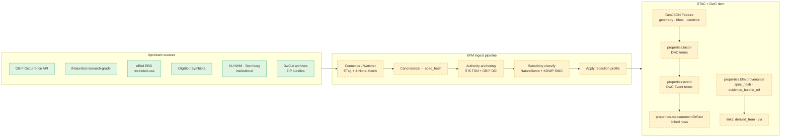

<!-- [KFM_META_BLOCK_V2]
doc_id: kfm://doc/standards/stac-dwc
title: STAC × Darwin Core Hybrid Profile
type: standard
version: v0.1
status: draft
owners: <Standards steward — TODO assign>; <Biodiversity domain owner — TODO assign>
created: 2026-05-14
updated: 2026-05-14
policy_label: public
related:
  - docs/standards/README.md
  - docs/doctrine/directory-rules.md
  - docs/domains/fauna/README.md
  - docs/domains/flora/README.md
  - schemas/contracts/v1/domains/fauna/
  - policy/sensitivity/
  - policy/domains/fauna/
  - docs/adr/ADR-0001-schema-home.md
tags: [kfm, standards, stac, darwin-core, biodiversity, catalog, sensitivity]
notes:
  - All non-doctrine paths are PROPOSED per Directory Rules §0 until verified against mounted-repo evidence.
  - Canonical-form decision (STAC × DwC vs DwC-A) is OPEN; see §11.
[/KFM_META_BLOCK_V2] -->

# STAC × Darwin Core Hybrid Profile

> How KFM encodes biodiversity occurrence and event records as STAC Items whose `properties` carry Darwin Core semantics inside a `taxon` object — keeping the STAC envelope clean while preserving DwC meaning for GBIF, iDigBio, Symbiota, and other biodiversity-aware consumers.


| Field | Value |
|---|---|
| **Status** | Draft (v0.1) |
| **Authority** | Profile design CONFIRMED from Pass 10 §C4-03; paths and fixtures PROPOSED |
| **Owners** | Standards steward · Biodiversity domain owner *(TODO assign)* |
| **Schema home** | `schemas/contracts/v1/domains/fauna/` and `schemas/contracts/v1/domains/flora/` per ADR-0001 |
| **Conformance language** | RFC 2119-style — **MUST / SHOULD / MAY** |
| **Lifecycle scope** | Applies once a biodiversity record reaches **CATALOG**; precise geometry handling differs by phase |
| **Last reviewed** | 2026-05-14 |

---

## 📑 Contents

1. [Overview](#1-overview)
2. [Scope and goals](#2-scope-and-goals)
3. [Doctrinal anchors](#3-doctrinal-anchors)
4. [Hybrid Item shape](#4-hybrid-item-shape)
5. [`properties.taxon` — Darwin Core term mapping](#5-propertiestaxon--darwin-core-term-mapping)
6. [Event records and MeasurementOrFact](#6-event-records-and-measurementorfact)
7. [`kfm:` namespace fields](#7-kfm-namespace-fields)
8. [Authority anchoring (ITIS, GBIF, NatureServe, KDWP SINC)](#8-authority-anchoring)
9. [Sensitivity and redaction obligations](#9-sensitivity-and-redaction-obligations)
10. [Rights, licensing, and restricted-use sources](#10-rights-licensing-and-restricted-use-sources)
11. [Conformance levels](#11-conformance-levels)
12. [Validation: schemas, fixtures, gates](#12-validation-schemas-fixtures-gates)
13. [Open questions](#13-open-questions)
14. [Worked example](#14-worked-example)
15. [Related docs](#15-related-docs)

---

## 1. Overview

> [!NOTE]
> **The profile is doctrine; the paths are not yet evidence.** The STAC × DwC hybrid is CONFIRMED design per Pass 10 §C4-03. Specific file paths, JSON Schema homes, fixture locations, and validator names below are **PROPOSED** until verified against mounted-repo state per Directory Rules §0. Do not treat any path quoted here as proof that the artifact exists in the repo today.

The Kansas Frontier Matrix publishes biodiversity occurrence and survey records through a single envelope that satisfies two communities at once:

- **STAC** anchors spatial and temporal context. Items are indexable by every STAC-aware client, regardless of whether the client understands biology.
- **Darwin Core (DwC)** carries the biological semantics — scientific name, taxonomic rank, sampling event, measurements — required by GBIF, iDigBio, Symbiota, and the herbaria and museum stack.

KFM's convention is to place DwC terms **inside `item.properties.taxon`** (and inside `item.properties.event` for surveys) rather than at the top level. This keeps the STAC envelope clean, keeps unknown-to-naive-clients fields safely namespaced, and preserves DwC meaning for clients that read deeper.



> [!IMPORTANT]
> The diagram reflects **doctrine**, not verified implementation. Box style indicates `CONFIRMED` source identification vs `PROPOSED` pipeline stages and field placements. Promotion from RAW → WORK/QUARANTINE → PROCESSED → CATALOG → PUBLISHED is a governed state transition (Directory Rules invariant), not a file move; redaction obligations and gate enforcement live in `policy/`, not here.

[Back to top ↑](#stac--darwin-core-hybrid-profile)

---

## 2. Scope and goals

### In scope

- The **shape** of a STAC × DwC Item used by KFM for occurrence and survey records.
- Placement of Darwin Core terms inside `properties.taxon` and `properties.event`.
- KFM provenance fields (`kfm:provenance`, `kfm:evidence_ref`, `kfm:sensitivity_rank`, `kfm:redaction_profile`) carried alongside DwC terms.
- Authority-anchoring obligations (ITIS TSN, GBIF Backbone DOI, NatureServe, KDWP SINC) at the record level.
- The conformance ladder (MUST / SHOULD / MAY) and how the profile interacts with promotion gates.

### Out of scope

- **Object meaning** for biodiversity entities → `contracts/domains/fauna/`, `contracts/domains/flora/` (PROPOSED).
- **Machine validation shape** of these fields → `schemas/contracts/v1/domains/fauna/*.schema.json` (PROPOSED per ADR-0001).
- **Admissibility decisions** (DENY / ABSTAIN / RESTRICT / ALLOW) → `policy/domains/fauna/`, `policy/sensitivity/` (PROPOSED).
- **Redaction profile internals** (exact jitter math, grid sizing, embargo windows) → `docs/standards/SENSITIVITY_RUBRIC.md` and the redaction profile catalog (both PROPOSED).
- **Source rights and access negotiation** → `data/registry/` and `docs/sources/` (PROPOSED).

### Goals

1. A biodiversity record that conforms to this profile must remain a **valid STAC Item** so generic STAC clients keep working.
2. A biodiversity-aware consumer must be able to read the DwC terms with **no KFM-specific shim** beyond knowing where `taxon` lives.
3. The profile must be **lossless against DwC-A** for the field set KFM cares about, so records can round-trip without semantic damage. *(See §11 — canonical-form decision is OPEN.)*
4. Sensitivity, rights, and authority anchoring must be **carryable on every Item**, not bolted on at the publication boundary.

[Back to top ↑](#stac--darwin-core-hybrid-profile)

---

## 3. Doctrinal anchors

Every requirement in this profile traces back to KFM doctrine. Conflicts between this document and the anchors below resolve in favor of the anchors.

| Anchor | Where it lives | What it gives this profile |
|---|---|---|
| Hybrid pattern itself | Pass 10 §C4-03 (CONFIRMED) | DwC terms go inside `properties.taxon`; survey records use DwC Event + MeasurementOrFact. |
| `kfm:provenance` namespace on Items | Pass 10 §C4-01 (CONFIRMED) | `spec_hash`, `evidence_bundle_ref`, `run_record_ref`, `audit_ref`, `policy_digest` on every Item. |
| Evidence-bundle content addressing | Pass 10 §C4-04 (CONFIRMED) | `kfm:evidence_ref` resolves to a content-addressed `EvidenceBundle`. |
| Sensitivity rubric 0–5 | Pass 10 §C6-01 (CONFIRMED) | `sensitivity_rank` required on every record; rank drives redaction profile. |
| Named redaction profiles | Pass 10 §C6-02 (CONFIRMED) | `redaction_profile` references a versioned profile id; ad-hoc redaction is not permitted. |
| ITIS TSN + GBIF Backbone (DOI `10.15468/39omei`) | Pass 10 §C7-07, §C7-08 (CONFIRMED) | Every species record carries an ITIS TSN where ITIS covers the taxon, plus GBIF Backbone anchoring with the Backbone version pinned in the receipt. |
| Restricted-use registry (eBird EBD) | Pass 10 §C10-06 (CONFIRMED tension) | eBird-derived records require explicit terms check before any redistribution. |
| Lifecycle invariant | Directory Rules §0 (CONFIRMED) | RAW → WORK/QUARANTINE → PROCESSED → CATALOG/TRIPLET → PUBLISHED. This profile describes the CATALOG-form shape. |
| Schema-home rule | Directory Rules §6.4 + ADR-0001 (CONFIRMED) | Default schema home is `schemas/contracts/v1/<…>`. Do not maintain divergent schema files under `contracts/`. |

[Back to top ↑](#stac--darwin-core-hybrid-profile)

---

## 4. Hybrid Item shape

A KFM biodiversity Item is a STAC Item (a GeoJSON `Feature`) with these structural commitments. STAC core fields hold their normal meaning; KFM extends `properties` with namespaced blocks and reserves `properties.taxon` / `properties.event` / `properties.measurementOrFact` for Darwin Core content.

| Layer | Required keys (illustrative) | Source of authority |
|---|---|---|
| **STAC core** | `id`, `type` = `"Feature"`, `stac_version`, `geometry`, `bbox`, `properties.datetime`, `assets`, `links`, `collection`, `stac_extensions` | STAC core spec (EXTERNAL — version not pinned in corpus; NEEDS VERIFICATION at profile freeze) |
| **STAC properties (KFM-required)** | `properties.license`, `properties.created`, `properties.updated` | STAC core, with KFM convention that `license` is **never absent** for biodiversity records |
| **Darwin Core — occurrence** | `properties.taxon.{scientific_name, common_name, …}`, `properties.basisOfRecord`, `properties.occurrenceID` | TDWG Darwin Core terms (NEEDS VERIFICATION — version not pinned in corpus) |
| **Darwin Core — event** | `properties.event.{eventID, eventDate, samplingProtocol, sampleSizeValue, …}` | Pass 10 §C4-03 (CONFIRMED), DwC Event extension (NEEDS VERIFICATION) |
| **Darwin Core — measurements** | `properties.measurementOrFact[]` array of `{measurementType, measurementValue, measurementUnit, …}` | Pass 10 §C4-03 (CONFIRMED) |
| **KFM provenance** | `properties.kfm:provenance.{spec_hash, evidence_bundle_ref, run_record_ref, audit_ref, policy_digest}` | Pass 10 §C4-01 (CONFIRMED) |
| **KFM evidence pointer** | `properties.kfm:evidence_ref` (content-addressed URI) | Pass 10 §C4-04 (CONFIRMED) |
| **KFM sensitivity** | `properties.kfm:sensitivity_rank` (0–5), `properties.kfm:redaction_profile` (named profile id) | Pass 10 §C6-01, §C6-02 (CONFIRMED) |
| **KFM authority anchors** | `properties.taxon.itis_tsn`, `properties.taxon.gbif_backbone.{taxon_key, backbone_doi_version}` | Pass 10 §C7-07, §C7-08 (CONFIRMED) |
| **Lineage links** | `links[]` with `rel` values such as `derived_from`, `via`, `source` pointing to upstream Items or evidence bundles | Pass 10 §C4 (CONFIRMED pattern; safe-embedding pattern from `New_Ideas_5-8-26`) |

> [!TIP]
> **Stay namespaced.** All KFM additions live under `properties.kfm:*` or under recognized DwC keys. Do not invent top-level fields on the Item — naive STAC clients drop unknown top-level keys, and that is a silent data-loss class. EvidenceRef-style pointers belong in `properties.kfm:evidence_ref` *and* in the `links[]` array with `rel: "derived_from"` or `rel: "via"`, so search APIs that traverse links keep working.

[Back to top ↑](#stac--darwin-core-hybrid-profile)

---

## 5. `properties.taxon` — Darwin Core term mapping

The `taxon` object holds DwC terms that describe the biological subject of the Item. The mapping below preserves the canonical DwC term names; KFM adds a small set of namespaced supplements for authority anchoring and Kansas-specific status.

| `properties.taxon.*` key | Source | Cardinality | Notes |
|---|---|---|---|
| `scientific_name` | DwC `scientificName` | MUST | The accepted name at the moment of capture; the authority-resolved name lives in the anchor sub-objects. |
| `scientific_name_authorship` | DwC `scientificNameAuthorship` | SHOULD | Carried verbatim from source. |
| `taxon_rank` | DwC `taxonRank` | MUST when a rank is known | Controlled vocabulary (kingdom, phylum, …, species, subspecies). |
| `kingdom` … `genus` | DwC higher classification terms | SHOULD | Provided verbatim where source supplies them. |
| `common_name` | DwC `vernacularName` | MAY | Language tag SHOULD be provided when present. |
| `itis_tsn` | KFM convention (`kfm:` namespace not required because it sits under `taxon`) | MUST where ITIS covers the taxon | Per Pass 10 §C7-07. |
| `gbif_backbone` | KFM convention | MUST | Object: `{ taxon_key, backbone_doi_version }`. Backbone DOI is `10.15468/39omei`; the **specific version** pinned at fetch time is required (Pass 10 §C7-08). |
| `kbs_id` | KFM convention | MAY | Kansas Biological Survey identifier where applicable (Pass 10 §C4-03). |
| `kdwp_status` | KFM convention | SHOULD when source applies | KDWP SINC status (Sensitive Species and Natural Communities). |
| `natureserve_rank` | KFM convention | SHOULD when source applies | Global / state rank (G/S codes); drives sensitivity classification at §9. |
| `sensitivity_rank` | KFM convention (mirror of `properties.kfm:sensitivity_rank`) | MUST | Duplicated inside `taxon` so DwC-only consumers can see it; the **authoritative** value lives at `properties.kfm:sensitivity_rank`. |

> [!CAUTION]
> **Authority disagreement is not a tie.** When ITIS and GBIF Backbone place a name in different higher classifications, capture both anchors and surface the disagreement; do not silently choose one. Pass 10 §C7-07 records this as an open policy question, with a working default of **ITIS for federal-data reconciliation, GBIF for international comparability**. The disagreement signal SHOULD be carried as `properties.taxon.authority_disagreement: true`.

[Back to top ↑](#stac--darwin-core-hybrid-profile)

---

## 6. Event records and MeasurementOrFact

For survey records — checklists, transects, point counts, plot sampling — KFM extends the hybrid via Darwin Core **Event** and linked **MeasurementOrFact** rows. This is doctrine from Pass 10 §C4-03 (CONFIRMED): the hybrid pattern is not limited to bare occurrences.

### `properties.event` — DwC Event terms

| Key | DwC term | Notes |
|---|---|---|
| `eventID` | `eventID` | Stable within the source's identifier system; preserved verbatim. |
| `parentEventID` | `parentEventID` | Carried where event hierarchy applies (e.g., a checklist within a transect). |
| `eventDate` | `eventDate` | ISO 8601; may be an interval. |
| `samplingProtocol` | `samplingProtocol` | Verbatim plus, where possible, a controlled-vocabulary mapping. |
| `samplingEffort` | `samplingEffort` | Free-text effort description. |
| `sampleSizeValue` | `sampleSizeValue` | Numeric. |
| `sampleSizeUnit` | `sampleSizeUnit` | Pairs with `sampleSizeValue`. |

### `properties.measurementOrFact[]` — linked rows

Per Pass 10 §C4-03, MeasurementOrFact rows capture **counts, effort, seasonal status, and detection / non-detection**. Detection / non-detection is the critical case: a checklist that reports zero observations of species X within an effort window is structurally distinct from an absence of any record, and the profile preserves that distinction.

| Key | DwC term | Notes |
|---|---|---|
| `measurementType` | `measurementType` | E.g., `individualCount`, `samplingDuration`, `detection`. |
| `measurementValue` | `measurementValue` | Typed by `measurementType`. |
| `measurementUnit` | `measurementUnit` | Required when units apply. |
| `measurementAccuracy` | `measurementAccuracy` | Carried where supplied. |
| `measurementMethod` | `measurementMethod` | Carried where supplied. |

> [!NOTE]
> The interaction between checklist-style non-detection and the C6 sensitivity rubric is not fully developed in the corpus. A non-detection at a precise coordinate for a sensitive species can still leak location intent (the observer was there, looking). Sensitivity classification (§9) SHOULD apply to negative observations too; this is flagged in §13 (Open questions).

[Back to top ↑](#stac--darwin-core-hybrid-profile)

---

## 7. `kfm:` namespace fields

KFM provenance fields ride on the same Item as the DwC content. All KFM additions are namespaced (`kfm:*`) per Pass 10 §C4-01 and the safe-embedding pattern, so that downstream tooling that does not know KFM ignores them gracefully without breaking on unknown top-level keys.

| Field | Value shape | Doctrine source |
|---|---|---|
| `properties.kfm:provenance.spec_hash` | SHA-256 of the canonicalized record (JCS-canonical JSON) | C1-02 spec_hash, C4-01 |
| `properties.kfm:provenance.evidence_bundle_ref` | Content-addressed URI (e.g., `kfm://entity-bundle/<sha256>`, `oci://…`, or `ipfs://…`) | C4-04 |
| `properties.kfm:provenance.run_record_ref` | Pointer to the immutable run receipt that produced this Item | C1-01, C4-01 |
| `properties.kfm:provenance.audit_ref` | Pointer to the audit-ledger entry | C1-06, C4-01 |
| `properties.kfm:provenance.policy_digest` | Hash of the policy bundle in force at production time | C5-03 (policy parity) |
| `properties.kfm:evidence_ref` | Same content-addressed URI as `evidence_bundle_ref`, surfaced at the top of `properties` for convenience | C4-04 |
| `properties.kfm:sensitivity_rank` | Integer 0–5 from the sensitivity rubric | C6-01 |
| `properties.kfm:redaction_profile` | Named, versioned profile id (e.g., `profile:point_10km_hex_seeded_v1`) | C6-02 |
| `properties.kfm:redaction_receipt_ref` | Pointer to the deterministic redaction receipt, so reviewers can re-run the transform | C6-02, C6-03 |
| `properties.kfm:promotion_state` | One of `RAW` / `WORK` / `QUARANTINE` / `PROCESSED` / `CATALOG` / `TRIPLET` / `PUBLISHED` | Directory Rules lifecycle invariant |

> [!WARNING]
> **`file:checksum` on assets is mandatory.** Per Pass 10 §C4-01 the per-asset integrity check is recorded as `file:checksum` on each entry in `assets`. An Item without per-asset checksums cannot pass the spec-hash-match gate (C5-04) and MUST NOT promote past WORK.

[Back to top ↑](#stac--darwin-core-hybrid-profile)

---

## 8. Authority anchoring

Biodiversity records inherit the C7 authority-anchoring discipline. The profile makes this concrete by reserving slots inside `properties.taxon` and by requiring run-receipt capture of the anchor version.

| Authority | Where it sits | Required | Notes |
|---|---|---|---|
| **ITIS TSN** | `properties.taxon.itis_tsn` | MUST where ITIS covers the taxon | Federal-data reconciliation hinges on this anchor (Pass 10 §C7-07). |
| **GBIF Backbone** | `properties.taxon.gbif_backbone.{taxon_key, backbone_doi_version}` | MUST | DOI `10.15468/39omei`; the **version pinned at fetch** is captured in the run receipt and SHOULD also appear on the Item (Pass 10 §C7-08). |
| **NatureServe** | `properties.taxon.natureserve_rank` | SHOULD | Drives sensitivity classification when S1/S2 (Pass 10 §C10-06). |
| **KDWP SINC** | `properties.taxon.kdwp_status` | SHOULD when source applies | Kansas-first authority for sensitive species. |
| **Originating institution** | `properties.taxon.institutionCode` (DwC) and `properties.taxon.collectionCode` (DwC) | SHOULD | Pass 10 §C10-06: "preserve the originating institution." |

> [!IMPORTANT]
> **The Backbone version is part of identity.** A record anchored to GBIF Backbone version *A* may resolve differently against version *B* (Pass 10 §C7-08). The Backbone version is part of the record's reproducibility envelope; it MUST appear in the run receipt and SHOULD appear on the Item itself.

[Back to top ↑](#stac--darwin-core-hybrid-profile)

---

## 9. Sensitivity and redaction obligations

Biodiversity is the **most-exercised** domain for the C6 machinery (Pass 10 §C10-06). The profile therefore makes sensitivity handling a first-class property of every Item, not a publication-time wrapper.

### Sensitivity rank → required handling

The rubric (CONFIRMED from Pass 10 §C6-01) is six levels:

| Rank | Meaning | Default behavior on this Item |
|---|---|---|
| **0** | Public / open | Geometry may be precise; no redaction profile required (`kfm:redact:none`). |
| **1** | Common, non-sensitive | Same as rank 0; the rank is recorded for auditability. |
| **2** | Watchlist | Default to **named profile**; precise geometry only inside the trust membrane. |
| **3** | SINC / locally sensitive | Default profile `profile:sinc-obscure-10km` (or equivalent hex/grid); precise geometry **MUST NOT** appear on public surfaces. |
| **4** | Threatened / rare | Strict mask or embargo; the public Item carries generalized geometry only, with the precise geometry kept under restricted access governed by `policy/sensitivity/`. |
| **5** | Sacred / critical | **Fail-closed.** No map or timeline exposure of any kind. The public Item, if it exists at all, contains no geometry and no temporal precision useful for relocation. |

### Named redaction profile ids

The profile catalog is owned elsewhere (`policy/sensitivity/profiles/`, PROPOSED). This profile only requires that `properties.kfm:redaction_profile` reference a **named, versioned profile id**. Examples from Pass 10 §C6-02:

- `profile:point_10km_hex_seeded_v1` — hex-grid generalization at ~10 km, seeded for reproducibility.
- `profile:point_3km_jitter_v1` — seeded jitter within a 3 km radius.
- `profile:centroid_1km_v1` — snap to a 1 km centroid.
- `kfm:redact:none` — explicit no-redaction marker for ranks 0/1.

> [!CAUTION]
> **Seeded jitter is not differential privacy.** Pass 10 §C6-03 / §C6-05 are explicit: jitter is for *display obfuscation*, not formal privacy proofs. Display-redaction seeds combine `spec_hash` and `occurrence_id` so the same record always receives the same offset; this prevents temporal triangulation across snapshots but does not provide DP-grade guarantees. DP applies to **aggregates only** (Pass 10 §C6-05).

### Trigger conditions

The convention from Pass 10 §C10-06 is that **any** species ranked S1/S2 by NatureServe or by KDWP SINC triggers redaction at rank ≥ 3 by default. Promotion of such a record without a redaction receipt MUST fail at the C5-02 default-deny gate.

[Back to top ↑](#stac--darwin-core-hybrid-profile)

---

## 10. Rights, licensing, and restricted-use sources

Biodiversity sources do not share a license posture. The profile therefore requires explicit license carriage on every Item and treats certain sources as **restricted-use**.

| Source family | License posture | Profile obligation |
|---|---|---|
| GBIF mediated downloads | Per-dataset; check `license` field on the GBIF dataset record before ingest. | Capture dataset DOI and license in `properties.license` and in the evidence bundle. |
| iNaturalist research-grade | Mixed; observation-level licenses vary. | Carry observation-level license; do not assume CC-BY across the dataset. |
| **eBird EBD** | **Restricted-use terms** that limit redistribution (Pass 10 §C10-06). | Records derived from EBD are subject to the EBD-derivative-release policy. Republication MAY require explicit approval and SHOULD be checked against current eBird terms before any release past PROCESSED. |
| NatureServe rankings | Per-product terms. | Used as a *signal* (drives `natureserve_rank` and triggers sensitivity classification); rankings themselves are not republished verbatim without checking terms. |
| USFWS ECOS, iDigBio, Symbiota | Mixed; mostly permissive but per-dataset variability is real. | Capture per-source license; never default to "open." |
| KU NHM, FHSU Sternberg, KSC McGregor, IPT-exposed herbaria | Often CC-BY 4.0 or similar permissive Creative Commons, **per dataset**. | Capture license verbatim; honor attribution requirements at publication. |

> [!WARNING]
> **Unknown rights ≠ public.** Per the KFM cite-or-abstain default, an Item with `properties.license` missing or set to `"unknown"` MUST fail-closed at promotion. This is consistent with the negative-path tests cited in `New_Ideas 5-8-26` (`test_missing_rights_fails_closed`). The C5-02 default-deny gate operates on this signal.

[Back to top ↑](#stac--darwin-core-hybrid-profile)

---

## 11. Conformance levels

Records claiming conformance to this profile fall on one of three rungs.

### `kfm-stac-dwc:v1:minimal` — MUST

- Valid STAC Item (core spec, current version pinned at profile freeze — NEEDS VERIFICATION).
- `properties.taxon.scientific_name`, `properties.taxon.taxon_rank` (when known).
- One of: `properties.taxon.itis_tsn` **or** `properties.taxon.gbif_backbone.taxon_key`.
- `properties.kfm:provenance.spec_hash`, `properties.kfm:provenance.evidence_bundle_ref`, `properties.kfm:provenance.run_record_ref`.
- `properties.kfm:sensitivity_rank` (integer 0–5).
- `properties.kfm:redaction_profile` (a named profile id; `kfm:redact:none` is acceptable for ranks 0–1 only).
- `properties.license` populated (never `"unknown"` for promoted records).
- `assets.*.file:checksum` on every asset.

### `kfm-stac-dwc:v1:enriched` — SHOULD

Everything in `minimal`, plus:

- Both ITIS TSN **and** GBIF Backbone anchors when ITIS covers the taxon.
- `properties.taxon.gbif_backbone.backbone_doi_version` populated with the Backbone version pinned at fetch.
- `properties.taxon.institutionCode` / `collectionCode` where the source supplies them.
- `properties.kfm:provenance.audit_ref` and `properties.kfm:provenance.policy_digest`.
- Lineage `links[]` with `rel: "derived_from"` pointing to upstream Item or DwC-A archive identifiers.

### `kfm-stac-dwc:v1:survey` — MAY (additional, not replacement)

For checklist / transect / plot records:

- `properties.event` populated with DwC Event terms (§6).
- `properties.measurementOrFact[]` capturing counts, effort, seasonal status, and explicit detection / non-detection where applicable.

[Back to top ↑](#stac--darwin-core-hybrid-profile)

---

## 12. Validation: schemas, fixtures, gates

> [!NOTE]
> **All paths in this section are PROPOSED.** Directory Rules §0 requires that specific paths be verified against mounted-repo evidence before they can be treated as canonical. The placements below follow Directory Rules §6.4 (schema-home) and §6.5 (policy-home).

### PROPOSED schema home

```text
schemas/contracts/v1/
└── domains/
    ├── fauna/
    │   ├── stac_dwc_occurrence.schema.json   # PROPOSED
    │   ├── stac_dwc_event.schema.json        # PROPOSED
    │   └── taxon_object.schema.json          # PROPOSED
    └── flora/
        ├── stac_dwc_occurrence.schema.json   # PROPOSED
        └── taxon_object.schema.json          # PROPOSED
```

Schemas defined here validate **shape**. Object meaning lives in `contracts/domains/fauna/` and `contracts/domains/flora/` (PROPOSED). Per ADR-0001, divergent definitions MUST NOT be maintained under both `contracts/` and `schemas/`.

### PROPOSED fixture home

```text
tests/fixtures/standards/stac-dwc/
├── valid/
│   ├── occurrence-public.json          # rank 0
│   ├── occurrence-watchlist.json       # rank 2
│   ├── occurrence-sinc-redacted.json   # rank 3, profile applied
│   ├── occurrence-restricted.json      # rank 4, generalized
│   └── survey-event.json               # checklist with measurementOrFact
└── invalid/
    ├── missing-anchor.json             # no ITIS nor GBIF
    ├── missing-license.json            # license absent
    ├── unknown-redaction-profile.json  # profile id not in catalog
    ├── precise-geom-with-rank-3.json   # negative: sensitivity vs precision conflict
    └── missing-asset-checksum.json     # negative: integrity gate
```

Negative-path fixtures are not optional. They are how reviewers confirm that the **fail-closed** behavior described in this profile is actually enforceable (consistent with the negative-path test discipline from `New_Ideas_5-8-26`).

### PROPOSED policy / gate placement

| Concern | Gate | Policy home (PROPOSED) |
|---|---|---|
| Shape validation | Pre-CATALOG schema gate | `policy/runtime/` consuming `schemas/contracts/v1/domains/.../*.schema.json` |
| Authority anchor present | C5 Gate B (anchors) | `policy/domains/fauna/anchors.rego`, `policy/domains/flora/anchors.rego` |
| Sensitivity rank → redaction profile consistency | C5 Gate D (sensitivity) | `policy/sensitivity/profile_mapping.rego` |
| License present and known | C5 Gate D / rights | `policy/rights/license_required.rego` |
| spec_hash match | C5 Gate C (integrity) | `policy/runtime/spec_hash_match.rego` |
| Restricted-use source (eBird EBD) handling | Per-source gate | `policy/sources/ebird_ebd.rego` |

[Back to top ↑](#stac--darwin-core-hybrid-profile)

---

## 13. Open questions

These items are explicitly **not** resolved by this document and should be tracked in `docs/registers/VERIFICATION_BACKLOG.md` and resolved via ADR or amendment.

- **OPEN — canonical form.** Is the canonical KFM occurrence record the STAC × DwC hybrid Item, or the DwC-A archive? Pass 10 §C4-03 records this as the central tension. A single canonical form is required so that records round-trip without semantic damage. *Working assumption: STAC × DwC is canonical and DwC-A is the export form; this assumption is unverified.*
- **OPEN — DwC term-set version pin.** This profile does not pin a specific TDWG DwC term-set version. NEEDS VERIFICATION before v1 freeze; record the pinned version in the profile front matter and in the `stac_extensions[]` array on Items.
- **OPEN — STAC core version pin.** Likewise unpinned; NEEDS VERIFICATION at freeze.
- **OPEN — authority disagreement policy.** When ITIS and GBIF disagree on accepted name or higher classification, what is the deterministic outcome? Pass 10 §C7-07 records a working default (ITIS for federal-data reconciliation, GBIF for international) but the policy bundle does not yet codify it.
- **OPEN — non-detection sensitivity.** Does a checklist non-detection of a rank-≥3 species at a precise coordinate inherit the same redaction profile as a positive observation would? The corpus does not specify.
- **OPEN — eBird EBD derivative scope.** What classes of KFM artifacts derived from EBD are publishable under current eBird terms, and which require explicit approval? Pass 10 §C10-06 flags the question; the EBD-derivative-release policy is suggested future work.
- **OPEN — `kfm:` STAC extension identifier.** The `kfm:` namespace fields are namespaced but no extension URL has been minted; the safe-embedding pattern suggests that an extension URL SHOULD be listed in `stac_extensions[]` so validators recognize the extra fields. The extension URL itself is PROPOSED.
- **NEEDS VERIFICATION — repo state.** None of the schema, fixture, or policy paths in §12 have been verified against a mounted repo in this session.

[Back to top ↑](#stac--darwin-core-hybrid-profile)

---

## 14. Worked example

<details>
<summary><b>Click to expand: minimal-conformance STAC × DwC Item (illustrative, not from live data)</b></summary>

> [!NOTE]
> The values below are illustrative. They satisfy the **shape** required by `kfm-stac-dwc:v1:minimal` but do not represent a real observation, a real evidence bundle, or a real GBIF DOI fetch. Identifiers (`spec_hash`, `evidence_bundle_ref`, `taxon_key`) are placeholders. STAC `stac_version` and DwC term-version specifics are NEEDS VERIFICATION at profile freeze.

```json
{
  "type": "Feature",
  "stac_version": "1.0.0",
  "stac_extensions": [
    "https://stac-extensions.github.io/file/v2.1.0/schema.json"
  ],
  "id": "kfm-fauna-occ-<placeholder-uuid>",
  "collection": "kfm-ksu-vertebrates-occurrences",
  "geometry": {
    "type": "Point",
    "coordinates": [-98.123, 38.456]
  },
  "bbox": [-98.123, 38.456, -98.123, 38.456],
  "properties": {
    "datetime": "2025-06-14T15:42:00Z",
    "license": "CC-BY-4.0",
    "created": "2025-06-15T09:00:00Z",
    "updated": "2025-06-15T09:00:00Z",
    "basisOfRecord": "HumanObservation",
    "occurrenceID": "urn:catalog:KSU:Verts:000123456",
    "taxon": {
      "scientific_name": "Sciurus niger",
      "scientific_name_authorship": "Linnaeus, 1758",
      "taxon_rank": "species",
      "kingdom": "Animalia",
      "phylum": "Chordata",
      "class": "Mammalia",
      "order": "Rodentia",
      "family": "Sciuridae",
      "genus": "Sciurus",
      "common_name": "Eastern Fox Squirrel",
      "institutionCode": "KSU",
      "collectionCode": "Verts",
      "itis_tsn": 180169,
      "gbif_backbone": {
        "taxon_key": 5219858,
        "backbone_doi_version": "<NEEDS VERIFICATION at fetch>"
      },
      "natureserve_rank": "G5",
      "sensitivity_rank": 0
    },
    "kfm:provenance": {
      "spec_hash": "sha256:<placeholder>",
      "evidence_bundle_ref": "kfm://entity-bundle/<placeholder-sha256>",
      "run_record_ref": "kfm://run-receipt/<placeholder-uuid>",
      "audit_ref": "kfm://audit/<placeholder-id>",
      "policy_digest": "sha256:<placeholder>"
    },
    "kfm:evidence_ref": "kfm://entity-bundle/<placeholder-sha256>",
    "kfm:sensitivity_rank": 0,
    "kfm:redaction_profile": "kfm:redact:none",
    "kfm:promotion_state": "CATALOG"
  },
  "links": [
    { "rel": "self", "href": "./kfm-fauna-occ-<placeholder-uuid>.json" },
    { "rel": "collection", "href": "../collection.json" },
    { "rel": "derived_from", "href": "kfm://entity-bundle/<placeholder-sha256>" },
    { "rel": "via", "href": "kfm://run-receipt/<placeholder-uuid>" }
  ],
  "assets": {
    "occurrence_record": {
      "href": "./kfm-fauna-occ-<placeholder-uuid>.json",
      "type": "application/json",
      "title": "Occurrence record (JSON)",
      "file:checksum": "1220<placeholder-sha256-multihash>"
    }
  }
}
```

</details>

<details>
<summary><b>Click to expand: rank-3 (SINC-sensitive) variant — same record, redacted</b></summary>

> [!NOTE]
> The same observation at a higher sensitivity rank carries (a) a different `redaction_profile`, (b) a `redaction_receipt_ref` so reviewers can replay the transform, and (c) a generalized geometry. The illustrative values below are not from a real species.

```json
{
  "type": "Feature",
  "stac_version": "1.0.0",
  "id": "kfm-fauna-occ-<placeholder-uuid-2>",
  "geometry": {
    "type": "Polygon",
    "coordinates": [[[-98.2,38.4],[-98.0,38.4],[-98.0,38.6],[-98.2,38.6],[-98.2,38.4]]]
  },
  "properties": {
    "datetime": "2025-06-14T15:42:00Z",
    "license": "CC-BY-4.0",
    "taxon": {
      "scientific_name": "<sensitive species, placeholder>",
      "taxon_rank": "species",
      "itis_tsn": 0,
      "natureserve_rank": "S2",
      "kdwp_status": "SINC",
      "sensitivity_rank": 3
    },
    "kfm:sensitivity_rank": 3,
    "kfm:redaction_profile": "profile:sinc-obscure-10km@v1",
    "kfm:redaction_receipt_ref": "kfm://redaction-receipt/<placeholder>",
    "kfm:promotion_state": "PUBLISHED"
  },
  "links": [
    { "rel": "derived_from", "href": "kfm://entity-bundle/<placeholder-precise>" }
  ]
}
```

</details>

[Back to top ↑](#stac--darwin-core-hybrid-profile)

---

## 15. Related docs

- [`docs/doctrine/directory-rules.md`](../doctrine/directory-rules.md) — placement law for every path in this document.
- [`docs/architecture/contract-schema-policy-split.md`](../architecture/contract-schema-policy-split.md) — why object meaning, shape, admissibility, and proof live in four different roots.
- [`docs/adr/ADR-0001-schema-home.md`](../adr/ADR-0001-schema-home.md) — schema-home rule (`schemas/contracts/v1/<…>`).
- [`docs/standards/SENSITIVITY_RUBRIC.md`](./SENSITIVITY_RUBRIC.md) — *(PROPOSED, may not yet exist)* — the C6 rubric and redaction-profile catalog this profile references.
- [`docs/standards/REDACTION_DETERMINISM.md`](./REDACTION_DETERMINISM.md) — *(PROPOSED, may not yet exist)* — seed-concatenation rules and replay discipline.
- [`docs/standards/PROVENANCE.md`](./PROVENANCE.md) — *(PROPOSED, may not yet exist)* — `kfm:provenance` namespace, SLSA posture, OpenLineage facets.
- [`docs/domains/fauna/README.md`](../domains/fauna/README.md) — fauna domain doctrine, source families, restricted-use registry.
- [`docs/domains/flora/README.md`](../domains/flora/README.md) — flora domain doctrine.
- [`docs/sources/SOURCE_DESCRIPTOR_STANDARD.md`](../sources/SOURCE_DESCRIPTOR_STANDARD.md) — *(PROPOSED)* — how biodiversity sources are admitted, rights-tagged, and freshness-bounded.

---

<sub>*This profile applies to records that have reached* **CATALOG** *in the KFM lifecycle. Public exposure is governed downstream by* `policy/sensitivity/`, `policy/rights/`, *and the release gates in* `release/`. *Promotion is a governed state transition, not a file move.*</sub>

---

**Last reviewed:** 2026-05-14 · **Status:** draft v0.1 · [Back to top ↑](#stac--darwin-core-hybrid-profile)
