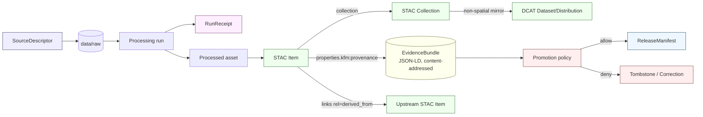

<!-- [KFM_META_BLOCK_V2]
doc_id: kfm://doc/docs-standards-stac
title: STAC — SpatioTemporal Asset Catalog (KFM Adoption Reference)
type: standard
version: v0.1
status: draft
owners: <TODO: docs-standards-owners>
created: 2026-05-14
updated: 2026-05-14
policy_label: public
related:
  - docs/standards/DCAT.md
  - docs/standards/PROV.md
  - docs/standards/STAC_KFM_PROFILE.md
  - docs/standards/Darwin_Core.md
  - contracts/evidence/
  - schemas/contracts/v1/
  - policy/promotion/
tags: [kfm, standards, stac, catalog, provenance]
notes:
  - "kfm: vs ks-kfm: namespace decision is OPEN; see §9."
  - "Path is PROPOSED until repo evidence is mounted."
  - "Distinct from STAC_KFM_PROFILE.md (strict profile + schemas)."
[/KFM_META_BLOCK_V2] -->

# STAC — SpatioTemporal Asset Catalog (KFM Adoption Reference)

> How KFM uses the **SpatioTemporal Asset Catalog (STAC)** spec to catalog spatiotemporal assets, thread provenance through `kfm:` namespaces, and gate publication on validation. This document is the **adoption reference**; the strict profile lives in [`STAC_KFM_PROFILE.md`](./STAC_KFM_PROFILE.md) (PROPOSED).


<!-- Shields above are placeholders; replace with live build/validate badges when CI gates land. -->

**Status:** draft · **Owners:** `<TODO: docs-standards-owners>` · **Last updated:** 2026-05-14

---

## Contents

- [1. Purpose and scope](#1-purpose-and-scope)
- [2. Where this fits](#2-where-this-fits)
- [3. STAC core in 60 seconds](#3-stac-core-in-60-seconds)
- [4. Required STAC fields for KFM ingestion](#4-required-stac-fields-for-kfm-ingestion)
- [5. The KFM STAC profile](#5-the-kfm-stac-profile)
- [6. Provenance and evidence integration](#6-provenance-and-evidence-integration)
- [7. STAC × Darwin Core hybrid (biodiversity)](#7-stac--darwin-core-hybrid-biodiversity)
- [8. Validation and promotion gates](#8-validation-and-promotion-gates)
- [9. Open questions and PROPOSED decisions](#9-open-questions-and-proposed-decisions)
- [10. Worked examples](#10-worked-examples)
- [Related docs](#related-docs)
- [Appendix A — Field reference](#appendix-a--field-reference)

---

## 1. Purpose and scope

This document **explains** how KFM adopts the SpatioTemporal Asset Catalog (STAC) specification across the lifecycle:

```text
RAW → WORK/QUARANTINE → PROCESSED → CATALOG/TRIPLET → PUBLISHED
                                          ▲
                                    STAC lives here
```

> [!NOTE]
> KFM doctrine treats **STAC as the catalog envelope for spatiotemporal assets**, paired with DCAT for non-spatial datasets and the JSON-LD `EvidenceBundle` as the content-addressed provenance object attached to each catalog record. [CONFIRMED — Pass 10 §6.4]

**This document does**:

- Define KFM's adoption posture toward STAC 1.0.0.
- Name the `kfm:` namespace(s) used inside STAC Item and Collection JSON.
- Specify how `EvidenceRef`, `EvidenceBundle`, `RunReceipt`, `SourceDescriptor`, `spec_hash`, and policy digests thread through STAC objects.
- Point at the validator and CI gate that enforces it.

**This document does not**:

- Define the JSON Schema for the profile — that belongs in `schemas/contracts/v1/` per ADR-0001, and the human profile description belongs in [`STAC_KFM_PROFILE.md`](./STAC_KFM_PROFILE.md). [PROPOSED]
- Define DCAT, PROV-O, Darwin Core, or JSON-LD canonicalization — those live in sibling standards docs. [PROPOSED]
- Replace `contracts/` meaning docs for `EvidenceBundle`, `RunReceipt`, etc.

---

## 2. Where this fits



> [!IMPORTANT]
> The diagram shows the **intended responsibility boundaries**. Per Directory Rules §0, any repo-shaped placement (`data/raw/`, `release/`, etc.) is PROPOSED until verified against a mounted repository.

---

## 3. STAC core in 60 seconds

STAC defines three nested JSON object types plus assets and links. KFM uses all of them.

| Object | Role | KFM use |
|---|---|---|
| **Catalog** | Loose grouping; navigational root | Per-deployment root catalog, governance scoping |
| **Collection** | Dataset family with shared metadata, license, extent | Stable handle Items reference; KFM namespace and policy label declared here |
| **Item** | A single GeoJSON `Feature` with spatial geometry, datetime, and assets | Atomic spatiotemporal record; carries `properties.kfm:provenance` |
| **Asset** | A file (COG, GeoParquet, PMTiles, thumbnail, etc.) attached to an Item | Carries `file:checksum`; roles bind renderable vs metadata vs data |
| **Link** | Typed relation to another resource | Carries `derived_from`, `was_generated_by`, evidence-bundle pointers |

> [!TIP]
> Collections are the **stable handle**. Renaming a Collection breaks links throughout the catalog. Treat Collection IDs as identity-bearing, not display strings. [CONFIRMED — Pass 10 §C4-02]

---

## 4. Required STAC fields for KFM ingestion

Every Item promoted into a KFM catalog MUST carry the STAC core fields. Items that fail this check are rejected by the validator (see §8).

| Area | Required fields | KFM relevance |
|---|---|---|
| Identity | `id`, `type`, `stac_version` | Stable EvidenceRef anchoring |
| Spatial | `geometry`, `bbox` | Map-first query integrity |
| Temporal | `properties.datetime` *or* `start_datetime` + `end_datetime` | Time-aware claims |
| Assets | `assets[*].href`, `assets[*].type`, `assets[*].roles` | Durable artifact resolution, role-based rendering |
| Navigation | `links[]` with `rel` set | Traversable lineage; STAC API `/search` traversal |
| Collection | `collection` (Item → Collection backref) | Governance scoping |
| Extensions | `stac_extensions[]` | Validator compatibility for `kfm:*` fields |
| Lifecycle | `properties.license`, `properties.created`, `properties.updated` | Rights + lifecycle posture |

> [!WARNING]
> **Do not invent free-form top-level fields.** STAC clients can drop unknown top-level properties. All KFM extensions live inside `properties` under namespaced keys (`kfm:*`) and declare themselves in `stac_extensions[]`. [INFERRED from STAC core behavior + KFM doctrine]

---

## 5. The KFM STAC profile

The KFM STAC profile extends the STAC core with governance, provenance, and policy fields. Two namespaces are in play:

| Namespace | Role | Status |
|---|---|---|
| `kfm:provenance:*` | Per-Item provenance: `spec_hash`, `evidence_bundle_ref`, `run_record_ref`, `audit_ref`, `policy_digest` | CONFIRMED in doctrine [Pass 10 §C4-01] |
| `kfm:care:*` | CARE / Indigenous data sovereignty fields surfaced from `MetaBlock v2` (steward_org, authority_to_control, consent, obligations, benefit_commitments) | CONFIRMED in doctrine [Pass 10 §C15-02] |
| `file:checksum` | Per-asset SHA-256 (file extension, not KFM-specific) | CONFIRMED — STAC `file` extension |
| `kfm:` vs `ks-kfm:` | Short-name vs Kansas-scoped prefix | **OPEN** — see §9 |

### 5.1 Item shape (skeleton)

```json
{
  "type": "Feature",
  "stac_version": "1.0.0",
  "stac_extensions": [
    "https://stac-extensions.github.io/file/v2.1.0/schema.json",
    "https://stac-extensions.github.io/projection/v1.1.0/schema.json",
    "https://stac-extensions.github.io/processing/v1.1.0/schema.json",
    "kfm://stac/extensions/provenance/v1"
  ],
  "id": "<stable-item-id>",
  "collection": "<stable-collection-id>",
  "geometry": { "type": "Polygon", "coordinates": [ /* ... */ ] },
  "bbox": [/* xmin, ymin, xmax, ymax */],
  "properties": {
    "datetime": "2025-07-01T16:22:09Z",
    "license": "<SPDX-or-policy-ref>",
    "kfm:provenance": {
      "spec_hash": "sha256:...",
      "evidence_bundle_ref": "kfm://bundle/<digest>",
      "run_record_ref":      "kfm://run/<id>",
      "audit_ref":           "kfm://attest/<id>",
      "policy_digest":       "sha256:..."
    }
  },
  "assets": {
    "data": {
      "href": "s3://.../scene.tif",
      "type": "image/tiff; application=geotiff; profile=cloud-optimized",
      "roles": ["data"],
      "file:checksum": "0x..."
    }
  },
  "links": [
    { "rel": "self",       "href": "..." },
    { "rel": "collection", "href": "..." },
    { "rel": "derived_from", "href": "kfm://item/<upstream-id>" }
  ]
}
```

> [!NOTE]
> **PROPOSED.** The extension URL `kfm://stac/extensions/provenance/v1` is illustrative. A real extension URL must resolve to a hosted JSON Schema before CI can enforce it. The exact host, version policy, and namespace short-form (`kfm:` vs `ks-kfm:`) are open per §9.

### 5.2 Collection shape (skeleton)

```json
{
  "type": "Collection",
  "stac_version": "1.0.0",
  "stac_extensions": [
    "kfm://stac/extensions/provenance/v1",
    "kfm://stac/extensions/care/v1"
  ],
  "id": "<stable-collection-id>",
  "title": "<human-readable family name>",
  "description": "Deterministically built <product> with KFM governance.",
  "license": "<SPDX-or-policy-ref>",
  "extent": {
    "spatial":  { "bbox":      [/* ... */] },
    "temporal": { "interval":  [/* ... */] }
  },
  "summaries": {
    "kfm:namespace": "kfm",
    "kfm:policy_label": "<public|restricted|...>"
  },
  "providers": [ /* ... */ ],
  "links": [ /* ... */ ]
}
```

> [!IMPORTANT]
> The Collection `description` should declare both the **deterministic build property** ("Deterministically built …") and the **governance posture** ("…with KFM governance"). This is doctrinal: Collections are also where partners read what a dataset family *is* and how it is built. [CONFIRMED — Pass 10 §C4-02]

---

## 6. Provenance and evidence integration

KFM provenance threads through STAC at three layers — Item properties, asset checksums, and typed links.

```mermaid
flowchart TD
  ITEM[STAC Item.properties]
  ITEM -->|kfm:provenance.evidence_bundle_ref| BUNDLE[EvidenceBundle<br/>JSON-LD, content-addressed]
  ITEM -->|kfm:provenance.run_record_ref|       RUN[RunReceipt]
  ITEM -->|kfm:provenance.audit_ref|            ATT[Signed attestation<br/>SLSA / OPA / cosign]
  ITEM -->|kfm:provenance.policy_digest|        POL[Policy bundle snapshot]
  ITEM -->|kfm:provenance.spec_hash|            SPEC[Deterministic build hash]
  ASSET[Asset.file:checksum] -.->|per-file integrity| BYTES[(Asset bytes)]
  LINKS[Item.links rel=derived_from] -.->|lineage edge| UPSTREAM[Upstream Item]
```

**Rule of thumb.** If a field governs **publication, reproducibility, rights, or sensitivity**, it belongs in `properties.kfm:*`. If it identifies an external resource (upstream Item, receipt, attestation), it belongs in `links[]` with a typed `rel`.

> [!CAUTION]
> An `EvidenceRef` (`kfm://evidence/...` or `kfm://bundle/...`) must resolve to an actual `EvidenceBundle` when claims depend on evidence. A STAC Item whose `evidence_bundle_ref` does not resolve is a **broken-evidence** condition and MUST fail the promotion gate. [CONFIRMED — KFM core invariants; Pass 10 §C5-02 default-deny]

---

## 7. STAC × Darwin Core hybrid (biodiversity)

Biodiversity occurrence records use STAC as the spatiotemporal envelope and Darwin Core (DwC) as the biological semantics carrier. DwC terms live **inside `properties.taxon`**, not at the top level. [CONFIRMED — Pass 10 §C4-03]

```json
{
  "type": "Feature",
  "stac_version": "1.0.0",
  "stac_extensions": [
    "kfm://stac/extensions/provenance/v1",
    "kfm://stac/extensions/biodiversity/v1"
  ],
  "id": "<occurrence-id>",
  "collection": "<biodiversity-collection-id>",
  "geometry": { "type": "Point", "coordinates": [/* lon, lat */] },
  "bbox": [/* ... */],
  "properties": {
    "datetime": "2024-06-12T08:30:00Z",
    "taxon": {
      "scientific_name":  "<binomial>",
      "common_name":      "<vernacular>",
      "itis_tsn":         "<TSN>",
      "gbif_taxon_key":   "<key>",
      "kdwp_status":      "<state-status>",
      "sensitivity_rank": "<rank>"
    },
    "redaction_profile": "<profile-id>",
    "kfm:provenance": { /* see §5.1 */ }
  }
}
```

> [!WARNING]
> Rare-species locations, raptor nest sites, and culturally restricted taxa carry **sensitivity obligations**. Items whose `redaction_profile` requires generalization MUST not publish exact geometry until policy allows it. The default posture is **quarantine, redact, generalize, or deny**, not publish-and-correct. [CONFIRMED — KFM publication/sensitivity rules]

Event records (surveys with effort) follow the DwC `Event` shape with `eventID`, `eventDate`, `samplingProtocol`, `sampleSizeValue`, and linked `MeasurementOrFact` rows. The same `properties.taxon` + `kfm:provenance` pattern applies. [CONFIRMED — Pass 10 §C4-03]

---

## 8. Validation and promotion gates

STAC objects flow through the same gate matrix as every other promoted artifact. The catalog-relevant gates are:

| Gate | Check | Outcome on fail |
|---|---|---|
| **Schema** | Item / Collection validates against STAC 1.0.0 + every URL listed in `stac_extensions` | `ERROR` / quarantine |
| **Meaning** | Required `kfm:provenance` fields present and well-typed | `ERROR` / review |
| **Source** | `SourceDescriptor` exists; source role, rights, cadence, sensitivity known | `DENY` / quarantine |
| **Evidence** | `evidence_bundle_ref` resolves; bundle hash matches | `ABSTAIN` |
| **Spec-hash** | Recomputed `spec_hash` matches claimed `spec_hash` (C5-04) | `DENY` |
| **Policy** | Policy bundle allows exposure given user, purpose, release class | `DENY` |
| **Lifecycle** | Object is in correct lifecycle phase for promotion | `DENY` |
| **Receipt** | `RunReceipt`, `PromotionDecision`, and decision logs present | `ERROR` |
| **Release** | `ReleaseManifest` includes proof, correction path, rollback target | `DENY` |

> [!IMPORTANT]
> Validators MUST exercise **negative paths** — `DENY`, `ABSTAIN`, `ERROR`, quarantine, stale, restricted, review-needed — not only the happy path. A STAC validator that only proves Items validate is incomplete. [CONFIRMED — KFM negative-state rule]

### 8.1 CI gate (PROPOSED)

```yaml
# .github/workflows/stac-validate.yml — PROPOSED
- name: STAC core validate
  run: pystac validate <path>

- name: KFM extension validate
  run: tools/validators/stac_kfm_validate.py <path>

- name: Spec-hash match
  run: tools/validators/spec_hash_match.py <path>

- name: Negative-path fixtures
  run: pytest tests/standards/stac/negative/
```

> [!NOTE]
> **PROPOSED.** Workflow path, validator paths, and the `pystac` / Conftest / OPA toolchain choice are not yet verified against repo state. ADR/repo evidence is required before any of this is cited as the live gate.

---

## 9. Open questions and PROPOSED decisions

| # | Question | Default / preferred | Decides where |
|---|---|---|---|
| 9.1 | Namespace short-form: **`kfm:`** or **`ks-kfm:`**? | `kfm:` (KFM-global) preferred for portability; `ks-kfm:` if Kansas-scoping is required | ADR — see §5 |
| 9.2 | Extension URL host (`kfm://...` vs `https://...`) | Resolvable HTTPS once a host is chosen; `kfm://` accepted internally | ADR / `docs/standards/STAC_KFM_PROFILE.md` |
| 9.3 | Collection ID convention | `kfm-<org>-<product>` (PROPOSED) | STAC profile doc |
| 9.4 | Collection-level `kfm:promotion_state` summary field? | OPEN — would aggregate the highest zone any Item has reached | ADR |
| 9.5 | DwC-A round-trip vs STAC × DwC as canonical form | OPEN | Profile + biodiversity domain doc |
| 9.6 | Submit `kfm:care` upstream to STAC-extensions registry? | OPEN | Governance decision |
| 9.7 | Dual STAC + DCAT registration policy | STAC for spatiotemporal, DCAT for everything else, with a DCAT mirror of every STAC Collection (PROPOSED) | `docs/standards/DCAT.md` |
| 9.8 | Canonical schema home for the profile JSON Schema | `schemas/contracts/v1/standards/stac/` per ADR-0001 (PROPOSED) | ADR-0001 / schema home |

> [!CAUTION]
> Items 9.1 and 9.2 are **blocking** for shipping a fail-closed STAC linter into CI. A linter cannot reject unknown namespaces if the canonical namespace is still ambiguous.

---

## 10. Worked examples

<details>
<summary><b>Example A — Landsat surface-reflectance scene (Item)</b></summary>

```json
{
  "type": "Feature",
  "stac_version": "1.0.0",
  "stac_extensions": [
    "https://stac-extensions.github.io/file/v2.1.0/schema.json",
    "https://stac-extensions.github.io/projection/v1.1.0/schema.json",
    "https://stac-extensions.github.io/processing/v1.1.0/schema.json",
    "kfm://stac/extensions/provenance/v1"
  ],
  "id": "LC09_L2SP_028033_20250701_20250702_02_T1_SR",
  "collection": "kfm-usgs-landsat9-sr",
  "geometry": { "type": "Polygon", "coordinates": [/* ... */] },
  "bbox": [-99.2, 38.1, -97.9, 39.0],
  "properties": {
    "datetime": "2025-07-01T16:22:09Z",
    "license": "PDDL-1.0",
    "proj:epsg": 32614,
    "processing:level": "L2SP",
    "kfm:provenance": {
      "spec_hash":           "sha256:b3a1...",
      "evidence_bundle_ref": "kfm://bundle/0b4c...",
      "run_record_ref":      "kfm://run/aa31...",
      "audit_ref":           "kfm://attest/77f9...",
      "policy_digest":       "sha256:c2d4..."
    }
  },
  "assets": {
    "SR_B4": {
      "href": "s3://kfm/canon/landsat9/.../SR_B4.tif",
      "type": "image/tiff; application=geotiff; profile=cloud-optimized",
      "roles": ["data", "reflectance"],
      "file:checksum": "0x..."
    },
    "thumbnail": {
      "href": "s3://kfm/canon/landsat9/.../thumb.png",
      "type": "image/png",
      "roles": ["thumbnail"]
    }
  },
  "links": [
    { "rel": "self",       "href": "..." },
    { "rel": "collection", "href": "..." },
    { "rel": "derived_from", "href": "kfm://item/LC09_L1TP_028033_20250701..." }
  ]
}
```

</details>

<details>
<summary><b>Example B — Collection skeleton with KFM governance</b></summary>

```json
{
  "type": "Collection",
  "stac_version": "1.0.0",
  "stac_extensions": ["kfm://stac/extensions/provenance/v1"],
  "id": "kfm-usgs-landsat9-sr",
  "title": "USGS Landsat 9 Surface Reflectance (KFM build)",
  "description": "Deterministically built Landsat 9 L2SP surface reflectance scenes over Kansas with KFM governance.",
  "license": "PDDL-1.0",
  "extent": {
    "spatial":  { "bbox":     [[-102.05, 36.99, -94.59, 40.00]] },
    "temporal": { "interval": [["2021-10-31T00:00:00Z", null]] }
  },
  "summaries": {
    "kfm:namespace":    "kfm",
    "kfm:policy_label": "public"
  },
  "providers": [
    { "name": "USGS",                "roles": ["producer", "licensor"] },
    { "name": "Kansas Frontier Matrix", "roles": ["processor", "host"]    }
  ],
  "links": [
    { "rel": "self", "href": "..." },
    { "rel": "root", "href": "..." }
  ]
}
```

</details>

<details>
<summary><b>Example C — Biodiversity occurrence (STAC × Darwin Core hybrid)</b></summary>

```json
{
  "type": "Feature",
  "stac_version": "1.0.0",
  "stac_extensions": [
    "kfm://stac/extensions/provenance/v1",
    "kfm://stac/extensions/biodiversity/v1"
  ],
  "id": "kbs-occ-2024-06-12-00042",
  "collection": "kfm-kbs-vascular-occurrences",
  "geometry": { "type": "Point", "coordinates": [-98.7012, 38.7203] },
  "bbox": [-98.7012, 38.7203, -98.7012, 38.7203],
  "properties": {
    "datetime": "2024-06-12T08:30:00Z",
    "license": "CC-BY-4.0",
    "taxon": {
      "scientific_name":  "Asclepias tuberosa",
      "common_name":      "butterfly milkweed",
      "itis_tsn":         "30317",
      "gbif_taxon_key":   "5414732",
      "kdwp_status":      "secure",
      "sensitivity_rank": "S5"
    },
    "redaction_profile": "public-county-centroid",
    "kfm:provenance": { /* see §5.1 */ }
  }
}
```

</details>

<details>
<summary><b>Example D — Negative-path fixture (broken evidence)</b></summary>

A fixture that **must fail** the validator: the Item declares `evidence_bundle_ref` but the referenced bundle does not exist. Expected gate outcome: `ABSTAIN` from the evidence gate, escalating to `DENY` at promotion.

```json
{
  "type": "Feature",
  "stac_version": "1.0.0",
  "id": "broken-evidence-fixture-01",
  "properties": {
    "datetime": "2025-01-01T00:00:00Z",
    "kfm:provenance": {
      "spec_hash":           "sha256:deadbeef",
      "evidence_bundle_ref": "kfm://bundle/does-not-exist",
      "run_record_ref":      "kfm://run/does-not-exist",
      "audit_ref":           "kfm://attest/does-not-exist",
      "policy_digest":       "sha256:deadbeef"
    }
  }
}
```

</details>

[Back to top](#stac--spatiotemporal-asset-catalog-kfm-adoption-reference)

---

## Related docs

- [`docs/standards/STAC_KFM_PROFILE.md`](./STAC_KFM_PROFILE.md) — strict KFM STAC profile (JSON Schema + required fields). **PROPOSED**.
- [`docs/standards/DCAT.md`](./DCAT.md) — DCAT for non-spatial datasets and DCAT mirror of STAC Collections. **PROPOSED**.
- [`docs/standards/PROV.md`](./PROV.md) — PROV-O / OpenLineage relationship to STAC links. **PROPOSED**.
- [`docs/standards/Darwin_Core.md`](./Darwin_Core.md) — Darwin Core hybridization rules. **PROPOSED**.
- [`docs/standards/Evidence_Bundle.md`](./Evidence_Bundle.md) — content-addressed JSON-LD bundles referenced from STAC. **PROPOSED**.
- [`docs/doctrine/lifecycle-law.md`](../doctrine/lifecycle-law.md) — RAW → PUBLISHED lifecycle.
- [`docs/doctrine/directory-rules.md`](../doctrine/directory-rules.md) — where this document lives and why.
- [`contracts/evidence/`](../../contracts/evidence/) — meaning of `EvidenceRef`, `EvidenceBundle`. **PROPOSED path per ADR-0001**.
- [`schemas/contracts/v1/`](../../schemas/contracts/v1/) — machine-checkable shape. **PROPOSED path per ADR-0001**.

---

## Appendix A — Field reference

<details>
<summary><b>A.1 — <code>properties.kfm:provenance</code> fields</b></summary>

| Field | Type | Source object | Notes |
|---|---|---|---|
| `spec_hash` | `string` (e.g. `sha256:…`) | Deterministic build of the asset spec | Must match recomputed value at the spec-hash gate (C5-04). |
| `evidence_bundle_ref` | URI (`kfm://bundle/<digest>`) | `EvidenceBundle` (JSON-LD, content-addressed) | MUST resolve; broken refs fail the evidence gate. |
| `run_record_ref` | URI (`kfm://run/<id>`) | `RunReceipt` | Links to the run that produced this asset. |
| `audit_ref` | URI (`kfm://attest/<id>`) | Signed attestation (SLSA / OPA / cosign) | Tamper-evident proof of build provenance. |
| `policy_digest` | `string` (e.g. `sha256:…`) | Snapshot of the policy bundle at promotion time | Lets reviewers reconstruct policy state. |

[CONFIRMED structure — Pass 10 §C4-01; field semantics ride alongside core STAC fields as first-class governance carriers.]

</details>

<details>
<summary><b>A.2 — Recommended STAC core extensions</b></summary>

| Extension | Why KFM uses it |
|---|---|
| `file` | Per-asset SHA-256 (`file:checksum`) and size. |
| `projection` | CRS, transform, shape — required for raster lineage. |
| `processing` | `processing:facility`, `processing:version`, `processing:lineage`, `derived_from` URLs. |
| `raster` | Band stats, nodata, dtype for raster assets. |
| `datacube` | When the asset describes a regularly-sampled cube. |
| `eo` | When applicable to satellite imagery. |

[INFERRED appropriateness — Pass 10 + Master MapLibre evidence; exact pinned versions are PROPOSED until set in the profile.]

</details>

<details>
<summary><b>A.3 — Typed link relations used by KFM</b></summary>

| `rel` | Used for |
|---|---|
| `self`, `root`, `parent`, `collection`, `item` | STAC core navigation |
| `derived_from` | Upstream Item this asset was produced from |
| `was_generated_by` | Process / run reference |
| `cite-as` | DOI or formal citation for the asset |
| `kfm:evidence-bundle` | (PROPOSED) Direct link to the `EvidenceBundle` |
| `kfm:run-receipt` | (PROPOSED) Direct link to the `RunReceipt` |
| `kfm:correction-notice` | (PROPOSED) Link to a `CorrectionNotice` if applicable |
| `kfm:rollback-target` | (PROPOSED) Link to the `RollbackCard` for this release |

</details>

---

**Related:** [STAC_KFM_PROFILE.md](./STAC_KFM_PROFILE.md) · [DCAT.md](./DCAT.md) · [Darwin_Core.md](./Darwin_Core.md) · [PROV.md](./PROV.md) · [Evidence_Bundle.md](./Evidence_Bundle.md)
**Last updated:** 2026-05-14
[Back to top](#stac--spatiotemporal-asset-catalog-kfm-adoption-reference)
