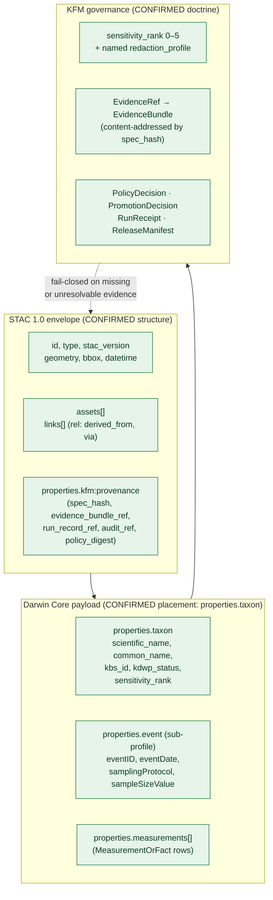
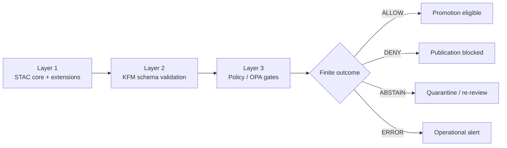

<!-- [KFM_META_BLOCK_V2]
doc_id: kfm://doc/standard.stac-dwc-profile.v1
title: STAC × Darwin Core Hybrid Profile (kfm-stac-dwc-profile-v1)
type: standard
version: v1-draft
status: draft
owners: TODO-catalog-stewards, TODO-fauna-stewards, TODO-flora-stewards
created: 2026-05-14
updated: 2026-05-14
policy_label: public
related:
  - docs/standards/STAC_KFM_PROFILE.md
  - docs/standards/SENSITIVITY_RUBRIC.md
  - docs/standards/EVIDENCE_BUNDLE.md
  - docs/standards/DCAT_PROFILE.md
  - docs/adr/ADR-0001-schema-home.md
  - schemas/contracts/v1/domains/fauna/
  - schemas/contracts/v1/domains/flora/
  - policy/sensitivity/
  - control_plane/object_family_register.yaml
tags: [kfm, stac, darwin-core, biodiversity, catalog, profile]
notes:
  - This document is doctrine; implementation paths are PROPOSED until repo-mounted verification.
  - Namespace choice kfm: vs ks-kfm: is OPEN per C4-01 (Pass 10 Idea Index).
  - DwC-A round-trip canonicalization is OPEN per C4-03 (Pass 10 Idea Index).
[/KFM_META_BLOCK_V2] -->

# STAC × Darwin Core Hybrid Profile

> KFM's profile for encoding biodiversity occurrence and survey-event records as STAC Items whose `properties.taxon` carries Darwin Core semantics — bound to KFM provenance, sensitivity, and release governance.

<!-- Badge row: targets PROPOSED; replace TODOs once CI workflows are confirmed mounted. -->


**Status:** `draft` · **Authority level:** standard (doctrine, not implementation) · **Owners:** `TODO-catalog-stewards`, `TODO-fauna-stewards`, `TODO-flora-stewards` · **Last reviewed:** 2026-05-14

> [!IMPORTANT]
> This file is **doctrine**, not a claim about repository implementation. All concrete paths, schema files, fixture sets, converters, and CI workflow names below are **PROPOSED** until verified against a mounted repo per Directory Rules §0 and §2.5. Mark drift in `docs/registers/DRIFT_REGISTER.md`.

---

## Contents

1. [Purpose & scope](#1-purpose--scope)
2. [Authority basis & truth posture](#2-authority-basis--truth-posture)
3. [Profile at a glance](#3-profile-at-a-glance)
4. [Item shape — required & recommended](#4-item-shape--required--recommended)
5. [The `taxon` object — Darwin Core semantics](#5-the-taxon-object--darwin-core-semantics)
6. [Sub-profiles: Occurrence, Event, MeasurementOrFact](#6-sub-profiles-occurrence-event-measurementorfact)
7. [Sensitivity binding & redaction profiles](#7-sensitivity-binding--redaction-profiles)
8. [KFM provenance & EvidenceRef integration](#8-kfm-provenance--evidenceref-integration)
9. [Collection conventions for biodiversity families](#9-collection-conventions-for-biodiversity-families)
10. [Validation, CI, and finite outcomes](#10-validation-ci-and-finite-outcomes)
11. [DwC-A round-trip — the unsettled question](#11-dwc-a-round-trip--the-unsettled-question)
12. [Worked example (collapsible)](#12-worked-example)
13. [Anti-patterns & PR review heuristics](#13-anti-patterns--pr-review-heuristics)
14. [Open questions](#14-open-questions)
15. [Related docs](#15-related-docs)

---

## 1. Purpose & scope

KFM ingests biodiversity occurrence records (specimen rows, citizen-science checklists, agency survey data) that originate in **Darwin Core** form — primarily as **Darwin Core Archives (DwC-A)** ZIP bundles — and must publish them through a **STAC**-shaped catalog that the rest of KFM's tooling (catalog services, the MapLibre shell, the Evidence Drawer, Focus Mode) already understands.

The hybrid this profile defines is the **operational join point** between those two worlds: STAC anchors the spatial and temporal envelope of every record; Darwin Core, carried inside `properties.taxon`, carries the biological semantics that downstream biodiversity consumers (GBIF, iDigBio, Symbiota) expect.

**In scope**

- Item shape for biodiversity Occurrence records (point, polygon, or generalized geometry).
- Item shape for Darwin Core **Event** records (surveys, transects, checklists) and linked **MeasurementOrFact** rows (counts, effort, detection / non-detection).
- Required `kfm:provenance` block, EvidenceRef linkage, sensitivity rank, and named redaction profile.
- Collection-level conventions for biodiversity dataset families.
- Validation gates that enforce the profile in CI and at promotion.

**Out of scope**

- Person, archaeology, or infrastructure record shapes (see their own profiles).
- The general STAC `kfm:provenance` namespace — defined in [`STAC_KFM_PROFILE.md`](./STAC_KFM_PROFILE.md). This profile **extends** it, it does not redefine it.
- Map style, tile, or rendering decisions (see the LayerManifest / StyleManifest standards).
- Storage backend choice for content-addressed EvidenceBundles (see [`EVIDENCE_BUNDLE.md`](./EVIDENCE_BUNDLE.md)).

> [!NOTE]
> This profile is biodiversity-specific. A STAC Item for a Landsat scene or a hydrology raster does **not** carry a `taxon` object and is **not** governed by this document — it is governed by `STAC_KFM_PROFILE.md`.

---

## 2. Authority basis & truth posture

This profile inherits its authority from the KFM doctrine stack in this order:

1. Lifecycle law, truth posture (cite-or-abstain), trust membrane, authority ladder, watcher-as-non-publisher.
2. Accepted ADRs amending Directory Rules (notably **ADR-0001 — schema home**).
3. [`directory-rules.md`](../doctrine/directory-rules.md) §6 (governance roots), §15 (README contract), §16 (path-validation checklist).
4. The C4 (Catalogs and Metadata Profiles) and C6 (Sensitivity, Redaction, and Geoprivacy) chapters of the KFM Components Pass 10 Idea Index — specifically **C4-01**, **C4-02**, **C4-03**, **C4-04**, **C6-01**, and **C6-02** (all marked CONFIRMED in that index).
5. External standards consulted as **reference vocabulary**, not as KFM-state authority: the STAC 1.0 core specification, the STAC extensions registry, and TDWG Darwin Core. External standards **never** override KFM terminology, lifecycle, or governance.

### Truth-label key for this document

| Label | Use |
|---|---|
| CONFIRMED | Stated in attached KFM doctrine (Pass 10 Idea Index, Domains Atlas, Encyclopedia, MapLibre Master). |
| PROPOSED | Design or path not yet verified against a mounted repo. Repo is not mounted in this session. |
| OPEN | Unresolved by the corpus; documented here as an open question, not a decision. |
| EXTERNAL | Sourced from an external standard (STAC, DwC); used as vocabulary, not as KFM doctrine. |

> [!CAUTION]
> Any statement that says "the repo contains," "the schema file is," or "the validator enforces" is **PROPOSED** until the repo is mounted and inspected. Do not promote any path or filename in this document to fact without an explicit repo check.

---

## 3. Profile at a glance

The hybrid is layered: **STAC** is the envelope, **Darwin Core** is the payload inside `properties.taxon`, and **KFM** wraps both in provenance + sensitivity + release governance.



The diagram describes the **profile**; specific schema files and validators that enforce it remain PROPOSED until repo-verified.

---

## 4. Item shape — required & recommended

Every biodiversity Item under this profile is a **STAC Feature Item** with point, polygon, or generalized geometry. The table below distinguishes STAC-core obligations from the KFM additions this profile mandates.

| Field | Layer | Requirement | Source basis |
|---|---|---|---|
| `id` | STAC | MUST be deterministic and stable across runs | EXTERNAL (STAC) · CONFIRMED (KFM identity rule) |
| `type` = `"Feature"` | STAC | MUST | EXTERNAL (STAC) |
| `stac_version` | STAC | MUST | EXTERNAL (STAC) |
| `geometry`, `bbox` | STAC | MUST; geometry may be redacted per §7 | EXTERNAL (STAC) · CONFIRMED (KFM sensitivity) |
| `properties.datetime` (or `start_datetime` / `end_datetime`) | STAC | MUST be present and explicit | EXTERNAL (STAC) · CONFIRMED (KFM temporal modeling) |
| `properties.taxon` | KFM-DwC | MUST for occurrence Items (see §5) | CONFIRMED (C4-03) |
| `properties.kfm:provenance` | KFM | MUST; contains `spec_hash`, `evidence_bundle_ref`, `run_record_ref`, `audit_ref`, `policy_digest` | CONFIRMED (C4-01) |
| `properties.kfm:sensitivity_rank` | KFM | MUST be in 0–5 (see §7) | CONFIRMED (C6-01) |
| `properties.kfm:redaction_profile` | KFM | MUST be a named, versioned profile when rank > 0 | CONFIRMED (C6-02) |
| `properties.kfm:rights_status` | KFM | MUST; one of `public`, `open`, `controlled`, `restricted`, `unknown` | CONFIRMED (governance doctrine); enumeration PROPOSED |
| `properties.kfm:release_state` | KFM | MUST; one of `unreleased`, `candidate`, `released`, `withdrawn`, `corrected`, `superseded` | PROPOSED (enumeration; New Ideas 5-8-26) |
| `properties.kfm:review_state` | KFM | MUST; one of `draft`, `in_review`, `approved`, `rejected` | PROPOSED (enumeration; New Ideas 5-8-26) |
| `properties.event` | KFM-DwC | MUST when the Item represents a survey event (see §6) | CONFIRMED (C4-03) |
| `properties.measurements[]` | KFM-DwC | MAY accompany Event items; carries MeasurementOrFact rows | CONFIRMED (C4-03) |
| `assets[*].file:checksum` | STAC ext | MUST for any asset that backs a claim | CONFIRMED (C4-01) |
| `stac_extensions[]` | STAC | MUST list every extension whose terms appear, including this profile's URL | EXTERNAL (STAC) |
| `links[]` with `rel: derived_from` / `via` / `evidence` | STAC + KFM | SHOULD link to source Items, EvidenceBundle, and RunReceipt | CONFIRMED (safe-embedding pattern, New Ideas 5-8-26) |

> [!TIP]
> Unknown `rel` values are ignored gracefully by STAC-compliant clients, and namespaced properties (everything under `kfm:*`) remain legal STAC. This is **why** the profile extends rather than forks STAC.

---

## 5. The `taxon` object — Darwin Core semantics

CONFIRMED placement (C4-03): Darwin Core terms live **inside `properties.taxon`**, never as bare top-level properties. This keeps the STAC envelope clean and preserves DwC meaning for downstream consumers.

### 5.1 Minimum required terms

| Term | Type | Notes |
|---|---|---|
| `scientific_name` | string | DwC `scientificName`. MUST resolve against an authority backbone (ITIS/GBIF) when possible. |
| `common_name` | string · OPTIONAL | DwC `vernacularName`. |
| `taxon_id` | string | A stable identifier from the authority backbone (e.g., GBIF `taxonKey`, ITIS `TSN`). |
| `kbs_id` | string · OPTIONAL | Kansas-specific identifier (Kansas Biological Survey). |
| `kdwp_status` | string · OPTIONAL | Conservation status from KDWP (Kansas Department of Wildlife & Parks); informs sensitivity. |
| `sensitivity_rank` | integer 0–5 | Mirrors `properties.kfm:sensitivity_rank` (see §7) — kept on `taxon` so taxonomic-only consumers see it. |

### 5.2 Authority crosswalk

A `taxon` SHOULD also carry a **crosswalk block** linking to one or more upstream authorities so identity is reproducible across versions. Authorities CONFIRMED in the KFM authority ladder include **Wikidata** (universal router), **LCNAF**, **VIAF**, **ISNI**, and **ITIS/GBIF** for taxonomy.

```json
"taxon": {
  "scientific_name": "Notropis topeka",
  "common_name": "Topeka shiner",
  "taxon_id": "gbif:2353756",
  "kdwp_status": "threatened",
  "sensitivity_rank": 4,
  "crosswalk": {
    "itis_tsn": "163331",
    "gbif_taxon_key": "2353756",
    "wikidata_qid": "Q1267828"
  }
}
```

> [!NOTE]
> The example above is **illustrative**. Specific identifier values must come from the authority lookup at ingest time, recorded in the EvidenceBundle, and pinned by `spec_hash`. Do not copy these identifiers into a fixture without verifying them.

---

## 6. Sub-profiles: Occurrence, Event, MeasurementOrFact

C4-03 (CONFIRMED) extends the hybrid beyond bare occurrences. The corpus is explicit that surveys (DwC **Event** records) and counts/effort metrics (DwC **MeasurementOrFact** rows) belong inside the same STAC envelope, attached to the Item that anchors them spatially and temporally.

### 6.1 Occurrence sub-profile

The default. An Item with `properties.taxon` and a single `geometry` + `datetime`. Three release variants follow the Fauna / Flora domain object families (CONFIRMED in the Domains Culmination Atlas v1.1):

| Variant | Geometry posture | Public? |
|---|---|---|
| **Occurrence Evidence** | Exact source geometry as delivered | No — held in `data/processed/` or `data/catalog/`, never published raw |
| **Occurrence Restricted** | Exact geometry retained but access-gated | No public surface |
| **Occurrence Public** | Geometry transformed per the named `redaction_profile` | Yes, only when `release_state = released` |

### 6.2 Event sub-profile

When the record represents a **survey** (transect, checklist, sampling visit) rather than a single point-in-time observation, the Item carries `properties.event`:

| DwC term | Type | Notes |
|---|---|---|
| `eventID` | string | DwC `eventID`. MUST be stable. |
| `eventDate` | string (ISO 8601) | DwC `eventDate`. |
| `samplingProtocol` | string | DwC `samplingProtocol`. |
| `sampleSizeValue` | number · OPTIONAL | DwC `sampleSizeValue`. |
| `sampleSizeUnit` | string · OPTIONAL | DwC `sampleSizeUnit`. |
| `samplingEffort` | string · OPTIONAL | DwC `samplingEffort` — important for inferring non-detection. |

### 6.3 MeasurementOrFact rows

Counts, effort, seasonal status, and **detection / non-detection** are encoded as a `properties.measurements[]` array. Each entry follows the DwC ExtendedMeasurementOrFact pattern but lives inline (vs. a separate CSV row in DwC-A):

```json
"measurements": [
  {
    "measurementType": "individualCount",
    "measurementValue": "12",
    "measurementUnit": "individuals"
  },
  {
    "measurementType": "occurrenceStatus",
    "measurementValue": "present"
  },
  {
    "measurementType": "samplingEffortMinutes",
    "measurementValue": "30",
    "measurementUnit": "minutes"
  }
]
```

> [!NOTE]
> The detection / non-detection distinction is what makes complete checklists (e.g., eBird) analytically valuable. Items that lack a recorded effort SHOULD NOT be presented as evidence of absence — they are evidence of "not observed." Downstream consumers MUST inspect `samplingEffort` and `occurrenceStatus` together.

---

## 7. Sensitivity binding & redaction profiles

The C6-01 **Sensitivity Rubric 0–5** (CONFIRMED) is the single source of truth for what a biodiversity Item may expose publicly. The profile MUST set both `properties.kfm:sensitivity_rank` and (when rank > 0) a named, versioned `properties.kfm:redaction_profile` from the C6-02 catalog.

| Rank | Class | Default profile | Map / timeline exposure |
|---|---|---|---|
| 0 | public / open | `kfm:redact:none` | Exact geometry permitted |
| 1 | common, non-sensitive | `kfm:redact:none` | Exact geometry permitted |
| 2 | watchlist | `point_3km_jitter_v1` (default) | Seeded jitter only |
| 3 | SINC / locally sensitive | `profile:sinc-obscure-10km` (default) | 10 km grid generalization |
| 4 | threatened / rare | strict mask **or** embargo | Public release requires steward review |
| 5 | sacred / critical | fail-closed | **No** map or timeline exposure permitted |

> [!WARNING]
> Rank 5 is **fail-closed**. A profile MUST NOT publish a rank-5 Item to a public surface, regardless of any release-state setting. The OPA promotion gate MUST default to DENY for rank 5; the renderer MUST NOT plot rank-5 geometry; the Evidence Drawer MUST return a DENY decision rather than a fluent popup.

### 7.1 Named redaction profiles (CONFIRMED, C6-02)

Profiles are referenced by **stable identifier + version**, never by inline parameters. Reference identifiers documented in the corpus include:

- `point_10km_hex_seeded_v1` — hex-grid generalization, record-id-seeded
- `point_3km_jitter_v1` — seeded, reproducible jitter
- `centroid_1km_v1` — centroid generalization within a 1 km buffer
- `profile:sinc-obscure-10km` — default for rank 3 (SINC / locally sensitive)
- `kfm:redact:none` — do-nothing profile for ranks 0–1

PROPOSED home for the profile catalog: **`policy/redaction/profiles.yaml`** with per-profile verifiers under `policy/redaction/verifiers/`. The catalog and verifiers MUST round-trip the named profile back to its parameters from the receipt — determinism is the testable invariant.

### 7.2 Rare-species deny register

CONFIRMED in the encyclopedia's deny-by-default register: **rare species → DENY public exact location; generalized public products only**, with geoprivacy transform receipt and steward review. This profile carries that policy in two places — the rank on the Item, and the named redaction profile that materializes it — so the obligation is visible to every reader, not just to the policy engine.

---

## 8. KFM provenance & EvidenceRef integration

C4-01 (CONFIRMED) requires every STAC Item under KFM governance to carry `item.properties.kfm:provenance` with five fields. This profile inherits that requirement unchanged and adds the biodiversity-specific bindings.

### 8.1 The provenance block

```json
"kfm:provenance": {
  "spec_hash": "sha256:…",
  "evidence_bundle_ref": "kfm://entity-bundle/<sha256>",
  "run_record_ref": "kfm://run/<id>",
  "audit_ref": "kfm://audit/<id>",
  "policy_digest": "sha256:…"
}
```

| Field | Role |
|---|---|
| `spec_hash` | Canonical content fingerprint over the normalized spec (CONFIRMED algorithm: SHA-256 for v1). |
| `evidence_bundle_ref` | Pointer to a content-addressed JSON-LD EvidenceBundle (C4-04). Resolution is fail-closed: a missing or mismatched bundle MUST trigger ABSTAIN (validation) or DENY (policy). |
| `run_record_ref` | Pointer to the immutable RunReceipt that produced this Item. |
| `audit_ref` | Pointer to SLSA / OPA attestation evidence. |
| `policy_digest` | Digest of the policy set in effect at promotion time. |

### 8.2 Safe EvidenceRef embedding (CONFIRMED pattern)

A second, lighter-weight pointer pattern uses STAC `links[]` so that naive STAC clients still traverse lineage even if they ignore the `kfm:` namespace:

```json
"links": [
  { "rel": "derived_from", "href": "kfm://evidence/ev_001" },
  { "rel": "via",          "href": "kfm://bundle/bundle_002" },
  { "rel": "receipt",      "href": "kfm://run/run_017" }
],
"properties": {
  "kfm:evidence_bundle": "bundle_002"
}
```

Why this survives downstream tooling: unknown `rel` values are ignored gracefully, namespaced properties remain legal STAC, geometry/time indexing is unaffected, and search backends don't need schema rewrites.

> [!CAUTION]
> Do **not** invent arbitrary top-level keys, nested opaque provenance blobs, or non-namespaced custom properties. Do **not** replace STAC `links` semantics with proprietary arrays. These patterns break STAC tooling and have been flagged in the corpus as anti-patterns.

### 8.3 Namespace — the open choice

| Choice | Pros | Cons | Source |
|---|---|---|---|
| `kfm:` | Compact, globally distinctive enough, aligns with STAC extension conventions | Not Kansas-scoped if ever federated | New Ideas 5-8-26 recommends this |
| `ks-kfm:` | Kansas-scoped | Slightly longer | C4-01 (Pass 10) names this as the alternative |

**OPEN**: the namespace choice is not settled in the corpus. PROPOSED default: **`kfm:`**, with the choice pinned in this profile and in every STAC Collection summary. An ADR is required to formalize the decision before the profile graduates from `draft` to `published`.

---

## 9. Collection conventions for biodiversity families

C4-02 (CONFIRMED): a STAC Collection names the dataset family, declares temporal and spatial extent, and describes both the **deterministic build property** and the **governance posture**. For biodiversity Collections, this profile adds three obligations:

1. **Collection id convention.** PROPOSED form: `kfm-<authority>-<product>` (e.g., `kfm-kdwp-occurrences`, `kfm-ksherbaria-flora`). Collection ids MUST NOT be reused; renaming a Collection is a breaking change requiring a correction notice.
2. **`summaries.kfm:namespace`.** The Collection MUST declare which namespace (`kfm:` or `ks-kfm:`) its Items use, so STAC linters can validate without guessing.
3. **`summaries.kfm:sensitivity_floor`.** The Collection MUST declare the **highest** sensitivity rank any Item in it may carry, so consumers can filter at the Collection level without fetching every Item.

> [!NOTE]
> Whether Collections should also carry a `kfm:promotion_state` field summarizing the highest lifecycle zone reached by any Item is an **OPEN** question in the corpus. Not specified here.

---

## 10. Validation, CI, and finite outcomes

The profile is enforceable in three layers (PROPOSED CI architecture, summarized from New Ideas 5-8-26):



| Layer | What it checks | PROPOSED tooling |
|---|---|---|
| 1 — STAC core | `id`, `type`, `geometry`, `datetime`, asset roles, link `rel` correctness | `pystac` · `stac-validator` · `stac-check` |
| 2 — KFM schema | `kfm:provenance` block shape, `taxon` shape, redaction-profile-name validity, `spec_hash` format, release/review enum membership | `ajv` against `schemas/contracts/v1/domains/fauna/...` and `schemas/contracts/v1/domains/flora/...` (PROPOSED paths per ADR-0001) |
| 3 — Policy | Sensitivity-rank-to-redaction-profile consistency, rights-status admissibility, default-deny on rank ≥ 4, evidence-bundle resolution success | OPA / Rego bundles under `policy/` (PROPOSED) |

### 10.1 The negative-state rule

Validators MUST exercise their DENY / ABSTAIN / ERROR paths on real fixtures, not just their happy paths. PROPOSED fixture homes:

- `tests/fixtures/stac-dwc/valid/` — minimum-viable occurrence Items, Event Items, Collections.
- `tests/fixtures/stac-dwc/invalid/` — missing `taxon`, missing `kfm:provenance`, rank/profile mismatch, geometry-precision-vs-rank violations, broken authority crosswalks.

### 10.2 Finite outcomes

CONFIRMED doctrine: the profile's validation pipeline returns **only** the four finite outcomes — `ALLOW`, `DENY`, `ABSTAIN`, `ERROR`. Fluent generated text is never a substitute. The Evidence Drawer, Focus Mode, and the renderer all consume those four outcomes uniformly.

---

## 11. DwC-A round-trip — the unsettled question

C4-03 (CONFIRMED tension): Darwin Core has its own canonical archive format, the **Darwin Core Archive (DwC-A)** — a structured ZIP bundle with a meta.xml index, a core occurrence (or event) CSV, and extension CSVs. KFM ingest pipelines must convert to and from DwC-A.

> [!IMPORTANT]
> **OPEN question** flagged in the Pass 10 Idea Index: *Is the canonical KFM occurrence record the STAC × DwC hybrid or the DwC-A archive?* The corpus's stated requirement is that **the two MUST agree byte-for-byte after canonicalization** — but it does not pick a side. This profile defers the decision to an ADR.

### Recommended posture until that ADR lands

- Treat **STAC × DwC** as the canonical **catalog** form (it carries the KFM governance fields DwC-A cannot).
- Treat **DwC-A** as the canonical **interchange** form for partners (GBIF, iDigBio, herbaria).
- Build a **single converter** with bidirectional fixtures and a hash-equivalence test. PROPOSED home: `tools/dwc-a-converter/`, with golden fixtures under `tests/fixtures/dwc-a-roundtrip/`.

Until the converter and parity tests exist and a deciding ADR is accepted, **both forms remain authoritative for their own surface** and the profile carries this as a known DRIFT candidate.

---

## 12. Worked example

<details>
<summary><strong>Click to expand:</strong> a single rank-3 Occurrence Public Item with seeded jitter, full provenance, and Event linkage. Illustrative — values are NOT copied from a real record.</summary>

```json
{
  "type": "Feature",
  "stac_version": "1.0.0",
  "stac_extensions": [
    "https://stac-extensions.github.io/file/v2.1.0/schema.json",
    "https://stac-extensions.github.io/projection/v1.1.0/schema.json",
    "https://stac-extensions.github.io/processing/v1.1.0/schema.json",
    "https://stac.kfm.example/kfm-stac-dwc-profile-v1/schema.json"
  ],
  "id": "kfm-kbs-occ-3f9a2b…",
  "collection": "kfm-kbs-occurrences",
  "geometry": {
    "type": "Point",
    "coordinates": [-97.213, 38.674]
  },
  "bbox": [-97.218, 38.669, -97.208, 38.679],
  "properties": {
    "datetime": "2024-06-12T14:30:00Z",

    "taxon": {
      "scientific_name": "Notropis topeka",
      "common_name": "Topeka shiner",
      "taxon_id": "gbif:2353756",
      "kdwp_status": "threatened",
      "sensitivity_rank": 3,
      "crosswalk": {
        "itis_tsn": "163331",
        "gbif_taxon_key": "2353756",
        "wikidata_qid": "Q1267828"
      }
    },

    "event": {
      "eventID": "kbs-survey-2024-0612-rcck",
      "eventDate": "2024-06-12",
      "samplingProtocol": "seine-haul",
      "sampleSizeValue": 30,
      "sampleSizeUnit": "minutes"
    },

    "measurements": [
      { "measurementType": "individualCount",       "measurementValue": "4" },
      { "measurementType": "occurrenceStatus",      "measurementValue": "present" },
      { "measurementType": "samplingEffortMinutes", "measurementValue": "30", "measurementUnit": "minutes" }
    ],

    "kfm:provenance": {
      "spec_hash":           "sha256:af1c…",
      "evidence_bundle_ref": "kfm://entity-bundle/sha256-af1c…",
      "run_record_ref":      "kfm://run/run_2024_06_12_kbs_017",
      "audit_ref":           "kfm://audit/audit_2024_06_12_017",
      "policy_digest":       "sha256:b7e2…"
    },

    "kfm:sensitivity_rank":  3,
    "kfm:redaction_profile": "profile:sinc-obscure-10km@v1",
    "kfm:rights_status":     "controlled",
    "kfm:review_state":      "approved",
    "kfm:release_state":     "released",
    "kfm:evidence_bundle":   "kfm://bundle/bundle_002"
  },
  "assets": {
    "occurrence_row": {
      "href":          "data/published/biodiversity/kbs/occ-3f9a2b.json",
      "type":          "application/json",
      "roles":         ["data"],
      "file:checksum": "1220…"
    }
  },
  "links": [
    { "rel": "self",         "href": "./occ-3f9a2b.json" },
    { "rel": "collection",   "href": "../collection.json" },
    { "rel": "derived_from", "href": "kfm://evidence/ev_001" },
    { "rel": "via",          "href": "kfm://bundle/bundle_002" },
    { "rel": "receipt",      "href": "kfm://run/run_2024_06_12_kbs_017" }
  ]
}
```

</details>

> [!NOTE]
> Geometry shown is a **post-redaction** coordinate produced by `profile:sinc-obscure-10km@v1`. The exact pre-redaction coordinate is held in the EvidenceBundle and is never published.

---

## 13. Anti-patterns & PR review heuristics

### 13.1 Anti-patterns

| Anti-pattern | Why it fails | Correct posture |
|---|---|---|
| DwC terms at the top level of `properties` (e.g., `properties.scientificName`) | Pollutes STAC envelope, breaks downstream filters | Nest under `properties.taxon` |
| Bare top-level non-namespaced keys (e.g., `properties.evidence_ref`) | STAC clients may drop unknown top-level properties | Use `properties.kfm:evidence_bundle` |
| Inline redaction parameters (e.g., `"jitter_meters": 3000`) | Untrackable across diffs; not testable | Reference a named, versioned profile id |
| Publishing an Item from `data/work/` directly | Skips lifecycle promotion gates | All Items pass through `data/processed/` → `data/catalog/` → release |
| Treating AI-generated description as evidence | Generation is interpretive, not authoritative | EvidenceBundle outranks generated text |
| Plotting rank-5 geometry "for review purposes" | Rank 5 is fail-closed by definition | Suppress at the renderer, return DENY at the API |

### 13.2 Reviewer heuristics (from the corpus)

Before approving a PR that adds or modifies a STAC × DwC Item:

- Validate against the official STAC schemas and this profile's schema.
- Verify every `stac_extensions[]` URL resolves.
- Ensure every derived Item has lineage links (`derived_from`, `via`, or `receipt`).
- Confirm every EvidenceRef resolves to a governed record.
- Reject any reference to `data/raw/` or `data/work/` from a published Item.
- Verify sensitivity posture before any public geometry exposure.
- Ensure asset `type` (MIME) values are explicit.
- Require deterministic ids and immutable provenance references.

[Back to top ↑](#stac--darwin-core-hybrid-profile)

---

## 14. Open questions

These are explicitly **not resolved** by this document and should be tracked in `docs/registers/VERIFICATION_BACKLOG.md`:

- **OPEN — namespace choice:** `kfm:` (recommended in New Ideas 5-8-26) vs `ks-kfm:` (named as alternative in C4-01). ADR required to pin.
- **OPEN — canonical form for occurrences:** STAC × DwC hybrid vs DwC-A; the two MUST be byte-equivalent after canonicalization, but a canonical side has not been chosen.
- **OPEN — JSON-LD canonicalization algorithm for the EvidenceBundle that backs these Items:** JCS vs URDNA2015 (the corpus discusses both without committing).
- **OPEN — Collection `kfm:promotion_state` summary field:** desirable but not specified.
- **OPEN — extension URL hosting:** where the JSON Schema for `kfm-stac-dwc-profile-v1` lives (e.g., `https://stac.kfm.example/kfm-stac-dwc-profile-v1/schema.json` is **illustrative**).
- **OPEN — non-detection semantics:** how strictly downstream consumers must consult `samplingEffort` before treating an absent species as a true absence — biology, not just schema.
- **NEEDS VERIFICATION — schema homes:** all `schemas/contracts/v1/domains/{fauna,flora}/...` paths in this document are PROPOSED defaults per ADR-0001 until the repo is mounted and inspected.
- **NEEDS VERIFICATION — fixture homes:** `tests/fixtures/stac-dwc/{valid,invalid}/` and `tests/fixtures/dwc-a-roundtrip/` are PROPOSED.
- **NEEDS VERIFICATION — converter home:** `tools/dwc-a-converter/` is PROPOSED.
- **NEEDS VERIFICATION — CI workflow names:** any badge labelled `stac-dwc-validate` is illustrative.

---

## 15. Related docs

- [`docs/standards/STAC_KFM_PROFILE.md`](./STAC_KFM_PROFILE.md) — base STAC profile (`kfm:provenance` namespace) that this profile extends · **PROPOSED** path
- [`docs/standards/SENSITIVITY_RUBRIC.md`](./SENSITIVITY_RUBRIC.md) — C6-01 rubric in full, including non-biodiversity extensions · **PROPOSED** path
- [`docs/standards/EVIDENCE_BUNDLE.md`](./EVIDENCE_BUNDLE.md) — JSON-LD bundle shape, content-addressing, JCS/URDNA2015 decision · **PROPOSED** path
- [`docs/standards/DCAT_PROFILE.md`](./DCAT_PROFILE.md) — DCAT distribution profile for non-spatiotemporal data, including the `kfm:care` extension · **PROPOSED** path
- [`docs/doctrine/directory-rules.md`](../doctrine/directory-rules.md) — placement law (§6.1 places this file in `docs/standards/`)
- [`docs/adr/ADR-0001-schema-home.md`](../adr/ADR-0001-schema-home.md) — default schema home is `schemas/contracts/v1/...`
- [`docs/domains/fauna/README.md`](../domains/fauna/README.md) — fauna domain dossier (Taxon, Occurrence Evidence/Restricted/Public, RangePolygon, MigrationRoute, SensitiveSite) · **PROPOSED** path
- [`docs/domains/flora/README.md`](../domains/flora/README.md) — flora domain dossier (Plant Taxon, Flora Occurrence, SpecimenRecord, Rare Plant Record) · **PROPOSED** path
- [`control_plane/object_family_register.yaml`](../../control_plane/object_family_register.yaml) — canonical object-family ledger · **PROPOSED** path
- External (reference, not authority): the STAC 1.0 core specification and extensions registry; TDWG Darwin Core terms.

---

**Profile version:** `kfm-stac-dwc-profile-v1` (draft) · **Last reviewed:** 2026-05-14 · **Owners:** `TODO-catalog-stewards`, `TODO-fauna-stewards`, `TODO-flora-stewards` · **Cite as:** `docs/standards/STAC_DWC_PROFILE.md`

[Back to top ↑](#stac--darwin-core-hybrid-profile)
