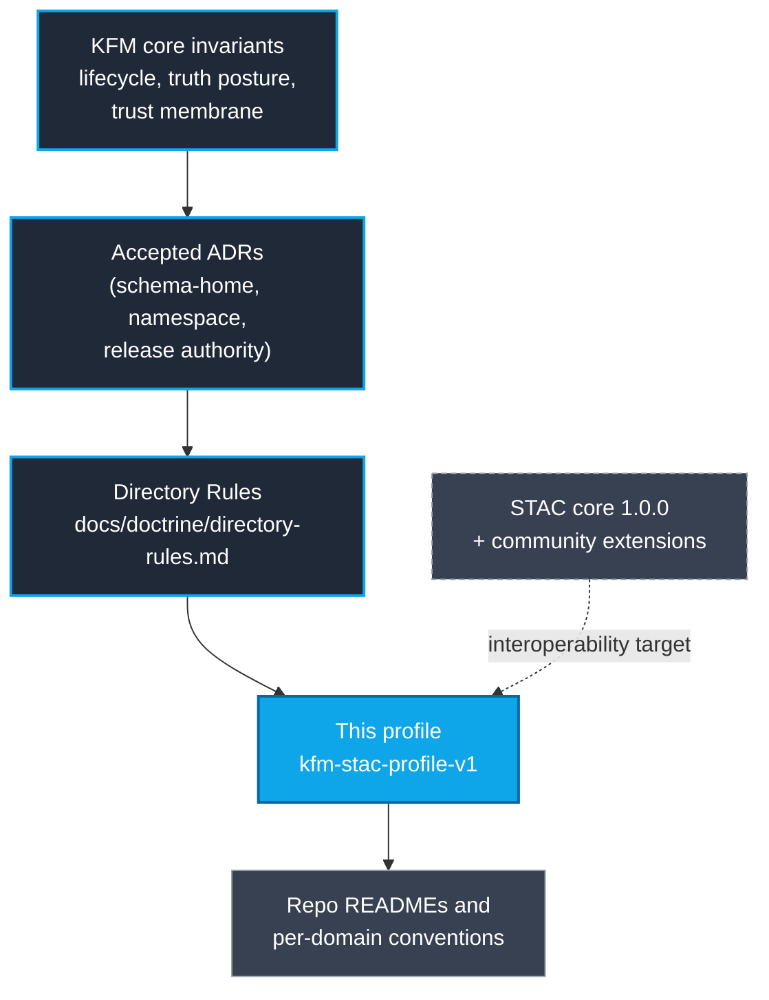
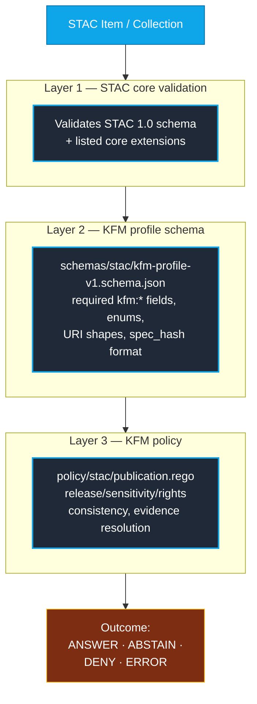

<!-- [KFM_META_BLOCK_V2]
doc_id: kfm://doc/standards/stac-kfm-profile
title: STAC KFM Profile (kfm-stac-profile-v1)
type: standard
version: v1
status: draft
owners: [docs-steward, catalog-steward]
created: 2026-05-14
updated: 2026-05-14
policy_label: public
related:
  - docs/doctrine/directory-rules.md
  - docs/doctrine/truth-posture.md
  - docs/doctrine/lifecycle-law.md
  - docs/architecture/contract-schema-policy-split.md
  - docs/standards/STAC_DWC_PROFILE.md
  - docs/standards/EVIDENCE_BUNDLE.md
  - schemas/stac/kfm-profile-v1.schema.json
  - policy/stac/publication.rego
tags: [kfm, stac, profile, catalog, provenance, governance]
notes:
  - All quoted repo paths are PROPOSED until verified against mounted-repo evidence.
  - Namespace decision (`kfm:`) is PROPOSED pending ADR per C4-01 open question.
[/KFM_META_BLOCK_V2] -->

# STAC KFM Profile — `kfm-stac-profile-v1`

> **The interoperable STAC envelope that KFM Items and Collections MUST satisfy to be cataloged, validated, and considered for promotion. STAC remains the discovery envelope; the EvidenceBundle remains the truth object; policy decides admissibility.**


| Status | Owners | Last reviewed |
|---|---|---|
| `draft` (v1) | Docs steward · Catalog steward | 2026-05-14 |

---

## Quick links

- [1. Scope and posture](#1-scope-and-posture)
- [2. Authority and source hierarchy](#2-authority-and-source-hierarchy)
- [3. The `kfm:` namespace](#3-the-kfm-namespace)
- [4. Required Item-level fields](#4-required-item-level-fields)
- [5. Required Collection-level fields](#5-required-collection-level-fields)
- [6. Asset-level requirements](#6-asset-level-requirements)
- [7. Link relations](#7-link-relations)
- [8. Controlled vocabularies](#8-controlled-vocabularies)
- [9. Validation architecture](#9-validation-architecture)
- [10. Worked example — minimal Item](#10-worked-example--minimal-item)
- [11. CI gate contract](#11-ci-gate-contract)
- [12. Repository layout (PROPOSED)](#12-repository-layout-proposed)
- [13. Anti-patterns](#13-anti-patterns)
- [14. Open questions and unresolved decisions](#14-open-questions-and-unresolved-decisions)
- [15. Related docs](#15-related-docs)
- [Appendix A — Vocabulary reference](#appendix-a--vocabulary-reference)
- [Appendix B — Link relation reference](#appendix-b--link-relation-reference)

---

## 1. Scope and posture

**CONFIRMED** doctrine. KFM uses the SpatioTemporal Asset Catalog (STAC) 1.0.0 specification as its catalog envelope for spatiotemporal assets. This profile — **`kfm-stac-profile-v1`** — defines the KFM-specific requirements layered on top of STAC core: required namespaced properties, controlled vocabularies, asset-integrity expectations, link relations, and the validation contract that gates promotion and publication.

The posture is deliberately additive:

- KFM **does not fork** STAC. Items and Collections that satisfy this profile remain valid STAC 1.0 artifacts and remain consumable by standard STAC tooling (`pystac`, `stac-fastapi`, `pgstac`, STAC Browser, TiTiler).
- KFM-specific fields ride in the namespaced `kfm:` properties block on Items and Collections; KFM-specific lineage rides in `links[]` with documented `rel` values.
- The profile enforces **governance posture** (rights, sensitivity, review state, release state) and **content addressing** (`spec_hash`, evidence references), not new geospatial semantics.

> [!IMPORTANT]
> STAC is the discovery envelope, not the truth object. The reconstructable truth lives in the **EvidenceBundle** that an Item points at. Policy decides admissibility. Release state governs exposure. Corrections never erase lineage.

### 1.1 In scope

- The shape, required fields, vocabularies, and link relations of KFM STAC Items and Collections.
- The relationship between STAC records and KFM evidence artifacts (`EvidenceRef`, `EvidenceBundle`, `RunReceipt`).
- The CI validation contract for the profile.

### 1.2 Out of scope

- DCAT distributions for non-spatiotemporal datasets — see `docs/standards/DCAT_KFM_PROFILE.md` *(PROPOSED — not yet authored)*.
- Darwin Core hybrid for biodiversity occurrences — see `docs/standards/STAC_DWC_PROFILE.md` *(PROPOSED — not yet authored)*.
- The EvidenceBundle schema and JSON-LD canonicalization — see `docs/standards/EVIDENCE_BUNDLE.md` *(PROPOSED — not yet authored)*.
- Tile, mosaic, and rendering manifests — these are downstream of catalog promotion; see `contracts/release/` *(PROPOSED home)*.

---

## 2. Authority and source hierarchy

This profile sits below KFM doctrine and above STAC tooling defaults.



> [!NOTE]
> **PROPOSED** diagram. The authority hierarchy is CONFIRMED doctrine; the visual is one rendering and may be refined as additional standards profiles (`STAC_DWC_PROFILE`, `DCAT_KFM_PROFILE`, `EVIDENCE_BUNDLE`) land.

---

## 3. The `kfm:` namespace

### 3.1 Decision

**PROPOSED.** The profile uses the short, repository-global namespace prefix **`kfm:`** in STAC `properties` keys and reserved link relation suffixes.

| Aspect | Value |
|---|---|
| Prefix | `kfm:` |
| Profile identifier | `kfm-stac-profile-v1` |
| Profile schema URL | `https://kfm.org/stac/kfm-stac-profile-v1/schema.json` *(PROPOSED placeholder URL; pending ADR on canonical extension hosting)* |
| In `stac_extensions[]` | Listed alongside core community extensions (`projection`, `checksum`, etc.) |

> [!CAUTION]
> The Pass 10 dossier (C4-01) records an **open question**: should the namespace be `kfm:` (short, KFM-global) or `ks-kfm:` (Kansas-scoped)? The supplementary planning notes recommend `kfm:` for compactness and stability. This profile adopts `kfm:` as **PROPOSED canonical** pending an ADR that pins the choice. If `ks-kfm:` is later chosen, every example and validator below changes mechanically — semantics do not.

### 3.2 Why a profile, not new top-level fields

STAC clients drop unknown top-level properties. Putting governance fields under `properties.kfm:*` and listing the profile in `stac_extensions[]` keeps records:

- Valid against STAC 1.0 schema.
- Indexable by standard `/search` endpoints.
- Traversable by clients that ignore unknown namespaces.
- Enforceable by KFM-aware validators that *do* understand the namespace.

---

## 4. Required Item-level fields

Every Item carrying the `kfm-stac-profile-v1` identifier in `stac_extensions[]` **MUST** include the following fields under `properties`. Missing or empty values fail the profile validator and block promotion.

| Field | Type | Purpose | Source authority |
|---|---|---|---|
| `kfm:evidence_ref` | `string` (`kfm://evidence/...` URI) | Stable reference resolving to an `EvidenceBundle` | `contracts/evidence/` |
| `kfm:evidence_bundle` | `string` (`kfm://bundle/...` URI) | Direct content-addressed bundle pointer | `contracts/evidence/` |
| `kfm:run_receipt` | `string` (`kfm://run/...` URI) | Signed `RunReceipt` for the producing activity | `contracts/runtime/` |
| `kfm:spec_hash` | `string` (`sha256:<hex>`) | Canonical deterministic identity fingerprint | `contracts/common/` |
| `kfm:source_role` | `enum` — see §8.1 | What kind of source produced this Item | `policy/sources/` |
| `kfm:rights_status` | `enum` — see §8.2 | Rights posture | `policy/rights/` |
| `kfm:sensitivity` | `enum` — see §8.3 | Sensitivity tier and redaction obligation | `policy/sensitivity/` |
| `kfm:review_state` | `enum` — see §8.4 | Steward review posture | `contracts/governance/` |
| `kfm:release_state` | `enum` — see §8.5 | Publication posture | `contracts/release/` |

> [!NOTE]
> **CONFIRMED** vocabulary set (rights, sensitivity, review, release states are doctrine across the KFM corpus). **PROPOSED** binding to the exact field names above — pending namespace ADR resolution.

### 4.1 Recommended additional fields

These **SHOULD** be present where they apply but are not strictly required by the profile validator. Specific domains MAY require them.

| Field | When required |
|---|---|
| `kfm:source_id` | When the Item derives from a registered `SourceDescriptor` |
| `kfm:dataset_version_id` | When the Item belongs to a versioned `DatasetVersion` |
| `kfm:policy_label` | When access policy is more granular than `rights_status` alone |
| `kfm:redaction_profile` | When the Item was published under a named redaction profile |
| `kfm:temporal_role` | Distinguishes observed / valid / source / retrieval / release time |

---

## 5. Required Collection-level fields

STAC Collections aggregate Items and are the right place to declare family-level governance. The following fields **MUST** appear on Collections that carry KFM Items.

| Field | Type | Purpose |
|---|---|---|
| `kfm:collection_role` | `enum` (`observation` / `derived` / `reference` / `mixed`) | Family-level source-role disposition |
| `kfm:rights_status` | `enum` (see §8.2) | Default rights posture for the family |
| `kfm:sensitivity_baseline` | `enum` (see §8.3) | Lowest-allowed sensitivity for member Items |
| `kfm:release_state` | `enum` (see §8.5) | Family-level release state |
| `kfm:domain` | `string` | KFM domain segment (e.g., `hydrology`, `fauna`) |
| `summaries.kfm:source_role` | `array` | The set of source-roles actually present in member Items |

> [!TIP]
> Collection IDs are stable handles. Renaming a Collection breaks every link in the catalog that references it. Pin Collection IDs early using the convention `kfm-<domain>-<product>` *(PROPOSED — see C4-02 expansion direction)*.

---

## 6. Asset-level requirements

Each entry in `assets` **MUST** provide enough information for downstream clients and KFM gates to verify bytes and resolve provenance.

```mermaid
flowchart LR
    A["STAC Item"]:::item -->|properties.kfm:*| G["Governance posture<br/>rights · sensitivity ·<br/>review · release"]:::gov
    A -->|links[]| L["Lineage<br/>derived_from · prov ·<br/>correction · rollback"]:::lin
    A -->|assets.*| AS["Assets<br/>href · alternate ·<br/>checksum · roles"]:::asset
    AS -->|checksum:multihash| H["Byte integrity<br/>BLAKE3 / SHA-256"]:::hash
    L -->|resolves| EB["EvidenceBundle<br/>(content-addressed)"]:::ev
    G -->|enforced by| P["policy/stac/<br/>publication.rego"]:::pol

    classDef item fill:#0ea5e9,color:#fff,stroke:#0369a1
    classDef gov fill:#1f2937,color:#fff,stroke:#0ea5e9
    classDef lin fill:#1f2937,color:#fff,stroke:#0ea5e9
    classDef asset fill:#1f2937,color:#fff,stroke:#0ea5e9
    classDef hash fill:#374151,color:#fff,stroke:#9ca3af
    classDef ev fill:#374151,color:#fff,stroke:#9ca3af
    classDef pol fill:#7c2d12,color:#fff,stroke:#fbbf24
```

### 6.1 Per-asset requirements

| Requirement | Source |
|---|---|
| `href` — primary canonical URI (`s3://...` preferred for internal canonical store) | STAC core |
| `type` — explicit IANA media type (no `application/octet-stream` for known formats) | STAC core |
| `roles` — at least one role declared (`data`, `thumbnail`, `metadata`, `overview`, ...) | STAC core |
| `checksum:multihash` — required when the asset is content-addressed (data assets MUST; thumbnails SHOULD) | `checksum` extension |
| `alternate` — public/edge HTTP URL if the asset is exposed via CDN | STAC core |
| `kfm:temporal` — `{start, end}` when the asset's temporal scope differs from the Item's `properties.datetime` | this profile |
| `kfm:spec_hash` — when the asset itself carries an independent deterministic identity | this profile |

> [!WARNING]
> `href` values that begin with `s3://raw/...`, `s3://work/...`, or `s3://quarantine/...` **MUST** be rejected by the validator for any Item whose `kfm:release_state` is `released` or `candidate`. The lifecycle invariant forbids public exposure of pre-PROCESSED storage.

---

## 7. Link relations

Lineage and governance travel as `links[]` entries with documented `rel` values. Unknown `rel` values are ignored gracefully by compliant STAC clients, which is why this profile prefers `links[]` over opaque property blobs for lineage.

| `rel` | Direction | Required when | Target |
|---|---|---|---|
| `collection` | Item → Collection | Always | Parent Collection JSON |
| `parent` / `root` / `self` | Standard STAC navigation | Always | STAC nodes |
| `prov` | Item → EvidenceBundle | Always when `kfm:release_state ∈ {candidate, released}` | `kfm://bundle/...` |
| `derived_from` | Item → RunReceipt or upstream Item | When the Item is a product, model output, or derivative | `kfm://run/...` or peer STAC Item |
| `evidence` | Item → EvidenceBundle (alias) | Optional | `kfm://bundle/...` |
| `receipt` | Item → signed RunReceipt | When attestations are required | `kfm://run/...` |
| `policy` | Item → governing `PolicyDecision` | When admission was conditional | `kfm://decision/...` |
| `correction` | Item → CorrectionNotice | When a published Item has been corrected | `kfm://correction/...` |
| `rollback` | Item → RollbackCard | When a rollback target is defined | `kfm://rollback/...` |
| `release-manifest` | Item → ReleaseManifest | When the Item is part of a manifest-bound release | `kfm://release/...` |

> [!NOTE]
> **PROPOSED** — the exact suffix conventions for KFM-defined `rel` values (e.g., whether to namespace them as `kfm:prov` or rely on bare `prov` with KFM-shaped `href` schemes) is **NEEDS VERIFICATION**. This profile uses bare relations because STAC tooling traverses them automatically; the `href` scheme (`kfm://...`) carries the KFM context.

---

## 8. Controlled vocabularies

The enumerations below are **CONFIRMED** as KFM doctrine across the corpus. Their binding to the exact field names in §4 and §5 is **PROPOSED** pending namespace ADR.

### 8.1 `kfm:source_role`

| Value | Meaning |
|---|---|
| `observation` | Direct empirical capture (sensor, survey, fieldwork) |
| `derived` | Computed or transformed from one or more upstream observations |
| `simulation` | Model output not directly observed |
| `regulatory` | Authoritative statement from a governing body |
| `interpretation` | Expert or scholarly synthesis |
| `ai_generated` | Produced by an AI surface; **MUST** carry `derived_from` lineage |
| `reference` | Crosswalk, vocabulary, or authority list |

### 8.2 `kfm:rights_status`

| Value | Meaning |
|---|---|
| `public` | Public-domain or equivalent |
| `open` | Open license with attribution (e.g., CC-BY, ODbL) |
| `controlled` | Use is permitted under named terms; redistribution may be limited |
| `restricted` | Use requires specific authorization |
| `unknown` | Rights have not been resolved; fails closed for public exposure |

### 8.3 `kfm:sensitivity`

| Value | Meaning |
|---|---|
| `public` | No sensitivity-driven redaction needed |
| `generalize` | Geometry, identity, or detail must be generalized before exposure |
| `review_required` | Steward must review before public release |
| `restricted` | MUST NOT be exposed at the canonical precision |

### 8.4 `kfm:review_state`

| Value | Meaning |
|---|---|
| `draft` | Not yet reviewed |
| `in_review` | Steward review in progress |
| `approved` | Review complete; eligible for release-state transitions |
| `rejected` | Review failed; Item is held |

### 8.5 `kfm:release_state`

| Value | Meaning |
|---|---|
| `unreleased` | No public exposure |
| `candidate` | Promoted to CATALOG; awaiting release authority |
| `released` | PUBLISHED; visible through the governed API |
| `withdrawn` | Released, then retracted; tombstone present |
| `corrected` | Released, then superseded by a corrected version |
| `superseded` | Replaced by a newer canonical version |

> [!IMPORTANT]
> The combinations `{rights_status: unknown, release_state: released}` and `{sensitivity: restricted, release_state: released}` are **MUST-DENY** at the publication gate. The validator and the OPA policy bundle MUST both enforce this.

---

## 9. Validation architecture

The profile is enforced in three layered checks. All three **MUST** pass before an Item or Collection is promoted to `data/catalog/` or referenced by a `ReleaseManifest`.



### 9.1 Outcomes

Validators emit one of four outcomes, matching KFM-wide pipeline semantics:

- **`ANSWER`** — fully valid; eligible for downstream gates.
- **`ABSTAIN`** — evidence is incomplete or unresolved; not necessarily wrong, but not promotable.
- **`DENY`** — policy violation; MUST NOT proceed.
- **`ERROR`** — validator-internal failure; surface and investigate.

### 9.2 Mandatory DENY rules

> [!CAUTION]
> The following rules are **fail-closed**. A profile implementation that does not enforce them does not conform to `kfm-stac-profile-v1`.

| Condition | Outcome |
|---|---|
| Missing `kfm:evidence_bundle` AND `kfm:release_state ∈ {candidate, released}` | `DENY` |
| `kfm:rights_status == "unknown"` AND `kfm:release_state == "released"` | `DENY` |
| `kfm:sensitivity == "restricted"` AND `kfm:release_state == "released"` AND geometry is exact | `DENY` |
| `kfm:source_role == "ai_generated"` AND no `derived_from` link | `DENY` |
| `kfm:spec_hash` recomputation does not match declared value | `DENY` |
| Asset `href` begins with `s3://raw/`, `s3://work/`, or `s3://quarantine/` AND `kfm:release_state ∈ {candidate, released}` | `DENY` |
| `kfm:release_state == "released"` AND `kfm:review_state != "approved"` | `DENY` |

---

## 10. Worked example — minimal Item

> [!NOTE]
> **Illustrative** Item shape. Field values shown are placeholder identifiers; production Items derive `spec_hash`, IDs, and content addresses from the canonical normalization rules defined in `docs/standards/EVIDENCE_BUNDLE.md` *(PROPOSED — not yet authored)*.

```json
{
  "type": "Feature",
  "stac_version": "1.0.0",
  "stac_extensions": [
    "https://stac-extensions.github.io/projection/v1.0.0/schema.json",
    "https://stac-extensions.github.io/checksum/v1.0.0/schema.json",
    "https://kfm.org/stac/kfm-stac-profile-v1/schema.json"
  ],
  "id": "kfm-hydrology-comid-2025-07-01-0001",
  "collection": "kfm-hydrology-nhdplus-v2_1",
  "geometry": { "type": "Polygon", "coordinates": [[[-97.7,38.8],[-97.6,38.8],[-97.6,38.9],[-97.7,38.9],[-97.7,38.8]]] },
  "bbox": [-97.7, 38.8, -97.6, 38.9],
  "properties": {
    "datetime": "2025-07-01T16:22:09Z",
    "kfm:evidence_ref":    "kfm://evidence/0b4c...",
    "kfm:evidence_bundle": "kfm://bundle/7f9a...",
    "kfm:run_receipt":     "kfm://run/aa31...",
    "kfm:spec_hash":       "sha256:e3b0c44298fc1c149afbf4c8996fb92427ae41e4649b934ca495991b7852b855",
    "kfm:source_role":   "observation",
    "kfm:rights_status": "open",
    "kfm:sensitivity":   "public",
    "kfm:review_state":  "approved",
    "kfm:release_state": "released"
  },
  "assets": {
    "data": {
      "href": "s3://kfm/catalog/hydrology/.../record.parquet",
      "alternate": [{ "href": "https://cdn.kfm.org/data/hydrology/.../record.parquet" }],
      "type": "application/vnd.apache.parquet",
      "roles": ["data"],
      "checksum:multihash": "blake3-256-u:3uM...",
      "kfm:temporal": { "start": "2025-07-01T16:22:09Z", "end": "2025-07-01T16:22:09Z" }
    },
    "thumb": {
      "href": "https://cdn.kfm.org/data/hydrology/.../thumb.jpg",
      "type": "image/jpeg",
      "roles": ["thumbnail"]
    }
  },
  "links": [
    { "rel": "collection",    "href": "../collection.json" },
    { "rel": "self",          "href": "./record.json" },
    { "rel": "prov",          "href": "kfm://bundle/7f9a...",   "type": "application/ld+json" },
    { "rel": "derived_from",  "href": "kfm://run/aa31...",      "type": "application/json" },
    { "rel": "receipt",       "href": "kfm://run/aa31...",      "type": "application/json", "title": "Signed RunReceipt (DSSE)" }
  ]
}
```

[⬆ Back to top](#stac-kfm-profile--kfm-stac-profile-v1)

---

## 11. CI gate contract

The profile validators run as part of the catalog-promotion pipeline. The contract below describes the **PROPOSED** invocation shape; the binding workflow file is **NEEDS VERIFICATION** against the mounted repo.

### 11.1 Validator CLI shape (PROPOSED)

```text
tools/validators/stac/validate_kfm_profile.py \
  --schema schemas/stac/kfm-profile-v1.schema.json \
  --input  data/catalog/stac/**/*.json \
  --policy policy/stac/publication.rego \
  --fail-on warning
```

| Exit code | Outcome |
|---|---|
| `0` | `ANSWER` — all checks passed |
| `1` | `DENY` — at least one fail-closed rule triggered |
| `2` | `ERROR` — validator-internal failure |
| `3` | `ABSTAIN` — required references unresolved |

### 11.2 Required negative fixtures

> [!IMPORTANT]
> A profile is only as trustworthy as the negative cases its validators reject. The fixture set under `fixtures/stac/invalid/` **MUST** include — at minimum — one fixture per `DENY` rule in §9.2.

<details>
<summary><b>Minimum negative-fixture set (click to expand)</b></summary>

| Fixture | Triggers |
|---|---|
| `missing_evidence_bundle.json` | DENY — released without `kfm:evidence_bundle` |
| `unknown_rights_released.json` | DENY — `rights_status: unknown` + `release_state: released` |
| `sensitive_geometry_exposed.json` | DENY — `sensitivity: restricted` + exact geometry + `released` |
| `ai_generated_no_lineage.json` | DENY — `source_role: ai_generated` without `derived_from` |
| `spec_hash_mismatch.json` | DENY — declared `spec_hash` does not recompute |
| `href_points_to_raw.json` | DENY — asset `href` begins with `s3://raw/` |
| `released_without_review.json` | DENY — `release_state: released` + `review_state != approved` |
| `wrong_namespace.json` | profile-schema fail — uses `ks-kfm:` prefix |
| `enum_out_of_range.json` | profile-schema fail — `release_state: "live"` (not in enum) |

</details>

### 11.3 Workflow shape (PROPOSED)

```yaml
# .github/workflows/stac-profile.yml (PROPOSED path)
name: STAC KFM Profile
on: [pull_request]
jobs:
  validate-stac:
    runs-on: ubuntu-latest
    steps:
      - uses: actions/checkout@v4
      - name: STAC core validation
        run: python -m stac_validator data/catalog/stac
      - name: KFM profile schema
        run: |
          npx -y ajv-cli validate \
            -s schemas/stac/kfm-profile-v1.schema.json \
            -d "data/catalog/stac/**/*.json" \
            --strict=true
      - name: Policy gate
        run: conftest test --policy policy/stac data/catalog/stac
      - name: Negative-fixture suite
        run: pytest tests/stac/negative/
```

[⬆ Back to top](#stac-kfm-profile--kfm-stac-profile-v1)

---

## 12. Repository layout (PROPOSED)

> [!NOTE]
> All paths below are **PROPOSED** per Directory Rules §0 — they describe where this profile expects its companion artifacts to live, but live-repo presence has not been verified in this session. They follow the §6 canonical roots: machine schemas under `schemas/`, machine-checkable policy under `policy/`, validators under `tools/validators/`, fixtures under `fixtures/` or `tests/fixtures/`, and the human-facing doc here under `docs/standards/`.

```text
docs/standards/
└── STAC_KFM_PROFILE.md            # this file (CONFIRMED home per Directory Rules §6.1)

schemas/stac/
└── kfm-profile-v1.schema.json     # JSON Schema enforcing §4–§8

policy/stac/
└── publication.rego               # Rego enforcing §9.2 fail-closed rules

tools/validators/stac/
├── validate_stac_catalog.py       # STAC core validator wrapper
└── validate_kfm_profile.py        # KFM profile validator (Layer 2)

fixtures/stac/
├── valid/                         # Items that MUST pass all three layers
└── invalid/                       # Items that MUST be rejected at the named layer

tests/stac/
├── positive/                      # parity tests for valid/
└── negative/                      # one test per §9.2 DENY rule

data/catalog/stac/                 # production catalog records (governed)
```

> [!WARNING]
> Per Directory Rules §6.4 (schema-home rule, ADR-0001), KFM machine schemas default to `schemas/contracts/v1/...`. The path `schemas/stac/kfm-profile-v1.schema.json` is a **PROPOSED** sibling under `schemas/` for catalog-envelope schemas. Whether it should instead live at `schemas/contracts/v1/catalog/stac/kfm-profile-v1.schema.json` is **NEEDS VERIFICATION** and **MAY require an ADR** per Directory Rules §2.4(5) if it constitutes a parallel schema home.

---

## 13. Anti-patterns

> [!CAUTION]
> The patterns below have been observed to silently break STAC ↔ KFM governance. Reviewers should reject PRs that introduce them.

| Anti-pattern | Why it fails | Correct approach |
|---|---|---|
| Adding free-form **top-level** fields to an Item | Compliant STAC clients drop unknown top-level keys; the field disappears in transit | Put governance fields under `properties.kfm:*` and list the profile in `stac_extensions[]` |
| Embedding raw provenance blobs in `properties.provenance` | Opaque to STAC search; not traversable | Use `links[]` with `rel: prov` and a `kfm://bundle/...` href |
| Using `kfm:evidence` as a flat string of bundle JSON | Defeats content addressing; mutates with serialization | Use the `kfm://bundle/<spec_hash>` URI; resolve through the governed API |
| `release_state: released` on an Item whose Collection is `unreleased` | Family-level governance disagrees with member state | Treat Collection `kfm:release_state` as the **ceiling** for member Items |
| Promoting Items whose `kfm:spec_hash` was computed over non-canonical JSON | Non-deterministic identity; rotates across runs | Compute `spec_hash` over UTF-8, sorted-keys, compact-separator JSON per `EVIDENCE_BUNDLE.md` *(PROPOSED)* |
| Mixing redacted geometry into a `release_state: released` Item without `kfm:redaction_profile` | Geometry posture is untraceable | Always tag the redaction profile when geometry has been generalized or jittered |

---

## 14. Open questions and unresolved decisions

Tracked here for ADR triage. These items are **NEEDS VERIFICATION** and SHOULD migrate to `docs/registers/VERIFICATION_BACKLOG.md` or an ADR per Directory Rules §2.4.

| # | Question | Source | Status |
|---|---|---|---|
| Q1 | Namespace prefix: `kfm:` (this profile) vs `ks-kfm:` (Kansas-scoped) | Pass 10 §C4-01 open question | PROPOSED `kfm:`, ADR required |
| Q2 | Profile extension hosting URL — `https://kfm.org/stac/...` vs in-repo schema path | Supplementary notes (illustrative) | NEEDS VERIFICATION |
| Q3 | Whether `schemas/stac/` is a permitted sibling under `schemas/`, or whether it must move under `schemas/contracts/v1/catalog/stac/` | Directory Rules §2.4(5), §6.4 | NEEDS VERIFICATION — possible ADR |
| Q4 | Canonical form for biodiversity occurrences: STAC × DwC hybrid vs DwC-A archive (round-trip) | Pass 10 §C4-03 open question | OPEN |
| Q5 | JCS vs URDNA2015 canonicalization for the EvidenceBundle bound by `prov` links | Pass 10 §C8-04 / §C8-05 | OPEN — affects this profile's `spec_hash` semantics |
| Q6 | Whether the profile should require `checksum:multihash` (BLAKE3) or accept `file:checksum` (SHA-256) — or both | Master MapLibre supplements; Pass 10 §C3-02 | NEEDS VERIFICATION |
| Q7 | Whether `summaries.kfm:source_role` should be required on every Collection or only on `mixed`-role Collections | This profile §5 | OPEN |

---

## 15. Related docs

| Document | Relationship | Status |
|---|---|---|
| `docs/doctrine/directory-rules.md` | Authority for placement of this file and its companion artifacts | CONFIRMED |
| `docs/doctrine/truth-posture.md` | Cite-or-abstain; foundation for `ABSTAIN` outcome | CONFIRMED doctrine, file path PROPOSED |
| `docs/doctrine/lifecycle-law.md` | RAW → … → PUBLISHED invariant referenced in §6.1 and §9.2 | CONFIRMED doctrine, file path PROPOSED |
| `docs/architecture/contract-schema-policy-split.md` | Why this profile splits across `schemas/`, `policy/`, `contracts/` | CONFIRMED doctrine, file path PROPOSED |
| `docs/standards/STAC_DWC_PROFILE.md` | Darwin Core hybrid layered on this profile | PROPOSED — not yet authored |
| `docs/standards/DCAT_KFM_PROFILE.md` | Sister profile for non-spatiotemporal datasets | PROPOSED — not yet authored |
| `docs/standards/EVIDENCE_BUNDLE.md` | Defines `EvidenceBundle`, `spec_hash` normalization, content addressing | PROPOSED — not yet authored |
| `docs/standards/RUN_RECEIPT.md` | Signed receipt referenced by `kfm:run_receipt` and `rel: receipt` | PROPOSED — not yet authored |
| `schemas/stac/kfm-profile-v1.schema.json` | Machine-checkable shape for §4–§8 | PROPOSED — not yet authored |
| `policy/stac/publication.rego` | Machine-checkable admissibility for §9.2 | PROPOSED — not yet authored |
| `ADR-0001 — Schema home` | Governs whether `schemas/stac/` is a permitted sibling | CONFIRMED reference, content NEEDS VERIFICATION |

---

## Appendix A — Vocabulary reference

<details>
<summary><b>Full enumeration tables (click to expand)</b></summary>

### A.1 `kfm:source_role`

| Value | Strict definition | Example |
|---|---|---|
| `observation` | Empirical capture with no transformation beyond format normalization | Raw NHDPlus shapefile re-encoded to GeoParquet |
| `derived` | Computed from one or more upstream sources; transformation is reproducible | Soil property surface interpolated from sample points |
| `simulation` | Output of a deterministic or probabilistic model; not directly observed | Climate downscaling output |
| `regulatory` | Statement issued by a regulating authority; carries legal force | KDWP sensitivity rank; floodplain designation |
| `interpretation` | Scholarly synthesis or expert judgment | Archaeological site classification |
| `ai_generated` | Produced by an AI surface; ALWAYS requires `derived_from` lineage and an `AIReceipt` reference | Auto-summarized place description |
| `reference` | Crosswalk, vocabulary, or authority list | ITIS/GBIF taxonomic backbone slice |

### A.2 `kfm:rights_status`

| Value | Public exposure allowed? | Notes |
|---|---|---|
| `public` | Yes | Public-domain or government work |
| `open` | Yes (with attribution) | CC-BY, ODbL, MIT-equivalent |
| `controlled` | Conditional | License or terms-of-use named |
| `restricted` | No (by default) | Specific authorization required |
| `unknown` | **No** | Fail-closed for any release-state transition |

### A.3 `kfm:sensitivity`

| Value | Redaction obligation |
|---|---|
| `public` | None |
| `generalize` | Geometry, identity, or detail MUST be generalized before exposure |
| `review_required` | Steward MUST review before any release-state advance |
| `restricted` | MUST NOT be exposed at canonical precision; tombstone preferred over leak |

### A.4 `kfm:review_state` × `kfm:release_state` matrix

Combinations marked ✗ MUST be rejected at the publication gate.

| ↓ review / release → | unreleased | candidate | released | withdrawn | corrected | superseded |
|---|---|---|---|---|---|---|
| draft | ✓ | ✗ | ✗ | ✗ | ✗ | ✗ |
| in_review | ✓ | ✓ | ✗ | ✗ | ✗ | ✗ |
| approved | ✓ | ✓ | ✓ | ✓ | ✓ | ✓ |
| rejected | ✓ | ✗ | ✗ | ✗ | ✗ | ✗ |

</details>

## Appendix B — Link relation reference

<details>
<summary><b>Full link-relation reference (click to expand)</b></summary>

| `rel` | KFM-defined? | When to use | Example `href` |
|---|---|---|---|
| `self`, `parent`, `root`, `collection`, `item` | STAC core | Standard navigation | `./record.json` |
| `derived_from` | STAC ecosystem | Upstream input or run | `kfm://run/aa31...` |
| `prov` | KFM | Resolves to `EvidenceBundle` JSON-LD | `kfm://bundle/7f9a...` |
| `evidence` | KFM (alias of `prov`) | When clients need a distinct rel for evidence vs prov | `kfm://bundle/7f9a...` |
| `receipt` | KFM | Signed `RunReceipt` (DSSE/cosign) | `kfm://run/aa31...` |
| `policy` | KFM | Governing `PolicyDecision` | `kfm://decision/...` |
| `correction` | KFM | `CorrectionNotice` superseding this Item | `kfm://correction/...` |
| `rollback` | KFM | `RollbackCard` defining the rollback target | `kfm://rollback/...` |
| `release-manifest` | KFM | Parent `ReleaseManifest` | `kfm://release/...` |
| `via` | RFC 5988 | Intermediary that produced this representation | varies |
| `cite-as` | RFC 8574 | Stable citation URL | varies |

</details>

---

> **Golden rule.** STAC is the interoperable discovery envelope. EvidenceBundle is the reconstructable truth object. Policy decides publication admissibility. Release state governs exposure. Corrections never erase lineage.

---

**Related docs:** [Directory Rules](../doctrine/directory-rules.md) · [Truth Posture](../doctrine/truth-posture.md) · [Lifecycle Law](../doctrine/lifecycle-law.md) · [Contract/Schema/Policy Split](../architecture/contract-schema-policy-split.md) · `STAC_DWC_PROFILE.md` *(PROPOSED)* · `EVIDENCE_BUNDLE.md` *(PROPOSED)*

**Last reviewed:** 2026-05-14 · **Profile version:** `kfm-stac-profile-v1` · **Status:** draft

[⬆ Back to top](#stac-kfm-profile--kfm-stac-profile-v1)
