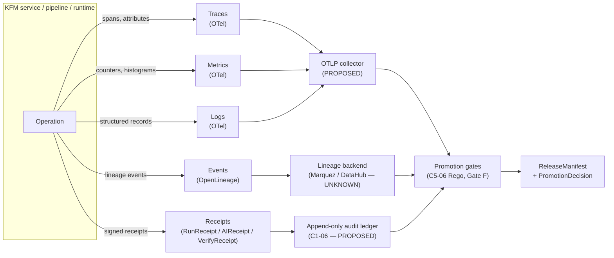
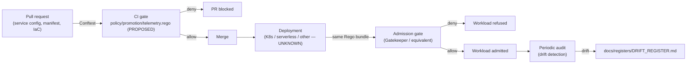

<!-- [KFM_META_BLOCK_V2]
doc_id: kfm://doc/standards/telemetry-minimums
title: Telemetry Minimums
type: standard
version: v0.1
status: draft
owners: [observability-stewards, release-managers]  <!-- PLACEHOLDER — confirm against control_plane/document_registry.yaml -->
created: 2026-05-14
updated: 2026-05-14
policy_label: public
related:
  - docs/standards/README.md
  - docs/architecture/governed-api.md
  - docs/architecture/map-shell.md
  - docs/doctrine/lifecycle-law.md
  - docs/doctrine/truth-posture.md
  - control_plane/policy_gate_register.yaml
  - control_plane/release_state_register.yaml
  - policy/promotion/
  - schemas/contracts/v1/receipts/
tags: [kfm, observability, telemetry, opentelemetry, openlineage, slo, policy-as-code, governance]
notes:
  - Doctrinal anchor: C5-06 "Observability as Code via OPA" (Pass 10 Idea Index).
  - Implementation maturity claims are bounded; repo not mounted in this session.
  - Thresholds in this document are PROPOSED defaults pending ADR.
[/KFM_META_BLOCK_V2] -->

<a id="top"></a>

# Telemetry Minimums

> Minimum traces, metrics, logs, events, and receipts required of every KFM service, with the rules that gate under-instrumented services out of release. Telemetry is a **carrier**, not truth — it earns release evidence, it does not establish it.

<p align="center">
  
  
  
  
  
  
  <!-- TODO: replace status/owners/CI badges with live shields once the standard is accepted -->
</p>

| Field | Value |
|---|---|
| **Status** | Draft (PROPOSED — not yet ratified by ADR) |
| **Owners** | observability-stewards · release-managers _(PLACEHOLDER — verify against CODEOWNERS)_ |
| **Last reviewed** | 2026-05-14 |
| **Supersedes** | _(none — first standard)_ |
| **Enforced by** | `policy/promotion/telemetry.rego` _(PROPOSED)_ at CI and admission |

---

## Quick jump

- [1. Purpose and scope](#1-purpose-and-scope)
- [2. Doctrinal anchors](#2-doctrinal-anchors)
- [3. The five-pillar model](#3-the-five-pillar-model)
- [4. Service classes](#4-service-classes)
- [5. Minimums by signal](#5-minimums-by-signal)
- [6. Required fields and field keys](#6-required-fields-and-field-keys)
- [7. SLOs, error budgets, and runtime gates](#7-slos-error-budgets-and-runtime-gates)
- [8. Enforcement: Rego, CI, admission](#8-enforcement-rego-ci-admission)
- [9. Sensitivity, secrets, and trust-membrane rules](#9-sensitivity-secrets-and-trust-membrane-rules)
- [10. Anti-patterns](#10-anti-patterns)
- [11. Open questions and verification backlog](#11-open-questions-and-verification-backlog)
- [12. Related docs](#12-related-docs)

---

## 1. Purpose and scope

**CONFIRMED doctrine.** KFM treats observability as part of the trust membrane, not as a debugging convenience. Minimum telemetry standards exist so that under-instrumented services cannot ship and so that downstream consumers — stewards, release managers, the audit ledger, the public Evidence Drawer — can answer the questions "what ran, when, on what, under what rights, with what outcome?" without relying on tribal knowledge.

This document defines:

- The **signal pillars** every KFM service must emit.
- The **minimum content** of each pillar (fields, labels, retention).
- The **service classes** that may apply different minimums.
- The **SLOs and error budgets** that gate promotion.
- The **Rego rules** that enforce all of the above at CI and admission time.

**Out of scope.** This standard does **not** define dashboard layouts, alert routing, on-call rotations, or specific backend choices (Prometheus vs. OTLP collector vs. ClickHouse vs. Tempo). Those belong in `docs/runbooks/` and an accepted backend ADR. It also does **not** define what evidence *means* — that is the job of `contracts/` and `schemas/`. Telemetry carries evidence; it does not create it.

> [!IMPORTANT]
> **Telemetry is not truth.** A trace, a metric series, a log line, an OpenLineage event, and a run receipt are all *carriers* of evidence. They earn release-gate status when wired to `EvidenceBundle`, `RunReceipt`, and `PromotionDecision`. A telemetry value alone — however high-fidelity — never substitutes for an `EvidenceBundle` and never promotes itself.

[Back to top](#top)

---

## 2. Doctrinal anchors

**CONFIRMED.** This standard is the operational realization of several governing doctrine items:

| Anchor | Source | What it requires |
|---|---|---|
| **C5-06 — Observability as Code via OPA** | Pass 10 Idea Index | Minimum telemetry standards (OpenTelemetry instrumentation, sampling, sidecars) enforced as Rego rules at CI/CD or admission. |
| **C5-08 — Lineage Required for Promotion** | Pass 10 Idea Index | Gate F: an OpenLineage `run_id` is emitted and discoverable, with input/output dataset facets present, before promotion is allowed. |
| **C1-01 — Universal Run Receipt** | Pass 10 Idea Index | Every dataset run, materialization, migration, redaction, or publication emits a `RunReceipt` with `spec_hash`, `run_id`, artifact digests, SPDX rights, attestations. |
| **C1-05 — OpenLineage Events** | Pass 10 Idea Index | Standardized lineage event shape across orchestrators; lineage facets carry KFM receipt and dataset identity. |
| **ML-064-082 — SLOs and error budgets govern publication health** | Master MapLibre Components (v1.9) | Availability and latency SLOs drive backoff, degraded cached PMTiles, and promotion gating. |
| **ML-058-006 — Per-tile telemetry envelope is required** | Master MapLibre Components (v1.5) | Per-tile metrics: `tile_id`, `zoom`, `fetch_ms`, `decode_ms`, `render_ms`, `tile_bytes`. |
| **ML-058-007 — Failure telemetry categories** | Master MapLibre Components (v1.5) | Must log OOM signals, decode exceptions, throttling, backpressure, token failures, signature mismatches. |
| **ML-063-032 — Log keys tie run_id, provenance, catalog, gate state** | Master MapLibre Components (v1.8) | Drawer payloads include prov/run IDs **and hide secrets**. |
| **KFM-P18-INV (VAL)** — SLO/error-budget checks for public map services | Pass 18 Idea Index | SLO checks may block promotion or trigger rollback **without** treating telemetry as truth. |

**Anti-anchor.** Across the MapLibre source body, every telemetry-related idea carries the same risk caveat: *"Treat as downstream carrier; do not promote without proof/release state."* This standard is built on that caveat.

[Back to top](#top)

---

## 3. The five-pillar model

**PROPOSED synthesis** of CONFIRMED doctrine. KFM telemetry comprises five signal pillars. The first three are industry-standard OpenTelemetry pillars; the last two are KFM-specific governance signals that travel alongside them.



| Pillar | Standard | KFM home object | What it answers |
|---|---|---|---|
| Traces | OpenTelemetry | _(carrier only)_ | What called what, how long, where did latency live |
| Metrics | OpenTelemetry | _(carrier only)_ | Rates, distributions, saturation, SLO inputs |
| Logs | OpenTelemetry | _(carrier only)_ | Discrete events with structured context |
| **Lineage events** | OpenLineage | _facets reference_ `RunReceipt` | What ran on what inputs, producing what outputs |
| **Receipts** | KFM-specific | `RunReceipt`, `AIReceipt`, `VerifyReceipt`, `RuntimeProbeResult` | Signed, content-addressed proof a thing happened |

> [!NOTE]
> The three OpenTelemetry pillars are **operational** signals. The two KFM-specific pillars are **governance** signals. A service that emits OTel signals but no receipts or lineage cannot be promoted; a service that emits receipts but no OTel signals cannot be operated. Both halves are required.

[Back to top](#top)

---

## 4. Service classes

**Open question (NEEDS VERIFICATION).** The Pass 10 Idea Index records the question explicitly: *"Are KFM services classified by tier (canary, production, partner-facing)? If not, the telemetry minimums need a single class."*

This standard adopts a **two-track approach** pending ADR:

### 4.1 Default — single class (PROPOSED)

Until a class scheme is ratified, every KFM service is treated as `kfm-service:default` and must meet the **baseline minimums** in [§5](#5-minimums-by-signal). This satisfies the doctrine's fallback ("the telemetry minimums need a single class") and produces a Rego bundle that can ship today.

### 4.2 Proposed tiered scheme (PROPOSED, pending ADR)

Adapted from the API audience-class doctrine in Pass 18 (`KFM-P18-INV-334`: *public, partner, steward, internal, denied*) and translated to deployment tier. Each tier raises the minimums above baseline rather than replacing them.

| Class | Examples | Increment over baseline |
|---|---|---|
| `public-facing` | governed-api public routes; map shell; published-tile delivery | Higher sampling on errors; SLO gates required; rights-aware log redaction |
| `partner-facing` | partner APIs; export endpoints; bulk distribution | Auth/token failure metrics; rate-limit counters; per-partner cardinality cap |
| `internal` | steward console; admin tooling; CI runners | Action-attribution logs; separation-of-duties audit events |
| `batch / ingest` | source connectors; watchers; pipelines (Dagster/Prefect/Temporal — `C2-01..03`, default UNKNOWN) | `RunReceipt` emission required; OpenLineage facets required |
| `map-runtime` | tile servers; MapLibre delivery; runtime probe harnesses | Per-tile envelope; `RuntimeProbeResult`; failure telemetry per `ML-058-007` |

> [!CAUTION]
> Class assignment is itself a governance act. A class downgrade for any service requires the same review burden as a release downgrade. Class assignments live in `control_plane/policy_gate_register.yaml` _(PROPOSED home)_, not in service code.

[Back to top](#top)

---

## 5. Minimums by signal

All minimums below are **PROPOSED defaults** pending the C5-06 Rego bundle and an accepting ADR. Concrete numeric thresholds are starting points drawn from CONFIRMED MapLibre source evidence (`ML-058-003..007`, `ML-061-133`, `ML-064-082`).

### 5.1 Traces (OpenTelemetry)

| Requirement | Default | Notes |
|---|---|---|
| Instrumentation | OpenTelemetry SDK, language-appropriate | EXTERNAL: OTel is the cross-language standard; specific exporter choice deferred to ADR. |
| Resource attributes | `service.name`, `service.version`, `deployment.environment`, `kfm.service.class`, `kfm.git_sha` | `kfm.*` attributes are KFM extensions, not OTel core. |
| Span attributes (always) | `kfm.run_id` _(when in a governed run)_, `kfm.dataset_id` _(when operating on a dataset)_ | Bridges traces to receipts and lineage. |
| Sampling | Head-based at 10% baseline; **tail-based on error** at 100%; **head-based at 100%** for `partner-facing` and `public-facing` error paths | Tunable per class. |
| Forbidden in attributes | raw PII, exact sensitive geometry, source secrets, AI chain-of-thought | See [§9](#9-sensitivity-secrets-and-trust-membrane-rules). |

### 5.2 Metrics (OpenTelemetry)

Baseline metric families every service must export:

| Family | Examples | Why |
|---|---|---|
| **Request** | `http.server.request.duration`, `rpc.server.duration` | Latency SLO input. |
| **Saturation** | `process.runtime.memory`, `process.runtime.cpu.utilization` | Capacity headroom. |
| **Error rate** | `errors.total` by `kfm.error.kind` | Error-budget input. |
| **Governance** | `kfm.promotion.decisions.total{outcome="allow"\|"deny"\|"abstain"}`, `kfm.policy.evaluations.total` | Gate-aware observability. |
| **Lineage** | `kfm.lineage.events.emitted.total` | Verifies C5-08 wiring. |

Map-runtime services additionally export the **per-tile envelope** (`ML-058-006`):

```text
kfm.tile.fetch_ms        histogram   labels: tile_id, zoom, source_id, release_id
kfm.tile.decode_ms       histogram   labels: tile_id, zoom, codec
kfm.tile.render_ms       histogram   labels: tile_id, zoom, renderer
kfm.tile.bytes           histogram   labels: tile_id, zoom
kfm.tile.failure.total   counter     labels: reason ∈ {oom, decode, throttle, backpressure, token, signature_mismatch}
```

### 5.3 Logs (OpenTelemetry)

| Requirement | Default |
|---|---|
| Format | Structured (JSON), one record per event |
| Required fields | `timestamp`, `severity`, `service.name`, `trace_id`, `span_id`, `kfm.run_id` _(when applicable)_, `kfm.decision_id` _(when applicable)_, `kfm.policy_id` _(when applicable)_ |
| Severity vocabulary | OTel `SeverityNumber` (1–24) |
| Redaction | Apply **before emission**, not at query time |
| Retention floor | 30 days hot, 365 days cold _(PROPOSED — confirm via ops ADR)_ |

> [!IMPORTANT]
> Per `ML-063-032`, log keys MUST tie `run_id`, provenance bundle, catalog id, and gate state — and MUST hide secrets. This is enforced by the redaction step, not by reviewer discipline.

### 5.4 OpenLineage events

CONFIRMED requirement from **C5-08** (Gate F):

- Every pipeline run, materialization, redaction transform, or publication action emits an OpenLineage event.
- The event carries a stable `run.id` (the same `kfm.run_id` used in traces/logs).
- Input and output dataset **facets** are populated; missing facets are a deny condition at promotion.
- KFM extends OpenLineage with a **custom facet** that carries the `RunReceipt` reference (per `ML-063-033`).

### 5.5 Receipts

CONFIRMED shape from **C1-01**. The `RunReceipt` is one small JSON object pinned alongside the artifacts it describes, with these required fields:

```text
dataset_id, dataset_version, fetch_time (ISO 8601), source_url,
http_validators { etag, last_modified },
spec_hash ("jcs:sha256:<hex>"), run_id, orchestrator, transform_git_sha,
artifacts[] { path, digest }, rights_spdx, attestations[] { type, bundle_digest }
```

Additional KFM receipt families that flow with the telemetry stream:

| Receipt | When | Source |
|---|---|---|
| `RunReceipt` | Every pipeline / build / publication run | C1-01 |
| `AIReceipt` | Every Focus Mode answer / generated text artifact | Master MapLibre object families |
| `VerifyReceipt` | Tile activation: `digest_verified`, `bounds_verified`, `schema_verified` | Master MapLibre object families |
| `RuntimeProbeResult` | Runtime budget probes (decode, hash, heap, token) | `ML-058-002..010` |

[Back to top](#top)

---

## 6. Required fields and field keys

To keep traces, metrics, logs, lineage events, and receipts **joinable** without after-the-fact reconciliation, the keys below are reserved and must be used consistently.

| Key | Type | Source signal(s) | Required when |
|---|---|---|---|
| `kfm.run_id` | string (uuid v4 or stable id) | traces, metrics, logs, lineage, receipts | Inside any governed run |
| `kfm.dataset_id` | string | traces, logs, lineage | Operating on a catalogued dataset |
| `kfm.dataset_version` | string | logs, lineage, receipts | Operating on a versioned dataset |
| `kfm.spec_hash` | `jcs:sha256:<hex>` | logs, receipts | Whenever a `spec` participates in the operation |
| `kfm.decision_id` | string | logs (policy), metrics (`kfm.policy.evaluations.total`) | Any policy decision emitted |
| `kfm.policy_id` | string | logs (policy) | Any policy decision emitted |
| `kfm.release_id` | string | logs (release/publication), metrics | Any publication or rollback action |
| `kfm.rights_spdx` | SPDX identifier | logs, receipts | Source-derived artifacts |
| `kfm.service.class` | enum (see [§4](#4-service-classes)) | resource attribute on every signal | Always |

> [!TIP]
> `kfm.run_id` is the single key that joins the full picture: a trace can be walked back to its run receipt, forward to its lineage event, and sideways to the policy decision that approved or denied it. If a service can emit only one KFM attribute, it is this one.

[Back to top](#top)

---

## 7. SLOs, error budgets, and runtime gates

**CONFIRMED doctrine** (`ML-064-082`, `ML-064-110`, `ML-061-133`, Pass 18 VAL). SLOs and error budgets are not operational decorations — they are release-gate inputs. A degraded SLO can **block promotion or trigger rollback** without ever being elevated to "truth."

### 7.1 Baseline SLOs (PROPOSED defaults)

| Signal | Default budget | Source basis |
|---|---|---|
| API request latency, p95 | ≤ 500 ms _(PROPOSED — confirm per service)_ | Generic Pass 18 VAL |
| API request latency, p99 | ≤ 1500 ms _(PROPOSED)_ | Generic Pass 18 VAL |
| Public tile fetch, p95 from CDN | ≤ **150 ms** | `ML-061-133` (CONFIRMED source) |
| Allowlist token handshake, p50 | ≤ **100 ms** | `ML-058-005` |
| Client hash throughput | ≥ **100 MB/s** | `ML-058-003` |
| Sustained native heap growth | ≤ **10 MB/min** under pan/zoom soak | `ML-058-004` |
| Error rate (5xx + policy-bug deny) | ≤ 1% rolling 1h | Generic |

Burn-rate alerting follows standard SRE practice _(EXTERNAL convention)_; specific multi-window multi-burn-rate alert windows are a runbook concern, not part of this standard.

### 7.2 Runtime probe gate

Map-runtime services additionally route a `RuntimeProbeResult` into a `ReleaseRuntimeGate` (`ML-058-009`: *runtime verification stability is a publication prerequisite*). A failing probe **blocks the release**; a passing probe is **necessary but not sufficient** for promotion (the lineage, signing, and policy gates still apply).

### 7.3 Telemetry as rollback trigger

A **sustained** SLO breach for a published layer is a valid input to a `RollbackCard`. The breach is evidence the layer carries operational risk; the actual rollback decision still requires the release manager's signed `PromotionDecision` reversal. Telemetry triggers; the human-in-loop decides.

[Back to top](#top)

---

## 8. Enforcement: Rego, CI, admission

**PROPOSED implementation.** Per C5-06, the enforcement is **policy-as-code**: the same Rego bundle gates merges (CI / Conftest) and admission (runtime). The same logic, two slots.



### 8.1 What the Rego bundle checks (PROPOSED)

- Resource attributes declare `service.name`, `service.version`, `deployment.environment`, `kfm.service.class`.
- An OTel SDK (or compliant alternative) is configured.
- A metrics exporter is wired.
- A logs exporter is wired, with the redaction step present.
- For batch/ingest classes: an OpenLineage emitter is configured.
- For map-runtime: a probe harness is declared and its output reaches `ReleaseRuntimeGate`.
- For partner-facing/public-facing: SLO definitions exist and are referenced from the `ReleaseManifest`.

### 8.2 Parity rule (C5-03 — CONFIRMED)

The Rego bundle used in CI **is** the bundle used at admission. Drift between CI policy and runtime policy is itself a drift-register entry, not a tunable.

### 8.3 Tunability and exception path

Per the C5-06 tension note, over-strict telemetry rules can block legitimate deploys. Exceptions are:

- Per-service `kfm.telemetry.exception` annotation, time-boxed.
- Recorded in `control_plane/policy_gate_register.yaml` _(PROPOSED home)_.
- Reviewed by observability-stewards.
- Auto-expiring; no silent renewals.

> [!WARNING]
> **No `kfm.telemetry.exception` is permitted for the lineage-emission requirement.** Lineage (C5-08) is the discoverability floor; below it, downstream consumers go blind. Lineage exceptions require an ADR, not an annotation.

[Back to top](#top)

---

## 9. Sensitivity, secrets, and trust-membrane rules

**CONFIRMED doctrine.** Telemetry rides through the same trust membrane as everything else. The rules below are non-negotiable.

| Rule | Why | Source |
|---|---|---|
| Logs MUST hide secrets at emission time | A redacted query view is not a redaction | `ML-063-032` |
| Span/log attributes MUST NOT carry exact sensitive geometry | Public bytes can leak exact location | KFM sensitivity doctrine; cross-ref `ML-061-132` (PII whitelisting) |
| AI assistant traces MUST NOT carry chain-of-thought | `AIReceipt` records adapter, evidence refs, citation validation — never private reasoning | Master MapLibre object families |
| Receipts MUST be content-addressed (`jcs:sha256:<hex>`) | Mutability breaks every receipt that points at them | C1-01, C1-02 |
| Telemetry retention MUST respect rights/sensitivity tier of the underlying data | A log line about a restricted record inherits the restriction | KFM sensitivity rubric (C6) |
| Public clients MUST NOT consume raw telemetry endpoints | Public path is governed APIs, not internal stores | Lifecycle law: trust membrane |

> [!CAUTION]
> A common failure mode is to treat the metrics/logs/trace backend as "internal, therefore safe." Backends accumulate, mirror, export, and outlive the services that fed them. **Apply sensitivity at the emit step.**

[Back to top](#top)

---

## 10. Anti-patterns

**CONFIRMED across MapLibre source body** (`ML-058-002..010`, `ML-064-*`, anti-patterns register in `Master MapLibre v1.7+`). Every telemetry idea carries the same risk caveat: *treat as downstream carrier; do not promote without proof / release state.* The anti-patterns below codify what that caveat rules out.

<details>
<summary><strong>Click to expand the anti-patterns register</strong></summary>

| Anti-pattern | Why it is dangerous | Mitigation |
|---|---|---|
| Treating a metric value as truth | A latency or sample count is a carrier; it does not establish what a thing **is** | `EvidenceBundle` resolution required; SLO breach triggers gate, never publication |
| Promoting a service that emits telemetry but no receipts | Operational visibility without governance visibility | C1-01 + C5-08 are floors; promotion gate blocks |
| Logging exact sensitive geometry or raw PII for "debugging" | Logs persist, mirror, and outlive | Redact at emission; sensitive-geometry deny fixture |
| Exposing chain-of-thought in AI traces or logs | Bypasses `AIReceipt` and citation validation | `AIReceipt` carries adapter/refs/policy only |
| Adding a `kfm.telemetry.exception` for lineage emission | Goes blind on discoverability — Gate F can no longer evaluate | ADR required; no annotation path |
| CI Rego and runtime Rego drift | A workload that passed CI fails admission silently — or worse, the inverse | C5-03 parity rule; drift register entry on divergence |
| Per-tile telemetry without `tile_id` / `release_id` join keys | Cannot trace a slow tile back to its source artifact | Required label set per `ML-058-006`; metric schema validation |
| Treating dashboard prettiness as observability completeness | Pretty dashboards over thin signals = false confidence | Rego validates **signal presence**, not panel count |
| Sampling AI/policy traces below 100% | Loses the events that matter most for review | Errors and policy/AI spans at 100% by default |
| Emitting an OpenLineage event with empty input/output facets | Run is invisible to lineage tooling = Gate F denies | Schema-validate facets; deny on emptiness |

</details>

[Back to top](#top)

---

## 11. Open questions and verification backlog

Items below are explicitly **not resolved** by this document and SHOULD be tracked in `docs/registers/VERIFICATION_BACKLOG.md`.

| # | Item | Status | Resolution path |
|---|---|---|---|
| 1 | Are KFM services classified into tiers or treated as a single class? | **OPEN** — recorded since C5-06 | ADR adopting either [§4.1](#41-default--single-class-proposed) baseline or [§4.2](#42-proposed-tiered-scheme-proposed-pending-adr) tiered scheme |
| 2 | Which runtime is canonical (Kubernetes, serverless, mixed)? | **UNKNOWN** — C5-05 open question | ADR tied to admission-tool choice (Gatekeeper, PDP sidecar, equivalent) |
| 3 | Which OpenLineage backend (Marquez vs. DataHub)? | **UNKNOWN** — C1-05 expansion | Backend ADR |
| 4 | Which orchestrator(s) — Dagster, Prefect, Temporal? | **UNKNOWN** — C2-01..03 default-orchestrator decision | Backend ADR |
| 5 | Numeric SLO targets per service class | **PROPOSED defaults only** | Per-class SLO worksheet under `docs/runbooks/` |
| 6 | OTel-collector deployment topology | **NEEDS VERIFICATION** | `docs/architecture/deployment-topology.md` |
| 7 | Append-only audit ledger backend (C1-06) | **PROPOSED** — backend not chosen | C1-06 expansion |
| 8 | Does `docs/standards/` exist in the mounted repo with sibling files in this style? | **NEEDS VERIFICATION** | Repo inspection; align this file to local convention if it diverges |
| 9 | Owner team identifiers in the meta block | **PLACEHOLDER** | Confirm against CODEOWNERS / `control_plane/document_registry.yaml` |
| 10 | Energy / carbon telemetry as a release field | **PROPOSED** — supported by `ML-061-134`, `ML-064-069`, `ML-064-092` | Decide whether this is a minimum or a class extension; record in ADR |

[Back to top](#top)

---

## 12. Related docs

- `docs/doctrine/lifecycle-law.md` — RAW → WORK/QUARANTINE → PROCESSED → CATALOG/TRIPLETS → PUBLISHED, with receipts riding alongside.
- `docs/doctrine/truth-posture.md` — cite-or-abstain; why telemetry is carrier and not truth.
- `docs/doctrine/trust-membrane.md` — public path through governed APIs; never raw stores.
- `docs/architecture/governed-api.md` — where public-facing services live.
- `docs/architecture/map-shell.md` — map-runtime class context; runtime probes.
- `docs/standards/README.md` — sibling external-standards docs (STAC, DCAT, PROV) — _PLACEHOLDER, presence NEEDS VERIFICATION._
- `docs/adr/ADR-0001-schema-home.md` — referenced for schema-home conventions when receipts are versioned.
- `control_plane/policy_gate_register.yaml` — proposed home of the gate row for telemetry.
- `policy/promotion/telemetry.rego` _(PROPOSED)_ — the Rego bundle this standard authorizes.
- `schemas/contracts/v1/receipts/` _(PROPOSED, per ADR-0001 default)_ — `RunReceipt`, `AIReceipt`, `VerifyReceipt`, `RuntimeProbeResult` shape.

---

<sub><sub>**Last reviewed:** 2026-05-14 · **Status:** draft (PROPOSED, pending ADR) · **Anchor:** C5-06 (Pass 10 Idea Index) · **License / policy_label:** public</sub></sub>

<sub>[↑ Back to top](#top)</sub>
