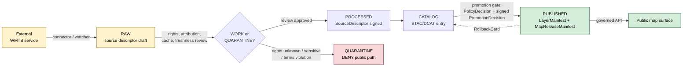

<!-- [KFM_META_BLOCK_V2]
doc_id: kfm://doc/standards/wmts
title: WMTS — Web Map Tile Service (Standards Conformance)
type: standard
version: v1
status: draft
owners: TBD — docs steward + map subsystem owner
created: 2026-05-14
updated: 2026-05-14
policy_label: public
related:
  - docs/standards/STAC.md
  - docs/standards/DCAT.md
  - docs/standards/PROV.md
  - docs/architecture/map-shell.md
  - docs/doctrine/trust-membrane.md
  - docs/doctrine/directory-rules.md
  - contracts/source/source-descriptor.md
  - contracts/release/release-manifest.md
tags: [kfm, standards, geospatial, tiles, ogc, wmts, external-services]
notes:
  - All KFM repo-shaped claims (paths, schemas, validators) are PROPOSED until verified against the mounted repository.
  - WMTS spec facts are EXTERNAL; cited inline.
[/KFM_META_BLOCK_V2] -->

# WMTS — Web Map Tile Service

> External tile-service standard, governed at admission. KFM may render WMTS layers **only** when they pass the trust membrane — SourceDescriptor, rights, attribution, freshness, cache policy, and release state must all be in scope. WMTS layers are *context*, not *proof*.

<p align="left">
  
  
  
  
  
  <a href="../doctrine/directory-rules.md"></a>
</p>

| Field | Value |
|---|---|
| **Status** | draft |
| **Owners** | TBD — docs steward + map subsystem owner |
| **Last updated** | 2026-05-14 |
| **External spec** | OGC 07-057r7 — Web Map Tile Service Implementation Standard 1.0.0 [EXTERNAL] |
| **Truth posture (KFM impl)** | Doctrine CONFIRMED; repo paths/validators PROPOSED until mounted-repo verification |

---

## Quick jump

- [1. Scope and role in KFM](#1-scope-and-role-in-kfm)
- [2. What WMTS is (external spec)](#2-what-wmts-is-external-spec)
- [3. Why this doc exists](#3-why-this-doc-exists)
- [4. KFM admission contract for WMTS sources](#4-kfm-admission-contract-for-wmts-sources)
- [5. Standards mapping — WMTS to KFM objects](#5-standards-mapping--wmts-to-kfm-objects)
- [6. Public path and policy gates](#6-public-path-and-policy-gates)
- [7. Renderer handling (MapLibre)](#7-renderer-handling-maplibre)
- [8. Validation tests](#8-validation-tests)
- [9. Anti-patterns](#9-anti-patterns)
- [10. Open questions](#10-open-questions)
- [11. Related docs](#11-related-docs)
- [Appendix A — WMTS operation and parameter reference (EXTERNAL)](#appendix-a--wmts-operation-and-parameter-reference-external)

---

## 1. Scope and role in KFM

WMTS is a **tile-delivery protocol** for pre-rendered map images served over HTTP. In KFM it is an *external service protocol* — useful for cartographic context, basemaps, or rasterized agency products — and it sits **outside** the canonical KFM lifecycle (`RAW → WORK / QUARANTINE → PROCESSED → CATALOG / TRIPLET → PUBLISHED`).

WMTS layers therefore:

- **MAY** be rendered as context inside governed map views, after admission.
- **MUST NOT** be treated as canonical evidence, observation, or release artifact.
- **MUST** be admitted via `SourceDescriptor` with rights, attribution, freshness, and cache policy resolved before any public surface uses them.

This document is the KFM-side standard reference for WMTS: what the external spec says, what KFM requires above it, and where every WMTS-touching object family lives in the repo.

> [!IMPORTANT]
> WMTS is a **carrier**, not **proof**. A WMTS layer rendering correctly does not entail that the underlying source is current, rights-cleared, or evidence-linked. The KFM admission contract (§4) is what makes a WMTS layer publishable, not the fact that it loads.

[Back to top](#wmts--web-map-tile-service)

---

## 2. What WMTS is (external spec)

> The following section is **EXTERNAL** content: it summarizes the OGC specification. It informs how KFM models WMTS, but it does **not** make any claim about KFM repo state. KFM-specific behavior is governed by §§3–9.

The Web Map Tile Service (WMTS) is an OGC standard protocol for serving pre-rendered or run-time computed georeferenced map tiles over the Internet, first published by the Open Geospatial Consortium in 2010. A Web Map Tile Service (WMTS) is a standard protocol for serving pre-rendered or run-time computed georeferenced map tiles over the Internet. The specification was developed and first published by the Open Geospatial Consortium in 2010. 

The implementation specification is **OGC 07-057r7 — Web Map Tile Service Implementation Standard, Version 1.0.0** Web Map Tile Service (WMTS) Implementation Standard, version 1.0.0,  defined against the OGC Web Services Common Specification (OGC 06-121r3). This test suite is based on the OGC WMTS 1.0 Abstract Test Suite (ATS) and the following specifications: OpenGIS Web Services Common Specification, Version 1.3 with Corrigendum 1 (OGC 06-121r3) OpenGIS Web Map Tile Service Implementation Standard, Version 1.0.0 (OGC 07-057r7) 

### 2.1 Operations

WMTS defines three operations: The map visualization component supports the GetCapabilities, GetTile, and GetFeatureInfo requests as defined in the OGC document 07-057r7 

| Operation | Purpose | Required for KFM admission? |
|---|---|---|
| `GetCapabilities` | Returns the service description XML — layers, tile matrix sets, formats, styles. | **MUST** — used to populate `SourceDescriptor` and verify allowed CRS/format/zoom. |
| `GetTile` | Returns a single tile image. | **MUST** — primary delivery operation; verified in tile-load probes. |
| `GetFeatureInfo` | Returns feature attributes at a clicked pixel (optional). | **SHOULD NOT** be used as KFM evidence; if present, treat returned values as `candidate`, not `observation`. |

### 2.2 Protocol bindings

WMTS supports two protocol bindings, either of which may be advertised in `GetCapabilities`: The server under test must support the GetCapabilities operation request in either the KVP GET or RESTful protocol binding 

- **KVP (Key-Value Pair) GET** — flat `?SERVICE=WMTS&REQUEST=GetTile&...` query strings.
- **RESTful** — path-style URLs with embedded tile-coordinate templates.

### 2.3 TileMatrixSet

A WMTS service declares one or more **TileMatrixSets** — fixed pyramids of tile grids over a specified CRS. The current OGC alignment work, the *WMTS Simple Profile* (OGC 13-082r2), narrows TileMatrixSet conventions to match the de-facto web-mercator tile schemes used elsewhere on the web. Many current WMTS services that implement this profile will have to undergo some changes on how tiles are exposed, and a client that is compatible with WMTS 1.0 will be immediately compatible with this profile. The aim is to align the WMTS standard to other popular tile initiatives which are less flexible but widely adopted. 

For separate, more current OGC tile work, see **OGC API – Tiles** (a different standard, not interchangeable with WMTS 1.0.0).

> [!NOTE]
> Each WMTS-published `TileMatrixSet` pins a CRS, an origin, scale denominators, and tile pixel size. KFM admission **MUST** record the chosen `TileMatrixSet` identifier and verify it against the layer's intended display CRS before rendering.

[Back to top](#wmts--web-map-tile-service)

---

## 3. Why this doc exists

WMTS is convenient and **dangerous in equal measure**: a single capability URL can light up a layer in a renderer without any of the KFM evidence, rights, sensitivity, or release plumbing being in place.

The project doctrine on this is explicit. Per the Master MapLibre atlas (SRC-064, ML-064-112), WMTS and WMS are allowed tile protocols but require *extra* source governance: a `SourceDescriptor`, rights and attribution, and a cache policy, with WMS/WMTS service-metadata and attribution tests as the validation gate. The same atlas (ML-064-023) records the KFM view-spec `tileProtocol` enum as covering `pmtiles`, `xyz`, `wmts`, and `wms`, with WMTS layers requiring an explicit access/governance posture.

KFM Pass 18 (KFM-P18-INV-475) restates this as a normalized rule: KFM may use WMS or WMTS as map protocols **only** when the service has a SourceDescriptor, a rights/attribution review, a cache policy, and a public-safety posture. (Status: PROPOSED; implementation maturity: UNKNOWN absent mounted-repo evidence.)

> [!WARNING]
> External map services can render quickly but can **bypass KFM provenance** if admitted only as URLs. WMTS layers admitted without a `SourceDescriptor`, rights resolution, and release state are drift, not features. PRs that introduce a raw WMTS endpoint to a public map surface MUST be blocked by the admission gate.

[Back to top](#wmts--web-map-tile-service)

---

## 4. KFM admission contract for WMTS sources

The following are the KFM-specific obligations layered **on top of** WMTS 1.0.0. They derive from KFM doctrine (cite-or-abstain, trust membrane, lifecycle law, Directory Rules) and from SRC-064 / Pass 18 evidence; all are PROPOSED in implementation until repo-verified.

### 4.1 Required fields on the WMTS `SourceDescriptor`

| Field | Requirement | Origin / notes |
|---|---|---|
| `source_id` | MUST | Stable KFM identifier for the WMTS service entry. |
| `protocol` | MUST = `wmts` | Matches KFM `tileProtocol` enum (PROPOSED per ML-064-023). |
| `capabilities_url` | MUST | Resolves to the WMTS `GetCapabilities` document. |
| `binding` | MUST ∈ {`kvp`, `restful`} | Advertised by the service; recorded for cache-key stability. |
| `layer_identifier` | MUST | The WMTS `Layer/Identifier` to render. |
| `tile_matrix_set` | MUST | TileMatrixSet identifier; pins CRS and scale set. |
| `format` | MUST ∈ allowed MIME list | E.g., `image/png`, `image/jpeg`. |
| `attribution` | MUST | Literal, source-provided attribution text. |
| `rights_statement` | MUST | License or terms of use; `rights_unknown` is a release-blocking value. |
| `license_spdx` | SHOULD | SPDX identifier where applicable. |
| `cache_policy` | MUST | TTL, revalidation, and CORS expectation. |
| `freshness_class` | MUST | E.g., `stable`, `daily`, `hourly`, `unstable`. |
| `source_role` | MUST = `reference` *(usually)* | One of {`observation`, `derived`, `simulation`, `regulatory`, `interpretation`, `ai_generated`, `reference`}. WMTS layers are almost always `reference`. |
| `sensitivity` | MUST | `public` | `generalize` | `restricted` | `review_required`. |
| `review_state` | MUST | `draft` | `in_review` | `approved` | `rejected`. |
| `release_state` | MUST | `unreleased` | `candidate` | `released` | `withdrawn` | `corrected` | `superseded`. |
| `evidence_ref` | SHOULD | Resolves to an `EvidenceBundle` when WMTS supports a downstream claim. |
| `spec_hash` | MUST | Canonical hash of the SourceDescriptor itself. |

> [!CAUTION]
> Rights and attribution drift silently. WMTS services may change terms, retract layers, or shift attribution text without notice. A WMTS `SourceDescriptor` MUST be revalidated against `GetCapabilities` on a defined schedule (see freshness class), with deltas surfaced as `CorrectionNotice` candidates.

### 4.2 Lifecycle treatment

WMTS does not *bypass* the lifecycle — it is admitted **alongside** it:



> [!NOTE]
> The flow is **PROPOSED** at the level of paths and validator names. The shape — admission → catalog → release → rollback target — follows KFM lifecycle law (CONFIRMED doctrine).

### 4.3 Freshness and revalidation

A WMTS service may publish stable tiles that nonetheless refer to *living* underlying data (regulatory layers, work-zone incidents, atmospheric models). KFM treats the visual tile and the underlying claim **separately**:

- The **tile** is governed by `TileArtifactManifest` if cached, or by the live URL if proxied.
- The **claim carried by the tile** is governed by `EvidenceBundle` resolution. A WMTS layer **MUST NOT** be cited as evidence unless an `EvidenceRef` resolves to a bundle that re-states the claim from an authoritative source.

[Back to top](#wmts--web-map-tile-service)

---

## 5. Standards mapping — WMTS to KFM objects

KFM does not invent a parallel catalog model for WMTS. It maps WMTS service objects onto the same families used for STAC, DCAT, and PROV.

| WMTS concept | KFM object family | Notes |
|---|---|---|
| Service (Capabilities document) | `SourceDescriptor` | One per service URL; carries rights, attribution, freshness. |
| Layer | `LayerManifest` entry | Render hints (`tileProtocol`, `tileMatrixSet`, `format`) separated from catalog source pointers. |
| TileMatrixSet | `LayerManifest.render_hints.tile_matrix_set` | Pinned at admission; CRS must match display target. |
| Style | `StyleManifest` reference | KFM does not author WMTS styles; it pins the chosen `StyleId` and digests the response. |
| Attribution | `LayerManifest.attribution` + UI display | MUST render literally where the layer is shown. |
| Tile bytes (if cached) | `TileArtifactManifest` | Optional; required if KFM mirrors or proxies. |
| Service health | `RunReceipt` / probe receipts | Capability probes, range/CORS probes, attribution probes. |
| Public release | `MapReleaseManifest` | Couples LayerManifest + policy + rollback. |
| Reversal | `RollbackCard` | Restores prior `MapReleaseManifest`; invalidates caches. |
| Evidence link | `EvidenceRef` → `EvidenceBundle` | Required wherever a WMTS layer underpins a claim. |
| Policy outcome | `PolicyDecision` | DENY / ABSTAIN / ALLOW / ERROR — gates render. |

Cross-standard alignment summary:

| Standard | KFM doc | Relationship to WMTS |
|---|---|---|
| STAC 1.0 + KFM profile (`kfm-stac-profile-v1`) | `docs/standards/STAC.md` | Cataloging the WMTS service entry; carries `kfm:*` governance fields. PROPOSED. |
| DCAT | `docs/standards/DCAT.md` | Non-spatiotemporal distribution metadata; mirrors STAC where helpful. |
| PROV / PROV-O | `docs/standards/PROV.md` | Records how the WMTS-derived view was assembled; signed `RunReceipt`. |
| OGC API – Tiles | (separate doc) | A **different** OGC standard; not a drop-in replacement for WMTS 1.0.0. |

[Back to top](#wmts--web-map-tile-service)

---

## 6. Public path and policy gates

Public clients access WMTS-backed layers through the **governed API**, never directly. The render path is:

```
public client → apps/governed-api/ → governed views (LayerManifest)
                       │
                       └── PolicyDecision: rights + sensitivity + release state
                              │
                              └─ ALLOW: deliver tile pointer / proxy
                                 ABSTAIN: serve cached degraded state + banner
                                 DENY: refuse + Evidence Drawer reason
                                 ERROR: fail closed, log RunReceipt
```

> [!IMPORTANT]
> WMTS proxies and direct service URLs **MUST NOT** be exposed under canonical KFM hostnames as public endpoints. If KFM proxies WMTS, the proxy lives under the governed API and applies the same `PolicyDecision` gates as any other layer.

### 6.1 Policy gate matrix

| Gate | DENY if | ABSTAIN if | ALLOW if |
|---|---|---|---|
| Rights | `rights_unknown` or `rights_status` not in approved list | License has stale review | `rights_status` ∈ {`public`, `open`, `controlled` w/ contract} |
| Attribution | Missing | Source attribution mismatched between capabilities and manifest | Present and literal |
| Sensitivity | `restricted` and viewer not authorized | `review_required` | `public` or approved generalization |
| Freshness | Capability probe failed beyond grace | Within grace window | Within freshness budget |
| Release | `unreleased`, `withdrawn`, `rejected` | `candidate` (steward views only) | `released` |
| TileMatrixSet | Mismatched CRS / unsupported by client | Re-projection required without recorded cost | Pinned and supported |

[Back to top](#wmts--web-map-tile-service)

---

## 7. Renderer handling (MapLibre)

The MapLibre Style Specification does **not** define a WMTS-typed source. Instead, WMTS endpoints are wired through a `raster` (or `raster-dem`) source using a URL template, with parameters bound at request time. Optional enum. Possible values: xyz, tms. Defaults to "xyz". Influences the y direction of the tile coordinates. The global-mercator (aka Spherical Mercator) profile is assumed.  For services that align to the WMTS Simple Profile and the common web-mercator tile scheme, this binding is straightforward; for arbitrary `TileMatrixSet` values it MUST be verified at admission. Many current WMTS services that implement this profile will have to undergo some changes on how tiles are exposed, and a client that is compatible with WMTS 1.0 will be immediately compatible with this profile. 

This means, in KFM terms:

- The KFM `tileProtocol: wmts` value in `LayerManifest.render_hints` is a **KFM-side classification**, not a MapLibre source type. PROPOSED per ML-064-023; the implementation translates it to a MapLibre raster source with a templated WMTS GET URL.
- The MapLibre `attribution` field on the raster source MUST be populated literally from `LayerManifest.attribution`.
- `tileSize`, `minzoom`, `maxzoom`, and `scheme` are pinned from the WMTS TileMatrixSet at admission and recorded in `render_hints`, not chosen ad-hoc in the renderer.
- `GetFeatureInfo`, if used at all, is wired through the governed API as a policy-checked passthrough; it never becomes evidence by itself.

> [!TIP]
> If a service publishes both WMTS and the underlying COG/PMTiles artifacts, prefer the artifact pathway (`TileArtifactManifest` over PMTiles/COG) and treat WMTS as the human-context fallback. WMTS becomes the natural choice only when the upstream does not publish addressable artifacts.

[Back to top](#wmts--web-map-tile-service)

---

## 8. Validation tests

The Master MapLibre atlas (ML-064-023, ML-064-112) names protocol-enum and attribution tests as the WMTS validation surface. The following list operationalizes that for KFM. Validator names, paths, and CI jobs are **PROPOSED** until verified against the mounted repo.

| Test | Purpose | Negative case (must also exist) |
|---|---|---|
| `wmts_capabilities_resolves` | `GetCapabilities` returns valid XML and advertises declared `Layer/Identifier` and `TileMatrixSet`. | Service 4xx/5xx, malformed XML, missing layer. |
| `wmts_tile_protocol_enum` | `LayerManifest.tileProtocol = wmts` is the only path that admits a WMTS endpoint. | Mixed-protocol manifest, unknown enum value. |
| `wmts_attribution_present` | `attribution` is non-empty, matches `GetCapabilities`, and is rendered literally. | Empty, stale, or paraphrased attribution. |
| `wmts_rights_resolved` | `rights_status` ∈ approved set; `rights_unknown` blocks release. | `rights_unknown`, expired license. |
| `wmts_tile_matrix_set_supported` | TileMatrixSet CRS supported by display target without uncontrolled reprojection. | Mismatched CRS, unsupported scale set. |
| `wmts_range_cors_probe` | If KFM caches/proxies tiles, host supports HTTP `Range` and correct CORS. | Range unsupported, CORS missing. |
| `wmts_cache_policy_recorded` | `cache_policy` declared with TTL and revalidation. | Missing or unbounded cache. |
| `wmts_freshness_within_budget` | Last successful capability probe within freshness class budget. | Stale beyond grace. |
| `wmts_no_evidence_substitution` | A WMTS layer is never the sole `EvidenceRef` for a published claim. | `EvidenceBundle` resolution returns only WMTS service URL. |
| `wmts_policy_deny_replay` | DENY/ABSTAIN/ERROR paths return policy-shaped finite outcomes with reasons. | Silent fail, opaque error. |
| `wmts_rollback_replay` | Rolling back a `MapReleaseManifest` restores prior WMTS bindings and invalidates caches. | Cache poisoning, dangling layer toggle. |

[Back to top](#wmts--web-map-tile-service)

---

## 9. Anti-patterns

The Master MapLibre atlas anti-patterns apply directly: treating MapLibre, tiles, screenshots, graph projections, popups, STAC records, or AI answers as sovereign truth is forbidden; relying on style filters for sensitive geometry is forbidden; using source snippets as proof of current repo implementation is forbidden. WMTS-specific failure modes:

- **URL-as-feature.** Adding a WMTS endpoint to a layer list without a `SourceDescriptor`. This is the canonical drift mode and the one this doc exists to prevent.
- **Layer toggle as publication.** Per ML-064-117, multiple gates (validation, signatures, catalog, promotion) precede a layer being available; a toggle in the UI does not equal `release_state = released`.
- **Attribution paraphrase.** Rewriting the source's attribution into something tidier. Attribution MUST be literal.
- **`GetFeatureInfo` as evidence.** Pixel-clicks against a remote service do not carry KFM evidence properties; they may seed a candidate, never a published claim.
- **Style filter for sensitivity.** Hiding restricted features in a MapLibre style does not satisfy KFM sensitivity policy; sensitive geometry must be denied or generalized **before** the tile reaches the client.
- **Silent re-projection.** Using a TileMatrixSet whose CRS does not match the display target without recording the reprojection cost and pinning it in `render_hints`.
- **Treating WMTS as the canonical truth source.** WMTS is rasterized output; canonical truth lives upstream in the agency's data system. Cite the upstream, not the tile.

[Back to top](#wmts--web-map-tile-service)

---

## 10. Open questions

These are explicit NEEDS VERIFICATION / OPEN items for this doc and the WMTS handling it describes. They SHOULD be tracked in `docs/registers/VERIFICATION_BACKLOG.md`.

- **NEEDS VERIFICATION:** Whether the KFM `tileProtocol` enum (PROPOSED `wmts`, `wms`, `pmtiles`, `xyz`) is implemented in any mounted schema under `schemas/contracts/v1/…` per ADR-0001. Source evidence: ML-064-023.
- **NEEDS VERIFICATION:** Which external WMTS sources are pre-approved for KFM public use without local mirroring (open question recorded under KFM-P18-INV-475).
- **OPEN:** Whether KFM proxies WMTS via `apps/governed-api/` or always pushes the live service URL into the client (governed API still gates allow/deny). Choice affects cache strategy, telemetry, and rights enforcement.
- **OPEN:** Disposition of `OGC API – Tiles`. This is a separate OGC standard with different semantics; a future ADR may govern when KFM prefers it over WMTS 1.0.0.
- **OPEN:** Whether WMTS layers ever carry a `RunReceipt` (per-tile or per-capability-probe) and where those receipts live (`data/receipts/`).

[Back to top](#wmts--web-map-tile-service)

---

## 11. Related docs

> [!NOTE]
> The links below are repo-relative and **PROPOSED** placement targets per Directory Rules §6.1 (`docs/standards/`) and §6.3–6.5 (`contracts/`, `schemas/`, `policy/`). Existence in the mounted repo is NEEDS VERIFICATION.

- [`docs/standards/STAC.md`](./STAC.md) — STAC profile (KFM `kfm-stac-profile-v1`); catalogs WMTS services and KFM-tiled artifacts side-by-side. _TODO_
- [`docs/standards/DCAT.md`](./DCAT.md) — DCAT distributions for non-spatiotemporal records and dual-publication mirroring of STAC. _TODO_
- [`docs/standards/PROV.md`](./PROV.md) — PROV-O lineage for WMTS view assembly and signed `RunReceipt` integration. _TODO_
- [`docs/architecture/map-shell.md`](../architecture/map-shell.md) — MapLibre shell, view registry, `tileProtocol` enum, render hints.
- [`docs/architecture/governed-api.md`](../architecture/governed-api.md) — Public path and policy mediation.
- [`docs/doctrine/trust-membrane.md`](../doctrine/trust-membrane.md) — Public/canonical separation; finite outcomes.
- [`docs/doctrine/lifecycle-law.md`](../doctrine/lifecycle-law.md) — RAW → … → PUBLISHED invariant.
- [`docs/doctrine/directory-rules.md`](../doctrine/directory-rules.md) — Placement law; §6.1 governs `docs/standards/`.
- [`contracts/source/source-descriptor.md`](../../contracts/source/source-descriptor.md) — `SourceDescriptor` object meaning. _PROPOSED_
- [`contracts/release/release-manifest.md`](../../contracts/release/release-manifest.md) — `MapReleaseManifest` object meaning. _PROPOSED_
- [`policy/runtime/`](../../policy/runtime/) — Runtime gate policies for ALLOW/DENY/ABSTAIN/ERROR. _PROPOSED_

---

## Appendix A — WMTS operation and parameter reference (EXTERNAL)

> The parameter list below is summarized from external standards documentation and implementation references for **reader convenience**. It does not bind KFM behavior. KFM behavior is governed by §§3–9.

<details>
<summary><strong>A.1 Common KVP parameters (GET) — illustrative</strong></summary>

| Parameter | Operation(s) | Notes (EXTERNAL) |
|---|---|---|
| `SERVICE` | all | `WMTS` |
| `REQUEST` | all | `GetCapabilities` \| `GetTile` \| `GetFeatureInfo` |
| `VERSION` | all | `1.0.0` for OGC 07-057r7 |
| `LAYER` | `GetTile`, `GetFeatureInfo` | WMTS `Layer/Identifier` |
| `STYLE` | `GetTile`, `GetFeatureInfo` | Style identifier advertised in capabilities |
| `FORMAT` | `GetTile` | MIME type, e.g. `image/png` |
| `TILEMATRIXSET` | `GetTile`, `GetFeatureInfo` | TileMatrixSet identifier |
| `TILEMATRIX` | `GetTile`, `GetFeatureInfo` | Zoom level identifier within the set |
| `TILEROW` | `GetTile`, `GetFeatureInfo` | Row index |
| `TILECOL` | `GetTile`, `GetFeatureInfo` | Column index |
| `I`, `J` | `GetFeatureInfo` | Pixel coordinates within the requested tile |
| `INFOFORMAT` | `GetFeatureInfo` | Response MIME type |

Cross-reference (illustrative example URL form): SERVICE=WMTS &amp;REQUEST=GetTile &amp;MAP=/home/qgis/projects/world.qgs &amp;LAYER=mylayer &amp;FORMAT=image/png &amp;TILEMATRIXSET=EPSG:4326 &amp;TILEROW=0 &amp;TILECOL=0 

</details>

<details>
<summary><strong>A.2 Pixel size and scale denominator (EXTERNAL)</strong></summary>

WMTS 1.0.0 fixes the standardized rendering pixel size at **0.28 mm**. In these examples, the &lt;tile_dpi&gt; and &lt;tile_meters_per_unit&gt; elements are specified, to comply with the OGC WMTS 1.0.0 implementation standard where pixel size is 0.28mm.  Scale denominators advertised in `GetCapabilities` are computed against that pixel size. KFM admission MUST not silently re-interpret this; reprojection or rescaling must be explicit in `render_hints`.

</details>

<details>
<summary><strong>A.3 Conformance and profiles (EXTERNAL)</strong></summary>

- **OGC 07-057r7** — WMTS 1.0.0 Implementation Standard.
- **OGC 13-082r2** — WMTS Simple Profile (alignment with common web-mercator schemes). The aim is to align the WMTS standard to other popular tile initiatives which are less flexible but widely adopted. 
- **OGC Compliance test suite** — exists for WMTS 1.0.0; KFM does not run upstream conformance, but **MUST** require services to advertise a conforming `GetCapabilities`. This test suite is based on the OGC WMTS 1.0 Abstract Test Suite (ATS) and the following specifications: OpenGIS Web Services Common Specification, Version 1.3 with Corrigendum 1 (OGC 06-121r3) OpenGIS Web Map Tile Service Implementation Standard, Version 1.0.0 (OGC 07-057r7) 

</details>

<details>
<summary><strong>A.4 External sources consulted</strong></summary>

| Trigger | Source | Used to inform |
|---|---|---|
| Version-sensitive external standard | OGC Standards page — `ogc.org/standards/wmts/` | Spec identity, role of WMTS in OGC catalog. |
| Version-sensitive external standard | OGC `docs.ogc.org/is/13-082r2/` (Simple Profile) | Profile alignment commentary; pixel-size reference. |
| External tool behavior / spec | OGC CITE test suite page (`cite.opengeospatial.org`) | Confirmation of OGC 07-057r7 + OGC 06-121r3 binding. |
| Wikipedia (secondary) | `en.wikipedia.org/wiki/Web_Map_Tile_Service` | Date of first publication (2010), high-level description. |
| Vendor doc (illustrative) | `docs.oracle.com` MapViewer WMTS notes | Operation list (GetCapabilities/GetTile/GetFeatureInfo). |
| Vendor doc (illustrative) | `docs.qgis.org` QGIS Server WMTS | Example KVP parameters for the appendix table. |
| Project doc | `maplibre.org/maplibre-style-spec/sources/` | MapLibre source `scheme` enum; absence of a WMTS source type. |

</details>

---

<sub>
Last updated: 2026-05-14 · Doc version: v1 (draft) · Placement: <a href="../doctrine/directory-rules.md">Directory Rules §6.1</a> · <a href="#wmts--web-map-tile-service">Back to top</a>
</sub>
