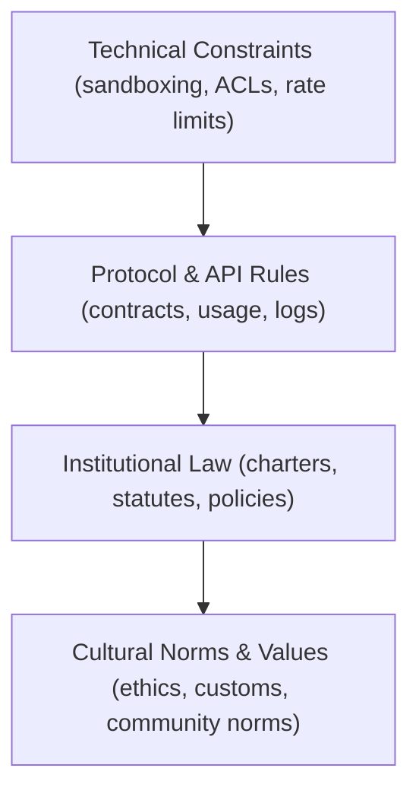
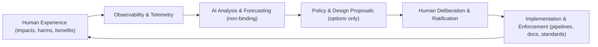

# ⚖️ **Kansas Frontier Matrix — AI + Law Co-Evolution Standard (v11.2.2)**  
`docs/standards/ai-law-coevolution.md`

**Purpose**  
Define a shared, adaptive, ethically governed framework that enables **humans and AI systems to co-evolve legal, ethical, and operational norms**—supporting coexistence, safety, dignity, sovereignty, and long-term thriving.

> This standard does **not** create real-world legal advice or binding law.  
> It defines how the Kansas Frontier Matrix (KFM) models, observes, and governs  
> the interaction between AI systems and legal/ethical frameworks.

 ·
 ·
 ·

---

## 📘 Overview

### 1. Intent

This standard establishes the **core architecture, principles, and processes** by which humans and AI systems jointly:

- Analyze existing rules and policies,  
- Detect conflicts and gaps,  
- Propose non-binding options for human review, and  
- Track the **evolution** of legal and governance norms over time.

The goal is a **governable socio-technical ecosystem** that remains:

- **Adaptive** — able to update rules as contexts change.  
- **Observable** — grounded in telemetry and documented impacts.  
- **Ethical** — constrained by FAIR+CARE and sovereignty policies.  
- **Human-led** — final normative decisions always rest with humans.

### 2. Scope

This standard applies when KFM systems are used to:

- Support **policy analysis** and scenario exploration.  
- Provide **non-binding assistance** with compliance checks or risk flags.  
- Link **legal or governance documents** to datasets, pipelines, or Story Nodes.  
- Surface **impacts on communities, environments, or rights** through Focus Mode.  

It does **not** authorize AI to:

- Draft binding laws or contracts,  
- Interpret real-world law as an attorney or court, or  
- Create enforceable obligations without explicit human action.

### 3. Audience

- Governance & FAIR+CARE councils  
- Legal and policy analysts  
- AI and systems architects  
- Indigenous and community sovereignty stewards  
- Sustainability and risk officers  

---

## 🗂️ Directory Layout

~~~text
📂 KansasFrontierMatrix/
└── 📂 docs/
    ├── 📂 standards/
    │   ├── 📄 ai-law-coevolution.md          # ⚖ AI + Law Co-Evolution Standard (this file)
    │   ├── 📄 faircare.md                    # ⚖ FAIR+CARE Data Governance Framework
    │   ├── 📄 licensing.md                   # 📜 Licensing & IP Standards
    │   ├── 📄 telemetry_standards.md         # 📈 Telemetry Super-Standard
    │   ├── 📄 ui_accessibility.md            # ♿ UI Accessibility Super-Standard
    │   └── 📂 governance/
    │       ├── 📄 README.md                  # 🏛 Governance & Ethical Oversight Index
    │       └── 📄 ROOT-GOVERNANCE.md         # 🏛 Root Governance Charter
    ├── 📂 faircare/                          # FAIR+CARE guides and patterns
    ├── 📂 sovereignty/                       # Indigenous & cultural data protection policies
    ├── 📂 architecture/                      # System + legal/AI architecture
    └── 📄 glossary.md                        # Shared terminology (legal, AI, governance)
~~~

**Author rules**

- Any document that claims to use or extend this standard MUST live under `docs/standards/` or a clearly marked governance subfolder.  
- Legal- or policy-adjacent analyses MUST:
  - Reference this standard, `faircare.md`, and `governance/ROOT-GOVERNANCE.md`.  
  - Declare they are **non-binding** and **not legal advice**.  

---

## 🧭 Context

KFM treats **governance itself as data**:

- Laws, policies, standards, and charters are modeled as **versioned entities** with:
  - Temporal validity (`owl:time` intervals),  
  - Provenance (`prov:Plan`, `prov:Activity`, `prov:Agent`),  
  - DCAT/STAC descriptors for discoverability,  
  - FAIR+CARE and sovereignty metadata.

In this context:

- **Humans** supply values, legitimacy, and final judgment.  
- **AI systems** provide:
  - Cross-document comparison,  
  - Flagging of inconsistencies,  
  - Scenario analysis and forecasting,  
  - Summaries and impact visualizations.

The system is designed so that:

- AI recommendations are **always advisory**,  
- Provenance clearly separates **human decisions** from **AI assistance**,  
- Sovereignty and CARE policies cannot be overridden by AI transforms.

---

## 🗺️ Diagrams

### 1. Law as a Multi-Layer Governance Stack

### 2. Co-Evolution Feedback Loop

---

## 🧱 Architecture & Law Stack

### 1. Foundational Principles

KFM AI + Law co-evolution is anchored in:

- **Human agency** — humans retain ultimate decision-making authority.  
- **Non-harm** — prioritize safety, dignity, and well-being.  
- **Sovereignty** — respect Indigenous and community rights and self-determination.  
- **Transparency** — explainable governance changes and visible rationale.  
- **Reproducibility** — clear provenance and testable procedures.  
- **Ecological responsibility** — track energy, carbon, and environmental impacts.  

### 2. The Four-Layer Law Stack (KFM View)

1. **Technical Constraints**  
   - Sandboxing, access control, throttling, model scopes.  
   - Implemented in pipelines (`src/pipelines`), APIs (`src/api`), and infrastructure.  

2. **Protocol & API Rules**  
   - Contracts, allowed data flows, logging requirements.  
   - Modeled as data contracts, API schemas, and CI policies.  

3. **Institutional Law & Governance**  
   - Root charters, governing councils, policies and standards.  
   - Represented by documents under `docs/standards/` and `docs/standards/governance/`.  

4. **Cultural Norms & Values**  
   - Professional ethics, Indigenous protocols, social taboos, customs.  
   - Captured in FAIR+CARE, sovereignty docs, and community agreements.

AI may assist at all layers but may **not** rewrite any layer unilaterally.

### 3. Human–AI Role Split

**Humans (Governance Council, communities, maintainers):**

- Set values and long-term goals.  
- Ratify or reject proposals.  
- Interpret law and social meaning.  
- Own accountability for decisions.

**AI Systems (within KFM constraints):**

- Aggregate and summarize complex document sets.  
- Flag contradictions and missing coverage.  
- Suggest non-binding scenarios (“if policy A and dataset B, possible impacts are…”).  
- Help generate draft explanatory materials for humans to revise.

All AI outputs related to law/governance MUST:

- Be labeled as **non-binding**.  
- Include clear provenance and references.  
- Avoid any claim of legal authority.

---

## 🧠 Story Node & Focus Mode Integration

### 1. Governance Events as Story Nodes

Key co-evolution events become **Story Nodes**:

- Adoption of a new standard (e.g., FAIR+CARE v11).  
- Significant changes to sovereignty or CARE handling.  
- Major incident analyses and remediation decisions.  
- Shifts in law stack assumptions (e.g., new data minimization policies).

Each such Story Node SHOULD:

- Reference the relevant standards (this file, `faircare.md`, governance charter).  
- Provide a temporal and (if appropriate) spatial context.  
- Link to telemetry showing observed impacts before/after the change.  

### 2. Focus Mode Behavior (Restricted)

When Focus Mode is scoped to this document or related governance content, it MAY:

- Provide **summaries** of sections.  
- Highlight **key principles, roles, and layers**.  
- Surface **links** to impacted datasets, pipelines, or dashboard views.  

It MUST NOT:

- Offer **legal interpretations** or advice.  
- Claim that AI-generated text is binding or authoritative policy.  
- Rewrite normative requirements defined by this standard.  

These restrictions are enforced via:

- `ai_transform_permissions` and `ai_transform_prohibited` in the front-matter.  
- CI checks that reject disallowed transform tags or patterns.

---

## 🧪 Validation & CI/CD

Governance-aware CI pipelines MUST validate:

- **Structure & metadata**  
  - YAML front-matter compliance with `ai-law-coevolution-v11.2.2.schema.json`.  
  - Markdown structure compliance with KFM-MDP v11.2.4.

- **Provenance continuity**  
  - `provenance_chain` and `event_source_id` consistency.  
  - Presence of signatures, attestations, SBOM and manifest references.

- **Ethics & sovereignty**  
  - FAIR+CARE alignment (via `faircare-validate.yml`).  
  - Sovereignty policy references for any Indigenous or culturally-sensitive content.

- **Transform boundaries**  
  - Check for forbidden AI transform tags.  
  - Ensure docs do not claim AI-generated text as legal authority.

- **Accessibility**  
  - WCAG 2.1 AA+ structural checks for headings, landmarks, contrast (where applicable).

Violations MUST:

- Fail the `governance-check` and block merges.  
- Emit telemetry into `releases/v11.2.2/governance-telemetry.json`.  
- Add entries to the governance ledger with remediation notes.

---

## 📦 Data & Metadata

Under this standard, **legal and governance artifacts** are treated as first-class data:

For each rule, standard, or charter:

- **PROV-O lineage**  
  - `prov:wasGeneratedBy` — governance activity (e.g., council meeting).  
  - `prov:wasAttributedTo` — council, board, or organization.  
  - `prov:generatedAtTime` — effective date/time.

- **Temporal validity** (OWL-Time)  
  - `time:hasBeginning` / `time:hasEnd` (or open-ended).  
  - Used to answer “what was the applicable framework on date X?”

- **Catalog metadata** (DCAT/STAC)  
  - So governance documents can be discovered like datasets.  

- **Sovereignty/CARE flags**  
  - To indicate when rules are themselves constrained by community agreements.

This modeling allows KFM to:

- Trace which **governance version** was in effect when a dataset was ingested or a model was trained.  
- Understand legal/ethical context when interpreting historical system behavior.  

---

## ⚖ FAIR+CARE & Sovereignty

This standard is downstream of and constrained by:

- **FAIR+CARE Framework** (`faircare.md`).  
- **Root Governance Charter** (`governance/ROOT-GOVERNANCE.md`).  
- **Indigenous Data Protection Policy** (`sovereignty/INDIGENOUS-DATA-PROTECTION.md`).  

Key implications:

- AI may assist with **reasoning about law**, but law remains grounded in **human and community authority**.  
- Co-evolution must **not** weaken or bypass sovereignty or CARE constraints.  
- Any proposed change that could materially impact Indigenous or marginalized communities requires:
  - Explicit CARE review,  
  - Community consultation as defined in sovereignty policies, and  
  - Governance ledger records documenting that process.

---

## 🕰️ Version History

| Version | Date       | Author                 | Summary                                                                                  |
|--------:|------------|------------------------|------------------------------------------------------------------------------------------|
| v11.2.2 | 2025-11-27 | KFM Governance Council | Formalized AI + Law Co-Evolution Standard under KFM-MDP v11.2.4; added transform limits, telemetry hooks, and explicit FAIR+CARE/sovereignty alignment. |
| v11.0.0 | 2025-11-20 | KFM Core Team          | Initial articulation of AI + law co-evolution principles and four-layer law stack; informal, non-normative notes. |

---

⚖️ **Kansas Frontier Matrix — AI + Law Co-Evolution Standard (v11.2.2)**  
Scientific Insight × FAIR+CARE Ethics × Sustainable Intelligence  

© 2025 Kansas Frontier Matrix — CC-BY 4.0  
Master Coder Protocol v6.3 · FAIR+CARE Guided · Diamond⁹ Ω / Crown∞Ω Ultimate Certified  

[⬅ Back to Standards Index](README.md) ·  
[🏛 Root Governance Charter](governance/ROOT-GOVERNANCE.md) ·  
[⚖ FAIR+CARE Framework](faircare.md)

