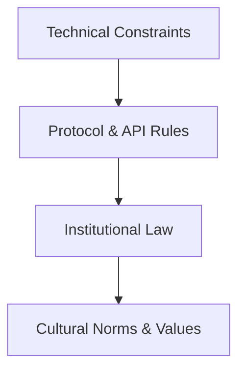
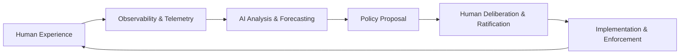

<div align="center">

# ⚖️ **Kansas Frontier Matrix — AI + Law Co-Evolution Standard (v11.2.2)**  
`docs/standards/ai-law-coevolution.md`

**Purpose**  
Define a shared, adaptive, ethically governed framework that enables **humans and AI systems to co-evolve legal, ethical, and operational norms**—supporting coexistence, safety, dignity, sovereignty, and long-term thriving.

[]() ·
[]() ·
[]() ·
[]()

</div>

---

## 📘 Overview

### Purpose  
This standard establishes the **core architecture, principles, and processes** by which humans and AI systems jointly evolve laws, rules, and governance mechanisms. It ensures that future legal systems remain adaptive, observable, ethical, sovereign-safe, and aligned with human values.

### Executive Summary  
AI + Law co-evolution requires:

- **Shared foundational principles** (dignity, agency, fairness, sovereignty, non-harm).  
- **A stratified law stack** (technical → protocol → institutional → cultural).  
- **Continuous observability** of impacts on communities, ecosystems, and society.  
- **Feedback loops** transforming harms and benefits into legal adaptation.  
- **Explicit human authority** over values and normative decisions.  
- **AI participation** in analysis, forecasting, compliance checks, contradiction detection.  
- **Transparent, versioned legal change** with provenance and sunset clauses.

The result is a **governable socio-technical ecosystem** capable of long-term coexistence and mutually beneficial evolution.

### Scope  
This standard applies to any domain where  
**AI systems + human institutions jointly produce, refine, or enforce legal obligations.**

### Audience  
Legislators · AI developers · Governance councils · Policy analysts · Sovereignty experts · Public stakeholders

---

## 🗂️ Directory Layout

```text
📁 KansasFrontierMatrix/
│
├── 📂 docs/
│   ├── 📂 standards/                        — All governance & ethical frameworks
│   │   └── ai-law-coevolution.md            — This standard
│   ├── 📂 governance/                       — ROOT policy, councils, charters
│   ├── 📂 faircare/                         — FAIR+CARE & sovereignty frameworks
│   ├── 📂 architecture/                     — System + legal architecture
│   └── 📄 glossary.md                       — Unified terminology (legal/AI)
│
├── 📂 schemas/                              — Legal/AI JSON-LD, SHACL, DCAT/STAC
│   ├── 📂 json/                              — ai-law-coevolution-v11.2.2.schema.json
│   └── 📂 shacl/                             — ai-law-coevolution-v11.2.2-shape.ttl
│
└── 📂 .github/                               — Governance CI (policy-lint, legal-audit)
    └── 📂 workflows/
        └── governance-ci.yml
```

---

## 🧭 Context

Human + AI co-evolution demands:

- **Ontological unity:** laws modeled consistently via CIDOC-CRM, OWL-Time, PROV-O.  
- **Ethical invariants:** CARE, sovereignty, fairness, agency.  
- **Technical constraints:** sandboxing, access control, deterministic behavior.  
- **Societal legitimacy:** human deliberation, representation, democratic legitimacy.  
- **Environmental context:** treating energy, data, compute as shared resources.

This standard encodes the mechanisms enabling long-term coexistence.

---

## 🗺️ Diagrams

### Law as a Multi-Layer Governance Stack



### Co-Evolution Feedback Loop



---

## 🧠 Story Node & Focus Mode Integration

- Co-evolutionary events (legal updates, incidents, resolutions) become **Story Nodes**.  
- Focus Mode can:
  - Highlight contradictions across laws  
  - Summarize impacts on communities  
  - Link legal provisions to pipeline outputs  
- Focus Mode **cannot**:
  - Create normative law  
  - Overwrite sovereignty  
  - Invent legal interpretations  

All narrative generation must include provenance, citations, and sovereignty checks.

---

## 🧪 Validation & CI/CD

Governance CI workflows MUST validate:

- Structure (v11.2.2 front-matter)  
- Provenance chain continuity  
- FAIR+CARE compliance  
- Sovereignty policies  
- JSON-LD validity (schema-lint)  
- SHACL shape compliance  
- Accessibility  
- Non-speculative AI transforms  
- Policy contradictions (automated conflict detection)

Any violation → governance-blocked merge.

---

## 📦 Data & Metadata

Every legal rule, policy, or amendment MUST include:

- **PROV-O lineage** (who/when/why/how)  
- **STAC/DCAT metadata** (for discoverability)  
- **Temporal validity** (OWL-Time interval)  
- **Jurisdiction**  
- **Affected stakeholders**  
- **Masking rules**  
- **Change impact analysis**  
- **Sunset clauses** (where appropriate)

Law becomes **versioned, observable data**.

---

## 🧱 Architecture

### 1. Foundational Principles  
- Human agency  
- Non-harm  
- Sovereignty  
- Transparency  
- Reproducibility  
- Ecological responsibility  
- Shared stewardship  
- Ethical co-creation  

### 2. The Four-Layer Law Stack  
1. **Technical constraints:** sandboxing, rate limits, model scopes  
2. **Protocol layer:** API contracts, usage policies  
3. **Institutional law:** legislation, treaties, regulatory rules  
4. **Cultural norms:** professional ethics, social taboos, customs  

### 3. Observability-Driven Governance  
- Continuous telemetry of AI impacts  
- Harm detection pipelines  
- AI-assisted contradiction auditing  
- Public transparency dashboards  

### 4. Human–AI Shared Roles  
**Humans:** values, goals, legitimacy, narrative meaning  
**AI:** simulation, forecasting, consistency checks, summarization  

Humans retain final authority; AI extends analytical reach.

---

## ⚖ FAIR+CARE & Governance

### FAIR  
- Findable laws  
- Accessible reasoning  
- Interoperable formats  
- Reusable governance data  

### CARE  
- Collective benefit  
- Authority to control  
- Responsibility  
- Ethics  

### Sovereignty  
- No legal rule may harm Indigenous, custodial, or culturally significant communities.  
- All sensitive content must follow masking policies (H3 r7).  

---

## 🕰️ Version History

| Version | Date       | Notes                                                                |
|--------:|-----------:|----------------------------------------------------------------------|
| v11.2.2 | 2025-11-27 | Initial creation. Fully aligned to KFM-MDP v11.2.2.                  |
| v11.0.0 | 2025-11-20 | Precursor concepts discussed informally; no formal standard existed. |

---

<div align="center">

**Kansas Frontier Matrix — AI + Law Co-Evolution Standard (v11.2.2)**  
Scientific Insight × FAIR+CARE Ethics × Sustainable Intelligence  

[⬅ Back to Standards](./README.md) ·  
[📜 Governance Charter](./governance/ROOT-GOVERNANCE.md) ·  
[🌐 Project Homepage](../../README.md)

</div>
