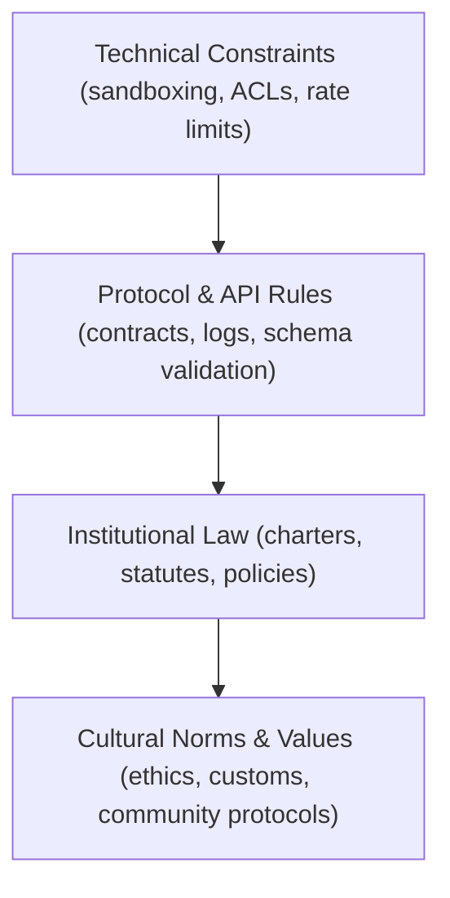
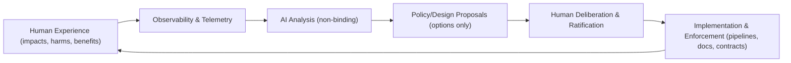
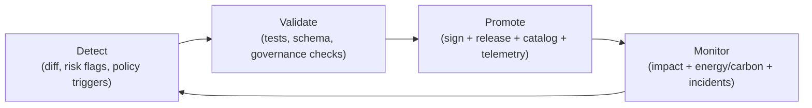
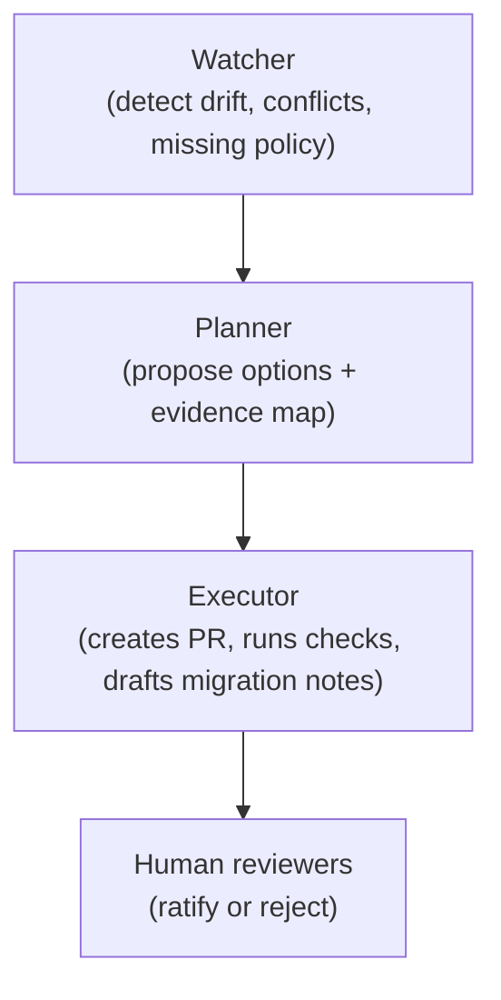

# ⚖️ **Kansas Frontier Matrix — AI + Law Co-Evolution Standard (v11.2.3)**  
`docs/standards/ai-law-coevolution.md`

**Purpose**  
Define a shared, adaptive, ethically governed framework that enables **humans and AI systems to co-evolve legal, ethical, and operational norms**—supporting coexistence, safety, dignity, sovereignty, and long-term thriving.

> This standard does **not** provide legal advice, create binding obligations, or interpret law as a court/attorney would.  
> It defines how KFM **models**, **observes**, and **governs** interactions between AI systems and legal/ethical frameworks.

 ·
 ·
 ·
 ·
 ·
 ·
 ·
 ·
 ·

> [!IMPORTANT]
> **Human authority is the only authority.**  
> AI may analyze, summarize, and propose *options*—but **only humans ratify** governance outcomes.

> [!NOTE]
> **Normative keywords** in this standard are interpreted as follows:  
> **MUST / MUST NOT** (required), **SHOULD / SHOULD NOT** (strongly recommended), **MAY** (optional).

> [!TIP]
> If you’re about to add a new policy, exemption, or “AI decides…” clause: **stop** ✋  
> Convert it into a **proposal + evidence + review record**, then route it through governance CI.

---

## 📘 Overview

### 1) Intent (what this standard does)

This standard defines how KFM systems (humans + software + AI assistants) jointly:

- Model legal/ethical rules as **versioned, discoverable, testable artifacts** 📜
- Detect conflicts, gaps, and potential harms (including sovereignty impacts) 🧭
- Propose *non-binding* governance options (with evidence + lineage) 🔍
- Track “law as living infrastructure” over time via **telemetry + provenance** 📈

The goal is a **governable socio-technical ecosystem** that remains:

- **Adaptive** — rules evolve with context, without silent breaks 🔁  
- **Observable** — changes are measurable (before/after impacts) 📊  
- **Ethical** — constrained by FAIR+CARE + sovereignty policies 🛡️  
- **Human-led** — final normative judgment always rests with humans 👥  

### 2) Scope (where it applies)

Applies when KFM systems are used to:

- Support **policy analysis**, scenario exploration, or risk flagging 🧪  
- Link governance documents to **datasets, pipelines, contracts, or Story Nodes** 🔗  
- Present governance-related narratives or summaries in **Focus Mode** 🧠  
- Drive policy-as-code enforcement (e.g., access gates, redaction rules) 🔐  

Does **not** authorize AI to:

- Draft binding laws/contracts, interpret real-world law as counsel, or issue rulings ⚠️  
- Create enforceable obligations without explicit human approval ✅  
- Override sovereignty constraints, classification rules, or access control 🚫  

### 3) Who this is for

- FAIR+CARE Council & Governance Chamber 🏛️  
- Legal/policy analysts (human) ⚖️  
- Platform & data engineers 🧰  
- Community/Indigenous sovereignty stewards 🪶  
- Sustainability & risk officers 🌿  

### 4) What “compliant” looks like ✅

A compliant implementation MUST produce:

- **A proposal trail** (who proposed what, when, why) 🧾  
- **Evidence links** (datasets, contracts, tests, citations) 🔍  
- **Provenance** (PROV/OpenLineage) that distinguishes human vs AI contributions 🧬  
- **Governance telemetry** (what changed, what was reviewed, what gates fired) 📈  
- **A ratification record** (who approved + under what policy) 🗳️  

<strong>🧩 Minimal implementation checklist (copy/paste into PRs)</strong>

- [ ] Proposal labeled **NON-BINDING** + includes alternatives
- [ ] Evidence attached (tests, documents, dataset references, citations)
- [ ] Provenance captured (authors, timestamps, toolchain, AI involvement)
- [ ] Sovereignty + classification propagation verified
- [ ] Governance CI passes (schema + lint + checks + signatures/attestations)
- [ ] Telemetry emitted (governance + energy + carbon where applicable)
- [ ] Human ratification recorded (review link + decision record)

---

## 🗂️ Directory Layout

> [!NOTE]
> Repo layouts evolve. This layout is the **governance-critical minimum**—adjust paths if the repository changes, but keep the *artifact intent* intact.

~~~text
📂 KansasFrontierMatrix/
├── 📂 api/                               # 🌐 FastAPI + GraphQL surfaces (contracts-first)
│   └── 📂 contracts/                     # 🧾 OpenAPI/GraphQL + contract-shaped schemas
│       ├── 📂 changelog/                 # 📜 Contract changelog (externally observable changes)
│       └── 📂 schemas/
│           ├── 📂 dcat/                  # 🧭 Discovery feeds (DCAT profile)
│           └── 📂 telemetry/             # 📈 Governance / energy / carbon telemetry schemas
├── 📂 data/
│   ├── 📂 catalog/
│   │   ├── 📂 dcat/                      # 🧭 DCAT catalogs/feeds (machine discoverability)
│   │   └── 📂 stac/                      # 🛰️ STAC items/collections (spatiotemporal metadata)
│   └── 📂 prov/                          # 🔗 Provenance bundles (PROV-O / lineage exports)
├── 📂 schemas/
│   ├── 📂 json/                          # ✅ JSON Schemas (docs + payload validation)
│   └── 📂 shacl/                         # 🧩 SHACL shapes (graph/ontology validation)
├── 📂 docs/
│   ├── 📂 standards/
│   │   ├── 📄 ai-law-coevolution.md       # ⚖ (this file)
│   │   └── 📄 README.md                  # 📚 Standards index
│   ├── 📂 governance/
│   │   ├── 📄 ROOT_GOVERNANCE.md          # 🏛 Root governance charter
│   │   ├── 📄 ETHICS.md                   # 🌱 Ethics + safety commitments
│   │   └── 📄 SOVEREIGNTY.md              # 🛡️ Sovereignty + redaction/generalization rules
│   ├── 📂 templates/
│   │   └── 📄 TEMPLATE__STORY_NODE_V3.md   # 🧠 Story Node template (evidence + provenance)
│   └── 📄 MARKDOWN_GUIDE_v13.md           # ✍️ KFM authoring + evidence-first rules
├── 📂 pipelines/                          # 🧪 Data pipelines (deterministic, reproducible)
├── 📂 releases/
│   └── 📂 v11.2.3/                        # 🔏 Signed releases (SBOM + SLSA + telemetry)
│       ├── 📄 sbom.spdx.json
│       ├── 📄 slsa-attestation.json
│       └── 📄 governance-telemetry.json
└── 📄 README.md                            # 🏁 Project root overview
~~~

### Author rules 🧑‍💻

- Any document that **claims conformance** to this standard MUST:
  - Live under `docs/standards/` **or** `docs/governance/`, and  
  - Declare it is **non-binding** and **not legal advice**.
- Any change that affects public behavior MUST:
  - Be reflected in **contracts/changelog** (if client-observable), and  
  - Include migration notes if it impacts consumers.

---

## 🧭 Context

### 1) KFM perspective: governance is “data + lineage”

KFM treats governance artifacts (laws, policies, standards, charters) as **versioned entities** that can be:

- Verified (schemas/tests),  
- Cataloged (DCAT),  
- Linked to spatiotemporal datasets (STAC), and  
- Traced through time (PROV/OpenLineage).  

This enables questions like:

- “Which governance rules were in effect when dataset X was ingested?”  
- “What policy change preceded this impact spike?”  
- “Was this narrative derived from evidence or interpretation?”

### 2) Why AI + law requires extra guardrails

In legal/policy contexts, AI can be helpful for scale (comparison, search, summarization).  
But it can also create *illusory authority* (hallucinated rules, overconfident claims).

So KFM treats AI as:

- An **analytical partner**, not an authority ✅  
- A **proposal generator**, not a ratifier ✅  
- A **telemetry producer**, not a policy-maker ✅  

### 3) Digital humanism anchor 🧑‍🤝‍🧑

KFM’s co-evolution model aligns with digital humanism: technology is human-shaped and must serve human values (rights, dignity, accountability, privacy), rather than displacing them.

### 4) Federation readiness 🌐

KFM anticipates multi-hub federation (“other state matrices”).  
Co-evolution only works at federation scale if we have shared trust primitives:

- Clear usage rights (digital sovereignty)  
- Provenance + verification (veracity)  
- Standardized security profiles and auditability  
- Interoperable metadata + vocabularies

---

## 🗺️ Diagrams

### 1) Law as a multi-layer governance stack 🧱

### 2) Co-evolution feedback loop 🔁

### 3) Governance-safe change workflow (Detect → Validate → Promote) ✅

### 4) Watcher–Planner–Executor pattern (W–P–E) 🧠🤖

---

## 🧱 Architecture & Law Stack

### 1) Foundational principles 🌱

KFM AI + Law co-evolution is anchored in:

- **Human agency** — humans retain ultimate normative authority 👥  
- **Non-harm** — prioritize safety, dignity, and well-being 🛡️  
- **Sovereignty** — respect Indigenous/community rights & protocols 🪶  
- **Transparency** — rationale and evidence must be visible 🔎  
- **Reproducibility** — procedures are testable and repeatable 🧪  
- **Ecological responsibility** — track energy/carbon impacts 🌿  

### 2) The four-layer law stack (KFM view) 🧱

1. **Technical Constraints**  
   Sandboxing, access control, throttling, model scopes, data minimization.  
2. **Protocol & API Rules**  
   OpenAPI/GraphQL contracts, schema validation, logging, error semantics.  
3. **Institutional Law & Governance**  
   Charters, policies, standards; explicit versioning + ratification records.  
4. **Cultural Norms & Values**  
   Ethics, Indigenous protocols, community agreements, professional standards.

> [!IMPORTANT]
> AI may assist at all layers but may **not** rewrite any layer unilaterally.

### 3) Non‑negotiable invariants (anti-chaos rules) 🧭

The following are “do-not-break” expectations for co-evolution work:

- **Evidence-first**: no unsourced narrative; distinguish fact vs interpretation 🧾  
- **Provenance-first**: record who/what generated claims, including AI involvement 🔗  
- **Contracts-first**: external behavior is defined at contract boundaries 🧾  
- **Deterministic pipelines** where feasible: same inputs → same outputs 🧪  
- **Classification propagation**: outputs cannot be less restricted than inputs 🛡️  
- **Stable identifiers** for governance artifacts (no “floating IDs”) 🧷  

### 4) Human–AI role split 🤝

**Humans (councils, communities, maintainers):**

- Set values and long-term goals  
- Ratify or reject proposals  
- Interpret law/social meaning  
- Own accountability for decisions

**AI systems (inside KFM constraints):**

- Summarize & compare large document sets  
- Flag contradictions and missing coverage  
- Suggest *non-binding* scenarios and options  
- Draft explanatory materials for humans to edit

All AI outputs related to law/governance MUST:

- Be labeled **NON-BINDING**  
- Include provenance + references  
- Avoid claims of legal authority

### 5) Threat model (minimum) 🧨

Common failure modes and required mitigations:

| Threat | Example | Minimum mitigation |
|---|---|---|
| Hallucinated authority | “Kansas law requires X” (fabricated) | Non-binding labels + citations + human ratification |
| Governance override | AI “auto-merges” policy | CI gates + restricted permissions + human approvals |
| Data leakage | Sensitive locations in summaries | Redaction/generalization rules + classification propagation |
| Prompt injection | Malicious text in docs triggers unsafe output | Sanitization + policy pack enforcement + review |
| Supply chain compromise | Tampered deps/artifacts | SBOM + attestations + signed releases |

---

## 🧠 Story Node & Focus Mode Integration

### 1) Governance events as Story Nodes 🧠

Key co-evolution moments SHOULD be captured as Story Nodes:

- Adoption of a new standard (e.g., ethics/sovereignty updates)  
- Policy changes affecting access control or redaction  
- Incident analyses and remediation decisions  
- Shifts in law-stack assumptions (e.g., new minimization rules)

Each Story Node SHOULD include:

- Links to the relevant standards (this file + governance docs) 🔗  
- Temporal context (effective interval) 🕰️  
- Impact telemetry (before/after) 📈  
- Evidence references (datasets, tests, reports) 🧾  

### 2) Focus Mode behavior (restricted) 🧠🔒

When Focus Mode is scoped to governance content, it MAY:

- Provide summaries of sections  
- Highlight key principles, roles, layers  
- Surface links to impacted datasets/pipelines/contracts

It MUST NOT:

- Offer legal interpretation or advice  
- Claim AI text is binding or authoritative  
- Rewrite normative requirements  
- Create new obligations without human approval

**UI/UX contract (Focus Mode):**

- Clearly marked as *assistive* and *non-authoritative*  
- Shows classification + redaction notices when applicable  
- Presents evidence links and provenance when making claims

### 3) Transform enforcement & telemetry 📈

- Allowed transforms MUST match `transform_registry.allowed`.  
- Forbidden transforms MUST fail CI.  
- Governance telemetry MUST record:
  - which transforms ran,
  - whether a redaction notice was shown,
  - and any sovereignty gate triggers.

---

## 🧪 Validation & CI/CD

### 1) Governance-aware CI pipeline goals 🎯

Governance CI MUST validate:

- **Structure & metadata**  
  - YAML front-matter compliance with the JSON schema  
  - Markdown compliance with KFM-MDP rules  
- **Provenance continuity**  
  - Stable IDs, event source IDs, release refs, lineage hooks  
- **Ethics & sovereignty**  
  - Correct governance refs (ETHICS / SOVEREIGNTY)  
  - Classification propagation checks  
- **Transform boundaries**  
  - Reject prohibited transform tags/patterns  
- **Accessibility**  
  - WCAG structure checks for headings/landmarks  

### 2) Detect → Validate → Promote pipeline ✅

A compliant governance pipeline SHOULD implement:

1. **Detect**  
   - Diff + risk categorization (including sovereignty triggers)  
2. **Validate**  
   - Schema checks + contract tests + security checks  
3. **Promote**  
   - Sign release + emit attestations + publish catalogs + emit telemetry  
4. **Monitor**  
   - Impact + incident flags + energy/carbon telemetry

### 3) Supply chain integrity 🔏

For governed releases, include:

- SBOM (SPDX)  
- SLSA attestation  
- Signature reference  
- Reproducible build metadata where feasible

### 4) Evidence credibility (modeling mindset) 🧪

When AI is used for forecasting, risk scoring, or scenario simulation:

- Treat results as **models**, not truth  
- Prefer verifiable methods + uncertainty reporting  
- Require documentation of assumptions, limitations, and validation status

> [!WARNING]
> If an AI output would change enforcement behavior (access, redaction, publication),  
> it is automatically **GOV-REVIEW REQUIRED**.

---

## 📦 Data & Metadata

### 1) Governance artifacts as first-class data 🗂️

Every governed artifact (standard/policy/charter) SHOULD be represented with:

- **Stable ID** (urn/URI)  
- **Version** (SemVer or equivalent)  
- **Effective interval** (OWL-Time)  
- **Provenance** (PROV-O)  
- **Catalog metadata** (DCAT)  
- **Links to impacted datasets** (often via STAC references)

### 2) Minimal metadata field set (recommended) ✅

| Field | Purpose |
|---|---|
| `doc_uuid` | stable identifier (never reused) |
| `version` | contract for readers/tools |
| `event_source_id` | ties into governance ledger |
| `telemetry_ref` | audit trail of checks + gates |
| `signature_ref` / `attestation_ref` | integrity + trust |
| `governance_ref` / `ethics_ref` / `sovereignty_policy` | controlling constraints |

### 3) Mapping to open standards 🌐

- **DCAT** for discovery and distribution of governance artifacts  
- **STAC** for linking spatiotemporal datasets to governance scope  
- **PROV/OpenLineage** for lifecycle traceability and accountability

---

## ⚖ FAIR+CARE & Sovereignty

### 1) Binding constraints (cannot be overridden) 🛡️

This standard is downstream of and constrained by:

- `docs/governance/ROOT_GOVERNANCE.md` 🏛️  
- `docs/governance/ETHICS.md` 🌱  
- `docs/governance/SOVEREIGNTY.md` 🪶  

### 2) Classification propagation rule 🔒

- Outputs MUST NOT be less restricted than inputs.  
- If sovereignty flags apply, redaction/generalization rules MUST be enforced before publication.

### 3) GOV-REVIEW REQUIRED triggers ✅

Tag proposals with **`GOV-REVIEW REQUIRED`** when they include:

- A new public endpoint, feed, or download capability  
- Increased spatial/temporal resolution (risk of sensitive location exposure)  
- Changes to redaction/generalization behavior  
- Reclassification (private → public) or weaker access control  
- AI-generated narrative treated as factual without evidence hooks

### 4) Indigenous rights flag 🪶

When `indigenous_rights_flag: true`:

- CARE review is required  
- Community consultation must occur as defined by sovereignty policy  
- Rationale and outcomes must be recorded in the governance ledger

---

## 🕰️ Version History

| Version | Date       | Author / Owner              | Summary |
|--------:|------------|-----------------------------|---------|
| v11.2.3 | 2026-01-12 | KFM Governance Council       | Strengthened governance-safe workflow (Detect→Validate→Promote), W–P–E framing, federation readiness, and CI guardrails. No breaking changes to v11.2.x. |
| v11.2.2 | 2025-11-27 | KFM Governance Council       | Formalized AI + Law Co-Evolution Standard under KFM-MDP v11.2.4; added transform limits, telemetry hooks, and explicit FAIR+CARE/sovereignty alignment. |
| v11.0.0 | 2025-11-20 | KFM Core Team                | Initial articulation of AI + law co-evolution principles and four-layer law stack; informal, non-normative notes. |

---

⚖️ **Kansas Frontier Matrix — AI + Law Co-Evolution Standard (v11.2.3)**  
Scientific Insight × FAIR+CARE Ethics × Sustainable Intelligence  

© 2026 Kansas Frontier Matrix — CC-BY 4.0  
Master Coder Protocol v6.3 · FAIR+CARE Guided · Diamond⁹ Ω / Crown∞Ω Ultimate Certified  

[⬅ Back to Standards Index](README.md) ·  
[🏛 Root Governance Charter](../governance/ROOT_GOVERNANCE.md) ·  
[🌱 Ethics Standard](../governance/ETHICS.md) ·  
[🪶 Sovereignty Policy](../governance/SOVEREIGNTY.md)

