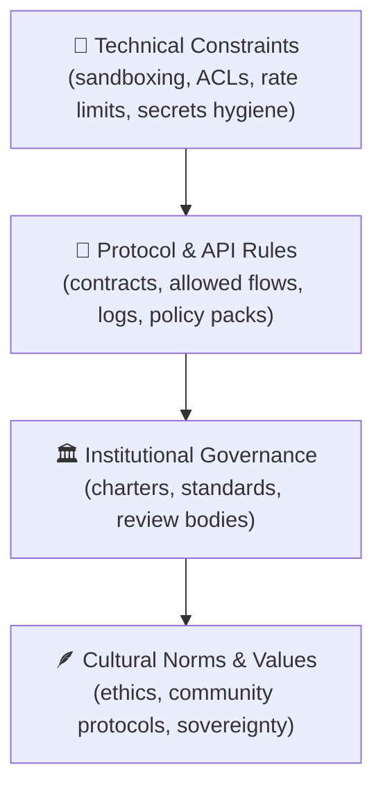
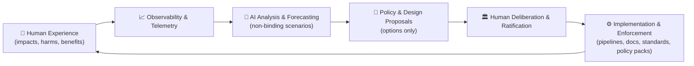
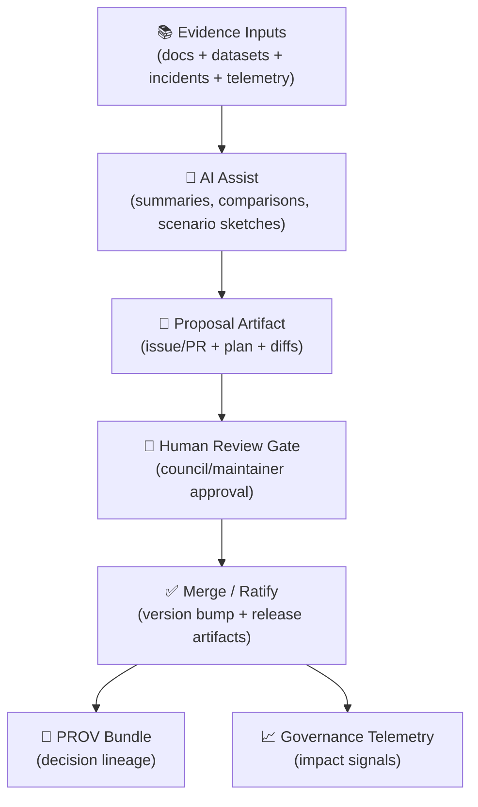

<div align="center">

# ⚖️ **Kansas Frontier Matrix — AI + Law Co-Evolution Standard (v11.3.0)**  
`docs/standards/ai-law-coevolution.md`

**Purpose**  
Define a shared, adaptive, ethically governed framework that enables **humans and AI systems to co-evolve legal, ethical, and operational norms**—supporting coexistence, safety, dignity, sovereignty, and long-term thriving 🌱🤝🧠

> **Non‑binding & not legal advice.**  
> This standard defines how KFM **models, observes, and governs** interactions between AI systems and legal/ethical frameworks.  
> It does **not** create real‑world legal advice, binding law, or enforceable obligations.

[]() ·
[]() ·
[]() ·
[]() ·
[]() ·
[]()

</div>

---

## 📘 Overview

### 1) Intent 🧭
This standard establishes the **core architecture, principles, and processes** by which humans and AI systems jointly (but asymmetrically) do the following:

- 🧾 **Observe** governance and legal artifacts as versioned evidence (documents, policies, charters, standards)
- 🔎 **Analyze** changes, conflicts, gaps, and risks (non-binding)
- 🧪 **Propose** options for human review (never binding)
- 🧷 **Record** decisions with provenance (who/what/when/why) and publishable metadata
- 📈 **Measure** impact through telemetry (including energy/carbon accounting where applicable)
- 🔁 **Evolve** governance safely over time (co-evolution loop)

KFM’s design assumption: **AI can detect patterns and propose scenarios, but legitimacy remains human and community-grounded**.

### 2) The foundational analogy: “law as prophecy” ↔ machine learning 🧠⚖️
Modern ML is largely inductive pattern-finding on historical data. Legal systems also evolve through patterns—precedent, institutional practice, and probabilistic expectations about how authorities act.

KFM adopts this analogy carefully:
- ML-style predictions can help explore “what might happen if…”
- but **predictions do not become obligations**
- and historical bias must be handled explicitly (governance + measurement + review gates)

### 3) What this standard explicitly forbids 🚫
KFM systems (including Focus Mode) MUST NOT:
- provide legal advice or attorney-like interpretations
- claim authority to declare rights/obligations
- rewrite normative requirements without human approval
- create binding policy changes automatically
- bypass sovereignty or FAIR+CARE constraints

### 4) Audience 👥
- 🏛 Governance & FAIR+CARE councils
- ⚖ Legal and policy analysts (advisory context only)
- 🧑‍💻 AI + systems architects
- 🪶 Indigenous and community sovereignty stewards
- 🌍 Sustainability and risk officers

---

## 🗂️ Directory Layout

```text
📂 Kansas-Frontier-Matrix/
├── 📂 docs/
│   ├── 📄 MASTER_GUIDE_v13.md                  # 📘 Canonical system guide (architecture + golden paths)
│   ├── 📂 standards/
│   │   ├── 📄 ai-law-coevolution.md            # ⚖ This standard
│   │   ├── 📄 data-contracts.md                # 📜 Dataset contract standard (contract-first metadata)
│   │   ├── 📄 KFM_PROV_PROFILE.md              # 🧬 Provenance standard (PROV-O JSON-LD)
│   │   ├── 📄 KFM_STAC_PROFILE.md              # 🗺️ STAC profile standard
│   │   ├── 📄 KFM_DCAT_PROFILE.md              # 🧾 DCAT profile standard
│   │   └── 📄 faircare.md                      # ⚖ FAIR+CARE governance layer
│   ├── 📂 governance/
│   │   ├── 📄 ROOT_GOVERNANCE.md               # 🏛 Root charter
│   │   ├── 📄 ETHICS.md                        # 🧠 Ethics policy
│   │   ├── 📄 SOVEREIGNTY.md                   # 🪶 Sovereignty policy (CARE-driven)
│   │   ├── 📄 SECURITY.md                      # 🔐 Security policy + incident pathways
│   │   └── 📄 REVIEW_GATES.md                  # 🚦 Human review escalation triggers
│   └── 📂 reports/
│       └── 📂 story_nodes/                     # 🎬 Narrative governance events & system stories
│           ├── 📂 draft/
│           └── 📂 published/
│
├── 📂 mcp/                                     # 🧠 Methods, Controls & Processes (SOPs, evaluations, bias checks)
│   ├── 📂 sops/
│   └── 📂 eval/
│
├── 📂 data/
│   ├── 📂 sources/                             # 🔗 Source manifests (license, URLs, checksums)
│   ├── 📂 stac/                                # 🗺️ STAC catalogs (collections + items)
│   ├── 📂 catalog/dcat/                        # 🧾 DCAT datasets/feeds
│   └── 📂 prov/                                # 🧬 PROV bundles (including governance events when modeled)
│
├── 📂 schemas/                                 # 📐 JSON Schemas + SHACL shapes + telemetry
├── 📂 releases/                                # 📦 Signed release bundles (SBOM, attestations, manifests, telemetry)
└── 📂 .github/workflows/                       # ✅ CI gates (governance + policy packs + provenance checks)
```

**Author rules**
- Any doc claiming to extend/implement this standard MUST live under `docs/standards/` or a governed subfolder.
- Any legal/policy-adjacent analysis MUST:
  - reference this standard + governance charter + FAIR+CARE,
  - state it is non-binding and not legal advice,
  - emit provenance if it changes the repo state (PRs, merges, releases).

---

## 🧭 Context

### 🧾 Governance is treated as data (and is therefore auditable)
KFM treats governance artifacts (policies, charters, standards, incident writeups, review outcomes) as first-class entities with:

- 🧬 provenance (who created/approved/updated; what evidence was used)
- ⏳ temporal validity (effective intervals, supersession, deprecation)
- 🧾 catalog metadata (discoverable like datasets)
- ⚖ FAIR+CARE + sovereignty flags (who can see what, and why)

This supports “time travel queries”:
> *Which governance version applied when dataset X was ingested or when Story Node Y was published?*

### 🧠 Human-centered constraints (digital humanism aligned)
KFM’s stance is: **AI augments—humans govern**.  
AI assistance is opt-in, explainable, and bounded by review gates.

### 🔎 Evidence-first boundary (KFM spine)
In KFM, governance claims that affect datasets, access, or UI behavior SHOULD be expressible across:
- 🛰️ STAC (where/when/what assets)
- 🗂️ DCAT (who/license/access)
- 🧬 PROV (how/derived-from/who-approved)

---

## 🗺️ Diagrams

### 1) Law as a Multi‑Layer Governance Stack 🧱⚖️


### 2) Co‑Evolution Feedback Loop 🔁🌱


### 3) Provenance Boundary: AI proposes, Humans decide 🧬🚦


---

## 🧱 Architecture & Law Stack

### 1) Foundational principles ✅
KFM AI + Law co-evolution is anchored in:

- 👤 **Human agency & accountability** — humans remain final authorities for normative choices
- 🛟 **Safety-first** — avoid foreseeable harms; block unsafe outputs
- 🪶 **Sovereignty-by-design** — respect Indigenous/community authority to control
- 🔎 **Transparency** — show rationale and references; separate AI suggestions from human decisions
- 🧬 **Reproducibility** — deterministic procedures; provenance for changes
- 🌍 **Ecological responsibility** — track energy/carbon impacts for compute-heavy governance tooling

### 2) The “Policy Sandbox” pattern 🧪🧾
All governance evolution MUST flow through controlled change channels:

- 🧾 Proposed change → Issue/PR
- ✅ Automated checks (schemas, policy pack, provenance, security)
- 🚦 Review gate (human sign-off required)
- 📦 Release bundle updated (SBOM, attestation, signature, telemetry)

> [!IMPORTANT]
> AI may help prepare proposals but MUST NOT merge/ratify them.  
> A governance decision without a human review boundary is non-conformant.

### 3) Human–AI role split 🤝
**Humans (council, maintainers, communities):**
- define values and priorities
- decide what “ought” to be
- interpret law and social meaning
- own accountability for decisions

**AI systems (within KFM constraints):**
- compare documents and highlight inconsistencies
- summarize long texts for navigation
- generate scenario sketches (“if policy A + dataset B, possible impacts…”)
- suggest non-binding alternatives for human review

All AI outputs related to law/governance MUST:
- be explicitly labeled **non-binding**
- include references to source materials
- avoid language implying legal authority or finality

### 4) “Legal lineage” extensions (KFM-specific) 🧬⚖️
KFM models governance changes as PROV-compatible events:

- **LegalArtifact / GovernanceArtifact** = `prov:Entity` (standard/policy/charter/incident report)
- **GovernanceChange** = `prov:Activity` (drafting, review, ratification, publication)
- **Authority / Council / Maintainer** = `prov:Agent`

Recommended relations:
- `prov:wasRevisionOf` (superseded documents)
- `prov:used` (evidence used to decide)
- `prov:wasAssociatedWith` (review bodies)
- `prov:wasGeneratedBy` (publication activity)

---

## 🧠 Story Node & Focus Mode Integration

### 1) Governance events as Story Nodes 🎬
Major governance events SHOULD be represented as Story Nodes:
- adoption of a new standard
- sovereignty policy update
- incident response + remediation
- major AI safety constraint changes
- public release governance changes (telemetry + attestations)

Each governance Story Node SHOULD:
- link the decision to evidence inputs (docs/datasets)
- show temporal context (effective date range)
- reference telemetry before/after (where meaningful)
- carry a PROV pointer to the ratification activity bundle

### 2) Focus Mode behavior (restricted) 🧠🔒
Focus Mode MAY:
- provide summaries of governance docs (navigation)
- highlight key roles, layers, and constraints
- point to related KFM standards and controlled vocab
- identify “this is restricted / not determinable here” cases

Focus Mode MUST NOT:
- provide legal advice or attorney-style interpretation
- claim binding authority
- invent new requirements or permissions
- bypass sovereignty or CARE restrictions

> [!TIP]
> Focus Mode’s default posture for legal questions should be:
> **“I can summarize and point to sources; for legal advice, consult a licensed professional.”**

### 3) Required UI disclosure patterns 🪧
When Focus Mode touches governance/law content, the UI SHOULD show:
- “AI-generated summary (non-binding)”
- “Sources used”
- “Last updated date + version”
- “Restrictions triggered (if any)”
- “Escalate to governance review” CTA when needed

---

## 🧪 Validation & CI/CD

### 1) What must be validated ✅
Governance-aware CI MUST validate:

- 🧾 **Structure & metadata**
  - YAML front-matter conforms to `ai-law-coevolution-v11.3.0.schema.json`
  - Markdown structure conforms to KFM-MDP v11.2.4 and a11y profiles

- 🧬 **Provenance continuity**
  - version bumps required for normative text changes
  - `event_source_id` is unique per version
  - release refs present for official publishes (signature/SBOM/attestation/manifest)

- 🔐 **Security & supply chain integrity**
  - SBOM presence for release artifacts
  - provenance attestations for build/release
  - secrets scanning, dependency scanning, baseline threat checks

- ⚖ **Ethics & sovereignty**
  - FAIR+CARE alignment (required references and constraints)
  - sovereignty policy triggers for culturally sensitive content
  - redaction rules (if applicable)

- 🚫 **Transform boundaries**
  - rejects forbidden transform tags or implied authority language
  - blocks “AI may decide/approve/ratify” patterns

- 📈 **Telemetry**
  - governance telemetry emission for enforced checks
  - optional energy + carbon telemetry updates when CI runs heavy workloads

### 2) Policy Pack enforcement (OPA/Rego + Conftest recommended) 🧰🧾
KFM’s “policy pack” concept enables machine-readable governance rules:
- deny merges when restricted data exposure increases
- require human review for sovereignty-triggering changes
- require provenance for promoted artifacts
- ensure Focus Mode restrictions are preserved

### 3) AI bias & safety SOPs (MCP) 🧠🧪
KFM SHOULD maintain evaluation SOPs under `mcp/` (e.g., bias checks, red-team checks, audit checklists).  
Model updates and prompt/rule changes for Focus Mode SHOULD trigger:
- bias evaluation
- harmful-content regression checks
- hallucination-risk containment checks
- citation coverage checks (“no-citation answers” fail in governed contexts)

---

## 📦 Data & Metadata

### 1) Governance artifacts are catalogable 📚🗂️
KFM treats governance artifacts as catalogable objects:

- 🗂️ **DCAT** for discoverability (publisher, license, distributions)
- 🧬 **PROV** for lineage (who approved what, based on which evidence)
- 🛰️ **STAC** optionally for spatiotemporal framing (jurisdiction geometry, effective dates)

This enables consistent retrieval, linking, and time-scoped interpretation.

### 2) Minimal “Governance Artifact Record” (recommended JSON) 🧾
```json
{
  "id": "kfm_standard_ai_law_coevolution_v11_3_0",
  "title": "KFM AI + Law Co-Evolution Standard",
  "type": "standard",
  "jurisdiction": "Kansas / United States",
  "temporal": {
    "effective_start": "2026-01-12T00:00:00Z",
    "effective_end": null
  },
  "bindingness": "internal_standard_nonbinding_to_public",
  "publisher": "KFM FAIR+CARE Council",
  "license": "CC-BY-4.0",
  "catalog_refs": {
    "dcat_dataset": "data/catalog/dcat/kfm_standard_ai_law_coevolution_v11_3_0.dataset.jsonld",
    "prov_bundle": "data/prov/kfm_standard_ai_law_coevolution_v11_3_0.prov.jsonld"
  },
  "care": {
    "status": "approved",
    "reviewer": "KFM FAIR+CARE Council",
    "date_reviewed": "2026-01-12",
    "notes": "Non-binding governance standard; sovereignty-aware."
  },
  "updated": "2026-01-12T00:00:00Z"
}
```

### 3) Example: provenance bundle sketch (governance ratification) 🧬
```json
{
  "@context": {
    "prov": "http://www.w3.org/ns/prov#",
    "kfm": "https://kansasfrontiermatrix.org/ns/kfm#"
  },
  "@id": "kfm:prov:bundle:ai-law-coevolution:v11.3.0",
  "@type": ["prov:Bundle", "kfm:PROVBundle"],
  "kfm:prov_profile": "KFM-PROV v11",
  "prov:entity": {
    "kfm:entity:doc:ai-law-coevolution:v11.3.0": {
      "prov:type": "kfm:GovernanceArtifact",
      "prov:label": "AI + Law Co-Evolution Standard v11.3.0"
    }
  },
  "prov:activity": {
    "kfm:activity:ratify:ai-law-coevolution:v11.3.0": {
      "prov:type": "kfm:GovernanceChange",
      "prov:label": "Ratify standard update",
      "prov:used": ["kfm:entity:evidence:review-notes:v11.3.0"],
      "prov:generated": ["kfm:entity:doc:ai-law-coevolution:v11.3.0"]
    }
  },
  "prov:agent": {
    "kfm:agent:council:faircare": {
      "prov:type": "prov:Organization",
      "prov:label": "KFM FAIR+CARE Council"
    }
  }
}
```

> [!NOTE]
> This is a shape sketch. Conform the real artifact to `docs/standards/KFM_PROV_PROFILE.md`.

### 4) Telemetry expectations 📈🌍
Governance telemetry SHOULD capture:
- what checks ran
- which policy pack rules fired
- which review gates were triggered
- any redaction/withholding events
- optional energy + carbon accounting for compute-heavy governance runs

---

### 📚 Project Library Mapping (how the project files inform this standard) 🧠🧷
<details>
<summary><strong>Click to expand (full mapping)</strong> 📚✨</summary>

#### 🧭 KFM core project sources (authoritative for KFM’s own intent)
- 📄 **Kansas Frontier Matrix (KFM) – Comprehensive Technical Documentation.docx**  
  → Establishes Focus Mode as **advisory-only**, opt-in, and citation-driven; describes sensitive data handling (generalization, access control, tagging).
- 📄 **🌟 Kansas Frontier Matrix – Latest Ideas & Future Proposals.docx**  
  → Adds Policy Pack enforcement (OPA/Rego + Conftest), provenance-first CI agents (Watcher–Planner–Executor), PR→PROV integration, telemetry + energy/carbon tracking, supply-chain attestations.
- 📄 **Audit of the Kansas Frontier Matrix (KFM) Repository.pdf**  
  → Confirms Focus Mode’s evidence-first design and highlights governance/process documentation and implementation gaps to close via standards + CI.

#### ⚖️ AI + law conceptual foundation
- 📘 **On the path to AI Law’s prophecies and the conceptual foundations of the machine learning age.pdf**  
  → Frames law/precedent as pattern-grounded induction; informs KFM’s “scenario ≠ obligation” stance and bias/precedent cautions.

#### 🧠 Human-centered governance
- 📘 **Introduction to Digital Humanism.pdf**  
  → Reinforces dignity, agency, transparency, and accountable socio-technical design.

#### 🧺 Inter-org trust and governance infrastructure
- 📘 **Data Spaces.pdf**  
  → Supports policy-based sharing, interoperability, and auditability across stakeholders.

#### 🔐 Security posture & defensive maturity (non-offensive use)
- 📘 **ethical-hacking-and-countermeasures-secure-network-infrastructures.pdf**  
  → Supports threat-aware governance ops: logging, defense-in-depth, incident thinking.
- 📘 **Gray Hat Python - Python Programming for Hackers and Reverse Engineers (2009).pdf**  
  → Used only to inform defensive supply-chain awareness and integrity assumptions (tamper detection via hashes/SBOM/attestations).

#### 🧪 Scientific rigor & evaluation culture (policy changes as testable hypotheses)
- 📘 **Scientific Modeling and Simulation_ A Comprehensive NASA-Grade Guide.pdf**  
  → V&V mindset: claims require evidence, tests, and documented assumptions.
- 📘 **Understanding Statistics & Experimental Design.pdf**  
  → Prevents governance-by-anecdote; promotes measurement discipline.
- 📘 **regression-analysis-with-python.pdf** + 📘 **Regression analysis using Python - slides-linear-regression.pdf**  
  → Supports impact estimation and model transparency with diagnostics.
- 📘 **think-bayes-bayesian-statistics-in-python.pdf**  
  → Encourages uncertainty reporting and probabilistic reasoning for risk flags.
- 📘 **graphical-data-analysis-with-r.pdf**  
  → Promotes exploratory checks and visual auditability before conclusions.
- 📘 **Generalized Topology Optimization for Structural Design.pdf**  
  → Useful metaphor/tooling for constrained optimization trade-offs (policy design under constraints).
- 📘 **Spectral Geometry of Graphs.pdf**  
  → Supports graph-based detection of clusters/conflicts among norms, entities, and governance artifacts.

#### 🛰️ KFM’s geospatial reality (law/policy affects map exposure & access)
- 📘 **Cloud-Based Remote Sensing with Google Earth Engine-Fundamentals and Applications.pdf**  
  → Informs provenance of cloud-based computation and export workflows.
- 📘 **making-maps-a-visual-guide-to-map-design-for-gis.pdf**  
  → Supports cartographic accountability (classification choices, symbology provenance).
- 📘 **Mobile Mapping_ Space, Cartography and the Digital - 9789048535217.pdf**  
  → Highlights socio-technical mapping implications and user context in governance.
- 📘 **python-geospatial-analysis-cookbook.pdf**  
  → Reproducible geospatial processing patterns.
- 📘 **PostgreSQL Notes for Professionals - PostgreSQLNotesForProfessionals.pdf**  
  → Storage/query integrity patterns; schema migration auditability.
- 📘 **compressed-image-file-formats-jpeg-png-gif-xbm-bmp.pdf**  
  → Provenance for media/tiles/exports (encoding choices affect interpretation).
- 📘 **webgl-programming-guide-interactive-3d-graphics-programming-with-webgl.pdf**  
  → Provenance for 3D viz builds; UI capability boundaries.
- 📘 **responsive-web-design-with-html5-and-css3.pdf**  
  → Accessibility and cross-device disclosure patterns.
- 📘 **concurrent-real-time-and-distributed-programming-in-java-threads-rtsj-and-rmi.pdf**  
  → Concurrency discipline for event ordering, auditing, and reproducible runs.

#### ⚙️ Scale & systems engineering
- 📘 **Scalable Data Management for Future Hardware.pdf**  
  → Motivates recording execution environments and scalable audit/telemetry.

#### 🤖 ML engineering norms (for AI assistants + evidence workflows)
- 📘 **Deep Learning for Coders with fastai and PyTorch (file)**  
  → Encourages reproducible ML workflows, training/eval discipline, and model documentation culture.

#### 📚 Programming library bundles (broad implementation references)
- 📘 **A programming Books.pdf**
- 📘 **B-C programming Books.pdf**
- 📘 **D-E programming Books.pdf**
- 📘 **F-H programming Books.pdf**
- 📘 **I-L programming Books.pdf**
- 📘 **M-N programming Books.pdf**
- 📘 **O-R programming Books.pdf**
- 📘 **S-T programming Books.pdf**
- 📘 **U-X programming Books.pdf**  
  → General engineering reference shelf for language/tool patterns that support governed implementation.

</details>

---

## ⚖ FAIR+CARE & Sovereignty

This standard is downstream of and constrained by:
- ⚖ FAIR+CARE (`docs/standards/faircare.md`)
- 🏛 Root Governance Charter (`docs/governance/ROOT_GOVERNANCE.md`)
- 🪶 Sovereignty policy (`docs/governance/SOVEREIGNTY.md`)
- 🔐 Security policy (`docs/governance/SECURITY.md`)

### Key implications 🧷
- AI may assist with analysis, but **authority remains human/community-led**
- Co-evolution MUST NOT weaken sovereignty or CARE constraints
- Any proposed change impacting Indigenous or marginalized communities requires:
  - explicit CARE review
  - community consultation where defined
  - recorded governance events + rationale
  - redaction/generalization consistently applied across data, metadata, API, UI, and Focus Mode

### Sensitive data patterns (KFM-aligned) 🔒
When data/metadata is sensitive:
- generalize locations (avoid exact coordinates)
- restrict access paths (separate storage or controlled distributions)
- tag sensitivity in metadata (clear warnings/disclosures)
- prevent “treasure map” effects in UI/exports

---

## 🕰️ Version History

| Version | Date | Author | Summary |
|--------:|------|--------|---------|
| v11.3.0 | 2026-01-12 | KFM Governance Council | Aligned references/paths with Master Guide v13 and KFM-PROV profile; formalized Policy Sandbox pattern (AI proposes, humans decide); expanded CI requirements (policy pack, supply-chain integrity, bias/safety SOP triggers); added governance artifact cataloging model + provenance boundary diagram; added full project library mapping for traceability. |
| v11.2.2 | 2025-11-27 | KFM Governance Council | Formalized AI + Law Co-Evolution Standard under KFM-MDP v11.2.4; added transform limits, telemetry hooks, and explicit FAIR+CARE/sovereignty alignment. |
| v11.0.0 | 2025-11-20 | KFM Core Team | Initial articulation of AI + law co-evolution principles and four-layer law stack; informal, non-normative notes. |

---

<div align="center">

⚖️ **Kansas Frontier Matrix — AI + Law Co-Evolution Standard (v11.3.0)**  
Scientific Insight × FAIR+CARE Ethics × Sustainable Intelligence 🌍🧠

© 2026 Kansas Frontier Matrix — CC-BY 4.0  
Master Coder Protocol v6.3 · FAIR+CARE Governed · Diamond⁹ Ω / Crown∞Ω Ultimate Certified  

[⬅ Back to Standards Index](README.md) ·  
[🏛 Root Governance Charter](../governance/ROOT_GOVERNANCE.md) ·  
[🚦 Review Gates](../governance/REVIEW_GATES.md) ·  
[⚖ FAIR+CARE Framework](faircare.md)

</div>