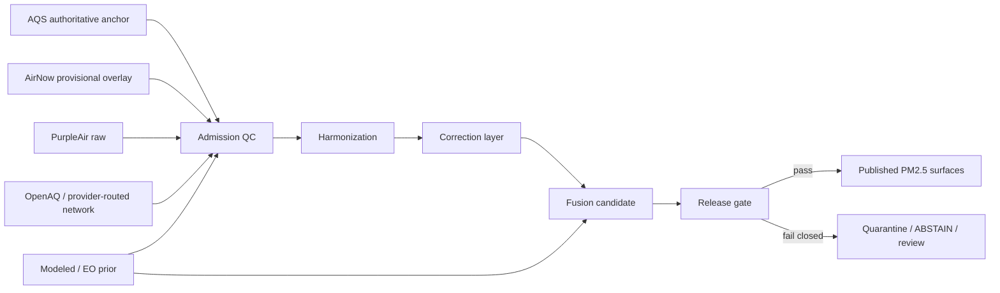

<!-- [KFM_META_BLOCK_V2]
doc_id: kfm://doc/NEEDS_VERIFICATION__pm25_sensor_fusion_qc
title: PM2.5 Sensor Fusion QC
type: standard
version: v1
status: draft
owners: @bartytime4life
created: NEEDS_VERIFICATION__YYYY-MM-DD
updated: NEEDS_VERIFICATION__YYYY-MM-DD
policy_label: NEEDS_VERIFICATION__public_or_internal
related: [./README.md, ../README.md, ../../domains/air/README.md, ../../domains/air/aqs-airnow-hydrologic-baselines.md, ../KFM_STAC_PROFILE.md, ../KFM_DCAT_PROFILE.md, ../KFM_PROV_PROFILE.md, ../../runbooks/README.md, ../../../contracts/README.md, ../../../schemas/README.md, ../../../policy/README.md, ../../../tests/README.md, ../../../pipelines/README.md]
tags: [kfm, air-quality, pm25, sensor-fusion, qc]
notes: [Built from attached KFM doctrine and visible public-main repo surfaces. Broader /docs/ owner coverage is publicly visible; leaf ownership, doc_id, dates, policy label, and any air-specific machine companions still need branch-level verification.]
[/KFM_META_BLOCK_V2] -->

<a id="top"></a>

# PM2.5 Sensor Fusion QC

Normative source-role, quality-control, and promotion rules for PM₂.₅ fusion products in Kansas Frontier Matrix.

> [!NOTE]
> **Status:** `draft`  
> **Owners:** `@bartytime4life` *(broader `/docs/` ownership is visible on public `main`; leaf-specific ownership should still be rechecked before merge)*  
> **Path:** `docs/standards/air-quality/pm25-sensor-fusion-qc.md`  
> **Repo fit:** child standard beneath `docs/standards/air-quality/` that complements `docs/domains/air/aqs-airnow-hydrologic-baselines.md` and routes machine-bearing follow-up work toward `contracts/`, `schemas/`, `policy/`, `tests/`, and `pipelines/`  
> **Quick jumps:** [Scope](#scope) · [Repo fit](#repo-fit) · [Authority posture](#authority-posture) · [Source-role ladder](#source-role-ladder) · [Canonical output families](#canonical-output-families) · [QC ladder](#qc-ladder) · [Promotion & runtime rules](#promotion--runtime-rules) · [Definition of done](#definition-of-done)


> [!IMPORTANT]
> This standard governs **quality control, source-role visibility, and release discipline** for PM₂.₅ fusion outputs.  
> It does **not** prove a checked-in public-main PM₂.₅ fusion pipeline, and it does **not** make any specific mathematical fusion engine the current implementation.

---

## Scope

This file defines what must remain visible and reviewable whenever KFM admits, corrects, fuses, promotes, or serves PM₂.₅ data.

It covers:

- EPA **AQS** as the authoritative regulatory anchor.
- **AirNow** as a provisional current-state and AQI-facing overlay.
- **PurpleAir** and similar low-cost PM₂.₅ inputs admitted only under explicit QC and correction rules.
- **OpenAQ** and similar aggregation surfaces only when provider identity, license posture, and source role survive normalization.
- Optional **gridded priors**, smoke layers, or atmospheric context only when they remain visibly distinct from observations.

It does **not** cover:

- attainment or compliance determinations,
- emergency-alert operations,
- a sovereign machine schema pack,
- undocumented connector claims,
- or any release path that hides evidence, basis, uncertainty, or provenance.

---

## Repo fit

| Surface | Role in this standard | Status |
|---|---|---|
| `docs/standards/air-quality/pm25-sensor-fusion-qc.md` | This child standard | **Target** |
| `docs/standards/air-quality/README.md` | Lane-local router that should point here | **NEEDS VERIFICATION** |
| `docs/domains/air/README.md` | Air-lane orientation and source-family framing | **CONFIRMED** |
| `docs/domains/air/aqs-airnow-hydrologic-baselines.md` | Closest adjacent doctrinal baseline for AQS/AirNow semantics | **CONFIRMED** |
| `../KFM_STAC_PROFILE.md`, `../KFM_DCAT_PROFILE.md`, `../KFM_PROV_PROFILE.md` | Outward catalog and lineage profiles | **CONFIRMED** |
| `../../../contracts/`, `../../../schemas/`, `../../../policy/`, `../../../tests/`, `../../../pipelines/` | Machine-bearing companion lanes | **CONFIRMED lane family** / **air-specific files NEEDS VERIFICATION** |

This standard should stay **normative and human-readable**.  
Machine contracts, executable policy, fixtures, validators, and pipeline entrypoints belong in their own lanes and should be linked here rather than silently redefined.

[Back to top](#top)

---

## Authority posture

### Reading rule

| Label | Meaning here |
|---|---|
| **CONFIRMED** | Grounded in adjacent repo docs or strongly convergent attached KFM doctrine |
| **INFERRED** | Strongly implied by attached materials but not surfaced as checked-in public-main implementation |
| **PROPOSED** | Design guidance that fits KFM doctrine but is not yet proven as mounted repo behavior |
| **NEEDS VERIFICATION** | Ownership, path, enforcement, or implementation depth not directly surfaced on current public `main` |

### What this standard controls

This standard controls the **semantic guardrails** around PM₂.₅ fusion:

- which sources may act as anchors,
- which surfaces stay provisional,
- what metadata must remain attached,
- what gets quarantined,
- and what blocks release.

### What this standard deliberately does not control

This standard does not lock the project into one fusion math stack.

Ensemble Kalman Filter, Bayesian blending, collocation-based correction, or simpler anchored smoothing may all be acceptable **only if** they emit the required evidence and preserve source-role visibility. Algorithm choice is therefore **PROPOSED realization space**, not the source of truth.

---

## Source-role ladder

The central rule is simple: **do not flatten unlike sources into one unlabeled PM₂.₅ truth surface**.

| Surface | Role | Basis label | Status | Required visibility |
|---|---|---|---|---|
| **EPA AQS** | Regulatory-grade anchor for archival and high-trust baseline work | `authoritative` | **CONFIRMED** | monitor identity, parameter, POC, method/monitor metadata, QA/QC posture |
| **AirNow** | Current-state public-health and AQI overlay | `provisional` | **CONFIRMED** | update time, provisional status, AQI/NowCast semantics, non-regulatory posture |
| **PurpleAir raw** | Dense low-cost sensor input | `provisional` | **CONFIRMED** | variant, device/site context, QC flags, raw-vs-corrected separation |
| **PurpleAir corrected** | Explicitly transformed low-cost derivative | `derived` | **PROPOSED** | correction reference, method version, uncertainty, raw sibling retained |
| **OpenAQ** | Aggregation, routing, and discovery layer | `provisional` until underlying provider is validated | **INFERRED / PROPOSED** | upstream provider, license, sensor/network type, no silent regulatory upgrade |
| **Modeled or EO priors** | Auxiliary support only | `derived` | **PROPOSED** | model/product name, valid time, support/resolution, never presented as raw observation |

> [!CAUTION]
> **OpenAQ is not automatically regulatory-grade.**  
> Treat it as an admitted routing or discovery layer unless the underlying provider has been explicitly resolved and promoted under KFM rules.

---

## Non-negotiable fusion rules

1. **AQS is the anchor, not just another feed.**  
   If an output claims authoritative PM₂.₅ meaning, its anchor path must remain inspectable.

2. **Never merge across methods without tagging.**  
   Method, monitor, and POC differences are part of the data’s meaning, not disposable implementation details.

3. **Low-cost raw and low-cost corrected must remain distinct siblings.**  
   A correction is a transformation with provenance, not a replacement for the raw record.

4. **OpenAQ must carry provider and license forward.**  
   Aggregation convenience is not permission to erase provenance.

5. **AirNow must remain visibly provisional.**  
   Current-state usefulness does not make it equivalent to AQS.

6. **Modeled priors and smoke context may assist interpretation, but they may not silently overwrite observations.**

7. **Every material PM₂.₅ release candidate must be reviewable.**  
   At minimum that means stable identity, QC summary, source-role labels, and receipt/proof references.

---

## Canonical identity and metadata

### Identity primitives

Use stable identity before you smooth, blend, or publish.

```text
aqs_monitor_key      = <state_code>-<county_code>-<site_number>-<parameter_code>-<poc>
method_aware_series  = (<site>, <parameter>, <monitor>, <method>, <poc>)
```

For low-cost devices, a stable physical-device identifier is desirable, but current public-main proof of an air-specific fleet registry remains **NEEDS VERIFICATION**. Until that lane is surfaced, keep vendor device identity, variant, and site context visible rather than hiding them behind an unverified canonical key.

### Minimum metadata field set

| Field | Why it exists | Status |
|---|---|---|
| `basis` (`authoritative \| provisional \| derived`) | Prevents silent truth flattening | **CONFIRMED** |
| `source_system` | Keeps source role explicit at point of use | **CONFIRMED** |
| `source_uri` | Supports traceability and replay | **CONFIRMED** |
| `parameter_code` | Keeps pollutant identity explicit | **CONFIRMED** |
| `poc` | Part of AQS monitor identity | **CONFIRMED** |
| `method` / `monitor` metadata | Prevents invalid cross-method merges | **CONFIRMED** |
| `spec_hash` | Stable candidate or release identity | **CONFIRMED cross-lane** |
| `payload_sha256` | Input integrity and replay support | **CONFIRMED cross-lane** |
| `returned_row_count` | Fetch sanity and evidence review | **CONFIRMED** |
| `lineage_status` (`raw \| corrected \| fused \| superseded`) | Distinguishes transformation stage | **INFERRED** |
| `pm25_variant` | Required for PurpleAir-style source clarity | **PROPOSED** |
| `calibration_reference` | Makes correction provenance inspectable | **PROPOSED** |
| `method_version` | Pins transform logic | **PROPOSED** |
| `uncertainty` / interval fields | Prevents false precision | **PROPOSED** |
| `obs_used` | Makes fusion composition legible | **PROPOSED** |
| `provider` + `license` | Required for aggregator-fed surfaces | **PROPOSED but strongly recommended** |
| `site_context` | Helps interpret low-cost station realism | **PROPOSED** |
| `freshness_basis` | Distinguishes observation time from fetch/promotion time | **INFERRED** |

> [!TIP]
> Keep these times separate whenever they differ:
> `observed_at`, `fetched_at`, `normalized_at`, and `promoted_at`.

[Back to top](#top)

---

## Canonical output families

A practical PM₂.₅ standard needs more than one surface.  
The family names below are **PROPOSED canonical names**, but the distinction they encode is doctrinally important.

| Output family | Role | Status here | Must carry |
|---|---|---|---|
| `pm25_source` | AQS-based source-grade series, hourly/daily as available | **PROPOSED name / CONFIRMED role** | authoritative basis, monitor key, method metadata, QA/QC posture |
| `pm25_network` | Provider-tagged network view sourced through OpenAQ or similar aggregation | **PROPOSED** | provider, license, upstream network identity, provisional basis |
| `pm25_lowcost_raw` | Raw low-cost PM₂.₅ series | **PROPOSED** | device identity, variant, QC flags, raw basis |
| `pm25_lowcost_corrected` | Corrected low-cost derivative with explicit calibration provenance | **PROPOSED** | correction reference, method version, uncertainty, raw linkage |
| `pm25_fused_best` | Best available fused analytic surface | **PROPOSED** | anchor disclosure, obs_used, uncertainty, derived basis |

If a future implementation uses different names, it must still preserve this separation of roles.

---

## QC ladder

### At-a-glance workflow



### Stage-by-stage expectations

| Stage | Minimum expected pass | Fail-closed trigger |
|---|---|---|
| **Admission** | Source role, units, timestamps, and identity are explicit | Unknown source role; missing provider/license on aggregator-fed data; impossible value range; missing key identity fields |
| **Harmonization** | UTC timestamp retained alongside source time basis; duplicate handling is explicit; method/POC/variant not erased | Silent cross-method merge; silent variant collapse; ambiguous timezone handling |
| **Correction** | Raw and corrected surfaces both exist; correction reference and uncertainty are emitted | Corrected value with no transformation provenance; raw source discarded |
| **Fusion** | Anchor path is inspectable; `obs_used` and uncertainty remain attached; modeled support stays visibly auxiliary | Fused output presented as authoritative without anchor; modeled-only result masquerades as observation |
| **Release** | `spec_hash`, `run_receipt`, QC summary, and outward lineage refs are present | Missing receipt/proof references; suppressed basis label; incomplete evidence package |

### Starter numeric gates

These are **PROPOSED defaults**, not current public-main enforcement. Keep them configurable.

| Gate | Starter default | Status |
|---|---|---|
| Candidate PM₂.₅ numeric range | `0–500 µg/m³` | **PROPOSED** |
| PurpleAir near-real-time freshness target | `< 10 min` | **PROPOSED** |
| AirNow current-state freshness target | `< 30 min` | **PROPOSED** |
| NowCast consistency vs collocated AQS-derived NowCast | median absolute % difference `≤ 20%` | **PROPOSED** |
| Predictive-interval coverage drift | keep empirical 80/90/95% coverage within `5–10 percentage points` of nominal | **PROPOSED** |
| Divergence fallback | publish QC-only output or ABSTAIN instead of a misleading fused surface | **PROPOSED** |

> [!WARNING]
> A numeric gate is not self-justifying truth.  
> It is only admissible when its method, support window, and review consequences remain visible.

---

## Promotion & runtime rules

### Minimum proof center

Every material PM₂.₅ release candidate should carry the same minimum proof center used elsewhere in KFM:

- `spec_hash`
- `run_receipt`
- attestation or proof references
- outward lineage/citation fields suitable for STAC/DCAT/PROV-bearing release surfaces

### Release posture

A PM₂.₅ candidate should not promote when any of the following are missing:

- basis label,
- source-role disclosure,
- monitor or device identity,
- correction provenance for corrected low-cost surfaces,
- uncertainty for fused outputs,
- provider/license carry-through for aggregator-fed records,
- or QC summary sufficient for review.

### Runtime outcome grammar

| Outcome | When it is appropriate |
|---|---|
| `ANSWER` | Evidence is complete and the basis of the answer is explicit |
| `ABSTAIN` | Evidence is incomplete, basis is too weak, or the product is too provisional for the claim being asked |
| `DENY` | Policy, rights, or sensitivity rules block the response or release |
| `ERROR` | The system failed to produce a trustworthy result |

For PM₂.₅, **ABSTAIN is preferable to unlabeled smoothing**.

---

## Companion lanes and follow-up work

| Lane | What belongs there | Status |
|---|---|---|
| `contracts/` | PM₂.₅ release contracts, receipt objects, response envelopes | **CONFIRMED lane / exact air files NEEDS VERIFICATION** |
| `schemas/` | JSON Schema for observations, corrections, fusion outputs, fleet metadata | **CONFIRMED lane / exact air files NEEDS VERIFICATION** |
| `policy/` | Executable deny-by-default QC and promotion gates | **CONFIRMED lane / exact air files NEEDS VERIFICATION** |
| `tests/` | Valid/invalid fixtures, regression samples, NowCast consistency tests | **CONFIRMED lane / exact air files NEEDS VERIFICATION** |
| `pipelines/` | Watcher, normalization, correction, and promotion choreography | **Visible pattern confirmed** / **air-specific path NEEDS VERIFICATION** |

This file should link outward to those surfaces as they become real.  
It should not pretend they already exist when they have not been surfaced.

---

## Definition of done

A first merge of this standard is good enough when the following are true:

- [ ] `doc_id`, `created`, `updated`, and `policy_label` are replaced with verified values.
- [ ] Leaf-specific owner coverage is rechecked.
- [ ] `docs/standards/air-quality/README.md` routes here cleanly.
- [ ] If `docs/standards/README.md` is meant to route to air-quality standards, it is updated accordingly.
- [ ] This file’s claims stay aligned with `docs/domains/air/aqs-airnow-hydrologic-baselines.md`.
- [ ] No air-specific pipeline, schema, or test path is named as implemented unless directly verified.
- [ ] The first machine lane, when it lands, includes at least one valid and one invalid fixture for PM₂.₅ source-role separation.

[Back to top](#top)

---

## FAQ

### Why not collapse everything into one PM₂.₅ number?

Because AQS, AirNow, PurpleAir, OpenAQ, and modeled priors answer different questions and carry different burdens. A single unlabeled number would hide those differences.

### Why is OpenAQ not the anchor?

Because it is an aggregation surface with mixed provenance. It is useful, but convenience does not erase source burden.

### Why keep raw and corrected PurpleAir both?

Because correction is an explicit transformation with method and uncertainty, not a synonym for the original observation.

### Why does this standard not require EnKF, Bayesian fusion, or one fixed model?

Because KFM needs a **trustworthy QC contract first**. The algorithm can evolve; the evidence posture should not.

---

## Appendix — minimal review prompts

Use these prompts in PR review, fixture review, or drawer review:

1. Can I tell, at a glance, whether this PM₂.₅ value is authoritative, provisional, or derived?
2. Can I see which source classes were used?
3. If a low-cost value was corrected, can I inspect the correction reference and uncertainty?
4. If a value was fused, can I inspect the anchor path and `obs_used`?
5. If the product is too weak for the claim, does the surface abstain rather than bluff?

If any answer is “no,” this standard has not yet been satisfied.
