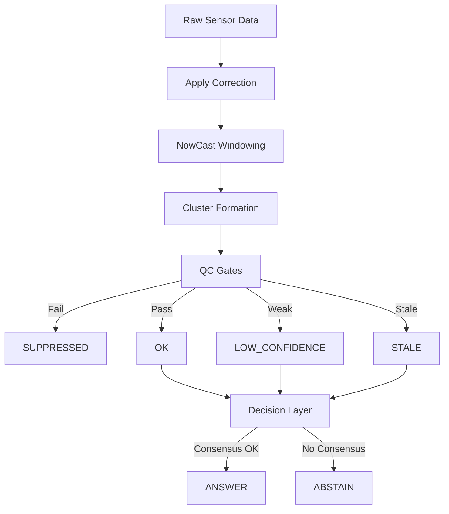

<!-- [KFM_META_BLOCK_V2]
doc_id: kfm://doc/pm25-sensor-fusion-qc
title: PM2.5 Sensor Fusion & Conservative QC Standard
type: standard
version: v1
status: draft
owners: @bartytime4life
created: 2026-04-17
updated: 2026-04-17
policy_label: public
related: [
  ../../policy/README.md,
  ../../contracts/README.md,
  ../../schemas/README.md,
  ../../data/receipts/README.md,
  ../../data/catalog/stac/README.md,
  ../../data/catalog/dcat/README.md,
  ../../data/catalog/prov/README.md,
  ../../tools/validators/README.md
]
tags: [kfm, air-quality, pm25, fusion, qc, sensors]
notes: [
  Defines minimal fusion schema and fail-closed QC logic for low-cost PM2.5 sensors aligned with KFM doctrine.
]
[/KFM_META_BLOCK_V2] -->

# PM2.5 Sensor Fusion & Conservative QC Standard

> **Minimal schema and conservative fail-closed QC for fusing low-cost PM2.5 observations with regulatory benchmarks under KFM governance.**

**Quick nav:** [Status](#status--posture) · [Scope](#scope) · [Key terms](#key-terms) · [Source-role guardrails](#source-role-guardrails) · [Minimal fusion record](#minimal-fusion-record) · [QC gates](#qc-gate-order-fail-closed) · [Downstream contract](#downstream-contract-critical) · [Validator contract](#validator-contract-proposed) · [Implementation boundary](#implementation-boundary) · [Task checklist](#task-checklist) · [Appendix](#appendix)

---

## Status & posture

| Field | Value |
| --- | --- |
| Status | Draft |
| Posture | Fail-closed · Evidence-first |
| Authority | Supporting standard (`policy/` and `schemas/` remain sovereign) |
| Owner | `@bartytime4life` |

> [!IMPORTANT]
> This document is a **supporting standard**, not the authoritative copy of policy logic, schema authority, or mounted implementation proof.

---

## Scope

This standard defines:

- a minimal **fusion record schema**
- deterministic **QC gate ordering**
- alignment requirements for **hourly NowCast windows**
- cluster-based **consensus validation**
- a safe-by-default downstream contract for **vegetation / NDVI-triggered use**
- the minimum receipt and review surfaces needed to keep fused PM2.5 outputs inspectable

This standard does **not** define:

- correction equation internals or calibration research
- policy decisions or release permissions
- the mounted implementation status of validators, fixtures, workflows, or CI gates
- a complete cross-lane proof-object schema family

---

## Why this exists

Low-cost optical PM sensors can drift, overestimate under high humidity, miss samples, and produce local spikes that are not reflected in regulatory networks.

KFM requires evidence-backed outcomes, deterministic failure modes, and auditable support objects. This standard exists to keep a tempting-but-fragile signal from being mistaken for trustworthy public truth.

> Sensor-derived PM2.5 should never outrun its evidentiary support.

---

## Key terms

| Term | Meaning in this standard |
| --- | --- |
| `pm25_raw` | Uncorrected PM2.5 value retained for audit and reconstruction |
| `pm25_nowcast` | Corrected and window-aligned PM2.5 value used for conservative downstream evaluation |
| `qc_flag` | Safety classification controlling how the fused result may be used |
| NowCast window | Hourly-aligned calculation window; `local_time` is the window start |
| Consensus | Agreement across nearby independent sensors or a colocated regulatory anchor |
| Regulatory benchmark | AQS / FRM / FEM-backed comparison surface used as anchor or sanity reference |
| EvidenceBundle | KFM outward support object linking a claim or runtime result to supporting evidence refs |

---

## Source-role guardrails

**CONFIRMED doctrine direction:** KFM requires sharper source-role labeling for air-quality and climate context. This standard therefore avoids flattening regulatory, aggregated, and low-cost sources into one undifferentiated signal.

| Source family | Role in this standard | Handling rule |
| --- | --- | --- |
| AQS / FRM / FEM | Regulatory benchmark / colocation anchor | May act as benchmark reference or colocated sanity anchor |
| OpenAQ-backed measurements | Aggregation / discovery layer | Must **not** be treated as automatically regulatory-grade; keep provider/source provenance explicit |
| Low-cost optical sensor networks | Dense but weaker observational layer | Must pass correction, alignment, and conservative QC before decision-bearing use |
| Fused output | Derived support surface | Remains downstream of evidence, QC, and source-role labeling |

> [!WARNING]
> OpenAQ measurements are **not automatically regulatory-grade**. If an OpenAQ record is used in fusion or benchmarking, the underlying provider and source role must remain explicit.

---

## Minimal fusion record

One record per `(sensor_id, local_time)`:

```json
{
  "sensor_id": "string",
  "network": "string",
  "lat": 0.0,
  "lon": 0.0,
  "local_time": "YYYY-MM-DDTHH:00:00",
  "pm25_nowcast": 0.0,
  "pm25_raw": 0.0,
  "zscore_vs_aqs": 0.0,
  "qc_flag": "OK|LOW_CONFIDENCE|SUPPRESSED|STALE",
  "source_uri": "string"
}
```

### Field notes

| Field | Description | Why it matters |
| --- | --- | --- |
| `sensor_id` | Stable source identifier | Keeps record identity deterministic |
| `network` | Source network label | Preserves source-role context |
| `lat`, `lon` | Sensor coordinates | Required for neighbor clustering |
| `local_time` | Hourly window start | Prevents mixed-window ambiguity |
| `pm25_nowcast` | Corrected and smoothed value | Main evaluated signal |
| `pm25_raw` | Uncorrected value | Audit reconstruction and correction review |
| `zscore_vs_aqs` | Standardized residual vs regulatory benchmark | Benchmark sanity check |
| `qc_flag` | Decision-bearing safety contract | Governs downstream use |
| `source_uri` | Source or receipt pointer | Supports evidence drill-through |

---

## Pre-fusion requirements

### 1. Correction (mandatory)

- apply a **peer-reviewed OPC correction**
- keep the correction:
  - versioned
  - reproducible
  - linked to evidence / receipt surfaces

Ad-hoc or per-sensor tuning is not allowed.

### 2. Time alignment

- all inputs must align to **hourly NowCast windows**
- `local_time` = window start

Reject or downgrade records when there are:

- partial windows
- mixed cadence inputs
- ambiguous local-time window boundaries

### 3. Benchmark anchor and source tagging

The benchmark anchor should remain explicit.

- Regulatory anchor use should stay tied to **AQS / FRM / FEM** or an equivalently verified benchmark surface.
- If an aggregated layer is used for discovery or routing, that source role must remain visible.
- Low-cost variant choice and correction choice should remain explicit whenever raw and corrected values coexist.

---

## QC gate order (fail-closed)

The **first triggered condition** determines the outcome.

### 1. Hard suppression

Set `qc_flag = SUPPRESSED` if **any** of the following occur:

- RH > 80%
- reporting cadence > 30 minutes
- >20% missing samples over a rolling 24-hour window
- >50% jump not seen in neighbors within the 1–5 km cluster

### 2. Consensus requirement

Require either:

- **≥2 independent sensors** within 1–5 km agreeing, **or**
- **1 colocated AQS / FRM / FEM** anchor

If the requirement fails:

- set `qc_flag = LOW_CONFIDENCE`

### 3. Benchmark sanity

Compute `zscore_vs_aqs`.

If:

- `|z| > 3` for **≥2 windows** → `LOW_CONFIDENCE`
- sustained for **>6 hours** → escalate to `SUPPRESSED`

### 4. Freshness

If no update arrives for **≥2 windows**:

- set `qc_flag = STALE`

### 5. Pass

If all checks pass:

- set `qc_flag = OK`

---

## QC flag semantics

| Flag | Meaning | Allowed use |
| --- | --- | --- |
| `OK` | Fully trusted within this standard’s limits | Decision-bearing downstream use |
| `LOW_CONFIDENCE` | Weakly supported signal | Context only |
| `SUPPRESSED` | Invalid for downstream use | Excluded |
| `STALE` | Outdated signal | Display or cautionary context only |

---

## Cluster logic

### Neighbor definition

- radius: **1–5 km**
- dual-channel duplicates must be excluded from “independent sensor” counts

### Agreement rule

Sensors agree if either:

- absolute difference ≤ **5 µg/m³**, **or**
- relative difference ≤ **20%**

---

## Downstream contract (critical)

Vegetation / NDVI gates **must only** trigger when:

- cluster consensus = `TRUE`
- **≥1 sensor** has `qc_flag = OK`

### Fail conditions

If all nearby candidate sensors are:

- `LOW_CONFIDENCE`
- `SUPPRESSED`
- `STALE`

then the system must:

- return `ABSTAIN`, **or**
- fall back to stronger regulatory evidence where available

> [!CAUTION]
> No silent fallback, implicit confidence upgrade, or “best guess” interpolation should turn weak PM2.5 evidence into an apparently trusted vegetation trigger.

---

## Runtime outcome alignment

This standard keeps public/runtime semantics separate from validator-local pass/fail semantics.

### Runtime / public-facing outcome grammar

| Outcome | Condition |
| --- | --- |
| `ANSWER` | Valid fused evidence is available and admissible |
| `ABSTAIN` | Confidence is insufficient for a trustworthy answer |
| `DENY` | Policy restriction blocks release or use |
| `ERROR` | System or processing failure |

### Typical runtime flow



---

## Evidence, receipts, and review surfaces

Each fusion run should produce at minimum:

- input references for sensor and benchmark data
- correction version identifier
- QC decisions per record
- suppression reasons where applicable

Intended storage and linkage surfaces:

- `data/receipts/`
- linked outward via `EvidenceBundle`

### KFM alignment note

Where broader KFM proof surfaces exist, this standard should remain compatible with:

- receipt-bearing run objects
- evidence bundle resolution
- inspectable runtime envelopes
- correction or supersession traces

This document does **not** claim that those mounted objects already exist in the active workspace.

---

## Validator contract (proposed)

Validator responsibilities under `tools/validators` should include:

- enforcing QC gate ordering
- checking window alignment
- checking missingness thresholds
- checking cluster agreement
- checking source-role and benchmark-anchor constraints where required by the consuming workflow

Illustrative validator output:

```json
{
  "status": "PASS|FAIL",
  "qc_flag": "OK|LOW_CONFIDENCE|SUPPRESSED|STALE",
  "reasons": ["string"],
  "evidence_refs": ["receipt_id"]
}
```

> [!NOTE]
> This `PASS|FAIL` field is **validator-local**. Public/runtime surfaces should continue to use `ANSWER|ABSTAIN|DENY|ERROR`.

---

## Operational rules

- no implicit sensor discovery
- no silent fallback
- no source-role flattening
- no “best guess” interpolation without flag downgrade
- no correction without explicit version reference
- no decision-bearing NDVI trigger from weak-only PM2.5 evidence

---

## Implementation boundary

| Topic | Status | Notes |
| --- | --- | --- |
| QC thresholds, flags, downstream contract, runtime outcomes in this document | **CONFIRMED in the uploaded draft** | Preserved and tightened for clarity |
| Integration touchpoints such as `schemas/`, `tools/validators/`, `tests/`, `data/receipts/` | **PROPOSED / intended** | Named as repo-facing authority surfaces or integration points, not as mounted proof |
| Exact schema files, validator commands, fixtures, CI wiring, release proofs | **UNKNOWN in current-session evidence** | The session exposed attached documents, not a mounted repo tree or runtime traces |

---

## Task checklist

- [ ] Define the canonical JSON schema in `schemas/`
- [ ] Implement validator logic in `tools/validators/`
- [ ] Add positive and negative test fixtures in `tests/`
- [ ] Wire receipt output and evidence linkage
- [ ] Integrate the downstream NDVI / vegetation gate safely
- [ ] Attach the correction equation reference and version
- [ ] Make benchmark source role explicit where aggregated discovery layers are present

---

## FAQ

### Why fail-closed?

Because low-cost sensors can produce convincing but incorrect spikes.

### Why require consensus?

Single sensors are not reliable enough for decision triggers.

### Why keep raw values?

For auditability, correction review, and reconstruction.

### Why separate runtime outcomes from validator status?

Because public-facing answers and internal validation checks are different surfaces with different semantics.

---

## Appendix

<details>
<summary>Open questions, working definitions, and future extensions</summary>

### Recommended cluster radius

- urban: **1–2 km**
- rural: **up to 5 km**

### Missingness definition

- fraction of expected samples absent over a rolling 24-hour window

### Open questions

- What minimum benchmark metadata should be required beyond `network` and `source_uri`?
- Should the minimal record distinguish provider, method, and variant explicitly rather than leaving them implicit in `network`?
- What exact correction-reference object should link from this standard into the broader proof-object family?
- What exact mounted schema path and validator command path exist on the active branch?

### Future extensions (proposed)

- sensor drift tracking
- adaptive RH correction
- machine-assisted anomaly detection that remains advisory-only
- stricter benchmark source tagging for mixed-provenance station networks

</details>
