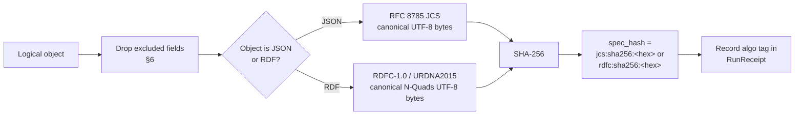

<!-- [KFM_META_BLOCK_V2]
doc_id: kfm://doc/standards/canonicalization
title: KFM Canonicalization Standard — spec_hash, JCS, and the RDF Canonicalization Path
type: standard
version: v1-draft
status: draft
owners: TBD-kfm-evidence-stewards
created: 2026-05-14
updated: 2026-05-14
policy_label: public
related:
  - docs/doctrine/directory-rules.md
  - docs/standards/run-receipt.md
  - schemas/evidence/spec_normalization.md
  - tools/spec_hash/
  - contracts/evidence/evidence_bundle.md
tags: [kfm, standards, identity, hashing, evidence, canonicalization]
notes:
  - All repo-shaped paths are PROPOSED pending repository inspection.
  - Doctrine basis: SRC-P10 C1-02, C5-04, C8-04, C8-05; SRC-NI-2026-05-08 D1–D5.
[/KFM_META_BLOCK_V2] -->

# Canonicalization Standard

> **Purpose.** Define how KFM normalizes JSON (and, when needed, RDF) so that `spec_hash` is reproducible byte-for-byte across runs, environments, and language implementations.


| Field | Value |
|---|---|
| **Status** | `draft` — `PROPOSED` against the live repo |
| **Owners** | `TBD-kfm-evidence-stewards` *(placeholder; assign before publication)* |
| **Last reviewed** | 2026-05-14 |
| **Authority** | Standard doc · explains; does **not** decide alone (see Directory Rules §13 anti-pattern) |
| **Conformance** | RFC 2119-style MUST / SHOULD / MAY |

---

## Contents

- [1. Scope](#1-scope)
- [2. Decision summary](#2-decision-summary)
- [3. The canonical algorithm](#3-the-canonical-algorithm)
- [4. `spec_hash` format and use](#4-spec_hash-format-and-use)
- [5. JCS vs RDF Canonicalization — when to use which](#5-jcs-vs-rdf-canonicalization--when-to-use-which)
- [6. Inclusion / exclusion rules for `spec_hash`](#6-inclusion--exclusion-rules-for-spec_hash)
- [7. Failure modes and required behavior](#7-failure-modes-and-required-behavior)
- [8. CI gates and required tests](#8-ci-gates-and-required-tests)
- [9. Implementation guidance](#9-implementation-guidance)
- [10. Migration and algorithm stability](#10-migration-and-algorithm-stability)
- [11. External standard references](#11-external-standard-references)
- [12. Open questions](#12-open-questions)
- [13. Related docs](#13-related-docs)
- [Appendix A — Worked example](#appendix-a--worked-example)
- [Appendix B — Glossary](#appendix-b--glossary)

---

## 1. Scope

This standard governs canonicalization for any KFM artifact whose **identity** is a `spec_hash`. That includes — at minimum — `EvidenceBundle`, `EvidenceRef`, `SourceDescriptor`, `RunReceipt`, `PromotionDecision`, `ReleaseManifest`, and `RollbackCard` instances, plus checked-in contracts, schemas, and model specs that participate in promotion gates.

It does **not** govern:

- Object-family meaning *(see `contracts/`)*.
- Field-level shape *(see `schemas/`)*.
- Admissibility, sensitivity, or release decisions *(see `policy/` and `release/`)*.
- Code style, file naming, or human-readable formatting.

> [!NOTE]
> Canonicalization is **about bytes, not semantics.** Two documents that "mean the same thing" do not necessarily share a `spec_hash`. The contract of this document is that *the same logical object, serialized through the canonical pipeline, always produces the same bytes — and therefore the same hash.*

[Back to top ↑](#contents)

---

## 2. Decision summary

| Decision | Value | Source |
|---|---|---|
| **Default JSON canonicalization** | RFC 8785 JSON Canonicalization Scheme (JCS) | C1-02, C8-05 *(CONFIRMED in doctrine)* |
| **Default hash function** | SHA-256 over canonical UTF-8 bytes | C1-02 *(CONFIRMED in doctrine)* |
| **`spec_hash` wire format** | `jcs:sha256:<lowercase-hex>` | C1-02 *(CONFIRMED in doctrine)* |
| **RDF canonicalization** | RDFC-1.0 / URDNA2015, SHA-256 over canonical N-Quads | C8-05 *(CONFIRMED in doctrine; see §11 on RDFC-1.0)* |
| **When to switch to RDF canonicalization** | Only when RDF-semantic equivalence is the required invariant *(e.g., federated SPARQL merging KFM and non-KFM RDF)* | C8-05 *(CONFIRMED in doctrine)* |
| **Hash-algo stability for v1** | SHA-256 is fixed; migration requires an ADR and dual-hash window | SRC-NI D5 *(PROPOSED; needs ADR)* |
| **Default ID format** | Lowercase hex; no truncation in `spec_hash`; base32 truncation only for derived short IDs *(see §9.3)* | SRC-NI D2 *(PROPOSED)* |

> [!IMPORTANT]
> **JCS is the universal KFM default.** RDF canonicalization is opt-in. Do **not** mix the two for the same artifact: a consumer using RDF canonicalization to verify a JCS-hashed bundle will silently fail. The choice MUST be recorded in the receipt's `algo` tag.

[Back to top ↑](#contents)

---

## 3. The canonical algorithm



The pipeline is deterministic and ordering-strict:

1. **Project** the object onto its meaning-bearing fields *(§6 inclusion rules)*.
2. **Canonicalize** the bytes via JCS (default) or RDFC-1.0 (opt-in).
3. **Hash** the canonical bytes with SHA-256.
4. **Tag** the result with the algorithm used; emit it as `spec_hash` and record it in the `RunReceipt`.

> [!WARNING]
> Hashing the developer-formatted JSON is **not** acceptable. Whitespace, key order, number formatting, and Unicode escaping all vary by tool. JCS exists to remove that variance; skipping it breaks reproducibility and silently invalidates promotion gates.

[Back to top ↑](#contents)

---

## 4. `spec_hash` format and use

### 4.1 Wire format

```text
spec_hash := "<algo>:sha256:<64-lowercase-hex-chars>"
algo      := "jcs" | "rdfc"
```

- `jcs:sha256:…` — RFC 8785 JCS canonical bytes, SHA-256, lowercase hex. **Default.**
- `rdfc:sha256:…` — RDF Dataset Canonicalization (RDFC-1.0; algorithm previously known as URDNA2015) canonical N-Quads, SHA-256, lowercase hex. Used only when the artifact is governed as RDF; see §5 and §11.

> [!NOTE]
> Older corpus material may show bare hex (`abc123…`) or `sha256:…` without an algo prefix. New artifacts MUST use the prefixed form so that verifiers can detect algorithm drift instead of silently accepting a hash from the wrong algorithm.

### 4.2 Where `spec_hash` appears

`spec_hash` is recorded inside:

- `RunReceipt` — every promotion run.
- `EvidenceBundle` — as `kfm:spec_hash`; also derived into the content-addressed path *(per C4-04)*.
- `EvidenceRef` — as the pointer that resolves to a bundle.
- `PromotionDecision`, `ReleaseManifest`, `RollbackCard` — to identify the exact object being acted on.
- Catalog index — `spec_hash` is the **primary** key; mutable paths are never the primary key.

### 4.3 What `spec_hash` is for

- **Reproducibility.** CI can recompute the hash from the checked-in spec and compare to the receipt *(C5-04 spec-hash-match gate)*.
- **Drift detection.** Hash mismatch between ref and bundle is a hard signal.
- **Idempotency.** Promotion gates can short-circuit when `spec_hash` is unchanged *(C3-04)*.
- **Tombstoning.** Revocations identify exactly which spec was retracted.
- **Cross-store portability.** Object identity does not depend on storage backend, path, or timestamp.

[Back to top ↑](#contents)

---

## 5. JCS vs RDF Canonicalization — when to use which

| Dimension | JCS *(RFC 8785)* | RDFC-1.0 / URDNA2015 *(W3C)* |
|---|---|---|
| **Operates on** | JSON values *(strings, numbers, arrays, objects)* | RDF datasets *(triples / quads with blank nodes)* |
| **Output** | Canonical UTF-8 JSON bytes | Canonical N-Quads bytes |
| **KFM role** | **Default** for every `spec_hash` | Opt-in for RDF-semantic equivalence cases |
| **Cost** | Cheap; linear in document size | Potentially expensive; blank-node labeling is bounded by graph-isomorphism difficulty |
| **Library maturity** | Wide *(Python, TS, Go, Rust, Java)* | Narrower; varies in edge-case handling |
| **Failure mode if wrong choice** | N/A — universal default | Silent verification failure when paired with a JCS-hashed bundle |
| **Algo tag** | `jcs` | `rdfc` |

> [!CAUTION]
> The two algorithms can produce **different hashes for the same logical content** because JSON-LD round-tripping is not an identity transformation. This is the central reason the algo tag is mandatory: a consumer must know which canonical form produced the hash before attempting to verify it.

**Use JCS when:**

- The artifact is JSON or JSON-LD that is consumed and verified as JSON.
- The downstream contract is "bytes match if and only if logical content matches."
- The artifact participates in standard KFM promotion gates *(this is almost always the case)*.

**Use RDFC-1.0 / URDNA2015 when, and only when:**

- The artifact is genuinely consumed as an RDF dataset *(e.g., federated SPARQL)*.
- A non-KFM consumer requires RDF-semantic equivalence to KFM bundles.
- An explicit ADR records the opt-in, the affected object family, and the verifier path.

Until such an ADR exists, **JCS is the only canonical form** for KFM-produced `spec_hash` values.

[Back to top ↑](#contents)

---

## 6. Inclusion / exclusion rules for `spec_hash`

`spec_hash` is computed over a **normalized spec**: the projection of the object onto its meaning-bearing fields. Transport, runtime, and transient fields are excluded.

### 6.1 Included (meaning-bearing)

Fields that affect what the object **claims** MUST be included. Per SRC-NI-2026-05-08 D1, the inclusion set covers at minimum:

- `object_type`
- `schema_version`
- `source_refs`
- `dataset_refs`
- `evidence_refs`
- `object_refs`
- `policy_label`
- `rights_status`
- `sensitivity`
- Any other field that changes the evidentiary or admissibility meaning of the object.

> The exact, per-schema inclusion set is declared by each schema's `spec_normalization_set = v1` hook *(see §9.4)* and is **PROPOSED** to live in `schemas/evidence/spec_normalization.md` — path **NEEDS VERIFICATION** against the live repo.

### 6.2 Excluded (transport / runtime / transient)

Fields that vary across runs but do not change the claim MUST be excluded. Examples:

- Wall-clock timestamps *(fetch time, build time, sign time)*.
- Storage URLs, S3 paths, OCI tags, IPFS gateways.
- Signatures, attestation envelopes, transparency-log entries.
- Nonces, run IDs, orchestrator-assigned identifiers.
- HTTP validators *(ETag, Last-Modified)* — these belong in the receipt, not in `spec_hash`.
- Pretty-printing artifacts *(whitespace, key order, number formatting)* — JCS removes these by construction.

### 6.3 Why this matters

| Failure | Cause | Outcome |
|---|---|---|
| Hash rotates on every run | A timestamp or run ID leaked into the included set | Spec-hash-match gate fires; no promotion is idempotent |
| Hash fails to rotate on real change | A meaning-bearing field was excluded | DENY with `NormalizationError.field_exclusion_violation` *(§7)* |
| Same logical bundle, two hashes | One pipeline included transport fields, another didn't | Drift entry; correction notice; potential rollback |

[Back to top ↑](#contents)

---

## 7. Failure modes and required behavior

Canonicalization sits on the trust spine. Failures MUST be visible and fail-closed.

| # | Failure | Validator outcome | Policy outcome | Error code |
|---|---|---|---|---|
| F1 | Missing bundle for an `EvidenceRef` | `ABSTAIN` | `DENY` *(publication)* | `ResolutionError.missing_bundle` |
| F2 | `EvidenceRef.spec_hash` ≠ `EvidenceBundle.spec_hash` | `ABSTAIN` | `DENY` | `ResolutionError.hash_mismatch` |
| F3 | Non-deterministic serialization *(same logical spec, different bytes)* | `ERROR` | `DENY` | `NormalizationError.nondeterministic_serialization` |
| F4 | Meaning-bearing field excluded from hash | n/a | `DENY` | `NormalizationError.field_exclusion_violation` |
| F5 | Unexpected algo tag *(neither `jcs` nor `rdfc`)* | `ERROR` | `DENY` | `HashAlgoUnsupported` |
| F6 | Algo tag present but body not canonical *(e.g., `jcs:sha256:…` over uncanonicalized bytes)* | `ERROR` | `DENY` | `NormalizationError.algo_tag_mismatch` |

> [!WARNING]
> A `DENY` outcome is non-overridable in the normal public path. Admin shortcuts that bypass canonicalization checks MUST be justified by an ADR, constrained, audited, and kept off the public route *(Directory Rules §11 / §16)*.

[Back to top ↑](#contents)

---

## 8. CI gates and required tests

The following test contract is **PROPOSED** as the v1 enforcement set, derived from SRC-NI-2026-05-08 §5. Tests MUST be deterministic and MUST run without network access.

| ID | Test | Asserts |
|---|---|---|
| T1 | Round-trip determinism across `{Python, TypeScript, Go}` | Identical hex; identical derived IDs |
| T2 | Whitespace and key-order irrelevance | Variants normalize to same `spec_hash` |
| T3 | Semantic change rotates hash | Changing a meaning-bearing field *(e.g., `rights_status`)* yields a different `spec_hash` |
| T4 | Resolution happy path | `EvidenceRef.spec_hash` → catalog lookup → match → `ANSWER` |
| T5 | Missing bundle | Lookup miss emits `ResolutionError.missing_bundle` |
| T6 | Hash mismatch | Forced mismatch → `DENY` with `ResolutionError.hash_mismatch` |
| T7 | Cross-host stability | Recompute on different machines/containers → identical hex |
| T8 | Algo-tag enforcement | Non-`jcs`/`rdfc` inputs → `DENY` with `HashAlgoUnsupported` |

CI MUST block publication on any failure in T1–T8. A pre-commit hook SHOULD warn when a checked-in spec is not already canonical *(C5-04 Expansion Direction; PROPOSED hook location: `tools/spec_hash/`)*.

[Back to top ↑](#contents)

---

## 9. Implementation guidance

### 9.1 Pinning libraries

Each language ecosystem MUST pin one JCS implementation. *(Specific library versions are **PROPOSED** until an ADR or repository inspection confirms the chosen pins.)*

| Language | Suggested library | Status |
|---|---|---|
| Python | `rfc8785` or `jcs` | PROPOSED; pin one in `pyproject.toml` |
| TypeScript / Node | `canonicalize` *(RFC 8785 community impl)* | PROPOSED |
| Go | `gopkg.in/jsontoolkit/jcs.v1` or equivalent | PROPOSED — NEEDS VERIFICATION |
| Rust | An RFC 8785 crate | PROPOSED — NEEDS VERIFICATION |

For RDFC-1.0 / URDNA2015 *(opt-in)*, library maturity varies. Implementations differ in handling of blank nodes and datatype literals; an ADR is required before adopting a specific library across KFM.

### 9.2 Reference utility

A small in-repo utility is doctrinally required *(C1-02 Expansion Direction)*:

```text
tools/spec_hash/jcs_hash.py        # PROPOSED — path not yet verified
tools/spec_hash/kfm_hash_cli.py    # PROPOSED — exposes `kfm-hash` command
```

It SHOULD support, at minimum:

- `kfm-hash <file.json>` → prints `jcs:sha256:<hex>`
- `kfm-hash --check <file.json> <expected-hash>` → exit 0 on match, non-zero on mismatch
- `kfm-hash --pre-commit` → gates uncanonicalized JSON specs

> **NEEDS VERIFICATION:** whether `tools/spec_hash/` already exists in the live repo, and whether the `kfm-hash` CLI is installed via the repo's standard packaging path.

### 9.3 Derived short IDs (PROPOSED)

For deterministic short IDs *(SRC-NI-2026-05-08 D2)*:

```text
bundle_id        = "eb-" + base32(lowercase(SHA-256(spec_hash)))[:26]
evidence_ref_id  = "er-" + base32(lowercase(SHA-256(target_bundle.spec_hash)))[:26]
```

IDs derive **only** from the normalized spec; environment entropy MUST NOT participate. `spec_hash` itself is never truncated — short IDs are convenience handles only, and the full hash remains the canonical identity.

### 9.4 Schema hook

Every schema whose instances carry a `spec_hash` MUST declare the inclusion set explicitly. *(Schema-home rule: `schemas/contracts/v1/...` per ADR-0001. The exact attribute name is **PROPOSED** as `spec_normalization_set`.)*

```jsonc
// schemas/contracts/v1/evidence/evidence_bundle.schema.json  (PROPOSED)
{
  "$id": "kfm://schema/evidence/evidence_bundle/v1",
  "x-kfm-spec-normalization-set": "v1",
  "x-kfm-spec-included-fields": [
    "object_type",
    "schema_version",
    "source_refs",
    "dataset_refs",
    "evidence_refs",
    "object_refs",
    "policy_label",
    "rights_status",
    "sensitivity"
  ],
  "x-kfm-spec-excluded-fields": [
    "fetched_at", "storage_url", "signatures", "run_id", "transform_git_sha"
  ]
}
```

[Back to top ↑](#contents)

---

## 10. Migration and algorithm stability

- **Algorithm freeze.** For v1, the hash function is **SHA-256** and the JSON canonicalization is **RFC 8785 JCS**. Any change to either requires an ADR.
- **Dual-hash window.** Any migration to a new hash algorithm MUST include a dual-hash compatibility window: both the old and new `spec_hash` are emitted in receipts, both are queryable in the index, and consumers are given a documented transition period.
- **Backfill of pre-v1 bundles.** Bundles created before this standard that lack `spec_hash` MUST be backfilled offline using a dual-index *(`old_id` → new `spec_hash`)*, accompanied by a correction notice, before the policy can be flipped to require v1.
- **Rename ≠ migration.** A rename that changes object identity is a content change, not a placement change, and MUST follow Directory Rules §14.3.

> [!IMPORTANT]
> Algorithm changes are policy-significant release events. They MUST go through promotion gates with separation of duties; they MUST emit `RunReceipt`s; and they MUST be reversible via a documented `RollbackCard`.

[Back to top ↑](#contents)

---

## 11. External standard references

| Standard | Identifier | KFM role | Status |
|---|---|---|---|
| JSON Canonicalization Scheme | RFC 8785 *(IETF Informational, 2020)* | **Default** for `spec_hash` | EXTERNAL — stable |
| RDF Dataset Canonicalization 1.0 *(RDFC-1.0)* | W3C Recommendation, 21 May 2024 | Opt-in for RDF-semantic equivalence | EXTERNAL — current W3C-Recommendation form of the algorithm KFM doctrine names as URDNA2015 |
| URDNA2015 *(historical name)* | W3C CCG Final Community Group Report | Predecessor of RDFC-1.0; "essentially the same algorithm" | EXTERNAL — superseded for new work, but compatible with RDFC-1.0 implementations for most cases |
| SHA-256 | FIPS 180-4 | Hash function | EXTERNAL — stable |

> [!NOTE]
> **External-doctrine reconciliation — RDFC-1.0 vs URDNA2015.** KFM doctrine *(C8-05)* names "URDNA2015" as the RDF-canonicalization option. As of 21 May 2024 the W3C published RDF Dataset Canonicalization as a W3C Recommendation,  formally identifying the algorithm as **RDFC-1.0**. Per the spec, URDNA2015 is essentially the same algorithm as RDFC-1.0, and implementations of URDNA2015 should generally be compatible with the new specification, with minor differences in how some control characters are escaped in canonical N-Quads.  KFM treats "URDNA2015" and "RDFC-1.0" as referring to the same algorithm family for doctrinal purposes; new implementations SHOULD target RDFC-1.0, and the algo tag is `rdfc`. This reconciliation does **not** override KFM doctrine — it operationalizes it against the current standard. An ADR is recommended to freeze the naming.

[Back to top ↑](#contents)

---

## 12. Open questions

These are explicitly **not resolved** by this document. They SHOULD be tracked in `docs/registers/VERIFICATION_BACKLOG.md` *(PROPOSED path)* and addressed via ADR or per-root README.

- **OPEN:** Are there KFM consumers that genuinely require RDFC-1.0 today, or is JCS sufficient for every current use? *(C8-05 Open Question)*
- **OPEN:** Where exactly should the inclusion/exclusion set live — in each schema's `x-kfm-` extension, in a sibling `spec_normalization.md`, or in `control_plane/object_family_register.yaml`?
- **OPEN:** Should the `kfm-hash` CLI be a single binary, a Python package, or multiple language ports? *(SRC-P10 §11.3 implementation backlog)*
- **NEEDS VERIFICATION:** Whether `tools/spec_hash/`, `schemas/evidence/spec_normalization.md`, and `tools/validators/evidence/validate_identity.py` already exist in the live repo at the paths named in this document.
- **NEEDS VERIFICATION:** Whether existing fixtures encode the algo tag in the wire form or use bare hex; if bare hex, plan a backfill before v1 is enforced.
- **OPEN:** Does the JCS canonicalization round-trip currently pass for every published evidence bundle, or are there latent drifts? *(SRC-P10 §11.4 verification backlog)*

[Back to top ↑](#contents)

---

## 13. Related docs

> *Paths are **PROPOSED** pending repository inspection per Directory Rules §0. Some are forward references; replace `TODO` placeholders with verified links during review.*

- [`docs/doctrine/directory-rules.md`](../doctrine/directory-rules.md) — placement law, including the schema-home rule referenced in §6.
- `docs/standards/run-receipt.md` — TODO — the receipt format that records `spec_hash` and the algo tag.
- `docs/standards/stac-dwc-profile.md` — TODO — STAC × DwC profile; uses `spec_hash` in `kfm:evidence_ref`.
- `contracts/evidence/evidence_bundle.md` — TODO — semantic contract for the object whose identity is `spec_hash`.
- `schemas/contracts/v1/evidence/evidence_bundle.schema.json` — TODO — machine shape; declares the `spec_normalization_set` hook.
- `policy/promotion/spec_hash_match.rego` — TODO — the promotion gate that enforces C5-04.
- `tools/spec_hash/` — TODO — the canonical hashing utility and pre-commit hook.
- `docs/adr/ADR-0001-schema-home.md` — TODO — schema-home rule referenced throughout.

---

## Appendix A — Worked example

<details>
<summary><strong>Click to expand: minimal canonicalization round-trip</strong></summary>

The two JSON documents below are **logically identical** but textually different. After JCS canonicalization, they MUST produce the same bytes and therefore the same `spec_hash`.

**Input variant 1** *(developer-formatted)*:

```json
{
  "schema_version": "v1",
  "object_type": "EvidenceBundle",
  "rights_status": "controlled",
  "sensitivity": "review_required",
  "source_refs": [
    "kfm://source/kshs/kansas-memory",
    "kfm://source/usgs/nhdplus-v2"
  ],
  "policy_label": "public"
}
```

**Input variant 2** *(re-ordered, re-spaced, same logical content)*:

```json
{"object_type":"EvidenceBundle","policy_label":"public","rights_status":"controlled","schema_version":"v1","sensitivity":"review_required","source_refs":["kfm://source/kshs/kansas-memory","kfm://source/usgs/nhdplus-v2"]}
```

**JCS canonical bytes** *(both variants produce this)*:

```text
{"object_type":"EvidenceBundle","policy_label":"public","rights_status":"controlled","schema_version":"v1","sensitivity":"review_required","source_refs":["kfm://source/kshs/kansas-memory","kfm://source/usgs/nhdplus-v2"]}
```

**Resulting `spec_hash`** *(illustrative — the example string is not a real SHA-256 of the bytes above; recompute with `kfm-hash` to verify)*:

```text
jcs:sha256:0000000000000000000000000000000000000000000000000000000000000000
```

**Minimal Python reference** *(PROPOSED; use the pinned `rfc8785` or `jcs` library in production rather than `json.dumps` with `sort_keys`, which is JCS-shaped but not fully RFC 8785-conformant for numbers and Unicode)*:

```python
import hashlib
import json

def kfm_spec_hash(obj: dict) -> str:
    # NOTE: json.dumps with sort_keys is a *close approximation* of JCS,
    # not a conformant implementation. Replace with an RFC 8785 library
    # before relying on this in CI or for cross-language parity.
    canonical = json.dumps(
        obj,
        sort_keys=True,
        separators=(",", ":"),
        ensure_ascii=False,
    ).encode("utf-8")
    digest = hashlib.sha256(canonical).hexdigest()
    return f"jcs:sha256:{digest}"
```

</details>

---

## Appendix B — Glossary

<details>
<summary><strong>Click to expand</strong></summary>

| Term | Definition |
|---|---|
| **Canonicalization** | A deterministic transformation from a logical document to a single byte representation. |
| **JCS** | JSON Canonicalization Scheme, RFC 8785. Operates at the JSON layer. |
| **RDFC-1.0** | RDF Dataset Canonicalization 1.0, W3C Recommendation (2024). Operates at the RDF layer. |
| **URDNA2015** | Historical name for the algorithm now formally identified as RDFC-1.0; documented as essentially compatible. |
| **`spec_hash`** | The deterministic identity fingerprint produced by canonicalizing the meaning-bearing projection of an object and hashing it with SHA-256. |
| **Algo tag** | The `jcs` or `rdfc` prefix in the `spec_hash` wire form; records which canonicalization produced the hash. |
| **Inclusion set** | The set of fields that contribute to `spec_hash` for a given object type; declared by each schema. |
| **Exclusion set** | The set of transport, runtime, and transient fields that MUST NOT contribute to `spec_hash`. |
| **EvidenceBundle / EvidenceRef** | KFM object families whose identity is anchored in `spec_hash`. See `contracts/evidence/`. |
| **RunReceipt** | The promotion-time receipt that records, among other fields, `spec_hash` and the algo tag. |
| **PromotionDecision / ReleaseManifest / RollbackCard** | Governed release-state objects that reference `spec_hash` to identify what is being acted on. |

</details>

---

> **Last updated:** 2026-05-14 · **Doc version:** v1-draft · **Status:** `PROPOSED` against live repo
>
> [↑ Back to top](#canonicalization-standard)
