<div align="center">

# 💻 Kansas Frontier Matrix — **Coding Standards & Style Guide**  
`docs/standards/coding.md`

**Master Coder Protocol (MCP-DL v6.3+) · Reproducibility · Security · Provenance · Validation**

[](../../docs/)
[](../../.github/workflows/docs-validate.yml)
[](../../.github/workflows/stac-validate.yml)
[](../../.github/workflows/codeql.yml)
[](../../.github/workflows/trivy.yml)
[-orange)](../standards/security.md)
[](../../LICENSE)

</div>

---

```yaml
---
title: "Kansas Frontier Matrix — Coding Standards & Style Guide"
version: "v1.4.0"
last_updated: "2025-10-18"
owners: ["@kfm-architecture","@kfm-security","@kfm-data","@kfm-docs"]
tags: ["coding","style","security","governance","ci","mcp","stac","reproducibility","ai","containers"]
status: "Stable"
scope: "Monorepo-Wide"
license: "MIT"
semver_policy: "MAJOR.MINOR.PATCH"
audit_framework: "MCP-DL v6.3"
ci_required_checks:
  - docs-validate
  - stac-validate
  - codeql
  - trivy
  - pre-commit
semantic_alignment:
  - STAC 1.0
  - DCAT 2.0
  - CIDOC CRM
  - OWL-Time
  - JSON Schema
  - ISO 8601
  - FAIR Principles
  - SLSA Level 3
---
````

---

## 📚 Overview

The **KFM Coding Standards** extend the **Master Coder Protocol (MCP)** to ensure every line of code
within the Kansas Frontier Matrix ecosystem — from **AI pipelines** to **web visualization** — adheres to the
project’s unified principles of **reproducibility, provenance, and open governance**.

### Key Objectives

* 🔁 **Reproducibility** — deterministic, pinned builds across environments and systems.
* 📘 **Documentation-first** — code and docs co-evolve with consistent version metadata.
* 🧾 **Auditability** — automated pre-commit checks, typed code, logged provenance.
* 🔗 **Provenance** — STAC lineage, checksum integrity, container SBOMs.
* 🛡️ **Security** — enforced through Trivy, CodeQL, SLSA, and OIDC-based CI/CD.
* 🌍 **Open Standards** — GeoJSON, COG, CSV, STAC, JSON Schema, CIDOC CRM, DCAT 2.0.

---

## 🧩 Alignment Across the Project Stack

```mermaid
flowchart TD
  A["📦 src/ (ETL · AI · Graph)"] --> B["🐍 Python · Pipelines · NLP"]
  A --> C["🧠 AI/ML Models · spaCy · Transformers"]
  A --> D["🕸️ web/ (Frontend)"]
  D --> E["React · TypeScript · MapLibre · D3"]
  A --> F["🧾 docs/standards/ (Governance)"]
  F --> G["markdown_rules.md · markdown_guide.md · coding.md"]
  A --> H["🧰 .github/workflows/"]
  H --> I["docs-validate.yml · stac-validate.yml · codeql.yml · trivy.yml"]
  H --> J["provenance.yml (Planned)"]
  A --> K["🧱 data/stac/ + metadata"]
  K --> L["STAC lineage · JSON Schema · FAIR data mapping"]
```



<!-- END OF MERMAID -->

---

## 🧭 MCP-DL Compliance Integration

| Domain           | Standard                         | Enforcement Mechanism   | Validation                   |
| :--------------- | :------------------------------- | :---------------------- | :--------------------------- |
| **Docs**         | Markdown + MCP-DL front-matter   | Pre-commit + CI         | ✅ `docs-validate.yml`        |
| **Data**         | STAC 1.0 + DCAT 2.0              | Schema Validation       | ✅ `stac-validate.yml`        |
| **AI Models**    | Documented model cards           | JSON Schema             | ✅ `model_card.md`            |
| **Code Quality** | Black · Ruff · ESLint · Prettier | Pre-commit · CI         | ✅ `.pre-commit-config.yaml`  |
| **Security**     | CodeQL + Trivy + SLSA            | CI pipelines            | ✅ `codeql.yml` · `trivy.yml` |
| **Provenance**   | Checksums + STAC lineage         | Automated checks        | ✅ `make checksums`           |
| **Versioning**   | SemVer + Git tags                | GitHub release workflow | ✅ `release.yml`              |

---

## 🧠 AI/ML Coding Standards (src/nlp/ · src/enrich/)

### Model Development

* Models must be **documented using `docs/templates/model_card.md`** (purpose, data, metrics, bias).
* Use **transformer models** (e.g. `BART`, `T5`) or **spaCy pipelines** for NLP with consistent configs.
* Always pin model versions; maintain `requirements-ml.txt`.
* Fine-tuned models are stored under version control with SHA256 signatures in `data/models/manifest.json`.

### Reproducible Training

| Component   | Requirement                              | Validation             |
| :---------- | :--------------------------------------- | :--------------------- |
| Environment | Docker + `requirements-ml.txt`           | ✅ Container hash       |
| Dataset     | Logged in STAC lineage                   | ✅ STAC validator       |
| Seed        | Fixed random seed in training script     | ✅ Test reproducibility |
| Evaluation  | Deterministic metrics (`f1`, `accuracy`) | ✅ Automated CI run     |

### Example (Training Workflow)

```bash
make train-nlp model=BART run_id=2025Q4
python src/nlp/train.py --model bart --epochs 5 --seed 42 --save-path data/models/
make stac-validate
```

---

## 🐍 Python Standards

### Structure

* **PEP 8 + Ruff + Black** formatting; line length 100, 4-space indent.
* **Type hints** required; static typing enforced via `mypy --strict`.
* Modules must be **small** and **composable**, aligned with MCP “atomic design” principle.
* **Pure functions** > OOP, unless stateful systems (like ETL managers).

### Imports, Errors, Logging

```python
from pathlib import Path
from typing import Final
import geopandas as gpd
import logging

DEFAULT_CRS: Final[int] = 4326
logger = logging.getLogger(__name__)

def process_layer(input_file: Path, output_dir: Path) -> Path:
    """Reproject layer and persist as GeoJSON."""
    gdf = gpd.read_file(input_file).to_crs(epsg=DEFAULT_CRS)
    output = output_dir / f"{input_file.stem}_processed.geojson"
    gdf.to_file(output, driver="GeoJSON")
    logger.info("Processed layer=%s output=%s", input_file, output)
    return output
```

---

## 🌐 Web Standards (React + MapLibre + TS)

### UI Principles

* Follows **Atomic Design** (atoms → molecules → organisms → templates → pages).
* Components are accessible, documented via Storybook or Markdown.
* All layers and UI states are **linked to time** (timeline → map → entity card).

### Map & Timeline Integration

* All layers adhere to STAC metadata for temporal alignment.
* Layers load dynamically from STAC catalog (`data/stac/catalog.json`).
* Each entity click links to provenance (dataset source, STAC item ID).

### Performance

* Use React.memo and `useCallback()` to minimize re-renders.
* Lazy-load large datasets; prefer server-side pagination in APIs.

---

## ⚙️ Infrastructure Standards (Make · YAML · Docker)

### Makefiles

* Hierarchical modular structure: `make all`, `make terrain`, `make stac-validate`.
* Each target logs start/stop timestamps and output hashes.
* Must be **idempotent** and **atomic** per MCP’s reproducibility rule.

### Docker

| Layer               | Rule                             | Implementation     |
| :------------------ | :------------------------------- | :----------------- |
| **Build**           | Pinned base (`python:3.11-slim`) | Multi-stage builds |
| **Run**             | Non-root user; read-only FS      | ENTRYPOINT scripts |
| **Security**        | Scan with Trivy + SBOM           | `make scan` target |
| **Reproducibility** | Immutable tags, no `latest`      | Pinned SHA digests |

```Dockerfile
FROM python:3.11-slim AS build
RUN pip install --no-cache-dir poetry==1.8.3
COPY pyproject.toml poetry.lock ./
RUN poetry export -f requirements.txt > /tmp/requirements.txt
RUN pip install --no-cache-dir -r /tmp/requirements.txt
```

---

## 🧾 Provenance & Metadata Practices

* All outputs in `data/processed/` must include:

  * STAC item or collection metadata.
  * Dataset license & citation fields.
  * SHA256 checksum (`.sha256` sidecar).
* ETL jobs generate provenance logs under `data/work/logs/`.
* Reprocessing logs include runtime, input hashes, and script version.

Example provenance record:

```json
{
  "source": "NOAA NCEI",
  "script": "src/pipelines/weather_pipeline.py",
  "hash": "abc123...",
  "datetime": "2025-10-17T22:34:00Z",
  "outputs": ["data/processed/weather_2025.geojson"]
}
```

---

## 🧮 Testing & Validation Matrix

| Category          | Target Coverage        | Tool              | Status |
| :---------------- | :--------------------- | :---------------- | :----- |
| Unit Tests        | ≥70%                   | pytest            | ✅      |
| Integration Tests | Critical pipelines     | pytest + fixtures | ✅      |
| Contract Tests    | APIs (FastAPI)         | Postman/Newman    | ✅      |
| E2E (Web)         | Timeline + Map linking | Playwright        | ✅      |
| STAC Validation   | All datasets           | stac-validator    | ✅      |
| Provenance Logs   | All outputs            | checksum verifier | ✅      |

---

## 🧠 MCP Compliance Summary

| Principle               | Implementation                             |
| :---------------------- | :----------------------------------------- |
| **Documentation-first** | ADRs + module READMEs + docstrings         |
| **Reproducibility**     | Containers + pinned deps + Make            |
| **Open Standards**      | STAC, GeoJSON, DCAT, CIDOC CRM             |
| **Provenance**          | checksums + STAC lineage + signed metadata |
| **Auditability**        | CodeQL + Trivy + CI gates + sign-offs      |

---

## 🔗 Cross-References

| File                                   | Description                              |
| :------------------------------------- | :--------------------------------------- |
| `docs/standards/security.md`           | SLSA + CodeQL + Trivy compliance         |
| `docs/audit/repository_compliance.md`  | Full repository audit + RMI/DCI metrics  |
| `docs/standards/markdown_rules.md`     | Markdown formatting & visual style       |
| `docs/standards/provenance_dataset.md` | Dataset provenance template              |
| `docs/templates/model_card.md`         | AI model documentation template          |
| `data/stac/catalog.json`               | Core dataset catalog (validated nightly) |

---

## 📅 Version History

| Version | Date       | Author            | Summary                                                                                             |
| :------ | :--------- | :---------------- | :-------------------------------------------------------------------------------------------------- |
| v1.4.0  | 2025-10-18 | @kfm-architecture | Expanded with AI/ML + Docker + STAC + testing matrix; integrated FAIR, provenance, audit references |
| v1.3.0  | 2025-10-17 | @kfm-docs         | Added YAML metadata, CI snapshots, and security section                                             |
| v1.2.0  | 2025-10-05 | @kfm-engineering  | TS strict, accessibility, i18n, containers, coverage goals                                          |
| v1.0.0  | 2025-10-04 | @kfm-team         | Initial MCP-compliant coding standards baseline                                                     |

---

<div align="center">

**Kansas Frontier Matrix © 2025**
💡 *Every Line Documented · Every Function Proven · Every Result Reproducible*
📍 `docs/standards/coding.md` — Official MCP-DL v6.3 Coding & Style Standard for the Frontier Matrix Project.

</div>
