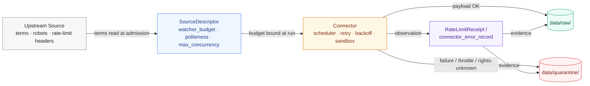

<!-- [KFM_META_BLOCK_V2]
doc_id: kfm://doc/TODO-uuid-connector-rate-limits
title: Connector Rate Limits and Politeness Standard
type: standard
version: v1
status: draft
owners: TODO — source-admission stewards (placeholder, needs assignment)
created: 2026-05-14
updated: 2026-05-14
policy_label: public
related:
  - docs/doctrine/directory-rules.md
  - docs/doctrine/lifecycle-law.md
  - docs/sources/README.md
  - connectors/README.md
  - schemas/contracts/v1/source/source-descriptor.json
  - contracts/source/source-descriptor.md
  - control_plane/source_authority_register.yaml
  - TODO ADR-S-12 — Connector cadence and quarantine recovery
tags: [kfm, source-admission, connector, rate-limit, politeness, raw, sourcedescriptor]
notes:
  - PROPOSED standard; no implementation maturity verified in this session.
  - Schema-home claims default to schemas/contracts/v1/source/ per ADR-0001 (NEEDS VERIFICATION).
  - Companion ADR for cadence / quarantine recovery is ADR-S-12 (PROPOSED backlog).
[/KFM_META_BLOCK_V2] -->

# Connector Rate Limits and Politeness Standard

KFM's standard for how connectors honor source-side rate limits, concurrency budgets, and politeness norms before any payload enters `data/raw/` or `data/quarantine/`.


| Field | Value |
|---|---|
| **Status** | `experimental` · draft standard, no enforcement claimed |
| **Owners** | TODO — source-admission stewards *(placeholder)* |
| **Last updated** | 2026-05-14 |
| **Authority class** | doctrine artifact under `docs/standards/` *(PROPOSED per Directory Rules §6.1)* |
| **Implementation maturity** | UNKNOWN — no mounted repo / CI / runtime evidence in this session |

> [!IMPORTANT]
> This is a **PROPOSED** standard. Every path, schema field, policy hook, CI lane, and SourceDescriptor field named below is grounded in attached KFM doctrine but **not** verified against a mounted repository in this session. Treat repository-state claims as PROPOSED or NEEDS VERIFICATION until inspected directly.

---

## Quick Jump

- [1. Scope](#1-scope)
- [2. Doctrinal basis](#2-doctrinal-basis)
- [3. Where this fits in the lifecycle](#3-where-this-fits-in-the-lifecycle)
- [4. Rate-limit and politeness contract](#4-rate-limit-and-politeness-contract)
- [5. PROPOSED budget fields on SourceDescriptor](#5-proposed-budget-fields-on-sourcedescriptor)
- [6. Connector finite-outcome envelope](#6-connector-finite-outcome-envelope)
- [7. Rate-limit events as source-adapter evidence](#7-rate-limit-events-as-source-adapter-evidence)
- [8. Sandbox / egress constraints](#8-sandbox--egress-constraints)
- [9. Validation, CI, and review obligations](#9-validation-ci-and-review-obligations)
- [10. Anti-patterns](#10-anti-patterns)
- [11. Open ADR backlog](#11-open-adr-backlog)
- [12. Tasks](#12-tasks)
- [13. FAQ](#13-faq)
- [14. Related docs](#14-related-docs)
- [15. Appendix — illustrative budget shape](#15-appendix--illustrative-budget-shape)

---

## 1. Scope

This standard governs the **outbound side of source admission**: how a KFM connector talks to an upstream source before the response is captured into `data/raw/<domain>/<source_id>/<run_id>/`. It covers request pacing, concurrency, retry, backoff, redirect handling, and the recording of throttling events as evidence.

It does **not** cover what happens *after* a payload is captured — that belongs to validation, normalization, evidence resolution, policy, promotion, and release. Those are governed by their own standards.

> [!NOTE]
> This standard is **PROPOSED**. It records doctrine drawn from attached KFM source materials and proposes a coherent surface; it does not assert that the surface is implemented, enforced, or tested. See Section 9 for the verification picture.

[↑ Back to top](#connector-rate-limits-and-politeness-standard)

---

## 2. Doctrinal basis

The standard rests on a small set of KFM doctrines that, taken together, make connector pacing a governed concern rather than a tuning knob.

| Doctrine | Statement | Source label | Status |
|---|---|---|---|
| Source-stewardship before throughput | Web watchers must record rate-limit posture, concurrency/threading budget, politeness constraints, and provider terms **before** using threaded or distributed fetching. | KFM-P18-INV-217 | PROPOSED |
| Threading is a stewardship control | Scraper concurrency and threading decisions are source-stewardship controls, not performance choices. | KFM-P18-INV-372, KFM-P18-INV-447 | PROPOSED |
| Distributed fetching needs source-load budgets | Distributed coordination across connectors must respect a per-source load budget, not just per-worker fairness. | KFM-P18-INV-422 | PROPOSED |
| Redirects and rate limits are evidence | Scraping adapters must record redirects, rate-limit responses, dynamic forms, and Ajax dependencies as source-adapter risk evidence — not silently smooth them. | KFM-P18-INV-336 | PROPOSED |
| Connector errors emit explicit dispositions | Connector error handling emits explicit failure dispositions (ERROR / QUARANTINE / ABSTAIN); over-aggressive retries must not hide failure. | KFM-P18-INV-281, KFM-P18-INV-337 | PROPOSED |
| Connectors do not publish | Connectors write to `data/raw/` or `data/quarantine/`. They MUST NOT mutate canonical truth or write under `data/processed/`, `data/catalog/`, or `data/published/`. | Directory Rules §7.3 | CONFIRMED (doctrine) |
| Sandbox is the containment boundary | AI-authored or unproven connector code runs in sandboxed runners with CPU/memory caps, hard timeouts, and a **network-egress allowlist** — no open internet. | KFM-P10 C12-05 | CONFIRMED (doctrine) |

The point of pacing is not throughput. It is **trust**: if KFM cannot show that a fetch honored a source's terms and limits, downstream provenance is weaker, rights posture is weaker, and the source's willingness to remain a source is weaker.

[↑ Back to top](#connector-rate-limits-and-politeness-standard)

---

## 3. Where this fits in the lifecycle

Rate-limit posture sits at the **trust membrane** between the upstream source and `RAW`. Everything downstream depends on it: if the fetch was impolite, the captured artifact is evidence of impoliteness as well as content.



> [!NOTE]
> The diagram reflects **PROPOSED** structure derived from KFM doctrine. Receipt object names (`RateLimitReceipt`, `connector_error_record`) are illustrative working names; canonical schema homes default to `schemas/contracts/v1/source/` per ADR-0001 (NEEDS VERIFICATION).

[↑ Back to top](#connector-rate-limits-and-politeness-standard)

---

## 4. Rate-limit and politeness contract

A connector run is "polite" only when **all** of the following hold for every outbound request:

1. The source's terms-of-use and `robots.txt` (where applicable) have been read at admission time and pinned to the `SourceDescriptor`.
2. The connector run is bound by a declared budget (delay, max parallelism, retry, backoff, jitter) at the per-source level — not just per-worker.
3. Upstream throttling signals (e.g., 429 / 503 / `Retry-After` and analogous mechanisms) are obeyed, recorded, and counted toward the run's evidence — *not* silently absorbed by retry.
4. Redirect chains, dynamic-form prompts, and unexpected response shapes are recorded as source-adapter risk evidence rather than smoothed away.
5. Distributed or threaded fetchers share the per-source budget across workers; per-worker politeness is not a substitute for per-source politeness.
6. Connector code runs inside a sandbox with a network-egress allowlist restricted to the source endpoints the run is contracted to access.

> [!CAUTION]
> Concurrency increases throughput but **weakens** rights posture, reliability posture, and operational ethics when it outruns source terms. Per KFM doctrine, this is an explicit tension, not a tradeoff to optimize. Default to less concurrency than the source appears to tolerate; record the budget and the observed throttling either way.

[↑ Back to top](#connector-rate-limits-and-politeness-standard)

---

## 5. PROPOSED budget fields on SourceDescriptor

KFM Pass-18 inventory proposes extending the `SourceDescriptor` with a `watcher_budget` block. The canonical schema home defaults to `schemas/contracts/v1/source/source-descriptor.json` per ADR-0001; **NEEDS VERIFICATION** against the mounted repo.

The fields below are PROPOSED and illustrative — names, types, and required-ness are not asserted as live schema.

| Field | Type | Required? | Notes |
|---|---|---|---|
| `watcher_budget.max_parallelism` | integer ≥ 1 | MUST for any threaded/distributed adapter | Per-source ceiling shared across all workers. |
| `watcher_budget.delay` | duration (e.g. `"500ms"`) | MUST | Minimum inter-request delay per source. |
| `watcher_budget.jitter` | duration | SHOULD | Randomized offset to avoid lockstep bursts. |
| `watcher_budget.retry.max_attempts` | integer ≥ 0 | MUST | Cap on retries; over-aggressive retries hide failure. |
| `watcher_budget.retry.strategy` | enum: `exponential` \| `linear` \| `fixed` \| `none` | MUST | Strategy chosen with source in mind, not throughput. |
| `watcher_budget.backoff.base` | duration | MUST when retry ≠ `none` | Starting backoff interval. |
| `watcher_budget.backoff.cap` | duration | MUST when retry ≠ `none` | Upper bound; prevents indefinite drift. |
| `watcher_budget.honor_retry_after` | boolean (default `true`) | MUST | Whether upstream-provided retry hints are obeyed. |
| `watcher_budget.source_terms_url` | URL | MUST | Pins the terms-of-use read at admission. |
| `watcher_budget.robots_posture` | enum: `obeys` \| `not_applicable` \| `waiver_recorded` | MUST | `waiver_recorded` requires a CorrectionNotice-class artifact (NEEDS VERIFICATION). |
| `watcher_budget.observed_throttling` | reference → throttling-observation receipt | SHOULD | Resolves to evidence about historical throttling on this source. |
| `watcher_budget.distributed_share_key` | string | MUST when run distributed | Shared budget identity across workers. |

> [!TIP]
> A `SourceDescriptor` that lacks a `watcher_budget` for a source the connector actually contacts at scale is a **drift signal**. It belongs in `docs/registers/DRIFT_REGISTER.md` (NEEDS VERIFICATION) — not silently fixed at the adapter layer.

[↑ Back to top](#connector-rate-limits-and-politeness-standard)

---

## 6. Connector finite-outcome envelope

Per KFM doctrine, decisions are expressed as finite outcomes, not free-form errors. A connector run terminates in **exactly one** of the dispositions below. The names are PROPOSED working terms; the **finite-outcome posture** is doctrine.

| Disposition | Meaning | Lifecycle effect |
|---|---|---|
| `ALLOW` | Run completed within budget and policy. | Payload lands in `data/raw/<domain>/<source_id>/<run_id>/`. |
| `RESTRICT` | Run completed but with rights / sensitivity / freshness restrictions attached. | Payload lands in `data/raw/...` with restrictions recorded on the ingest receipt. |
| `DENY` | Run was refused before or during fetch (e.g. unknown rights, expired terms, denylisted route, sandbox egress violation). | No payload retained beyond an audit envelope; reason code mandatory. |
| `ABSTAIN` | Evidence to proceed safely was not available (e.g. terms unread, budget unset, ambiguous source role). | Run held; quarantine reason recorded. |
| `ERROR` | A failure path inside the connector itself (sandbox kill, malformed adapter response, schema invariants broken). | Routed to `data/quarantine/` with a connector-error envelope. |

> [!WARNING]
> Over-aggressive retries that turn upstream `429` / `503` storms into apparent `ALLOW` are a **doctrine violation**, not a robustness feature. Throttle responses must surface as either `ABSTAIN` (waited and gave up) or `ERROR` (could not honor the budget), with the underlying observations recorded as evidence.

[↑ Back to top](#connector-rate-limits-and-politeness-standard)

---

## 7. Rate-limit events as source-adapter evidence

KFM doctrine treats throttling, redirects, and rate-limit refusals as **first-class evidence about the source-adapter relationship**, not as transport noise. A connector run SHOULD emit a structured observation when it encounters:

- Upstream rate-limit refusals (HTTP `429`, `503` with a retry hint, or source-specific equivalents — NEEDS VERIFICATION on per-source mapping).
- Redirect chains beyond a configured depth, or redirect loops.
- Unexpected interstitials (dynamic forms, captchas, JS-only payloads).
- Persistent latency or error-rate excursions relative to the declared budget.
- Sandbox egress denials (a destination outside the connector's allowlist was attempted).

These observations should resolve as `EvidenceRef → EvidenceBundle` per KFM's cite-or-abstain posture, so that downstream catalogs, releases, and corrections can audit why a source's reliability shifted.

<details>
<summary><strong>PROPOSED observation shape (illustrative, not authoritative)</strong></summary>

```yaml
# PROPOSED — names and schema home not verified
observation_id: kfm:throttle-obs:2026-05-14T15:22:01Z:usgs:nwis:run_42
source_id: usgs.nwis
connector_run_id: run_42
observed_at: 2026-05-14T15:22:01Z
event_kind: rate_limit_refusal     # | redirect_loop | interstitial | egress_denied | budget_exceeded
http_status: 429                   # NEEDS VERIFICATION per source
retry_after_seen: "60s"
budget_at_event:
  max_parallelism: 2
  delay: "500ms"
  honor_retry_after: true
disposition: ABSTAIN               # ALLOW | RESTRICT | DENY | ABSTAIN | ERROR
evidence_refs:
  - kfm:evidence:run_42:request_log
  - kfm:evidence:run_42:response_headers
spec_hash: TODO-spec-hash
```

</details>

[↑ Back to top](#connector-rate-limits-and-politeness-standard)

---

## 8. Sandbox / egress constraints

Per **C12-05** (Sandboxed Runners with Resource Bounds), connector code runs inside a sandbox that bounds CPU, memory, wall-clock, and — critically — **network egress**. The sandbox is *defense in depth*, not a substitute for the gates above.

- The egress allowlist MUST be derived from the `SourceDescriptor`'s declared endpoints — not from inferred or convenience-added hosts.
- An egress destination outside the allowlist is a **`DENY`** disposition, not a recoverable error. The attempt itself is evidence.
- Long-running fetches (WebSockets, paged exports) requiring broadened sandbox policy MUST be documented per-connector and verified in CI (PROPOSED, NEEDS VERIFICATION).
- Ephemeral storage applies: only validated outputs and the run receipt survive the sandbox.

> [!IMPORTANT]
> "AI-authored connector code that has not earned production trust" is explicitly within scope of C12-05. KFM doctrine treats this case as the **default**, not the exception, until trust has been earned through receipts, validation, and review state.

[↑ Back to top](#connector-rate-limits-and-politeness-standard)

---

## 9. Validation, CI, and review obligations

The CI posture below is **PROPOSED**. Per current-session evidence, no workflow files, CI runners, or test commands have been verified, and IMPL-REF baseline checks remain lineage requiring fresh verification.

| Lane | Purpose | Status |
|---|---|---|
| Schema and fixture suite | Prove valid and invalid `SourceDescriptor.watcher_budget` shapes | PROPOSED |
| Validator suite | Prove that an absent or zero budget on a threaded adapter is rejected | PROPOSED |
| Policy suite | Prove `DENY` on unknown rights / unread terms; prove `ABSTAIN` on missing budget | PROPOSED |
| Connector negative-state suite | Prove explicit failure dispositions for 4xx/5xx, redirect loops, interstitials, egress denials | PROPOSED |
| Live connector tests | Source-activated, opt-in only after rights, rate limits, secrets, and terms are verified | PROPOSED |
| Promotion dry-run | Show that an unresolved `observed_throttling` reference blocks promotion | PROPOSED |
| Catalog closure | Show that connector-error records are reachable as evidence from any RAW that depends on them | PROPOSED |

> [!NOTE]
> Live connector tests deliberately sit outside the default CI lane. Hitting real sources from CI without source activation, rate-limit verification, and secrets review is itself a politeness violation.

[↑ Back to top](#connector-rate-limits-and-politeness-standard)

---

## 10. Anti-patterns

The following patterns are explicitly out of bounds under this standard:

- **Silent retry storms** that mask `429` / `503` responses as eventual success.
- **Per-worker politeness** treated as per-source politeness in distributed runs.
- **Concurrency tuning** decided at the adapter layer instead of on the `SourceDescriptor`.
- **"Undercover" scrapers** — user-agent spoofing, cookie-jar manipulation, or any pattern designed to circumvent source posture — unless explicitly reviewed and recorded (KFM-P18-INV-423, PROPOSED).
- **Connector-side publication** — writing into `data/processed/`, `data/catalog/`, or `data/published/`. Connectors target `data/raw/` or `data/quarantine/` only.
- **Inferred egress** — the sandbox allowlist drifting beyond the `SourceDescriptor`'s declared endpoints.
- **Hidden throttling** — swallowing rate-limit responses without emitting a structured observation.

[↑ Back to top](#connector-rate-limits-and-politeness-standard)

---

## 11. Open ADR backlog

This standard touches several decisions that should be resolved by ADR before any of its surface is treated as canonical. Each item below maps to the master open-ADR backlog (see `docs/registers/VERIFICATION_BACKLOG.md`, NEEDS VERIFICATION).

| ADR | Decision | Status |
|---|---|---|
| ADR-S-12 *(PROPOSED title)* | Connector cadence and quarantine recovery policy | OPEN |
| ADR-0001 follow-up | Confirm `schemas/contracts/v1/source/` as the live `SourceDescriptor` schema home | NEEDS VERIFICATION |
| ADR-S-04 *(PROPOSED title)* | Source-role enum — vocabulary stability and evolution rule (touches budget applicability per role) | OPEN |
| New ADR *(PROPOSED)* | Rate-limit observation shape and home (`schemas/contracts/v1/source/throttle_observation.schema.json` — PROPOSED, NEEDS VERIFICATION) | OPEN |

[↑ Back to top](#connector-rate-limits-and-politeness-standard)

---

## 12. Tasks

- [ ] Confirm schema home and accepted name for `watcher_budget` on `SourceDescriptor` (ADR-0001 follow-up).
- [ ] Land valid/invalid fixtures for `watcher_budget` under the verified schema home.
- [ ] Define the canonical name and home for the throttling-observation record.
- [ ] Wire `connector_gate` validator to reject threaded adapters without a `watcher_budget`.
- [ ] Wire `promotion_gate` to require resolved `observed_throttling` evidence references.
- [ ] Publish per-connector sandbox policies (CPU / memory / wall-clock / egress allowlist) and verify in CI.
- [ ] Add per-source politeness defaults to `control_plane/source_authority_register.yaml` (NEEDS VERIFICATION).
- [ ] Decide policy for `robots_posture: waiver_recorded` — what evidence is required.
- [ ] File ADR-S-12 (cadence and quarantine recovery).

[↑ Back to top](#connector-rate-limits-and-politeness-standard)

---

## 13. FAQ

**Is this standard enforced today?**
UNKNOWN. The doctrinal basis is supported by attached project materials, but no mounted repo, workflow file, validator, schema, or CI run has been inspected this session. Treat the standard as PROPOSED.

**Where do the budget fields physically live?**
PROPOSED on `SourceDescriptor`, schema home defaulted to `schemas/contracts/v1/source/source-descriptor.json` per ADR-0001. NEEDS VERIFICATION against the mounted repo.

**Why isn't a 429 just an automatic retry?**
Because the response is also evidence about the source-adapter relationship. Silent retry destroys that evidence and can violate the source's terms even when the eventual request "succeeds."

**Where does a `robots.txt` waiver go?**
PROPOSED: a `waiver_recorded` posture requires a separate, reviewable artifact — likely a CorrectionNotice-class record or a per-source addendum (NEEDS VERIFICATION). It is not a `SourceDescriptor` field set silently.

**Does this apply to API clients with documented quotas?**
Yes. API quotas are a different *form* of rate limit, not an exemption. The `watcher_budget` shape is intended to cover both web watchers and API connectors.

**What about caching / `If-Modified-Since` / `ETag`?**
PROPOSED out of scope for this standard. Caching reduces source load but is a separate concern from declared budget posture. A future standard SHOULD cover conditional-request discipline.

[↑ Back to top](#connector-rate-limits-and-politeness-standard)

---

## 14. Related docs

- [`docs/doctrine/directory-rules.md`](../doctrine/directory-rules.md) — responsibility roots, `connectors/` boundary, schema-home rule.
- [`docs/doctrine/lifecycle-law.md`](../doctrine/lifecycle-law.md) — RAW → WORK/QUARANTINE → PROCESSED → CATALOG/TRIPLET → PUBLISHED.
- [`docs/sources/README.md`](../sources/README.md) — source-descriptor standards and source families *(NEEDS VERIFICATION — path PROPOSED)*.
- [`connectors/README.md`](../../connectors/README.md) — connector authority root and source-specific READMEs *(NEEDS VERIFICATION)*.
- `schemas/contracts/v1/source/source-descriptor.json` — PROPOSED schema home per ADR-0001.
- `contracts/source/source-descriptor.md` — PROPOSED semantic home for `SourceDescriptor`.
- `control_plane/source_authority_register.yaml` — PROPOSED operational register.
- TODO — `docs/adr/ADR-S-12-connector-cadence-and-quarantine-recovery.md` *(not yet drafted)*.

---

## 15. Appendix — illustrative budget shape

> [!NOTE]
> This appendix is **illustrative**. It is not authoritative schema, not a fixture, and not pinned to a verified schema version. It exists so reviewers can argue about a concrete shape rather than an abstract one.

<details>
<summary><strong>Illustrative <code>watcher_budget</code> on a hypothetical SourceDescriptor</strong></summary>

```yaml
# PROPOSED, illustrative only — not a live fixture
source_id: usgs.nwis
source_role: observed
source_authority: usgs
rights_status: public_domain                # NEEDS VERIFICATION per dataset
sensitivity: T0                             # NEEDS VERIFICATION; ADR-S-05 open
watcher_budget:
  max_parallelism: 2
  delay: "500ms"
  jitter: "250ms"
  retry:
    max_attempts: 3
    strategy: exponential
  backoff:
    base: "1s"
    cap: "60s"
  honor_retry_after: true
  source_terms_url: "https://waterservices.usgs.gov/...terms..."   # NEEDS VERIFICATION
  robots_posture: not_applicable
  observed_throttling: kfm:evidence:usgs.nwis:throttle-history
  distributed_share_key: "usgs.nwis:global"
spec_hash: TODO-spec-hash
```

</details>

<details>
<summary><strong>Illustrative <code>connector_error_record</code></strong></summary>

```yaml
# PROPOSED, illustrative only
record_id: kfm:connector-error:run_42:0001
connector_run_id: run_42
source_id: usgs.nwis
observed_at: 2026-05-14T15:22:01Z
disposition: ABSTAIN
reason_codes:
  - upstream_rate_limit
  - retry_after_exceeded_budget_cap
http_status: 429
evidence_refs:
  - kfm:evidence:run_42:request_log
  - kfm:evidence:run_42:response_headers
spec_hash: TODO-spec-hash
```

</details>

---

### Related docs

- [`docs/doctrine/directory-rules.md`](../doctrine/directory-rules.md)
- [`docs/doctrine/lifecycle-law.md`](../doctrine/lifecycle-law.md)
- [`docs/sources/README.md`](../sources/README.md) *(NEEDS VERIFICATION)*
- [`connectors/README.md`](../../connectors/README.md) *(NEEDS VERIFICATION)*

**Last updated:** 2026-05-14 · draft · `v1`
[↑ Back to top](#connector-rate-limits-and-politeness-standard)
