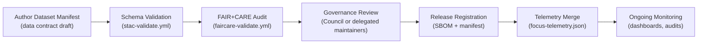

<div align="center">

# 📜 **Kansas Frontier Matrix — Data Contracts & Metadata Schema Specification**  
`docs/standards/data-contracts.md`

**Purpose:**  
Define the **canonical structure, fields, and validation rules** for dataset metadata (“data contracts”) used throughout the Kansas Frontier Matrix (KFM).  
Data contracts ensure that all datasets—historical, geospatial, textual, sensor, and AI-derived—are **reproducible, interoperable, FAIR+CARE-aligned, and KFM-MDP v11 compliant**.

[](../README.md)  
[]()  
[](../../LICENSE)  
[](faircare.md)  
[]()

</div>

---

## 📘 Overview

**Data Contracts** in KFM are formal, versioned agreements that describe the **schema, quality gates, and ethical governance requirements** for all datasets.

They guarantee that data remains:

- **Machine-readable** — STAC/DCAT-compatible JSON/JSON-LD, GeoJSON, and related metadata  
- **Traceable** — checksums, provenance, SBOM reference, lineage and version history  
- **Ethically governed** — CARE metadata, Council review, and abandonment/retirement records  
- **Reproducible** — CI-based validation, deterministic transforms, telemetry logging  
- **Integrable** — consistent mapping to CIDOC CRM, OWL-Time, GeoSPARQL, ISO 19115, schema.org

Data contracts are validated by automated workflows (e.g., `stac-validate.yml`, `faircare-validate.yml`), with results logged into:

- The **Governance Ledger**  
- Release **manifest**  
- `focus-telemetry.json` for telemetry and sustainability tracking  

This document focuses on the **metadata layer**, not the content of the datasets themselves.

---

## 🗂️ Directory & Schema Integration

```text
docs/
└── standards/
    │
    ├── data-contracts.md                 # ← This specification
    ├── faircare.md                       # FAIR+CARE governance framework
    ├── markdown_rules.md                 # Markdown structural standards (KFM-MDP v11)
    ├── kfm_markdown_protocol_v11.md      # Markdown authoring protocol
    ├── kfm_markdown_output_protocol.md   # Output behavior protocol (generators/AI)
    └── governance/
        └── ROOT-GOVERNANCE.md            # Ethical governance charter
```

**Schema & Ontology Foundations:**

- STAC 1.0.0 (Items, Collections, Catalogs)  
- DCAT 3.0 (Dataset/Distribution metadata)  
- CIDOC CRM (cultural heritage entities & events)  
- OWL-Time (temporal intervals & instants)  
- GeoJSON & GeoSPARQL (spatial metadata)  
- ISO 19115 (geospatial metadata)  
- PROV-O & schema.org (provenance & description)

---

## 🧭 Contract Lifecycle

Data contracts follow a **well-defined lifecycle**, from draft to enforced:



States:

- `draft` → `under_review` → `approved` → `active` → `deprecated` → `retired`

All state changes MUST be recorded in governance and telemetry logs.

---

## 🧱 Core Metadata Fields (v11 Contract Model)

Each dataset covered by a KFM data contract MUST expose the following **core metadata** (in JSON/JSON-LD or equivalent):

| Field         | Type          | Description                                             | Required | Example                                                         |
|--------------|---------------|---------------------------------------------------------|----------|-----------------------------------------------------------------|
| `id`         | String        | Stable, unique dataset identifier (slug or UUID).       | ✅        | `"noaa_storms_1950_2025"`                                       |
| `title`      | String        | Human-readable title.                                  | ✅        | `"NOAA Storm Events Archive (1950–2025)"`                       |
| `description`| String        | Summary of contents, scope, and purpose.               | ✅        | `"Severe storm events affecting Kansas from 1950 to 2025."`     |
| `type`       | String        | Dataset type: `raster`, `vector`, `tabular`, `text`, `model`, `mixed`. | ✅ | `"tabular"`                                                      |
| `spatial`    | Array<Number> | Bounding box `[west, south, east, north]` in WGS84.    | ✅        | `[-102.05, 37.0, -94.6, 40.0]`                                  |
| `temporal`   | Object        | Time coverage; at least `start` ISO-8601, optional `end`. | ✅      | `{"start":"1950-01-01T00:00:00Z","end":"2025-12-31T23:59:59Z"}` |
| `license`    | String        | SPDX identifier or vetted open-data license string.    | ✅        | `"CC-BY-4.0"`                                                   |
| `provenance` | String        | Source/origin (agency, institution, archive).          | ✅        | `"NOAA NCEI"`                                                   |
| `checksum`   | String        | SHA-256 digest or pointer (DVC/LFS).                   | ✅        | `"sha256-4a0f...ae3d"`                                          |
| `keywords`   | Array<String> | Search tags / topics.                                  | ⚙️       | `["weather","climate","noaa","kansas"]`                         |
| `doi`        | String        | DOI or persistent identifier, if available.            | ⚙️       | `"10.5065/D6R78D7V"`                                            |
| `lineage`    | String        | Short description of processing history.               | ⚙️       | `"Derived from NCEI archives using KFM ETL v3.1"`               |
| `format`     | String        | Primary storage format (e.g. `"GeoTIFF"`, `"Parquet"`).| ⚙️       | `"GeoTIFF"`                                                     |
| `care`       | Object        | CARE ethics metadata (see below).                      | ⚙️       | `{ "status":"approved" }`                                       |
| `updated`    | String        | Last update timestamp in UTC (ISO-8601).               | ✅        | `"2025-11-12T00:00:00Z"`                                        |

> ⚙️ = Recommended but not strictly required by schema; some workflows may enforce as required for specific domains.

---

## ⚖️ CARE Metadata Block (Ethical Data Layer)

The `care` block encodes ethical status, control, and usage conditions:

| CARE Field      | Type   | Description                                         | Example                                     |
|-----------------|--------|-----------------------------------------------------|---------------------------------------------|
| `status`        | Enum   | `approved` · `revision` · `restricted`              | `"approved"`                                |
| `statement`     | String | Ethics/consent statement or conditions.             | `"Cleared for open publication by Council"` |
| `reviewer`      | String | Reviewing entity or council.                        | `"KFM FAIR+CARE Council"`                   |
| `date_reviewed` | String | ISO-8601 date of latest ethical review.             | `"2025-10-28"`                              |
| `notes`         | String | Additional guidance or usage restrictions.          | `"No culturally restricted content"`        |

Examples of `status`:

- `approved` → eligible for open publication  
- `revision` → must be remediated; not publishable yet  
- `restricted` → may be used internally under constraints; not open data  

Any dataset with `restricted` MUST be tagged accordingly in catalogs & UI and treated as non-public.

---

## 🧩 Extended Metadata Fields (Interoperability)

To support deep interoperability, KFM data contracts MAY include extended fields mapping to external ontologies:

| Field                               | Description                                          | External Mapping |
|-------------------------------------|------------------------------------------------------|------------------|
| `stac_extensions`                   | Array of STAC extension URIs used.                  | STAC 1.0.0       |
| `dcat:theme`                        | Thematic category for DCAT.                         | DCAT 3.0         |
| `dcat:keyword`                      | Additional mapping of `keywords` to DCAT.           | DCAT 3.0         |
| `geo:geometry`                      | GeoJSON geometry for footprint.                     | GeoJSON          |
| `time:hasBeginning` / `time:hasEnd` | OWL-Time mapping for `temporal`.                    | OWL-Time         |
| `prov:wasGeneratedBy`              | PROV-O activity that generated dataset.             | PROV-O           |
| `prov:used`                        | Inputs (datasets/tools) used.                       | PROV-O           |
| `schema:creator`                   | Creator contact & affiliation.                      | schema.org       |
| `schema:distribution`              | Distribution endpoints; access URLs.                | DCAT 3.0         |
| `schema:license`                   | Human-readable license pointer.                     | schema.org       |

These fields are especially important for:

- Exposing KFM datasets to external catalogs  
- Publishing to knowledge graphs or linked-data endpoints  
- Ensuring cross-system reuse of KFM metadata

---

## 🧠 Example Data Contract JSON (KFM v11 Profile)

```json
{
  "id": "noaa_storms_1950_2025",
  "title": "NOAA Storm Events Archive (1950–2025)",
  "description": "Severe storm events affecting Kansas from 1950 to 2025.",
  "type": "tabular",
  "spatial": [-102.05, 37.0, -94.6, 40.0],
  "temporal": {
    "start": "1950-01-01T00:00:00Z",
    "end": "2025-12-31T23:59:59Z"
  },
  "license": "CC-BY-4.0",
  "provenance": "NOAA NCEI",
  "checksum": "sha256-4a0f3b8122f7a9a83c9e5ac5df4ae3d2f9b71f0e29abce1234567890abcdef12",
  "keywords": ["weather", "storms", "noaa", "kansas"],
  "format": "CSV",
  "lineage": "Ingested from NCEI Storm Events bulk archives and filtered to Kansas.",
  "care": {
    "status": "approved",
    "statement": "Contains only non-sensitive, public-domain climatological data.",
    "reviewer": "KFM FAIR+CARE Council",
    "date_reviewed": "2025-10-28",
    "notes": "No PII present; no cultural sites implicated."
  },
  "updated": "2025-11-12T00:00:00Z"
}
```

This contract can be embedded in a STAC Item as the `properties` section or referenced via a `kfm:contract_ref` field.

---

## 🧮 Example JSON Schema (v11 Data Contract Schema)

```json
{
  "$schema": "https://json-schema.org/draft/2020-12/schema",
  "$id": "https://schemas.kfm.dev/data-contract.v11.schema.json",
  "title": "Kansas Frontier Matrix Data Contract (v11)",
  "description": "Metadata schema for datasets in the Kansas Frontier Matrix.",
  "type": "object",
  "required": [
    "id",
    "title",
    "description",
    "type",
    "spatial",
    "temporal",
    "license",
    "provenance",
    "checksum",
    "updated"
  ],
  "properties": {
    "id": { "type": "string", "minLength": 1 },
    "title": { "type": "string", "minLength": 1 },
    "description": { "type": "string", "minLength": 1 },
    "type": {
      "type": "string",
      "enum": ["raster", "vector", "tabular", "text", "model", "mixed"]
    },
    "spatial": {
      "type": "array",
      "items": { "type": "number" },
      "minItems": 4,
      "maxItems": 4
    },
    "temporal": {
      "type": "object",
      "required": ["start"],
      "properties": {
        "start": { "type": "string", "format": "date-time" },
        "end": { "type": "string", "format": "date-time" }
      },
      "additionalProperties": false
    },
    "license": { "type": "string" },
    "provenance": { "type": "string" },
    "checksum": {
      "type": "string",
      "pattern": "^sha256-[A-Fa-f0-9]{6,}$"
    },
    "keywords": {
      "type": "array",
      "items": { "type": "string" }
    },
    "doi": { "type": "string" },
    "lineage": { "type": "string" },
    "format": { "type": "string" },
    "care": {
      "type": "object",
      "properties": {
        "status": { "type": "string", "enum": ["approved", "revision", "restricted"] },
        "statement": { "type": "string" },
        "reviewer": { "type": "string" },
        "date_reviewed": { "type": "string", "format": "date" },
        "notes": { "type": "string" }
      },
      "additionalProperties": false
    },
    "updated": { "type": "string", "format": "date-time" }
  },
  "additionalProperties": false
}
```

This schema is used by CI to validate all data contract manifests before release.

---

## 🧪 Validation Workflow

KFM uses dedicated CI workflows to enforce data contracts:

| Workflow                | Purpose                                           | Primary Outputs                                     |
|-------------------------|---------------------------------------------------|-----------------------------------------------------|
| `stac-validate.yml`     | Ensures STAC/DCAT structures and `properties` match contract schema. | `reports/self-validation/stac_validation.json`      |
| `faircare-validate.yml` | Checks CARE status, ethical notes, and sensitive data fields.        | `reports/fair/faircare_summary.json`                |
| `docs-lint.yml`         | Verifies that all data-contract docs themselves follow KFM-MDP v11. | `reports/self-validation/docs/lint_summary.json`    |
| `telemetry-export.yml`  | Publishes validation metrics into telemetry bundles.                | `releases/v11.0.0/focus-telemetry.json`            |

**No dataset may be published as official KFM data without passing these validations.**

---

## 🧾 Governance Integration

Data contracts are part of KFM’s governance story:

- Contract creation, revision, and retirement events are recorded in:  

  ```text
  reports/audit/governance-ledger.json
  reports/audit/release-manifest-log.json
  ```

- FAIR+CARE Council reviews CARE metadata for new / sensitive datasets.  
- Technical maintainers review structural compliance (STAC/DCAT/schema).  
- Contract changes MUST be accompanied by:

  - Version bump (`vX.Y.Z`)  
  - Updated `updated` timestamp  
  - New governance log entry  

**Example Governance Ledger Entry:**

```json
{
  "event": "data_contract_review",
  "dataset_id": "noaa_storms_1950_2025",
  "status": "approved",
  "reviewer": "KFM FAIR+CARE Council",
  "timestamp": "2025-11-12T16:05:00Z",
  "telemetry_ref": "releases/v11.0.0/focus-telemetry.json"
}
```

---

## ⚖️ FAIR+CARE Compliance Mapping

Data contracts embody the FAIR+CARE principles as follows:

| Principle | Requirement in Contract                                                                 |
|----------|------------------------------------------------------------------------------------------|
| F (Findable) | `id`, `title`, `description`, `keywords`, STAC/DCAT mappings.                        |
| A (Accessible) | `license`, `provenance`, `format`, `distribution`/access URLs (in STAC/DCAT layer). |
| I (Interoperable) | Extended ontologies (CIDOC, OWL-Time, GeoJSON, PROV-O, schema.org).             |
| R (Reusable) | Clear licensing, provenance, lineage, checksum and CARE notes.                       |
| CARE | CARE block and governance review define ethical boundaries and usage conditions.            |

Datasets that cannot meet these obligations MUST be:

- Restricted (`care.status = "restricted"`)  
- Kept out of public catalogs and map layers  
- Flagged for special handling in UIs and workflows  

---

## 🔁 Data Contract Evolution Rules

When evolving a data contract:

1. **Update version** (SemVer) and `updated` timestamp.  
2. **Append** an entry to Version History (in this doc, for normative changes).  
3. **Record** changes in governance ledger and release manifest log.  
4. **Re-run** all CI validations (`stac-validate`, `faircare-validate`, `docs-lint`, `telemetry-export`).  
5. **Communicate** breaking changes to dependent pipelines and clients.

Contract changes MUST preserve backward compatibility when possible. Breaking changes require:

- New `id` or explicit version pattern  
- Deprecated treatment for old contract manifest  
- Clear documentation in `docs/standards/` and data dictionaries  

---

## 🕰️ Version History

| Version | Date       | Author        | Summary                                                                                                                 |
|--------:|------------|--------------|-------------------------------------------------------------------------------------------------------------------------|
| v11.0.0 | 2025-11-20 | KFM Core Team | Upgraded to KFM-MDP v11.0.0; added extended YAML front-matter, OWL-Time & GeoSPARQL alignment, CI workflow mapping, and clarified CARE & FAIR mappings. |
| v10.2.2 | 2025-11-12 | A. Barta      | Updated release references to v10.2.0; clarified extended metadata and governance integration; aligned with telemetry-export v2. |
| v10.0.0 | 2025-11-10 | A. Barta      | Upgraded to v10.0.0; v10 SBOM/manifest/telemetry refs; added `telemetry_schema` v2 and CARE integration clarifications.         |
| v9.7.0  | 2025-11-05 | A. Barta      | Defined universal KFM data contract schema with FAIR+CARE integration.                                                  |
| v9.5.0  | 2025-10-20 | A. Barta      | Added CARE metadata block and governance linkage.                                                                       |
| v9.3.0  | 2025-08-12 | KFM Core Team | Improved STAC/DCAT compatibility mapping.                                                                              |
| v9.0.0  | 2025-06-01 | KFM Core Team | Established schema validation baseline.                                                                                |

---

<div align="center">

📜 **Kansas Frontier Matrix — Data Contracts**  
All datasets must pass through the **data contract gate** before they can join the living atlas.

© 2025 Kansas Frontier Matrix — CC-BY 4.0  
Master Coder Protocol v6.3 · FAIR+CARE Certified · Diamond⁹ Ω / Crown∞Ω Ultimate Certified  

[⬅ Back to Standards Index](README.md) · [⚖ Root Governance Charter](governance/ROOT-GOVERNANCE.md)

</div>
