<div align="center">

# 📜 **Kansas Frontier Matrix — Data Contracts & Metadata Schema Specification**  
`docs/standards/data-contracts.md`

**Purpose:**  
Define the structure, fields, and validation rules for dataset metadata used throughout the Kansas Frontier Matrix (KFM).  
Data contracts ensure that all datasets—historical, geospatial, textual, and AI-generated—follow a reproducible, interoperable, and **FAIR+CARE**-aligned schema.

[](../README.md)
[](../../LICENSE)
[](faircare.md)
[]()

</div>

---

## 📘 Overview

**Data Contracts** in KFM are formal agreements that describe the **schema**, **validation gates**, and **ethical governance requirements** for all datasets. They guarantee that data remains:

- **Machine-readable** (JSON/JSON-LD / Parquet / GeoJSON metadata)  
- **Traceable** (checksums, provenance, SBOM, release manifest)  
- **Ethically governed** (CARE metadata, council review, abandonment registry)  
- **Reproducible** (CI validation + telemetry logging)

Contracts are validated by automated workflows (`faircare-validate.yml`, `stac-validate.yml`), with results recorded in the **Governance Ledger** and `focus-telemetry.json`.

---

## 🗂️ Directory & Schema Integration

```plaintext
docs/standards/
├── data-contracts.md                 # This specification
├── faircare.md                       # FAIR+CARE governance framework
├── markdown_rules.md                 # Documentation format standards
└── governance/ROOT-GOVERNANCE.md     # Ethical governance charter
````

**Schema Sources:** STAC 1.0.0 · DCAT 3.0 · CIDOC CRM · OWL-Time · GeoJSON · ISO 19115 · PROV-O · schema.org

---

## 🧭 Contract Lifecycle

```mermaid
flowchart LR
  A["Author Dataset Manifest"] --> B["Schema Validation (stac-validate.yml)"]
  B --> C["FAIR·CARE Audit (faircare-validate.yml)"]
  C --> D["Governance Ledger Sync"]
  D --> E["Release (SBOM + Manifest)"]
  E --> F["Telemetry Merge (focus-telemetry.json)"]
```



---

## 🧱 Core Metadata Fields

| Field         | Type          | Description                                        | Required | Example                                                         |
| ------------- | ------------- | -------------------------------------------------- | -------- | --------------------------------------------------------------- |
| `id`          | String        | Unique identifier (UUID or human-readable).        | ✅        | `"noaa_storms_1950_2025"`                                       |
| `title`       | String        | Descriptive dataset name.                          | ✅        | `"NOAA Storm Events Archive (1950–2025)"`                       |
| `description` | String        | Summary of contents, scope, and source.            | ✅        | `"Recorded severe weather events across Kansas."`               |
| `type`        | String        | `raster` | `vector` | `tabular` | `text` | `model` | ✅        | `"raster"`                                                      |
| `spatial`     | Array<Number> | BBox `[west, south, east, north]` (WGS84).         | ✅        | `[-102.05, 37.0, -94.6, 40.0]`                                  |
| `temporal`    | Object        | Time range of validity.                            | ✅        | `{"start":"1950-01-01T00:00:00Z","end":"2025-12-31T23:59:59Z"}` |
| `license`     | String        | SPDX identifier                                    | ✅        | `"CC-BY-4.0"`                                                   |
| `provenance`  | String        | Source or origin reference.                        | ✅        | `"NOAA NCEI"`                                                   |
| `checksum`    | String        | SHA-256 digest or pointer (DVC/LFS).               | ✅        | `"sha256-4a0f...ae3d"`                                          |
| `keywords`    | Array<String> | Search terms.                                      | ⚙️       | `["weather","climate","noaa","kansas"]`                         |
| `doi`         | String        | DOI / PID (if exists).                             | ⚙️       | `"10.5065/D6R78D7V"`                                            |
| `lineage`     | String        | Processing history summary.                        | ⚙️       | `"Derived from NCEI raw archives (proc v3.1)"`                  |
| `format`      | String        | Primary encoding / container.                      | ⚙️       | `"GeoTIFF"`                                                     |
| `care`        | Object        | CARE ethics metadata block.                        | ⚙️       | `{ "status":"approved" }`                                       |
| `updated`     | String        | ISO timestamp (UTC).                               | ✅        | `"2025-11-12T00:00:00Z"`                                        |

> For spatial layers, add optional `geo:geometry` (GeoJSON), and for catalogs add `stac_extensions` (array of extension URIs).

---

## ⚖️ CARE Metadata (Ethical Data Layer)

| CARE Field      | Type   | Description                            | Example                                     |
| --------------- | ------ | -------------------------------------- | ------------------------------------------- |
| `status`        | Enum   | `approved` | `revision` | `restricted` | `"approved"`                                |
| `statement`     | String | Ethical handling note/permission.      | `"Cleared for open publication by Council"` |
| `reviewer`      | String | Reviewing entity.                      | `"KFM FAIR+CARE Council"`                   |
| `date_reviewed` | String | ISO date.                              | `"2025-10-28"`                              |
| `notes`         | String | Additional guidance.                   | `"No culturally restricted content"`        |

CARE status controls publication gates in CI:

* `approved` → eligible for release
* `revision` → must be remediated before release
* `restricted` → held in staging; limited access

---

## 🧩 Extended Metadata Fields

| Field                               | Description                     | Relation   |
| ----------------------------------- | ------------------------------- | ---------- |
| `stac_extensions`                   | URIs to STAC extensions in use. | STAC 1.0.0 |
| `dcat:theme`                        | Thematic category.              | DCAT 3.0   |
| `geo:geometry`                      | GeoJSON geometry object.        | GeoJSON    |
| `time:hasBeginning` / `time:hasEnd` | Temporal ontology mapping.      | OWL-Time   |
| `prov:wasGeneratedBy` / `prov:used` | Provenance activities & inputs. | PROV-O     |
| `schema:creator`                    | Dataset creator details.        | schema.org |
| `schema:distribution`               | Data access endpoints.          | DCAT 3.0   |
| `schema:license`                    | Human-readable license text.    | schema.org |

---

## 🧠 Example Data Contract (JSON Schema, v10)

```json
{
  "$schema": "https://json-schema.org/draft/2020-12/schema",
  "$id": "https://schemas.kfm.dev/data-contract.v10.schema.json",
  "title": "Kansas Frontier Matrix Data Contract (v10)",
  "description": "Metadata schema for datasets in the Kansas Frontier Matrix.",
  "type": "object",
  "required": [
    "id",
    "title",
    "description",
    "type",
    "spatial",
    "temporal",
    "license",
    "provenance",
    "checksum",
    "updated"
  ],
  "properties": {
    "id": { "type": "string", "minLength": 1 },
    "title": { "type": "string", "minLength": 1 },
    "description": { "type": "string", "minLength": 1 },
    "type": { "type": "string", "enum": ["raster", "vector", "tabular", "text", "model"] },
    "spatial": {
      "type": "array",
      "items": { "type": "number" },
      "minItems": 4,
      "maxItems": 4
    },
    "temporal": {
      "type": "object",
      "required": ["start"],
      "properties": {
        "start": { "type": "string", "format": "date-time" },
        "end": { "type": "string", "format": "date-time" }
      },
      "additionalProperties": false
    },
    "license": { "type": "string" },
    "provenance": { "type": "string" },
    "checksum": {
      "type": "string",
      "pattern": "^sha256-[A-Fa-f0-9]{6,}$"
    },
    "keywords": {
      "type": "array",
      "items": { "type": "string" }
    },
    "doi": { "type": "string" },
    "lineage": { "type": "string" },
    "format": { "type": "string" },
    "care": {
      "type": "object",
      "properties": {
        "status": { "type": "string", "enum": ["approved", "revision", "restricted"] },
        "statement": { "type": "string" },
        "reviewer": { "type": "string" },
        "date_reviewed": { "type": "string", "format": "date" },
        "notes": { "type": "string" }
      },
      "additionalProperties": false
    },
    "updated": { "type": "string", "format": "date-time" }
  },
  "additionalProperties": false
}
```

---

## 🧪 Validation Workflow

| Workflow                | Function                                            | Output                                           |
| ----------------------- | --------------------------------------------------- | ------------------------------------------------ |
| `faircare-validate.yml` | Enforces contract completeness & CARE ethics gates  | `reports/fair/faircare_summary.json`             |
| `stac-validate.yml`     | STAC/DCAT structural compatibility checks           | `reports/self-validation/stac_validation.json`   |
| `docs-lint.yml`         | Confirms front-matter + section order in docs       | `reports/self-validation/docs/lint_summary.json` |
| `telemetry-export.yml`  | Publishes contract validation metrics to dashboards | `releases/v10.2.0/focus-telemetry.json`          |

---

## 🧾 Governance Integration

Contract adoption and changes are governed by the FAIR+CARE Council.

Audit trails are logged to:

```plaintext
reports/audit/governance-ledger.json
reports/audit/release-manifest-log.json
docs/reports/telemetry/governance_scorecard.json
```

**Example Governance Ledger Entry**

```json
{
  "event": "data_contract_review",
  "dataset_id": "noaa_storms_1950_2025",
  "status": "approved",
  "reviewer": "FAIR+CARE Council",
  "timestamp": "2025-11-12T16:05:00Z",
  "telemetry_ref": "releases/v10.2.0/focus-telemetry.json"
}
```

---

## ⚖️ FAIR+CARE Compliance Mapping

| Principle         | Data Contract Requirement                                               |
| ----------------- | ----------------------------------------------------------------------- |
| **Findable**      | Unique `id`, `title`, and standardized metadata for STAC/DCAT indexing. |
| **Accessible**    | License and distribution information; clear provenance.                 |
| **Interoperable** | STAC/DCAT/CIDOC/PROV-O/OWL-Time fields supported.                       |
| **Reusable**      | Provenance, lineage, checksum integrity, and clear licensing.           |
| **CARE**          | `care` block captures ethical status, reviewer, and statements.         |

---

## 🔁 Data Contract Evolution

All contract changes must:

1. Use semantic versioning (e.g., `v10.0.0 → v10.1.0`).
2. Include a changelog entry in `reports/audit/release-manifest-log.json`.
3. Pass automated schema validation and FAIR+CARE workflows.
4. Obtain Council approval for any CARE or governance-related field changes.

**Evolution Flow:** `Propose` → `Review` → `Approve` → `Merge` → `Telemetry Update`.

---

## 🕰️ Version History

| Version | Date       | Author        | Summary                                                                                                                                    |
| ------- | ---------- | ------------- | ------------------------------------------------------------------------------------------------------------------------------------------ |
| v10.2.2 | 2025-11-12 | A. Barta      | Updated teleport/manifest references to v10.2.0; clarified extended metadata and governance integration; aligned with telemetry-export v2. |
| v10.0.0 | 2025-11-10 | A. Barta      | Upgraded to v10.0.0; v10 SBOM/manifest/telemetry refs; added `telemetry_schema` v2 and CARE integration clarifications.                    |
| v9.7.0  | 2025-11-05 | A. Barta      | Defined universal KFM data contract schema with FAIR+CARE integration.                                                                     |
| v9.5.0  | 2025-10-20 | A. Barta      | Added CARE metadata block and governance linkage.                                                                                          |
| v9.3.0  | 2025-08-12 | KFM Core Team | Improved STAC/DCAT compatibility mapping.                                                                                                  |
| v9.0.0  | 2025-06-01 | KFM Core Team | Established schema validation baseline.                                                                                                    |

---

<div align="center">

**© 2025 Kansas Frontier Matrix — CC-BY 4.0**
Compliant with **Master Coder Protocol v6.3** · FAIR+CARE Certified · Diamond⁹ Ω / Crown∞Ω Ultimate Certified
[Back to Standards Index](README.md) · [Root Governance Charter](governance/ROOT-GOVERNANCE.md)

</div>
