<div align="center">

# 📜 **Kansas Frontier Matrix — Data Contracts & Metadata Schema Specification**  
`docs/standards/data-contracts.md`

**Purpose**  
Define the **canonical structure, fields, and validation rules** for dataset metadata (“data contracts”) used throughout the Kansas Frontier Matrix (KFM).  
Data contracts ensure datasets—historical, geospatial, textual, sensor, analytical, and AI-assisted artifacts—remain **reproducible, interoperable, FAIR+CARE-aligned, and contract-first compliant** 🧾✅

[]()  
[]()  
[]()  
[]()  
[]()  
[](faircare.md)  
[]()  
[]()

</div>

---

## 📘 Overview

### 🎯 What a “Data Contract” Means in KFM
A **KFM Data Contract** is a **versioned, governed, machine-validated agreement** describing:

- 📦 **What the dataset is** (identity, scope, spatial/temporal coverage, domain)
- 🧾 **Where it came from** (provenance + lineage + sources)
- ✅ **How it can be used** (license + restrictions + CARE)
- 🧪 **How it’s validated** (schemas, policy gates, quality checks)
- 🔗 **How it links across boundary layers** (STAC ↔ DCAT ↔ PROV ↔ Graph ↔ API ↔ Story Nodes)

### 🧷 Non‑negotiable invariants (KFM v13-aligned)
These are the “do not regress” rules 🧱:

- **Contract‑first** 🧾 — contracts and schemas are first-class repo artifacts; changes trigger strict versioning checks.
- **Deterministic pipeline** ⚙️ — ETL is idempotent, config-driven, and fully logged; outputs are reproducible for given inputs.
- **Evidence‑first** 🔎 — catalogs and provenance must exist **before** Story Nodes and Focus Mode can present claims.
- **Canonical ordering** 🧭 — `ETL → STAC/DCAT/PROV catalogs → Graph → APIs → UI → Story Nodes → Focus Mode`.
- **Sovereignty-by-design** 🪶 — if redaction/generalization is required, it must be applied at **every layer** (data, metadata, API, UI) and documented.
- **Release integrity** 🔐 — official releases are expected to publish signed artifacts (SBOM + provenance attestations + manifests).

### 📌 Scope & non-scope
✅ In scope:
- Dataset-level metadata contracts (and their mappings into STAC/DCAT/PROV)
- Validation expectations & CI gates
- Ethical governance metadata (CARE) + sovereignty constraints

❌ Not in scope:
- Full data dictionaries for each dataset (domain docs live under `docs/data/<domain>/`)
- Detailed ontology modeling choices (see ontology protocol & graph standards)

---

## 🗂️ Directory Layout & Schema Integration

### 🧭 Canonical homes (one source of truth per subsystem)
KFM v13 enforces one canonical directory per subsystem to eliminate drift 🧹

```text
📂 docs/
├── 📄 MASTER_GUIDE_v13.md                      # 📘 Canonical repo/pipeline reference
├── 📂 standards/
│   ├── 📄 data-contracts.md                    # 📜 This specification
│   ├── 📄 KFM_STAC_PROFILE.md                  # 🗺️ STAC profile (v11)
│   ├── 📄 KFM_DCAT_PROFILE.md                  # 🧾 DCAT profile (v11)
│   ├── 📄 KFM_PROV_PROFILE.md                  # 🧬 PROV profile (v11)
│   ├── 📄 KFM_MARKDOWN_WORK_PROTOCOL.md        # ✍️ Markdown authoring/DoD
│   └── 📄 faircare.md                          # ⚖ FAIR+CARE governance layer
├── 📂 templates/
│   ├── 📄 TEMPLATE__KFM_UNIVERSAL_DOC.md       # 🧩 Universal governed doc template
│   ├── 📄 TEMPLATE__STORY_NODE_V3.md           # 🗣️ Story Node template
│   └── 📄 TEMPLATE__API_CONTRACT_EXTENSION.md  # 🔌 API contract extension template
├── 📂 governance/
│   ├── 📄 ROOT_GOVERNANCE.md                   # 🏛 Root charter
│   ├── 📄 ETHICS.md                            # 🧠 Ethics policy
│   ├── 📄 SOVEREIGNTY.md                       # 🪶 Sovereignty policy (CARE-driven)
│   └── 📄 REVIEW_GATES.md                      # 🚦 Human review triggers
└── 📂 reports/
    └── 📂 story_nodes/                         # 📚 Governed narrative content
        ├── 📂 draft/
        └── 📂 published/

📂 data/
├── 📂 <domain>/                                # e.g. "air-quality/", "historical/", "soils/"
│   ├── 📂 raw/                                 # 📥 Raw source data (read-only)
│   ├── 📂 work/                                # 🧪 Intermediate outputs
│   ├── 📂 processed/                           # ✅ Final outputs (publishable)
│   ├── 📂 mappings/                            # 🧭 Optional mapping notes (contract → STAC/DCAT/PROV)
│   └── 📄 README.md                            # 📓 Domain runbook
├── 📂 sources/                                 # 🔗 Source manifests (URLs, license hints, checksums)
├── 📂 stac/
│   ├── 📂 collections/                         # 🗺️ STAC Collections
│   └── 📂 items/                               # 📍 STAC Items
├── 📂 catalog/
│   └── 📂 dcat/                                # 🧾 DCAT feed + datasets
└── 📂 prov/                                    # 🧬 PROV-O JSON-LD lineage bundles

📂 schemas/
├── 📂 json/                                    # 📐 JSON Schemas (this spec, etc.)
├── 📂 shacl/                                   # 🧩 SHACL shapes (graph validation)
├── 📂 stac/                                    # 🗺️ STAC schemas/extensions
├── 📂 dcat/                                    # 🧾 DCAT schemas
├── 📂 prov/                                    # 🧬 PROV schemas
└── 📂 telemetry/                               # 📈 Telemetry schemas (energy, carbon, focus events)

📂 mcp/
├── 📂 runs/                                    # 🧪 Reproducible run logs (configs, outputs)
└── 📂 experiments/                             # 🧠 Methods & computational experiments

📂 releases/                                     # 🧾 Signed release bundles (SBOM, attestations, manifests)
```

### 🧬 Schema & ontology foundations
Data contracts MUST remain compatible with these foundations:

- 🗺️ **STAC 1.0.0** — Items, Collections, Catalogs
- 🧾 **DCAT 3.0** — Dataset/Distribution metadata
- 🧬 **PROV‑O** — lineage, derivations, activities, agents
- 🧠 **schema.org** — broad dataset discoverability
- 🌍 **ISO 19115** — geospatial metadata norms
- 🗿 **CIDOC CRM** — cultural heritage entities/events (when applicable)
- ⏳ **OWL-Time** + 🧭 **GeoJSON / GeoSPARQL** — time + geometry interoperability

---

## 🧭 Contract Lifecycle

```mermaid
flowchart LR
  A["🧾 Author/Update Contract<br/>(dataset metadata agreement)"] --> B["⚙️ ETL / Ingest (Deterministic)<br/>(data/raw → data/work → data/processed)"]
  B --> C["🗺️ Generate Catalog Artifacts<br/>(STAC + DCAT + PROV)"]
  C --> D["🧪 CI Validation Gates<br/>(schema + policy + quality)"]
  D --> E["🏛 Governance Review (if triggered)<br/>(REVIEW_GATES.md)"]
  E --> F["📦 Release Registration<br/>(SBOM + attestation + manifest)"]
  F --> G["📈 Telemetry Export<br/>(focus-telemetry.json)"]
  G --> H["🔎 Monitoring & Audits<br/>(dashboards + periodic review)"]
```



### 🧾 Lifecycle states (contract status)
- `draft` → `under_review` → `approved` → `active` → `deprecated` → `retired`

**All transitions MUST:**
- be auditable (who/what/when/why),
- update relevant boundary artifacts (STAC/DCAT/PROV),
- and emit telemetry when it affects delivery (especially Focus Mode + redaction).

---

## 🧱 Core Metadata Fields (v11 Contract Model)

### 🧩 Normative language
- **MUST** = required for compliance
- **SHOULD** = strongly recommended; required in some domains
- **MAY** = optional / extension

### ✅ Minimal required fields (all datasets)
Each dataset contract MUST expose the following core metadata (JSON/JSON-LD or equivalent):

| Field | Type | Description | Required | Example |
|------|------|-------------|:--:|--------|
| `id` | String | Stable, unique dataset identifier (slug or UUID). | ✅ | `"noaa_storms_1950_2025"` |
| `title` | String | Human-readable title. | ✅ | `"NOAA Storm Events Archive (1950–2025)"` |
| `description` | String | Summary of contents, scope, and purpose. | ✅ | `"Severe storm events affecting Kansas from 1950 to 2025."` |
| `type` | String | `raster` · `vector` · `tabular` · `text` · `model` · `mixed`. | ✅ | `"tabular"` |
| `spatial` | Array<Number> | Bounding box `[west, south, east, north]` (WGS84). | ✅ | `[-102.05, 37.0, -94.6, 40.0]` |
| `temporal` | Object | Time coverage; at least `start` ISO-8601, optional `end`. | ✅ | `{"start":"1950-01-01T00:00:00Z","end":"2025-12-31T23:59:59Z"}` |
| `license` | String | SPDX identifier or vetted open-data license string. | ✅ | `"CC-BY-4.0"` |
| `provenance` | String | Human-readable origin (agency/institution/archive). | ✅ | `"NOAA NCEI"` |
| `checksum` | String | SHA-256 digest (or pointer) for integrity. | ✅ | `"sha256-4a0f...ae3d"` |
| `updated` | String | Last update timestamp in UTC (ISO-8601). | ✅ | `"2025-11-12T00:00:00Z"` |

### ⚙️ Publication gate fields (required when “served” or “cataloged”)
If a dataset is **served by the API**, referenced by Story Nodes, or exposed in public catalogs, the contract SHOULD include **boundary artifact pointers** (and CI may enforce them as required in production):

| Field | Type | Purpose | Required (Published) | Example |
|------|------|---------|:--:|--------|
| `catalog_refs` | Object | Cross-layer linkage pointers. | ✅* | `{ "stac_collection":"…", "dcat_dataset":"…", "prov_bundle":"…" }` |
| `sources_ref` | String | Pointer to source manifest (upstream URLs, licenses, checksums). | ✅* | `"data/sources/noaa_storms.json"` |
| `status` | Enum | `draft` · `under_review` · `approved` · `active` · `deprecated` · `retired` | ✅* | `"active"` |

> ✅* = required for published/served datasets by environment policy (enforced via CI + policy pack).

### ✨ Strongly recommended fields (cross-domain)
| Field | Type | Description | Example |
|------|------|-------------|--------|
| `dataset_version` | String | SemVer (or domain version) for the dataset content itself. | `"1.0.0"` |
| `keywords` | Array<String> | Search tags/topics. | `["weather","storms","kansas"]` |
| `format` | String | Primary storage format (`GeoTIFF`, `Parquet`, `CSV`, `GeoJSON`). | `"CSV"` |
| `doi` | String | DOI or persistent identifier (if available). | `"10.5065/D6R78D7V"` |
| `lineage` | String | Short processing history summary (human-readable). | `"Filtered to Kansas; normalized county names."` |
| `assets` | Array<Object> | Asset inventory (href/type/roles/checksums). | `[{"href":"…","type":"text/csv"}]` |
| `quality` | Object | Quality metrics + validation report refs. | `{ "row_count": 12345, ... }` |
| `classification` | Object | Public/restricted metadata, redaction flags, access notes. | `{ "level":"Public" }` |
| `contacts` | Array<Object> | Steward + maintainer contacts (with roles). | `[{ "role":"steward", "email":"..." }]` |

---

## ⚖ CARE Metadata Block (Ethical Data Layer)

The `care` block encodes ethical status, control, and usage conditions 🪶⚖️

### ✅ Minimal CARE fields
| CARE Field | Type | Description | Example |
|-----------|------|-------------|---------|
| `status` | Enum | `approved` · `revision` · `restricted` | `"approved"` |
| `statement` | String | Ethics/consent statement or conditions. | `"Cleared for open publication by Council"` |
| `reviewer` | String | Reviewing entity or council. | `"KFM FAIR+CARE Council"` |
| `date_reviewed` | String | ISO-8601 date of latest ethical review. | `"2025-10-28"` |
| `notes` | String | Additional restrictions / guidance. | `"No culturally restricted content"` |

### 🧩 Recommended CARE extensions (sovereignty-by-design)
| Field | Type | Description | Example |
|------|------|-------------|---------|
| `indigenous_rights_flag` | Boolean | Flags potential Indigenous sovereignty applicability. | `true` |
| `access_policy` | Enum | `public` · `restricted` · `embargoed` | `"public"` |
| `redaction_applied` | Boolean | Whether redaction/generalization was applied. | `false` |
| `redaction_summary` | String | What was redacted/generalized (if any). | `"Coordinates generalized to 10km grid."` |

### Example `care` block
```json
{
  "care": {
    "status": "approved",
    "statement": "Dataset contains only non-sensitive environmental measurements.",
    "reviewer": "KFM FAIR+CARE Council",
    "date_reviewed": "2025-10-28",
    "notes": "Suitable for open educational use.",
    "indigenous_rights_flag": true,
    "access_policy": "public",
    "redaction_applied": false
  }
}
```

### 🚫 Required behavior for `care.status = "restricted"`
Restricted datasets MUST be:

- 🏷️ Flagged in STAC/DCAT metadata as restricted
- 🔐 Enforced at the API boundary (only redacted/authorized views served)
- 🧊 Reflected in UI/Focus Mode (clear disclosure + audit trail telemetry)
- 🪶 Governed according to `docs/governance/SOVEREIGNTY.md`

---

## 🧩 Extended Metadata Fields (Interoperability)

### 🌐 Cross-layer linkage expectations (STAC ↔ DCAT ↔ PROV)
KFM expects consistent linkage across boundary artifacts:

| Field | Description | External Mapping |
|------|-------------|------------------|
| `catalog_refs.stac_collection` | STAC Collection JSON path/ref for the dataset. | STAC 1.0 |
| `catalog_refs.stac_items_prefix` | Folder/prefix containing STAC Items. | STAC 1.0 |
| `catalog_refs.dcat_dataset` | DCAT Dataset JSON-LD path/ref. | DCAT 3.0 |
| `catalog_refs.prov_bundle` | PROV-O JSON-LD path/ref for lineage bundle. | PROV-O |
| `stac_extensions` | Array of STAC extension URIs used. | STAC 1.0 |
| `dcat:keyword` / `dcat:theme` | DCAT thematic discovery mapping. | DCAT 3.0 |
| `prov:wasGeneratedBy` / `prov:used` | Activity + inputs used to generate the dataset. | PROV-O |
| `prov:wasRevisionOf` | Link to prior dataset version. | PROV-O |
| `schema:creator` / `schema:publisher` | Creator/publisher mapping. | schema.org |

### 🗺️ Geospatial extensions (recommended for spatial data)
Add when applicable:

- `geometry` / `geo:geometry` (GeoJSON footprint)
- `crs` / projection info
- STAC extensions like `proj`, `eo`, `raster`, `datacube` (as appropriate)

### 🧠 Model / simulation extensions (recommended for “model” artifacts)
For ML models, statistical outputs, or simulation products:

- `model_card` (purpose, intended use, limitations)
- `evaluation` (metrics, split strategy, baseline comparisons)
- `uncertainty` (error bars, confidence intervals, calibration)
- `reproducibility` (random seeds, environment hashes, container/image ref)
- `training_data_refs` (contracts of training datasets)
- `assumptions` (explicit model/simulation assumptions and boundary conditions)

### 📈 Quality & statistics extensions (recommended for tabular/time-series)
- `quality.row_count`, `quality.null_fraction`, `quality.value_ranges`
- `quality.summary_stats` (mean/median/stdev where appropriate)
- `quality.validation_reports[]` (paths to CI outputs)

### 🔐 Security & access extensions (recommended when public-facing)
- `classification.level` (`Public`/`Restricted`/`Embargoed`)
- `classification.reason` (why restricted)
- `classification.allowed_views` (what can be served)
- `api_contract_refs` (if dataset has special API delivery constraints)

---

## 🧠 Example Data Contract JSON (KFM v11 Profile)

```json
{
  "id": "noaa_storms_1950_2025",
  "dataset_version": "1.0.0",
  "status": "active",
  "title": "NOAA Storm Events Archive (1950–2025)",
  "description": "Severe storm events affecting Kansas from 1950 to 2025.",
  "type": "tabular",
  "spatial": [-102.05, 37.0, -94.6, 40.0],
  "temporal": {
    "start": "1950-01-01T00:00:00Z",
    "end": "2025-12-31T23:59:59Z"
  },
  "license": "CC-BY-4.0",
  "provenance": "NOAA NCEI",
  "checksum": "sha256-4a0f3b8122f7a9a83c9e5ac5df4ae3d2f9b71f0e29abce1234567890abcdef12",
  "keywords": ["weather", "storms", "noaa", "kansas"],
  "format": "CSV",
  "lineage": "Ingested from NCEI Storm Events bulk archives; filtered to Kansas; normalized event fields.",
  "sources_ref": "data/sources/noaa_storms_1950_2025.json",
  "catalog_refs": {
    "stac_collection": "data/stac/collections/noaa_storms_1950_2025.collection.json",
    "stac_items_prefix": "data/stac/items/noaa_storms_1950_2025/",
    "dcat_dataset": "data/catalog/dcat/noaa_storms_1950_2025.dataset.jsonld",
    "prov_bundle": "data/prov/noaa_storms_1950_2025.prov.jsonld"
  },
  "quality": {
    "row_count": 1234567,
    "null_fraction": 0.0012,
    "validation_reports": [
      "reports/self-validation/data_contracts.json",
      "reports/self-validation/stac_validation.json"
    ]
  },
  "care": {
    "status": "approved",
    "statement": "Contains only non-sensitive, public-domain climatological data.",
    "reviewer": "KFM FAIR+CARE Council",
    "date_reviewed": "2025-10-28",
    "notes": "No PII present; no cultural sites implicated.",
    "indigenous_rights_flag": true,
    "access_policy": "public",
    "redaction_applied": false
  },
  "updated": "2025-11-12T00:00:00Z"
}
```

📌 This contract can be:
- embedded inside a STAC Item `properties` block,
- referenced from STAC/DCAT via a `kfm:contract_ref`,
- mapped into the KFM graph as a `schema:Dataset` with `prov` lineage.

---

## 🧮 Example JSON Schema (v11 Data Contract Schema)

```json
{
  "$schema": "https://json-schema.org/draft/2020-12/schema",
  "$id": "https://schemas.kfm.dev/data-contracts/kfm-data-contracts-v11.1.0.schema.json",
  "title": "Kansas Frontier Matrix Data Contract (v11.1.0)",
  "description": "Metadata schema for datasets in the Kansas Frontier Matrix.",
  "type": "object",
  "required": [
    "id",
    "title",
    "description",
    "type",
    "spatial",
    "temporal",
    "license",
    "provenance",
    "checksum",
    "updated"
  ],
  "properties": {
    "id": { "type": "string", "minLength": 1 },
    "dataset_version": { "type": "string" },
    "status": {
      "type": "string",
      "enum": ["draft", "under_review", "approved", "active", "deprecated", "retired"]
    },
    "title": { "type": "string", "minLength": 1 },
    "description": { "type": "string", "minLength": 1 },
    "type": {
      "type": "string",
      "enum": ["raster", "vector", "tabular", "text", "model", "mixed"]
    },
    "spatial": {
      "type": "array",
      "items": { "type": "number" },
      "minItems": 4,
      "maxItems": 4
    },
    "temporal": {
      "type": "object",
      "required": ["start"],
      "properties": {
        "start": { "type": "string", "format": "date-time" },
        "end": { "type": "string", "format": "date-time" }
      },
      "additionalProperties": false
    },
    "license": { "type": "string" },
    "provenance": { "type": "string" },
    "checksum": {
      "type": "string",
      "pattern": "^sha256-[A-Fa-f0-9]{6,}$"
    },
    "keywords": {
      "type": "array",
      "items": { "type": "string" }
    },
    "doi": { "type": "string" },
    "lineage": { "type": "string" },
    "format": { "type": "string" },
    "sources_ref": { "type": "string" },
    "catalog_refs": {
      "type": "object",
      "properties": {
        "stac_collection": { "type": "string" },
        "stac_items_prefix": { "type": "string" },
        "dcat_dataset": { "type": "string" },
        "prov_bundle": { "type": "string" }
      },
      "additionalProperties": false
    },
    "quality": {
      "type": "object",
      "properties": {
        "row_count": { "type": "integer", "minimum": 0 },
        "null_fraction": { "type": "number", "minimum": 0, "maximum": 1 },
        "validation_reports": {
          "type": "array",
          "items": { "type": "string" }
        }
      },
      "additionalProperties": false
    },
    "classification": {
      "type": "object",
      "properties": {
        "level": { "type": "string", "enum": ["Public", "Restricted", "Embargoed"] },
        "reason": { "type": "string" },
        "allowed_views": { "type": "array", "items": { "type": "string" } }
      },
      "additionalProperties": false
    },
    "care": {
      "type": "object",
      "properties": {
        "status": {
          "type": "string",
          "enum": ["approved", "revision", "restricted"]
        },
        "statement": { "type": "string" },
        "reviewer": { "type": "string" },
        "date_reviewed": { "type": "string", "format": "date" },
        "notes": { "type": "string" },
        "indigenous_rights_flag": { "type": "boolean" },
        "access_policy": { "type": "string", "enum": ["public", "restricted", "embargoed"] },
        "redaction_applied": { "type": "boolean" },
        "redaction_summary": { "type": "string" }
      },
      "additionalProperties": false
    },
    "updated": { "type": "string", "format": "date-time" }
  },
  "additionalProperties": false
}
```

📌 This schema is referenced from `json_schema_ref` and enforced in CI.

---

## 🧪 Validation Workflow

### ✅ Required gate rule
No dataset may be **published as official KFM evidence** (served, cataloged, or story-referenced) without passing all required validations for its domain 🧱✅

| Workflow | Purpose | Primary Outputs |
|---------|---------|-----------------|
| `data-contract-validate.yml` | Validate contract JSON against schema + internal rules. | `reports/self-validation/data_contracts.json` |
| `stac-validate.yml` | Validate STAC artifacts + extensions. | `reports/self-validation/stac_validation.json` |
| `dcat-validate.yml` | Validate DCAT datasets/feeds. | `reports/self-validation/dcat_validation.json` |
| `prov-validate.yml` | Validate PROV-O JSON-LD presence/shape. | `reports/self-validation/prov_validation.json` |
| `policy-pack-validate.yml` | Enforce governance rules (classification, redaction, embargo). | `reports/self-validation/policy_pack.json` |
| `data-quality-validate.yml` | Domain checks (missingness, ranges, schema drift). | `reports/self-validation/data_quality.json` |
| `docs-lint.yml` | Ensure docs follow KFM-MDP + footer rules. | `reports/self-validation/docs_lint_summary.json` |
| `telemetry-export.yml` | Publish validation and Focus Mode signals. | `releases/v11.1.0/focus-telemetry.json` |

### 🧰 Recommended validation techniques (plug-in style)
- ✅ JSON Schema validation (contracts, STAC, DCAT)
- ✅ SHACL validation (graph constraints; shape files in `schemas/shacl/`)
- ✅ Great Expectations / equivalent data checks (tabular + timeseries)
- ✅ Statistical sanity checks (summary stats, outliers, drift indicators)
- ✅ Security scans (secrets, dependency SBOM checks, basic PII heuristics where applicable)

---

## 🧾 Governance Integration

### 🚦 Review gates (human escalation triggers)
Automated validation is necessary but not sufficient; certain changes must trigger governance review (see `docs/governance/REVIEW_GATES.md`) 🏛️

Typical triggers include:
- 🪶 Introducing sensitive data or sovereignty-impacted layers (CARE)
- 🤖 New AI-driven narrative features that could be perceived as factual
- 🔗 New external data sources (license/provenance verification required)
- 🌐 New public-facing outputs (API endpoints, download features, map exports)
- 🏷️ Classification/sensitivity changes (Public ↔ Restricted ↔ Embargoed)

### 🔐 Release integrity & auditability
For official releases, KFM expects:
- 📦 SBOM (`sbom_ref`)
- 🧾 provenance attestation (`attestation_ref`)
- ✍️ signature (`signature_ref`)
- 📇 manifest bundle (`manifest_ref`)
- 📈 telemetry bundle (`telemetry_ref`)

### 🧾 Example governance event (ledger-style)
```json
{
  "event": "data_contract_review",
  "dataset_id": "noaa_storms_1950_2025",
  "status": "approved",
  "reviewer": "KFM FAIR+CARE Council",
  "timestamp": "2025-11-12T16:05:00Z",
  "artifacts": {
    "manifest_ref": "releases/v11.1.0/manifest.zip",
    "sbom_ref": "releases/v11.1.0/sbom.spdx.json",
    "attestation_ref": "releases/v11.1.0/slsa-attestation.json"
  },
  "telemetry_ref": "releases/v11.1.0/focus-telemetry.json"
}
```

### 📣 Focus Mode & sensitive data audit trails
When restricted data is withheld or generalized in Focus Mode, telemetry SHOULD record events such as:
- `focus_mode_redaction_notice_shown`
- `focus_mode_sensitive_layer_blocked`

This helps answer “who saw what and why” while respecting privacy and sovereignty 🪶🧾

---

## ⚖ FAIR+CARE Compliance Mapping

| Principle | Requirement in Contract |
|----------|--------------------------|
| **F (Findable)** | `id`, `title`, `description`, `keywords`, persistent identifiers (if any), catalog refs. |
| **A (Accessible)** | `license`, distribution pointers (STAC/DCAT), access policy if restricted/embargoed. |
| **I (Interoperable)** | STAC/DCAT/PROV alignment + optional ontology mappings (CIDOC, OWL-Time, GeoSPARQL). |
| **R (Reusable)** | Clear licensing, provenance, lineage summary, checksums, versioning expectations. |
| **CARE** | `care` block + review gates + sovereignty policy + redaction at every layer when needed. |

---

## 🔁 Data Contract Evolution Rules

### ✅ SemVer rules
- Patch (`x.y.Z`) — typos, clarifications, non-normative wording
- Minor (`x.Y.z`) — additive fields, new optional mappings, strengthened guidance (no breaking schema removals)
- Major (`X.y.z`) — breaking changes (required fields changed/renamed; semantics shifts)

### 🧬 Cross-layer versioning expectations
When a contract evolves, dependent artifacts MUST remain consistent:

- STAC: Collection/Items reflect new extents, assets, licenses, and restrictions
- DCAT: Dataset/Distribution versioning updated (and discovery stays stable)
- PROV: lineage links must include revision relationships (`prov:wasRevisionOf`)
- Graph: update ingest to align nodes/edges with new contract version
- Story Nodes: any referenced dataset version must be traceable and stable

### 🧯 Deprecation rules
Breaking changes MUST:
- explicitly mark older contracts as `deprecated`,
- provide a successor reference (`replaces` or PROV/DCAT version linkage),
- and keep retired versions discoverable for archival provenance (unless sovereignty policy requires removal).

---

## 🕰️ Version History

| Version | Date | Author | Summary |
|--------:|------|--------|---------|
| v11.1.0 | 2026-01-12 | KFM Core Team | Aligned directory paths + governance refs with Master Guide v13; added cross-layer `catalog_refs` + `sources_ref` guidance; expanded validation workflow to include policy pack and published-gate expectations; strengthened sovereignty/redaction rules across layers. |
| v11.0.0 | 2025-11-20 | KFM Core Team | Upgraded to KFM-MDP v11.2.4; added extended YAML front-matter, OWL-Time & GeoSPARQL alignment, CI workflow mapping, and clarified CARE & FAIR mappings. |
| v10.2.2 | 2025-11-12 | A. Barta | Updated release references to v10.2.0; clarified extended metadata and governance integration; aligned with telemetry-export v2. |
| v10.0.0 | 2025-11-10 | A. Barta | Upgraded to v10.0.0; added SBOM/manifest/telemetry references and CARE integration clarifications. |
| v9.7.0 | 2025-11-05 | A. Barta | Defined universal KFM data contract schema with FAIR+CARE integration. |
| v9.5.0 | 2025-10-20 | A. Barta | Added CARE metadata block and governance linkage. |
| v9.3.0 | 2025-08-12 | KFM Core Team | Improved STAC/DCAT compatibility mapping. |
| v9.0.0 | 2025-06-01 | KFM Core Team | Established schema validation baseline. |

---

<div align="center">

📜 **Kansas Frontier Matrix — Data Contracts & Metadata Schema Specification (v11.1.0)**  
All datasets must pass through the **data contract gate** before they can join the living atlas 🗺️✨

© 2026 Kansas Frontier Matrix — CC-BY 4.0  
Master Coder Protocol v6.3 · FAIR+CARE Certified · Diamond⁹ Ω / Crown∞Ω Ultimate Certified  

[⬅ Back to Standards Index](README.md) · [🏛 Root Governance Charter](../governance/ROOT_GOVERNANCE.md) · [🚦 Review Gates](../governance/REVIEW_GATES.md) · [⚖ FAIR+CARE Framework](faircare.md)

</div>
