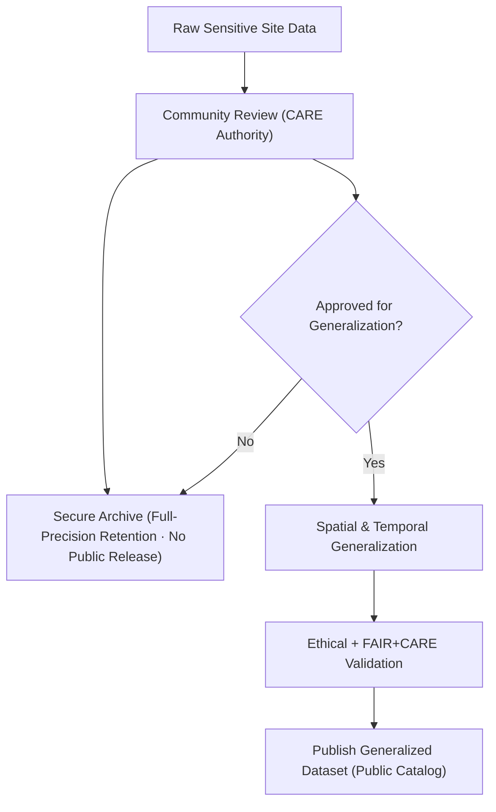

<div align="center">

# 🏺 **Kansas Frontier Matrix — Sensitive Site Data Generalization & CARE Governance Guide**  
`docs/standards/data-generalization/README.md`

**Purpose:**  
Define the **ethical, technical, and procedural framework** for **generalizing sensitive archaeological and Indigenous site data** within the Kansas Frontier Matrix (KFM), in compliance with **FAIR+CARE**, **CIDOC CRM**, and **DCAT 3.0**.  
Ensures transparent governance, community authority, and sustainable open data release under **MCP-DL v6.3**.

[](../../../docs/README.md)
[](../../../LICENSE)
[](../faircare.md)
[](../../../releases/v10.2.0/)
</div>

---

## 📘 Overview

This guide specifies **data governance and masking protocols** for publishing archaeological, ecological, or Indigenous datasets where **spatial or temporal precision** may endanger cultural resources, community sovereignty, or privacy.  
It implements the **CARE Principles** (Collective Benefit, Authority to Control, Responsibility, Ethics) alongside **FAIR** principles to ensure datasets are:

- Scientifically useful yet **culturally respectful**  
- Open where appropriate, **restricted where necessary**  
- Governed by **community authority** and Council oversight  

---

## 🗂️ Directory Layout

```plaintext
docs/standards/data-generalization/
├── README.md                   # Core governance and methodology guide
├── examples/                   # JSON, YAML, and DCAT examples
├── validation/                 # FAIR+CARE compliance reports and audits
├── governance/                 # Oversight policies, MOUs, and council resolutions
└── templates/                  # Metadata, anonymization, and masking templates
```

---

## 🧾 Spatial & Temporal Generalization Techniques

| Technique | Description | Example |
|---|---|---|
| **Coordinate Rounding** | Round coordinates to reduce spatial precision. | `38.913, -95.258 → 38.91, -95.26` |
| **Grid Aggregation** | Aggregate points to coarse grid centroids. | 1 × 1 km or 10 × 10 km cells |
| **Random Masking** | Apply random offset within a defined buffer. | ± 2 km within safe radius |
| **Temporal Aggregation** | Replace exact dates with ranges or eras. | `"1870s"` or `"1850–1900 CE"` |
| **Site Suppression** | Withhold coordinates entirely for sacred/restricted sites. | `"Location withheld"` |
| **Attribute Suppression** | Remove sensitive attributes (names, rituals). | `person_name`, `ceremony_type` removed |

> Always use the **least intrusive method** sufficient to protect sensitive information, and **prioritize tribal/community consent over publication precision**.

---

## ⚙️ Metadata & Governance Fields

Sensitive datasets must include explicit governance metadata.

| Field | Purpose | Example |
|---|---|---|
| `sensitivity_class` | Risk level of cultural exposure. | `"High"` |
| `authority_to_control` | CARE authority or community steward. | `"Prairie Band Potawatomi Nation"` |
| `access_policy` | Access and reuse constraints. | `"Restricted by MOU; contact tribal office."` |
| `ethics_statement` | Ethical clearance or CARE review summary. | `"Released under tribal oversight and Council review."` |
| `data_steward` | Internal custodian within KFM. | `"KFM Heritage Data Council"` |
| `review_cycle` | Frequency of ethical audit. | `"Annual / FAIR+CARE Council"` |

These fields complement license and CARE blocks defined in data contracts.

---

## 🧩 FAIR+CARE Integration Checklist

| Principle | Implementation in KFM |
|---|---|
| **Collective Benefit** | Data release must demonstrate tangible benefit (education, protection, stewardship) to originating communities. |
| **Authority to Control** | Indigenous/community partners control visibility, granularity, and downstream reuse. |
| **Responsibility** | All decisions and consent forms recorded in the Governance Ledger. |
| **Ethics** | Data released only after joint review by the FAIR+CARE Council and relevant community authorities. |

All sensitive site workflows must reference [`faircare.md`](../faircare.md) and [`governance/ROOT-GOVERNANCE.md`](../governance/ROOT-GOVERNANCE.md).

---

## 🧾 Example Metadata Record (DCAT 3.0 + CARE Alignment)

```json
{
  "@context": "https://www.w3.org/ns/dcat3.jsonld",
  "id": "kfm-sensitive-site-0001",
  "type": "Dataset",
  "title": "Generalized Indigenous Archaeological Sites of Northeast Kansas",
  "description": "Spatially generalized dataset representing culturally sensitive sites, created under FAIR+CARE governance.",
  "theme": ["Archaeology", "Cultural Heritage"],
  "spatialResolutionInMeters": 1000,
  "temporalResolution": "10 years",
  "sensitivityClass": "High",
  "authorityToControl": {
    "name": "Prairie Band Potawatomi Nation Heritage Department",
    "contactPoint": "heritage@pbpn.gov"
  },
  "accessLevel": "restricted",
  "license": "CC BY-NC 4.0",
  "ethicsStatement": "Released under community review and CARE governance.",
  "care": {
    "status": "approved",
    "statement": "All site locations generalized to ≥1 km and cross-checked with tribal authorities.",
    "reviewer": "FAIR+CARE Council",
    "date_reviewed": "2025-11-01"
  }
}
```

---

## ⚙️ Workflow → Ethical Data Handling



- **Raw Data (A)** may remain in encrypted, access-controlled storage.  
- **Secure Archive (F)** retains full-precision data only under agreed terms.  
- **Public Catalog (G)** exposes only generalized representations.

---

## ⚖️ Governance Integration

All sensitive-site workflows must adhere to:

- **Root Governance Charter:** `docs/standards/governance/ROOT-GOVERNANCE.md`  
- **FAIR+CARE Framework:** `docs/standards/faircare.md`  
- **Data Contracts:** `docs/standards/data-contracts.md`

Every generalized data release must include:

1. **Signed MOU or data-sharing agreement** with community/tribal authority.  
2. **Ethical clearance statement** with CARE metadata and dataset checksum.  
3. **Governance ledger entry** linking to validation artefacts and telemetry.

---

## 🔐 Access Policies & Distribution

| Access Level | Description | Example Handling |
|---|---|---|
| `public` | Fully open, generalized data; no site-level risk. | Published via STAC/DCAT; shown in public maps. |
| `restricted` | Requires authentication/approval; high sensitivity. | Access via secure endpoints, only to approved users. |
| `withheld` | Not released; may exist only in secure archive. | Listed in governance records but not exposed as a dataset. |

When in doubt, default to **more restrictive** access until Council and community approvals are obtained.

---

## ♿ Accessibility & CARE Notes

- Public maps must **mask** or **coarsen** coordinates for high-risk sites.  
- Include **land acknowledgment** or contextual statements where relevant.  
- Documentation must clearly describe any generalization and its rationale.  
- Respect **Indigenous data sovereignty** — sharing is **opt-in**, never assumed.

---

## 🧪 Validation & Telemetry

Sensitive site generalization is tracked through:

- `faircare-validate.yml` → CARE status + ethics checks (`reports/fair/faircare_summary.json`)  
- `stac-validate.yml` → STAC/DCAT assets must reflect generalized geometry and access level.  
- `telemetry-export.yml` → Governance & sustainability metrics written into `releases/v10.2.0/focus-telemetry.json`.

Telemetry may include:

```json
{
  "event_type": "sensitive_site_generalization",
  "datasets_generalized": 12,
  "care_restricted": 4,
  "energy_wh": 3.4,
  "timestamp": "2025-11-12T21:00:00Z"
}
```

---

## 🕰️ Version History

| Version | Date | Author | Summary |
|---|---|---|---|
| v10.2.2 | 2025-11-12 | FAIR+CARE Council | Updated telemetry/SBOM/manifest paths to v10.2.0; clarified DCAT/CARE example and workflow diagram; emphasized opt-in sharing. |
| v10.0.0 | 2025-11-09 | FAIR+CARE Council | Introduced metadata schema, CIDOC/DCAT mapping, and CARE validation flow for generalized sensitive sites. |
| v9.7.0 | 2025-11-09 | FAIR+CARE Council | Initial release aligned with FAIR+CARE and CIDOC CRM. |

---

<div align="center">

**© 2025 Kansas Frontier Matrix Project — CC BY-NC 4.0**  
Master Coder Protocol v6.3 · FAIR+CARE Certified · Diamond⁹ Ω / Crown∞Ω Ultimate Certified  

[Back to Standards Index](../../README.md) · [Governance Charter](../../../docs/standards/governance/ROOT-GOVERNANCE.md)

</div>