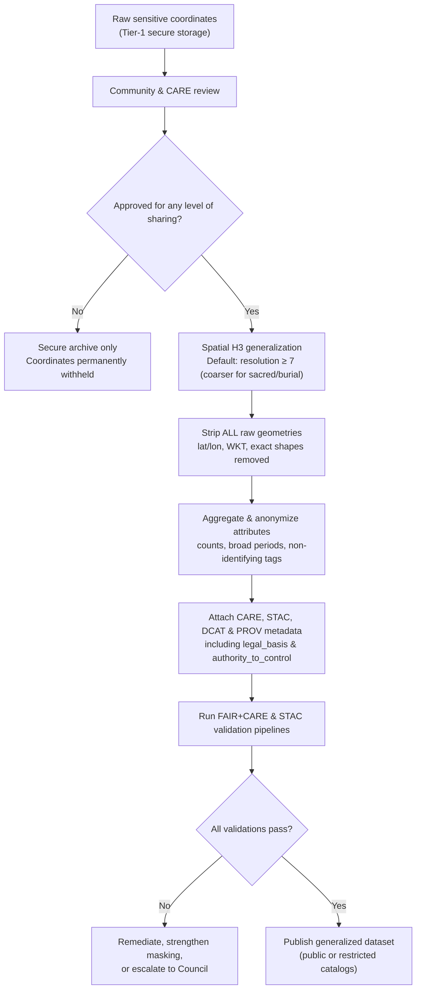

<div align="center">

# 🏺 **Kansas Frontier Matrix — Sensitive Site Data Generalization & CARE Governance Guide**  
`docs/standards/data-generalization/README.md`  

**Diamond⁹ Ω / Crown∞Ω Ultimate Certified**

**Purpose**  
Define the **ethical, spatial, temporal, and governance framework** required to safely generalize or conceal **archaeological, Indigenous, ecological, and culturally sensitive site data** within KFM.  
Implements unified KFM v11 protocols — **FAIR+CARE**, **KFM‑MDP v11.2.4**, **STAC/DCAT 3.0**, **CIDOC‑CRM**, **GeoSPARQL**, **OWL‑Time**, **ISO 19115**, **ISO 25012**, and **MCP‑DL v6.3** — ensuring respectful, sovereign, and sustainable handling of sensitive geospatial data.

</div>

---

## 📘 Overview

Sensitive-site data represents locations, attributes, and narratives that—if disclosed precisely—could risk:

- Damage, looting, vandalism, or trespass.  
- Violations of tribal/Indigenous sovereignty and cultural protocols.  
- Exposure of confidential ceremonial or spiritual knowledge.  
- Ecological harm to fragile habitats and endangered species.  
- Erosion of community trust and collaborative relationships.  

This guide establishes the **mandatory generalization and governance rules** for publishing any dataset containing sensitive or potentially sensitive locations, including:

- Archaeological sites (pre‑contact, historic, or modern).  
- Burial sites and cemeteries.  
- Tribal/Indigenous cultural or ceremonial locations.  
- Rare ecological or endangered-species habitats.  
- Water sources or hydrologic features of cultural importance.  

KFM’s approach harmonizes:

- **Spatial generalization** (H3, aggregation, concealment).  
- **Temporal generalization** (ranges instead of exact timestamps).  
- **Attribute suppression** (names, ritual descriptions, explicit references).  
- **CARE governance** (Authority to Control, Ethics, collective benefit).  
- **Metadata contracts** (STAC/DCAT/ISO 19115).  
- **Strict CI enforcement** to prevent accidental disclosure.  

When technical convenience conflicts with sovereignty, safety, or community trust, **sovereignty and safety win**.

---

## 🗂️ Directory Layout

```text
📂 docs/
└── 📂 standards/
    ├── 📂 data-generalization/
    │   📄 README.md          # 🏺 Sensitive-site data generalization & CARE governance (this file)
    │   📂 examples/          # Example JSON, DCAT, STAC, and data contracts
    │   📂 validation/        # FAIR+CARE audits, schema outputs, CI reports
    │   📂 governance/        # MOUs, Council decisions, approvals (often restricted)
    │   📂 templates/         # Masking templates, H3 configs, metadata snippets
    ├── 📂 geo/
    │   📄 archaeology-sensitive-locations.md   # 🛡 Archaeology & Indigenous sensitivity (geo-specific)
    │   📄 geoprivacy-masking/README.md         # 🛡 Geoprivacy & donut masking (location-focused)
    └── 📂 governance/
        📄 ROOT-GOVERNANCE.md  # ⚖ Root governance charter
```

Author rules:

- Any new file under `data-generalization/` must explicitly reference this README as the governing standard.  
- Examples and templates must be consistent with KFM‑MDP v11.2.4 and this governance guide.  
- `governance/` materials under this directory are **restricted** and must follow repo access‑control policies.

---

## 🧭 Context

This governance standard sits at the intersection of:

- **Geo standards** — CRS, vertical, tiling, STAC (`docs/standards/geo/*.md`).  
- **Geoprivacy & masking** — deterministic donut masking and H3 generalization for locations.  
- **Heritage & sovereignty** — archaeology and Indigenous sensitive‑locations standard.  
- **FAIR+CARE & sovereignty policies** — ethical obligations and community authority.  
- **Data contracts** — enforceable metadata agreements for all datasets.  

In the KFM pipeline:

> Ingest → Sensitive review → Spatial/temporal generalization → Data contracts + STAC/DCAT → Graph → APIs → Frontend, Story Nodes, Focus Mode

this document defines **when**, **how**, and **whether** sensitive content proceeds beyond secure storage.

---

## 📦 Data & Metadata

### 1. Definitions & Scope

**Sensitive site data** includes (but is not limited to):

- Any explicit or implicit coordinates of known or suspected archaeological features.  
- Burial grounds, cemeteries, and associated features.  
- Sites identified by tribal/Indigenous communities as sacred, ceremonial, or culturally sensitive.  
- Locations whose disclosure could enable looting, desecration, or cultural harm.  
- Ecological sites whose exploitation risk is amplified by geospatial precision (e.g., rare species nest sites).  

If there is **any doubt** about sensitivity or risk, data **must be treated as sensitive** until reviewed by:

- The FAIR+CARE Council, and  
- Relevant tribal/Indigenous or community authorities.

### 2. Required Generalization Techniques (Summary)

| Technique                 | Description                                       | KFM Requirement                                                   |
|--------------------------|---------------------------------------------------|-------------------------------------------------------------------|
| **H3 Generalization**    | Represent locations as H3 hex cells, not points.  | Default ≥ r7; coarser for sacred/burial sites (e.g., r5–r4).      |
| **Coordinate Removal**   | Remove all raw coordinates & explicit geometry.   | Required for any dataset leaving secure Tier‑1 archive.           |
| **Grid Aggregation**     | Aggregate counts/attributes into cells.           | Allowed for statistical/ecological rollups with k‑anonymity.      |
| **Temporal Aggregation** | Replace precise timestamps with ranges/periods.   | Required for ceremonial/seasonal or event‑sensitive features.     |
| **Attribute Suppression**| Remove or generalize names and explicit details.  | Mandatory for culturally explicit or exploitable attributes.      |
| **Complete Concealment** | Withhold location entirely (no public geometry).  | Mandatory for sacred, burial, or embargoed sites unless opted‑in. |

**Default rule:**  
If uncertainty exists → apply the **strongest plausible masking or concealment**.

---

### 3. Required Metadata Fields (Data Contracts + STAC/DCAT)

Every generalized sensitive dataset must:

- Have a **data contract** complying with `../data-contracts.md`.  
- Include explicit **CARE** and **generalization** metadata.

#### 3.1 CARE & Governance Block (Data Contract)

```json
{
  "care": {
    "status": "approved | restricted | withheld",
    "authority_to_control": "Prairie Band Potawatomi Nation",
    "reviewer": "FAIR+CARE Heritage Council",
    "review_date": "2025-11-12",
    "statement": "Generalization applied at ≥1 km; raw data withheld.",
    "notes": "Community-led masking decisions; burial features concealed."
  }
}
```

#### 3.2 STAC Properties (Sensitive Items)

```json
{
  "kfm:h3_generalization": true,
  "kfm:h3_resolution": 7,
  "kfm:coordinates_removed": true,
  "kfm:legal_basis": "NHPA §304; Tribal MOU; FAIR+CARE Council decision #2025-10-12",
  "kfm:care_status": "restricted",
  "kfm:sensitivity_level": "high"
}
```

These complement `heritage:*` and `care:*` fields defined in archaeology/geoprivacy standards.

#### 3.3 DCAT Properties (Catalog-Level)

```json
{
  "dct:accessLevel": "restricted",
  "dct:provenance": "Generalized from protected raw coordinates maintained in secure Tier-1 archive.",
  "dct:rights": "Subject to tribal authority and FAIR+CARE governance.",
  "dcat:spatialResolutionInMeters": 5000
}
```

Values must reflect the **coarsest** actual detail usable from the dataset, not internal raw resolutions.

---

### 4. Example Generalized Dataset Entry (KFM-Compliant)

```json
{
  "id": "kfm-arch-gen-2025-01",
  "title": "Generalized Archaeological Features — Northeast Kansas",
  "description": "Culturally sensitive archaeological features generalized to H3 r7 to protect sites while supporting high-level research and education.",
  "type": "vector",
  "spatial": [-96.5, 39.0, -95.0, 40.0],
  "temporal": {
    "start": "1400-01-01T00:00:00Z",
    "end": "1700-12-31T23:59:59Z"
  },
  "h3_resolution": 7,
  "h3_id": "8728308ffffff",
  "site_count": 5,
  "periods": ["Great Bend Aspect"],
  "license": "CC-BY-NC 4.0",
  "provenance": "Derived from protected feature coordinates maintained in Tier-1 secure archive.",
  "lineage": "H3 generalization pipeline v2.1; raw coordinates removed per FAIR+CARE decision #2025-10-02.",
  "care": {
    "status": "approved",
    "authority_to_control": "Ioway Tribal Historic Preservation Office",
    "reviewer": "FAIR+CARE Heritage Council",
    "statement": "Generalization to H3 r7 judged sufficient to protect sites while enabling coarse-scale visualization.",
    "review_date": "2025-11-10",
    "notes": "Burial sites withheld entirely; no explicit references to ceremonial functions."
  },
  "updated": "2025-11-12T00:00:00Z"
}
```

---

## 🌐 STAC, DCAT & PROV Alignment

This guide extends the STAC/PROV work in the geo standards.

### 1. STAC

- Sensitive STAC Items must carry:

  - `heritage:*` and `care:*` fields from the archaeology standard.  
  - `kfm:h3_generalization`, `kfm:h3_resolution`, `kfm:coordinates_removed`, and `kfm:care_status`.  

- STAC Collections describing sensitive catalogs must indicate:

  - Restricted access,  
  - Coarsened spatial resolution, and  
  - Presence of generalized/withheld locations.

### 2. DCAT

- DCAT datasets must use:

  - `dct:accessLevel = "restricted"` or stricter for sensitive sets.  
  - `dct:provenance` to document generalization and withholding.  
  - `dct:rights` to reference tribal authority, MOUs, and CARE policies.

### 3. PROV‑O

Every generalization pipeline run (including decisions to withhold) must record:

```text
prov:used            → raw sensitive entities (vault references only)
prov:activity        → "sensitive-site-generalization-v11"
prov:wasGeneratedBy  → KFM masking/generalization tool + version
prov:generatedAtTime → timestamp
prov:wasAssociatedWith → FAIR+CARE-governed ETL agent
```

If data is withheld completely, a PROV activity still records that the decision occurred, without exposing raw content.

---

## 🧱 Architecture

### 1. Standardized H3 Generalization Workflow



- For **most sensitive categories** (sacred, burial), the workflow will end at **X** (withheld) or use extremely coarse region‑level representation (no map tile exposure).

### 2. Relationship to Geoprivacy Masking

- **Geoprivacy masking** (donut geomasking) in the geo standards primarily protects **point locations** exposed as map features.  
- This **data‑generalization guide** operates at a **dataset and governance level**, including:

  - Dataset may never leave secure storage.  
  - Dataset may be generalized to H3 cells or polygons only.  
  - Dataset may be replaced entirely with narrative summaries instead of geospatial features.

Both standards must be applied together when:

- Sensitive sites are represented both as raw coordinates in ETL and as map layers in MapLibre/Cesium.  

The stricter rule always wins.

---

## 🧠 Story Node & Focus Mode Integration

Story Nodes and Focus Mode interact with this standard as follows:

- Story Nodes representing sensitive topics:

  - Must reference generalized geometries (H3, regions) or **no geometry at all** for highly sensitive sites.  
  - Must not contain raw coordinates, directions, or clues that materially enable site discovery.  

- Focus Mode:

  - Must obey `ai_focusmode_usage: "Restricted / Governance-Only"`.  
  - May summarize this document and applicable data contracts for governance review.  
  - Must not “fill in” missing detail or speculate about exact locations or rituals.  

Recommended language for generalized narratives:

> “Locations and details in this area have been generalized or omitted at the request of source communities and for the protection of sensitive cultural and ecological sites.”

If Focus Mode detects conflicting instructions (e.g., data suggests precision but metadata indicates high sensitivity), it must **side with the more restrictive rule** and flag the inconsistency to maintainers.

---

## 🧪 Validation & CI/CD

The following checks (or equivalents) must run on any dataset flagged as sensitive:

| Profile / Job              | Purpose                                                         |
|----------------------------|-----------------------------------------------------------------|
| `markdown-lint`            | Enforce KFM‑MDP v11.2.4 layout and heading rules.               |
| `schema-lint`              | Validate data contracts and STAC/DCAT JSON against schemas.    |
| `metadata-check`           | Verify CARE, sensitivity, and generalization metadata present. |
| `diagram-check`            | Validate Mermaid diagrams (where present) for syntax.          |
| `accessibility-check`      | Check docs/legends for basic a11y (e.g., color explanations).  |
| `provenance-check`         | Confirm PROV‑O records exist for generalization and withholding.|
| `footer-check`             | Ensure governance links and version history sections exist.    |
| `sensitivity-check`        | Verify no raw coordinates, exact geometries, or forbidden fields leak into public outputs. |

A PR is **blocked** if:

- Raw coordinates or highly precise geometries appear in any public STAC/DCAT/UI artifact.  
- CARE block is missing or incomplete in data contracts.  
- H3 resolution is finer than allowed for the sensitivity category without explicit Council + tribal authorization.  
- Geoprivacy masking and generalization metadata are inconsistent.  
- Story Node or Focus Mode assets attempt to embed sensitive details in violation of this guide.

---

## ⚖ FAIR+CARE & Governance

This document is a **governance standard** and must be interpreted through FAIR+CARE:

- **FAIR**

  - *Findable*: Sensitive datasets are discoverable at coarse descriptions but not exploitable.  
  - *Accessible*: Access levels and rights are clearly stated; restricted does not mean invisible.  
  - *Interoperable*: STAC/DCAT/PROV encoding of sensitivity and generalization is standards‑aligned.  
  - *Reusable*: Derived generalized products can be reused without re‑exposing hidden details.

- **CARE**

  - *Collective Benefit*: Data use must serve community benefit or at least avoid harm.  
  - *Authority to Control*: Communities decide what is shown, how, and at what detail.  
  - *Responsibility*: KFM teams must proactively design for protection, not just compliance.  
  - *Ethics*: When in doubt, protect sites and people, even if this means reducing or withdrawing datasets.

Governance hooks:

- All exceptions (e.g., finer than default H3 resolution, partial disclosure of sacred areas) must:

  - Be reviewed by FAIR+CARE Council.  
  - Have explicit community/tribal authorization.  
  - Be recorded in the governance ledger with clear rationale.

---

## 🕰️ Version History

| Version | Date       | Status            | Summary                                                                                                   |
|--------:|------------|-------------------|-----------------------------------------------------------------------------------------------------------|
| v11.0.0 | 2025-12-06 | Active / Enforced | Upgraded to KFM‑MDP v11.2.4; aligned with geo/geoprivacy standards, STAC/DCAT/PROV profiles, and CI hooks.|
| v10.4.0 | 2025-11-20 | Superseded        | KFM‑MDP v10.4 alignment; STAC/DCAT integration; governance ledger rules and default H3 masking.          |

---

<div align="center">

🏺 **Kansas Frontier Matrix — Sensitive Site Data Generalization & CARE Governance Guide (v11.0.0)**  
“When in doubt, protect the people and the place.”

CC‑BY‑NC 4.0 · FAIR+CARE Council · MCP‑DL v6.3  

[⬅ Back to Standards Index](../../README.md) · [⚖ Root Governance Charter](../governance/ROOT-GOVERNANCE.md) · [📘 KFM Markdown Protocol v11.2.4](../kfm_markdown_protocol_v11.2.4.md)

</div>
