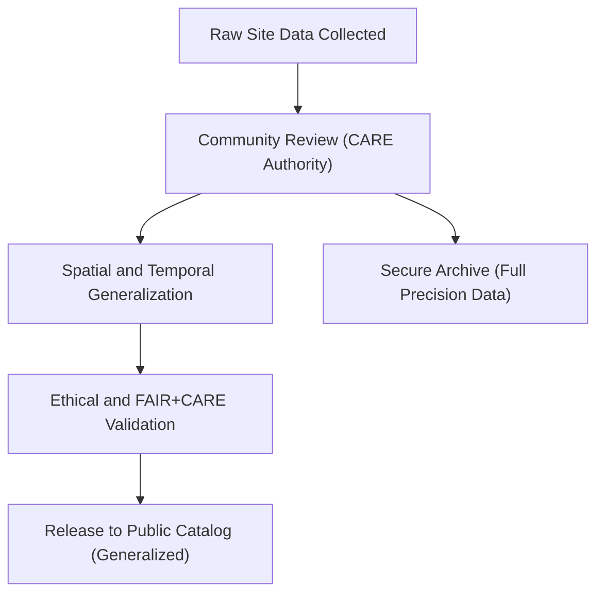

<div align="center">

# 🏺 **Kansas Frontier Matrix — Sensitive Site Data Generalization & CARE Governance Guide**
`docs/standards/data-generalization/README.md`

**Purpose:**  
Define the ethical, technical, and governance framework for **generalizing sensitive archaeological and Indigenous site data** within the Kansas Frontier Matrix (KFM), ensuring alignment with **FAIR+CARE**, **CIDOC CRM**, and **DCAT 3.0** standards.

[](../../../docs/)
[](../../../LICENSE)
[](https://www.gida-global.org/care)
[](../../../releases/v9.7.0/)
</div>

---

## 📘 Overview

This guide establishes **data-handling protocols** for publishing archaeological and Indigenous datasets where **location or temporal specificity** may pose risks to cultural sites, artifacts, or community sovereignty.  
It integrates **CARE Principles** (Collective Benefit, Authority to Control, Responsibility, Ethics) with **FAIR Data** best practices to create a sustainable, respectful open data framework.

---

## 🗂️ Directory Layout

```
docs/standards/data-generalization/
├── README.md                   # Main governance and methodology guide
├── examples/                   # JSON, YAML, and DCAT examples for sensitive data
├── validation/                 # FAIR+CARE compliance validation reports
├── governance/                 # Community review policies and access agreements
└── templates/                  # Metadata and masking templates
```

---

## 🧾 Spatial and Temporal Generalization

| Technique | Description | Example |
|------------|--------------|----------|
| Coordinate Rounding | Round coordinates to 3 decimals (≈ 100 m). | `38.913, -95.258 → 38.91, -95.26` |
| Grid Aggregation | Replace precise points with centroids. | 1 × 1 km or 10 × 10 km cell |
| Random Masking | Apply randomized offset within buffer radius. | ± 2 km displacement |
| Temporal Aggregation | Report year or decade instead of date. | “1870s” or “1850–1900 CE” |
| Site Suppression | Remove coordinates for sacred sites. | “Location withheld” |

---

## ⚙️ Metadata & Governance Fields

| Field | Purpose | Example |
|--------|----------|----------|
| `sensitivity_class` | Risk tier for cultural exposure. | “High” |
| `authority_to_control` | Identifies CARE governance entity. | “Prairie Band Potawatomi Nation” |
| `access_policy` | Defines access and reuse permissions. | “Restricted by MOU” |
| `ethics_statement` | Notes ethical clearance and CARE alignment. | “Released under tribal approval.” |
| `data_steward` | Responsible KFM custodian. | “KFM Heritage Data Council” |

---

## 🧩 FAIR+CARE Integration Checklist

| Principle | Implementation in KFM |
|------------|-----------------------|
| **Collective Benefit** | Datasets yield social, cultural, or ecological value for the originating community. |
| **Authority to Control** | Indigenous partners approve governance, visibility, and sharing levels. |
| **Responsibility** | KFM logs provenance, access, and consent via governance ledger. |
| **Ethics** | Data publication reviewed by FAIR+CARE Council and cultural representatives. |

---

## 🧩 Example Metadata Record (DCAT 3.0 + FAIR+CARE)

```json
{
  "@context": "https://www.w3.org/ns/dcat3.jsonld",
  "id": "kfm-sensitive-site-0001",
  "type": "Dataset",
  "title": "Generalized Indigenous Archaeological Sites of NE Kansas",
  "description": "Spatially generalized dataset representing sites with cultural sensitivity, aligned to CARE principles.",
  "theme": ["Archaeology", "Cultural Heritage"],
  "spatialResolutionInMeters": 1000,
  "temporalResolution": "10 years",
  "sensitivityClass": "High",
  "authorityToControl": {
    "name": "Prairie Band Potawatomi Nation Heritage Department",
    "contactPoint": "heritage@pbpn.gov"
  },
  "accessLevel": "restricted",
  "license": "CC BY-NC 4.0",
  "ethicsStatement": "Released under community oversight; FAIR+CARE compliant"
}
```

---

## ⚙️ Workflow → Ethical Data Handling



---

## ⚖️ Governance Integration

All data workflows in this directory must reference:
- **Governance Ledger:** `docs/standards/governance/DATA-GOVERNANCE.md`
- **Cultural Oversight Council:** `docs/standards/governance/FAIRCARE-COUNCIL.md`
- **Validation Reports:** `reports/faircare/` and `reports/audit/`

Every release shall include:
- Ethical clearance statement.
- Signed community data-sharing agreement (MOU).
- Validation traceability checksum and ledger entry.

---

## 🕰️ Version History

| Version | Date | Author | Summary |
|----------|------|--------|----------|
| v9.7.0 | 2025-11-09 | FAIR+CARE Council | Initial alignment with FAIR+CARE, CIDOC CRM, and DCAT 3.0. |

---

<div align="center">

© 2025 Kansas Frontier Matrix · Master Coder Protocol v6.3 · FAIR+CARE Certified · Diamond⁹ Ω / Crown∞Ω Ultimate Certified  
[Back to Standards Index](../../README.md) · [Governance Charter](../../../docs/standards/governance/ROOT-GOVERNANCE.md)

</div>
