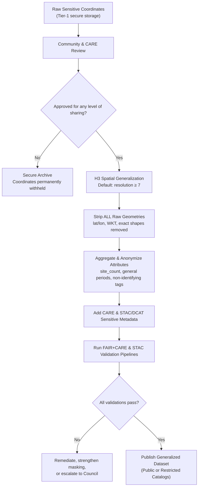

<div align="center">

# 🏺 **Kansas Frontier Matrix — Sensitive Site Data Generalization & CARE Governance Guide**  
`docs/standards/data-generalization/README.md`  

**Diamond⁹ Ω / Crown∞Ω Ultimate Certified**

**Purpose:**  
Define the **ethical, spatial, temporal, and governance framework** required to safely generalize or conceal **archaeological, Indigenous, ecological, and culturally sensitive site data** within KFM.  
Implements unified KFM v11 protocols: **FAIR+CARE**, **KFM-MDP v11.0.0**, **STAC/DCAT 3.0**, **CIDOC-CRM**, **ISO 19115**, **GeoSPARQL**, **OWL-Time**, **ISO 25012**, and **MCP-DL v6.3**—ensuring respectful, sovereign, and sustainable handling of sensitive geospatial data.

[](../../README.md)  
[]()  
[](../../../LICENSE)  
[](../faircare.md)  
[](#)

</div>

---

## 📘 Overview

Sensitive-site data represents locations, attributes, and narratives that—if disclosed precisely—could risk:

- Damage, looting, vandalism, or trespass  
- Violations of tribal/Indigenous sovereignty and cultural protocols  
- Exposure of confidential ceremonial or spiritual knowledge  
- Ecological harm to fragile habitats and endangered species  
- Erosion of community trust and collaborative relationships  

This guide establishes the **mandatory generalization and governance rules** for publishing ANY dataset containing sensitive or potentially sensitive locations, including:

- Archaeological sites (pre-contact, historic, or modern)  
- Burial sites and cemeteries  
- Tribal/Indigenous cultural or ceremonial locations  
- Rare ecological or endangered-species habitats  
- Water sources or hydrologic features of cultural importance  

The KFM approach harmonizes:

- **Spatial generalization** (H3, aggregation, concealment)  
- **Temporal generalization** (ranges instead of exact timestamps)  
- **Attribute suppression** (names, ritual descriptions, explicit references)  
- **CARE governance** (Authority to Control, Ethics, collective benefit)  
- **Metadata contracts** (STAC/DCAT/ISO 19115)  
- **Strict CI enforcement** to prevent accidental disclosure  

KFM **never** trades sovereignty, safety, or community trust for technical completeness.

---

## 🗂️ Directory Layout

```text
docs/
└── standards/
    └── data-generalization/
        ├── README.md                         # ← Core governance + generalization protocol
        ├── examples/                         # Example JSON, DCAT, STAC Items
        ├── validation/                       # FAIR+CARE audits, schema outputs
        ├── governance/                       # MOUs, Council decisions, approvals (often restricted)
        └── templates/                        # Masking templates, metadata templates, H3 configs
```

All additional files in this directory MUST:

- Reference this README as the governing standard.  
- Be documented and structured according to `markdown_rules.md` and `kfm_markdown_protocol_v11.md`.  
- Respect `Restricted / High-Sensitivity` classification and appropriate repository/file access controls.

---

## 🧩 Sensitive Data Generalization Framework

### 🧭 1. Definitions & Scope

**Sensitive site data** includes (but is not limited to):

- Any explicit or implicit coordinates of known or suspected archaeological features.  
- Burial grounds, cemeteries, and associated features.  
- Sites identified by tribal/Indigenous communities as sacred, ceremonial, or culturally sensitive.  
- Locations whose disclosure could enable looting, desecration, or cultural harm.  
- Ecological sites whose exploitation risk is amplified by geospatial precision (e.g., rare species nest sites).  

When there is **any doubt** about sensitivity or risk, data MUST be treated as sensitive until reviewed by:

- The FAIR+CARE Council, and  
- Relevant tribal/Indigenous or community authorities.

---

### 🧱 2. Required Generalization Techniques

| Technique                 | Description                                       | KFM Requirement                                        |
|--------------------------|---------------------------------------------------|--------------------------------------------------------|
| **H3 Generalization**    | Represent locations as H3 hex cells, not points.  | **Default:** `res ≥ 7`; stricter (coarser) for sacred/burial sites. |
| **Coordinate Removal**   | Remove all raw coordinates & explicit geometry.   | Required for any dataset leaving the secure Tier-1 archive. |
| **Grid Aggregation**     | Aggregate counts/attributes into grid cells.       | Allowed for statistical/ecological/demographic rollups. |
| **Temporal Aggregation** | Replace precise timestamps with ranges/periods.   | Required for ceremonial or seasonally sensitive features. |
| **Attribute Suppression**| Remove or generalize names and explicit references.| Mandatory where culturally explicit or exploitable.    |
| **Complete Concealment** | Withhold location entirely (no geometry in public). | Mandatory for sacred, burial, or embargoed sites.      |

**Default Rule:**  
If uncertainty exists → **apply the strongest plausible masking or concealment.**

---

## 🛡 CARE Governance Requirements

KFM is bound by the **CARE Principles**:

- **Collective Benefit** — Data MUST produce collective benefit or at minimum do no harm.  
- **Authority to Control** — Communities retain authority over what is shared, at what precision, and when.  
- **Responsibility** — KFM MUST design for protection, not merely compliance.  
- **Ethics** — Ethical review and community input override technical considerations.

### 🔥 Non-Negotiable Rules

1. **Raw coordinates for sensitive sites MUST NOT appear in any public-facing dataset, STAC/DCAT record, or UI layer.**  
2. **Any generalization finer than H3 resolution 7 MUST have explicit tribal/Indigenous authority and FAIR+CARE Council approval.**  
3. **Sacred, burial, ceremonial, or embargoed sites MUST be concealed from public geometries and from any inferences that would reveal their location.**  
4. **All sensitive datasets MUST include a fully populated CARE block in their data contract.**  
5. **Sensitive data may be withheld entirely; non-publication is always an acceptable outcome if required by communities.**

---

## 📦 Required Metadata Fields (Data Contracts + STAC/DCAT)

Every generalized sensitive dataset MUST:

- Have a **data contract** complying with `docs/standards/data-contracts.md`.  
- Provide extended CARE and generalization metadata.

### 🔐 CARE & Governance Block (in Data Contract)

```json
{
  "care": {
    "status": "approved | restricted | withheld",
    "authority_to_control": "Prairie Band Potawatomi Nation",
    "reviewer": "FAIR+CARE Heritage Council",
    "review_date": "2025-11-12",
    "statement": "Generalization applied at ≥1 km; raw data withheld.",
    "notes": "Community-led masking decisions; burial features concealed."
  }
}
```

### 🛰 STAC Properties (Required for Sensitive Items)

```json
{
  "kfm:h3_generalization": true,
  "kfm:h3_resolution": 7,
  "kfm:coordinates_removed": true,
  "kfm:legal_basis": "NHPA §304; Tribal MOU; FAIR+CARE Council decision #2025-10-12",
  "kfm:care_status": "restricted",
  "kfm:sensitivity_level": "high"
}
```

### 📚 DCAT Properties (Catalog-Level)

```json
{
  "dct:accessLevel": "restricted",
  "dct:provenance": "Generalized from protected raw coordinates; raw data withheld.",
  "dct:rights": "Subject to tribal authority and CARE governance.",
  "dcat:spatialResolutionInMeters": 5000
}
```

These fields MUST be present and correct in any STAC/DCAT records that describe sensitive datasets.

---

## 🧱 Standardized H3 Masking Workflow (KFM-Required)



---

## 🧬 Example Generalized Dataset Entry (KFM-Compliant)

```json
{
  "id": "kfm-arch-gen-2025-01",
  "title": "Generalized Archaeological Features — Northeast Kansas",
  "description": "Culturally sensitive archaeological features generalized to H3 r7 to protect sites while supporting high-level research and education.",
  "type": "vector",
  "spatial": [-96.5, 39.0, -95.0, 40.0],
  "temporal": {
    "start": "1400-01-01T00:00:00Z",
    "end": "1700-12-31T23:59:59Z"
  },
  "h3_resolution": 7,
  "h3_id": "8728308ffffff",
  "site_count": 5,
  "periods": ["Great Bend Aspect"],
  "license": "CC-BY-NC 4.0",
  "provenance": "Derived from protected feature coordinates maintained in Tier-1 secure archive.",
  "lineage": "H3 generalization pipeline v2.1; raw coordinates removed per FAIR+CARE decision #2025-10-02.",
  "care": {
    "status": "approved",
    "authority_to_control": "Ioway Tribal Historic Preservation Office",
    "reviewer": "FAIR+CARE Heritage Council",
    "statement": "Generalization to H3 r7 judged sufficient to protect sites while enabling coarse-scale visualization.",
    "review_date": "2025-11-10",
    "notes": "Burial sites withheld entirely; no explicit references to ceremonial functions."
  },
  "updated": "2025-11-12T00:00:00Z"
}
```

---

## ⚙️ Validation & CI Enforcement

Sensitive-site datasets MUST pass all the following CI checks before any external publication or UI integration:

| Validator                    | Purpose                                                          |
|-----------------------------|------------------------------------------------------------------|
| `faircare-validate.yml`     | CARE ethics, sovereignty, and sensitive-field checks             |
| `stac-validate.yml`         | STAC/DCAT structure, required `kfm:*` properties, and contracts  |
| `data-contract-validate.yml`| Ensures metadata contract completeness and JSON schema validity  |
| `telemetry-export.yml`      | Records governance and CI cost metrics for sustainability        |
| `docs-lint.yml`             | Ensures this guide and related docs follow KFM-MDP v11           |

**Any failure MUST block:**

- Publication of datasets to public catalogs or map APIs.  
- Rendering of sensitive layers in public MapLibre/Focus UI.  
- Use of such data in public Story Nodes or Focus Mode narratives.

---

## 🗃 Governance Ledger Requirements

Each sensitive generalization or non-publication decision MUST generate a governance ledger record:

```json
{
  "event_type": "sensitive_site_generalization",
  "dataset_id": "kfm-arch-gen-2025-01",
  "care_status": "approved",
  "authority_to_control": "Prairie Band Potawatomi Nation",
  "resolution": 7,
  "raw_coordinates_removed": true,
  "sacred_sites_excluded": true,
  "timestamp": "2025-11-16T14:20:00Z",
  "review_ref": "council:decision:2025-10-02"
}
```

Ledger location (restricted access):

```text
docs/reports/audit/governance-ledger.json
```

This file is considered **sensitive** and MUST NOT be publicly exposed without appropriate redaction.

---

## 🧭 Accessibility, Ethics & Narrative Requirements

- Public UI maps MUST NOT visually imply precision beyond allowed generalization (e.g., avoid point markers that imply a specific site within a coarse hex).  
- Story Nodes and Focus Mode narratives that reference sensitive sites MUST:

  - Use region/landscape-scale descriptions, not precise locations.  
  - Avoid directions, coordinate hints, or unique descriptive clues that enable site discovery.  
  - Reflect community-approved narratives and language wherever possible.  

- When generalization or concealment has been applied, documentation and UI SHOULD include a simple, respectful statement such as:

  > “Some locations and details have been generalized or omitted at the request of source communities and for the protection of sensitive sites.”

- Where sites are wholly withheld, Story Nodes MAY still cover cultural and historical themes, but MUST NOT be spatially anchored beyond the general region agreed to by communities.

---

## 🧾 Relationship to Data Contracts, STAC/DCAT & Other Standards

This guide:

- **Extends** `docs/standards/data-contracts.md` for sensitive dataset cases.  
- Must be read alongside:

  - `docs/standards/faircare.md` (FAIR+CARE standard)  
  - `docs/standards/kfm_markdown_protocol_v11.md` (Markdown authoring)  
  - `docs/standards/kfm_markdown_protocol_superstandard.md` (Unified KFM-MDP v11)  

All sensitive datasets MUST:

- Have a compliant data contract with CARE block and provenance.  
- Have STAC and/or DCAT representations flagged as `restricted` with spatial resolution and masking information.  
- Carry correct license and CARE status in all metadata layers.

---

## 🕰️ Version History

| Version | Date       | Author             | Summary                                                                                                                                                                |
|--------:|------------|-------------------|------------------------------------------------------------------------------------------------------------------------------------------------------------------------|
| v11.0.0 | 2025-11-20 | FAIR+CARE Council | Upgraded to KFM-MDP v11.0.0; added extended YAML, OWL-Time & GeoSPARQL alignment, stricter CI integration, clarified H3 defaults, and refined CARE & narrative rules. |
| v10.4.0 | 2025-11-16 | FAIR+CARE Council | KFM-MDP v10.4 alignment; STAC/DCAT integration; governance ledger rules, default H3 masking, and CARE governance formalization.                                        |
| v10.2.2 | 2025-11-12 | FAIR+CARE Council | Updated metadata, DCAT, and workflow examples.                                                                                                                        |
| v10.0.0 | 2025-11-09 | FAIR+CARE Council | Added CIDOC CRM linkage, CARE block, and H3 requirements for sensitive cultural data.                                                                                 |
| v9.7.0  | 2025-11-09 | FAIR+CARE Council | Initial sensitive site generalization governance standard.                                                                                                            |

---

<div align="center">

🏺 **Kansas Frontier Matrix — Sensitive Site & CARE Governance**  
“When in doubt, protect the people and the place.”

© 2025 Kansas Frontier Matrix — CC-BY-NC 4.0  
Master Coder Protocol v6.3 · FAIR+CARE Certified · Diamond⁹ Ω / Crown∞Ω Ultimate Certified  

[⬅ Back to Standards Index](../../README.md) · [⚖ Root Governance Charter](../../../docs/standards/governance/ROOT-GOVERNANCE.md)

</div>
