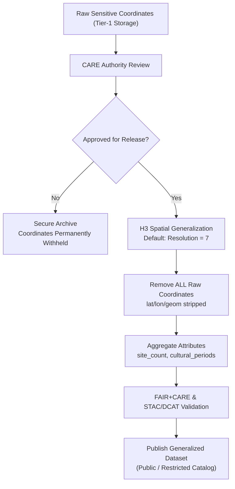

<div align="center">

# 🏺 **Kansas Frontier Matrix — Sensitive Site Data Generalization & CARE Governance Guide**  
`docs/standards/data-generalization/README.md`

**Diamond⁹ Ω / Crown∞Ω Ultimate Certified**

**Purpose:**  
Define the **ethical, spatial, temporal, and governance framework** required to safely generalize **archaeological, Indigenous, ecological, and culturally sensitive site data** within KFM.  
Implements the unified KFM protocols: **FAIR+CARE**, **KFM-MDP v10.4**, **STAC/DCAT 3.0**, **CIDOC-CRM**, **ISO 19115**, **ISO 25012**, and **MCP-DL v6.3**—ensuring respectful, sovereign, and sustainable publication of sensitive geospatial data.

[](#)
[](#)
[](#)
[](#)

</div>

---

# 📘 Overview

Sensitive-site data represents locations, features, and cultural attributes that—if disclosed precisely—could risk:

- Damage or looting  
- Violations of tribal/Indigenous sovereignty  
- Exposure of confidential ceremonial knowledge  
- Ecological resource harm  
- Community trust degradation  

This guide establishes the **required** generalization and governance rules for publishing ANY dataset containing sensitive locations, including:

- Archaeological sites  
- Burial sites  
- Tribal/Indigenous cultural locations  
- Rare ecological or endangered species habitats  
- Water sources or hydrology features of cultural importance  

The system harmonizes **spatial generalization (H3 + masking)** with **ethical governance (CARE)** and **metadata contracts (STAC/DCAT)**.

---

# 🗂️ Directory Layout

````text
docs/
└── standards/
    └── data-generalization/
        |-- README.md                         # Core governance + generalization protocol
        |-- examples/                         # Example JSON, DCAT, STAC Items
        |-- validation/                       # FAIR+CARE audits, schema outputs
        |-- governance/                       # MOUs, Council rulings, approvals
        └-- templates/                        # Masking templates, metadata templates, H3 configs
`````

---

# 🧩 Sensitive Data Generalization Framework

## 🧭 Required Generalization Techniques

| Technique                 | Description                      | KFM Requirement                                  |
| ------------------------- | -------------------------------- | ------------------------------------------------ |
| **H3 Generalization**     | Convert coordinates to hex cells | **Min r7**, stricter for sacred sites            |
| **Coordinate Rounding**   | Decimal truncation               | Only for *non-sensitive* layers                  |
| **Spatial Masking**       | Randomized offsets               | Strictly limited; requires Council approval      |
| **Grid Aggregation**      | Bin features to regular grid     | Allowed for demographic/ecological rollup        |
| **Temporal Aggregation**  | Convert exact dates to ranges    | Required for ceremonial/heritage features        |
| **Attribute Suppression** | Remove names/ritual indicators   | Mandatory where culturally explicit              |
| **Complete Concealment**  | Location withheld                | Mandatory for sacred, burial, or embargoed sites |

**Default Rule:**
If uncertainty exists → **use stronger masking**.

---

# 🛡 CARE Governance Requirements

Every sensitive dataset MUST implement CARE:

| CARE Principle           | Enforcement in KFM                               |
| ------------------------ | ------------------------------------------------ |
| **Collective Benefit**   | Data must serve communities; not exploit them.   |
| **Authority to Control** | Tribal/community permission REQUIRED.            |
| **Responsibility**       | KFM must steward data ethically + transparently. |
| **Ethics**               | Any harmful disclosure → dataset withheld.       |

### 🔥 Non-negotiable Rules

* **Raw coordinates MUST NOT appear in any public dataset.**
* **Generalization BELOW r7 requires Council + tribal sign-off.**
* **Sacred, burial, or ceremonial features MUST be concealed (no geometry).**
* **All sensitive data must include a CARE block (see below).**

---

# 📦 Required Metadata Fields (Data Contracts + STAC/DCAT)

Every generalized dataset MUST include:

## 🔐 CARE & Governance Metadata

```json
{
  "care": {
    "status": "approved | restricted | withheld",
    "authority_to_control": "Prairie Band Potawatomi Nation",
    "reviewer": "FAIR+CARE Heritage Council",
    "review_date": "2025-11-12",
    "statement": "Generalization applied at ≥1 km; raw data withheld.",
    "notes": "Community-led masking decisions."
  }
}
```

## 🧱 STAC Required Properties

```json
{
  "kfm:h3_generalization": true,
  "kfm:h3_resolution": 7,
  "kfm:coordinates_removed": true,
  "kfm:legal_basis": "NHPA §304 · Tribal Data Governance",
  "kfm:care_status": "restricted"
}
```

## 📚 DCAT Required Properties

```json
{
  "dct:accessLevel": "restricted",
  "dct:provenance": "Generalized from protected raw coordinates",
  "dct:rights": "Subject to CARE governance",
  "dcat:spatialResolutionInMeters": 5000
}
```

---

# 🧱 Standardized H3 Masking Workflow (KFM-Required)



---

# 🧬 Example Generalized Dataset Entry (KFM-Compliant)

```json
{
  "id": "kfm-arch-gen-2025-01",
  "title": "Generalized Archaeological Features — Northeast Kansas",
  "description": "Culturally sensitive features generalized to H3 r7 for public safety.",
  "h3_resolution": 7,
  "h3_id": "8728308ffffff",
  "site_count": 5,
  "periods": ["Great Bend Aspect"],
  "care": {
    "status": "approved",
    "authority_to_control": "Ioway Tribal Historic Preservation Office",
    "reviewer": "FAIR+CARE Council",
    "statement": "Generalization sufficient for safe release.",
    "review_date": "2025-11-10"
  },
  "provenance": "Derived from protected coordinates; raw data withheld.",
  "license": "CC BY-NC 4.0"
}
```

---

# ⚙️ Validation & CI Enforcement

All sensitive-site datasets MUST pass:

| Validator                    | Purpose                                        |
| ---------------------------- | ---------------------------------------------- |
| `faircare-validate.yml`      | CARE ethics & sovereignty checks               |
| `stac-validate.yml`          | STAC/DCAT conformance                          |
| `data-contract-validate.yml` | Ensures metadata contract completion           |
| `telemetry-export.yml`       | Tracks governance actions, sustainability load |
| `docs-lint.yml`              | Ensures MDP v10.4-compliant documentation      |

---

# 🗃 Governance Ledger Requirements

A generalized dataset MUST create a ledger entry:

```json
{
  "event_type": "sensitive_site_generalization",
  "dataset_id": "kfm-arch-gen-2025-01",
  "care_status": "approved",
  "authority_to_control": "Prairie Band Potawatomi Nation",
  "resolution": 7,
  "raw_coordinates_removed": true,
  "timestamp": "2025-11-16T14:20:00Z"
}
```

Stored in:

```text
docs/reports/audit/governance-ledger.json
```

---

# 🧭 Accessibility, Ethics & Narrative Requirements

* Public maps must never imply precision finer than allowed by resolution.
* All explanatory text (Focus Mode, Story Nodes) must use **generalized narratives**.
* All cultural content must be reviewed by relevant community authority BEFORE publication.
* All generalized datasets MUST include rationale for generalization.

---

# 🕰 Version History

| Version | Date       | Author                              | Summary                                                                                                                         |
| ------- | ---------- | ----------------------------------- | ------------------------------------------------------------------------------------------------------------------------------- |
| v10.4.0 | 2025-11-16 | FAIR+CARE Council · Lead Programmer | Upgraded to KFM-MDP v10.4, unified with STAC/DCAT v10 standards, added ledger rules, new examples, CARE governance integration. |
| v10.2.2 | 2025-11-12 | FAIR+CARE Council                   | Updated metadata, DCAT, and workflow examples.                                                                                  |
| v10.0.0 | 2025-11-09 | FAIR+CARE Council                   | Added CIDOC, CARE, and H3 requirements.                                                                                         |
| v9.7.0  | 2025-11-09 | FAIR+CARE Council                   | Initial release.                                                                                                                |

---

<div align="center">

**© 2025 Kansas Frontier Matrix — CC BY-NC 4.0**
Governed under **Master Coder Protocol v6.3** · FAIR+CARE Certified
**Diamond⁹ Ω / Crown∞Ω Ultimate Certified**

[Back to Standards Index](../../README.md) · [Root Governance Charter](../../../docs/standards/governance/ROOT-GOVERNANCE.md)

</div>

If you want this **automatically integrated** into the Unified Protocol or want **CI workflows generated** for this standard, just say *“Integrate i
