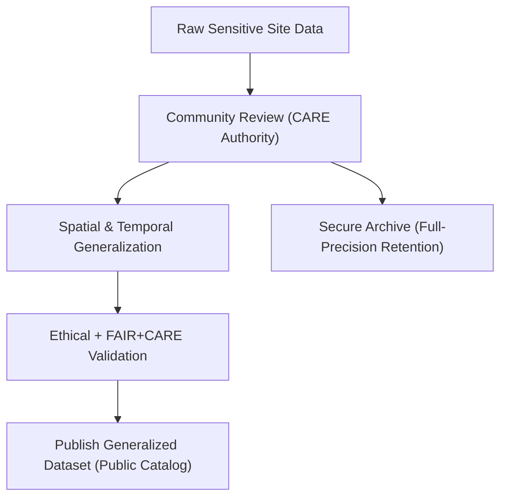

<div align="center">

# 🏺 **Kansas Frontier Matrix — Sensitive Site Data Generalization & CARE Governance Guide**
`docs/standards/data-generalization/README.md`

**Purpose:**  
Define the **ethical, technical, and procedural framework** for **generalizing sensitive archaeological and Indigenous site data** within the Kansas Frontier Matrix (KFM), in compliance with **FAIR+CARE**, **CIDOC CRM**, and **DCAT 3.0**.  
Ensures transparent governance, community authority, and sustainable open data release under **MCP-DL v6.3**.

[](../../../docs/README.md)
[](../../../LICENSE)
[](https://www.gida-global.org/care)
[](../../../releases/v10.0.0/)
</div>

---

## 📘 Overview

This guide specifies **data governance and masking protocols** for publishing archaeological, ecological, or Indigenous datasets where **spatial or temporal precision** may endanger cultural resources or community sovereignty.  
It implements the **CARE Principles** (Collective Benefit, Authority to Control, Responsibility, Ethics) alongside **FAIR** principles to ensure datasets are **open yet protected**, scientifically valuable yet **culturally respectful**.

---

## 🗂️ Directory Layout

```plaintext
docs/standards/data-generalization/
├── README.md                   # Core governance and methodology guide
├── examples/                   # JSON, YAML, and DCAT examples
├── validation/                 # FAIR+CARE compliance reports
├── governance/                 # Oversight policies and MOUs
└── templates/                  # Metadata, anonymization, and masking templates
```

---

## 🧾 Spatial and Temporal Generalization Techniques

| Technique | Description | Example |
|------------|--------------|----------|
| **Coordinate Rounding** | Round coordinates to reduce spatial precision. | `38.913, -95.258 → 38.91, -95.26` |
| **Grid Aggregation** | Aggregate point data to coarse grid centroids. | 1 × 1 km or 10 × 10 km |
| **Random Masking** | Apply random offset within secure buffer. | ± 2 km |
| **Temporal Aggregation** | Replace specific dates with ranges. | “1870s” or “1850–1900 CE” |
| **Site Suppression** | Omit coordinates for sacred or restricted sites. | `"Location withheld"` |

> Use the least intrusive method sufficient to protect sensitive information, prioritizing tribal consent over publication precision.

---

## ⚙️ Metadata & Governance Fields

| Field | Purpose | Example |
|--------|----------|----------|
| `sensitivity_class` | Defines risk level for cultural exposure. | `"High"` |
| `authority_to_control` | CARE governance entity or community steward. | `"Prairie Band Potawatomi Nation"` |
| `access_policy` | Reuse and access constraints. | `"Restricted by MOU"` |
| `ethics_statement` | Notes ethical clearance or CARE review. | `"Released under tribal oversight."` |
| `data_steward` | Responsible custodian within KFM. | `"KFM Heritage Data Council"` |
| `review_cycle` | Frequency of ethical audit. | `"Annual / FAIR+CARE Council"` |

---

## 🧩 FAIR+CARE Integration Checklist

| Principle | Implementation in KFM |
|------------|-----------------------|
| **Collective Benefit** | Data delivers measurable benefit to originating communities. |
| **Authority to Control** | Indigenous partners govern visibility and data use. |
| **Responsibility** | Provenance, consent, and access logged in governance ledger. |
| **Ethics** | Reviewed and signed off by FAIR+CARE Council and cultural authorities. |

---

## 🧾 Example Metadata Record (DCAT 3.0 + CARE Alignment)

```json
{
  "@context": "https://www.w3.org/ns/dcat3.jsonld",
  "id": "kfm-sensitive-site-0001",
  "type": "Dataset",
  "title": "Generalized Indigenous Archaeological Sites of Northeast Kansas",
  "description": "Spatially generalized dataset representing culturally sensitive sites, created under FAIR+CARE governance.",
  "theme": ["Archaeology", "Cultural Heritage"],
  "spatialResolutionInMeters": 1000,
  "temporalResolution": "10 years",
  "sensitivityClass": "High",
  "authorityToControl": {
    "name": "Prairie Band Potawatomi Nation Heritage Department",
    "contactPoint": "heritage@pbpn.gov"
  },
  "accessLevel": "restricted",
  "license": "CC BY-NC 4.0",
  "ethicsStatement": "Released under community review and CARE governance."
}
```

---

## ⚙️ Workflow → Ethical Data Handling



---

## ⚖️ Governance Integration

All workflows must adhere to:

- **Governance Ledger:** `docs/standards/governance/DATA-GOVERNANCE.md`  
- **FAIR+CARE Oversight Council:** `docs/standards/governance/FAIRCARE-COUNCIL.md`  
- **Audit Trails & Reports:** `reports/faircare/` and `reports/audit/`

Every data release includes:
1. Signed community data-sharing agreement (MOU).  
2. Ethical clearance statement with provenance checksum.  
3. Governance ledger entry linking to validation artifacts.  

---

## ♿ Accessibility & CARE Notes

- Public-facing maps must **mask or coarsen coordinates** for high-risk sites.  
- Include **land acknowledgment statements** where datasets are visualized.  
- Respect **Indigenous data sovereignty** — sharing is opt-in, never assumed.  

---

## 🕰️ Version History

| Version | Date | Author | Summary |
|----------|------|--------|----------|
| v10.0.0 | 2025-11-09 | FAIR+CARE Council | Upgraded metadata schema, CIDOC/DCAT 3.0 mapping, and CARE validation flow. |
| v9.7.0  | 2025-11-09 | FAIR+CARE Council | Initial release aligned with FAIR+CARE and CIDOC CRM. |

---

<div align="center">

© 2025 Kansas Frontier Matrix Project  
Master Coder Protocol v6.3 · FAIR+CARE Certified · Diamond⁹ Ω / Crown∞Ω Ultimate Certified  

[Back to Standards Index](../../README.md) · [Governance Charter](../../../docs/standards/governance/ROOT-GOVERNANCE.md)

</div>
