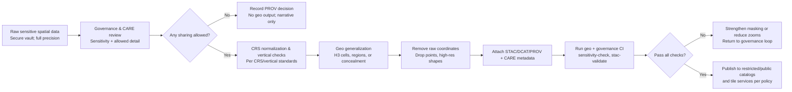

<div align="center">

# 🗺️ **Kansas Frontier Matrix — Geo Generalization Standard for Sensitive Sites (v11.0.0)**  
`docs/standards/data-generalization/geo/README.md`  

**Purpose**  
Define the **geo‑implementation layer** for sensitive‑site generalization in KFM: how spatial masking, H3 generalization, CRS/tiling rules, and STAC/graph metadata are applied so that archaeological, Indigenous, ecological, and other culturally sensitive locations are protected across maps, tiles, Story Nodes, and Focus Mode.  
This standard operationalizes the parent **Sensitive Site Data Generalization & CARE Governance Guide** for the **geospatial stack** (ETL → STAC → Neo4j → API → MapLibre/Cesium → Story Nodes).

</div>

---

## 🗂️ Directory Layout

```text
📂 docs/
└── 📂 standards/
    ├── 📂 data-generalization/
    │   📄 README.md                  # 🏺 Governance + cross-domain generalization standard
    │   📂 geo/
    │   │   📄 README.md              # 🗺️ Geo implementation of sensitive generalization (this file)
    │   │   📂 examples/              # Concrete H3 + donut + tiling examples and configs
    │   │   📂 templates/             # Reusable JSON/YAML snippets for geo pipelines
    │   │   📂 validation/            # Geo-focused CI scenarios, fixtures, and expected outputs
    │   │   📂 story-node/            # Patterns for geo-safe Story Node geometry usage
    │   └── 📂 governance/
    │       📄 LEDGER-INDEX.md        # Pointers to restricted governance/audit artifacts
    └── 📂 geo/
        📄 geoprivacy-masking/README.md           # 🛡 Deterministic donut geomasking standard
        📄 archaeology-sensitive-locations.md     # 🛡 Archaeology & Indigenous sensitivity ladder
        📄 crs-standard.md                        # 🗺 CRS safety baseline
        📄 tiling-and-pyramids.md                 # 🧱 Raster tiling & pyramid rules
        📄 stac-geo-spec.md                       # 🛰 STAC geospatial metadata spec
```

Author rules:

- This README is the **entrypoint** for geo‑specific generalization; it must not conflict with parent governance or geo standards.  
- New example/template/validation files under `geo/` must be referenced here or in a sibling index, and must not introduce looser rules than the parent standards.

---

## 📘 Overview

This geo generalization standard answers:

> “Given that a dataset is sensitive and subject to CARE governance, **how exactly** do we represent it in KFM maps, tiles, STAC, and graph without leaking precise locations?”

It focuses on:

- Spatial generalization primitives: **H3** and **donut geomasking**, and when each is allowed.  
- CRS and tiling constraints so that generalized data behaves correctly in MapLibre/Cesium.  
- STAC/DCAT/graph metadata fields that mark generalized geometry as such.  
- Integration with archaeology, hydrology, and ecology standards where sensitive sites appear.  

The parent `docs/standards/data-generalization/README.md` sets **who decides**, **what is allowed**, and **why**.  
This document sets **how** to implement those decisions in the spatial stack.

---

## 🧭 Context

This standard is downstream from:

- **Sensitive Site Data Generalization & CARE Governance Guide**  
  `docs/standards/data-generalization/README.md` — defines global generalization & CARE rules.

And must stay consistent with:

- **Geoprivacy & Cultural-Safety Masking Standard**  
  `docs/standards/geospatial/geoprivacy-masking/README.md` — deterministic donut masking for points.  

- **Archaeology & Indigenous Sensitive Location Standard**  
  `docs/standards/geo/archaeology-sensitive-locations.md` — sensitivity ladder (L1–L4) and H3 defaults.  

- **CRS, Vertical, STAC, Tiling Standards**  
  `crs-standard.md`, `vertical-axis-and-dod.md`, `stac-geo-spec.md`, `tiling-and-pyramids.md`.

High‑level division of responsibilities:

- **Geoprivacy masking**: precise point → donut‑masked point (still “point‑like”).  
- **Geo generalization (this doc)**: precise point(s)/polygons → H3 cells, regions, or complete concealment for catalogs, tiles, and Story Nodes.  
- **Governance doc**: which category applies, and whether anything can be shared at all.

When in doubt:

- If governance says “withhold”: this doc is only used to document that nothing is exposed.  
- If governance says “coarse generalization allowed”: this doc defines the **minimum technical requirements**.

---

## 📦 Data & Metadata

### 1. Sensitivity → H3 resolution mapping (geo implementation)

This table refines the sensitivity ladder from the archaeology standard for the geo stack:

| Sensitivity Level | Examples                                        | Default H3 Resolution (public) | Notes                                                                 |
|-------------------|-------------------------------------------------|--------------------------------|-----------------------------------------------------------------------|
| **L1** Public Archaeological | Widely published, well-known sites      | r7–r8                          | Still generalized to avoid parcel-level inference.                    |
| **L2** Restricted Archaeological | State/tribal records, moderate risk | r6–r7                          | Often combined with donut masking and attribute suppression.          |
| **L3** Indigenous Cultural Heritage | Tribal landscapes, ceremonial     | r5–r4                          | Coarse H3; use regional polygons in UIs; no point‑like features.      |
| **L4** Sovereignty-Protected       | Burials, sacred, embargoed         | None (concealed)               | No public geometry; only narrative or regional non‑spatial references.|

Rules:

- Values here are **upper bounds** on precision. Governance can always require **coarser** resolutions or full concealment.  
- H3 cells must be rendered as **polygons**, not center points, to avoid implying a precise location inside a hex.  
- For L3/L4, tiles may omit the layer entirely or show only very broad regions, per governance decisions.

### 2. H3 + donut masking interplay

Guidance:

- Donut masking (geomasked points) is intended for **operational internal use** (e.g., ETL tests, vetting) and some **low‑sensitivity public POIs**, not for highly sensitive sites.  
- For high‑sensitivity layers:

  - Public catalogs and tiles should use **H3 generalization or concealment**, not donut‑masked points.  
  - Donut‑masked versions may exist in restricted environments, but must be cataloged as non‑public.

Recommended pattern:

- **L1**: May use donut masking + r7 H3 overlay in restricted tools; public surfaces should prefer H3 polygons in most cases.  
- **L2–L3**: Use H3 polygons only, no donut‑masked points in public.  
- **L4**: No donut‑masked points outside secure vault; no public geometry.

---

### 3. Geo generalization metadata block (dataset level)

For sensitive spatial datasets (STAC Items / internal manifest), include:

```json
{
  "kfm:geo_generalization": {
    "mode": "h3 | concealed | region-only",
    "h3_resolution": 7,
    "coordinates_removed": true,
    "donut_masking_used_in_pipeline": false,
    "geomasking_profile": null,
    "map_rendering_hint": "polygon-centroid-free",
    "notes": "L2 restricted archaeological data; L3/L4 withheld."
  }
}
```

Rules:

- `mode` documents the **strategy** chosen by governance + geo teams.  
- `coordinates_removed` must be `true` for any dataset leaving secure Tier‑1 storage.  
- `map_rendering_hint` helps frontends avoid patterns (like point markers) that appear more precise than allowed.

---

## 🌐 STAC, DCAT & PROV Alignment

### 1. STAC extensions (geo-specific)

In addition to `heritage:*`, `care:*`, and global `soil:`/`hydro:` etc., sensitive geo Items should include:

```json
{
  "kfm:geo_generalization": {
    "mode": "h3",
    "h3_resolution": 7,
    "coordinates_removed": true
  },
  "kfm:h3_generalization": true,
  "kfm:h3_resolution": 7,
  "kfm:coordinates_removed": true,
  "kfm:layer_visibility": "public | restricted | withheld"
}
```

For tiles:

```json
"assets": {
  "tiles": {
    "href": "https://tiles.example.com/sensitive/{z}/{x}/{y}.png",
    "roles": ["tiles"],
    "tms": "WebMercatorQuad",
    "minzoom": 3,
    "maxzoom": 8,
    "kfm:layer_visibility": "restricted",
    "kfm:geo_generalization_ref": "#/properties/kfm:geo_generalization"
  }
}
```

Notes:

- `minzoom` / `maxzoom` must reflect governance decisions — e.g., not allowing high zooms for sensitive layers.  
- `kfm:layer_visibility` ties into API and frontend enforcement.

### 2. DCAT & spatial resolution

DCAT dataset entries must set:

```json
{
  "dcat:spatialResolutionInMeters": 5000,
  "dct:accessLevel": "restricted",
  "dct:provenance": "Geometries generalized to H3 r7 and further masked; raw coordinates withheld."
}
```

`dcat:spatialResolutionInMeters` should be derived from H3 resolution or a coarser governance‑mandated figure, never from original precise geometries.

### 3. PROV‑O activities

Geo generalization must be tracked as a dedicated PROV activity, e.g.:

```json
{
  "prov:activity": "geo-generalization-v11",
  "prov:used": [
    "vault:dataset/kfm-raw-arch-sites-2025"
  ],
  "prov:wasGeneratedBy": "kfm-h3-generalization-pipeline-v3.0.1",
  "prov:generatedAtTime": "2025-12-01T16:20:00Z",
  "prov:wasAssociatedWith": "kfm-faircare-etl-agent",
  "kfm:governance_decision_ref": "council:decision:2025-10-02"
}
```

PROV chains from:

- Raw sensitive dataset (vault) →  
- Governance decision →  
- Geo generalization pipeline →  
- Public/restricted generalized dataset.

---

## 🧱 Architecture

### 1. Geo generalization pipeline (conceptual)



Key enforcement points:

- Raw coordinates never leave A → only generalizations or nothing.  
- Geo normalization (CRS/vertical) occurs **before** generalization to avoid mixing datums.  
- No tiles, layers, or Story Nodes are generated until H passes.

### 2. MapLibre/Cesium rendering constraints

Frontends must:

- Render **H3 polygons** or region outlines, not markers, for sensitive layers.  
- Enforce `minzoom` and `maxzoom` obtained from STAC assets and/or API contracts.  
- Show standard legends indicating generalization, e.g.:

  > “Locations generalized into hexagonal regions for cultural and ecological protection.”

Tile endpoints that do not enforce these constraints must not be used for sensitive datasets.

---

## 🧠 Story Node & Focus Mode Integration

For sensitive geo‑linked narratives:

- Story Node geometries must:

  - Use H3 polygons or broad regions for L1–L3 where allowed.  
  - Use **no geometry** (or very coarse region envelope) for L4 or withheld sites.  

- Story Node metadata should point to:

  - The generalized STAC Item ID.  
  - The applied geo generalization strategy (`mode`, `h3_resolution`).  

- Focus Mode:

  - Must respect `ai_focusmode_usage: "Restricted / Governance-Only"` for this standard.  
  - May **summarize** generalization strategies and governance notes, but not generate new guesses about precise locations.  
  - Must not zoom or pan the map in ways that imply extra precision beyond H3/region boundaries.

If a Story Node attempts to attach a precise point geometry for a dataset flagged as sensitive, geo validation must fail and require correction.

---

## 🧪 Validation & CI/CD

Geo‑specific validation jobs should include:

- **`geo-generalization-schema-lint`**  
  Validate presence and correctness of `kfm:geo_generalization`, `kfm:h3_*`, and sensitivity fields.

- **`geo-sensitivity-check`**  
  Confirm no raw coordinates or geometries are present in public outputs; verify zoom ranges and H3 resolutions are within allowed bounds for each sensitivity level.

- **`stac-geo-validate`**  
  Run STAC validation with KFM profiles, including H3, heritage, and CARE extensions.

- **`tile-config-check`**  
  Ensure tiles for sensitive layers use constrained zoom levels and appropriate MIME types; cross‑check tile endpoints are registered as restricted.

Failures block:

- Generation or publication of STAC catalogs.  
- Registration of tile services.  
- Linking of sensitive layers into Story Node & Focus Mode configuration.

---

## ⚖ FAIR+CARE & Governance

This geo standard operationalizes FAIR+CARE in concrete map behavior:

- **FAIR**

  - Sensitive data remain **discoverable** at high level, with clear labels and caveats.  
  - Spatial generalization is encoded in machine‑readable metadata so tools can correctly interpret resolution constraints.  

- **CARE**

  - Community and tribal **Authority to Control** is baked into zoom levels, H3 resolution, and layer visibility.  
  - The system defaults to **protection**, not maximal detail; reductions in masking require explicit authorization.  
  - Ethics requires that visual representations never undermine previously agreed masking; UI changes that increase apparent precision must go through governance review.

Any proposal to reduce masking, expose new zoom levels, or alter H3 defaults for a given sensitivity level must:

1. Be documented in a PR referencing this standard.  
2. Include evidence of FAIR+CARE Council and relevant tribal/community approval.  
3. Update this document and dependent configs atomically.

---

## 🕰️ Version History

| Version | Date       | Status            | Summary                                                                                               |
|--------:|------------|-------------------|-------------------------------------------------------------------------------------------------------|
| v11.0.0 | 2025-12-06 | Active / Enforced | Initial geo‑implementation standard for sensitive generalization; aligned with v11 geoprivacy & CARE. |

---

<div align="center">

🗺️ **Kansas Frontier Matrix — Geo Generalization Standard for Sensitive Sites (v11.0.0)**  
“When in doubt, widen the hex and deepen the care.”

CC‑BY‑NC 4.0 · FAIR+CARE Council · MCP‑DL v6.3  

[⬅ Back to Sensitive Data Generalization](../README.md) · [🛡 Geoprivacy & Masking](../../geospatial/geoprivacy-masking/README.md) · [⚖ Governance](../../governance/ROOT-GOVERNANCE.md)

</div>

