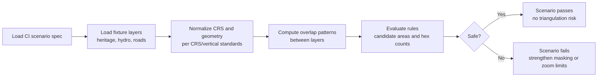

<div align="center">

# 🧪 **Anti-Triangulation CI Scenario (Geo Generalization)**  
`docs/standards/data-generalization/geo/examples/ci-scenarios/anti_triangulation.md`

**Purpose**  
Define a concrete **CI scenario pattern** that detects when multiple generalized geospatial layers (H3, regions, zoom‑limited tiles) can be combined to “triangulate” sensitive sites in violation of CARE governance and geoprivacy standards.  
These examples act as **golden tests**: if real data is more precise or more revealing than this scenario allows, CI must fail and masking must be strengthened.

</div>

---

## 📘 Overview

“Triangulation” in KFM terms means:

> A situation where individually safe, generalized layers — when combined — allow an adversary to narrow possible sensitive site locations to an unacceptably small area, parcel, or feature.

This CI scenario:

- Encodes a **multi‑layer composite map** (heritage, hydro, infrastructure, elevation, etc.).  
- Defines what counts as an **unsafe triangulation outcome**.  
- Provides **expected failure and success cases** so CI can reliably detect regressions.  
- Ties directly into:

  - H3 resolution rules (L1–L4).  
  - Zoom and tiling limits.  
  - STAC/DCAT/PROV generalization metadata.  

The goal is to make triangulation **measurable and testable**, not just a vague risk.

---

## 🧭 Context

This scenario sits at the intersection of:

- 🏺 `docs/standards/data-generalization/README.md`  
  Sensitive Site & CARE Governance rules.  

- 🗺️ `docs/standards/data-generalization/geo/README.md`  
  Geo generalization standard (H3 vs concealment, zoom limits).  

- 🛡️ `docs/standards/geospatial/geoprivacy-masking/README.md`  
  Donut geomasking for point‑level geoprivacy.  

- 🏺 `docs/standards/geo/archaeology-sensitive-locations.md`  
  Sensitivity ladder L1–L4 and baseline H3 resolutions.  

- 🧱 `docs/standards/geo/tiling-and-pyramids.md`  
  Tiling and zoom matrix rules for MapLibre/Cesium.  

The scenario assumes:

- Sensitive heritage features have already been **generalized** (H3, regions) or concealed.  
- Infrastructure and environmental layers are potentially high‑precision.  
- We must ensure that this combination does not reduce uncertainty below governance thresholds.

---

## 📦 Data & Metadata

### 1. Scenario definition (conceptual JSON)

A CI test can read a scenario spec like:

```json
{
  "scenario_id": "geo-antitriangulation-v11-basic",
  "description": "Test that overlapping generalized heritage, hydrology, and road layers cannot uniquely isolate a single H3 cell with site_count=1.",
  "layers": [
    {
      "id": "heritage_h3",
      "type": "h3_hex",
      "sensitivity_level": "L2",
      "h3_resolution": 6,
      "maxzoom": 10,
      "source": "kfm:heritage-generalized-fixture"
    },
    {
      "id": "streams",
      "type": "vector_line",
      "precision_m": 5,
      "maxzoom": 14,
      "source": "kfm:hydro-streams-fixture"
    },
    {
      "id": "roads",
      "type": "vector_line",
      "precision_m": 5,
      "maxzoom": 14,
      "source": "kfm:roads-fixture"
    }
  ],
  "rules": {
    "max_allowed_candidate_area_m2": 500000,
    "min_required_hexes_per_cluster": 3,
    "forbid_single_hex_intersections": true
  },
  "expected_result": "fail_if_any_single_hex_can_be_isolated",
  "governance_ref": "council:decision:example-antitriangulation"
}
```

Interpretation:

- `max_allowed_candidate_area_m2`  
  Minimum acceptable spatial uncertainty (e.g., ~0.5 km²).  

- `min_required_hexes_per_cluster`  
  A safe composite should leave **at least this many** hexes indistinguishable.  

- `forbid_single_hex_intersections`  
  If overlays isolate exactly one H3 cell with heritage presence, CI must fail.

### 2. STAC snippet for a generalized heritage layer used in this scenario

```json
{
  "id": "kfm-heritage-generalized-fixture",
  "properties": {
    "heritage:sensitivity": "L2",
    "kfm:h3_generalization": true,
    "kfm:h3_resolution": 6,
    "kfm:coordinates_removed": true,
    "kfm:geo_generalization": {
      "mode": "h3",
      "h3_resolution": 6,
      "coordinates_removed": true
    }
  }
}
```

The CI scenario asserts that **even with** this H3 resolution, plus other layers, triangulation remains impossible or above the uncertainty threshold.

---

## 🧱 Architecture

### 1. Anti-triangulation analysis flow



Key steps:

- **Overlap analysis**:  

  - For each heritage H3 cell with `site_count > 0`, intersect with:

    - Road segments.  
    - Stream segments.  
    - Other contextual layers (if present in the scenario).  

  - Identify **candidate areas** where all constraints line up (e.g., “near road X, near stream Y, in hex Z”).

- **Risk evaluation**:

  - If any candidate area falls below `max_allowed_candidate_area_m2` and/or corresponds to a **single** hex, mark as unsafe.  
  - The rules are intentionally conservative; governance may choose larger uncertainty thresholds.

### 2. Expected failure patterns

This scenario should **fail** when, for example:

- A single H3 cell at r6:

  - Is the only one intersecting both a particular road and stream combo, and  
  - Has `site_count = 1`, meaning there is exactly one generalized heritage presence in that composite zone.

- Multiple sensitive layers (heritage, sacred hydrology, access roads) create a unique composite “fingerprint” that effectively pinpoints a single parcel or structure.

CI failures must be treated as:

- Signals to **coarsen generalization** (e.g., move from r6 to r5).  
- Or to **reduce visibility** (higher `minzoom`, lower `maxzoom`, or removing certain overlay combinations).

---

## 🧪 Validation & CI/CD

This scenario is intended to drive at least one CI job, for example:

- `geo-antitriangulation-check.yml`

Core test steps:

1. Load the `anti_triangulation.md`‑linked scenario spec (YAML/JSON in `tests/fixtures/...`).  
2. Load fixture layers (e.g., small GeoJSON or H3 cell sets).  
3. Run the overlap and risk rules.  
4. Assert:

   - A **known unsafe fixture** fails (sanity check that detection works).  
   - A **correctly generalized fixture** passes (guard against over‑blocking).

PRs are **blocked** if:

- Unsafe fixture passes (false negative).  
- Safe fixture fails (broken logic or over‑strict thresholds).  
- Scenario metadata is missing or inconsistent with governing standards (e.g., wrong H3 resolution for sensitivity level).

Tracking:

- Each CI run should emit telemetry summarizing:

  - Number of candidate areas evaluated.  
  - Minimum observed candidate area.  
  - Number of failing hexes or clusters.  
  - Decision (`safe` / `unsafe`).

This telemetry can be used to tune thresholds over time, subject to governance approval.

---

## 🕰️ Version History

| Version | Date       | Status            | Summary                                                                                                           |
|--------:|------------|-------------------|-------------------------------------------------------------------------------------------------------------------|
| v11.0.0 | 2025-12-06 | Active / Enforced | Initial anti‑triangulation CI scenario for geo generalization; defines overlap rules and safe vs unsafe outcomes. |

---

<div align="center">

🧪 **KFM v11 — Anti-Triangulation CI Scenario (Geo Generalization)**  
“If combining layers makes a site visible, the scenario must break before the site does.”

CC‑BY‑NC 4.0 · FAIR+CARE Council · MCP‑DL v6.3  

[⬅ Back to CI Scenario Index](README.md) · [🗺 Geo Generalization Standard](../../README.md) · [⚖ Governance](../../../../governance/ROOT-GOVERNANCE.md)

</div>

