<div align="center">

# 🧪 **Mixed-Layer CI Scenario (Geo Generalization)**  
`docs/standards/data-generalization/geo/examples/ci-scenarios/mixed_layers.md`

**Purpose**  
Define CI scenarios that test whether **sensitive generalized layers** (H3, coarse regions) remain safe when rendered alongside **non‑sensitive, high‑precision layers** (parcels, buildings, roads, infrastructure).  
These scenarios ensure that adding detailed context does **not** undo masking decisions or enable site inference in violation of CARE governance.

</div>

---

## 📘 Overview

Even when each layer is individually compliant:

- Sensitive heritage data generalized to H3, and  
- High‑precision context layers (parcels, buildings, roads, DEMs, hydrology),  

their **combination** can:

- Suggest which structure or parcel likely contains a site.  
- Invite map readers to “snap” generalized regions to visible features.  
- Create an **implicit locator** for sensitive places through co‑occurring features.

This CI scenario template encodes:

- How to describe **mixed‑layer maps** in a machine‑checkable way.  
- What counts as an **unsafe precision mismatch** or visual implication of exactness.  
- How CI should respond (block PRs, require coarser generalization or restricted views).

---

## 🧭 Context

This scenario depends on and must stay consistent with:

- 🏺 `docs/standards/data-generalization/README.md`  
  Global sensitive site generalization & CARE governance.  

- 🗺️ `docs/standards/data-generalization/geo/README.md`  
  Geo generalization standard (H3, concealment, zoom limits).  

- 🛡️ `docs/standards/geospatial/geoprivacy-masking/README.md`  
  Donut masking and sensitivity‑driven radii.  

- 🏺 `docs/standards/geo/archaeology-sensitive-locations.md`  
  L1–L4 sensitivity ladder and baseline H3 resolutions.  

- 🧱 `docs/standards/geo/tiling-and-pyramids.md`  
  Tiling, TMS, and zoom matrix rules.  

It is particularly concerned with:

- **Mixed precision**: sensitive layers generalized to kilometers vs. non‑sensitive layers at meter scale.  
- **Visual semantics**: whether styling or layer ordering undermines generalization by suggesting exactness.

---

## 📦 Data & Metadata

### 1. Scenario definition (conceptual JSON)

A CI test can load a mixed‑layer scenario like:

```json
{
  "scenario_id": "geo-mixed-layers-v11-basic",
  "description": "Test that generalized heritage H3 regions remain non-identifiable when combined with parcel and road layers.",
  "sensitive_layer": {
    "id": "heritage_h3",
    "type": "h3_hex",
    "sensitivity_level": "L3",
    "h3_resolution": 5,
    "maxzoom": 9,
    "source": "kfm:heritage-generalized-fixture",
    "kfm:layer_visibility": "restricted"
  },
  "context_layers": [
    {
      "id": "parcels",
      "type": "vector_polygon",
      "precision_m": 1,
      "maxzoom": 16,
      "source": "kfm:parcels-fixture"
    },
    {
      "id": "buildings",
      "type": "vector_polygon",
      "precision_m": 1,
      "maxzoom": 17,
      "source": "kfm:buildings-fixture"
    },
    {
      "id": "roads",
      "type": "vector_line",
      "precision_m": 5,
      "maxzoom": 16,
      "source": "kfm:roads-fixture"
    }
  ],
  "rules": {
    "forbid_single_parcel_intersections": true,
    "max_allowed_parcel_fraction": 0.3,
    "forbid_point-like_markers_on_hexes": true
  },
  "expected_result": "fail_if_hex_overlaps_single_parcel_or_appears_pointlike",
  "governance_ref": "council:decision:example-mixed-layers"
}
```

Interpretation:

- A **safe configuration** must not allow any single parcel or building to be uniquely associated with a generalized heritage H3 region.  
- `max_allowed_parcel_fraction` controls how much of a hex a single parcel is allowed to occupy before it is considered effectively “point‑like” in practice.

### 2. STAC / layer metadata hints

Sensitive generalized layer:

```json
{
  "id": "kfm-heritage-generalized-fixture",
  "properties": {
    "heritage:sensitivity": "L3",
    "kfm:h3_generalization": true,
    "kfm:h3_resolution": 5,
    "kfm:coordinates_removed": true,
    "kfm:layer_visibility": "restricted",
    "kfm:geo_generalization": {
      "mode": "h3",
      "h3_resolution": 5,
      "coordinates_removed": true
    }
  }
}
```

Context layers should declare:

```json
{
  "id": "kfm-parcels-fixture",
  "properties": {
    "kfm:precision_m": 1,
    "kfm:layer_visibility": "public"
  }
}
```

CI can compare `h3_resolution`, `precision_m`, and `layer_visibility` to flag unsafe combinations.

---

## 🧱 Architecture

### 1. Mixed-layer safety analysis flow

```mermaid
flowchart LR
    A[Load mixed-layer scenario spec] --> B[Load sensitive H3 layer + context fixtures]
    B --> C[Normalize CRS / TMS<br/>per CRS & tiling standards]
    C --> D[Compute overlaps<br/>H3 hexes × parcels × buildings × roads]
    D --> E[Evaluate rules<br/>parcel fraction, unique overlaps, visual semantics]
    E --> F{Safe?}
    F -->|Yes| G[Scenario passes<br/>mixed layers acceptable]
    F -->|No| X[Scenario fails<br/>adjust masking, visibility, or zoom limits]
```



Core checks:

1. **Parcel/building overlap uniqueness**  

   - For each heritage H3 cell, compute how many parcels / buildings intersect it.  
   - If **exactly one** parcel intersects a given H3 cell, and overlap area is large, this is effectively identifying that parcel as “the” sensitive location.

2. **Parcel fraction threshold**  

   - Compute overlap area fraction: `parcel_area_in_hex / hex_area`.  
   - If a single parcel occupies more than `max_allowed_parcel_fraction` (e.g., >0.3–0.5) of the hex, it may be effectively revealing.

3. **Visual semantics / point‑like appearance**  

   - If styling config (where available) replaces polygons with markers at high zoom, mark scenario unsafe.  
   - If MapLibre style uses circle markers centered on H3 centroids at zooms > allowed, treat as point‑like leakage.

### 2. Expected failure patterns

The scenario should **fail** when:

- A single building footprint effectively “fills” an H3 hex that is known to contain a sensitive site.  
- A sensitive H3 cell is visible at a zoom level where individual structures and parcels are crisp and unambiguously identifiable.  
- Styling draws a **point marker** (icon) for a hex, especially when:

  - Context layers are highly detailed.  
  - Tooltip language implies a single discrete location.

CI failures must prompt:

- Coarsening H3 resolution (r5 → r4, etc.).  
- Limiting `maxzoom` for the sensitive layer, **or**  
- Hiding the sensitive layer entirely beyond a given zoom.

---

## 🧪 Validation & CI/CD

This scenario supports a CI job such as:

- `geo-mixed-layers-check.yml`

Typical steps:

1. Load `mixed_layers` scenario spec (YAML/JSON) under test fixtures.  
2. Load geometry fixtures for:

   - `heritage_h3` (fake hexes, site_count indicators).  
   - `parcels`, `buildings`, `roads` (fake but realistic geometry distribution).  

3. Run overlap and fraction analysis:

   - Ensure the **known unsafe fixture** fails  
     (e.g., hex that overlaps a single large parcel and one structure).  

   - Ensure a **corrected fixture** passes  
     (e.g., same area generalized to coarser H3 or restricted zoom levels).  

4. Optionally inspect style documents (if declarative) to check:

   - No icons/point markers for sensitive hexes at high zoom.  
   - Legends correctly communicate generalization.

A PR is **blocked** if:

- Unsafe fixture passes (false negative).  
- Safe fixture fails (incorrect logic or thresholds).  
- Scenario documents contradict governing standards (e.g., using an H3 resolution too fine for L3/L4).

CI telemetry for this job should include:

- Count of sensitive hexes evaluated.  
- Distribution of `num_parcels_per_hex` and `max_parcel_fraction`.  
- List of hex IDs (or anonymized labels) that triggered failure conditions.

---

## 🕰️ Version History

| Version | Date       | Status            | Summary                                                                                                         |
|--------:|------------|-------------------|-----------------------------------------------------------------------------------------------------------------|
| v11.0.0 | 2025-12-06 | Active / Enforced | Initial mixed‑layer CI scenario for geo generalization; defines parcel/hex overlap rules and zoom‑precision checks.|

---

<div align="center">

🧪 **KFM v11 — Mixed-Layer CI Scenario (Geo Generalization)**  
“If the map makes a site look obvious, the test must say ‘no’ before anyone else can.”

CC‑BY‑NC 4.0 · FAIR+CARE Council · MCP‑DL v6.3  

[⬅ Back to CI Scenario Index](README.md) · [🗺 Geo Generalization Standard](../../README.md) · [⚖ Governance](../../../../governance/ROOT-GOVERNANCE.md)

</div>

